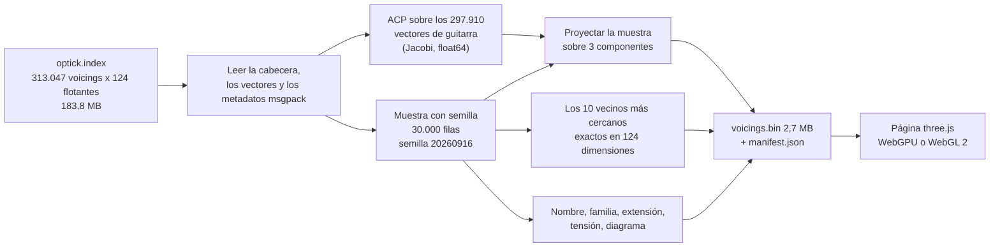

import LazyDemo from '../../../../components/LazyDemo.astro';

El índice fijado de Guitar Alchemist guarda cada voicing como un vector compacto de 124 números, extraído del embedding OPTIC-K de 240 dimensiones. Este prototipo muestra una muestra fija de 30.000 de sus 297.910 voicings de guitarra como una nube de puntos que se puede girar, señalar y escuchar, y luego mide qué parte del espacio real muestra la imagen. La respuesta corta: un buen mapa, y una mala guía del vecindario.

<LazyDemo
	path="ga-lab/p1/"
	title="Explorador del espacio de voicings de GA"
	screenshot="ga-lab/p1-explorer.png"
	alt="Una nube de puntos de colores sobre fondo oscuro, con un panel que muestra un diagrama de acorde abierto y sus diez voicings más cercanos"
	label="Cargar el explorador (3,7 MB)"
	note="La imagen de vista previa se carga con la lección; el explorador y sus datos solo se cargan después del clic. La interfaz de la demo está en inglés. Arrastre para girar, pase el puntero para nombrar un voicing, haga clic para seleccionarlo y oírlo. Página completa:"
/>

En la versión publicada, los diez vecinos se buscan entre los **30.000 voicings de la muestra**, no en todo el índice. Los filtros ocultan puntos de la nube sin recalcular esa lista; la selección y sus vecinos resaltados pueden seguir visibles a pesar de un filtro. En pantallas pequeñas, abra la página completa para disponer de más espacio. Si WebGPU no funciona, pruebe la [versión WebGL 2](https://spareilleux.github.io/learn/ga-lab/p1/?webgl).

La página publicada pesa 3,7 MB: 2,7 MB de voicings, 0,9 MB de JavaScript con three.js, y un manifiesto. Cada cifra de esta lección viene de [`code/ga-protos/p1-voicing-explorer`](https://github.com/spareilleux/learn/tree/main/code/ga-protos/p1-voicing-explorer), y las hipótesis se [confirmaron en un commit](https://github.com/spareilleux/learn/blob/03f2bbb/code/ga-protos/p1-voicing-explorer/results/hypotheses.md) antes de las mediciones.

## Lo que ya conoce: un índice vectorial

Si ha usado la [búsqueda vectorial de Azure AI Search](https://learn.microsoft.com/azure/search/vector-search-overview) o la [búsqueda de los k vecinos más cercanos de Elasticsearch](https://www.elastic.co/docs/solutions/search/vector/knn), ya conoce la forma del índice de voicings de GA. Cada documento se convierte en un vector; una consulta también; la respuesta son los `k` documentos cuyos vectores obtienen la mejor puntuación frente a ella. En C#, el núcleo del cálculo es un bucle de llamadas a [`TensorPrimitives.Dot`](https://learn.microsoft.com/dotnet/api/system.numerics.tensors.tensorprimitives.dot) y una cola de prioridad de los `k` mejores.

Dos cosas cambian cuando se quiere *mirar* el índice en lugar de consultarlo.

- Una pantalla tiene dos dimensiones, una vista 3D tiene tres. Los vectores tienen 124. Hay que proyectarlos, y una proyección pierde información.
- Un servicio de búsqueda responde a «¿qué está cerca de esto?». Una imagen invita a la misma pregunta, a ojo: los puntos dibujados junto a un voicing parecen sus vecinos. Si de verdad lo son se puede medir, y es la medición principal de esta lección.

## OPTIC-K en un párrafo

La representación de GA está construida a mano, no aprendida. El [curso sobre la IA de GA](../../ga-ai/02-optic-k-embeddings/) la desmonta: 240 números con nombre repartidos en 11 particiones, de las cuales 6 particiones y 124 números cuentan para la similitud. STRUCTURE describe el conjunto de clases de altura (su croma, su vector de intervalos), MORPHOLOGY la forma en el mástil, CONTEXT la función armónica, SYMBOLIC las etiquetas de técnica, MODAL los modos a los que pertenece el acorde, ROOT la fundamental. Cada partición se normaliza y se multiplica por la raíz cuadrada de su peso (0,45, 0,25, 0,20, 0,10, 0,10, 0,05), de modo que un solo producto escalar da la suma ponderada de los cosenos por partición, 1,15 como máximo. La [lección 3](../../ga-ai/03-index-and-search/) de ese curso lee el índice binario byte a byte, y el [apéndice OPTIC](../../music-theory-ga/appendix-optic/) del curso de teoría musical explica las equivalencias que le dan nombre.

## Los datos, fijados

La rama `main` de GA estaba en [`66bdd049`](https://github.com/GuitarAlchemist/ga/tree/66bdd049ad3f4b10f996e4cc6a9c6e58797cf30e). El archivo del índice no está en el repositorio: `FretboardVoicingsCLI --export-embeddings` lo genera. Una sesión que trabajaba en el rendimiento de GA había compilado esa herramienta en ese commit y exportado el índice 25 minutos antes; leí ese archivo sin reconstruirlo, y lo fijé por su huella:

| | |
|---|---|
| archivo | `optick.index`, 183.770.270 bytes |
| SHA-256 | `1e91e4695bab8aa4bb451fdd1f199a4afaa4c4ad913f08acc5163c6ab07caa23` |
| voicings | 313.047: 297.910 de guitarra, 7.795 de bajo, 7.342 de ukelele |
| dimensiones | 124, huella de esquema `0x37cd8ecf` |
| exportación | 688.351 voicings en bruto, 313.047 conservados tras la deduplicación, 149 s |

La misma sesión exportó el índice una segunda vez con la misma compilación. [`compare-indexes.mjs`](https://github.com/spareilleux/learn/blob/main/code/ga-protos/p1-voicing-explorer/scripts/compare-indexes.mjs) empareja las dos exportaciones voicing a voicing:

```text
{"small":313047,"big":313047,"identical":312977,"differ":0,"missing":70,"vectorFound":313011,"sameName":312977,"maxAbsDifference":0}
```

Cada vector presente en ambas es idéntico bit a bit, pero 70 voicings de una exportación no están en la otra. La exportación deduplica los voicings que comparten una forma de trastes y un conjunto de clases de altura, y conserva el más fácil de tocar ([`Program.cs`, líneas 759-787](https://github.com/GuitarAlchemist/ga/blob/66bdd049ad3f4b10f996e4cc6a9c6e58797cf30e/Demos/Music%20Theory/FretboardVoicingsCLI/Program.cs#L759-L787)); el generador corre en paralelo, y cuando dos candidatos cuestan lo mismo, gana el primero que llega. Así que «el índice en el commit `66bdd049`» no es un solo archivo: es la huella la que fija los datos.

### Qué cuerda va primero

El índice guarda cada diagrama como texto. La fila 1000 dice:

```text
diagram "1-2-x-5-x-1", midiNotes [65, 61, 55, 41], quality_inferred "Gm7b5/F"
```

Leído desde la cuerda de mi agudo, `1` es un fa 4, MIDI 65, la primera nota de la lista. Leído desde el mi grave, `1` sería un fa 2, MIDI 41, la última. **El índice de GA escribe primero la cuerda 1, el mi agudo.** Un guitarrista escribe la misma forma con el mi grave primero, `1x5x21`. El [componente React `FretDiagram`](https://github.com/GuitarAlchemist/ga/blob/66bdd049ad3f4b10f996e4cc6a9c6e58797cf30e/ReactComponents/ga-react-components/src/components/FretDiagram.tsx#L8-L11) del propio GA y su [analizador `FretDiagram.cs`](https://github.com/GuitarAlchemist/ga/blob/66bdd049ad3f4b10f996e4cc6a9c6e58797cf30e/Common/GA.Business.ML/Agents/FretDiagram.cs#L14) esperan el mi grave primero. El prototipo conserva el orden de GA en sus datos y convierte una sola vez, en [`voicing.mjs`](https://github.com/spareilleux/learn/blob/main/code/ga-protos/p1-voicing-explorer/src/lib/voicing.mjs), y el paso de construcción comprueba cada fila de la muestra: el diagrama leído con el mi agudo primero debe devolver las notas MIDI del índice. Encontró 0 discrepancias en 30.000 filas, y una prueba unitaria fija la fila 1000.

## La cadena de construcción



[`build-data.mjs`](https://github.com/spareilleux/learn/blob/main/code/ga-protos/p1-voicing-explorer/scripts/build-data.mjs) es Node.js puro, sin dependencias:

```bash
cd code/ga-protos/p1-voicing-explorer
node scripts/build-data.mjs --index G:/learn-33/ga-p1/optick.index --out public/data --ga-sha 66bdd049ad3f4b10f996e4cc6a9c6e58797cf30e
```

```text
sampled 30000 of 297910 guitar voicings with seed 20260916
PCA on 297910 vectors: 11 Jacobi sweeps, first 3 components explain 22.2 %
exact 10-NN of 30000 voicings in 124 dimensions: 84.9 s
checks: {"midiMismatches":0,"stringCountMismatches":0}
PCA explained variance, first 3 components: 8.8 %, 8.2 %, 5.3 %
wrote public\data\voicings.bin (2670024 bytes) and manifest.json (3380 chord names)
timings: openMs 48, pcaMs 1291, knnMs 84876, totalMs 86348
```

Cada paso está elegido para dar los mismos bytes en todas las máquinas.

- **El lector** ([`optick.mjs`](https://github.com/spareilleux/learn/blob/main/code/ga-protos/p1-voicing-explorer/src/lib/optick.mjs)) sigue la disposición de `OptickIndexReader`, y recalcula la huella de esquema como el CRC-32 de la cadena de disposición: un archivo escrito con otra disposición se rechaza.
- **La ACP** ([`pca.mjs`](https://github.com/spareilleux/learn/blob/main/code/ga-protos/p1-voicing-explorer/src/lib/pca.mjs)) construye la matriz de covarianza de 124 × 124 en `float64` y la diagonaliza con rotaciones de Jacobi cíclicas, el método de la [lección 5](../../machine-learning-ix/05-dimensionality-reduction/) del curso IX. El signo de un vector propio es arbitrario, así que cada uno se invierte hasta que su mayor componente sea positiva: sin eso, una reconstrucción podría dar la nube en espejo. Una prueba ajusta dos veces los mismos datos y compara los bits.
- **La muestra** ([`sample.mjs`](https://github.com/spareilleux/learn/blob/main/code/ga-protos/p1-voicing-explorer/src/lib/sample.mjs)) es una mezcla de Fisher-Yates parcial dirigida por mulberry32, un generador escrito solo con `Math.imul`, de modo que ningún redondeo de coma flotante puede variar entre plataformas. La prueba fija las primeras filas que elige la semilla 20260916: 4, 10, 42, 47, 52.
- **Los vecinos** ([`knn.mjs`](https://github.com/spareilleux/learn/blob/main/code/ga-protos/p1-voicing-explorer/src/lib/knn.mjs)) son exactos: cada par de los 30.000 voicings, 900 millones de productos escalares, 85 segundos en un solo hilo. Los empates van a la fila más baja, como en el `OptickSearchStrategy` de GA.
- **El archivo** ([`format.mjs`](https://github.com/spareilleux/learn/blob/main/code/ga-protos/p1-voicing-explorer/src/lib/format.mjs)) es una cabecera de 24 bytes seguida de arrays tipados, cada uno alineado a 4 bytes, para que la página los lea en su sitio: posiciones en `Float32Array`, trastes en `Int8Array`, identificadores de nombres y de vecinos en `Uint16Array`, puntuaciones en `Float32Array`. Los 3.380 nombres de acordes distintos, las familias y la procedencia van en `manifest.json`.

La muestra publicada contiene 30.000 de los 297.910 voicings de guitarra, el 10 %. El bajo y el ukelele quedan fuera: sus diagramas tienen cuatro cuerdas, y la página dibuja diagramas de guitarra.

## La página

[`main.js`](https://github.com/spareilleux/learn/blob/main/code/ga-protos/p1-voicing-explorer/src/main.js) usa el `WebGPURenderer` de three.js, que recurre a WebGL 2 cuando falta WebGPU, como en el [curso de three.js](../../threejs/01-scene-camera-renderer/).

- **Los puntos.** WebGPU dibuja las primitivas de tipo punto con un solo píxel de ancho, se pida el tamaño que se pida ([`PointsNodeMaterial`](https://threejs.org/docs/pages/PointsNodeMaterial.html) lo dice). Por eso la página dibuja un solo [`Sprite`](https://threejs.org/docs/pages/Sprite.html), 30.000 veces: su material lee la posición, el color y la visibilidad de cada instancia en atributos instanciados, y una expresión TSL sobre las coordenadas de textura del cuadrilátero lo hace redondo. Filtrar pone a cero el tamaño de una instancia: un pequeño envío de búfer, ninguna geometría nueva.
- **El color.** Por familia de acordes (mayor, menor, séptima dominante… o «nombrado solo por clase de conjunto» cuando GA no tiene símbolo de acorde), por la medida de tensión, por la posición en el mástil, o por el número de notas.
- **La selección.** Cuando el puntero se mueve, la página proyecta cada punto visible con la matriz de la cámara y se queda con el más cercano a menos de 8 píxeles: un simple bucle sobre un `Float32Array`, como se escribiría en C#.
- **El diagrama** está portado del `FretDiagram.tsx` de GA a un lienzo 2D, geometría y regla del traste inicial incluidas, y recibe los trastes convertidos con el mi grave primero.
- **El sonido** es una síntesis [Karplus-Strong](https://en.wikipedia.org/wiki/Karplus%E2%80%93Strong_string_synthesis) en [`synth.mjs`](https://github.com/spareilleux/learn/blob/main/code/ga-protos/p1-voicing-explorer/src/lib/synth.mjs): una línea de retardo de un periodo de largo, llena de ruido, realimentada a través de la media de dos muestras vecinas. Esa media es un filtro paso bajo: los parciales agudos se apagan primero, como en una cuerda real. Las notas empiezan con 35 ms de separación, la cuerda grave primero, y las muestras van a la [Web Audio API](https://developer.mozilla.org/docs/Web/API/Web_Audio_API) en un solo búfer.
- **Los vecinos** listados a la derecha son los diez precalculados, con la puntuación de GA y su distancia en la vista 3D. Unas líneas amarillas los unen al voicing en la nube.

Los filtros de extensión y de tensión usan dos valores calculados por el paso de construcción. La extensión es la distancia entre la nota pisada más baja y la más alta. La tensión no es la de GA: STRUCTURE tiene una casilla «tensión», pero el índice la guarda normalizada con su partición, y el valor no se puede recuperar. En su lugar, el prototipo cuenta los semitonos, los tonos y los tritonos del conjunto de clases de altura: 0 para una tríada mayor, 2 para una séptima dominante.

## Mediciones

[`measure.mjs`](https://github.com/spareilleux/learn/blob/main/code/ga-protos/p1-voicing-explorer/scripts/measure.mjs) tarda unos dos minutos en un solo hilo y escribe [`results/measurements.json`](https://github.com/spareilleux/learn/blob/main/code/ga-protos/p1-voicing-explorer/results/measurements.json):

```bash
node scripts/measure.mjs --index G:/learn-33/ga-p1/optick.index
```

Elige 2.000 voicings de consulta entre los 30.000 con la semilla 20260917, encuentra sus 10 vecinos más cercanos exactos por producto escalar en 124 dimensiones, y los compara con los 10 más cercanos por distancia euclídea tras proyectar sobre 2, 3, 10 o 32 componentes principales. La exhaustividad a 10 es la fracción de los diez vecinos verdaderos que aparecen entre los diez vecinos proyectados.

### Lo que explican los tres ejes

| Componentes | 1 | 2 | 3 | 10 | 32 | 64 |
|---|---|---|---|---|---|---|
| Varianza explicada | 8.8 % | 17.0 % | 22.2 % | 48.0 % | 84.7 % | 99.9 % |

Los dos primeros ejes son la forma. Los cuadrados de los coeficientes de la primera componente son un 85 % MORPHOLOGY y un 12 % ROOT; los de la segunda, un 83 % y un 13 %; la tercera es un 84 % STRUCTURE, las clases de altura. CONTEXT no contribuye a ninguna: es la misma constante para todos los voicings, un hallazgo que también hizo el curso sobre la IA de GA. Hacia 64 componentes se alcanza el 99,9 % de la varianza: los 124 números viven en realidad en unas sesenta dimensiones.

### ¿Los vecinos en pantalla son los vecinos verdaderos?

| Exhaustividad a 10 | ACP 2 | ACP 3 | ACP 10 | ACP 32 |
|---|---|---|---|---|
| dentro de la muestra de 30.000 | 0.036 | 0.168 | 0.438 | 0.693 |
| frente a los 297.910 voicings de guitarra | 0.168 | 0.348 | 0.765 | 0.787 |

En la vista del explorador, aproximadamente uno de cada seis de los diez puntos más cercanos a un voicing es uno de sus diez vecinos verdaderos. Las líneas amarillas lo muestran: cruzan la nube.

Una segunda medida hace una pregunta de músico: ¿los vecinos de un voicing pertenecen a la misma familia de acordes?

| Misma familia entre los 10 vecinos | exactos, 124 dim. | ACP 3 | ACP 10 | ACP 32 |
|---|---|---|---|---|
| dentro de la muestra | 61.3 % | 36.9 % | 73.0 % | 60.5 % |
| frente a todos los voicings de guitarra | 96.5 % | 60.6 % | 96.9 % | 95.3 % |

Diez componentes conservan vecindarios tan coherentes musicalmente como el espacio completo, y algo más dentro de la muestra.

### Los empates

Para el 10,1 % de las consultas dentro de la muestra, y el 47,4 % frente al índice completo, el 10.º y el 11.º vecinos verdaderos tienen la misma puntuación. La causa es más profunda que un redondeo: **121.768 de los 297.910 vectores de guitarra (40,9 %) son copias exactas del vector de otro voicing**, bit a bit. Hay 176.142 vectores distintos, y el grupo más grande reúne 12 voicings: `5-1-2-4-2-x`, `5-1-4-4-2-x`, `5-1-4-4-x-2`… todos un acorde de fa sostenido disminuido con la arriba, sobre si, sobre do o sin bajo. Voicings con el mismo conjunto de clases de altura, la misma nota aguda y una forma de mano parecida son indistinguibles para OPTIC-K. El «top 10» es entonces una elección entre iguales, y la medición también da una exhaustividad que cuenta como encontrado a todo vecino cuya puntuación alcance la del 10.º: 0,354 en lugar de 0,348 para tres componentes frente al índice completo.

### Los diagramas

El `FretDiagram` de GA muestra cinco trastes, y empieza en la cejuela cuando la nota pisada más baja está en el traste 1 o 2 ([línea 31](https://github.com/GuitarAlchemist/ga/blob/66bdd049ad3f4b10f996e4cc6a9c6e58797cf30e/ReactComponents/ga-react-components/src/components/FretDiagram.tsx#L31)). Un voicing que va del traste 2 al 6 necesita seis filas, y la [línea 104](https://github.com/GuitarAlchemist/ga/blob/66bdd049ad3f4b10f996e4cc6a9c6e58797cf30e/ReactComponents/ga-react-components/src/components/FretDiagram.tsx#L104) descarta sin avisar el punto que no cabe. En todo el índice de guitarra, **15.853 voicings (5,32 %) pierden al menos un punto**. El portado conserva la regla, para que el explorador muestre lo que muestra GA; el ejercicio 4 la corrige.

### El tiempo de fotograma

[`probe.mjs`](https://github.com/spareilleux/learn/blob/main/code/ga-protos/p1-voicing-explorer/scripts/probe.mjs) abre la página en el Chromium 153 sin interfaz de Playwright, a 1280 × 720, renderiza 10 fotogramas de calentamiento, luego 120 fotogramas mientras gira la cámara, y da tres tiempos por fotograma: el tiempo **de pared**, desde `render()` hasta que la GPU anuncia que ha terminado ([`onSubmittedWorkDone`](https://developer.mozilla.org/docs/Web/API/GPUQueue/onSubmittedWorkDone) en WebGPU, un `readPixels` de un píxel en WebGL 2); el tiempo **de CPU**, solo la llamada a `render()`; y la **pasada de GPU**, la pasada de render en sí, medida con las consultas de marca de tiempo de la GPU. [`frame-series.sh`](https://github.com/spareilleux/learn/blob/main/code/ga-protos/p1-voicing-explorer/scripts/frame-series.sh) lanza la serie. La máquina tiene una NVIDIA RTX 5080 con el controlador 610.88; WebGPU usa su adaptador «blackwell», y WebGL 2 pasa por ANGLE sobre Direct3D 11. Medianas, en milisegundos:

| Puntos | Backend | Dibujados como | Pared | CPU | Pasada de GPU | Selección |
|---|---|---|---|---|---|---|
| 30,000 | WebGPU | sprites | 3.5 | 0.3 | 0.066 | 0.2 |
| 30,000 | WebGL 2 | sprites | 0.9 | 0.3 | 0.071 | 0.1 |
| 30,000 | WebGPU | puntos de un píxel | 3.5 | 0.3 | 0.066 | 0.2 |
| 297,910 | WebGPU | sprites | 3.6 | 0.3 | 0.262 | 1.4 |
| 297,910 | WebGL 2 | sprites | 1.1 | 0.3 | 0.276 | 1.3 |
| 1,000,000 aleatorios | WebGPU | sprites | 3.7 | 0.3 | 0.786 | 4.8 |
| 1,000,000 aleatorios | WebGL 2 | sprites | 1.8 | 0.3 | 0.832 | 4.4 |
| 3,000,000 aleatorios | WebGPU | sprites | 4.4 | 0.3 | 2.294 | 14.1 |

Las líneas en bruto están en [`results/frame-times.jsonl`](https://github.com/spareilleux/learn/blob/main/code/ga-protos/p1-voicing-explorer/results/frame-times.jsonl). Destacan tres cosas.

- **La escena casi no cuesta nada.** Dibujar 30.000 cuadriláteros lleva 66 microsegundos de GPU, y el coste crece más o menos con el número de puntos: 0,26 ms para 300.000, 2,3 ms para 3 millones. En la CPU se queda en 0,3 ms, porque la nube es siempre una sola llamada de dibujo.
- **El tiempo de pared mide la espera, no el trabajo.** El tiempo de pared de WebGPU se queda en 3,5 ms sea cual sea el número de puntos, 50 veces la pasada de render: es lo que tarda `onSubmittedWorkDone` en volver en este navegador, no lo que tarda la GPU en dibujar. Mi primera serie solo usaba esa cifra, y en ella WebGPU parecía cuatro veces más lento que WebGL 2. Las consultas de marca de tiempo muestran que los dos backends hacen el mismo trabajo.
- **La selección crece linealmente, y es lo primero que se rompe.** Proyectar cada punto en la CPU cuesta 1,4 ms con 300.000 puntos y 14 ms con 3 millones, la mayor parte de un fotograma a 60 Hz. La página hace como mucho una selección cada 40 ms mientras se mueve el puntero.

En la primera serie, `renderer.info.render.drawCalls` mostraba 434, y luego números negativos: three.js pone ese contador a cero al principio de cada fotograma de animación, y las esperas de la sonda cruzan fotogramas. La tabla omite ese recuento en lugar de mostrar uno falso.

### Hipótesis frente a resultados

| | Predicción, escrita primero | Resultado | Veredicto |
|---|---|---|---|
| H1 | 3 componentes explican menos del 30 % | 22,2 % | acertada, pero vista antes de escribirla |
| H2 | exhaustividad a 10 de la vista 3D por debajo de 0,15 en la muestra; por encima de 0,6 con 32 componentes | 0,168; 0,693 | fallida por poco; acertada |
| H3 | exhaustividad peor frente al índice completo que dentro de la muestra; puntuación del 10.º vecino al menos 0,05 más alta | mejor (0,348 frente a 0,168); +0,051 | fallida; acertada por los pelos |
| H4 | 10.º y 11.º vecinos empatados para más del 5 % de los voicings | 10,1 % en la muestra, 47,4 % en el índice | acertada, y la causa (40,9 % de vectores duplicados) no estaba prevista |
| H5 | 30.000 puntos por debajo de 2 ms de tiempo de GPU, todos los voicings de guitarra por debajo de 5 ms; WebGL 2 a menos de un factor 2 de WebGPU | pasada de render de 0,066 ms y 0,262 ms; WebGL 2 a un 8 % | acertada, una vez usado el reloj correcto |
| H6 | selección por debajo de 5 ms para 30.000 puntos, por encima de 16 ms para 297.910 | 0,2 ms; 1,4 ms, con un bucle de proyección en lugar de `Raycaster` | acertada; fallida, 10 veces más rápida de lo que pensaba |
| H7 | más del 1 % de los diagramas pierden un punto | 5,32 % | acertada |

H3 falló por una razón que vale la pena conservar. Razonaba así: los vecinos verdaderos de un voicing de la muestra están casi todos fuera de ella, así que la muestra saldría peor. Pero la exhaustividad compara dos listas de vecinos *dentro del mismo conjunto de candidatos*. Frente al índice completo, los vecinos verdaderos están tan cerca (puntuación media del 10.º: 1,107 sobre 1,15) que son casi duplicados, y los casi duplicados siguen cerca unos de otros en cualquier proyección. En una muestra dispersa, los diez más cercanos están más lejos y más repartidos, y la proyección los mezcla.

## Modo local: todo el índice de guitarra

La página publicada se detiene en 30.000 voicings. La misma página puede cargar los 297.910, con sus vectores de 124 dimensiones, y buscar los vecinos en el navegador. Esos datos pesan 156 MB y se quedan en su máquina:

```bash
node scripts/build-data.mjs --index G:/learn-33/ga-p1/optick.index --out public/data-full --sample 297910 --k 0 --with-vectors --ga-sha 66bdd049ad3f4b10f996e4cc6a9c6e58797cf30e
npm run dev
# luego abra http://localhost:5198/?data=data-full
```

`--k 0` omite el precálculo de los vecinos, que llevaría unas 100 veces los 85 segundos de la muestra; en su lugar, la página calcula los diez vecinos del voicing pulsado, sobre todos los vectores. Medido con la sonda en la misma máquina: cargar y decodificar los 156 MB desde el servidor local lleva 341 ms, el montón de JavaScript ocupa 180 MB, la pasada de render sigue en 0,26 ms, y encontrar los diez vecinos exactos de un voicing pulsado entre 297.910 vectores lleva 28 ms en el navegador, en un solo hilo. Por encima de un millón de voicings, esa búsqueda, como la selección, necesitaría un hilo de trabajo aparte o la GPU.

## Lo que funcionó, lo que no

**Lo que funcionó.** El paso de construcción es rápido, salvo los vecinos exactos, y determinista, con una prueba para cada pieza. Los sprites instanciados dibujan todos los puntos en una sola llamada de dibujo, e incluso 3 millones de puntos dejan libre la mayor parte de un fotograma a 60 Hz. La comprobación del orden de las cuerdas no encontró nada, y de eso se trata: el orden ahora se prueba en lugar de suponerse. Y la página es divertida: saltar de vecino en vecino escuchándolos es una buena manera de sentir lo que OPTIC-K llama «similar».

**Lo que no funcionó.**

- **La vista 3D es un mapa, no un vecindario.** Un 22 % de la varianza y una exhaustividad de 0,17 significan que los puntos dibujados juntos, la mayoría de las veces, no son vecinos en el espacio de GA. Por eso el panel lista los vecinos verdaderos en lugar de fiarse de la imagen, y las líneas hacen visible el desacuerdo.
- **Los ejes muestran sobre todo la forma en el mástil.** Coloree por familia, y las familias se solapan; coloree por posición en el mástil, y aparecen degradados. Una proyección ajustada solo sobre STRUCTURE mostraría mejor la armonía: es el ejercicio 2.
- **Mis hipótesis H3 y H6 fallaron**, y H2 no alcanzó su umbral.
- **Mi primera serie de tiempos de fotograma medía lo que no era.** Cronometraba `render()` más `onSubmittedWorkDone`, y daba WebGPU a 3,5 ms y WebGL 2 a 0,5 ms para la misma escena. La segunda serie añadió las consultas de marca de tiempo de la GPU, que mostraron el mismo trabajo de 0,07 ms en los dos. La primera serie se conserva en [`results/frame-times-run1.jsonl`](https://github.com/spareilleux/learn/blob/main/code/ga-protos/p1-voicing-explorer/results/frame-times-run1.jsonl).
- **Una exportación parcial no puede comprobar la procedencia.** Intenté confirmar el índice regenerando 3.000 voicings con la herramienta de GA (`--export-max 3000`). El límite se detiene tras los 3.000 primeros voicings en bruto en orden de generación, que empezaba en el traste 19; la deduplicación, dentro de ese conjunto pequeño, conservó 2.641 voicings altos en el mástil, y ninguno de sus vectores existe en el índice completo, donde ganaron formas más fáciles, más abajo en el mástil. La comprobación que funcionó fue comparar dos exportaciones completas.
- **UMAP no se probó.** Conservaría mejor los vecindarios locales que la ACP, a costa del determinismo entre versiones de la biblioteca, y de una dependencia. Es el ejercicio 6.

## Ejercicios

1. La página colorea por familia de acordes. Con `manifest.json`, cuente cuántos de los 3.380 nombres de acordes están «nombrados solo por clase de conjunto o por intervalo», y cuántos voicings de la muestra los llevan.
2. Ajuste la ACP solo sobre la partición STRUCTURE (dimensiones compactas 0 a 23) en lugar de las 124 dimensiones. Prediga primero: ¿la exhaustividad a 10 frente a los vectores completos subirá o bajará, y se separarán mejor las familias?
3. El paso de construcción guarda los identificadores de vecinos en `Uint16Array` para 30.000 voicings. ¿Hasta qué tamaño de muestra funciona, y qué hace `format.mjs` más allá?
4. Corrija la regla de diagrama de GA para que nunca se pierda un punto, manteniendo cinco filas. Mida cuántos de los 297.910 voicings siguen perdiendo un punto.
5. Explique por qué dos voicings con la misma puntuación frente a una consulta pueden estar en lugares distintos de la vista 3D.
6. Añada UMAP (por ejemplo el paquete `umap-js`) con una semilla fija como segunda proyección. ¿Qué habría que fijar para que la construcción siga siendo determinista, y cómo lo probaría?
7. La medida de tensión cuenta los pares de notas a un semitono, un tono o un tritono de distancia, por clase de altura. ¿Cuáles son la tensión más baja y la más alta posibles para un acorde de cuatro clases de altura distintas, y qué acordes las alcanzan?

<details>
<summary>Soluciones</summary>

1. Filtre `manifest.names` con `familyOf(name) === FAMILY_LIST.length - 1`: 104 de los 3.380 nombres son nombres que GA no supo escribir como un acorde, como `Forte 5-7 (pentachord)` o `C + Gb (Tritone)`. Decodificar `voicings.bin` y contar `family[i] === 11` da 1.237 voicings de la muestra, el número que muestra la leyenda de la página.
2. Haga que `fitPca(index.vectors, index.dim, fitRows)` trabaje sobre una copia que solo conserve los 24 primeros números de cada vector, y proyecte del mismo modo. La exhaustividad frente a los vecinos en 124 dimensiones debería bajar, porque la forma, que domina los ejes actuales, ya no se ve; la separación de las familias debería mejorar, porque las familias se definen por las clases de altura. Mida las dos cosas con `measure.mjs` antes de creerse ninguna.
3. `Uint16Array` guarda identificadores hasta 65.535, es decir, hasta 65.536 voicings. `encode` comprueba `count <= 65536` y pasa a `Uint32Array`, anotando la anchura (2 o 4 bytes) en la cabecera, que `decode` lee antes de construir las vistas.
4. Una corrección: empezar la cuadrícula en la cejuela solo si todas las notas pisadas caben en cinco filas desde ahí, `base = max <= 5 ? 1 : min`. La ventana de GA mantiene cada forma dentro de una extensión de 4 trastes, así que cinco filas bastan siempre a partir de `min`. Sobre los 297.910 voicings de guitarra, con el bucle de `measure.mjs`, el número de voicings que pierden un punto pasa de 15.853 a 0.
5. La puntuación es una suma sobre 124 dimensiones; la posición 3D solo conserva las tres direcciones de mayor varianza. Dos voicings pueden parecerse igual de bien a la consulta en particiones distintas (uno en STRUCTURE, el otro en MORPHOLOGY), y esas particiones apuntan a lo largo de ejes principales distintos. Los vectores duplicados, en cambio, caen siempre en el mismo punto 3D.
6. Fije la versión del paquete en el archivo de bloqueo, pase una función aleatoria con semilla (mulberry32) en lugar de `Math.random`, y fije cada parámetro (vecinos, distancia mínima, épocas). Pruebe como con la ACP: construya dos veces, compare los bytes, y fije algunas coordenadas en una prueba, para que una actualización de la biblioteca que cambie el resultado haga fallar la CI en lugar de mover la nube en silencio.
7. Cuatro clases de altura forman seis pares. La tríada aumentada do, mi, sol sostenido no tiene ni semitono, ni tono, ni tritono, pero cualquier cuarta nota cae a un semitono o a un tono de alguna de sus notas, y el bucle sobre los 495 conjuntos de cuatro notas no encuentra ningún acorde con 0: el mínimo es 1, alcanzado por ejemplo por Cmaj7 (do, mi, sol, si, donde solo si y do rozan). El máximo es 5, alcanzado por el racimo do, re bemol, re, mi bemol: tres semitonos y dos tonos, y el sexto par es una tercera menor. Escribir ese bucle es la manera fiable de responder.

</details>

## Puntos clave

- Una imagen de un índice vectorial responde bien a «¿dónde está cada cosa?» y mal a «¿qué está cerca de esto?»: tres componentes principales conservan el 22 % de la varianza de GA y uno de cada seis vecinos verdaderos.
- Diez componentes conservan vecindarios tan coherentes musicalmente como las 124 dimensiones; el espacio tiene en realidad unas sesenta dimensiones.
- El 40,9 % de los vectores de guitarra de GA son copias exactas del vector de otro voicing: un «top 10» es a menudo una elección entre iguales.
- El índice de GA escribe los diagramas con el mi agudo primero, mientras que los componentes de diagrama de GA leen el mi grave primero: pruebe el orden frente a las notas MIDI, no lo suponga.
- Una construcción determinista necesita más que una semilla: números aleatorios enteros, signos de vectores propios fijados, empates resueltos por identificador, y la huella del archivo de entrada, ya que dos exportaciones en el mismo commit difieren.
- Cronometre la GPU con su propio reloj: esperar a la cola llevaba 3,5 ms donde la pasada de render llevaba 0,07 ms.
- Escriba la hipótesis primero. Tres de las mías fallaron o no alcanzaron su umbral, y la razón por la que H3 falló me enseñó más que las que acertaron.

## Fuentes

- GuitarAlchemist/ga en [`66bdd049`](https://github.com/GuitarAlchemist/ga/tree/66bdd049ad3f4b10f996e4cc6a9c6e58797cf30e): `Common/GA.Business.ML/Embeddings/EmbeddingSchema.cs`, `Common/GA.Business.ML/Search/OptickIndexReader.cs`, `Demos/Music Theory/FretboardVoicingsCLI/OptickIndexWriter.cs` y `Program.cs`, `Common/GA.Business.ML/Agents/FretDiagram.cs`, `ReactComponents/ga-react-components/src/components/FretDiagram.tsx`.
- Kevin Karplus y Alex Strong, [«Digital Synthesis of Plucked-String and Drum Timbres»](https://doi.org/10.2307/3680062), *Computer Music Journal* 7 (2), 1983, pp. 43-55.
- Karl Pearson, «On Lines and Planes of Closest Fit to Systems of Points in Space», *Philosophical Magazine* 2 (11), 1901, pp. 559-572, el origen del análisis de componentes principales; Wikipedia, [Principal component analysis](https://en.wikipedia.org/wiki/Principal_component_analysis) y [Jacobi eigenvalue algorithm](https://en.wikipedia.org/wiki/Jacobi_eigenvalue_algorithm).
- three.js r186: [`WebGPURenderer`](https://threejs.org/docs/pages/WebGPURenderer.html), [`PointsNodeMaterial`](https://threejs.org/docs/pages/PointsNodeMaterial.html) y su [código fuente](https://github.com/mrdoob/three.js/blob/r186/src/materials/nodes/PointsNodeMaterial.js), [`Sprite`](https://threejs.org/docs/pages/Sprite.html), [`OrbitControls`](https://threejs.org/docs/pages/OrbitControls.html).
- MDN: [WebGPU API](https://developer.mozilla.org/docs/Web/API/WebGPU_API), [`GPUQueue.onSubmittedWorkDone`](https://developer.mozilla.org/docs/Web/API/GPUQueue/onSubmittedWorkDone), [Web Audio API](https://developer.mozilla.org/docs/Web/API/Web_Audio_API).
- Microsoft Learn: [Vector search in Azure AI Search](https://learn.microsoft.com/azure/search/vector-search-overview), [`TensorPrimitives.Dot`](https://learn.microsoft.com/dotnet/api/system.numerics.tensors.tensorprimitives.dot); Elastic, [kNN search](https://www.elastic.co/docs/solutions/search/vector/knn).
- [Vite](https://vite.dev/), [Playwright](https://playwright.dev/), [el ejecutor de pruebas de Node.js](https://nodejs.org/api/test.html), [MessagePack](https://msgpack.org/).
