import LazyDemo from '../../../../components/LazyDemo.astro';

Rasguea un acorde frente al micrófono: la página lo nombra, ilumina en un mástil 3D las digitaciones más comunes, enciende sus notas en un anillo de doce cuentas, gira ese anillo para mostrar cuánto se movió el acorde desde el anterior, propone lo que podría venir después y hace brillar una galaxia de doce brazos espirales con las notas que oye. ¿Sin micrófono? Una demo toca dieciséis acordes sintetizados.

<LazyDemo path="ga-lab/p2/" title="Toca un acorde, mira el universo" screenshot="ga-lab/p2/screenshot.png" alt="Una página oscura con, a la izquierda, un panel que muestra el nombre del acorde en grandes letras amarillas, su confianza y tres candidatos; un anillo de doce cuentas, algunas encendidas y unidas por un polígono amarillo; un mástil de guitarra con marcadores azules y dorados; y, al fondo, tenues brazos espirales de pequeñas estrellas de colores." label="Abrir el prototipo" note="La demo, los archivos de audio y el micrófono funcionan en el marco de abajo. Si tu navegador rechaza ahí el micrófono, abre la aplicación en su propia pestaña:" height={620} />

**Privacidad.** El sonido nunca sale de tu dispositivo. El flujo del micrófono, o el archivo elegido, se analiza en la página, trama a trama, y se descarta. La página publicada declara una política de seguridad de contenido con `connect-src 'none'`: el propio navegador rechaza cualquier `fetch`, WebSocket o baliza que salga de ella, así que ni siquiera un error podría subir sonido. La ejecución sin interfaz descrita más abajo también registra cada petición que hace la página.

Código: [`code/ga-protos/p2-chord-universe`](https://github.com/spareilleux/learn/tree/9d2e393/code/ga-protos/p2-chord-universe). El procesamiento de señal está en [`src/dsp/`](https://github.com/spareilleux/learn/tree/9d2e393/code/ga-protos/p2-chord-universe/src/dsp), compartido palabra por palabra por la aplicación del navegador y por la evaluación en Node.js.

## Lo que ya sabes

Si has escrito una canalización de datos en C# o en Java, conoces la forma de este prototipo: un flujo de búferes de tamaño fijo, una cadena de transformaciones puras, algo de estado llevado de un búfer al siguiente y una decisión al final. Piensa en una cadena de bloques de [TPL Dataflow](https://learn.microsoft.com/dotnet/standard/parallel-programming/dataflow-task-parallel-library), o en un `Flux` de [Project Reactor](https://projectreactor.io/docs/core/release/reference/) con un `window` y unos cuantos `map`.

El único paso que quizá nunca hayas escrito tú mismo es la transformada de Fourier. [`System.Numerics`](https://learn.microsoft.com/dotnet/api/system.numerics) en .NET ofrece [`Complex`](https://learn.microsoft.com/dotnet/api/system.numerics.complex) y vectores SIMD, pero no una FFT; las opciones habituales son `Fourier.Forward` de [Math.NET Numerics](https://numerics.mathdotnet.com/) en C# y `DoubleFFT_1D` de [JTransforms](https://github.com/wendykierp/JTransforms) en Java. El navegador no ofrece ninguna que se pueda llamar sobre tus propios búferes, salvo la del [`AnalyserNode`](https://developer.mozilla.org/docs/Web/API/AnalyserNode), que aplica su propia ventana y su propio suavizado. Por eso [`fft.ts`](https://github.com/spareilleux/learn/blob/9d2e393/code/ga-protos/p2-chord-universe/src/dsp/fft.ts) tiene 60 líneas: el algoritmo iterativo en base 2, primero la permutación por inversión de bits y luego las mariposas, con sus tablas construidas una vez por tamaño, como el camino de potencia de dos de JTransforms. Una prueba unitaria la comprueba con una sinusoide y con el teorema de Parseval: la energía es la misma en los dos dominios.

El código está en TypeScript. [Node.js 24 ejecuta directamente los archivos `.ts`](https://nodejs.org/api/typescript.html) quitando los tipos: la evaluación importa exactamente los módulos que importa la página, sin paso de compilación, y el `tsconfig.json` activa `erasableSyntaxOnly` para que no se cuele nada que Node.js no sepa quitar.

## La canalización

En cada paso de 2048 muestras, la página copia las últimas 8192 muestras de la entrada y las pasa por esta cadena.

```mermaid
flowchart LR
  A["Micrófono, archivo o demo"] --> B["Últimas 8192 muestras<br/>cada 2048"]
  B --> C["Ventana de Hann<br/>y FFT"]
  C --> D["Magnitud logarítmica"]
  D --> E["Blanqueo espectral"]
  E --> F["Picos y<br/>estimación de la afinación"]
  F --> G["Notas por suma<br/>de armónicos"]
  G --> H["Croma: 12 casillas<br/>y bajo"]
  H --> I["Ataque e<br/>integración"]
  I --> J["Comparación de plantillas:<br/>156 acordes"]
  J --> K["Etiqueta estable,<br/>confianza, top 3"]
  K --> L["Mástil, brazalete,<br/>acorde siguiente"]
```



### Tramas: la resolución que uno se puede permitir

Una trama de 8192 muestras dura 186 ms a 44,1 kHz y 171 ms a 48 kHz, y sus casillas de FFT están separadas 5,4 o 5,9 Hz. Las dos notas más graves de una guitarra, mi 2 a 82,4 Hz y fa 2 a 87,3 Hz, están a 4,9 Hz una de otra: más cerca que una casilla. Tramas más largas las separarían pero emborronarían los cambios de acorde; tramas más cortas reaccionarían antes pero confundirían el bajo. El prototipo se queda con 8192 muestras y rodea el grave de dos maneras: sitúa cada pico entre casillas y nombra las notas por sus armónicos, más separados.

### Compresión logarítmica y blanqueo

[`chroma.ts`](https://github.com/spareilleux/learn/blob/9d2e393/code/ga-protos/p2-chord-universe/src/dsp/chroma.ts) escala las magnitudes para que una sinusoide a escala completa llegue a 1 y luego las comprime con log(1 + 1000 × a), como recomiendan [los cuadernos FMP de Meinard Müller](https://www.audiolabs-erlangen.de/resources/MIR/FMP/C3/C3S1_LogCompression.html): una cuerda aguda tocada suave cuenta, y una cuerda grave fuerte no la ahoga.

El blanqueo resta después una media móvil de ese espectro logarítmico, de unos dos semitonos a cada lado, y se queda con lo que sobresale. El ruido de banda ancha y el roce de la púa son planos, así que se anulan; los parciales de una cuerda son picos estrechos, así que permanecen.

### Picos y afinación

Cada máximo local del espectro blanqueado se convierte en un pico, situado entre casillas ajustando una parábola a las tres magnitudes logarítmicas que lo rodean. Una guitarra rara vez está afinada exactamente sobre un la de 440 Hz: el extractor mide también la desviación de los picos por encima de 200 Hz respecto al semitono más cercano, promedia esa desviación como un ángulo (una media circular, ya que 49 cents bajo y 51 cents alto son vecinos), la suaviza de una trama a otra y desplaza la rejilla de semitonos en esa cantidad.

### Notas, no parciales

Este es el paso que más importa, y no estaba en el primer diseño. Una cuerda pulsada no es una sinusoide: su segundo armónico es la octava, el tercero una octava y una quinta, el quinto dos octavas y una tercera mayor, el séptimo casi una séptima menor. Coloca cada pico en su clase de altura, el cromagrama clásico de [Fujishima (1999)](https://quod.lib.umich.edu/i/icmc/bbp2372.1999.446), y un acorde de do mayor muestra también sol, mi y si bemol procedentes de sus propios armónicos: en el conjunto de desarrollo, las tríadas salían como acordes de séptima.

Por eso el extractor estima primero las notas, siguiendo [la suma de armónicos de Anssi Klapuri (2006)](https://ismir2006.ismir.net/PAPERS/ISMIR06105_Paper.pdf). Cada pico por debajo de 800 Hz situado sobre la rejilla afinada de semitonos es un candidato a fundamental. Su prominencia es la suma de las raíces cuadradas de las amplitudes halladas a 1, 2, 3 y hasta 10 veces su frecuencia. El candidato más prominente se convierte en una nota; los picos que explica se retiran y la búsqueda vuelve a empezar, hasta 10 notas, mientras el mejor candidato supere el 15 % del primero. Cada nota suma a su clase de altura la raíz cuadrada de su prominencia relativa.

El bajo se decide antes de cualquier retirada: el pico más grave por debajo de 260 Hz, sobre la rejilla, con al menos el 10 % de la amplitud más fuerte de esa zona, y dos de sus armónicos 2 a 5 presentes.

### Ataques, integración, estabilidad

[`tracker.ts`](https://github.com/spareilleux/learn/blob/9d2e393/code/ga-protos/p2-chord-universe/src/dsp/tracker.ts) añade el tiempo. Un nuevo golpe de púa se ve como un salto del flujo espectral, la suma de las subidas del espectro logarítmico de una trama a la siguiente: cuando el flujo supera dos veces la mediana de las 8 últimas tramas más un suelo, el croma acumulado se pone a cero, y las cuerdas del acorde anterior que aún resuenan dejan de votar. Entre dos ataques, croma y bajo se suman con un decaimiento de 0,75 por trama. Una etiqueta solo sustituye a la actual después de ganar 2 tramas seguidas, y el silencio la borra.

## Comparación de plantillas sobre las calidades de acordes de GA

Guitar Alchemist nombra los acordes a partir de conjuntos de clases de altura. Su [`CanonicalChordPatternCatalog`](https://github.com/GuitarAlchemist/ga/blob/a826864f3a012cad88e415954bf57eca0ce12aa6/Common/GA.Domain.Core/Theory/Harmony/CanonicalChordPatternCatalog.cs#L45-L112) lista cada patrón como intervalos desde la fundamental, módulo 12, con una prioridad: «la prioridad más baja gana cuando coinciden varios patrones». [`chords.ts`](https://github.com/spareilleux/learn/blob/9d2e393/code/ga-protos/p2-chord-universe/src/dsp/chords.ts) porta 13, con los identificadores, intervalos y prioridades de GA, en el commit `a826864`.

| Símbolo | Identificador GA | Intervalos | Prioridad GA | Línea |
|---|---|---|---|---|
| C | `major-triad` | 0 4 7 | 0 | [47](https://github.com/GuitarAlchemist/ga/blob/a826864f3a012cad88e415954bf57eca0ce12aa6/Common/GA.Domain.Core/Theory/Harmony/CanonicalChordPatternCatalog.cs#L47) |
| Cm | `minor-triad` | 0 3 7 | 1 | [48](https://github.com/GuitarAlchemist/ga/blob/a826864f3a012cad88e415954bf57eca0ce12aa6/Common/GA.Domain.Core/Theory/Harmony/CanonicalChordPatternCatalog.cs#L48) |
| Cdim | `diminished-triad` | 0 3 6 | 2 | [49](https://github.com/GuitarAlchemist/ga/blob/a826864f3a012cad88e415954bf57eca0ce12aa6/Common/GA.Domain.Core/Theory/Harmony/CanonicalChordPatternCatalog.cs#L49) |
| Caug | `augmented-triad` | 0 4 8 | 3 | [50](https://github.com/GuitarAlchemist/ga/blob/a826864f3a012cad88e415954bf57eca0ce12aa6/Common/GA.Domain.Core/Theory/Harmony/CanonicalChordPatternCatalog.cs#L50) |
| Csus2 | `sus2` | 0 2 7 | 8 | [51](https://github.com/GuitarAlchemist/ga/blob/a826864f3a012cad88e415954bf57eca0ce12aa6/Common/GA.Domain.Core/Theory/Harmony/CanonicalChordPatternCatalog.cs#L51) |
| Csus4 | `sus4` | 0 5 7 | 8 | [52](https://github.com/GuitarAlchemist/ga/blob/a826864f3a012cad88e415954bf57eca0ce12aa6/Common/GA.Domain.Core/Theory/Harmony/CanonicalChordPatternCatalog.cs#L52) |
| C6 | `major-6` | 0 4 7 9 | 10 | [55](https://github.com/GuitarAlchemist/ga/blob/a826864f3a012cad88e415954bf57eca0ce12aa6/Common/GA.Domain.Core/Theory/Harmony/CanonicalChordPatternCatalog.cs#L55) |
| C7 | `dominant-7` | 0 4 7 10 | 5 | [61](https://github.com/GuitarAlchemist/ga/blob/a826864f3a012cad88e415954bf57eca0ce12aa6/Common/GA.Domain.Core/Theory/Harmony/CanonicalChordPatternCatalog.cs#L61) |
| Cmaj7 | `major-7` | 0 4 7 11 | 5 | [62](https://github.com/GuitarAlchemist/ga/blob/a826864f3a012cad88e415954bf57eca0ce12aa6/Common/GA.Domain.Core/Theory/Harmony/CanonicalChordPatternCatalog.cs#L62) |
| Cm7 | `minor-7` | 0 3 7 10 | 5 | [63](https://github.com/GuitarAlchemist/ga/blob/a826864f3a012cad88e415954bf57eca0ce12aa6/Common/GA.Domain.Core/Theory/Harmony/CanonicalChordPatternCatalog.cs#L63) |
| Cm7b5 | `half-diminished-7` | 0 3 6 10 | 6 | [65](https://github.com/GuitarAlchemist/ga/blob/a826864f3a012cad88e415954bf57eca0ce12aa6/Common/GA.Domain.Core/Theory/Harmony/CanonicalChordPatternCatalog.cs#L65) |
| Cdim7 | `diminished-7` | 0 3 6 9 | 7 | [66](https://github.com/GuitarAlchemist/ga/blob/a826864f3a012cad88e415954bf57eca0ce12aa6/Common/GA.Domain.Core/Theory/Harmony/CanonicalChordPatternCatalog.cs#L66) |
| Cadd9 | `add-9` | 0 2 4 7 | 50 | [107](https://github.com/GuitarAlchemist/ga/blob/a826864f3a012cad88e415954bf57eca0ce12aa6/Common/GA.Domain.Core/Theory/Harmony/CanonicalChordPatternCatalog.cs#L107) |

Doce fundamentales por 13 calidades dan 156 plantillas, cada una un vector normalizado de 12 ceros y unos. La puntuación de un candidato es la similitud coseno entre su plantilla y el croma, es decir, el producto escalar de dos vectores unitarios, más 0,08 veces el croma de bajo en la fundamental del candidato. Los candidatos se ordenan por puntuación; en caso de empate gana la prioridad GA más baja y luego la fundamental más baja. Un softmax con temperatura 0,02 convierte las puntuaciones en confianza y en los porcentajes del top 3.

```ts
const t = list[root * QUALITIES.length + q];
let score = 0;
for (let i = 0; i < 12; i++) score += c[i] * t[i];
if (bass && bassMax > 0) score += (options.bassWeight * bass[root]) / bassMax;
```

El término de bajo no es decorativo. Entre los 156 acordes solo hay 115 conjuntos de clases de altura distintos, y un script sobre la tabla lista los que empiezan por do:

```text
chords 156 distinct sets 115
shared: Caug = Eaug = G#aug; Csus2 = Gsus4; Csus4 = Fsus2; C6 = Am7; Cm7 = D#6; Cdim7 = D#dim7 = F#dim7 = Adim7
```

Las notas de C6 y de Am7 son las mismas cuatro; lo que las distingue en una guitarra es la más grave. Sin bajo, las plantillas empatan exactamente y deciden las prioridades de GA: `minor-7` (5) gana a `major-6` (10), así que C6 siempre se lee Am7, como comprueba una prueba unitaria.

## De una etiqueta al universo

### El mástil

Las digitaciones más comunes salen de una pequeña búsqueda en [`voicings.ts`](https://github.com/spareilleux/learn/blob/9d2e393/code/ga-protos/p2-chord-universe/src/dsp/voicings.ts), no de un port del generador de GA: para cada ventana de cuatro trastes hasta el traste 12, cada cuerda se apaga o se pisa en una nota del acorde, y una digitación se conserva si tiene al menos cuatro cuerdas, cuerdas apagadas solo del lado de los bajos o en el mi agudo, todas las notas del acorde (un acorde de cuatro notas puede perder su quinta) y como mucho cuatro dedos. Las digitaciones se ordenan por un coste que favorece la fundamental en el bajo, las posiciones bajas, las cuerdas al aire y pocos dedos; una prueba unitaria comprueba que las primeras son los acordes abiertos que espera un guitarrista, do en `x32010` y re en `xx0232`.

El mástil en sí se importa del curso de three.js: [`scene.ts`](https://github.com/spareilleux/learn/blob/9d2e393/code/ga-protos/p2-chord-universe/src/app/scene.ts) lo construye a partir de las posiciones de los trastes y la separación de las cuerdas del [`guitar.ts` de la lección 13](../../threejs/13-project-ga-fretboard/), las medidas de GA, e ilumina con fuerza la primera digitación, la fundamental en dorado, y más tenuemente las dos siguientes.

### El brazalete

El brazalete es el diagrama de [la lección 2 del curso de teoría musical](../../music-theory-ga/02-scales-and-modes/): la clase de altura 0 arriba, las demás en el sentido de las agujas del reloj, las cuentas del acorde encendidas y unidas. Cuando llega un acorde nuevo, unos fantasmas salen de las cuentas antiguas y viajan el intervalo que separa las dos fundamentales. De do a fa el intervalo es 5: si los dos acordes tienen la misma calidad, los fantasmas llegan exactamente a las nuevas cuentas, y eso es una transposición. Si no, algunos fantasmas se detienen entre las cuentas encendidas, y la diferencia se ve. La línea de estado indica el intervalo y el número de notas comunes.

Dos calidades son especiales en el anillo: un acorde aumentado vuelve sobre sí mismo al girarlo 4 u 8 pasos, y un acorde de séptima disminuida al girarlo 3, 6 o 9. En el brazalete, estos acordes son un triángulo y un cuadrado, y girarlos no cambia la imagen: precisamente por eso no se puede oír su fundamental.

### El acorde siguiente

[`harmony.ts`](https://github.com/spareilleux/learn/blob/9d2e393/code/ga-protos/p2-chord-universe/src/dsp/harmony.ts) porta un pequeño subconjunto de la armonía funcional de GA, cada regla con su fuente:

- los acordes diatónicos de una tonalidad mayor y de una menor natural, según [`DomainClosures.fs`, líneas 104 a 110](https://github.com/GuitarAlchemist/ga/blob/a826864f3a012cad88e415954bf57eca0ce12aa6/Common/GA.Business.DSL/Closures/BuiltinClosures/DomainClosures.fs#L104-L110);
- las tres funciones principales, tónica (I, iii, vi), subdominante (ii, IV) y dominante (V, vii°), según [`HarmonicFunctionAnalyzer.cs`, líneas 92 a 99](https://github.com/GuitarAlchemist/ga/blob/a826864f3a012cad88e415954bf57eca0ce12aa6/Common/GA.Domain.Services/Tonal/HarmonicFunctionAnalyzer.cs#L92-L99);
- las cadencias perfecta, plagal, semicadencia y rota, y el ii-V-I, según [`Cadences.yaml`, líneas 6 a 50](https://github.com/GuitarAlchemist/ga/blob/a826864f3a012cad88e415954bf57eca0ce12aa6/Common/GA.Business.Config/Cadences.yaml#L6-L50).

La tonalidad es aquella de las 24 cuyos acordes diatónicos cubren mejor los acordes recientes, pesando más los más recientes, con un bonus para el acorde de tónica. Una tonalidad mayor y su relativa menor comparten todos sus acordes: por eso el curso añade su propio desempate, que no es el de GA, una séptima de dominante sobre el quinto grado señala su tónica. Las sugerencias son entonces, por orden, el acorde cuya fundamental está una quinta más abajo (el círculo de quintas), la función siguiente (de tónica a subdominante, de subdominante a dominante, de dominante a tónica) y una cadencia. Después de C, Am, F y G7, la tonalidad es do mayor y las sugerencias son Cmaj7 («circle of fifths, V to I») y Am7 (una cadencia rota). Una séptima disminuida que resuelve un semitono más arriba pertenece a la práctica general, no a GA, y la página lo dice.

## La evaluación

### Primero la hipótesis

[`eval/hypothesis.md`](https://github.com/spareilleux/learn/blob/ec4ae18/code/ga-protos/p2-chord-universe/eval/hypothesis.md) se hizo commit en `ec4ae18`, antes de cualquier análisis del corpus. También dice lo que se había mirado antes: los parámetros del procesamiento de señal se eligieron con un conjunto de desarrollo separado de 104 fragmentos, fundamentales re y sol, donde el cromagrama clásico reconocía 71 y la estimación de notas 92.

La hipótesis: estimar las notas importa más que cualquier otra elección, y lo que queda después es un problema de nombre, el de los acordes que comparten un conjunto de clases de altura, que solo el bajo puede separar; por eso sus inversiones se nombrarán según el bajo.

### El corpus sintético

[`eval/corpus.ts`](https://github.com/spareilleux/learn/blob/9d2e393/code/ga-protos/p2-chord-universe/eval/corpus.ts) rasguea 13 calidades × 12 fundamentales × 4 digitaciones = 624 fragmentos de 1,2 s a 44,1 kHz, con una cuerda [Karplus-Strong](https://doi.org/10.2307/3680062): una línea de retardo de un período, llena de ruido, realimentada a través del promedio de dos muestras. El filtro pasa todo de [Jaffe y Smith](https://doi.org/10.2307/3680063) aporta la parte fraccionaria del período, así que las notas son exactas con un margen de 3 cents de 82 Hz a 1,3 kHz, lo que mide una prueba unitaria. Todo sale de semillas, así que cada máquina obtiene las mismas muestras. Las cuatro digitaciones de cada acorde son la más común, una en el traste 3 o más arriba, una en el traste 7 o más arriba, y la inversión más común. Cada fragmento recibe por turnos una condición: limpio, desafinado (de 10 a 35 cents para toda la guitarra, más o menos 8 por cuerda), ruidoso (ruido blanco con 12 dB de relación señal a ruido), o ambas.

[`eval/evaluate.ts`](https://github.com/spareilleux/learn/blob/9d2e393/code/ga-protos/p2-chord-universe/eval/evaluate.ts) pasa cada fragmento al mismo extractor y al mismo seguimiento que la página, paso a paso, y toma la etiqueta estable al final. Tardó 44,6 s para siete configuraciones en la máquina del autor, así que se ejecutó bajo el cerrojo de trabajos pesados de la máquina. Una fila «oráculo» da al comparador las clases de altura exactas de la digitación y su bajo: lo que falla ahí, ningún procesamiento de señal puede recuperarlo con estas plantillas.

```bash
cd code/ga-protos/p2-chord-universe
npm ci
npm test
node eval/evaluate.ts
```

### Resultados frente a las predicciones

| Configuración | exacto previsto % | exacto medido % | fundamental % | calidad % | mismo conjunto % | en el top 3 % |
|---|---|---|---|---|---|---|
| oráculo (clases de altura y bajo ideales) | 88 (86 a 90) | **85,7** | 85,7 | 89,6 | 95,2 | 98,7 |
| principal: notas, plantillas binarias, blanqueo, bajo, afinación | 72 (62 a 82) | **79,3** | 83,7 | 83,5 | 89,1 | 98,2 |
| notas, plantillas armónicas | 62 (50 a 72) | **67,1** | 81,3 | 72,8 | 76,3 | 89,1 |
| picos plegados (croma clásico), plantillas armónicas | 58 (48 a 68) | **51,1** | 74,5 | 54,6 | 56,1 | 75,3 |
| picos plegados (croma clásico), plantillas binarias | 45 (30 a 55) | **40,4** | 74,5 | 43,4 | 43,9 | 66,5 |
| sin blanqueo | 67 (57 a 77) | **66,3** | 79,5 | 70,5 | 75,3 | 88,6 |
| sin término de bajo | 60 (50 a 70) | **67,5** | 72,0 | 78,0 | 89,1 | 95,4 |
| sin corrección de afinación | 64 (54 a 74) | **73,2** | 80,6 | 77,4 | 83,3 | 94,9 |

Siete de las ocho cifras exactas caen dentro de su rango previsto. El oráculo queda por debajo del suyo: conté las inversiones de las calidades ambiguas como sus únicas pérdidas y olvidé una decisión de mi propia búsqueda de digitaciones. Permite que un acorde de cuatro notas pierda su quinta, y un acorde de sexta sin quinta es una tríada menor: C6 como `x32210` toca do, mi y la, es decir, la menor sobre do. Catorce digitaciones de sexta en estado fundamental del corpus son así, y el oráculo las nombra las catorce como acordes menores. La hipótesis se sostiene: pasar de picos plegados a notas añade 39 puntos con plantillas binarias, más que cualquier otro ajuste, y quitar el término de bajo cuesta 11,8 puntos de precisión exacta mientras la columna «mismo conjunto de clases de altura» no se mueve, 89,1 % en ambos casos: las notas se encuentran, el nombre no.

Por digitación y por condición, configuración principal:

| | fragmentos | exacto % | fundamental % | calidad % | mismo conjunto % |
|---|---|---|---|---|---|
| digitación más común | 156 | 89,7 | 96,2 | 89,7 | 90,4 |
| traste 3 o más arriba | 156 | 91,0 | 94,2 | 91,0 | 91,0 |
| traste 7 o más arriba | 156 | 86,5 | 89,7 | 87,8 | 89,7 |
| inversión | 156 | 50,0 | 54,5 | 65,4 | 85,3 |
| limpio | 156 | 76,9 | 82,1 | 80,8 | 87,2 |
| desafinado | 156 | 80,8 | 87,2 | 84,6 | 88,5 |
| ruidoso | 156 | 81,4 | 85,3 | 85,9 | 91,0 |
| desafinado y ruidoso | 156 | 78,2 | 80,1 | 82,7 | 89,7 |

El estado fundamental llega al 89,1 %, frente a un 78 % aproximado previsto; las inversiones al 50 %, frente a un 45 % aproximado. Las condiciones predecían una bajada regular de limpio (82) a desafinado y ruidoso (65): no la hay. Las cuatro cifras caben en 4,5 puntos, los fragmentos limpios quedan últimos y, con 156 fragmentos cada una, diferencias de ese tamaño son ruido. La estimación de la afinación y el blanqueo absorben las degradaciones que aplica el corpus; no absorben lo que hace una sala real, como muestran las grabaciones más abajo.

El tiempo mediano entre el golpe de púa y la primera trama con la etiqueta estable correcta es de 182 ms de audio, por debajo del rango previsto de 190 a 330 ms: la primera trama que contiene el golpe ya termina 136 ms después de él, y hacen falta dos. El cálculo por trama, de las muestras a la etiqueta, tomó 0,315 ms de mediana y 0,741 ms en el percentil 95 en Node.js 24 en la máquina del autor, como se predijo: un paso dura 46 ms.

### La matriz de confusión

Las filas son la calidad real, las columnas la calidad predicha, configuración principal, 48 fragmentos por fila. La diagonal cuenta la calidad correcta, sea cual sea la fundamental.

| real \ predicción | maj | m | dim | aug | sus2 | sus4 | 6 | 7 | maj7 | m7 | m7b5 | dim7 | add9 |
|---|---|---|---|---|---|---|---|---|---|---|---|---|---|
| maj | **45** | 0 | 0 | 0 | 0 | 0 | 0 | 1 | 1 | 0 | 0 | 0 | 1 |
| m | 0 | **41** | 0 | 0 | 0 | 0 | 5 | 0 | 0 | 2 | 0 | 0 | 0 |
| dim | 0 | 0 | **47** | 0 | 0 | 0 | 0 | 0 | 0 | 0 | 1 | 0 | 0 |
| aug | 0 | 0 | 0 | **48** | 0 | 0 | 0 | 0 | 0 | 0 | 0 | 0 | 0 |
| sus2 | 0 | 0 | 0 | 0 | **37** | 11 | 0 | 0 | 0 | 0 | 0 | 0 | 0 |
| sus4 | 0 | 0 | 0 | 0 | 10 | **37** | 0 | 0 | 0 | 0 | 0 | 0 | 1 |
| 6 | 1 | 21 | 0 | 0 | 0 | 0 | **14** | 0 | 0 | 12 | 0 | 0 | 0 |
| 7 | 0 | 0 | 2 | 0 | 0 | 0 | 0 | **46** | 0 | 0 | 0 | 0 | 0 |
| maj7 | 8 | 2 | 0 | 0 | 0 | 0 | 1 | 0 | **36** | 1 | 0 | 0 | 0 |
| m7 | 0 | 4 | 0 | 0 | 0 | 0 | 2 | 0 | 0 | **40** | 1 | 0 | 1 |
| m7b5 | 0 | 1 | 2 | 0 | 0 | 1 | 2 | 0 | 0 | 0 | **42** | 0 | 0 |
| dim7 | 0 | 0 | 2 | 0 | 0 | 0 | 0 | 0 | 0 | 0 | 0 | **46** | 0 |
| add9 | 3 | 0 | 0 | 0 | 2 | 1 | 0 | 0 | 0 | 0 | 0 | 0 | **42** |

Ningún fragmento terminó sin etiqueta: la columna «ninguna», toda a cero, se omite. La fila del acorde aumentado es perfecta y la de la séptima disminuida casi, y sin embargo su precisión exacta es del 70,8 % cada una: la calidad es correcta y la fundamental es uno de los otros nombres del mismo conjunto, 14 veces de 48 para cada una. Los errores más frecuentes, con la fundamental predicha relativa a la real:

```text
  21  6 -> m (root +9)
  12  6 -> m7 (root +9)
  11  sus2 -> sus4 (root +7)
  10  sus4 -> sus2 (root +5)
   9  aug -> aug (root +4)
   8  maj7 -> maj (root +0)
   5  aug -> aug (root +8)
   5  m -> 6 (root +3)
   4  dim7 -> dim7 (root +3)
   4  dim7 -> dim7 (root +6)
   4  dim7 -> dim7 (root +9)
   4  m7 -> m (root +0)
```

### El corpus grabado

Las cuerdas sintéticas son demasiado amables: ni inarmonicidad, ni caja, ni sala. [`eval/recorded/sources.json`](https://github.com/spareilleux/learn/blob/9d2e393/code/ga-protos/p2-chord-universe/eval/recorded/sources.json) lista 17 grabaciones de [Freesound](https://freesound.org/), cada una bajo [CC0 1.0](https://creativecommons.org/publicdomain/zero/1.0/), cada una con su título, su autor y su página; los archivos son las vistas previas MP3 a 128 kbit/s de Freesound, 3,2 MB en total. Las etiquetas vienen de los títulos y las descripciones; una de ellas, «F#min (Low-D)», la describe su autor como un re mayor con fa sostenido en el bajo, y se etiqueta D. Chromium las decodifica ([`scripts/decode-recorded.ts`](https://github.com/spareilleux/learn/blob/9d2e393/code/ga-protos/p2-chord-universe/scripts/decode-recorded.ts)), ya que Node.js no tiene decodificador MP3, y [`eval/recorded.ts`](https://github.com/spareilleux/learn/blob/9d2e393/code/ga-protos/p2-chord-universe/eval/recorded.ts) conserva, para cada grabación, la etiqueta estable que más tramas dura. Las predicciones se añadieron al archivo de hipótesis después de la pasada sintética y antes de esta: 11 exactas de 17, 13 fundamentales.

| id de Freesound | etiqueta | predicción | etiquetas que más duran (parte de las tramas) |
|---|---|---|---|
| 705409 | Bm | Bm | Bm 93% |
| 705410 | D | D | D 86% |
| 705411 | Em | Em | Em 94%, Esus2 2% |
| 705412 | G | G | G 85%, Gadd9 7%, Gmaj7 2% |
| 700651 | A | F#m7 ✗ | F#m7 71%, C#aug 15%, A 6% |
| 315706 | C | C | C 49%, Gsus2 14%, Am7 9% |
| 456801 | Dm | Dm7 ✗ | Dm7 46%, Dm 15%, Bdim 8% |
| 584138 | Em | Emaj7 ✗ | Emaj7 25%, Esus2 15%, D#m 13% |
| 8566 | E7 | E7 | E7 91%, Bsus4 9% |
| 8603 | Fm | Fm | Fm 29% |
| 47868 | Gm | Gm | Gm 91%, Gsus2 5%, Gadd9 2% |
| 380367 | Am | Am | Am 88%, E 4% |
| 334629 | Asus4 | Asus4 | Asus4 91%, Dsus2 6%, D7 1% |
| 246288 | E | A7 ✗ | A7 33%, Asus2 30%, Gadd9 20% |
| 420954 | G | G | G 76%, Gmaj7 3% |
| 177041 | Am | A ✗ | A 25%, Aadd9 22%, Asus2 21% |
| 8495 | D | Asus4 ✗ | Asus4 71%, D 28% |

11 exactas y 14 fundamentales: la cuenta coincide con la predicción, la lista no. Esperaba el fallo de la grabación pasada por plugins de guitarra, y es de las mejores; esperaba el acierto del re de tres notas sobre fa sostenido, y se lee Asus4. El acorde de la sale como F#m7, cuyo conjunto, fa sostenido, la, do sostenido, mi, es el de A6: probablemente la grabación hace sonar un fa sostenido, o el detector lo inventa, y la respuesta de cuatro notas gana a la de tres. La «variación de Dm» añade un do, y Dm7 quizá sea el nombre honesto. El golpe percusivo antes del acorde de mi sale como A7, Asus2 y Gadd9, y el colchón pasado por delay y reverberación sale mayor. No he analizado por qué trama a trama: probablemente el golpe dispara ataques repetidos, y la reverberación extiende las notas del rasgueo anterior sobre las tramas siguientes (*por verificar*).

## En un navegador real

[`scripts/fake-mic.ts`](https://github.com/spareilleux/learn/blob/9d2e393/code/ga-protos/p2-chord-universe/scripts/fake-mic.ts) escribe los dieciséis acordes de la demo en un archivo WAV de 32 segundos a 48 kHz, cada uno en su digitación más común, 12 cents bajo, con ruido a 30 dB de relación señal a ruido. [`scripts/browser-run.ts`](https://github.com/spareilleux/learn/blob/9d2e393/code/ga-protos/p2-chord-universe/scripts/browser-run.ts) sirve la aplicación construida en 127.0.0.1, lanza Chromium sin interfaz desde [Playwright](https://playwright.dev/) con `--use-fake-device-for-media-stream` y `--use-file-for-fake-audio-capture` apuntando a ese archivo, abre la página con `?source=mic`, espera a que termine la progresión, lee una sonda que expone la página y lista cada petición. Una ejecución en la máquina del autor, con Chromium 153.0.8010.12 de Playwright 1.63; otra tarea tenía la GPU, así que la ejecución añadió `?webgl`, y usó una construcción de justo antes de añadir la política de seguridad de contenido.

```text
WebGL 2, 153.0.8010.12, 48000 Hz, 251 frames
expected chords found in order: 15 of 16, extra labels: 5
labels: C Am Dm7 Bm7b5 G7 Cmaj7 C Fmaj7 Bm7b5 Eadd9 E7 Am Dsus4 D Gadd9 G6 Em Caug C#dim7 Dm
compute per frame: median 0.40 ms, p95 0.60 ms; offsite requests: 0
```

Quince de los dieciséis acordes salen en orden, y la página no hizo ninguna petición a otro host. El fallo es fa, leído Fmaj7 con una confianza del 52 %: probablemente el mi del Cmaj7 anterior que aún suena. G6, tocado `320000` con su quinta, dura 0,4 s y luego deja paso a Em durante 1,7 s: el re, cuya octava es el tercer armónico del sol grave, probablemente se va con los armónicos del sol, como en los fallos de los acordes de sexta del corpus. Las demás etiquetas de más son transiciones breves, como Bm7b5 entre Dm7 y G7, cuyas notas son la mezcla de ambos.

Estas cifras son contadores, no mediciones de rendimiento. 251 tramas de análisis en unos 33 segundos son una cada 130 ms, no cada 43 ms como pide el temporizador: el temporizador comparte el hilo principal con el renderizado, y la máquina ejecutaba trabajos de otras tareas, así que una etiqueta estable tardó un cuarto de segundo en lugar de 90 ms. Los tiempos de cálculo avanzan en pasos de 0,1 ms, la precisión de `performance.now()` en una página sin aislamiento entre orígenes. La captura de arriba de esta página es el último fotograma de esta ejecución.

## Lo que falló

- **El primer diseño.** Un cromagrama clásico con plantillas armónicas, la receta de los manuales, convertía las tríadas en acordes de séptima en el conjunto de desarrollo. Sigue en la evaluación como ablación: 51,1 % exacto, frente al 79,3 % con estimación de notas.
- **Las sextas, y mi propio corpus.** C6 se lee Am en 21 fragmentos de 48 y Am7 en 12. Catorce de los 21 no son culpa del detector: la búsqueda de digitaciones quitó la quinta, y do, mi, la forman una tríada de la menor, como confirma el oráculo. Los otros siete, y los 8 maj7 leídos como mayores, son probablemente el precio de la estimación de notas: una nota del acorde situada exactamente sobre el tercer armónico de una nota más grave (la quinta sobre la fundamental, o la séptima mayor sobre la tercera mayor) se retira con los armónicos de esa nota. Una retirada más suave, que solo resta lo que predice la envolvente espectral de la propia nota, dio peor resultado en el conjunto de desarrollo, 20 de 26 frente a 23, y se descartó. Un corpus más justo conservaría la quinta de los acordes de sexta; también sería un corpus distinto de aquel para el que se escribieron las predicciones, así que este se queda.
- **Los acordes que comparten conjunto.** sus2 y sus4 se intercambian 21 veces; acordes aumentados y séptimas disminuidas se nombran según su bajo. Algunos de estos errores ni siquiera lo son: la inversión más común que encuentra la búsqueda para Csus2 es `330013`, que cualquier guitarrista toca como Gsus4.
- **Las inversiones.** 50 % exacto. El bonus de bajo que separa C6 de Am7 en estado fundamental nombra el acorde según su nota más grave cuando esta no es la fundamental.
- **Las predicciones.** El rango del oráculo era erróneo, las cuatro condiciones no degradan como se esperaba, el tiempo de detección es más corto que el rango, y el corpus grabado falla en otros fragmentos que los que yo había nombrado.
- **El micrófono en el marco de la lección.** Los navegadores solo dan el micrófono a un iframe cuyo atributo `allow` contiene `microphone` ([Permissions Policy](https://developer.mozilla.org/docs/Web/HTTP/Reference/Headers/Permissions-Policy/microphone)). El marco de demo del curso permitía al principio solo `autoplay`, y la ejecución sin interfaz de arriba esquiva la cuestión abriendo la aplicación sola. El marco ahora permite `microphone`, y si un navegador aún lo rechaza, la aplicación ofrece un enlace para abrirse en su propia pestaña. Probado solo sin interfaz por ahora (*por verificar* en un navegador de escritorio).

## La privacidad, en detalle

- La página pide el micrófono con [`getUserMedia`](https://developer.mozilla.org/docs/Web/API/MediaDevices/getUserMedia), solo cuando haces clic en el botón, con la cancelación de eco, la reducción de ruido y la ganancia automática desactivadas, porque dañan los armónicos. Los navegadores solo lo permiten en un contexto seguro: HTTPS, como en el sitio publicado, o `localhost`.
- El flujo entra en un `AnalyserNode`, que no está conectado a los altavoces. En cada paso, la página copia las últimas 8192 muestras, calcula una etiqueta y sobrescribe el búfer. No se guarda ni se graba nada; cuando pulsas Stop, las pistas se detienen y el indicador de micrófono del navegador se apaga.
- La página construida lleva una [política de seguridad de contenido](https://developer.mozilla.org/docs/Web/HTTP/Reference/Headers/Content-Security-Policy/connect-src) con `connect-src 'none'`, que hace que el navegador rechace `fetch`, `XMLHttpRequest`, los WebSockets, `EventSource` y `sendBeacon` que salgan de la página. La política la añade un pequeño plugin de Vite solo en la construcción, porque el servidor de desarrollo necesita un WebSocket.
- Un archivo de audio se lee con `File.arrayBuffer()` y se decodifica con `decodeAudioData`, dentro de la página.

## Ejecútalo tú

Los comandos son los mismos en Windows (Git Bash), Linux, WSL y macOS.

```bash
cd code/ga-protos/p2-chord-universe
npm ci
npm run dev                      # http://localhost:5192, micrófono permitido en localhost
npm run build                    # comprobación de tipos y construcción en dist/
node scripts/fake-mic.ts         # out/fake-mic.wav, la progresión de la demo
node scripts/browser-run.ts      # Chromium sin interfaz con ese archivo como micrófono
node scripts/decode-recorded.ts  # decodifica las grabaciones CC0
node eval/recorded.ts
```

## Ideas clave

- Un reconocedor de acordes es una canalización de pasos puros sobre tramas de tamaño fijo, más algo de estado; mantén los pasos en un solo módulo, y tanto el navegador como la evaluación podrán ejecutarlos.
- Los armónicos son el principal enemigo de un cromagrama: estimar primero las notas subió la precisión exacta del 51 % al 79 % con el mismo corpus.
- Revisa el corpus antes de culpar al detector: 14 de los acordes de sexta que «leyó mal» no tenían quinta, y eran tríadas menores.
- Los conjuntos de clases de altura no nombran los acordes. C6 y Am7, Csus2 y Gsus4, los tres aumentados y las cuatro séptimas disminuidas comparten conjuntos; solo el bajo los separa, y una inversión lo engaña.
- Escribe las cifras antes de medir, y di lo que ya habías mirado: aquí, la lista de predicciones acertó en número y falló en el detalle.
- Prueba con grabaciones reales, aunque sean pocas: el corpus sintético escondía fallos que 17 grabaciones CC0 mostraron de golpe.
- La privacidad se puede imponer, no solo prometer: `connect-src 'none'` hace que el navegador rechace cualquier envío.

## Ejercicios

1. El catálogo de GA también contiene `minor-6`, intervalos 0 3 7 9 ([línea 56](https://github.com/GuitarAlchemist/ga/blob/a826864f3a012cad88e415954bf57eca0ce12aa6/Common/GA.Domain.Core/Theory/Harmony/CanonicalChordPatternCatalog.cs#L56)). Antes de añadirlo, predice cuántos conjuntos de clases de altura distintos tendrían los 168 acordes, y con qué acorde existente empataría Cm6.
2. Una trama de 8192 muestras es demasiado corta para separar mi 2 de fa 2 por sus fundamentales. ¿Qué longitud de trama haría falta a 48 kHz para que las casillas estén más juntas que esas dos notas, y qué le costaría a la página?
3. ¿Cuáles de las 13 calidades vuelven sobre sí mismas al transponerlas, y cuántos semitonos? Responde primero con el brazalete y luego con unas líneas de código sobre `QUALITIES`.
4. El bonus de bajo nombra una inversión según su nota más grave. Esboza una puntuación que devuelva un acorde con bajo, C/E, en lugar de forzar que el bajo sea la fundamental, y di qué errores medidos corregiría y cuáles no.
5. ¿Cómo convencerte, sin leer el código, de que la página no envía sonido a ninguna parte?
6. Las reglas del acorde siguiente proponen Cmaj7 y Am7 después de G7 en do mayor. ¿Qué proponen después de Bm7b5 en la menor, y de qué fuente de GA viene cada sugerencia?

<details>
<summary>Solución 1</summary>

Cm6 es do, mi bemol, sol, la. Empezando por la, las mismas notas son la, do, mi bemol, sol: una fundamental, una tercera menor, una quinta disminuida y una séptima menor, Am7b5. Cada acorde m6 comparte, pues, su conjunto con un acorde m7b5, y añadir la calidad añade 12 acordes y ningún conjunto nuevo. Un script sobre la tabla, con `minor-6` añadido, imprime:

```text
chords 168 distinct sets 115
Cm6 = Am7b5
```

Con la fundamental en el bajo, el término de bajo los separa; sin ella, deciden las prioridades de GA, y `half-diminished-7` (6) gana a `minor-6` (11): Cm6 se leería Am7b5.

</details>

<details>
<summary>Solución 2</summary>

Las casillas deben estar separadas menos de 4,9 Hz, la distancia entre mi 2 (82,41 Hz) y fa 2 (87,31 Hz). La separación de las casillas es la frecuencia de muestreo dividida por la longitud de la trama: 48 000 / 16 384 = 2,93 Hz, que basta, mientras que 8192 da 5,86 Hz. En la práctica, el lóbulo principal de una ventana de Hann tiene cuatro casillas de ancho, y separar limpiamente dos picos requiere aproximadamente el doble de resolución, 32 768 muestras. Esa trama dura 683 ms: un cambio de acorde tardaría casi un segundo en aparecer, un ataque quedaría repartido entre dos acordes, y cada FFT costaría cuatro veces más. El prototipo prefiere nombrar las notas graves por sus armónicos, más separados.

</details>

<details>
<summary>Solución 3</summary>

En el brazalete, un conjunto vuelve sobre sí mismo cuando girar el anillo deja encendidas las mismas cuentas: para eso hacen falta cuentas repartidas de forma regular. El acorde aumentado es un triángulo equilátero, invariante con 4 y 8 pasos; la séptima disminuida es un cuadrado, invariante con 3, 6 y 9. Ninguna otra calidad es regular. En código:

```ts
for (const q of QUALITIES) {
  const m = pcsMask(q.intervals);
  const t = [1,2,3,4,5,6,7,8,9,10,11].filter((k) => pcsMask(q.intervals.map((i) => (i + k) % 12)) === m);
  if (t.length) console.log(q.symbol, 'invariant under T' + t.join(', T'));
}
```

```text
aug invariant under T4, T8
dim7 invariant under T3, T6, T9
```

</details>

<details>
<summary>Solución 4</summary>

Puntúa por separado el conjunto de clases de altura y el bajo. Elige primero el conjunto solo con el coseno, sin término de bajo; luego, entre los acordes de ese conjunto, prefiere aquel cuya fundamental es el bajo; si ninguno lo es, devuelve el mejor según la prioridad de GA, con el bajo tras una barra: C/E. La etiqueta diría entonces lo que un guitarrista lee en una partitura para las inversiones de conjuntos con un único nombre, como do mayor sobre mi. No corregiría lo que hace difíciles las inversiones aquí: para los conjuntos compartidos, Am7 sobre do sigue siendo indistinguible de C6 en estado fundamental, y una séptima disminuida sobre cualquiera de sus notas se nombra según esa nota en ambos casos. Y no haría nada con las sextas leídas como tríadas menores, que vienen de las quintas ausentes del corpus y de la estimación de notas. Un diseño, no código ejecutado (*por verificar*).

</details>

<details>
<summary>Solución 5</summary>

Tres comprobaciones independientes. En las herramientas de desarrollo del navegador, el panel Red sigue vacío mientras el micrófono funciona. La política de seguridad de contenido de la página, visible en el panel Elementos como etiqueta `meta`, contiene `connect-src 'none'`, y el navegador la aplica: un `fetch` escrito en la consola falla con un error de CSP. Por último, [`scripts/browser-run.ts`](https://github.com/spareilleux/learn/blob/9d2e393/code/ga-protos/p2-chord-universe/scripts/browser-run.ts) registra cada petición de la página en Chromium sin interfaz y hace fallar la CI si alguna va a otro sitio que el servidor local. Lo que estas comprobaciones no cubren es el propio navegador o una extensión: ahí se trata de tu confianza en el navegador, no en la página.

</details>

<details>
<summary>Solución 6</summary>

En la menor, el patrón menor natural de GA da los acordes i, ii°, III, iv, v, VI y VII, y Bm7b5 es ii°, una subdominante. Las reglas proponen, por orden: el círculo de quintas, de ii° a v, una fundamental una quinta más abajo, mi, en forma del acorde de séptima de ese grado, Em7 (fuente: los patrones diatónicos); luego de subdominante a dominante, también v, Em7, ya listado; luego la vuelta a la tónica, Am7. La lista es, pues, Em7 y Am7. `suggestNext` en Node.js devuelve exactamente esos dos, con las razones «circle of fifths, ii° to v» y «back to the tonic, i». Un músico de jazz esperaría E7, la dominante de la menor armónica; el patrón menor natural de GA no lo tiene, y el prototipo sigue a GA.

</details>

## Fuentes

- GuitarAlchemist/ga en `a826864`: [`CanonicalChordPatternCatalog.cs`](https://github.com/GuitarAlchemist/ga/blob/a826864f3a012cad88e415954bf57eca0ce12aa6/Common/GA.Domain.Core/Theory/Harmony/CanonicalChordPatternCatalog.cs#L45-L112), [`DomainClosures.fs`](https://github.com/GuitarAlchemist/ga/blob/a826864f3a012cad88e415954bf57eca0ce12aa6/Common/GA.Business.DSL/Closures/BuiltinClosures/DomainClosures.fs#L104-L110), [`HarmonicFunction.cs`](https://github.com/GuitarAlchemist/ga/blob/a826864f3a012cad88e415954bf57eca0ce12aa6/Common/GA.Domain.Core/Theory/Tonal/HarmonicFunction.cs#L7-L17), [`HarmonicFunctionAnalyzer.cs`](https://github.com/GuitarAlchemist/ga/blob/a826864f3a012cad88e415954bf57eca0ce12aa6/Common/GA.Domain.Services/Tonal/HarmonicFunctionAnalyzer.cs#L92-L99), [`Cadences.yaml`](https://github.com/GuitarAlchemist/ga/blob/a826864f3a012cad88e415954bf57eca0ce12aa6/Common/GA.Business.Config/Cadences.yaml#L6-L50)
- Takuya Fujishima, [«Realtime Chord Recognition of Musical Sound: a System Using Common Lisp Music»](https://quod.lib.umich.edu/i/icmc/bbp2372.1999.446), ICMC 1999
- Anssi Klapuri, [«Multiple Fundamental Frequency Estimation by Summing Harmonic Amplitudes»](https://ismir2006.ismir.net/PAPERS/ISMIR06105_Paper.pdf), ISMIR 2006
- Kevin Karplus y Alex Strong, [«Digital Synthesis of Plucked-String and Drum Timbres»](https://doi.org/10.2307/3680062), Computer Music Journal 7(2), 1983; David A. Jaffe y Julius O. Smith, [«Extensions of the Karplus-Strong Plucked-String Algorithm»](https://doi.org/10.2307/3680063), mismo número
- Meinard Müller, [cuadernos FMP: compresión logarítmica](https://www.audiolabs-erlangen.de/resources/MIR/FMP/C3/C3S1_LogCompression.html) y [cromagrama](https://www.audiolabs-erlangen.de/resources/MIR/FMP/C3/C3S1_SpecLogFreq-Chromagram.html)
- MDN: [`getUserMedia`](https://developer.mozilla.org/docs/Web/API/MediaDevices/getUserMedia), [`AnalyserNode`](https://developer.mozilla.org/docs/Web/API/AnalyserNode), [`connect-src`](https://developer.mozilla.org/docs/Web/HTTP/Reference/Headers/Content-Security-Policy/connect-src), [Permissions Policy `microphone`](https://developer.mozilla.org/docs/Web/HTTP/Reference/Headers/Permissions-Policy/microphone)
- [`WebGPURenderer` de three.js](https://threejs.org/docs/pages/WebGPURenderer.html), [Vite](https://vite.dev/), [Playwright](https://playwright.dev/), [soporte de TypeScript en Node.js](https://nodejs.org/api/typescript.html)
- Grabaciones: [Freesound](https://freesound.org/), 17 sonidos bajo [CC0 1.0](https://creativecommons.org/publicdomain/zero/1.0/), listados con sus autores en `eval/recorded/sources.json`
