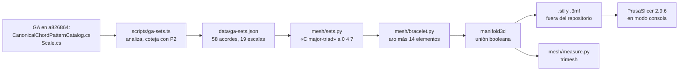
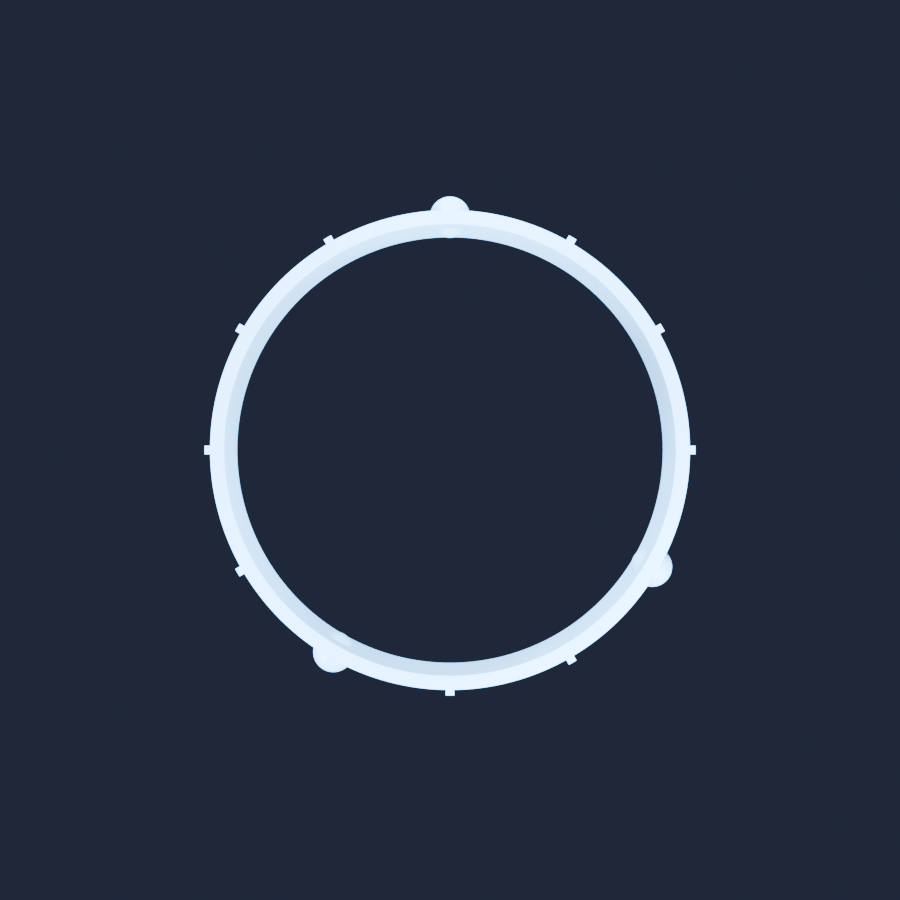
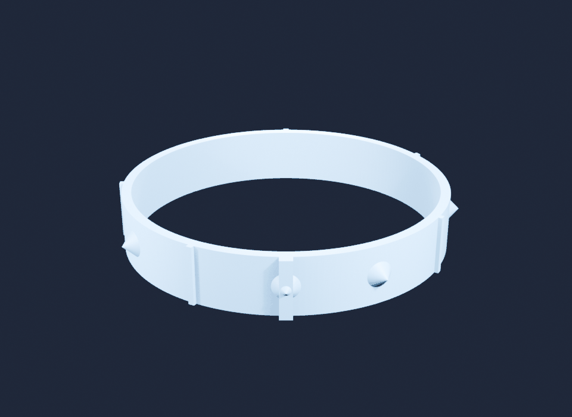

El prototipo 2 dibuja un anillo de doce cuentas y enciende las que toca el acorde. Este pregunta si ese anillo puede salir de la pantalla: una pulsera rígida de 65 mm, doce posiciones a su alrededor, una cuenta donde el conjunto de GA tiene una nota, una nervadura donde no la tiene, y una quilla sobre do para que el pulgar encuentre lo alto sin contar. No se imprimió nada — aquí no hay impresora —, así que la pregunta se estrecha, pero sigue admitiendo una respuesta honesta: **¿sobrevive la malla a todo lo que el programa de una impresora comprueba antes de la primera capa?**


*Do mayor: cuentas en do, mi y sol, nervaduras en las otras nueve posiciones, y la quilla de do frente a la cámara. Renderizado con Blender 5.2.2 a partir del `.stl` exportado.*

Código: [`code/ga-protos/p5-printable-bracelets`](https://github.com/spareilleux/learn/tree/b171d57/code/ga-protos/p5-printable-bracelets). Las clases de altura vienen de [`scripts/ga-sets.ts`](https://github.com/spareilleux/learn/blob/b171d57/code/ga-protos/p5-printable-bracelets/scripts/ga-sets.ts), la geometría de [`mesh/bracelet.py`](https://github.com/spareilleux/learn/blob/b171d57/code/ga-protos/p5-printable-bracelets/mesh/bracelet.py), y todas las cifras de abajo de [`mesh/measure.py`](https://github.com/spareilleux/learn/blob/b171d57/code/ga-protos/p5-printable-bracelets/mesh/measure.py) y [`mesh/slice.py`](https://github.com/spareilleux/learn/blob/b171d57/code/ga-protos/p5-printable-bracelets/mesh/slice.py). Los archivos `.stl` y `.3mf` no están en el repositorio: se escriben en una carpeta fuera de él, porque la serie completa son 91 archivos y 15.5 MB, más otros 49 MB de G-code, y nada de eso es fuente.

## Lo que ya sabes

Si alguna vez has serializado un grafo de objetos, ya sabes qué es un archivo STL: la peor serialización posible. Es una lista plana de triángulos, cada uno con las coordenadas completas de sus tres vértices. No hay tabla de vértices, ni arista, ni noción alguna de qué triángulo toca a cuál. Dos triángulos son vecinos solo porque dos de sus vértices tienen, por casualidad, las mismas coordenadas en coma flotante. Todo lo que un modelador de sólidos sabe de una forma se tira, y cada herramienta posterior tiene que adivinarlo de nuevo.

De ahí que el vocabulario de la impresión 3D hable de recuperar una topología a partir de una sopa:

- **Estanca**, o variedad en el sentido de las aristas: cada arista la comparten exactamente dos triángulos. Sin agujeros.
- **Orientación coherente**: todos los triángulos coinciden en qué lado es el exterior. Un sólido cuyas normales se contradicen no tiene interior.
- **Variedad** (*manifold*): estanca, orientada de forma coherente, y sin ninguna arista compartida por tres triángulos o más.
- **Autointersección**: triángulos que se atraviesan. Una malla puede ser perfectamente estanca y no tener ningún sentido.

La otra mitad del vocabulario es de la impresora. El objeto se construye capa de 0.2 mm a capa de 0.2 mm, desde la cama hacia arriba, cada capa apoyada en la anterior. Una cara demasiado inclinada no tiene nada debajo: eso es un **voladizo**, medido aquí por la **pendiente** de la cara, el ángulo entre la cara y el plano horizontal, que es [la convención de PrusaSlicer para su umbral de soportes](https://help.prusa3d.com/article/support-material_1698). Una pared vertical está a 90 grados y no cuesta nada; un techo mirando a la cama está a 0 grados y necesita un andamio impreso debajo y roto después.

Nada del prototipo es C# ni Java: es Python, porque ahí están [trimesh](https://trimesh.org/) y [manifold3d](https://github.com/elalish/manifold), y un poco de Node.js, porque el catálogo de GA ya se analizaba para el prototipo 2 y no había razón para analizarlo dos veces.

## La cadena



## De dónde salen las doce posiciones

La pulsera solo merece imprimirse si es correcta, así que las clases de altura se leen de GA en vez de teclearse. [`scripts/ga-sets.ts`](https://github.com/spareilleux/learn/blob/b171d57/code/ga-protos/p5-printable-bracelets/scripts/ga-sets.ts) ejecuta `git show` sobre un clon de GA fijado en `a826864` y analiza dos archivos:

- [`CanonicalChordPatternCatalog.cs`](https://github.com/GuitarAlchemist/ga/blob/a826864f3a012cad88e415954bf57eca0ce12aa6/Common/GA.Domain.Core/Theory/Harmony/CanonicalChordPatternCatalog.cs#L45-L112), 58 patrones de acordes, cada uno una lista de intervalos relativos a la fundamental;
- [`Scale.cs`](https://github.com/GuitarAlchemist/ga/blob/a826864f3a012cad88e415954bf57eca0ce12aa6/Common/GA.Domain.Core/Theory/Tonal/Scales/Scale.cs#L53-L75), 19 escalas con nombre, escritas allí como nombres de notas: `Scale.Major` es la cadena `"C D E F G A B"`.

El resultado es [`data/ga-sets.json`](https://github.com/spareilleux/learn/blob/b171d57/code/ga-protos/p5-printable-bracelets/data/ga-sets.json), con el SHA-256 de cada blob leído. Tres guardianes lo protegen, y los tres corren en CI, donde no hay ningún clon de GA:

1. cada una de las 13 calidades que portó el prototipo 2 debe tener aquí exactamente los mismos intervalos y la misma prioridad — se importa la misma tabla `QUALITIES`, no se copia;
2. cada conjunto debe estar ordenado, sin repeticiones, con raíz en 0 y dentro de 0 a 11;
3. `Scale.Major` debe salir como 0 2 4 5 7 9 11.

### El servidor de GA contradice las fuentes de GA

Los archivos son una fuente; el servidor es otra. Preguntado a través de las herramientas MCP de GA el 2026-09-17, el analizador de acordes en servicio respondió:

| Pregunta | Respuesta de GA | Lo que dice el archivo de catálogo de GA |
|---|---|---|
| `get_scale_notes('C major')` | 0 2 4 5 7 9 11 | igual |
| `get_scale_notes('A minor')` | 9 11 0 2 4 5 7 | igual |
| `ga_chord_to_set('Cmaj7')` | do mi sol si | igual |
| `ga_chord_to_set('Cdim7')` | do mi bemol fa sostenido si bemol, Forte 4-27 | `diminished-7` es 0 3 6 9, Forte 4-28 |
| `ga_chord_to_set('Cm7b5')` | do mi bemol sol si bemol, Forte 4-26 | `half-diminished-7` es 0 3 6 10 |

`ga_parse_chord('Cdim7')` devuelve la calidad `diminished` con el componente `ext:7`, de modo que la séptima se añade como séptima menor y no como séptima disminuida, y el `b5` de `Cm7b5` se pierde por el camino. Dos de las trece pulseras tendrían las cuentas en los lugares equivocados si se hubieran construido desde el chatbot en vez del catálogo. El intercambio completo está en [`results/ga-check.json`](https://github.com/spareilleux/learn/blob/b171d57/code/ga-protos/p5-printable-bracelets/results/ga-check.json); es justo la clase de cosa para la que existe este laboratorio, y está en el diario del curso para que el autor decida si abre una incidencia.

### El anillo se lee igual que en pantalla

La posición `pc` está en `angle = pi/2 - pc * pi/6`: do arriba, el resto en el sentido de las agujas del reloj, exactamente la fórmula del [`scene.ts`](https://github.com/spareilleux/learn/blob/b171d57/code/ga-protos/p2-chord-universe/src/app/scene.ts) del prototipo 2 y del diagrama de [la lección 2 del curso de teoría musical](../../music-theory-ga/02-scales-and-modes/). Una prueba unitaria comprueba la fórmula, y otras tres comprueban que do está a 90 grados, que fa sostenido queda enfrente a 270, y que cada hueco mide 30 grados.


*Visto desde arriba: do a las doce con su quilla, mi a las cuatro, sol a las ocho.*

## El objeto

| Parámetro | Valor |
|---|---|
| Diámetro interior | 65.0 mm |
| Pared del aro | 2.0 mm |
| Altura del aro | 12.0 mm |
| Diámetro exterior | 69.0 mm |
| Segmentos por círculo | 192 |
| Cuenta, nota presente en el conjunto | cono, radio de base 3.0 mm, altura 3.0 mm, hundido 0.4 mm en la pared |
| Nervadura, sin nota | 1.2 mm de ancho, 0.8 mm de saliente, toda la altura |
| Quilla, clase de altura 0 | 2.5 mm de ancho, 1.6 mm de saliente, toda la altura |

Catorce piezas se construyen a lo largo del eje +X y se giran a su posición, y luego se fusionan. El aro es un `trimesh.creation.annulus`, el cono un `trimesh.creation.cone` tumbado de lado, las nervaduras son cajas, y la quilla un perfil extruido con [Shapely](https://shapely.readthedocs.io/). La fusión es todo el asunto:

```python
def solid(self) -> trimesh.Trimesh:
    """The boolean union, computed by manifold3d."""
    return trimesh.boolean.union([p.copy() for p in self.parts], engine="manifold")
```

La alternativa, que hacen muchísimos scripts en internet, es escribir las catorce piezas en un solo archivo y llamarlo modelo:

```python
def naive(self) -> trimesh.Trimesh:
    """Every part in one file, with no boolean at all: what a script without a CSG engine writes."""
    return trimesh.util.concatenate([p.copy() for p in self.parts])
```

Se construyeron y se midieron los dos. Lo que pasó no es lo que se había predicho.

## Las hipótesis, confirmadas primero

[`results/hypotheses.md`](https://github.com/spareilleux/learn/blob/8a2ed53/code/ga-protos/p5-printable-bracelets/results/hypotheses.md) se confirmó en [`8a2ed53`](https://github.com/spareilleux/learn/commit/8a2ed53), antes de que existieran `mesh/build.py`, `mesh/measure.py` o `mesh/slice.py`. Doce predicciones, H1 a H12. Los veredictos están al final de esta lección; cuatro son falsos.

## Lo que dice la malla

Todas las cifras de abajo vienen de [`results/measurements.json`](https://github.com/spareilleux/learn/blob/b171d57/code/ga-protos/p5-printable-bracelets/results/measurements.json), 31 sólidos construidos y medidos en **5.95 s** con Python 3.14.2, trimesh 5.1.0, Windows 11. No interviene ninguna GPU en ningún momento.

### Topología

| | unión, cuentas cónicas | unión, cuentas esféricas | piezas concatenadas |
|---|---|---|---|
| Estanca | sí | sí | **sí** |
| Orientación coherente | sí | sí | sí |
| Cuerpos conexos | 1 | 1 | **14** |
| Característica de Euler | 0 | 0 | 26 |
| Veredicto de manifold3d | NoError | NoError | **NoError** |
| Triángulos | 2 386 | 5 474 | 2 040 |
| Volumen | 5.2473 cm3 | 5.3761 cm3 | **5.3829 cm3** |

Una característica de Euler de 0 es la firma de una pulsera rígida: un sólido de género 1, un toro con bultos. El archivo concatenado saca 26 porque son catorce sólidos cerrados distintos, trece de género 0 y uno de género 1, que se solapan en el espacio pero no se tocan en ninguna parte de los datos.

Y aquí llega la primera sorpresa. **H2 predecía que la malla concatenada fallaría la prueba de estanqueidad. La pasa.** Cada pieza está cerrada por sí misma, así que cada arista sigue teniendo exactamente dos triángulos, y tanto trimesh como manifold3d la dan por buena. «Estanca» es una afirmación sobre aristas, no sobre sólidos. Lo que de verdad cuesta el archivo concatenado es todo lo que, aguas abajo, se lo cree:

- su volumen es un 2.6 % mayor, porque las piezas cuentan dos veces sus solapes: 5.3829 cm3 en lugar de 5.2473;
- su superficie es un 10.8 % mayor, 68.13 cm2 en lugar de 61.48;
- y la medida del espesor de pared, más abajo, da **1.40 mm** en vez de 2.00, porque las caras interiores enterradas de las nervaduras son superficies reales dentro del aro. Con cuentas esféricas da 0.0488 mm.

### ¿Sigue cabiendo la muñeca?

Se lanzan rayos hacia fuera desde 2 000 puntos situados dentro de la pared; el punto donde cada uno abandona el sólido da el espesor allí. El diámetro interior se mide como la distancia más pequeña del eje a cualquier punto de la superficie, que en un polígono de 192 lados está en mitad de una arista, nunca en un vértice.

| | cuentas cónicas | cuentas esféricas |
|---|---|---|
| Diámetro interior | **64.9913 mm** | **63.0287 mm** |
| Perdido por el facetado | 0.0044 mm | 0.986 mm |
| Pared, mínimo | 1.9954 mm | 1.9954 mm |
| Pared, mediana | 1.9968 mm | 1.9969 mm |



*La variante descartada, con cuentas esféricas. Por fuera parece correcta; el milímetro de cada esfera que se mete en el agujero está al otro lado de la pared.*

El facetado cuesta 4.4 micrómetros de radio, unas cincuenta veces menos que la tolerancia de una impresora doméstica. La segunda columna es el segundo fracaso: **una esfera de 3.0 mm de radio centrada en la superficie exterior de una pared de 2.0 mm sobresale 1.0 mm hacia el agujero.** Tres cuentas se vuelven tres bultos dentro de la pulsera, y el diámetro interior pierde 1.96 mm. Es exactamente la cuenta que el prototipo 2 dibuja en pantalla, donde una cuenta no tiene espesor alguno que morder, trasplantada sin pensar a un objeto que sí lo tiene. La lección no es que las esferas sean malas: es que una forma que se lee bien en un motor de render no tiene ninguna opinión sobre la pared en la que se apoya.

### Voladizos

Las caras se agrupan por pendiente; las que descansan sobre la cama quedan excluidas, ya que no cuelgan sobre nada.

| | cuentas cónicas | cuentas esféricas |
|---|---|---|
| Peor pendiente, fuera de la cama | **45.0 grados** | **4.87 grados** |
| Superficie por debajo de 45 grados | 0.0000 cm2 | 0.2163 cm2 |
| Parte de la superficie | 0.00 % | 0.35 % |

Un cono cuya altura iguala su radio de base presenta 45 grados en todas partes, justo el umbral, y por tanto no cuesta nada. La mitad inferior de la esfera se vuelve casi plana: 4.87 grados es un techo. Ahí los soportes no son opcionales, y el slicer lo confirma más abajo.

**H6 predecía que entre un 3 % y un 8 % de la superficie necesitaría soportes con cuentas esféricas; la respuesta es 0.35 %.** La predicción era diez veces demasiado alta: tres esferas pequeñas sobre un objeto de 62 cm2 sencillamente no son mucha superficie. La dirección era correcta y la cifra no, y conviene decirlo sin rodeos: «hacen falta soportes» y «un 3 % de la superficie» son dos afirmaciones distintas, y solo la primera se sostuvo.

### La quilla, tres veces

La marca sobre do pasó por tres formas, y [`results/keel-sweep.json`](https://github.com/spareilleux/learn/blob/b171d57/code/ga-protos/p5-printable-bracelets/results/keel-sweep.json) las tiene las tres.

| Altura de rampa | Peor pendiente | Superficie a soportar | Saliente a 0.5 mm | a 1 mm | a 2 mm | a media altura |
|---|---|---|---|---|---|---|
| 1.6 mm | 36.03 grados | 0.0498 cm2 | 0.0875 mm | 0.775 mm | 1.6 mm | 2.6 mm |
| 2.2 mm | 45.0 grados | 0.0000 cm2 | 0.0 mm | 0.4 mm | 1.4 mm | 2.6 mm |
| ninguna | 45.04 grados | 0.0000 cm2 | **1.6 mm** | **1.6 mm** | **1.6 mm** | 2.6 mm |

El archivo de hipótesis describe la quilla como «achaflanada a 45 grados arriba y abajo». El código construyó una rampa de 1.6 mm de alto sobre 2.2 mm de profundidad, es decir 36 grados, por debajo del umbral y necesitada de soportes: una intención de diseño que la implementación no respetó, y que solo la medida atrapó. Hacer una rampa de 45 grados de verdad quitó el voladizo y le costó su profundidad a la marca: a 1 mm por encima de la cama, la quilla sobresalía 0.4 mm, la mitad que una nervadura corriente, y el elemento pensado para encontrarse al tacto había desaparecido justo donde se apoya un pulgar.

La tercera fila es la respuesta, y resulta algo embarazosa: un elemento vertical sobre una pared vertical, impreso con el eje de la pulsera hacia arriba, **no cuelga sobre nada en absoluto**. Su cara inferior es la cama y su cara superior mira al cielo. La rampa resolvía un problema que no existía, y tanto el voladizo de 36 grados como la profundidad perdida eran autoinfligidos. Las nervaduras, simples cajas sin rampa alguna, venían dando cero superficie en voladizo desde el principio.

## Lo que dice el slicer

No había ningún slicer en esta máquina cuando se escribieron las hipótesis, y H11 lo decía. Después se descargó [PrusaSlicer 2.9.6](https://github.com/prusa3d/PrusaSlicer/releases/tag/version_2.9.6) en su versión portátil para Windows (106.6 MB, [AGPL-3.0](https://github.com/prusa3d/PrusaSlicer/blob/master/LICENSE)) y se ejecutó en modo consola, con todo el perfil escrito en la línea de órdenes para que nada dependa de una configuración que alguien ajustó en una ventana:

```bash
prusa-slicer-console.exe --export-gcode \
  --nozzle-diameter 0.4 --filament-diameter 1.75 --filament-density 1.24 \
  --layer-height 0.2 --first-layer-height 0.2 --perimeters 3 \
  --top-solid-layers 4 --bottom-solid-layers 4 --fill-density 15% --fill-pattern gyroid \
  --temperature 215 --bed-temperature 60 --support-material-threshold 45 \
  --skirts 1 --bed-shape 0x0,250x0,250x210,0x210 --gcode-flavor marlin2 \
  --output out.gcode bracelet.stl
```

Laminó todos los archivos sin una sola queja, y no imprimió ningún mensaje de reparación para ninguno. Sesenta capas cada uno.

| Objeto | Filamento | Volumen | Tiempo |
|---|---|---|---|
| Aro liso, sin elementos | 6.15 g | 4.96 cm3 | 26 min 43 s |
| Tríada de do mayor, cuentas cónicas | 6.42 g | 5.18 cm3 | 35 min 40 s |
| Escala de do mayor, cuentas cónicas | 6.47 g | 5.22 cm3 | 39 min 56 s |
| Tríada de do mayor, cuentas esféricas | 6.60 g | — | 37 min 31 s |
| la misma, con soportes | 6.81 g | — | 39 min 07 s |
| Escala de do mayor, cuentas esféricas | 6.90 g | — | 45 min 58 s |
| la misma, con soportes | 7.47 g | — | 49 min 33 s |



*La escala de do mayor: siete cuentas, cinco nervaduras. Es la más pesada y la más lenta de la serie, 6.47 g y 39 min 56 s. Un la menor natural produce exactamente este objeto, y de eso se trata.*

Las trece pulseras de acordes caen todas entre 6.42 y 6.44 g y entre 35 min 16 s y 37 min 10 s: las cuentas y las nervaduras son un error de redondeo al lado del aro. Los soportes cuestan 0.21 g y 1 min 36 s para una tríada, 0.57 g y 3 min 35 s para una escala de siete notas — poca cosa, salvo que además hay que romperlos a mano sobre doce elementos en relieve, y ahí está el precio de verdad.

El volumen de filamento se queda sistemáticamente un 1.3 % por debajo del volumen de la malla, incluso con un 15 % de relleno, porque una pared de 2.0 mm con tres perímetros de 0.45 mm por cada lado es maciza de lado a lado: casi no hay relleno en este objeto.

**H11 pedía de 6.0 a 7.5 g y de 25 a 50 minutos. Las dos se cumplieron.** El resto de H11, no.

### Al slicer le dan igual tus catorce cuerpos

H11 predecía también que PrusaSlicer repararía al menos un error en la malla concatenada. No señaló nada, y la laminó en **6.42 g y 36 min 34 s** frente a los **6.42 g y 35 min 40 s** de la unión — 2 154.16 mm de filamento contra 2 154.05, una diferencia del 0.005 %. Un slicer moderno fusiona los sólidos cerrados que se solapan dentro de su propio laminado: catorce cuerpos que se interpenetran son, para él, un solo objeto.

Conviene formularlo con cuidado, porque invierte el consejo habitual. El peligro de la malla sin unión no es el slicer. Es todo lo demás: el volumen y la masa que anuncias, el espesor de pared que mides, un slicer de resina o un servicio de impresión en línea más estrictos, una importación a CAD, una herramienta de reparación de mallas que «arregla» las intersecciones borrando geometría, y cualquiera que abra el archivo esperando un solo objeto. La unión sigue siendo lo correcto — solo que no será el slicer quien te lo diga.

### La única comprobación que solo hace el slicer

H12 predecía que el slicer encontraría elementos que no caben en un número entero de extrusiones. Así es, y el G-code lo dice: PrusaSlicer escribe un comentario `;WIDTH:` cada vez que cambia de ancho de extrusión.

| Objeto | Anchos distintos | Rango | Fuera del nominal de 0.45 mm |
|---|---|---|---|
| Aro liso | 18 | 0.371 a 0.572 mm | 17 |
| Tríada de do mayor, cuentas cónicas | 173 | 0.358 a 0.667 mm | 141 |
| Escala de do mayor, cuentas cónicas | 185 | 0.357 a 0.662 mm | 151 |

El control importa: el aro sin ningún elemento ya necesita 18 anchos distintos, porque una pared curva de 2.0 mm tampoco es un número entero de cordones de 0.45 mm. Los elementos multiplican eso por diez. Aquí no hay nada roto — los perímetros de ancho variable de PrusaSlicer se ocupan —, pero ninguna medida geométrica de la malla habría podido predecir ni uno solo de esos números. **H12 se cumplió, con la reserva de que el experimento de control muestra que el efecto no es solo culpa de las nervaduras.**

## Veredicto frente a las hipótesis

| | Predicción | Resultado | |
|---|---|---|---|
| H1 | la unión es estanca, un solo cuerpo, Euler 0, a la primera, para las dos formas de cuenta y las 13 calidades | 30 sólidos de 30, estancos, orientados de forma coherente, un cuerpo, Euler 0, manifold3d NoError | se cumplió |
| H2 | las piezas concatenadas no son estancas | lo son, y manifold3d las acepta: 14 cuerpos, volumen un 2.6 % mayor, pared leída en 1.40 mm | **falsa** |
| H3 | volumen de 5.2 a 5.6 cm3, masa en PLA de 6.4 a 7.0 g | 5.2473 cm3, 6.507 g | se cumplió |
| H4 | diámetro interior de 64.98 mm o más, facetado por debajo de 0.02 mm | 64.9913 mm, 0.0044 mm — pero 63.0287 mm con cuentas esféricas | se cumplió para el diseño entregado, y la variante esférica es un fracaso publicado |
| H5 | paredes de 1.99 mm o más, aro en 2.00 más o menos 0.01 | mínimo 1.9954 mm, mediana 1.9968 mm | se cumplió |
| H6 | cuentas esféricas: del 3 % al 8 % de la superficie necesita soportes | 0.35 %, peor pendiente 4.87 grados | **falsa en orden de magnitud**, acertada en que hacen falta soportes |
| H7 | cuentas cónicas: por debajo del 0.5 %, peor voladizo de 45 grados o menos | 0.00 %, peor pendiente 45.0 grados — tras arreglar la quilla; la primera construcción medía 36.03 grados | se cumplió tras un arreglo que la hipótesis no anticipaba |
| H8 | menos de 60 000 triángulos, STL por debajo de 3 MB | 2 386 triángulos y 119 KB para una tríada; 10 354 y 518 KB en el peor caso | se cumplió |
| H9 | 13 pulseras, las dos formas, medidas y escritas, en menos de 60 s | 31 sólidos en 5.95 s | se cumplió |
| H10 | el catálogo de GA coincide con el port de P2; `Scale.Major` es 0 2 4 5 7 9 11; los ángulos siguen a P2 | las tres cosas, comprobadas en CI | se cumplió |
| H11 | no hay slicer; si aparece uno, 0 reparaciones para la unión y al menos 1 para la concatenación, de 6.0 a 7.5 g, de 25 a 50 min | apareció un slicer; 6.42 g y 35 min 40 s; **0 reparaciones para ambas**, y la concatenación da los mismos gramos | gramos y minutos se cumplieron, la predicción sobre reparaciones es **falsa** |
| H12 | al menos un elemento demasiado fino para un número entero de extrusiones | 173 anchos de extrusión distintos, 141 fuera del nominal — pero el aro liso ya necesita 18 | se cumplió, con una reserva que la hipótesis no vio |

## Lo que falló

- **La cuenta esférica se comió la pulsera.** La cuenta del prototipo 2, puesta sobre una pared de 2 mm, sobresale 1 mm hacia el agujero y le quita 1.96 mm de diámetro. Las dos variantes se siguen construyendo y midiendo, y la comprobación de CI verifica que el fracaso sigue siendo reproducible, para que la lección no cite un fantasma.
- **El chaflán de la quilla tenía 36 grados, no los 45 que afirmaban las hipótesis.** Nadie se dio cuenta hasta que `min_slope_deg` imprimió 36.027. Luego el arreglo costó legibilidad, y la respuesta de verdad era borrar el elemento que causaba los dos problemas.
- **H2 se equivocaba sobre qué significa «estanca».** Es una propiedad de las aristas. Catorce sólidos que comparten una caja envolvente la cumplen.
- **El slicer se negó a escandalizarse.** Laminó la malla sin unir con los mismos gramos que la unión, y no dijo nada. El argumento a favor de hacer las booleanas como es debido hay que construirlo en otro sitio.
- **H6 se equivocó en un orden de magnitud.** Predecir un porcentaje de superficie sin hacer antes la cuenta es adivinar.

## Lo que solo una impresora puede decir, y queda *por verificar*

Todo lo anterior es geometría y G-code. Nada se ha impreso, y estas son las preguntas que quedan abiertas:

- si un agujero de 65 mm le vale de verdad a la muñeca prevista, y si debería ser de 63 o de 68 — la talla de una pulsera rígida es una medida de cuerpo, no una propiedad de la malla (*por verificar*);
- si las nervaduras de 1.2 mm y la quilla de 2.5 mm se distinguen al tacto una vez impresas en capas de 0.2 mm, con los anchos de extrusión de arriba (*por verificar*);
- si la parte inferior a 45 grados de las cuentas cónicas se imprime limpia o se descuelga, ya que 45 grados es justo el umbral y una impresora real no está exactamente en sus ajustes nominales (*por verificar*);
- si un aro de PLA de 2.0 mm y 12 mm de alto sobrevive a que lo fuercen por una mano, o se parte — un aro de PLA de 2 mm no es evidentemente lo bastante fuerte, y aquí ninguna simulación dice nada al respecto (*por verificar*);
- si los 8 triángulos degenerados, de área nula, que manifold3d deja en las uniones cónicas molestan a algún otro slicer. PrusaSlicer no los mencionó (*por verificar*).

## Ejecútalo tú

```bash
cd code/ga-protos/p5-printable-bracelets
npm run sets                                    # check the committed GA sets against P2's port
npm test                                        # the Node.js side
python -m pip install -r requirements.txt
python -m unittest discover -s tests -t . -v    # 14 tests: order, bore, walls, overhangs, readability
python mesh/run.py --suite --band --bead both --naive \
  --out /somewhere/outside/the/repo --results results/measurements.json
python mesh/keel_sweep.py --results results/keel-sweep.json
python mesh/check_ci.py --results results/measurements.json
```

Con un slicer, añade su ruta; sin él, el script lo dice y todas las cifras del slicer quedan *por verificar*:

```bash
python mesh/slice.py --slicer /path/to/prusa-slicer-console --out /somewhere/gcode \
  --results results/slicer.json /somewhere/outside/the/repo/*-cone.stl
```

Las imágenes necesitan Blender, y solo las imágenes:

```bash
blender --background --python mesh/render.py -- \
  --stl /somewhere/C-major-triad-cone.stl --out shot.png --view three-quarter
python mesh/shrink.py shot.png --colors 128
```

El job de CI `p5-printable-bracelets` ejecuta todo menos el slicer y Blender, en Ubuntu, Windows y macOS.

## Puntos clave

- «Estanca» es una afirmación sobre aristas, no sobre sólidos. Catorce piezas cerradas que se interpenetran pasan todas las pruebas de estanqueidad, y también la de manifold3d, mientras se equivocan un 2.6 % en el volumen y un 30 % en el espesor de pared.
- Haz la unión igualmente — pero sabiendo por qué. El slicer no te lo agradecerá: laminó las dos mallas en 6.42 g. Todo lo demás aguas abajo, sí.
- Una forma que se lee bien en pantalla no tiene ninguna opinión sobre la pared en la que se apoya. Una cuenta de 3 mm sobre una pared de 2 mm cuesta 2 mm de agujero.
- La orientación de impresión decide qué elementos salen gratis. Con la pulsera apoyada y el eje hacia arriba, cada nervadura vertical es gratis y cada rampa que añadas es un problema que te has inventado.
- Escribe la intención del diseño en cifras, y luego mide esas cifras. «Achaflanado a 45 grados» estaba en las hipótesis y 36 grados estaba en el código.
- Los porcentajes de superficie no son intuitivos. Predícelos calculando un área, o no los predigas.
- Fija las fuentes. Los archivos de catálogo de GA y su analizador de acordes en servicio no dicen lo mismo de `dim7` ni de `m7b5`; una pulsera construida desde el segundo estaría mal, y solo una fuente fijada y comprobada la mantiene correcta.

## Ejercicios

1. El volumen analítico del aro es `pi * (34.5^2 - 32.5^2) * 12`. Calcúlalo, compáralo con los 5.0508 cm3 que informa la malla, y di de dónde viene la diferencia y en qué sentido.
2. El agujero se mide como la distancia más pequeña del eje a la superficie, no a un vértice. Para un polígono regular de 192 lados inscrito en un círculo de 32.5 mm de radio, ¿cuánto menor es la distancia a la mitad de una arista? Compruébalo frente a los 0.0044 mm de la tabla, y di cuántos segmentos harían falta para que la pérdida llegara a 0.05 mm.
3. Doce posiciones separadas 30 grados. En el radio exterior, ¿qué distancia hay entre dos centros de cuenta vecinos, y hasta qué tamaño podría crecer una cuenta antes de que dos de ellas se tocaran?
4. Un cono cuya altura iguala su radio de base tiene una peor pendiente de exactamente 45 grados. ¿Qué pendiente tendría una semiesfera del mismo radio de base, y qué pendiente tiene un cono de 3 mm de radio de base y 4.5 mm de alto? ¿Cuál imprimirías, y por qué puede que ninguno de los dos sea la respuesta correcta?
5. `Scale.Augmented` de GA es la cadena `"C D# E G G# B"`. Halla sus clases de altura, y luego di qué aspecto tiene la pulsera cuando se gira cuatro posiciones, y qué dice eso de la escala.
6. La malla sin unir informa de un espesor de pared mínimo de 1.40 mm con cuentas cónicas y de 0.0488 mm con esféricas. Explica los dos números a partir de la geometría.

<details>
<summary>Solución 1</summary>

`pi * (1190.25 - 1056.25) * 12 = pi * 134 * 12 = 5050.9 mm3`, es decir 5.0509 cm3. La malla informa de 5.0508 cm3, una parte en cincuenta mil por debajo. La malla queda más baja porque los círculos son polígonos inscritos de 192 lados, algo más pequeños que los círculos que los contienen. El área de un polígono regular inscrito vale `(N / 2 pi) * sin(2 pi / N)` veces la del círculo, alrededor de `1 - 6.58 / N^2`; con N = 192, tanto el círculo interior como el exterior encogen 1.8 partes en 100 000, la corona entre ambos encoge en el mismo factor, y el volumen con ella.

</details>

<details>
<summary>Solución 2</summary>

La distancia a la mitad de una arista vale `R * cos(pi / N)`, así que la pérdida es `R * (1 - cos(pi / N))`. Con R = 32.5 mm y N = 192: `cos(0.9375 grados) = 0.99986612`, de modo que la pérdida es `32.5 * 1.338e-4 = 0.00435 mm`, que son los 0.0044 mm de la tabla, y el diámetro vale `65 - 2 * 0.00435 = 64.9913 mm`.

Para una pérdida de 0.05 mm, resuelve `32.5 * (1 - cos(pi/N)) = 0.05`, de donde `cos(pi/N) = 0.9984615`, `pi/N = 0.055475` radianes, `N = 56.6`. Cualquier círculo trazado con 57 segmentos o más mantiene el facetado por debajo de 0.05 mm, y 192 es generoso: la razón para usarlos es la suavidad del sombreado, no el ajuste.

</details>

<details>
<summary>Solución 3</summary>

El radio exterior es 34.5 mm y 30 grados son `pi/6` radianes, así que el arco entre dos centros mide `34.5 * pi / 6 = 18.06 mm`, y la distancia en línea recta `2 * 34.5 * sin(15 grados) = 17.86 mm`. Dos cuentas de radio de base `r` se tocan cuando `2r` llega a ese valor, o sea `r = 8.9 mm` — casi el triple de los 3.0 mm usados. Mucho antes de eso, una cuenta de radio `r` centrada en la superficie exterior llega a `34.5 - r` hacia dentro; rompe en el agujero en cuanto `r` supera la pared de 2.0 mm, que es precisamente el fallo que muestra la esfera de 3.0 mm. En este aro, la restricción que muerde es la pared, no el espaciado.

</details>

<details>
<summary>Solución 4</summary>

La superficie de una semiesfera es vertical en su base y horizontal en su polo: en algún punto de ella la pendiente toma todos los valores de 90 a 0 grados, así que su peor pendiente es 0, un techo, y por eso la cuenta esférica mide 4.87 grados una vez facetada la malla. Un cono de 3 mm de radio de base y 4.5 mm de alto es más empinado que 45 grados: su superficie forma `atan(4.5 / 3) = 56.3` grados con el plano de base, de modo que su parte inferior tiene una pendiente de 56.3 grados, cómodamente por encima del umbral y mejor que el cono de 45 grados, que se queda justo encima.

Puede que ninguno sea el correcto, porque los dos son puntiagudos. Un cono que sobresale de 2.6 a 4.5 mm de una pulsera es una punta contra la muñeca y se engancha en las mangas. Una respuesta mejor es seguramente un cono truncado, o un medio cilindro de eje vertical con la parte de arriba y la de abajo cortadas a 45 grados — que es en lo que acabó la quilla, menos las rampas.

</details>

<details>
<summary>Solución 5</summary>

Do vale 0, re sostenido 3, mi 4, sol 7, sol sostenido 8 y si 11, así que el conjunto es 0 3 4 7 8 11. Suma 4 a cada uno y reduce módulo 12: 4 7 8 11 0 3, las mismas seis notas. Suma 8: 8 11 0 3 4 7, las mismas otra vez. La escala aumentada se aplica sobre sí misma al girarla cuatro u ocho posiciones, así que la pulsera tiene simetría de orden tres y su imagen no puede decir cuál de do, mi o la bemol es la fundamental — la misma propiedad que el prototipo 2 señala para la tríada aumentada y la séptima disminuida, y la razón por la que una quilla sobre do no es un adorno sino lo único que dice dónde estás.

</details>

<details>
<summary>Solución 6</summary>

Los rayos salen justo por dentro de la superficie interior y van hacia fuera; la medida es la distancia a la primera superficie que encuentran. Con cuentas cónicas, las piezas que más se adentran son las nervaduras, hundidas 0.6 mm en la pared. En el archivo concatenado, la cara interior de la nervadura sigue ahí, un triángulo real en el radio `34.5 - 0.6 = 33.9`: un rayo que atraviesa una nervadura se detiene ahí, `33.9 - 32.5 = 1.40 mm`. En la unión esa cara es interior y se eliminó, así que el rayo continúa hasta la verdadera superficie exterior en 34.5 e informa de 2.00.

Con cuentas esféricas, la superficie de la esfera está dentro del agujero: una esfera de 3.0 mm de radio centrada en 34.5 baja hasta 31.5, por debajo del radio interior de 32.5. Un rayo que sale de 32.51 apuntando hacia fuera a través de una cuenta abandona la esfera casi de inmediato, de ahí los 0.0488 mm en la muestra medida. Ese número no es una pared en absoluto; es la medida diciéndote que la geometría no es la que crees.

</details>

## Fuentes

- GuitarAlchemist/ga en `a826864`: [`CanonicalChordPatternCatalog.cs`](https://github.com/GuitarAlchemist/ga/blob/a826864f3a012cad88e415954bf57eca0ce12aa6/Common/GA.Domain.Core/Theory/Harmony/CanonicalChordPatternCatalog.cs#L45-L112), [`Scale.cs`](https://github.com/GuitarAlchemist/ga/blob/a826864f3a012cad88e415954bf57eca0ce12aa6/Common/GA.Domain.Core/Theory/Tonal/Scales/Scale.cs#L53-L75)
- [trimesh](https://trimesh.org/) 5.1.0 y su [`trimesh.boolean`](https://trimesh.org/trimesh.boolean.html), [manifold3d](https://github.com/elalish/manifold) 3.5.3, [Shapely](https://shapely.readthedocs.io/) 2.1.2, [NumPy](https://numpy.org/) 2.5.3, [SciPy](https://scipy.org/) 1.18.1
- [PrusaSlicer 2.9.6](https://github.com/prusa3d/PrusaSlicer/releases/tag/version_2.9.6), [AGPL-3.0](https://github.com/prusa3d/PrusaSlicer/blob/master/LICENSE); [interfaz de línea de órdenes](https://help.prusa3d.com/article/command-line-interface_1937) y [material de soporte](https://help.prusa3d.com/article/support-material_1698)
- [Blender](https://www.blender.org/) 5.2.2 LTS, usado solo para hacer las imágenes
- 3MF Consortium, [especificación del núcleo de 3MF](https://github.com/3MFConsortium/spec_core), el formato que STL debería haber sido
- Marco Attene, Marcel Campen y Leif Kobbelt, [«Polygon Mesh Repairing: An Application Perspective»](https://doi.org/10.1145/2431211.2431214), *ACM Computing Surveys* 45(2), 2013: qué significa «malla rota», y por qué la estanqueidad es solo una de las propiedades que importan
- El prototipo 2 de este laboratorio, [Toca un acorde, mira el universo](../02-chord-universe/), del que está hecha esta pulsera
