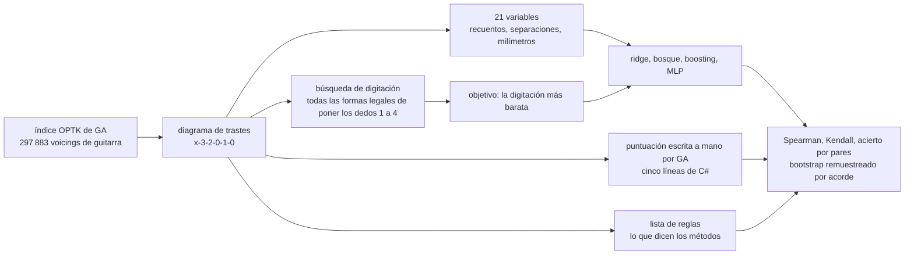

Pídale a Guitar Alchemist los voicings fáciles de un acorde y los ordenará con un número, `DifficultyScore`, entre 1 y 10. Ese número son cinco líneas de C#. Este prototipo se pregunta si un modelo pequeño entrenado en el procesador de un portátil puede hacerlo mejor — y, antes de eso, qué podría significar «mejor», puesto que nadie ha etiquetado 297 883 voicings con su dificultad.

Aquí todo corre en un solo núcleo de CPU, sin GPU y sin más dependencia que [Node.js](https://nodejs.org/). El código está en [`code/ga-protos/p7-playability`](https://github.com/spareilleux/learn/tree/main/code/ga-protos/p7-playability) y las doce predicciones numéricas se [commitearon](https://github.com/spareilleux/learn/blob/c6a9937/code/ga-protos/p7-playability/results/hypotheses.md) antes del experimento. Cuatro resultaron falsas.

## Lo que ya sabe: un problema de ordenación sin etiquetas

Si ha usado [ML.NET](https://learn.microsoft.com/dotnet/machine-learning/), la mitad «modelado» de esta lección no le sorprenderá. Leer variables en cada fila, ajustar [`FastTreeRegressionTrainer`](https://learn.microsoft.com/dotnet/api/microsoft.ml.trainers.fasttree.fasttreeregressiontrainer) — árboles potenciados por gradiente, la misma familia que el modelo de aquí —, y luego evaluar sobre filas que el modelo no ha visto. Pocos datos tabulares, unos cientos de árboles, una CPU: es la parte aburrida y fiable del aprendizaje automático, y funciona.

La otra mitad es más interesante. Un modelo supervisado necesita una columna que predecir, y «cuán difícil es tocar este voicing» no es la columna de nadie. GA tiene una opinión, pero la opinión de GA es justamente lo que se está poniendo a prueba: entrenar un modelo sobre la puntuación de GA y anunciar después que el modelo coincide con GA no demostraría nada. La mayor parte de esta lección consiste, por tanto, en construir un objetivo discutible y decir en voz alta cuánto vale.



## El coste de GA, leído línea a línea

La puntuación vive en [`VoicingPhysicalAnalyzer.CalculatePlayability`](https://github.com/GuitarAlchemist/ga/blob/66bdd049ad3f4b10f996e4cc6a9c6e58797cf30e/Common/GA.Domain.Services/Fretboard/Voicings/Analysis/VoicingPhysicalAnalyzer.cs#L133-L142), en el commit [`66bdd049`](https://github.com/GuitarAlchemist/ga/tree/66bdd049ad3f4b10f996e4cc6a9c6e58797cf30e) de GA, el mismo que P1 ya había fijado:

```csharp
// Compute numeric difficulty score (1-10) using spanScore
var difficultyScore = 1.0;
if (barreRequired) difficultyScore += 2.0;

// Use logarithmic span score instead of raw fret count
difficultyScore += spanScore * 3.0; // max ~4.0 extra for wide stretch

if (layout.OpenStrings.Length == 0) difficultyScore += 1.0;
if (minimumFingers == 4) difficultyScore += 1.0;
difficultyScore = Math.Min(10.0, difficultyScore);
```

`spanScore` es la distancia en milímetros entre la nota pisada más baja y la más alta, dividida por 80. Los milímetros son reales: [`PhysicalFretboardCalculator`](https://github.com/GuitarAlchemist/ga/blob/66bdd049ad3f4b10f996e4cc6a9c6e58797cf30e/Common/GA.Domain.Services/Fretboard/Analysis/PhysicalFretboardCalculator.cs#L52-L58) coloca cada traste en `scale * (1 - 2^(-fret/12))` sobre un mástil de 648 mm, de modo que la misma separación de tres trastes cuesta más cerca de la cejuela que en el traste doce. Esa parte es correcta, y este prototipo la reutiliza.

El resto de la fórmula es más interesante. [`ga-cost.mjs`](https://github.com/spareilleux/learn/blob/main/code/ga-protos/p7-playability/src/lib/ga-cost.mjs) la porta línea a línea a JavaScript, para que ambas se comparen sobre las mismas filas. Del portado caen cuatro cosas, antes de todo entrenamiento.

**El indicador de cejilla falla con la cejilla más famosa.** [`DetectBarreRequirement`](https://github.com/GuitarAlchemist/ga/blob/66bdd049ad3f4b10f996e4cc6a9c6e58797cf30e/Common/GA.Domain.Services/Fretboard/Voicings/Analysis/VoicingPhysicalAnalyzer.cs#L219-L233) busca el mismo traste en **tres cuerdas adyacentes**. La cejilla de fa, `133211`, sujeta las cuerdas 1, 2 y 6 en el traste 1 — tres cuerdas, pero no tres cuerdas adyacentes, puesto que las cuerdas 3, 4 y 5 están más arriba. `barreRequired` es falso, y el acorde que todo principiante teme pierde sus dos puntos. La cejilla en forma de la, `x13331`, sí lo dispara, sobre las tres cuerdas centrales en el traste 3, donde lo habitual es apoyar el *anular*.

**«Número mínimo de dedos» cuenta trastes, no dedos.** `minimumFingers` es `Math.Min(uniqueFrets, 4)`, el número de posiciones pisadas distintas. Am (`x02210`) y Am7 (`x02010`) tienen los mismos trastes distintos, así que GA les da el mismo 2.29, aunque uno pide tres dedos y el otro dos. La misma igualdad afecta a E frente a E7, a G frente al G de cuatro dedos, y a D frente a Dsus4.

**Una cejilla de fa completa y un fa pequeño de cuatro cuerdas obtienen la misma puntuación.** `133211` y `xx3211` van ambos del traste 1 al traste 3, sin cuerdas al aire y con tres trastes distintos, y ninguno de los dos dispara el indicador de cejilla: ambos salen exactamente a 4.50. Uno es el muro de todos los métodos para principiantes; el otro es lo que los profesores proponen en su lugar.

**La etiqueta y el número se contradicen.** La cadena `Difficulty` también se calcula a partir de `spanScore`, con un rango «Beginner» en `spanScore <= 0.8`, es decir una separación de como mucho 64 mm. Los trastes 1 a 3 miden ya 66.7 mm, así que el acorde de do al aire — `x32010`, el primer acorde de casi todos los métodos — sale **Intermediate**. Mientras tanto, un voicing que GA llama «Advanced» puede llevar una puntuación en el cuarto más fácil del índice, como muestra la sección de desacuerdos más abajo.

Nada de esto es un crimen. Son cinco líneas que deben responder en microsegundos, dentro de [`VoicingFilterService`](https://github.com/GuitarAlchemist/ga/blob/66bdd049ad3f4b10f996e4cc6a9c6e58797cf30e/Apps/ga-server/GaApi/Services/VoicingFilterService.cs#L53-L70), que filtra por `DifficultyScore` y ordena por él. Pero el listón está bajo, y el objetivo de P7 es medir cuánto.

## Un objetivo discutible

El coste de GA nunca asigna dedos. Lee cuatro números resumidos del diagrama y los suma. [`fingering.mjs`](https://github.com/spareilleux/learn/blob/main/code/ga-protos/p7-playability/src/lib/fingering.mjs) hace lo contrario: enumera todas las formas legales de colocar los dedos 1 a 4 sobre las notas pisadas y se queda con la más barata. Es la forma clásica del problema, desde el [«paradigma del camino óptimo»](https://doi.org/10.2307/3680014) de Sayegh en 1989 hasta la búsqueda por restricciones de [Radicioni y Lombardo](https://doi.org/10.1007/s10601-007-9015-y), con la biomecánica de la dificultad guitarrística medida por [Heijink y Meulenbroek](https://doi.org/10.1080/00222890209601952).

Las reglas son cortas. Los números de dedo siguen a los trastes: nada de lo que sujeta el índice está por encima de lo que sujeta el corazón. Varias notas en un mismo traste pueden compartir un dedo — una cejilla, completa o parcial, y *cualquier* dedo puede hacerla, que es lo que hace un guitarrista con el anular en una forma de la. Una cejilla es imposible cuando una cuerda situada entre sus extremos está al aire, o suena en un traste más bajo. Después se cobra cada colocación:

| término | coste |
|---|---|
| cada dedo apoyado | 0.15 |
| se usa el meñique | 0.20 |
| dos dedos apretados en el mismo traste | 0.25 por pareja |
| separación más allá de lo que la pareja de dedos cubre cómodamente | 0.06 por milímetro |
| un dedo que sujeta varias cuerdas | 1.00, más 0.35 por cuerda adicional |
| esa cejilla está en el traste 1 o 2 | 0.80 |
| esa cejilla la hace el anular o el meñique | 0.60 |
| una cuerda apagada dentro del acorde | 0.90 cada una |
| una cuerda apagada bajo una cejilla | 0.80 cada una |
| la forma está por encima del traste 15 | 0.50 |

Las separaciones cómodas son de 42 mm entre los dedos 1 y 2, 34 mm entre 2 y 3, 30 mm entre 3 y 4, y las sumas de esas para las parejas que se saltan un dedo. La geometría — separación de trastes, separación de cuerdas en un traste dado — es la de GA.

**Cada número de esa tabla es una constante que elegí yo.** Nadie tocó una sola nota para calibrarlas. Lo que lo convierte en un *objetivo* defendible y no en una segunda opinión es que es un objeto de otra naturaleza: una búsqueda combinatoria sobre un modelo de mano explícito, mientras que la puntuación de GA es una suma cerrada de cuatro indicadores. Conoce los dedos; la de GA no. También deja fuera guitarra real: el pulgar por encima del mástil, una cuerda apagada con la mano izquierda, una nota sujeta por dos dedos. Las formas que necesitan eso salen más caras de lo que un guitarrista las encuentra, o imposibles.

## Cuánto vale el objetivo

Tres comprobaciones, y ninguna es una demostración.

**Contra un conjunto de parejas ordenadas a mano y declarado.** [`results/annotations.json`](https://github.com/spareilleux/learn/blob/main/code/ga-protos/p7-playability/results/annotations.json) contiene 32 juicios por parejas sobre formas canónicas: cuál de las dos es más difícil. El fichero nombra a su anotador — el modelo de lenguaje que escribió este prototipo, no un guitarrista — y enuncia las reglas que siguen las respuestas: un acorde al aire es más fácil que una cejilla, menos dedos es más fácil, menos separación es más fácil, una cuerda apagada dentro del acorde es más difícil, la misma forma es más difícil en el primer traste. Las parejas indefendibles a partir de esas reglas se descartaron; las discutibles están marcadas y se cuentan aparte.

| coste | las 25 parejas de confianza alta | las 32 parejas |
|---|---|---|
| búsqueda de digitación (el objetivo) | 1.000 | 0.938 |
| puntuación escrita a mano por GA | 0.880 | 0.781 |
| lista de reglas | 0.760 | 0.688 |

La puntuación perfecta del objetivo **no** demuestra que tenga razón. La misma cabeza escribió el modelo de mano y el protocolo de anotación a partir de las mismas reglas escritas: esa fila mide coherencia interna, nada más. La fila que importa es la de GA, porque viene de otro: en ocho de sus treinta y dos errores, GA devuelve un empate exacto entre dos formas que cualquier método separa.

**Contra una lista que no es ni lo uno ni lo otro.** [`rules.mjs`](https://github.com/spareilleux/learn/blob/main/code/ga-protos/p7-playability/src/lib/rules.mjs) convierte en puntos lo que los métodos dicen con palabras — cejilla, separación, cuerda apagada dentro, cuatro dedos ocupados, ninguna cuerda al aire. Nada se entrena sobre ella. En todo el índice, su correlación de rangos es 0.445 con la búsqueda y 0.785 con la puntuación de GA: la lista y GA coinciden porque ambas cuentan indicadores aditivos, y ambas difieren de una búsqueda que coloca dedos.

**Contra sí mismo, en formas que usted puede visualizar.** Estos son los costes de las formas anotadas, con la puntuación de GA y su etiqueta al lado:

| forma | reglas | búsqueda de digitación | GA | etiqueta GA |
|---|---|---|---|---|
| Em | `0-2-2-0-0-0` | 0.55 | 1.00 | Beginner |
| Am | `x-0-2-2-1-0` | 0.70 | 2.29 | Beginner |
| Am7 | `x-0-2-0-1-0` | 0.30 | 2.29 | Beginner |
| C | `x-3-2-0-1-0` | 0.65 | 3.50 | Intermediate |
| Cmaj7 | `x-3-2-0-0-0` | 0.30 | 2.21 | Beginner |
| Cadd9 | `x-3-2-0-3-3` | 1.55 | 2.21 | Beginner |
| D | `x-x-0-2-3-2` | 0.73 | 2.21 | Beginner |
| G | `3-2-0-0-0-3` | 0.90 | 2.21 | Beginner |
| Fmaj7 | `x-x-3-2-1-0` | 0.65 | 3.50 | Intermediate |
| Fa, cuatro cuerdas | `x-x-3-2-1-1` | 2.25 | 4.50 | Intermediate |
| Fa con cejilla | `1-3-3-2-1-1` | 3.75 | 4.50 | Intermediate |
| La con cejilla, traste 5 | `5-7-7-6-5-5` | 2.75 | 3.99 | Intermediate |
| Si♭ con cejilla | `x-1-3-3-3-1` | 3.87 | 6.50 | Intermediate |
| separación grande | `x-x-7-9-8-11` | 3.00 | 6.35 | Intermediate |
| separación pequeña | `x-x-7-9-8-9` | 1.05 | 3.77 | Intermediate |

La búsqueda coloca la cejilla de fa por encima del fa pequeño y por encima de la misma forma en el traste cinco, y separa Am de Am7, cosa que GA no sabe hacer. También se equivoca en dos de las treinta y dos parejas, ambas marcadas como de confianza media: encuentra Dsus4 ligeramente más fácil que D, y el acorde de quinta A5 más fácil que el re al aire. Sus constantes no están calibradas, y esas dos parejas son donde se nota.

## Un tercio del índice de guitarra de GA no se puede digitar

La primera medición no estaba prevista. Al construir el conjunto de datos sobre todo el índice — 297 883 voicings de guitarra, desde el fichero que P1 había fijado por huella —, la búsqueda no encontró **ninguna digitación legal para 101 967 de ellos, el 34.2 %**.

Ese número se movió una vez. La primera versión de la búsqueda solo permitía cejilla al índice, y solo sobre todas las notas del traste más bajo; rechazaba el 62 % del índice. Al generalizarla — cualquier dedo puede hacer cejilla, una cejilla puede sujetar solo parte de las notas de un traste, una cejilla puede pasar por debajo de notas más altas — se baja al 34.2 %. Lo que queda se parece a `x12345` (cinco trastes, cinco dedos, una mano) o a `103212`, donde dos notas del traste 1 quedan a ambos lados de una cuerda al aire y otras tres en los trastes 2 y 3: harían falta dos cejillas y ninguna de las dos es posible.

El índice de GA se produce por combinatoria — P1 contó 688 351 voicings brutos deduplicados a 313 047 —, así que la supervivencia de formas intocables no sorprende. Lo que merece anotarse es que **la puntuación de GA nunca lo dice**. La puntuación más alta que da a un voicing que nadie puede digitar es 7.73, cómodamente dentro del rango de los acordes corrientes, y `VoicingFilterService` devolverá uno de buena gana bajo `maxDifficulty: 8`.

¿Puede verlo un modelo pequeño? Entrenado sobre las mismas 21 variables, separado por acorde, el boosting de gradiente separa digitable de no digitable con un acierto de **0.903** frente a una referencia mayoritaria de 0.663, y un área bajo la curva ROC de **0.973**. Leída como una ordenación para la misma pregunta, la puntuación de GA llega a **0.677**. La información está en el diagrama; es la fórmula la que no la busca.

## Separar por acorde, y por qué no cambió nada

La trampa clásica del campo es separar por voicing. Diez digitaciones del mismo do mayor, a un traste de distancia, no son diez filas independientes: ponga una parte en entrenamiento y otra en prueba, y el conjunto de prueba responde a una pregunta que ya ha visto. El experimento separa, por tanto, de tres maneras y publica las tres:

- **por voicing** — la separación ingenua, cada fila su propio grupo;
- **por acorde** — el grupo es el conjunto de clases de altura, así que todos los voicings de un acorde quedan del mismo lado;
- **por forma** — el grupo es el patrón de trastes despojado de su posición, así que la misma presa transportada a lo largo del mástil es un único grupo, lo que es aún más estricto.

Correlación de rangos de cada predictor sobre las filas reservadas, los mismos datos, solo cambia el muro:

| predictor | por voicing | por acorde | por forma |
|---|---|---|---|
| puntuación de GA | 0.597 | 0.596 | 0.602 |
| separación sola | 0.793 | 0.794 | 0.803 |
| ridge | 0.907 | 0.906 | 0.910 |
| bosque aleatorio | 0.958 | 0.957 | 0.960 |
| boosting de gradiente | 0.964 | 0.964 | 0.966 |
| MLP | 0.961 | 0.959 | 0.962 |

**H6 predecía una brecha de 0.005 a 0.05 para los árboles potenciados, y no hay ninguna: 0.0005.** La predicción era falsa, y la razón es la parte útil. La fuga le cuesta algo cuando el grupo lleva información que las variables no tienen. Aquí las variables son pura geometría del diagrama, el objetivo es una función determinista del mismo diagrama, y la etiqueta de acorde no añade nada: saber que un voicing deletrea un do mayor no le enseña al modelo nada que no lea en los trastes. Separar por grupo sigue siendo el ajuste por defecto correcto — es gratis, y el día en que alguien añada una variable que dependa del acorde, la separación ingenua empezaría a mentir. Pero sobre estos datos no compra nada, y decirlo es más útil que repetir la advertencia.

## Los modelos

Un núcleo de un Intel Core Ultra 9 285K, Node.js v24.12.0, sin GPU, sin dependencias. 118 243 filas de entrenamiento, 38 287 para elegir los hiperparámetros, 39 386 reservadas, separación por acorde. La ejecución completa — tres separaciones, seis predictores cada una, intervalos por bootstrap, modelo de viabilidad — tardó **302 segundos**. Construir el conjunto de datos desde el índice de 183 MB, búsqueda de digitación incluida sobre los 297 883 voicings, tardó 7.8 segundos.

| predictor | Spearman | IC 95 % | Kendall | MAE | por pares | IC 95 % | entrenamiento | tamaño |
|---|---|---|---|---|---|---|---|---|
| referencia media | 0.000 | 0.000 – 0.000 | 0.000 | 2.112 | 0.500 | 0.500 – 0.500 | 2 ms | 23 B |
| puntuación de GA | 0.596 | 0.584 – 0.607 | 0.427 | 1.654 | 0.715 | 0.700 – 0.725 | — | — |
| lista de reglas | 0.449 | 0.437 – 0.465 | 0.322 | 1.888 | 0.650 | 0.639 – 0.663 | — | — |
| separación sola | 0.794 | 0.785 – 0.803 | 0.610 | 1.295 | 0.799 | 0.785 – 0.813 | 3 ms | 59 B |
| ridge, 21 variables | 0.906 | 0.901 – 0.910 | 0.736 | 0.882 | 0.871 | 0.857 – 0.876 | 64 ms | 1 238 B |
| bosque aleatorio, 60 árboles | 0.957 | 0.955 – 0.959 | 0.826 | 0.526 | 0.915 | 0.905 – 0.920 | 3.4 s | 11 947 829 B |
| boosting de gradiente, 300 árboles | 0.964 | 0.962 – 0.966 | 0.841 | 0.477 | 0.921 | 0.912 – 0.930 | 15.9 s | 949 448 B |
| MLP, 32 unidades ocultas | 0.959 | 0.957 – 0.961 | 0.831 | 0.507 | 0.916 | 0.908 – 0.925 | 19.3 s | 15 395 B |

«Por pares» es la pregunta que de verdad hace un usuario: entre dos voicings de acordes *distintos*, ¿cuál es más difícil? El error absoluto medio solo es comparable después de llevar cada predictor a la escala del objetivo mediante una recta de mínimos cuadrados ajustada sobre las filas de entrenamiento, y la tabla lo hace. Los intervalos de confianza son un bootstrap por percentiles de 200 vueltas, que remuestrea acordes enteros en lugar de voicings.

Tres cosas que retener.

- **Una sola variable le lleva casi hasta el final.** Una recta de mínimos cuadrados sobre la separación física sola llega a 0.794, muy por encima del 0.596 de GA — es decir, el término principal del propio GA, sin los tres indicadores que añade alrededor. Esos indicadores estorban activamente.
- **La brecha entre lineal y no lineal es real pero pequeña.** La ridge sobre 21 variables llega a 0.906; los árboles potenciados llegan a 0.964 y dividen el error absoluto por dos. El coste de una digitación es sobre todo monótono en unas pocas distancias, con interacciones en los bordes.
- **Tamaño y velocidad no son el mismo eje.** El bosque pesa 12.6 veces el modelo potenciado para puntuaciones ligeramente peores, porque 60 árboles profundos sin podar contienen muchos más nodos que 300 árboles poco profundos. El MLP cabe en 15 kB y se queda a 0.005 del mejor.

Y la tasa de empates, donde el coste de GA se hunde: si se le pide ordenar dos voicings *del mismo acorde*, GA devuelve un empate exacto en el 3.0 % de las parejas de todo el índice, y el objetivo en el 0.3 %. Sobre las filas reservadas, la lista de reglas empata el 12.4 % de las veces, GA el 4.1 %, los árboles potenciados el 0.09 %. La referencia media, por su parte, empata siempre.

## Lo que el modelo aprendió

La parte de la ganancia de error cuadrático recogida por los árboles potenciados, por variable, separación por acorde:

| variable | parte |
|---|---|
| `diagonalMm` — la pareja de notas pisadas más ancha, medida a través del mástil | 0.723 |
| `frettedCount` | 0.057 |
| `fingerSpreadMm` — la misma pareja, solo a lo largo del mástil | 0.031 |
| `physicalSpanMm` — el propio término de GA | 0.028 |
| `maxAtMinFret` — cuántas cuerdas hay en el traste más bajo, una cejilla disfrazada | 0.026 |
| `lowStringPlayed` | 0.017 |
| `distinctFrets` | 0.016 |
| `barreAdjacent3` — el indicador de cejilla de GA | 0.011 |

**H9 tenía razón a medias.** La primera variable es geométrica, como estaba previsto, y el indicador de cejilla de GA retiene 0.011 de la ganancia, por debajo del techo de 0.10 que le daba. Pero el modelo no ignora las cejillas: las reconstruye a partir de `maxAtMinFret`, que cuenta las cuerdas del traste más bajo sin preocuparse de su adyacencia — exactamente la prueba que el indicador de GA falla. Y la segunda variable, `frettedCount`, es aquella de la que GA no tiene equivalente.

Que la diagonal gane a la separación es la lección más clara. GA mide la distancia a lo largo del mástil entre el traste más bajo y el más alto. El modelo prefiere la distancia entre las dos notas pisadas más alejadas *contando también las cuerdas*, es decir lo que la mano tiene que cubrir de verdad.

### Dos desacuerdos, desmontados sobre el mástil

`scripts/explain.mjs` muestra el coste de un voicing término a término. Los dos extremos del conjunto reservado:

**GA dice el más difícil, el modelo dice el más fácil.** `555678`, que GA llama Gmaj11/A. GA lo pone en el percentil 97 de sus propias puntuaciones; el modelo en el 12, y el objetivo en el 8.

```text
=== 555678   index diagram 8-7-6-5-5-5
  GA's difficulty score: 7.896 — "Intermediate"
    1.000  the base every voicing starts from
    2.000  three adjacent strings share a fret
    2.896  span of 77.2 mm / 80 x 3
    1.000  no open string
    1.000  four distinct frets

  fingering search: 2.500
    finger 1 on the D string, fret 5
    finger 1 on the A string, fret 5
    finger 1 on the low E string, fret 5
    finger 2 on the G string, fret 6
    finger 3 on the B string, fret 7
    finger 4 on the high E string, fret 8
      0.600  4 fingers
      0.200  the little finger is used
      1.700  finger 1 holds 3 strings at fret 5
```

Ponga la mano encima: es una escalera. El índice hace cejilla sobre las tres cuerdas graves en el traste 5 y los otros tres dedos suben un traste por cuerda, cada uno en la cuerda vecina de la anterior. Cada dedo cae donde cae de forma natural, y la búsqueda no cobra ninguna separación. GA cobra cuatro penalizaciones separadas — la cejilla, la separación, la ausencia de cuerdas al aire, los cuatro trastes — y cada una se dispara sobre una forma cuya dificultad es baja *precisamente porque* esas cuatro cosas se alinean.

**GA dice fácil, el modelo dice casi imposible.** `141404`, un voicing de F7♭9♯9. GA lo pone en el cuarto más fácil, a 4.65; el modelo en el percentil 95, y el objetivo en el 92.

```text
=== 141404   index diagram 4-0-4-1-4-1
  GA's difficulty score: 4.649 — "Advanced"
    1.000  the base every voicing starts from
    3.649  span of 97.3 mm / 80 x 3

  fingering search: 10.318
    finger 1 on the D string, fret 1
    finger 1 on the low E string, fret 1
    finger 2 on the high E string, fret 4
    finger 3 on the G string, fret 4
    finger 4 on the A string, fret 4
      0.600  4 fingers
      0.200  the little finger is used
      1.350  finger 1 holds 2 strings at fret 1
      0.800  that barre is on fret 1 or 2
      3.693  fingers 1 and 2 are 103.5 mm apart, 61.5 mm over
      2.072  fingers 1 and 3 are 100.5 mm apart, 34.5 mm over
      0.852  fingers 1 and 4 are 100.2 mm apart, 14.2 mm over
      0.250  fingers 2 and 3 share fret 4
```

El índice tiene que cubrir la cuerda de mi grave y la de re en el traste 1 mientras la cuerda de la, entre ambas, suena en el traste 4, y las tres notas restantes están en cuerdas alternas, tres trastes más arriba. Eso son más de 100 mm entre el índice y cada uno de los otros tres dedos, sobre un mástil donde 42 mm es cómodo entre los dos primeros. GA ve una cuerda al aire, una separación de tres trastes y solo dos trastes distintos, y cobra únicamente la separación — mientras la etiqueta como «Advanced», cosa que su propia puntuación contradice. Esa contradicción entre la etiqueta de GA y el número de GA es lo más nítido que encontró este prototipo.

**H10 tenía razón a medias.** Predecía que los mayores desacuerdos vendrían del «+1 cuando nada está al aire» de GA. Vienen del otro lado: las cuatro penalizaciones de GA disparándose *juntas* sobre formas de buena ergonomía, y el término de separación de GA quedándose solo sobre formas de ergonomía catastrófica.

## ¿Mereció la pena?

No por la velocidad. **H12 predecía que el modelo puntuaría un voicing al menos 50 veces más rápido de lo que la búsqueda encuentra su digitación; es 3.8 veces más rápido** — 0.0145 ms frente a 0.0558 ms por voicing, sobre 2 000 voicings. La búsqueda que yo llamaba cara no lo es: seis notas, cuatro dedos y una restricción de monotonía hacen un árbol minúsculo, y recorrer 300 árboles potenciados tampoco es gratis. Todo el índice se lleva 4.8 segundos de búsqueda. Si quisiera el objetivo, sencillamente lo calcularía.

Lo que el modelo compra está en otra parte. Son 949 kB de JSON que responden a partir de 21 números, así que se embarcan en un navegador o un teléfono sin el modelo de mano, sus constantes y sus supuestos. Y es un *instrumento de medida*: dice qué parte de la estructura del objetivo puede llevar un resumen del diagrama, y la respuesta — 0.964 de correlación de rangos, frente a 0.596 de las cinco líneas de GA — es la brecha que GA podría cerrar reescribiendo esas cinco líneas, sin nada de aprendizaje automático. La referencia de una sola variable, a 0.794, dice que la mayor parte de esa brecha se debe a tres malos indicadores.

## Hipótesis frente a resultados

| | Predicción, escrita primero | Resultado | Veredicto |
|---|---|---|---|
| H0 | puntuaciones de anotación, declaradas ya medidas | 1.000 / 0.880 / 0.760 sobre las parejas de confianza alta | sin cambios tras generalizar la búsqueda |
| H1 | GA contra el objetivo, Spearman entre 0.55 y 0.80 | 0.593 sobre todo el índice | acertada |
| H2 | GA empata en más del 25 % de las parejas de un mismo acorde, el objetivo por debajo del 5 % | 3.0 % y 0.3 % | falsa: el término de separación de GA es continuo, así que rara vez cae exactamente en empate |
| H3 | boosting al menos 0.93, ridge de 0.80 a 0.92, GA por debajo de 0.80 | 0.964, 0.906, 0.596 | acertada |
| H4 | todo modelo entrenado supera a GA por al menos 0.10 | margen menor 0.31, para la ridge | acertada |
| H5 | por pares: boosting al menos 0.92, GA como mucho 0.82, media exactamente 0.50 | 0.921, 0.715, 0.500 | acertada |
| H6 | la separación ingenua sobrestima el boosting en 0.005 a 0.05 | 0.0005 | falsa, y la razón importa |
| H7 | el experimento completo por debajo de 30 minutos de CPU | 302 s, más 7.8 s para el conjunto de datos | acertada |
| H8 | boosting por debajo de 1.5 MB, MLP por debajo de 25 kB, ridge por debajo de 1.5 kB | 949 kB, 15.4 kB, 1.24 kB | acertada |
| H9 | las tres primeras variables todas geométricas; indicador de cejilla de GA por debajo de 0.10 | `diagonalMm`, `frettedCount`, `fingerSpreadMm`; indicador en 0.011 | acertada a medias |
| H10 | un voicing por encima del percentil 90 de GA y por debajo del 50 del modelo, explicado por el término de las cuerdas al aire | encontrado, en 0.970 para GA y 0.115 para el modelo — explicado por cuatro penalizaciones que se disparan juntas | acertada a medias |
| H11 | menos del 2 % de los voicings sin digitación legal | 34.2 % | gravemente falsa |
| H12 | el modelo puntúa al menos 50 veces más rápido que la búsqueda | 3.8 veces | falsa |

Cuatro falsas, dos acertadas a medias. H11 es la que cambió el prototipo: obligó a generalizar la búsqueda y luego a partir todo el experimento en dos, una tarea de ordenación sobre los voicings tocables y una pregunta de sí o no sobre el resto.

## Ejercicios

1. El indicador de cejilla de GA falla con `133211`. Escriba la prueba que lo habría cazado, y luego una regla que cace a la vez `133211` y `x13331` sin llamar cejilla a una doble cuerda de dos notas.
2. La etiqueta `Difficulty` y el `DifficultyScore` se contradicen: encuentre un voicing que GA llame «Beginner» cuya puntuación supere la mediana, y otro que llame «Advanced» cuya puntuación esté por debajo del primer cuartil. ¿Qué límite de rango tiene la culpa?
3. Prediga primero: si quita `diagonalMm` de la lista de variables, ¿baja la correlación de Spearman de los árboles potenciados por debajo del 0.906 de la ridge? Mida después.
4. La búsqueda nunca usa el pulgar. Añada un pulgar capaz de pisar la cuerda de mi grave en el traste más bajo, al coste que quiera, y cuente cuántos de los 101 967 voicings no digitables pasan a ser tocables.
5. La ejecución publicada separa por conjunto de clases de altura. Agrupe en cambio por fundamental y cualidad tal como las nombra GA (`quality_inferred`), lo que separa C6 de Am7. ¿Se mueve algún número?
6. Entrene los árboles potenciados sobre **la puntuación de GA** en lugar del coste de digitación, y evalúe después ese modelo contra el coste de digitación. ¿Qué le dice el resultado que la tabla de la lección no dice?
7. El modelo pesa 949 kB. Reduzca el boosting a 60 vueltas de profundidad 3 y publique la correlación de Spearman y el tamaño. ¿Qué curva es más empinada?

<details>
<summary>Soluciones</summary>

1. `assert.equal(gaBarreRequired(parseChart('1-3-3-2-1-1')), true)` falla en el portado, igual que fallaría en el C#; la prueba de [`tests/voicing.test.mjs`](https://github.com/spareilleux/learn/blob/main/code/ga-protos/p7-playability/tests/voicing.test.mjs) afirma por tanto el comportamiento actual, con un comentario, para que el día que GA lo corrija la prueba falle ruidosamente. Una regla mejor: contar las cuerdas del traste pisado más bajo, exigir al menos tres, y exigir que ninguna cuerda *entre* la más baja y la más alta de esas suene en un traste inferior. Eso es `maxAtMinFret >= 3` más la comprobación de validez de cejilla de `fingering.mjs`, lo que acepta ambas formas y rechaza una doble cuerda.
2. Em (`022000`) es «Beginner» con una puntuación de 1.00, así que mire en el otro sentido: `141404` es «Advanced» a 4.65, el percentil 26 del índice. Los rangos de `Difficulty` usan `spanScore` con una frontera dura en 1.2, mientras que la puntuación usa el mismo `spanScore` de forma continua y luego añade indicadores; un voicing puede por tanto cruzar la frontera de etiqueta sin que la puntuación se mueva mucho. El límite de 0.8 de «Beginner» es el otro fallo: son menos de dos trastes cerca de la cejuela, lo que excluye casi todos los acordes al aire.
3. No. El modelo reconstruye la mayor parte de la diagonal a partir de `fingerSpreadMm` y de los recuentos ligados a las cuerdas; espere una caída de unas milésimas, no hasta 0.906. Medir es todo el sentido del ejercicio: cambie `FEATURE_NAMES` y `features()` juntos, vuelva a lanzar `train.mjs`, compare la separación `chord`.
4. Permita un quinto «dedo» 0 que solo pueda sujetar la cuerda de mi grave, solo en el traste más bajo, a un coste de unos 0.8, más una penalización si la separación de la forma es menor de tres trastes, ya que un pulgar tan cerca es incómodo. El recuento es la medición; lo interesante es que debería salvar sobre todo formas de seis notas pisadas en tres trastes, no la familia de `x12345`, que sigue siendo imposible.
5. Los grupos de acordes pasan de 2 498 conjuntos de clases de altura a varios miles de nombres, así que los grupos encogen y la separación se vuelve *menos* estricta. Puesto que la separación por forma — mucho más estricta — ya no mueve nada, no espere ningún cambio más allá de la tercera decimal, por la misma razón por la que falló H6.
6. El modelo entrenado sobre la puntuación de GA alcanzará una fuerte correlación con la puntuación de GA, y una correlación cercana al 0.596 del propio GA con el coste de digitación. No puede heredar un conocimiento que la etiqueta no contiene. Ese es todo el argumento para dedicar la mayor parte de este prototipo al objetivo y no a los modelos.
7. Sesenta vueltas de profundidad 3 dan alrededor de un quinto de los nodos, así que unos 100 a 200 kB, y una correlación de Spearman algo por debajo de 0.96. El tamaño cae más rápido que el acierto, que es la forma habitual: los últimos cien árboles de un boosting corrigen filas raras.

</details>

## Puntos clave

- Cuando la etiqueta no existe, construirla honestamente es la mayor parte del trabajo. Diga quién la hizo, a partir de qué, y qué no ve.
- Un modelo entrenado sobre su propio objetivo ganará a una fórmula que nunca se ajustó a él. Ese no es el resultado; el resultado es *cuánta* estructura deja atrás la fórmula — aquí 0.596 frente a 0.964 de correlación de rangos, y la mayor parte recuperable con una sola variable continua.
- Mida su referencia antes de intentar superarla. Leer las cinco líneas de GA reveló un indicador de cejilla que falla con la cejilla de fa, un «número mínimo de dedos» que cuenta trastes, una cejilla completa puntuada como una forma de cuatro cuerdas, y una etiqueta que contradice su propia puntuación.
- El 34.2 % del índice de guitarra de GA no tiene ninguna digitación legal bajo un modelo de mano de cuatro dedos, y la puntuación de GA nunca pasa de 7.73 en ninguno de ellos.
- Separe por grupo de todos modos, pero compruebe si cambia algo: aquí la separación ingenua, la separación por acorde y la separación por forma transportada coinciden hasta la tercera decimal, porque la etiqueta de acorde no añade nada que el diagrama no diga ya.
- Los modelos pequeños en un solo núcleo de CPU bastan para datos tabulares de este tamaño: 118 000 filas, 21 variables, 300 árboles potenciados, 16 segundos.
- La cosa cara no lo era. Un prototipo cuya premisa es «sustituir una búsqueda lenta por un modelo rápido» tiene que medir ambas, y el mío solo era 3.8 veces más rápido.
- Escriba los números primero. Cuatro de mis doce predicciones eran falsas, y la más falsa — 2 % frente a 34.2 % — cambió la forma de todo el prototipo.

## Fuentes

- GuitarAlchemist/ga en el commit [`66bdd049`](https://github.com/GuitarAlchemist/ga/tree/66bdd049ad3f4b10f996e4cc6a9c6e58797cf30e): [`VoicingPhysicalAnalyzer.cs`](https://github.com/GuitarAlchemist/ga/blob/66bdd049ad3f4b10f996e4cc6a9c6e58797cf30e/Common/GA.Domain.Services/Fretboard/Voicings/Analysis/VoicingPhysicalAnalyzer.cs), [`PhysicalFretboardCalculator.cs`](https://github.com/GuitarAlchemist/ga/blob/66bdd049ad3f4b10f996e4cc6a9c6e58797cf30e/Common/GA.Domain.Services/Fretboard/Analysis/PhysicalFretboardCalculator.cs), [`PlayabilityInfo.cs`](https://github.com/GuitarAlchemist/ga/blob/66bdd049ad3f4b10f996e4cc6a9c6e58797cf30e/Common/GA.Business.Core/Analysis/Voicings/PlayabilityInfo.cs), [`VoicingFilterService.cs`](https://github.com/GuitarAlchemist/ga/blob/66bdd049ad3f4b10f996e4cc6a9c6e58797cf30e/Apps/ga-server/GaApi/Services/VoicingFilterService.cs), [`VoicingComfortService.cs`](https://github.com/GuitarAlchemist/ga/blob/66bdd049ad3f4b10f996e4cc6a9c6e58797cf30e/Apps/ga-server/GaApi/Services/VoicingComfortService.cs).
- Samir I. Sayegh, [«Fingering for String Instruments with the Optimum Path Paradigm»](https://doi.org/10.2307/3680014), *Computer Music Journal* 13 (3), 1989.
- Daniele P. Radicioni y Vincenzo Lombardo, [«A Constraint-based Approach for Annotating Music Scores with Gestural Information»](https://doi.org/10.1007/s10601-007-9015-y), *Constraints* 12 (4), 2007.
- Wieke Heijink y Ruud G. J. Meulenbroek, [«On the Complexity of Classical Guitar Playing: Functional Adaptations to Task Constraints»](https://doi.org/10.1080/00222890209601952), *Journal of Motor Behavior* 34 (4), 2002.
- Jerome H. Friedman, [«Greedy Function Approximation: A Gradient Boosting Machine»](https://doi.org/10.1214/aos/1013203451), *Annals of Statistics* 29 (5), 2001; Leo Breiman, [«Random Forests»](https://doi.org/10.1023/A:1010933404324), *Machine Learning* 45, 2001; Diederik Kingma y Jimmy Ba, [«Adam: A Method for Stochastic Optimization»](https://arxiv.org/abs/1412.6980), 2014; Bradley Efron, [«Bootstrap Methods: Another Look at the Jackknife»](https://doi.org/10.1214/aos/1176344552), *Annals of Statistics* 7 (1), 1979.
- scikit-learn, [validación cruzada por grupos](https://scikit-learn.org/stable/modules/cross_validation.html); SciPy, [`kendalltau`](https://docs.scipy.org/doc/scipy/reference/generated/scipy.stats.kendalltau.html) y su corrección para los empates.
- Microsoft Learn: [ML.NET](https://learn.microsoft.com/dotnet/machine-learning/), [`FastTreeRegressionTrainer`](https://learn.microsoft.com/dotnet/api/microsoft.ml.trainers.fasttree.fasttreeregressiontrainer).
- [El lanzador de pruebas de Node.js](https://nodejs.org/api/test.html) y [`Math.imul`](https://developer.mozilla.org/docs/Web/JavaScript/Reference/Global_Objects/Math/imul) en MDN, que usan tanto el generador aleatorio con semilla como el hash de grupo.
