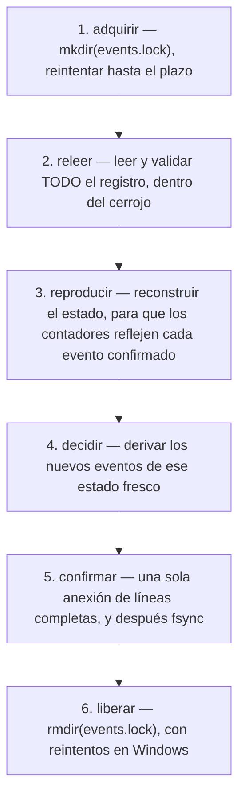

El estado de coordinación de Gaia vive en un solo archivo. Tras el intercambio de la [lección 2](../02-six-verbs/), el directorio de datos contiene exactamente esto:

```bash
ls -la "$GAIA_INTERAGENT_DATA_DIR"
```

```text
-rw-r--r-- 1 spare 197609 3617 Sep 15 19:41 events.jsonl
```

Ni base de datos, ni índice, ni instantánea, ni segundo archivo. 3 617 bytes de JSON delimitado por saltos de línea son todo el estado duradero de una sesión de coordinación con tres actores, y se pueden leer con `cat`.

## Diez registros

Este es el registro de eventos, reformateado para que quepa; en el disco, cada registro ocupa una línea:

```json
{"type":"actor.registered","at":"2026-09-15T23:41:09.954Z","ref":"act-0001","name":"gaia","isNew":true,"kind":"coordinator","declaredCapabilities":["observe","report"],"busAuthority":["send","receive","ack","heartbeat","handoff"]}
{"type":"actor.registered","at":"2026-09-15T23:41:28.116Z","ref":"act-0002","name":"builder","isNew":true,"kind":"claude-code","declaredCapabilities":["cwd=C:/repos/ga","branch=feat/voicings"],"busAuthority":["send","receive","ack","heartbeat","handoff"]}
{"type":"actor.registered","at":"2026-09-15T23:41:28.350Z","ref":"act-0003","name":"reviewer","isNew":true,"kind":"codex","declaredCapabilities":["cwd=C:/repos/ga","branch=feat/voicings"],"busAuthority":["send","receive","ack","heartbeat","handoff"]}
{"type":"message.sent","at":"2026-09-15T23:41:38.638Z","message":{"messageId":"msg-0001","correlationId":"cor-voicings","from":"act-0001","to":"act-0002","replyTo":"act-0001","expectsReply":true,"kind":"note","text":"Add the voicing-search cancellation test.","trust":"untrusted-text","authority":{"granted":["draft","report"],"denied":[],"effect":"none"},"flags":[],"delivery":"accepted-for-delivery; not read, not agreed, not completed","ackedBy":null}}
{"type":"message.sent","at":"2026-09-15T23:41:38.855Z","message":{"messageId":"msg-0002","correlationId":"cor-voicings","from":"act-0002","to":"act-0003","kind":"note","text":"Please merge this.","trust":"untrusted-text","authority":{"granted":[],"denied":["approve","merge"],"effect":"none"},"flags":["authority-language-detected"],"ackedBy":null}}
{"type":"authority.denied","at":"2026-09-15T23:41:38.855Z","messageId":"msg-0002","from":"act-0002","to":"act-0003","requested":["approve","merge"],"outcome":"stored-as-untrusted-text; no authority applied"}
{"type":"inbox.polled","at":"2026-09-15T23:41:48.115Z","actorId":"act-0003","messageIds":["msg-0002"]}
{"type":"message.acked","at":"2026-09-15T23:41:48.318Z","actorId":"act-0003","messageId":"msg-0002","note":"Read. No merge authority exists on this bus."}
{"type":"message.sent","at":"2026-09-15T23:41:48.520Z","message":{"messageId":"msg-0003","correlationId":"cor-voicings","from":"act-0002","to":"act-0003","kind":"handoff","text":"Candidate ready on feat/voicings; review only.","trust":"untrusted-text","authority":{"granted":[],"denied":[],"effect":"none"},"flags":[]}}
{"type":"work.handed-off","at":"2026-09-15T23:41:48.520Z","from":"act-0002","to":"act-0003","messageId":"msg-0003","correlationId":"cor-voicings","replyTo":"act-0002","summary":"Candidate ready on feat/voicings; review only.","authorityTransferred":[]}
```

Merece la pena destacar tres detalles.

**La denegación es un registro propio.** `authority.denied` está junto a `message.sent`, con lo que se pidió y el resultado: `stored-as-untrusted-text; no authority applied`. Podría haber sido un campo del mensaje. Convertirlo en un evento significa que la pregunta «¿alguien pidió alguna vez privilegios en este bus?» se responde con un `grep`, y la respuesta sobrevive aunque la forma del registro del mensaje cambie más adelante.

**Leer es escribir.** `inbox.polled` registra que `act-0003` miró su bandeja de entrada y qué vio. No es gratis, porque cuesta adquirir un cerrojo y hacer una anexión para una operación que parece una lectura, pero compra la distinción entre «el carril nunca miró» y «el carril miró y no hizo nada», que es lo primero que quieres saber cuando un traspaso parece haber sido ignorado.

**Los rechazos también se registran.** No en este registro, pero en el caso del nombre ambiguo de la lección 2, el evento anexado fue `command.rejected`. Un registro que solo guarda los éxitos no puede responder *qué intentó hacer esta sesión*, y esa es la pregunta que te haces cuando algo salió mal.

### Los dos contadores

Los identificadores se generan a partir del estado, no de un reloj ni de una fuente aleatoria: `act-0001`, `msg-0001`, y los identificadores de correlación salen de un emisor aparte. Como se derivan del estado reproducido, son densos y monótonos, y, esto es lo que costó trabajo de verdad, siguen siendo únicos entre *procesos*, como explica la siguiente sección.

## El protocolo de confirmación

Varios procesos servidor pueden compartir un mismo directorio de datos. Eso exige un protocolo de confirmación, y `src/event-log.mjs` documenta en su propia cabecera el que usa Gaia:

> El más pequeño que es realmente atómico en Windows es un *directorio* de cerrojo: `mkdir` lo crea o falla, sin ventana de lectura, modificación y escritura. Sin dependencia, sin fcntl, sin mutex con nombre.

El protocolo completo tiene seis pasos:



Los pasos 2 a 4 son los interesantes. El estado sobre el que se toma una decisión se relee *dentro* del cerrojo, cada vez, así que ningún identificador se asigna nunca a partir de un estado obsoleto: por eso dos procesos nunca generan el mismo `msg-0007`. El paso 5 es una sola anexión de líneas completas terminadas en salto de línea, seguida de `fsync`, así que un lector concurrente nunca ve medio registro.

Si has escrito una cola basada en archivos en Windows, reconocerás por qué se eligió `mkdir`. Un *archivo* de cerrojo necesita una apertura con creación exclusiva y después una limpieza cuidadosa; los cerrojos consultivos de `fcntl` no son portables; un mutex con nombre no es una opción sin dependencias y muere con el proceso que lo tiene. `mkdir` sobre una ruta que ya existe falla, de forma atómica, en todos los sistemas de archivos que importan. La cabecera incluso anota la particularidad de Windows: el fallo de «ya adquirido» es `EEXIST` *o* `EPERM`/`EACCES`.

### Por qué un cerrojo obsoleto se señala y nunca se rompe

Este es el mejor argumento breve de todo el código, y se generaliza mucho más allá de Gaia:

> Romper automáticamente un cerrojo obsoleto es un TOCTOU por construcción: un proceso en espera consulta un cerrojo viejo, el dueño lo libera, un tercer proceso adquiere uno nuevo, y entonces el `rmSync` del proceso en espera borra ese cerrojo nuevo, produciendo exactamente el estado con dos escritores que el cerrojo existe para impedir. Volver a comprobar el dueño o la generación estrecha la ventana, pero no puede cerrarla sin un comparar y borrar atómico, que el sistema de archivos no ofrece. Así que este producto falla cerrando y pide a un humano que lo mire.

Un cerrojo de más de 60 segundos se *señala* como probablemente abandonado. Nunca se elimina. El coste es un bus atascado que necesita a un humano; la alternativa es un bus que de vez en cuando se corrompe a sí mismo, justo en las condiciones en las que menos quieres sorpresas. Gaia elige lo primero, y lo dice, en lugar de entregar un rompedor de cerrojos obsoletos con un comentario que diga que probablemente no pasa nada.

Hay una sutileza relacionada con la *liberación*. En Windows, eliminar un directorio que este proceso creó y que todavía le pertenece puede fallar de forma transitoria: un antivirus o el indexador lo mantienen abierto unos milisegundos. Sin reintentos, la liberación lanza una excepción, el cerrojo sobrevive a su dueño, y todos los demás procesos fallan cerrando para siempre. Así que la liberación reintenta, hasta 12 veces, con 25 milisegundos de separación. La cabecera tiene cuidado de decir qué cambia eso y qué no: *«Estos reintentos cambian CUÁNDO se rinde la liberación del propio dueño. No cambian QUÉ cerrojo se elimina, y ninguna ruta de código elimina nunca un cerrojo que no le pertenece.»*

### El núcleo puro

La lógica de decisión vive en `src/bus-core.mjs`, que no tiene E/S, ni reloj, ni aleatoriedad. Cada comando lleva su propia marca de tiempo, que el servidor inyecta en el borde. Eso es lo que convierte `replay(events)` en una función pura del registro, y eso es lo que comprueba `verify`.

La cabecera también declara el coste con honestidad, algo más raro de lo que debería:

> El coste, dicho con exactitud y no con optimismo: `apply` llama a `ageActors` en cada evento, así que reproducir un registro es O(eventos × actores), no O(eventos). Aquí no hay implementada ninguna proyección, ni índice, ni desplazamiento de cola en caché, y no se afirma que los haya.

Retén esa complejidad: en la [lección 5](../05-limits-and-ecosystem/) resulta ser la razón de que el límite de carriles sea cuatro.

## Cerrado ante fallos, y los tres códigos de salida

| Código | Significado |
|---|---|
| 0 | correcto |
| 1 | la respuesta fue no: el bus rechazó, o un comando de solo lectura devolvió un veredicto de mala salud |
| 2 | error de uso |
| 3 | E/S cerrada ante fallos: plazo del cerrojo agotado o registro corrupto. **No se escribió nada.** Ningún reintento sirve. |

La distinción útil es la que hay entre 1 y 3, y el README da la razón: es *«la diferencia entre reintentar con una dirección mejor y parar e ir a buscar a un humano»*.

Un script que envuelve un carril de agente puede actuar en consecuencia. La salida 1 significa que la llamada estaba lo bastante bien formada para recibir respuesta y que la respuesta fue no: corrige la dirección o acepta el rechazo. La salida 3 significa que el bus ni siquiera pudo establecer cuál era la verdad, así que volver a intentarlo con otros argumentos no tiene sentido. La mayoría de las CLI juntan los dos casos en el 1, y entonces cada envoltorio reintenta lo que no se puede reintentar.

Todo en la capa de E/S falla cerrando de la misma manera: *«Un cerrojo que no se puede adquirir, una línea que no es JSON válido, un registro al que le falta su `type`, o un archivo cuya última línea está cortada lanzan una excepción en lugar de truncar, saltar o reiniciar el registro. Un registro corrupto es una condición que se señala, nunca una que se repara en silencio.»*

Un registro dañado se conserva para el diagnóstico. Es lo contrario de lo que hace la mayoría de la gestión de registros, y la razón es que los bytes dañados son la única evidencia de cómo se dañó.

### `doctor` sale con 1 sobre un registro que se reproduce pero no es sólido

`doctor` no escribe nada, y su código de salida es su veredicto. Sale con 1, no con 0, cuando el directorio se reproduce pero no es sólido internamente, por una de dos razones:

- el registro contiene una **dirección que este bus nunca generó**, lo que significa que un `act-NNNN` falsificado llegó al archivo;
- al **emisor de correlación le queda menos de una ventana de reclamación de margen**.

La segunda es la huella de un registro envenenado por una compilación anterior a la corrección. El emisor genera identificadores de correlación a partir de un rango; una compilación que los consumía mal deja la emisión automática muerta, o a una reclamación de estarlo. Como el registro es solo de anexión y nada lo repara, restaurar la emisión automática exige un **nuevo directorio de datos**. En el registro sano de la lección 2, la comprobación correspondiente dice:

```text
ok   the correlation issuer still has room to mint  —  the issuer is at 0 with 9007199254740991 ids of runway left
```

Ese número es `Number.MAX_SAFE_INTEGER`. El umbral de salud es de un millón de identificadores restantes, así que un bus nuevo está lejísimos de él.

## `verify`: 37 comprobaciones y dos regímenes

```bash
node scripts/gaia-interagent.mjs verify --pretty
```

```json
{
  "ok": true,
  "command": "verify",
  "evidenceOk": true,
  "evidenceGatesResult": false,
  "passed": 37,
  "failed": 0
}
```

Las comprobaciones se ejecutan en ocho secciones: `manifest`, `transport`, `templates`, `lanes`, `startup-timeout`, `ecosystem`, `tool-surface` y `evidence`. Algunas tratan del *producto* y no del registro, por ejemplo:

```text
ok   no network listener, no shell-command transport in shipped sources  —  105 source files scanned
ok   .mcp.json has no absolute developer path                            —  ["./src/mcp-server.mjs"]
ok   generated-config templates contain no absolute developer path       —  placeholders only
```

La primera de ellas es una afirmación que el README hace en su portada, ni escucha de red ni transporte por shell, convertida en una comprobación sobre las fuentes entregadas, para que la afirmación no pueda dejar de ser cierta en silencio.

### La separación que hace honesto a `verify`

La sección `evidence` es donde está la decisión de diseño interesante. Sus comprobaciones se reparten exactamente en dos clases, y la pertenencia se decide con una sola pregunta: **¿esta comprobación es legítimamente falsa en un espacio de trabajo correcto y vacío?**

**Autoridad e integridad: estas bloquean en cada ejecución.** Ninguna es una pregunta que un espacio de trabajo correcto y vacío responda mal:

```text
ok   replayable                                                    —  10 events
ok   deterministic replay                                          —  replay(events) == replay(events)
ok   no handoff transferred authority                              —  authorityTransferred is [] on every handoff
ok   no message was granted a privileged authority                 —  grants stay inside the allowlist
ok   every body is labelled untrusted-text                         —  3 messages
ok   every address in the log belongs to an actor this bus minted  —  3 actors, all minted
ok   every correlation id is inside the issuer range               —  1 threads, all within range
ok   the correlation issuer still has room to mint                 —  … 9007199254740991 ids of runway left
ok   every actor.registered carries the frozen busAuthority        —  3 registrations, all ["ack","handoff","heartbeat","receive","send"]
```

**Riqueza de la evidencia: consultiva por defecto.** Estas preguntan *¿es este registro un auténtico intercambio entre varias partes?*, y un espacio de trabajo nuevo, legítimamente, no lo es:

```text
ok   at least three actors                              —  3 actors
ok   more than one actor kind                           —  kinds: coordinator, claude-code, codex
ok   a correlated thread of three or more messages      —  widest thread cor-voicings has 3 messages
ok   at least one acknowledgement                       —  1 acked
ok   at least one handoff                               —  1 handoffs
```

Las cinco pasan aquí porque la lección 2 construyó a propósito un auténtico intercambio entre tres partes. En un bus nuevo estarían todas en rojo, y `verify` seguiría saliendo con **0**, mostrándolas. `evidenceGatesResult: false` en la respuesta es el indicador que dice en qué régimen se ejecutó. Afirma que el registro *es* evidencia, con `--evidence <path>` o `--require-evidence`, y las cinco pasan también a bloquear.

Esta es la idea de los cuatro ejes de la [lección 1](../01-the-problem/), implementada en una CLI. «¿Está este bus bien implementado?» y «¿merece este registro citarse como evidencia?» son preguntas distintas, y una herramienta que las respondiera con un solo código de salida tendría que equivocarse en una de ellas. Consultiva significa aquí *mostrada, nunca oculta*: las comprobaciones en rojo se imprimen en ambos casos.

### El verificador se verifica a sí mismo

Tres comprobaciones bloquean siempre, en los dos regímenes:

```text
ok   negative control: a synthetic single-actor log is rejected  —  at least three actors; more than one actor kind; …
ok   negative control: a widened busAuthority is rejected        —  every actor.registered carries the frozen busAuthority
ok   negative control: a tampered handoff is rejected            —  no handoff transferred authority
```

Cada una construye un registro que *debería* fallar, y falla si pasa. El razonamiento está en el README, en una frase corta: *un verificador que no puede fallar no prueba nada.*

Esto es **SCI-02** de la lección 1, aplicado a una batería de pruebas en lugar de a un experimento. La batería completa sigue el mismo enfoque a gran escala; en la revisión estudiada, `node --test` informa:

```text
ℹ tests 2075
ℹ suites 0
ℹ pass 2074
ℹ fail 0
ℹ cancelled 0
ℹ skipped 1
ℹ todo 0
ℹ duration_ms 38927.12
```

y muchos de esos nombres empiezan por `NEGATIVE CONTROL:`, incluidos algunos como *«un fallo de infraestructura se vuelve a lanzar, nunca se blanquea como una ejecución bloqueada»*, una prueba cuyo único trabajo es demostrar que una categoría de error no puede rebajarse en silencio a otra de mejor aspecto.

### `verify` pregunta más que `doctor`

Los dos nunca discrepan; `verify` simplemente pregunta más. Sale con 1 en las dos condiciones en las que bloquea `doctor`, y en las otras siete filas de autoridad que `doctor` no inspecciona en absoluto. Así, un registro cuyo traspaso transfirió `approve` hace que `verify` salga con 1 y deja `doctor` en 0.

No siempre fue así, y el README anota por qué se cambió: antes, los dos salían con 0 sobre un registro así *mientras `verify` mostraba su propia comprobación en rojo diciendo lo contrario*, y un lector que se fijara en el código de salida, o en `ok`, lo leía como un aprobado. Una herramienta que imprime un fallo y devuelve éxito ha producido una respuesta tranquilizadora donde debería haberse negado: exactamente el modo de fallo de la [lección 1](../01-the-problem/), dentro del verificador.

## Ejercicios

1. Tu envoltorio de CI ejecuta un comando del bus y obtiene la salida 3. Reintenta tres veces con espera progresiva y después informa de una prueba inestable. ¿Qué está mal en ese envoltorio?

<details>
<summary>Solución</summary>

La salida 3 significa cerrado ante fallos: plazo del cerrojo agotado o registro corrupto, sin nada escrito. «Ningún reintento sirve» forma parte del contrato. Si es un plazo de cerrojo agotado, reintentar es, en el mejor de los casos, esperar; y si el cerrojo está obsoleto, nunca se liberará solo, porque Gaia nunca rompe uno. Si el registro está corrupto, cada reintento relee los mismos bytes dañados.

El envoltorio debería distinguir: no reintentar nada, y escalar ante un 3, ya que es el código que significa precisamente *para y ve a buscar a un humano*. Llamarlo inestable es peor que inútil: etiqueta como ruido un fallo duradero y diagnosticable, y luego alguien sube el número de reintentos.

</details>

2. ¿Por qué el protocolo de confirmación relee y reproduce todo el registro dentro del cerrojo, en lugar de guardar el estado en memoria entre llamadas y anexar sobre él?

<details>
<summary>Solución</summary>

Por la corrección entre procesos. Varios procesos servidor pueden compartir un mismo directorio de datos, así que un estado guardado en caché en este proceso queda obsoleto en cuanto otro proceso confirma; y los identificadores se generan a partir de contadores reproducidos, así que dos procesos que decidieran con sus propias cachés generarían los dos `msg-0007`. Releer dentro del cerrojo es lo que hace sólidos los pasos 2 a 4.

El precio se declara en lugar de ocultarse: la reproducción es O(eventos × actores) y el registro nunca se compacta, así que cada llamada sale más cara a medida que el registro crece. La [lección 5](../05-limits-and-ecosystem/) muestra cómo este coste fija el número de carriles admitido, y nombra la ruta de lectura de coste acotado, un desplazamiento de cola en caché o una instantánea más la cola, como un cambio de diseño que deliberadamente todavía no se ha hecho.

</details>

3. Un colega propone que `inbox` no escriba ningún evento, porque «las lecturas no deberían mutar el estado», y eso reduciría a la mitad las adquisiciones de cerrojo en un bucle de sondeo. Argumenta a favor y en contra.

<details>
<summary>Solución</summary>

A favor: es una lectura; la escritura cuesta una adquisición de cerrojo y una anexión; un carril que sondea cada pocos segundos infla el registro, y como la reproducción es O(eventos × actores), un registro inflado hace más lenta cada llamada posterior. Es un coste real en el eje que ya limita el número de carriles.

En contra: `inbox.polled` es la única distinción duradera entre «el carril nunca miró» y «el carril miró y no hizo nada». Perderla significa que un traspaso ignorado y un traspaso nunca entregado parecen idénticos después, y esa es justo la pregunta forense que el registro existe para responder.

Una solución razonable conserva el registro pero deja de sondear: un carril que sondea con un temporizador está generando evidencia sobre el temporizador. Fíjate en que «añadir una ruta de lectura barata que se salte el cerrojo» no es una de las opciones: el cerrojo es lo que hace que la lectura vea un registro completo y no un registro escrito a medias.

</details>

4. `verify` muestra cinco comprobaciones de evidencia en rojo sobre un bus nuevo y sale con 0. ¿Es un error? ¿Qué haría falta para que esas cinco pasaran a bloquear?

<details>
<summary>Solución</summary>

No es un error: es la separación en dos regímenes. «¿Está este bus bien implementado?» es verdad en un espacio de trabajo nuevo; «¿es este registro un auténtico intercambio entre varias partes?» es legítimamente falso en él. Hacer bloqueante la segunda clase por defecto haría fallar todo espacio de trabajo correcto y vacío, y una comprobación en la que falla un sistema correcto es una que la gente aprende a ignorar.

Bloquean cuando quien llama afirma que el registro *es* evidencia, con `--evidence <path>` o `--require-evidence`; `evidenceGatesResult` en la respuesta anota qué régimen se ejecutó. Es la bisagra correcta: lo que sube el listón es la afirmación, no la herramienta. La prueba de humo de la fábrica en la [lección 4](../04-factory-and-receipts/) hace exactamente esa afirmación sobre su propio registro, y su informe muestra `evidenceGatesResult: true`.

</details>

## Fuentes

- Gaia: [`src/event-log.mjs`](https://github.com/GuitarAlchemist/gaia/blob/d68e90099ae2a6fbbec9d428617bfcd02095aac0/src/event-log.mjs), [`src/bus-core.mjs`](https://github.com/GuitarAlchemist/gaia/blob/d68e90099ae2a6fbbec9d428617bfcd02095aac0/src/bus-core.mjs), [`README.md`](https://github.com/GuitarAlchemist/gaia/blob/d68e90099ae2a6fbbec9d428617bfcd02095aac0/README.md), [recuperación tras un fallo](https://github.com/GuitarAlchemist/gaia/blob/d68e90099ae2a6fbbec9d428617bfcd02095aac0/docs/crash-recovery.md)
- Node.js: [ejecutor de pruebas `node:test`](https://nodejs.org/api/test.html), [`fs.appendFileSync`](https://nodejs.org/api/fs.html#fsappendfilesyncpath-data-options), [`fs.fsyncSync`](https://nodejs.org/api/fs.html#fsfsyncsyncfd)
- [Time-of-check to time-of-use](https://en.wikipedia.org/wiki/Time-of-check_to_time-of-use): la condición de carrera sobre la que gira el argumento del cerrojo obsoleto
