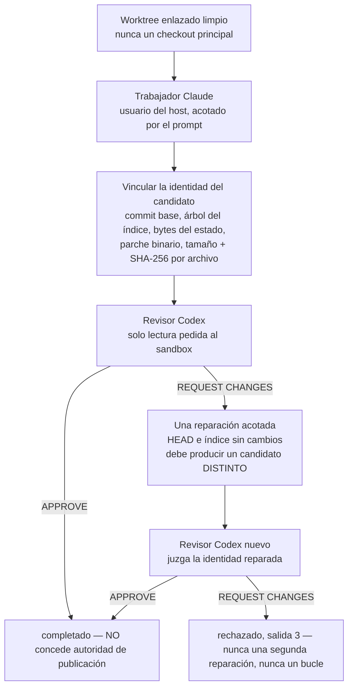

El bus transporta mensajes. Eso es necesario, pero no suficiente: en algún momento un agente tiene que cambiar un archivo, otro tiene que juzgar el cambio, y alguien tiene que decidir si se puede publicar. Esta lección trata de ese camino, y de lo que vale realmente el artefacto que produce.

Gaia lo construye en dos capas, y la separación es deliberada. La primera demuestra el plano de control sin ningún modelo en el circuito. La segunda añade agentes reales.

## La bala trazadora de coordinación

```bash
npm run factory:smoke -- \
  --data-dir ./state/factory-smoke \
  --artifact ./README.md \
  --out ./state/factory-smoke-report.json \
  --task "Review this candidate"
```

Registra un coordinador, un constructor y un revisor; envía tres mensajes correlacionados y acusa recibo de ellos; registra un traspaso sin autoridad; y falla a menos que pase la barrera de evidencias. Este es el informe que escribió, abreviado:

```json
{
  "ok": true,
  "status": "completed",
  "command": "factory-smoke",
  "execution": "coordination-tracer; no code execution",
  "artifact": {
    "path": "…\\gaia-pin\\README.md",
    "bytes": 71590,
    "sha256": "dc1a34bcbde334ad93e8d8df8effd8fade13f96b4a0d4babc643b62e36403225"
  },
  "task": "Review this candidate",
  "actors": { "coordinator": "act-0001", "builder": "act-0002", "reviewer": "act-0003" },
  "messages": ["msg-0001", "msg-0002", "msg-0004"],
  "acknowledgements": [
    { "messageId": "msg-0001", "ackedBy": "act-0002", "meaning": "receipt only; not agreement, approval, or completion" },
    { "messageId": "msg-0002", "ackedBy": "act-0001", "meaning": "receipt only; not agreement, approval, or completion" },
    { "messageId": "msg-0004", "ackedBy": "act-0001", "meaning": "receipt only; not agreement, approval, or completion" }
  ],
  "handoff": { "messageId": "msg-0003", "correlationId": "cor-0001", "authorityTransferred": [] },
  "evidenceLog": {
    "format": "gaia-event-log-fixed-point/1",
    "pathRole": "data-dir/events.jsonl",
    "bytes": 6315,
    "events": 15,
    "sha256": "256a51d27fd7920e3d871e486dbdf3e5a67489a115bb1f1216dc5a04033ec85a"
  },
  "verification": { "ok": true, "evidenceOk": true, "evidenceGatesResult": true },
  "toolSurface": ["ack", "handoff", "heartbeat", "inbox", "register", "send"]
}
```

Tres campos contienen toda la idea.

`execution: "coordination-tracer; no code execution"` es el informe diciéndote lo que no es. No ejecutó ningún modelo ni ejecutó código del repositorio. Demuestra el camino del *plano de control* de la fábrica, es decir, que un ciclo con tres roles puede completarse, verificarse y reproducirse, y deliberadamente no demuestra nada sobre la calidad ni la procedencia de un cambio producido por una IA. Una bala trazadora que insinuara más en silencio sería el atajo del «prototipo aceptado como integración» de la [lección 1](../01-the-problem/).

`evidenceLog` es un **punto fijo**: los bytes exactos del registro, su número y su SHA-256. Cualquiera que reciba este informe puede recalcular ese resumen a partir del registro y confirmar que está leyendo el mismo historial de coordinación. Sin él, «la ejecución tuvo éxito» es una frase en un archivo JSON.

`evidenceGatesResult: true` es la afirmación de la [lección 3](../03-event-log-and-replay/), hecha deliberadamente. La prueba de humo afirma que su registro *es* evidencia, así que las cinco comprobaciones de riqueza bloquean en lugar de limitarse a informar. Ejecútala, y la ejecución falla si el intercambio no fue de verdad entre varias partes.

Fíjate también en `toolSurface`, dentro del propio recibo. El artefacto registra el conjunto completo de verbos que existían cuando se produjo, así que un lector dentro de un año no tiene que confiar en que el código de hoy tenga los mismos seis.

## La fábrica real de agentes

Ahora, la capa que contiene modelos. Un solo comando crea un candidato con un trabajador Claude real y lo juzga con un revisor Codex real:

```bash
npm run factory:agent -- \
  --worktree ../my-project-gaia-run \
  --task "Implement the bounded change and its focused tests" \
  --out ../state/gaia-agent-run.json \
  --timeout-ms 600000
```

:::caution[No se ejecutó para esta lección]
Este comando gasta un turno real de Claude y un turno real de Codex con las suscripciones instaladas. Todo lo que sigue se ha leído en `src/factory-agent.mjs`, en [su documento de diseño](https://github.com/GuitarAlchemist/gaia/blob/d68e90099ae2a6fbbec9d428617bfcd02095aac0/docs/factory-agent-design.md) y en el esquema del recibo; está *por verificar* frente a una ejecución real, y el diario lo dice.
:::

### La forma, y por qué tiene esa forma

El documento de diseño registra tres interfaces candidatas antes de la implementación: [Design It Twice](../01-the-problem/), aplicado a una costura que soporta carga.

| Diseño | Por qué no, o por qué sí |
|---|---|
| Un script monolítico de Claude | El diff inicial más pequeño, pero las opciones del proveedor, el aislamiento de Git, la evidencia y el análisis del veredicto se vuelven inseparables |
| Un ejecutor de comandos arbitrarios | Flexible en apariencia, pero expone una interfaz superficial con forma de shell y convierte la autoridad, el entrecomillado y la identidad del proveedor en *afirmaciones de quien llama* |
| Un núcleo neutral respecto al proveedor con perfiles de proveedor **cerrados** | El elegido: el núcleo se encarga del aislamiento del worktree, la identidad del candidato, la no mutación durante la revisión, una única reparación acotada y la semántica del recibo; unos adaptadores pequeños se encargan de las invocaciones exactas de Claude y de Codex |

La expresión que vale la pena robar es *perfiles de proveedor cerrados*. Los perfiles de la v1 no son extensibles a propósito, y el documento explica por qué: es «intencionadamente cerrado, en lugar de fingir que comandos arbitrarios son proveedores seguros». Un punto de extensión aquí habría puesto la frontera de autoridad en manos de quien llama, que es justo donde deja de ser una frontera.

### El ciclo



Varias de esas cajas son rechazos que soportan carga, más que pasos.

**Worktree enlazado limpio, nunca un checkout principal.** Se rechaza un checkout principal o principal de submódulo, igual que un estado de entrada sucio. Por tanto, el candidato es siempre un árbol aislado, y «qué cambió» es una pregunta con una respuesta exacta.

**La identidad del candidato se vincula antes de la revisión.** El commit base, el árbol del índice, los bytes de `git status`, el parche binario, y el tamaño y el SHA-256 de cada archivo modificado o eliminado. Se rechaza un `HEAD` o un índice finales del trabajador que no coincidan, así que un trabajador que hizo un commit, o que manipuló el índice, no recibe un recibo que diga que produjo un candidato limpio.

**El revisor no debe mutar nada.** Gaia vincula el **árbol completo del worktree, incluidos los archivos ignorados**, antes de la revisión, y rechaza si ese árbol, `HEAD`, el índice o la identidad del candidato cambiaron durante ella. Incluir los archivos ignorados es el detalle que lo hace real: de lo contrario, un revisor que dejara en el árbol un artefacto de `node_modules` o una configuración local pasaría desapercibido, y «el revisor aprobó un árbol» sería una afirmación sobre un árbol que ya no existía.

**Una sola reparación, y tiene que reparar de verdad.** Un `REQUEST_CHANGES` no se convierte en éxito ni inicia un bucle. Exactamente un adaptador de reparación recibe la identidad exacta del candidato y la salida exacta del revisor; debe dejar `HEAD` y el índice sin cambios y debe producir una identidad de candidato **distinta y no vacía**. Una supuesta reparación que deja el candidato igual falla con un error tipado, en lugar de volver a revisión. Después, un revisor *nuevo* juzga la identidad reparada, y su veredicto es el que vale. Un segundo rechazo termina la ejecución con la salida 3 y nunca puede invocar otra reparación.

Esa última restricción es el antipatrón contra el que se construyó este diseño: el bucle de agentes que sigue reescribiendo hasta que un revisor se cansa. Limitarlo a una es lo que convierte el resultado en un hecho y no en una función de la paciencia.

### El recibo, y lo que se niega a afirmar

Un recibo vincula el commit base, los resúmenes del estado y del parche binario, el tamaño y el SHA-256 de cada archivo modificado, evidencia local direccionada por contenido para cada salida acotada de un agente, la frontera de autoridad pedida y la observada, y los dos veredictos del revisor cuando hubo una reparación. Las salidas en bruto de los modelos se tratan como evidencia local sensible: **nunca se incrustan en el recibo público**, pero sus rutas exactas, sus tamaños y sus identidades SHA-256 quedan vinculados en él y se reproducen después de guardarse.

Y después, el documento de diseño declara lo que no demuestra. Este párrafo es el más valioso de todo el repositorio:

> El trabajador que se ejecuta como usuario del host sigue siendo un residuo declarado. La política del prompt más la observación a posteriori del worktree no pueden demostrar que evitó la red, los secretos, las instalaciones o las escrituras en otros lugares. Tampoco pueden demostrar que no hubo una acción transitoria de Git si el trabajador restaura el HEAD y el índice exactos observados antes de volver. Cualquier recibo futuro que afirme una contención real del espacio de trabajo, o una certificación de las acciones históricas, necesita una frontera de capacidades aparte, del sistema operativo o de contenedor, y una nueva barrera de evidencias.

Claude se ejecuta como el usuario del host. Que le digan que se quede en el worktree es un prompt, y un prompt no es contención; el documento se niega a llamarlo así: *«Esto deliberadamente **no** se llama contención del sistema operativo: el modo que omite los permisos puede llegar a todo lo que alcanza el usuario del host, mientras que Gaia solo observa el worktree candidato y los controles de Git.»*

Compara cómo quedarían las dos frases en unas notas de versión normales. «Ejecuta agentes en un espacio de trabajo aislado» es lo que escribirían la mayoría de las herramientas. Gaia pone por escrito la brecha exacta entre lo que observa y lo que puede certificar, y nombra la frontera de capacidades que la cerraría. Otra vez los cuatro ejes: la *aceptación* es real aquí, la *contención* no está demostrada, y fusionarlas sería la mentira.

### Falsadores

El diseño enumera las condiciones que rechazarían la costura directamente. No son «cosas a vigilar», sino condiciones en las que el diseño es erróneo:

- un checkout principal, principal de submódulo o sucio puede ejecutarse;
- un alias físico coloca el recibo o la evidencia dentro del candidato;
- el `HEAD` o el árbol del índice observados al final difieren de su valor de entrada;
- se acepta una mutación ignorada del revisor;
- un veredicto de rechazo sale como éxito;
- una sustitución de API o de nube llega a un perfil de suscripción;
- un proceso hijo terminado sigue ejecutándose;
- un solo `REQUEST_CHANGES` provoca dos reparaciones, o un segundo rechazo inicia un bucle.

Escribir los falsadores antes de la implementación es **SCI-01** de la [lección 1](../01-the-problem/). Su valor práctico es que forman un plan de pruebas que otra persona puede ejecutar sin preguntar al autor qué significaba «terminado».

### Higiene de proveedores

Cada perfil de proveedor recibe una **lista mínima de variables de entorno del sistema permitidas**. Las claves de API, las sustituciones de tokens de autenticación, las opciones de enrutamiento a la nube, los endpoints personalizados y los secretos del host que no vienen al caso no se heredan, así que lo que se usa son los inicios de sesión de las suscripciones instaladas, en sus almacenes normales del perfil de usuario. Los dos proveedores se lanzan **sin shell**: en Windows, Gaia resuelve el ejecutable nativo de Claude e invoca directamente el punto de entrada JavaScript de Codex instalado con npm, en lugar de interpolar un prompt a través de `cmd.exe`, y esa es la diferencia entre un argumento y una línea de comandos en la que alguien puede inyectar algo.

La salida está acotada y cada invocación tiene un plazo; la terminación abarca todo el árbol de procesos, se endurece tras un periodo de gracia, e informa del fallo solo después de que el proceso hijo se haya cerrado.

### Un progreso que puedes seguir, y que no es una estimación

Mientras una ejecución está activa, `stderr` lleva un progreso legible para humanos y censurado: la validación, el inicio y el final del trabajador, el inicio y el veredicto de cada revisión, la reparación opcional y el resultado final, refrescado cada 10 segundos. `stdout` se queda exactamente con el JSON final. Cada línea lleva el tiempo transcurrido y una *cota superior del tiempo de proveedor restante*, calculada como el plazo de quien llama multiplicado por el número máximo de invocaciones de proveedor todavía alcanzables, y etiquetada así:

```text
(not an ETA)
```

A la inspección local de Git, al guardado de la evidencia y a la E/S del recibo no se les da a propósito ningún plazo ficticio. Es un detalle pequeño que dice mucho: una barra de progreso es una predicción, las predicciones sobre el trabajo abierto de un modelo no están respaldadas por evidencia, y por eso lo que se muestra es una cota que *sí* lo está, con una etiqueta que dice de cuál se trata.

El texto de la tarea, las rutas, los secretos y la salida de los proveedores nunca entran en el progreso ni en la telemetría. La exportación opcional a OpenTelemetry solo acepta direcciones HTTP de loopback, así que la opción no puede usarse para llegar a un backend alojado o de pago, y los fallos de exportación se tragan a propósito: *la observación nunca debe cambiar el resultado de la ejecución ni la autoridad*.

## Vincular un árbol a un número

Las revisiones de un candidato necesitan nombrar su objeto. Gaia incluye un resumen de árbol para eso:

```bash
node scripts/inventory-digest.mjs
```

```text
format=inventory-digest/1
root=…\scratchpad\gaia-pin
count=323
bytes=5937493
digest=ordinal-path-bytes-sha256/1 dccabe8f82fdced3240fef1ea9fb3f289daff950fa36b4ec6c06296df4132dbb
```

**El resumen nunca se imprime sin la receta al lado.** `inventory-digest/1` es el contrato de salida y `ordinal-path-bytes-sha256/1` es la receta del hash, porque, como dice el README, una cadena hexadecimal suelta «es exactamente lo que se copia en una revisión y después no se puede reproducir».

La receta, con exactitud: recorrer cada archivo regular, saltando `.git` y `node_modules` a cualquier profundidad; emitir por archivo `relative/path|byte-count|file-sha256`, con los separadores reescritos como `/`; ordenar por ruta de forma **ordinal**, por unidad de código UTF-16, nunca con `localeCompare` y nunca sin distinguir mayúsculas; unir con LF, sin LF final; y calcular el SHA-256 de la codificación UTF-8 de ese documento.

Vale la pena interiorizar dos consecuencias, porque muerden en cualquier esquema de direccionamiento por contenido:

- **Bytes en bruto, nunca texto decodificado.** Un checkout con CRLF y un checkout con LF de las mismas fuentes son árboles distintos, con resúmenes distintos. Gaia fija `* -text` en `.gitattributes` para que un checkout limpio en cualquier máquina reproduzca los bytes que se calcularon, y mantiene a propósito en el árbol archivos de los dos regímenes de fin de línea, para que esa fijación soporte carga y se pueda probar, en lugar de ser teórica.
- **Una entrada que no es ni un archivo regular ni un directorio se rechaza por su nombre**, no se salta. Un enlace simbólico, una unión o un nodo de dispositivo detienen el comando, porque saltarlos en silencio produciría un punto fijo de un árbol que no es el que está en el disco.

Y el comando no escribe dentro del árbol que mide: se rechaza un `--manifest <path>` que apunte dentro de `--root`, y se decide por la identidad en el sistema de archivos, para que un alias 8.3, una unión o una ruta UNC no puedan esquivarlo. Por la misma razón, el README renuncia a publicar un resumen de su propio árbol: la edición que lo publicara lo invalidaría.

## El único camino hacia un efecto privilegiado

Un `APPROVE` de la fábrica **no concede ninguna autoridad de publicación**. Entonces, ¿qué la concede?

Un humano con una clave. Un operador genera una sola vez un par de claves Ed25519 dedicado y cifrado, y después autoriza exactamente una ejecución sobre una revisión fijada. Antes de gastar nada, `run` vuelve a leer GitHub, materializa la única intención `AWAITING_AUTHORITY`, muestra cada uno de sus campos derivados de GitHub a través de un control que **elimina los caracteres de control del terminal y los caracteres bidireccionales** y limita la línea, y exige que el operador escriba la revisión completa de esa intención.

Solo entonces lee la clave cifrada, genera en memoria una concesión de corta duración, la gasta exactamente una vez y ejecuta. La frase de paso llega desde un diálogo enmascarado en Windows, o desde un lector de terminal oculto en otros sistemas: *«No hay ninguna opción, variable de entorno ni archivo que proporcione ninguna de las dos. Una sesión que controle este proceso con una tubería no puede autorizar nada.»*

Lee esa última frase como una afirmación sobre los agentes. Un agente que orquesta este proceso no puede autorizar una publicación *por construcción*, porque el único canal de entrada que funciona es un terminal interactivo. Es la misma idea que la de los seis verbos, la ausencia en lugar de una comprobación, aplicada una capa más arriba.

Dos detalles más con el mismo espíritu. La ruta del recibo se reclama **antes** de gastar la autoridad, y cada camino que vuelve después de esa reclamación deja allí un recibo censurado, incluido el de abandonar el prompt, que es «un rechazo que se nombra a sí mismo y sale con 1, nunca un éxito silencioso». Y el adaptador autorizado solo permite el commit, un push explícito con arrendamiento y la creación de la pull request: **no tiene ninguna capacidad de merge**. Una pull request puede llevar `Closes #N`, y GitHub solo actúa sobre ello después de un merge autorizado por separado.

## Ejercicios

1. La fábrica devuelve `APPROVE` y un recibo que vincula el SHA-256 de cada archivo modificado. Un compañero lo lee como «el cambio es correcto y se puede fusionar». Enumera todo lo que está mal en esa lectura.

<details>
<summary>Solución</summary>

Tres errores distintos, uno por eje.

*Correcto*: el recibo vincula la **identidad**, no la corrección. Demuestra que un revisor concreto, ante un árbol concreto que demostrablemente no cambió durante la revisión, devolvió `APPROVE`. Si ese juicio es acertado no es algo que un resumen pueda establecer.

*Se puede fusionar*: la aprobación no concede ninguna autoridad de publicación, explícitamente. Publicar exige el camino aparte del operador, con una clave cifrada, un terminal interactivo, la revisión completa escrita a mano y una concesión de un solo uso, y ni siquiera ese adaptador tiene capacidad de merge.

*El cambio*: el recibo describe el candidato en un worktree enlazado. Nada ha llegado a una rama que otra persona pueda ver.

Queda además el residuo declarado: el trabajador se ejecutó como el usuario del host, así que el recibo no puede certificar que no pasó nada fuera del worktree.

</details>

2. ¿Por qué la reparación debe producir una identidad de candidato *distinta*, y por qué la juzga un revisor nuevo y no el original?

<details>
<summary>Solución</summary>

Identidad distinta: es la única evidencia comprobable por una máquina de que la reparación hizo algo. Sin ella, un adaptador que volviera con éxito sin haber cambiado nada enviaría el candidato original de vuelta a revisión, y un revisor que cambiara su veredicto en la segunda pasada haría de «rechazado y luego aprobado» un hecho sobre la variabilidad del revisor y no sobre el código. Gaia tipa eso como un fallo, no como un candidato rechazado normal.

Revisor nuevo: un revisor que ya vio la versión rechazada tiene su propio rechazo en el contexto, y a un agente al que se le pide volver a juzgar su propio veredicto anterior se le está pidiendo coherencia, que no es lo mismo que acierto. Uno nuevo juzga el árbol reparado por sus propios méritos. También es ENG-08, el autor de un cambio no puede aprobarlo, aplicado a la reparación, que es a su vez un cambio.

</details>

3. Diseña un campo del recibo que demuestre que el trabajador nunca hizo una petición de red. ¿Qué haría falta?

<details>
<summary>Solución</summary>

Nada que puedas añadir al recibo tal como está, y precisamente por eso el residuo se declara en lugar de disimularse. La evidencia de la que dispone Gaia es la observación a posteriori de un worktree más los controles de Git; una petición de red no deja ningún rastro ahí. La política del prompt tampoco es evidencia: es una instrucción dada a un modelo.

Una respuesta sólida necesita una frontera que *observe* en lugar de *pedir*: ejecutar el trabajador en un contenedor o en un sandbox del sistema operativo sin ninguna ruta hacia fuera, o detrás de un proxy que registre cada conexión, y vincular en el recibo la propia certificación de ese componente. El documento de diseño dice exactamente eso: «una frontera de capacidades aparte, del sistema operativo o de contenedor, y una nueva barrera de evidencias».

La parte instructiva es la forma de la respuesta: no puedes añadir evidencia de una propiedad que el sistema nunca estuvo en posición de observar. Añadir el campo sin la frontera produciría un recibo que miente.

</details>

4. La pantalla del operador elimina los caracteres de control del terminal y los caracteres bidireccionales de los campos derivados de GitHub antes de mostrarlos. ¿Contra qué ataque se defiende, y por qué importa más aquí que en una CLI normal?

<details>
<summary>Solución</summary>

El texto que viene de GitHub, ya sea un título, un nombre de rama o el cuerpo de una issue, lo controla un atacante en el caso general: cualquiera que pueda abrir una issue puede poner bytes en ella. Las secuencias de escape ANSI pueden mover el cursor, borrar la línea y sobrescribir lo que ya se había impreso, y los caracteres de sustitución bidireccional pueden hacer que una cadena se *dibuje* en un orden distinto de su orden de bytes. Cualquiera de las dos cosas puede hacer que la intención mostrada difiera de la que está a punto de autorizarse.

Importa más aquí porque esta pantalla es el **último** punto de control legible por un humano antes de gastar una concesión de un solo uso en un efecto real. En cualquier otro sitio, una salida desordenada es cosmética; aquí es aquello en lo que se basa la decisión del operador. La mitigación va emparejada con la otra mitad del diseño: el operador no hace clic en sí, sino que escribe la revisión completa de la intención, así que el acuerdo queda vinculado a una identidad y no a lo que haya dibujado un terminal.

</details>

## Fuentes

- Gaia: [diseño del agente de fábrica](https://github.com/GuitarAlchemist/gaia/blob/d68e90099ae2a6fbbec9d428617bfcd02095aac0/docs/factory-agent-design.md), [operador de portafolio](https://github.com/GuitarAlchemist/gaia/blob/d68e90099ae2a6fbbec9d428617bfcd02095aac0/docs/github-portfolio-operator.md), [publicación de candidatos](https://github.com/GuitarAlchemist/gaia/blob/d68e90099ae2a6fbbec9d428617bfcd02095aac0/docs/github-portfolio-publication.md), [`README.md`](https://github.com/GuitarAlchemist/gaia/blob/d68e90099ae2a6fbbec9d428617bfcd02095aac0/README.md)
- Git: [`git worktree`](https://git-scm.com/docs/git-worktree), [`gitattributes`](https://git-scm.com/docs/gitattributes) para la fijación `* -text`
- [Ed25519](https://ed25519.cr.yp.to/) y [PKCS #8](https://datatracker.ietf.org/doc/html/rfc5958), el formato de clave que protege la frase de paso del operador
- [Unicode Technical Report #36](https://www.unicode.org/reports/tr36/), sobre los caracteres bidireccionales y la suplantación visual
