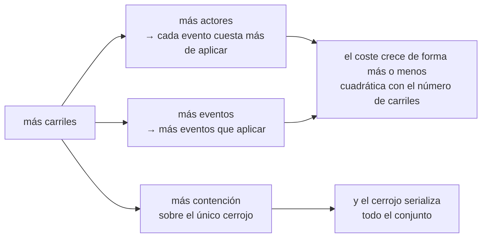

Todo sistema tiene dentro un número que nadie puede justificar. Alguien escribió `MAX_CONCURRENT = 16` con una fecha límite encima, nunca se cayó, y cinco años después es folclore que soporta carga. Esta lección trata del intento de Gaia de no tener uno de esos, y de la misma disciplina aplicada a una pregunta más difícil: con qué sistemas vecinos integrarse, y a cuáles decir que no.

## La escalera de evidencias

Gaia admite **cuatro carriles activos por espacio de trabajo**. El documento que respalda ese número es breve y se lee como un cuaderno de laboratorio:

| Carriles | Estado | Qué lo respalda |
|---|---|---|
| **4** | **PREDETERMINADO ADMITIDO** | Cuatro pares concurrentes de procesos cliente y servidor sobre un mismo registro, ejercitados en la batería de pruebas del propio producto, más las barreras de concurrencia entre procesos portadas |
| 6 | PRÓXIMO OBJETIVO DE VALIDACIÓN | Nada con carriles reales de Claude o Codex. Solo se permite con `--experimental-lanes`, y la salida lo etiqueta como experimental |
| 8 | NO DEMOSTRADO CON CLIENTES REALES | Solo se han medido trabajadores Node idénticos, con 8 y con 16. Solo se permite con `--experimental-lanes` |
| >8 | RECHAZADO SIEMPRE | No se ha medido nada por encima de 8, con ningún cliente |

La escalera está en el código, no solo en la prosa. `src/lanes.mjs` exporta la evidencia junto a las constantes:

```js
export const LANE_EVIDENCE = Object.freeze({
  4: 'supported: validated in this product\'s acceptance run',
  6: 'next validation target: NOT validated with real Claude/Codex lanes',
  8: 'unproven with real clients: only identical Node workers have been measured',
});
```

Pide seis y se niega, con una frase que te entrega todo el estado del conocimiento:

```text
LaneLimitError: refusing 6 live lanes: the supported default maximum is 4 per workspace. 6 is the
next validation target and 8 is unproven with real Claude/Codex lanes (only identical Node workers
have been measured). Pass --experimental-lanes to accept an unproven limit; it changes no evidence.
```

Acepta el límite no demostrado y lo obtienes, correctamente etiquetado:

```json
{ "limit": 6, "experimental": true, "note": "next validation target: NOT validated with real Claude/Codex lanes" }
```

Pide nueve, incluso con la opción:

```text
LaneLimitError: refusing 9 live lanes even with --experimental-lanes: nothing above 8 has been
measured at all, with any client. Raise this only with real-client evidence.
```

Y la comprobación de admisión, cuando los carriles están realmente activos:

```text
LaneLimitError: refusing to register lane 5: 4 live lanes already at the limit of 4. Retire a lane,
or raise the limit deliberately with --max-lanes/--experimental-lanes.
```

Dos decisiones de diseño de estos mensajes merecen copiarse.

**Lanza una excepción en lugar de recortar.** El comentario del módulo explica por qué: *«quien pide 8 carriles sin la opción no debe recibir 4 en silencio y creer que recibió 8.»* Recortar en silencio es un error de la misma familia que convertir un `requestedAuthority` mal formado en `[]` en la [lección 2](../02-six-verbs/): el sistema produce un valor cómodo y destruye la información de que quien llamaba quería otra cosa.

**La vía de escape registra en lugar de conceder.** Del documento: *«`--experimental-lanes` registra que un operador aceptó un límite no demostrado. No crea ninguna evidencia ni cambia ningún valor predeterminado.»* La opción es honesta: es una decisión, no una capacidad.

## Lo que las mediciones demuestran y lo que no

Esta es la parte del documento a la que siempre vuelvo, porque es la mitad más rara de una afirmación de ingeniería.

Las sondas con 4, 8 y 16 escritores ejecutaron **pares idénticos de cliente y servidor Node** sobre un mismo directorio de datos. Demuestran que:

- los identificadores son únicos entre procesos, densos y monótonos;
- el JSONL sigue teniendo un registro completo por línea bajo contención;
- la reproducción es determinista e idéntica byte a byte entre procesos;
- el modo de degradación con un cerrojo atascado es cerrado ante fallos, no corruptor.

**No** demuestran:

- el rendimiento, ni la latencia durante un turno real de un modelo;
- la heterogeneidad: «un carril de Claude y un carril de Codex no son dos trabajadores Node, y sus patrones de llamada, sus plazos y su comportamiento en reposo son distintos»;
- el comportamiento con un registro de diez mil a cien mil eventos, que ninguna medición ha cubierto;
- nada sobre un carril que se queda colgado en mitad de una llamada.

El experimento que falta tiene nombre: *la misma sonda con carriles reales de Claude y Codex.* Hasta que se ejecute, seis y ocho se quedan donde están.

Esa segunda lista es [SCI-04](../01-the-problem/), reproducibilidad frente a replicación, convertida en una afirmación operativa. La sonda con trabajadores Node es reproducible y barata, y establece de verdad los invariantes de concurrencia. No es una replicación con la población a la que el sistema sirve realmente, y la escalera se niega a dejar que una ocupe el lugar de la otra.

## Por qué el techo está donde está

El modelo de coste viene directamente de la [lección 3](../03-event-log-and-replay/). El coste por llamada es **O(eventos × actores)** bajo un único cerrojo global, sobre un registro que nunca se compacta, y los carriles empujan los dos factores:



Así que cuatro no es un número redondo elegido por pulcritud; es la cifra más alta que alguien ha ejercitado de principio a fin.

### Qué lo subiría

Tres cosas, juntas, y la honestidad de esta lista está en que la primera explícitamente *no* es un parámetro de ajuste:

1. **Una ruta de lectura de coste acotado**, un desplazamiento de cola en caché o una instantánea más la cola, para que el coste por llamada deje de ser O(eventos × actores). «Es un cambio de diseño, no un parámetro de ajuste, y deliberadamente no está implementado aquí.»
2. **Una sonda con carriles reales de Claude y Codex** en la cifra objetivo, sobre un registro de tamaño realista, que afirme las mismas propiedades de unicidad de identificadores, integridad del JSONL y determinismo de la reproducción que afirman las sondas con trabajadores Node.
3. **Una respuesta para cuando un carril atasca el cerrojo**, ya que sigue sin haber recuperación automática, y la [lección 3](../03-event-log-and-replay/) mostró por qué romper automáticamente un cerrojo obsoleto es un TOCTOU por construcción.

Y después, la frase que hace funcionar todo el documento:

> Subir el número en `src/lanes.mjs` sin (1) y (2) convertiría este documento en una mentira. Por eso el número y su evidencia viven en el mismo archivo.

Poner una constante junto a su justificación es un truco barato con una gran recompensa. La próxima persona que choque con el límite abrirá el archivo para cambiar el `4`, y encontrará el argumento antes que la asignación.

## Trabajar dentro del límite

- Un tipo de carril, un checkout, un ámbito de escritura, una ruta de resultado y un marcador de finalización por carril. **Mantén un único escritor con permiso de modificación por repositorio**: es la regla que hace útil el informe de colisión de espacios de trabajo de la [lección 2](../02-six-verbs/).
- `status` informa de `overSupportedLaneLimit`, así que un espacio de trabajo que haya pasado de cuatro por otra vía queda a la vista, en lugar de estar por encima en silencio.
- **Un carril que no da señales durante 30 segundos está `stale`, no desaparecido**: sigue registrado y sigue siendo direccionable. *«La accesibilidad parcial es el caso normal.»* Es el valor predeterminado correcto para los carriles de agentes, que se quedan en silencio durante minutos dentro de un solo turno de un modelo: tratar el silencio como una muerte eliminaría un carril en mitad de su trabajo.
- `wmux-lanes sweep` marca los carriles terminados y obsoletos con un `send` duradero normal. No envía ninguna señal a ningún proceso ni cierra ninguna superficie. Ni siquiera el verbo de limpieza tiene privilegios.

Por cierto, un latido establece exactamente una cosa. Del mapa de arquitectura: *«Los latidos de los carriles solo establecen la frescura del sensor. No entran en la verdad del backlog, ni en la aceptación, la finalización, el coste, el porcentaje o la estimación.»* Un carril que está vivo es un carril que está vivo, y nada más.

## Los veredictos del ecosistema

La segunda mitad de esta lección trata de otro tipo de límite. Gaia forma parte de una familia de repositorios, [GA](https://github.com/GuitarAlchemist/ga) (teoría musical en C# y F#), [TARS](https://github.com/GuitarAlchemist/tars) (un sistema de agentes en F#), Hari, e IX (un motor en Rust), y lo obvio sería conectarlo todo al bus.

Gaia conecta dos de los cuatro, y los veredictos están **impuestos en el código**:

```js
import { assertIntegrationAllowed } from './src/ecosystem.mjs';
```

```text
ga   -> ALLOWED {"repo":"ga","verdict":"ADAPTER_ONLY","reason":"GA is a producer with no MCP client; the shipped adapter tails its JSONL read-only and never writes GA."}
tars -> ALLOWED {"repo":"tars","verdict":"ADAPTER_ONLY","reason":"TARS already mounts MCP servers at runtime via configure_mcp_server. Generate a local, uncommitted mount; never edit the tracked mcp_config.json."}
hari -> EcosystemRefusal: hari: REJECT — Hari removed its MCP crate from main and already ships its own stdio-JSONL protocol with a reference client. Rejected: no integration ships in this plugin.
ix   -> EcosystemRefusal: ix: DEFER — IX states "not runtime coupling" as policy and already implements append-only-log-as-source-of-truth with deterministic replay. Deferred pending write-serialisation + actor identity AND an explicit owner decision.
```

No son comentarios. `assertIntegrationAllowed` lanza una excepción, y los scripts entregados la llaman antes de hacer nada, así que un futuro colaborador que escriba un adaptador para Hari descubre en tiempo de ejecución que la decisión ya se tomó y quedó registrada, en lugar de descubrirlo en una revisión seis semanas después.

### GA: un lector de cola y nada más

GA es el mayor productor de la familia y **no tiene cliente MCP**, así que «GA consume el bus» significaría escribir infraestructura de cliente MCP en .NET para un canal de coordinación. Todo lo que GA publicaría ya está en el disco con un esquema versionado, así que el bus añade exactamente una cosa: **el envío activo y una dirección de respuesta**. No la durabilidad, ni el orden, ni el esquema: todo eso ya está mejor resuelto del lado de GA.

Así que el adaptador abre el archivo de GA solo en modo `'r'`, guarda su desplazamiento en bytes en el directorio de datos *de Gaia* y no junto a GA, señala y salta un registro que no se puede analizar en lugar de reescribirlo, publica con `requestedAuthority: ["report"]`, la concesión más consultiva que existe, y por defecto funciona en modo de simulación.

Una sola línea resume toda la disciplina de autoridad de este curso: *«Una denegación de gobernanza de GA que llega por el bus es un informe sobre una denegación. No es autoridad para actuar en consecuencia.»*

### TARS: solo en tiempo de ejecución, sin cambios en el repositorio

TARS es el único hermano que ya es cliente y anfitrión MCP, así que puede montar el bus en tiempo de ejecución con su propia herramienta `configure_mcp_server`, sin ningún código en el repositorio: la integración más barata y más reversible que hay.

Se queda fuera del repositorio por una razón prosaica y decisiva: `mcp_config.json` está versionado y se comparte con la CI, así que poner ahí una ruta absoluta de una máquina rompe todas las demás máquinas. El generador escribe su artefacto en un directorio que tú eliges, nunca en un checkout.

La brecha que cierra es precisa: el `delegate_task` de TARS es una búsqueda en un registro dentro del proceso, un vocabulario de delegación sin alcance entre procesos. El bus le da una contraparte viva, con `correlationId` y `replyTo` intactos.

### Hari: rechazado, no aplazado

Hari ya tiene esto, y mejor tipado: un protocolo de streaming stdio-JSONL documentado, paridad de reproducción determinista, un cliente de referencia para su única contraparte y un libro mayor duradero. Y Hari **eliminó su crate MCP de `main`**.

> Añadir un segundo protocolo stdio a un repositorio que borró el primero es proponer que se revierta una decisión que su dueño ya tomó. Eso es una conversación con el dueño, no una bala trazadora, así que no se entrega nada.

Es el veredicto más interesante de los cuatro, porque la razón no es técnica. La integración funcionaría. Se rechaza porque entregarla anularía en silencio la decisión de otra persona, y lo correcto es tener la conversación. Solo se reconsidera si Hari vuelve a introducir una superficie MCP por sus propias razones, y «el bus no es una de esas razones».

### IX: aplazado, con dos condiciones con nombre

IX ya incluye esta arquitectura internamente, y con más rigor: un registro de eventos de sesión solo de anexión como fuente de verdad, la reproducción como proyección pura con una salida idéntica bit a bit entre procesos, y un middleware de aprobación determinista que emite un veredicto sobre cada acción. La idea central de Gaia, separar por construcción la coordinación de la autoridad, no es ninguna novedad para IX. IX tiene además una política escrita contra el acoplamiento en tiempo de ejecución entre repositorios, y una superficie MCP protegida por una aserción sobre el número exacto de herramientas, cuyo único trabajo es obligar a detenerse y pensar ante cualquier cambio de superficie.

Deben cumplirse **las dos** condiciones antes de que esto pase a `ADAPTER_ONLY`:

1. que el bus adquiera una **identidad de actor** mejor que la confianza posicional: tiene serialización de escrituras, pero no tiene autenticación;
2. una decisión explícita del dueño de modificar el invariante de no acoplamiento en tiempo de ejecución, con una respuesta escrita a por qué esto no repite el protocolo A2A obsoleto.

No ha ocurrido ninguna de las dos, así que la llamada lanza una excepción. Fíjate en la forma: un aplazamiento con criterios de salida es una decisión, mientras que un aplazamiento sin ellos es un elemento del backlog que nunca vuelve.

### Y un transporte que no lo es

El bus se compara a menudo con el propio `SendMessage` de Claude Code, que se dirige a otras sesiones de Claude en texto plano. El documento de Gaia es tajante sobre la diferencia: no está disponible en Windows nativo, ningún cliente que no sea Claude puede hablarlo con ninguna configuración, no lleva identificador de correlación, ni metadatos de autoridad, ni registro duradero, y su buzón por agente es transitorio, limitado a la sesión y se repara solo: *descarta los registros que no pasan la validación*.

> Ese es el contraste más marcado posible con este bus, que rechaza un registro que no puede analizar en lugar de descartarlo.

Un registro descartado es un agujero en la evidencia del que nadie informa. Un registro rechazado es un evento. Y si alguna vez se usa una vía rápida nativa, la regla está escrita de antemano: debe ser una optimización del transporte que escriba los mismos eventos en el mismo registro, nunca una segunda fuente de verdad.

## Lo que está implementado y lo que no

El mapa de arquitectura termina con un párrafo que la mayoría de los proyectos no publicaría:

> Este repositorio es un candidato a instalación, no un plugin instalado. La resolución automática de conflictos de pull requests y el ciclo de vida de sus efectos, la autoridad remota del operador más allá del camino interactivo entregado y la validación con seis carriles siguen planificados; los servicios de producción de inquilinos y cuotas quedan fuera del alcance. El trabajo planificado sigue sin ser normativo hasta que el código, la evidencia y una revisión de verificación nueva se enlacen aquí.

«No es un plugin instalado» también aparece en la portada del README, bajo un encabezado llamado **Install status**. El clasificador de conflictos de pull requests se entrega con un registro de estrategias de automatización *vacío*, así que las palabras `resolve` y `reconcile` aparecen en el vocabulario del ciclo de vida mientras el código se niega a hacer ninguna de las dos cosas: nombres reservados que no implican nada.

Y el mapa lleva su propio registro de verificación, guardado a propósito fuera del archivo para evitar un hash autorreferente:

```json
{
  "schema": "gaia-architecture-verification/1",
  "commit": "f26978df2f2a27a5ccd185a1ef7d18afe72ae1cf",
  "date": "2026-09-13",
  "contentRevision": "sha256:741d824db4e35be0ca92ee5b6be5f7c31f0cfc5724cd72069857880dfaaef273"
}
```

Un registro de verificación que vincula una fecha, un commit revisado y el SHA-256 de los bytes exactos revisados, de modo que «la arquitectura se revisó» es una afirmación comprobable sobre unos bytes concretos y no sobre un documento que se ha editado desde entonces.

## Puntos clave

- Cuatro carriles activos es el mayor número que alguien ha ejercitado de extremo a extremo. Seis y ocho exigen `--experimental-lanes`, que registra una decisión y no crea evidencia, y no se permite nada por encima de ocho.
- Pedir más que el límite lanza un error en lugar de recortar, y el número vive en el mismo archivo que su evidencia.
- Las sondas con workers de Node demuestran los invariantes de concurrencia, no el comportamiento de carriles reales de Claude y Codex: reproducible no es replicado.
- El techo viene de que la reproducción cuesta O(eventos × actores) bajo un único bloqueo; subirlo exige un camino de lectura de coste acotado, una sonda con clientes reales y una respuesta para un bloqueo atascado.
- Los veredictos del ecosistema se aplican en el código: GA y TARS solo reciben adaptadores, Hari se rechaza, e IX se aplaza con dos condiciones explícitas.

## Ejercicios

1. Tu equipo choca constantemente con el límite de cuatro carriles. Un colega abre `src/lanes.mjs`, cambia `DEFAULT_MAX_LIVE_LANES` a 8 y señala que las pruebas siguen pasando. ¿Qué está mal, y cuál es el cambio honesto más pequeño?

<details>
<summary>Solución</summary>

Que las pruebas pasen no es evidencia del nuevo número: la batería afirma invariantes de concurrencia con trabajadores Node idénticos, que es exactamente la población que, según el documento, *no* se generaliza a carriles reales de Claude y Codex. Si editas la constante, el documento que vive junto a ella pasa a ser falso, que es justo el resultado que predice el propio comentario del archivo.

El cambio honesto más pequeño: ninguno en la constante. Pasa `--experimental-lanes`, que registra que un operador aceptó un límite no demostrado y etiqueta cada salida con `experimental: true`. Así se obtienen los carriles hoy y la declaración de evidencia sigue siendo cierta.

La corrección real es más grande, y el documento ya la nombra: la ruta de lectura de coste acotado, después la sonda con clientes reales, y después una respuesta para un cerrojo atascado. Fíjate en el orden: sin (1), la sonda con ocho carriles mediría sobre todo el coste de reproducción O(eventos × actores).

</details>

2. ¿Por qué Hari es un `REJECT` y no un `DEFER`, cuando IX, que también implementa ya la arquitectura, está aplazado?

<details>
<summary>Solución</summary>

Porque los bloqueos son de naturaleza distinta. El de IX es una *condición*: un invariante de política que su dueño podría modificar, más una capacidad que Gaia podría adquirir, una identidad de actor mejor que la confianza posicional. Las dos se expresan como criterios de salida, así que el aplazamiento puede terminar.

El de Hari es una *decisión ya tomada*: eliminó su crate MCP de `main`. Entregar un adaptador MCP sería revertir desde fuera la elección de otra persona, y ninguna cantidad de ingeniería del lado de Gaia cambia eso; solo lo cambia una conversación con el dueño. Registrarlo como `DEFER` daría a entender que Gaia espera algo que controla.

La forma general: aplaza cuando sabes qué lo desbloquearía, rechaza cuando el bloqueo no te corresponde moverlo a ti.

</details>

3. Un carril se queda en silencio durante 90 segundos. Gaia lo marca como `stale` y lo mantiene registrado y direccionable. Argumenta a favor de la alternativa, darlo de baja, y di por qué Gaia no lo hace.

<details>
<summary>Solución</summary>

A favor de darlo de baja: un carril obsoleto ocupa una de cuatro plazas escasas, sigue apareciendo en `status`, sigue recibiendo mensajes que quizá nadie lea, y cada actor que se conserva encarece la reproducción, ya que el coste es O(eventos × actores).

En contra, y es decisivo: el silencio es el estado normal de un carril de agente sano. Un solo turno de un modelo con una llamada larga a una herramienta supera a menudo los 30 segundos, así que dar de baja por silencio expulsaría carriles en mitad de su trabajo, y los mensajes dirigidos a ellos tendrían que rechazarse o descartarse. También obligaría a decidir desde fuera que un proceso ha desaparecido, el mismo juicio que Gaia se niega a hacer sobre un cerrojo obsoleto, por la misma razón de TOCTOU.

Así que Gaia informa del estado y deja el actor direccionable: *«La accesibilidad parcial es el caso normal.»* La retirada es un acto explícito: `sweep` marca los carriles con un `send` duradero normal, y no envía ninguna señal a ningún proceso.

</details>

4. El README de Gaia dice que el repositorio es «un candidato a instalación, no un plugin instalado», y el clasificador de conflictos de pull requests se entrega con un registro de estrategias vacío. ¿Por qué publicar cualquiera de los dos hechos?

<details>
<summary>Solución</summary>

Los dos defienden contra la misma mala lectura. Un repositorio con 2 075 pruebas que pasan, un vocabulario del ciclo de vida que contiene `resolve` y `reconcile`, y una fábrica que ejecuta agentes reales parece un producto terminado, y a un lector que lo instala esperando resolución automática de conflictos lo habría engañado el vocabulario, no ninguna afirmación falsa.

Decirlo hace visibles los cuatro ejes una vez más: el código es de alta *calidad* y no ha sido *aceptado* para su instalación, y las dos cosas son independientes. El registro vacío es la versión estructural: palabras reservadas que no implican nada, con el vacío documentado, para que un lector que busque `resolve` con grep y encuentre el ciclo de vida no concluya que la resolución ocurre.

Hay también una razón interesada. «Candidato a instalación» es el estado en el que la barrera son revisiones nuevas e independientes de estándares y de especificación, y, como dice el README, *el carril que escribió esto no puede revisarlo*.

</details>

## Fuentes

- Gaia: [escala y carriles](https://github.com/GuitarAlchemist/gaia/blob/d68e90099ae2a6fbbec9d428617bfcd02095aac0/docs/scale-and-lanes.md), [`src/lanes.mjs`](https://github.com/GuitarAlchemist/gaia/blob/d68e90099ae2a6fbbec9d428617bfcd02095aac0/src/lanes.mjs), [adaptadores del ecosistema](https://github.com/GuitarAlchemist/gaia/blob/d68e90099ae2a6fbbec9d428617bfcd02095aac0/docs/ecosystem-adapters.md), [`src/ecosystem.mjs`](https://github.com/GuitarAlchemist/gaia/blob/d68e90099ae2a6fbbec9d428617bfcd02095aac0/src/ecosystem.mjs), [`ARCHITECTURE.md`](https://github.com/GuitarAlchemist/gaia/blob/d68e90099ae2a6fbbec9d428617bfcd02095aac0/ARCHITECTURE.md)
- Los hermanos: [GuitarAlchemist/ga](https://github.com/GuitarAlchemist/ga), [GuitarAlchemist/tars](https://github.com/GuitarAlchemist/tars)
- [Claude Code](https://code.claude.com/docs/en/overview): el agente cuya mensajería entre sesiones contrasta con el bus en la última sección
