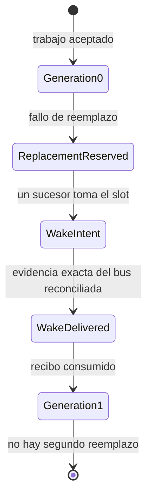
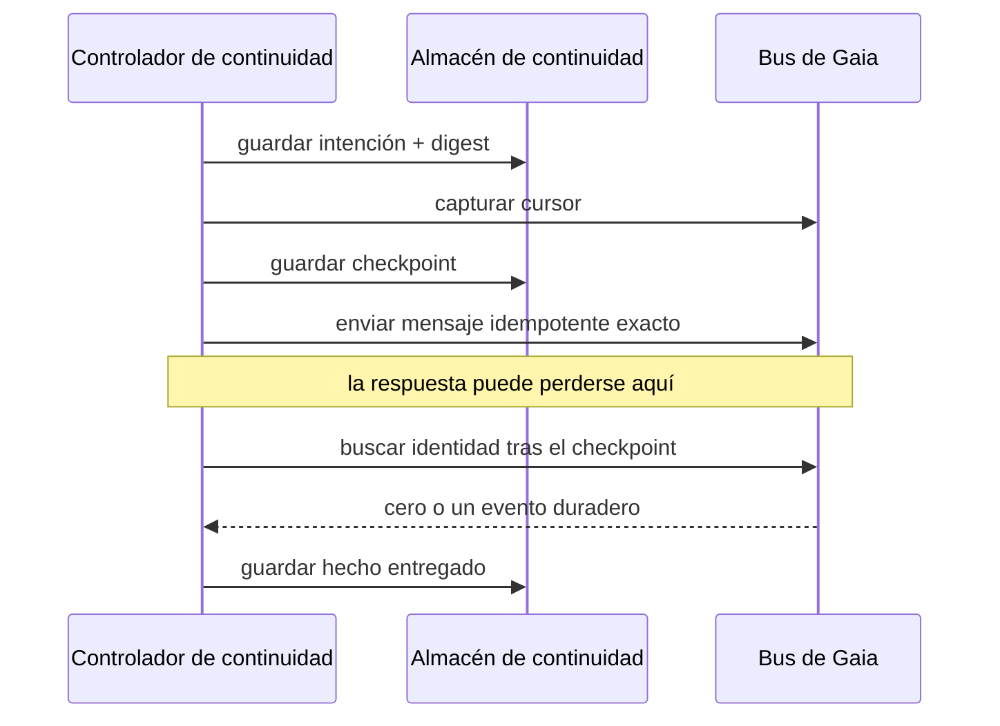

Las cinco primeras lecciones siguen un artefacto hasta la revisión. Se detienen antes de una pregunta difícil: ¿qué ocurre cuando desaparece el agente dueño de un trabajo aceptado y un sucesor debe continuar sin duplicar el efecto ni heredar autoridad invisible?

La [issue 76 de Gaia](https://github.com/GuitarAlchemist/gaia/issues/76) responde con un tracer deliberadamente pequeño: una identidad de trabajo, un slot de sucesor y un reemplazo de generación 0 a 1. No es un supervisor general.

## Máquina de estados acotada



Un bucle general requiere elección de líder, leases, supresión de duplicados, delegación de autoridad y split brain. El tracer pregunta solo si una revisión aceptada puede producir un wake, sobrevivir a un envío ambiguo y publicar un recibo sin autoridad.

## Exact replay con SQLite WAL

El almacén usa [SQLite](https://sqlite.org/) en modo WAL. Cada operación vincula su clave de idempotencia con la entrada exacta. Misma clave y entrada: resultado anterior. Misma clave y entrada distinta: `OPERATION_CONFLICT`.

Si `replace-76` primero nombra la generación 1 y después la 2, reproducir el éxito previo ocultaría el desacuerdo. El controlador recibe el almacén mediante inyección; una versión anterior importaba SQLite directamente y la revisión devolvió esa dependencia a un puerto. La política pertenece al dominio, la base es un adaptador.

## Un `send` devuelto no demuestra la entrega

El camino conserva cuatro hechos: intención de wake, cursor/checkpoint anterior, envío idempotente exacto y hecho `delivered` reconciliado después del checkpoint. Si el bus acepta el mensaje pero se pierde la respuesta, el reintento busca la identidad exacta en vez de enviar a ciegas. La decisión exige entrega, no intención.



## Recibo portátil tras el consumo

El recibo JSON contiene identidad, generaciones, evidencia del bus y digests. Su campo de autoridad está explícitamente vacío: continuidad transfiere contexto, no permiso para fusionar, desplegar, gastar o ampliar alcance.

[Demerzel](https://github.com/GuitarAlchemist/Demerzel) incluye el JSON Schema y fixtures y los valida en modo de solo lectura:

```text
transición Gaia -> recibo portátil -> validación Demerzel -> entrada de gobernanza independiente
```

El recibo es el seam; compartir base o runtime destruiría la propiedad de cada repositorio.

## Lo que encontró la revisión

| Forma débil | Fallo | Invariante corregido |
|---|---|---|
| controlador importa persistencia | el dominio depende de SQLite | inyectar puerto del almacén |
| la intención basta | un envío perdido parece entregado | exigir evidencia de entrega |
| la clave siempre reproduce | otra entrada hereda un éxito | `OPERATION_CONFLICT` |
| prueba sin sidecar | falta evidencia real del bus | crear y comprobar el sidecar |
| escaneos y asignaciones repetidos | aumenta el coste | consultar una vez y reutilizar resultados acotados |

La recuperación debe probar el **éxito ambiguo**, no solo el fallo limpio: el efecto quizá ocurrió y el código local todavía no lo sabe.

## Límites de proveedor y coste

- ningún fallback de pago sin autorización;
- ningún reintento sobre el límite de intentos o dólares;
- proveedor y modelo registrados en la evidencia;
- proveedor no disponible = rechazo duradero o revisión humana;
- un clasificador barato como Jev puede aconsejar routing, nunca probar entrega ni conceder efectos.

## Evidencia medida del candidato — no de una release

El 20 de septiembre de 2026, el candidato aislado ejecutó **2.261 pruebas Node: 2.259 pasaron, 0 fallaron, 2 se omitieron**; regresión enfocada **87/87**; verificador Gaia **37/37**; verificador de arquitectura correcto. Demerzel ejecutó **787 pruebas Python con 1 omitida** y **10/10 controles IXQL**.

Estas mediciones están ligadas al commit Gaia [`9a2f696`](https://github.com/GuitarAlchemist/gaia/commit/9a2f696805740cd75da6ebe29e9a99976f57dc2f), a su [recibo de evidencia](https://github.com/GuitarAlchemist/gaia/blob/2352085379ea365424b009d334d451b2c0dc1bd8/docs/design-receipts/gaia-76-continuity-r0-v7.4-acceptance.md) y al commit Demerzel [`fa04d7c`](https://github.com/GuitarAlchemist/Demerzel/commit/fa04d7ce234f10cd38b1134531c0b0032af59d72). Los flujos locales de comandos no están versionados: repite las gates nombradas o usa los checks de las PR antes de tratar estas cifras como evidencia publicada.

Son mediciones de worktrees candidatos, no prueba de publicación, fusión, revisión del commit final o release.

## Puntos clave

- R0 es un slot y un reemplazo, no un supervisor general.
- Idempotencia vincula la entrada exacta; otra entrada es conflicto.
- Un checkpoint previo permite reconciliar un resultado ambiguo.
- El recibo transfiere evidencia de contexto con autoridad vacía.
- Demerzel valida en solo lectura sin compartir estado.

## Ejercicios

1. El bus acepta el wake y el proceso muere antes de la respuesta. ¿Por qué no basta «reintentar una vez»?

<details><summary>Solución</summary>

El primer envío puede ser duradero. El segundo crearía dos wakes. El checkpoint limita la búsqueda y la identidad exacta distingue el efecto del tráfico cercano.

</details>

2. ¿Por qué autoridad vacía en vez de ausente?

<details><summary>Solución</summary>

Vacía afirma «sin autoridad». Ausente puede significar no modelada, desconocida u olvidada.

</details>

## Fuentes

- [Issue 76 de Gaia](https://github.com/GuitarAlchemist/gaia/issues/76), [arquitectura de Gaia](https://github.com/GuitarAlchemist/gaia/blob/main/ARCHITECTURE.md)
- [SQLite WAL](https://sqlite.org/wal.html), [Demerzel](https://github.com/GuitarAlchemist/Demerzel)
