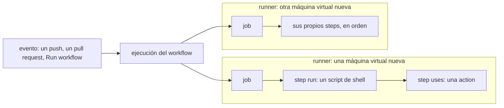

## El vocabulario, en correspondencia

Un **workflow** es un archivo YAML en `.github/workflows/`. Un **evento** (un push, un pull request, un clic en *Run workflow*) inicia una **ejecución** (run) de ese workflow. Una ejecución contiene **jobs**; cada job recibe una máquina virtual nueva, el **runner**, y ejecuta sus **steps** en orden. Un step ejecuta un script de shell (`run:`) o llama a una **action** (`uses:`), un fragmento de código reutilizable publicado en un repositorio.

El mismo vocabulario en imagen: un evento inicia una ejecución, y cada job de la ejecución recibe su propio runner.



| GitHub Actions | Azure Pipelines | Jenkins (declarativo) |
|---|---|---|
| workflow (`.github/workflows/*.yml`) | pipeline (`azure-pipelines.yml`) | `Jenkinsfile` |
| evento (`on:`) | `trigger:`, `pr:`, `schedules:` | `triggers { }` |
| job | job (los stages son opcionales) | `stage` |
| step: `run:` | `script:` / `pwsh:` | `sh` / `bat` |
| step: `uses:` (action) | tarea (`DotNetCoreCLI@2`) | step de plugin |
| runner (`runs-on: ubuntu-latest`) | agente (`pool: vmImage: ubuntu-latest`) | `agent { label '…' }` |

Dos consecuencias de «cada job recibe una máquina nueva» sorprenden a quien viene de Jenkins:

- al empezar un job no hay nada en el disco, **ni siquiera tu código**: tienes que hacer el checkout explícitamente;
- los archivos no pasan de un job al siguiente: los jobs comparten datos mediante salidas (lección 4) o artefactos ([lección 5](../05-caches-and-artifacts/)).

## El workflow útil más pequeño

[`.github/workflows/gha-01-hello.yml`](https://github.com/spareilleux/learn/blob/main/.github/workflows/gha-01-hello.yml):

```yaml
# GitHub Actions course, lesson 1: the smallest useful workflow
name: "GHA 01: hello"

on:
  workflow_dispatch:
  push:
    branches: [main]
    paths: ['.github/workflows/gha-01-hello.yml']

jobs:
  hello:
    runs-on: ubuntu-latest
    steps:
      - name: Say hello
        run: echo "Hello from GitHub Actions"

      - name: Where am I?
        run: |
          echo "Event:   ${{ github.event_name }}"
          echo "Commit:  ${{ github.sha }}"
          echo "Runner:  $RUNNER_OS $RUNNER_ARCH"
          echo "Workdir: $(pwd)"
          ls -A

      - name: Check out the repository
        uses: actions/checkout@v7

      - name: Look again
        run: ls -A
```

| Línea | Significado |
|---|---|
| `name:` | el nombre que se muestra en la pestaña *Actions* |
| `on: workflow_dispatch` | añade un botón *Run workflow* (y `gh workflow run`) |
| `on: push` con `branches` y `paths` | se ejecuta con un push a `main` que modifica este archivo |
| `jobs.hello.runs-on` | la imagen del runner: Ubuntu alojado por GitHub |
| `run: \|` | un script de varias líneas, ejecutado por `bash` en Linux y macOS |
| `uses: actions/checkout@v7` | la [action checkout](https://github.com/actions/checkout), versión mayor 7 |

## La ejecución, step a step

Hacer push del archivo inició una ejecución. Con la [CLI de GitHub](https://cli.github.com/):

```powershell
gh run list --workflow gha-01-hello.yml
gh run view 34845175861
gh run view 34845175861 --log
```

```text
✓ main GHA 01: hello · 34845175861
Triggered via push about 6 minutes ago

JOBS
✓ hello in 4s (ID 103979246921)
```

El log del step `Where am I?` (sin las marcas de tiempo):

```text
##[group]Run echo "Event:   push"
echo "Event:   push"
echo "Commit:  61e7e4235b7bc138f2f35cd7f61195bdaed4b019"
echo "Runner:  $RUNNER_OS $RUNNER_ARCH"
echo "Workdir: $(pwd)"
ls -A
shell: /usr/bin/bash -e {0}
Event:   push
Commit:  61e7e4235b7bc138f2f35cd7f61195bdaed4b019
Runner:  Linux X64
Workdir: /home/runner/work/learn/learn
```

Tres cosas que leer en él:

1. **`${{ github.event_name }}` se reemplazó antes de que bash se ejecutara.** El script que muestra el runner ya contiene `push`: las expresiones son una sustitución de texto hecha por GitHub. `$RUNNER_OS` es distinto: es una variable de entorno, expandida por bash. La lección 4 vuelve sobre esto, porque importa para la seguridad.
2. **`ls -A` no imprimió nada.** El directorio de trabajo `/home/runner/work/learn/learn` existe pero está vacío. Después de `actions/checkout`, el mismo comando lista el repositorio:

   ```text
   .git
   .gitattributes
   .github
   .gitignore
   .vscode
   AGENTS.md
   CLAUDE.md
   README.md
   ```

3. **`shell: /usr/bin/bash -e {0}`**: cada `run:` se escribe en un script temporal y se ejecuta con `bash -e`, así que el step falla en el primer comando que falla.

El step `Set up job` te dice lo que te tocó:

```text
Current runner version: '2.337.0'
Ubuntu
24.04.5
LTS
Image: ubuntu-24.04
Version: 20260907.300.1
GITHUB_TOKEN Permissions
Contents: read
Metadata: read
Packages: read
```

`ubuntu-latest` es una etiqueta que cambia con el tiempo: en septiembre de 2026 es Ubuntu 24.04. Y el job recibió un `GITHUB_TOKEN` que solo puede **leer** el repositorio — la [lección 7](../07-security/) explica cómo ampliarlo o restringirlo.

## Trampa: un workflow inválido falla en cada push

Mi primera versión del workflow de la lección 3 tenía un error de YAML. La lista de ejecuciones mostraba la **ruta del archivo** en lugar del nombre del workflow, un fallo en 0 segundos y ningún job:

```text
X main .github/workflows/gha-03-triggers.yml · 34845174629
Triggered via push less than a minute ago

X This run likely failed because of a workflow file issue.
```

La página web de la ejecución da el motivo: `You have an error in your yaml syntax on line 41`. Peor aún, el push siguiente — que no tocaba ese archivo, y el workflow tiene un filtro `paths` — produjo otra ejecución fallida: GitHub no puede leer los filtros de un archivo que no puede analizar. El culpable:

```yaml
        run: echo "cron: ${{ github.event.schedule }}"
```

En YAML, un valor sin comillas no puede contener `: ` (dos puntos seguidos de un espacio). Una comprobación local lo detecta antes del push:

```powershell
python -c "import yaml; yaml.safe_load(open('.github/workflows/gha-03-triggers.yml'))"
```

```text
yaml.scanner.ScannerError: mapping values are not allowed here
  in ".github/workflows/gha-03-triggers.yml", line 41, column 24
```

La corrección: un escalar de bloque (`run: |` y el comando en la línea siguiente), o poner todo el valor entre comillas.

## Puntos clave

- Workflow → ejecución → jobs (un runner nuevo cada uno) → steps (`run:` o `uses:`).
- Un job empieza con un espacio de trabajo vacío: `actions/checkout` es casi siempre el primer step.
- GitHub reemplaza `${{ }}` antes de que se ejecute el script; `$VAR` lo expande el shell.
- `gh run list`, `gh run view` y `gh run view --log` leen las ejecuciones sin salir de la terminal.
- Un workflow que no se puede analizar aparece como un fallo de 0 segundos con el nombre de su archivo, en cada push.

## Ejercicios

1. En `gha-01-hello.yml`, ¿qué imprimiría `ls -A` en el step `Where am I?` si `actions/checkout` fuera el primer step?

<details>
<summary>Solución</summary>

Los archivos del repositorio (`.git`, `.github`, `AGENTS.md`…), como en el step `Look again`. El checkout clona en el directorio de trabajo, `/home/runner/work/learn/learn`, que es donde empieza cada `run:`.

</details>

2. Añade un step que falle, ejecuta el workflow con `gh workflow run gha-01-hello.yml` y encuentra el step fallido desde la terminal.

<details>
<summary>Solución</summary>

```yaml
      - name: Fail on purpose
        run: exit 1
```

```powershell
gh workflow run gha-01-hello.yml
gh run list --workflow gha-01-hello.yml --limit 1
gh run view <run-id> --log-failed
```

`--log-failed` imprime solo los logs de los steps fallidos, terminando con `##[error]Process completed with exit code 1.`. Los steps posteriores no se ejecutan, salvo que tengan una condición como `if: always()` (lección 4).

</details>

3. ¿Por qué `echo "Runner: $RUNNER_OS"` funciona en un step `run:` pero `echo "cron: $X"` rompió el YAML?

<details>
<summary>Solución</summary>

La primera línea está dentro de un escalar de bloque (`run: |`), donde YAML toma el texto tal cual. La segunda era un escalar plano (sin comillas) en la misma línea que `run:`, y un escalar plano no puede contener `: `. No tiene nada que ver con el shell: el archivo se rechaza antes de que arranque ningún runner.

</details>

## Fuentes

- [Entender GitHub Actions](https://docs.github.com/actions/get-started/understand-github-actions)
- [Sintaxis de los workflows de GitHub Actions](https://docs.github.com/actions/reference/workflows-and-actions/workflow-syntax)
- [`gh run view` — manual de GitHub CLI](https://cli.github.com/manual/gh_run_view)
- [Especificación YAML 1.2 — escalares planos](https://yaml.org/spec/1.2.2/#733-plain-style)
