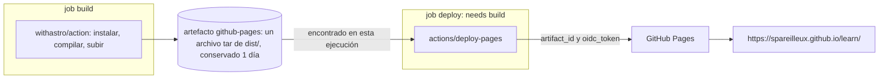

## El despliegue que estás leyendo

Esta página te llegó a través de [`.github/workflows/deploy.yml`](https://github.com/spareilleux/learn/blob/main/.github/workflows/deploy.yml), en cada push a `main`. Es corto, y cada línea usa algo de las lecciones anteriores:

```yaml
name: Deploy to GitHub Pages

on:
  push:
    branches: [main]
  workflow_dispatch:

permissions:
  contents: read
  pages: write
  id-token: write

# Two pushes in a row would start two Pages deployments, and the second one fails with
# "Deployment request failed ... due to in progress deployment". Queue them instead.
concurrency:
  group: pages
  cancel-in-progress: false

jobs:
  build:
    runs-on: ubuntu-latest
    steps:
      - name: Checkout
        uses: actions/checkout@v7
      - name: Install, build, and upload site
        uses: withastro/action@v6

  deploy:
    needs: build
    runs-on: ubuntu-latest
    environment:
      name: github-pages
      url: ${{ steps.deployment.outputs.page_url }}
    steps:
      - name: Deploy to GitHub Pages
        id: deployment
        uses: actions/deploy-pages@v5
```

En el lado del repositorio, [GitHub Pages](https://docs.github.com/pages) está configurado para desplegar desde Actions en lugar de desde una rama:

```powershell
gh api repos/spareilleux/learn/pages --jq '{url: .html_url, build_type, https_enforced}'
```

```text
{"build_type":"workflow","https_enforced":true,"url":"https://spareilleux.github.io/learn/"}
```

`build_type: workflow` es *Settings → Pages → Source: GitHub Actions*. Con la fuente anterior, *Deploy from a branch*, GitHub ejecuta su propio build de Jekyll sobre una rama como `gh-pages`; con un workflow, construyes lo que quieras y entregas los archivos.

## Job 1: construir y subir el sitio

[`withastro/action`](https://github.com/withastro/action) es una acción compuesta ([lección 6](../06-reuse/)). Su `action.yml` detecta el archivo de bloqueo, configura Node con la caché de npm, instala las dependencias, restaura la caché de Astro, construye el sitio, guarda la caché y termina con:

```text
- name: Upload Pages Artifact
  uses: actions/upload-pages-artifact@fc324d3547104276b827a68afc52ff2a11cc49c9 # v5
```

Una action fijada a un SHA de commit, con la versión en un comentario — el consejo de la [lección 7](../07-security/), aplicado por el equipo de Astro. De la ejecución del commit `fd52d46`:

```text
Cache restored from key: node-cache-Linux-x64-npm-fa7181d77dee2cc1ba065b6111b07b81f0308595291d60af9f8cc32a0d812697
added 275 packages, and audited 276 packages in 6s
Cache restored from key: astro-cache-Linux-a7a6f729702b8a1a4ed15adcb709863a3eb63db6
13:32:45 [starlight:pagefind] Found 310 HTML files.
13:32:46 [build] 310 page(s) built in 7.47s
  name: github-pages
  retention-days: 1
Artifact github-pages has been successfully uploaded! Final size is 9108634 bytes. Artifact ID is 10350355767
```

- El sitio es un **artefacto** normal ([lección 5](../05-caches-and-artifacts/)) llamado `github-pages`: un archivo tar de `dist/`, unos 9 MB para 310 páginas en tres idiomas.
- `retention-days: 1` es el valor por defecto de `upload-pages-artifact`: una vez desplegado el sitio, el archivo ya no sirve para nada.
- La clave de la caché de Astro es `astro-cache-${{ runner.os }}-${{ github.sha }}` con `restore-keys: astro-cache-${{ runner.os }}-`: una clave nueva en cada commit, y la caché del commit anterior (`a7a6f72`) restaurada por prefijo — el ejercicio 3 de la lección 5.
- El job entero tardó 30 s, 24 de ellos en este único step.

## Job 2: desplegar

[`actions/deploy-pages`](https://github.com/actions/deploy-pages) encuentra el artefacto de **esta** ejecución y pide a GitHub que lo publique:

```text
Fetching artifact metadata for "github-pages" in this workflow run
Found 1 artifact(s)
Creating Pages deployment with payload:
{
	"artifact_id": 10350355767,
	"pages_build_version": "fd52d46d1d2940e5dee33790e4a2873056f074f3",
	"oidc_token": "***"
}
Created deployment for fd52d46d1d2940e5dee33790e4a2873056f074f3, ID: fd52d46d1d2940e5dee33790e4a2873056f074f3
Getting Pages deployment status...
Reported success!
Evaluated environment url: https://spareilleux.github.io/learn/
```

¿Por qué los dos permisos? El README: «El permiso pages se refiere al `GITHUB_TOKEN`: le da los permisos para crear despliegues de Pages al llamar a la API de GitHub. El permiso id-token es necesario para solicitar el token JWT de OIDC» — el `oidc_token` del payload, enmascarado en el log. Es el mecanismo de la lección 7, que usa el propio GitHub para comprobar que el despliegue viene de un workflow de este repositorio.

El job de despliegue no descarga el repositorio ni instala nada: 8 segundos.

Los dos jobs se pasan el sitio como artefacto, y el job deploy envía su ID a GitHub con el token OIDC.



## El entorno `github-pages`

`environment: name: github-pages` asocia el job a un [entorno](https://docs.github.com/actions/how-tos/deploy/configure-and-manage-deployments/manage-environments), que GitHub creó automáticamente para Pages. Un entorno puede tener sus propios secretos y variables, y **reglas de protección** que un job debe superar antes de empezar:

```powershell
gh api repos/spareilleux/learn/environments --jq '.environments[] | {name, protection_rules}'
gh api repos/spareilleux/learn/environments/github-pages/deployment-branch-policies --jq '.branch_policies[] | {name, type}'
```

```text
{"name":"github-pages","protection_rules":[{"id":65464384,"node_id":"GA_kwDOUZJuCs4D5uhA","type":"branch_policy"}]}
{"name":"main","type":"branch"}
```

Solo `main` puede desplegar — el ejercicio 1 prueba otra rama. Otras reglas, como revisores obligatorios o un temporizador de espera, convierten el entorno en una puerta de aprobación manual, como una comprobación de aprobación en un entorno de Azure Pipelines.

Cada ejecución crea también un **despliegue**, con un historial de estados:

```powershell
gh api repos/spareilleux/learn/deployments/6438161238/statuses --jq '.[] | "\(.state) \(.created_at) \(.environment_url)"'
```

```text
success 2026-09-14T13:33:06Z https://spareilleux.github.io/learn/
in_progress 2026-09-14T13:32:57Z 
queued 2026-09-14T13:32:54Z 
waiting 2026-09-14T13:32:53Z 
```

La `url:` del entorno es lo que aparece como enlace en el resumen de la ejecución y en la página *Deployments* del repositorio.

## Despliegues en cola

La [lección 3](../03-triggers/) añadió el grupo de concurrencia después de que dos despliegues colisionaran. Varias sesiones hacen push a este repositorio; dos pushes con 41 segundos de diferencia, 45 minutos después:

| Ejecución | Commit | Ejecución creada | Job `build` creado | Job `deploy` terminado |
|---|---|---|---|---|
| 34849759801 | `a7a6f72` | 13:31:23 | 13:31:24 | 13:32:18 |
| 34849828422 | `fd52d46` | 13:32:04 | 13:32:18 | 13:33:05 |

La segunda ejecución existía a las 13:32:04, pero su job `build` se creó a las 13:32:18 — el segundo en que terminó el primer despliegue: 14 segundos en *pending*, y después desplegada. Ningún fallo, ningún commit perdido.

## La ruta base

Un sitio de repositorio se sirve bajo el nombre del repositorio: `https://spareilleux.github.io/learn/`, no en la raíz del dominio. Astro tiene que saberlo, en `astro.config.mjs`:

```text
site: 'https://spareilleux.github.io',
base: '/learn',
```

Por eso también las lecciones de este sitio solo usan enlaces relativos (`../journal/`): ejercicio 3.

## Puntos clave

- Un workflow de Pages son dos jobs: construir un artefacto llamado `github-pages`, y después `actions/deploy-pages` con `pages: write` e `id-token: write`.
- El entorno `github-pages` registra cada despliegue y puede restringir quién despliega: aquí, solo `main`.
- `concurrency: group: pages` con `cancel-in-progress: false` pone los despliegues en cola en lugar de hacerlos fallar.
- Un sitio de proyecto vive bajo `/<repository>/`: configura la ruta base y evita los enlaces absolutos desde la raíz.

## Ejercicios

1. Lanza el workflow de despliegue en otra rama: `gh workflow run deploy.yml --ref gha-06-invalid`. ¿Cambia el sitio?

<details>
<summary>Solución</summary>

No. El job `build` se ejecutó y subió su artefacto; el job `deploy` fue rechazado antes de obtener un runner (0 steps, 1 segundo):

```text
X Branch "gha-06-invalid" is not allowed to deploy to github-pages due to environment protection rules.
X The deployment was rejected or didn't satisfy other protection rules.
```

Aun así se registró un despliegue, con los estados `waiting` y después `failure`. La regla se comprueba cuando el job **empieza**, así que cualquier job de esa rama sin `environment:` se ejecutaría igualmente: el entorno protege sus secretos y sus despliegues, no el resto del workflow.

</details>

2. El job `deploy` no tiene `actions/checkout`. ¿De dónde vienen los archivos del sitio, y qué pasaría si el job `build` los subiera con otro nombre de artefacto?

<details>
<summary>Solución</summary>

Del artefacto de la misma ejecución, obtenido a través de la API — los steps del job son solo *Set up job*, *Deploy to GitHub Pages* y *Complete job*. `deploy-pages` busca el nombre indicado por su input `artifact_name`, `github-pages` por defecto (`Fetching artifact metadata for "github-pages" in this workflow run`). Con otro nombre, no lo encontraría: pasa el mismo nombre a las dos actions. *Por verificar*: el mensaje de error exacto.

</details>

3. Una lección contiene el enlace Markdown `[method](/method/)`. En local, con `astro dev`, ¿adónde lleva, y en el sitio publicado?

<details>
<summary>Solución</summary>

En el sitio publicado, a `https://spareilleux.github.io/method/`, fuera del sitio del repositorio:

```text
404 https://spareilleux.github.io/method/
200 https://spareilleux.github.io/learn/method/
```

Astro no reescribe con el `base` los enlaces escritos en Markdown. En local, el servidor de desarrollo también sirve bajo `/learn/`, así que el enlace también se rompe ahí — *por verificar* con `astro dev`. Un enlace relativo (`../method/`) funciona en los dos sitios.

</details>

## Fuentes

- [Usar workflows personalizados con GitHub Pages](https://docs.github.com/pages/getting-started-with-github-pages/using-custom-workflows-with-github-pages)
- [`actions/deploy-pages`](https://github.com/actions/deploy-pages) y [`actions/upload-pages-artifact`](https://github.com/actions/upload-pages-artifact)
- [Gestionar entornos para el despliegue](https://docs.github.com/actions/how-tos/deploy/configure-and-manage-deployments/manage-environments)
- [Desplegar tu sitio de Astro en GitHub Pages](https://docs.astro.build/en/guides/deploy/github/)
- [API REST: despliegues](https://docs.github.com/rest/deployments/deployments)
