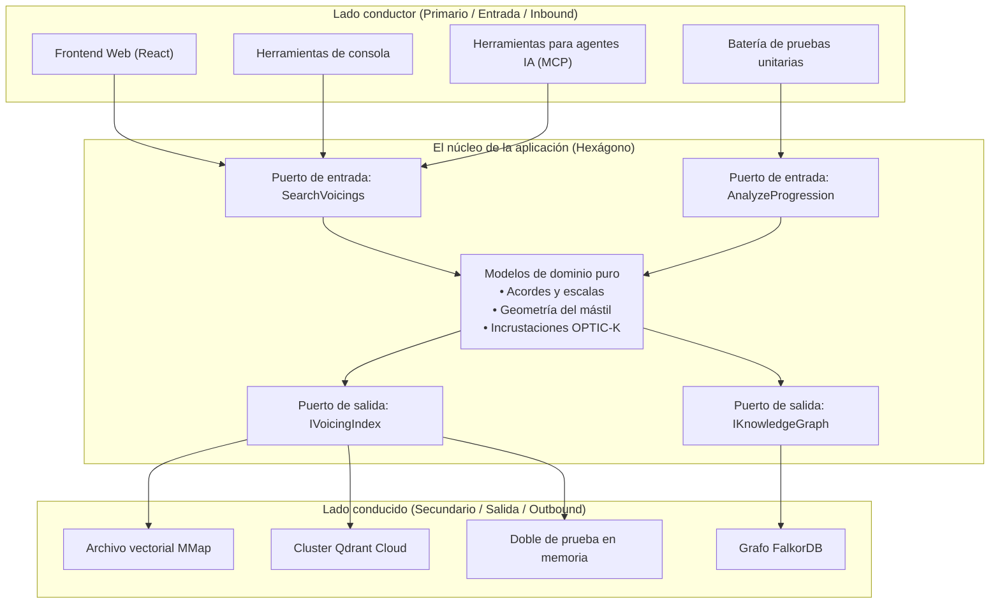
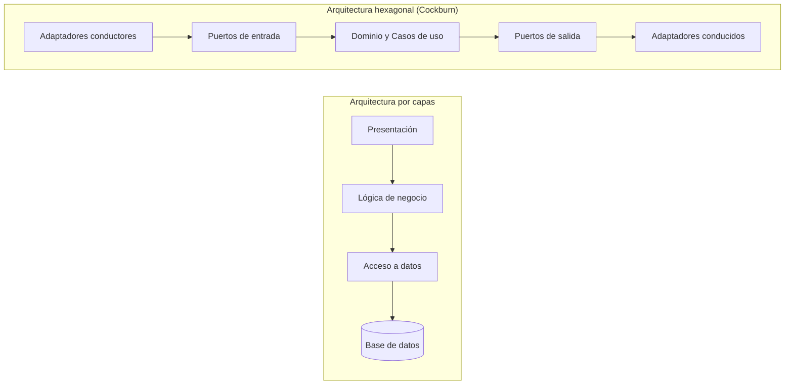

La arquitectura hexagonal fue concebida por **Alistair Cockburn** en 2005 para erradicar un mal endémico del desarrollo de software: el entrelazamiento destructivo de la lógica de negocio con las interfaces de usuario, los frameworks HTTP, las consultas SQL y las dependencias de terceros.

Cockburn advirtió que independientemente de si un estímulo procede de una petición HTTP, un arnés de pruebas automatizadas, un script de consola o un panel de administración, el problema de negocio a resolver es idéntico. Simétricamente, ya sea que el estado se persista en SQLite, una base de datos relacional corporativa, un diccionario en memoria o un motor vectorial en la nube, el requisito de dominio se reduce a: *"almacenar y recuperar este agregado"*.

El principio fundacional establece:

> *"Permitir que una aplicación pueda ser conducida indistintamente por usuarios, otros programas, pruebas automatizadas o scripts por lotes, y ser desarrollada y probada en total aislamiento de sus dispositivos y bases de datos reales en tiempo de ejecución."*
> — Alistair Cockburn

---

## ¿Por qué un hexágono?

La forma geométrica carece de propiedades matemáticas secretas: el patrón no está restringido a seis lados.

Cockburn eligió el hexágono como metáfora visual para superar el clásico diagrama unidimensional vertical por capas (Presentación &rarr; Negocio &rarr; Base de datos). Un polígono bidimensional enfatiza visualmente que el núcleo de la aplicación posee **múltiples facetas** a través de las cuales interactúa con el mundo exterior:



La arquitectura se organiza en torno a un límite estricto: **el Interior frente al Exterior**.

---

## El límite Interior vs Exterior

### El Interior (El núcleo del hexágono)

El interior alberga dos capas:
1. **El modelo de dominio**: las reglas de negocio puras, entidades, objetos de valor e invariantes matemáticos. En Guitar Alchemist, incluye `PitchClass`, `Interval`, `PitchClassSet`, `ChordDefinition` y el cálculo de digitaciones en el mástil. Carece por completo de referencias a ASP.NET Core, Entity Framework, Qdrant o serializadores JSON.
2. **La capa de aplicación (Casos de uso)**: orquesta las entidades de dominio para satisfacer las intenciones del usuario. Define las operaciones del sistema (por ejemplo, `SearchVoicingsUseCase`, `AnalyzeProgressionUseCase`).

El interior define los **Puertos**. El interior nunca conoce el exterior.

### El Exterior

El exterior engloba todo aquello que es contingente, técnico o dependiente del entorno:
- Protocolos de comunicación: HTTP, WebSockets, SignalR, gRPC, Language Server Protocol (LSP), Model Context Protocol (MCP);
- Almacenamiento: bases de datos relacionales, Redis, FalkorDB, archivos mapeados en memoria, almacenamiento en la nube;
- Servicios externos: APIs de inferencia LLM (Anthropic Claude, OpenAI), motores locales ONNX, sintetizadores de audio.

El exterior implementa o utiliza los puertos a través de **Adaptadores**.

---

## Los Puertos: contratos en la frontera

Un **Puerto** es una interfaz definida por la aplicación. Se expresa en el lenguaje ubicuo del dominio de negocio, sin tecnicismos de infraestructura.

Los puertos se clasifican en dos vertientes simétricas:

### 1. Puertos de entrada (Driving / Primary Ports)

Los puertos de entrada definen **lo que la aplicación ofrece** al exterior. Son los casos de uso del sistema.

- **Iniciador**: un usuario, un agente de IA, una tarea programada o un arnés de pruebas;
- **Dirección del flujo**: el exterior invoca al interior;
- **En C#**: una interfaz de caso de uso o un manejador de comandos/consultas (Command/Query Handler).

```csharp
// Interior: Puerto de entrada
public interface ISearchVoicingsUseCase
{
    Result<VoicingSearchResult, SearchError> Execute(VoicingSearchQuery query);
}

public readonly record struct VoicingSearchQuery(
    PitchClassSet PitchClasses,
    Tuning Tuning,
    FretSpan AllowedSpan,
    int MaxFretSpan = 4);
```

### 2. Puertos de salida (Driven / Secondary Ports)

Los puertos de salida definen **lo que la aplicación necesita** para realizar su cometido de negocio.

- **Ejecutor**: una base de datos, un índice vectorial, un sintetizador de audio o el sistema de archivos;
- **Dirección del flujo**: el interior llama al puerto; el adaptador externo implementa la interfaz;
- **En C#**: una interfaz declarada en el núcleo de dominio e implementada en un proyecto de infraestructura.

```csharp
// Interior: Puerto de salida (declarado en el dominio)
public interface IVoicingVectorIndexPort
{
    ValueTask<IReadOnlyList<VoicingMatch>> FindNearestNeighborsAsync(
        ReadOnlyMemory<float> queryVector, 
        int limit, 
        CancellationToken cancellationToken = default);
}
```

Es vital advertir este detalle: **la interfaz `IVoicingVectorIndexPort` reside en el núcleo de dominio, no en la infraestructura.** Esta es la aplicación rigurosa del **Principio de Inversión de Dependencias (DIP)**.

---

## Los Adaptadores: los traductores

Un **Adaptador** es un componente técnico concreto que conecta una tecnología externa con un puerto.

### Adaptadores conductores (Driving Adapters)

Un adaptador conductor toma una señal externa (una petición HTTP POST, un mensaje JSON de un agente) y la traduce a una llamada a un puerto de entrada:

```csharp
// Exterior: Adaptador conductor (Controlador ASP.NET Core)
[ApiController]
[Route("api/voicings")]
public sealed class VoicingsController(ISearchVoicingsUseCase searchUseCase) : ControllerBase
{
    [HttpPost("search")]
    public IActionResult Search([FromBody] VoicingSearchHttpRequest request)
    {
        // 1. Traducir el DTO HTTP a la consulta de dominio
        var query = new VoicingSearchQuery(
            PitchClassSet.FromMask(request.PitchClassMask),
            Tuning.StandardGuitar,
            new FretSpan(request.MinFret, request.MaxFret));

        // 2. Invocar el puerto de entrada
        var result = searchUseCase.Execute(query);

        // 3. Traducir la respuesta de dominio al resultado HTTP
        return result.Match<IActionResult>(
            success => Ok(VoicingSearchHttpResponse.FromDomain(success)),
            error => BadRequest(new { error = error.Message }));
    }
}
```

Otro adaptador conductor puede ser una herramienta para **Model Context Protocol (MCP)** utilizada por un modelo de IA:

```csharp
// Exterior: Adaptador conductor (Herramienta para GaMcpServer)
[McpTool("search_voicings", "Busca digitaciones ergonómicas de acordes en la guitarra")]
public sealed class SearchVoicingsMcpTool(ISearchVoicingsUseCase searchUseCase)
{
    public Task<string> ExecuteAsync(int pitchClassMask, int minFret, int maxFret)
    {
        var query = new VoicingSearchQuery(
            PitchClassSet.FromMask(pitchClassMask),
            Tuning.StandardGuitar,
            new FretSpan(minFret, maxFret));

        var result = searchUseCase.Execute(query);
        return Task.FromResult(result.Match(
            s => JsonSerializer.Serialize(s),
            e => $"Error: {e.Message}"));
    }
}
```

Nótese que tanto el controlador web como la herramienta MCP invocan **exactamente el mismo puerto** (`ISearchVoicingsUseCase`). Ninguno de ellos alberga lógica de negocio.

### Adaptadores conducidos (Driven Adapters)

Un adaptador conducido implementa un puerto de salida encapsulando una tecnología concreta:

```csharp
// Exterior: Adaptador conducido (Archivo mapeado en memoria para OPTIC-K)
public sealed class MemoryMappedOptickAdapter(OptickIndexReader reader) : IVoicingVectorIndexPort
{
    public ValueTask<IReadOnlyList<VoicingMatch>> FindNearestNeighborsAsync(
        ReadOnlyMemory<float> queryVector, 
        int limit, 
        CancellationToken cancellationToken)
    {
        // Traducir la llamada de dominio a una búsqueda SIMD por punteros
        var results = reader.SearchCosine(queryVector.Span, limit);
        return ValueTask.FromResult(results);
    }
}
```

Si deseamos sustituir el archivo local por un cluster distribuido de Qdrant, basta con escribir un `QdrantVectorAdapter` que implemente `IVoicingVectorIndexPort`. **El núcleo de dominio permanece completamente inalterado.**

---

## Comparativa: Hexagonal vs Por capas vs Onion vs Clean

Los diferentes términos arquitectónicos suelen confundirse en la práctica. Aunque todos persiguen el aislamiento del dominio, sus estructuras difieren:

| Característica | Por capas clásica (N-Tiers) | Hexagonal (Cockburn 2005) | Onion (Palermo 2008) | Clean Architecture (Martin 2012) |
|---|---|---|---|---|
| **Centro de gravedad** | Base de datos / Acceso a datos | Dominio y Casos de uso | Modelo de dominio | Entidades |
| **Simetría principal** | Arriba &rarr; Abajo (Vertical) | Interior &harr; Exterior (Radial) | Anillos concéntricos | Anillos concéntricos |
| **Definición de puertos** | Inexistente (interfaces acopladas) | Explícita: Conductor vs Conducido | Interfaces de dominio | Puertos de entrada y salida |
| **Número de capas** | 3 o 4 capas rígidas | 2 zonas (Interior / Exterior) | 4 anillos concéntricos | 4 anillos concéntricos |
| **Estructura** | Fija (UI, Negocio, DAL) | Minimalista (Puertos y Adaptadores) | Define Servicios de Dominio | Prescribe Presentadores y Pasarelas |



### La regla fundamental

- En la **Arquitectura por capas**, las dependencias fluyen hacia abajo, apuntando a la base de datos como cimiento.
- En la **Arquitectura hexagonal**, todas las dependencias fluyen **hacia el interior**, apuntando al dominio de negocio. La base de datos es un mero detalle de infraestructura periférico, intercambiable con un archivo temporal o una colección en memoria.
