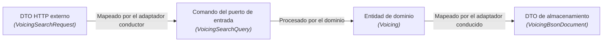
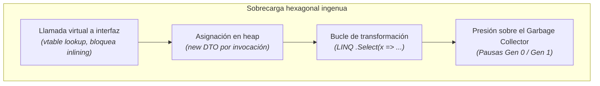

En arquitectura de software no existen las soluciones mágicas. Todo diseño implica equilibrar fuerzas opuestas: mantenibilidad frente a carga mental, aislamiento frente a rendimiento bruto y flexibilidad frente a rapidez de desarrollo.

La arquitectura hexagonal suele describirse como un ideal incuestionable. Para tomar decisiones de ingeniería fundamentadas, debemos evaluar tanto sus extraordinarias ventajas como sus costes reales — en particular en aplicaciones C# de cómputo intensivo como [Guitar Alchemist](../music-theory-ga/).

---

## Las Ventajas

### 1. Testabilidad a velocidad vertiginosa

En una arquitectura por capas clásica, probar un servicio de negocio requiere con frecuencia configurar una base de datos en memoria con EF Core, levantar contenedores Testcontainers para PostgreSQL o Redis, o construir complejos árboles de dobles con `Mock<IRepository>` y `Mock<ILogger>`.

En la arquitectura hexagonal, verificar el núcleo de dominio se realiza **sin infraestructura alguna**:
- Los puertos de salida se conectan a colecciones sencillas en memoria o a dobles de prueba (*fakes*) ligeros, sin proxys dinámicos;
- Una batería de 500 pruebas de lógica pura se ejecuta en **menos de 200 milisegundos**;
- Las pruebas se ejecutan de forma totalmente autónoma, sin conexión de red, sin acceso al disco y sin demonio Docker.

```csharp
[Fact]
public void SearchVoicings_FiltraVoicingsInalcanzables_DentroDelRangoSolicitado()
{
    // Arrange: Adaptador de prueba ligero en memoria
    var fakeIndex = new InMemoryVoicingIndexAdapter(SampleVoicings.All);
    var useCase = new SearchVoicingsUseCase(fakeIndex);

    var query = new VoicingSearchQuery(
        PitchClassSet.FromNotes(Note.C, Note.E, Note.G),
        Tuning.StandardGuitar,
        new FretSpan(0, 4));

    // Act
    var result = useCase.Execute(query);

    // Assert: prueba unitaria pura ejecutada en 0,4 ms
    Assert.True(result.IsSuccess);
    Assert.All(result.Value.Voicings, v => Assert.True(v.FretSpan <= 4));
}
```

### 2. Paridad multi-interfaz para arquitecturas con IA

En la actualidad, las aplicaciones no se limitan a una interfaz web respaldada por un controlador HTTP. En la era de la IA y el utillaje avanzado para desarrolladores, una aplicación debe exponer sus capacidades a través de múltiples canales simultáneos:
1. **APIs Web y móviles**: HTTP REST, GraphQL, canales SignalR en tiempo real;
2. **Herramientas para agentes IA**: servidores Model Context Protocol (MCP) para Claude Code, Codex o Antigravity;
3. **Integración con el IDE**: servidores de lenguaje (LSP) para editores de código;
4. **Herramientas de ingeniería**: comandos de terminal CLI y procesos batch.

Sin arquitectura hexagonal, cada canal suele reescribir su propia orquestación, validación y gestión de errores, lo que genera discrepancias sutiles de comportamiento.

Con arquitectura hexagonal, **cada canal es simplemente otro adaptador conductor que invoca el mismo puerto de entrada**. Cuando un agente de IA llama a `SearchVoicings` vía MCP y un usuario web lo hace desde React, ambos ejecutan exactamente el mismo código de dominio compilado.

### 3. Postergación de decisiones técnicas y sustituibilidad

Una buena arquitectura debe posponer el compromiso con tecnologías específicas el mayor tiempo posible:
- Es posible diseñar y validar todo el motor de armonía y generación de acordes mucho antes de elegir entre Qdrant, FalkorDB o un archivo binario local;
- Cambiar de proveedor de modelos de lenguaje (de Anthropic Claude a un modelo local en ONNX u Ollama) solo afecta al adaptador de salida;
- El núcleo de dominio permanece inalterado ante actualizaciones del framework web o migraciones entre versiones de .NET.

### 4. Pureza absoluta del modelo de dominio

El código de negocio queda totalmente blindado de ruido técnico:
- Cero anotaciones de base de datos (`[Table]`, `[Key]`, `[ForeignKey]`);
- Cero atributos de serialización (`[JsonPropertyName]`, `[BsonElement]`);
- Cero códigos de estado HTTP ni herencia de clases base de controladores.

---

## Desventajas y Costes Ocultos

### 1. Proliferación de DTOs y código de transformación

En la arquitectura hexagonal, cada dato que cruza un límite debe traducirse entre múltiples representaciones:



Para cada funcionalidad, los ingenieros deben implementar y mantener:
- 1 interfaz de puerto de entrada;
- 1 DTO de petición o comando;
- 1 entidad u objeto de valor de dominio;
- 1 interfaz de puerto de salida;
- 1 DTO de almacenamiento para el adaptador;
- Entre 2 y 4 funciones de transformación.

Para operaciones simples de lectura y escritura (CRUD), esta estructura se percibe como una carga burocrática excesiva sin beneficio práctico.

### 2. Carga cognitiva e indirección en la navegación

Al diagnosticar un defecto, un desarrollador no puede simplemente pulsar «Ir a implementación» en su IDE y seguir el flujo lineal. Debe navegar por múltiples capas:
`Controlador` &rarr; `Mapeo` &rarr; `Puerto de entrada` &rarr; `Caso de uso` &rarr; `Dominio` &rarr; `Puerto de salida` &rarr; `Adaptador` &rarr; `Cliente técnico`.

Para desarrolladores júnior o bajo presión de plazos, esta indirección produce fatiga mental y puede inducir a sortear los puertos.

---

## El Problema Crítico: El Peaje de Rendimiento (Performance Tax)

En aplicaciones corporativas habituales (decenas de peticiones por segundo contra una base SQL), el coste de la abstracción hexagonal es irrelevante frente a la latencia de red.

Sin embargo, en **sistemas de alto rendimiento algorítmico y baja latencia** — como la búsqueda por similitud sobre 626.094 digitaciones vectorizadas en 240 dimensiones en Guitar Alchemist, el procesamiento de audio en tiempo real o bucles armónicos evaluados 100.000 veces por segundo —, **una arquitectura hexagonal ingenua puede degradar el rendimiento en varios órdenes de magnitud.**



### Por qué los puertos ingenuos penalizan el rendimiento:

1. **Despacho virtual e impedimento de inlining**:
   Invocar métodos a través de interfaces (`IVectorIndex.Search(...)`) requiere despacho virtual. El compilador JIT de .NET no puede realizar la integración en línea (*inlining*) entre ensamblados dinámicos, impidiendo optimizaciones críticas de bucles y reutilización de registros de CPU.
2. **Asignaciones masivas en el Heap**:
   Si un puerto de salida acepta un `IEnumerable<float>` o devuelve un `Task<List<VoicingMatch>>`, cada consulta asigna objetos en la memoria administrada. Al evaluar 626.000 acordes, se crean millones de objetos efímeros, saturando el recolector de basura en generaciones 0 y 1.
3. **Pérdida de continuidad en memoria y vectorización SIMD**:
   Las operaciones vectoriales SIMD (`Vector256<float>`, AVX-512) exigen memoria contigua alineada a 32 o 64 bytes. Ocultar el acceso a datos tras un `IReadOnlyList<T>` introduce indirección de punteros, destruyendo la localidad de caché L1/L2 del procesador.

### Cómo neutralizar este peaje en C# moderno:
Tal como exploramos en la [Lección 3](03-hexagonal-csharp-dotnet/), C# 14 y .NET 10 proporcionan mecanismos avanzados (`ReadOnlySpan<T>`, tipos `ref struct`, interfaces estáticas abstractas y memoria no administrada) que permiten construir límites hexagonales **sin coste de asignación en memoria**.

---

## Matriz de decisión: ¿Cuándo aplicar la arquitectura hexagonal?

| Contexto | Recomendación | Justificación |
|---|---|---|
| **Lógica de dominio compleja (DDD)** | **Altamente recomendado** | Protege algoritmos e invariantes matemáticos frente a la contaminación de infraestructura. |
| **Múltiples interfaces de acceso (Web + IA MCP + CLI + LSP)** | **Altamente recomendado** | Asegura paridad rigurosa de comportamiento entre usuarios humanos y agentes de IA. |
| **Cómputo numérico intensivo, Audio / DSP, Búsqueda vectorial** | **Recomendado con cautela** | Obligatorio emplear contratos de cero asignaciones (`Span<T>`, tipos por valor). |
| **APIs CRUD elementales** | **Desaconsejado** | Sobrecarga innecesaria; Minimal APIs directas resultan sustancialmente más productivas. |
| **Microservicios temporales / Prototipos rápidos** | **Desaconsejado** | La inversión en capas y adaptadores nunca llegará a amortizarse en su ciclo de vida. |
