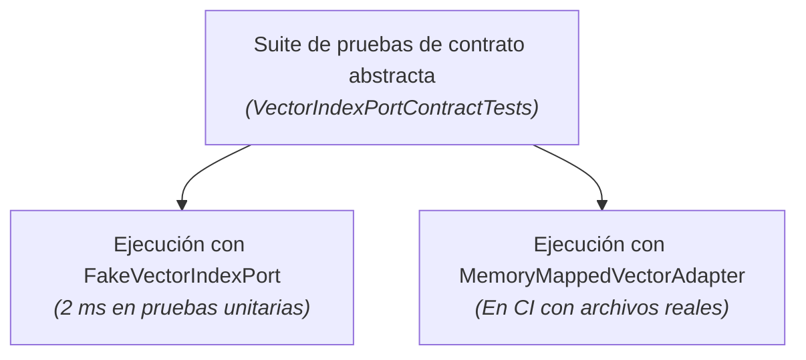

La adopción de la arquitectura hexagonal en C# ha madurado de forma decisiva en los últimos años. Las antiguas implementaciones en .NET dependían de pesadas jerarquías de interfaces, bibliotecas de simulación dinámica (`Moq`) y DTOs asignados continuamente en el heap administrado.

Con **C# 14** y **.NET 10**, disponemos de herramientas de lenguaje de última generación que permiten blindar los límites del hexágono **con cero asignaciones en memoria y un coste de ejecución inapreciable.**

---

## 1. Puertos sin asignaciones mediante `ReadOnlySpan<T>`

La principal amenaza para el rendimiento en la arquitectura hexagonal proviene de la copia de datos a través de los límites de los puertos. Si los métodos de un puerto de salida instancian colecciones para cada llamada, el recolector de basura degrada la latencia de forma inmediata.

En .NET 10, los puertos pueden aceptar `ReadOnlySpan<T>` o `ReadOnlyMemory<T>`, permitiendo transferir bloques de memoria sin copia alguna, directamente desde la pila (*stack*) o desde archivos mapeados en memoria:

```csharp
namespace GA.Domain.Ports.Outbound;

public readonly record struct NeighborMatch(int VoicingId, float Similarity);

public interface IVectorIndexPort
{
    /// <summary>
    /// Busca los vecinos más próximos mediante SIMD sin asignaciones en el heap.
    /// Utiliza ReadOnlySpan<float> para consultar buffers en memoria sin copias intermedias.
    /// </summary>
    int SearchNearest(
        ReadOnlySpan<float> queryVector, 
        Span<NeighborMatch> destinationMatches);
}
```

### Implementación del adaptador conducido

El adaptador implementa este contrato interactuando directamente con memoria no administrada:

```csharp
namespace GA.Infrastructure.Adapters.Vector;

public sealed class MemoryMappedVectorAdapter(SafeBuffer indexMemory, int totalVoicings) : IVectorIndexPort
{
    public unsafe int SearchNearest(
        ReadOnlySpan<float> queryVector, 
        Span<NeighborMatch> destinationMatches)
    {
        byte* ptr = null;
        indexMemory.AcquirePointer(ref ptr);
        try
        {
            float* vectorData = (float*)ptr;
            // Búsqueda SIMD ultrarrápida sobre números contiguos
            return SimdVectorSearch.FindTopK(
                queryVector, 
                vectorData, 
                totalVoicings, 
                destinationMatches);
        }
        finally
        {
            indexMemory.ReleasePointer();
        }
    }
}
```

No se crea ningún objeto en el heap durante la búsqueda. Tanto el vector de consulta como el buffer de destino pueden residir en la pila mediante `stackalloc`:

```csharp
// En el interior del caso de uso: cero asignaciones de principio a fin
Span<float> queryVector = stackalloc float[240];
embeddingService.ComputeOptickVector(chord, queryVector);

Span<NeighborMatch> matches = stackalloc NeighborMatch[10];
int found = vectorIndexPort.SearchNearest(queryVector, matches);
```

---

## 2. Programación orientada a vías (ROP) en los puertos

En arquitecturas tradicionales de .NET se recurre habitualmente a excepciones para controlar el flujo de ejecución (por ejemplo, lanzando `VoicingNotFoundException` o `ValidationException`).

Lanzar excepciones a través de los límites arquitectónicos presenta dos inconvenientes graves:
1. **Impacto severo en el rendimiento**: capturar una traza de pila en .NET consume microsegundos, causando picos notables de latencia bajo alta concurrencia;
2. **Pérdida de control estático**: el llamador no tiene ninguna garantía en tiempo de compilación de haber gestionado todos los escenarios de error.

En una arquitectura hexagonal moderna en C#, los puertos devuelven tipos funcionales explícitos: `Result<T, E>`, `Option<T>` o `Validation<T>`:

```csharp
namespace GA.Domain.Ports.Inbound;

public interface IRecognizeChordUseCase
{
    Result<RecognizedChord, RecognitionError> Execute(PitchClassSet pitchClasses);
}

public readonly record struct RecognitionError(string Code, string Message);
```

### El adaptador conductor gestiona ambas vías explícitamente

```csharp
[HttpPost("recognize")]
public IActionResult Recognize([FromBody] int pitchClassMask)
{
    var pcSet = PitchClassSet.FromMask(pitchClassMask);

    // Invocación del puerto de entrada
    Result<RecognizedChord, RecognitionError> result = recognizeUseCase.Execute(pcSet);

    // Coincidencia de patrones (Pattern Matching) funcional
    return result.Match<IActionResult>(
        success => Ok(new ChordApiResponse(success.Name, success.Quality)),
        error => error.Code switch
        {
            "AMBIGUOUS_CHORD" => Conflict(new { error.Message }),
            "EMPTY_SET" => BadRequest(new { error.Message }),
            _ => UnprocessableEntity(new { error.Message })
        });
}
```

El compilador impide ignorar la vía de error.

---

## 3. Desvirtualización mediante miembros estáticos abstractos

Cuando los métodos de una interfaz se invocan en bucles críticos de cálculo, el despacho virtual (*vtable lookup*) impide que el compilador JIT aplique integración en línea (*inlining*).

En C# 14 / .NET 10, los **miembros de interfaz estáticos abstractos** (Static Abstract Interface Members) permiten definir contratos que el compilador JIT desvirtualiza por completo al emplear restricciones genéricas:

```csharp
namespace GA.Domain.Ports;

public interface IChordMetric<TSelf> where TSelf : IChordMetric<TSelf>
{
    static abstract float ComputeDistance(in PitchClassSet a, in PitchClassSet b);
}

// Caso de uso con restricción genérica: inlining total por el compilador JIT
public sealed class VoiceLeadingAnalyzer<TMetric> where TMetric : IChordMetric<TMetric>
{
    public float CalculateSmoothness(PitchClassSet from, PitchClassSet to)
    {
        // Sin llamadas virtuales: el cálculo se integra directamente en la instrucción
        return TMetric.ComputeDistance(in from, in to);
    }
}
```

---

## 4. Estrategia de pruebas: preferir «Fakes» a «Mocks»

Las bibliotecas de simulación dinámica (como `Moq` o `NSubstitute`) generan proxys en tiempo de ejecución que ralentizan la suite de pruebas, son susceptibles de romperse ante refactorizaciones y fomentan comprobar *cómo* se llama a un método en lugar de *qué* resultado produce.

En la arquitectura hexagonal, creamos **dobles de prueba ligeros en memoria (Fakes)** para los puertos de salida:

```csharp
public sealed class FakeVectorIndexPort : IVectorIndexPort
{
    private readonly List<(int Id, float[] Vector)> _data = [];

    public void Seed(int id, float[] vector) => _data.Add((id, vector));

    public int SearchNearest(ReadOnlySpan<float> queryVector, Span<NeighborMatch> destination)
    {
        int count = 0;
        foreach (var item in _data)
        {
            if (count >= destination.Length) break;
            destination[count++] = new NeighborMatch(item.Id, 0.95f);
        }
        return count;
    }
}
```

### Pruebas de contrato: asegurar la consistencia de los adaptadores

Para garantizar que el doble de prueba no diverja del adaptador real de producción, implementamos **pruebas de contrato**: una clase de prueba abstracta que se ejecuta tanto contra el Fake como contra el adaptador real.



```csharp
public abstract class VectorIndexPortContractTests
{
    protected abstract IVectorIndexPort CreatePort();

    [Fact]
    public void SearchNearest_DevuelveLosMejoresResultados()
    {
        var port = CreatePort();
        Span<float> query = stackalloc float[240];
        Span<NeighborMatch> matches = stackalloc NeighborMatch[5];

        int found = port.SearchNearest(query, matches);

        Assert.True(found > 0);
    }
}

// 1. Suite de pruebas unitarias (ejecución instantánea)
public sealed class FakeVectorIndexPortTests : VectorIndexPortContractTests
{
    protected override IVectorIndexPort CreatePort() => new FakeVectorIndexPort();
}

// 2. Suite de pruebas de integración (ejecución con archivos reales en CI)
public sealed class ProductionVectorIndexPortTests : VectorIndexPortContractTests
{
    protected override IVectorIndexPort CreatePort() => new MemoryMappedVectorAdapter(...);
}
```

Ambos adaptadores garantizan contractualmente el mismo comportamiento semántico.

---

## 5. Ensamblado de inyección de dependencias en .NET 10

El núcleo de dominio nunca debe hacer referencia al contenedor de dependencias (`Microsoft.Extensions.DependencyInjection`).

En su lugar, cada ensamblado de adaptadores expone métodos de extensión dedicados:

```csharp
// En GA.Infrastructure.Adapters.Vector.csproj
public static class VectorAdapterServiceCollectionExtensions
{
    public static IServiceCollection AddMemoryMappedVectorIndex(
        this IServiceCollection services, 
        string indexPath)
    {
        services.AddSingleton<IVectorIndexPort>(sp => new MemoryMappedVectorAdapter(indexPath));
        return services;
    }
}

// En GA.Infrastructure.Adapters.Mcp.csproj
public static class McpAdapterServiceCollectionExtensions
{
    public static IServiceCollection AddGuitarAlchemistMcpTools(this IServiceCollection services)
    {
        services.AddScoped<SearchVoicingsMcpTool>();
        return services;
    }
}
```

El anfitrión de la aplicación (`Program.cs` o el `AppHost` de Aspire) actúa como **raíz de composición** (*Composition Root*): referencia tanto al dominio como a los adaptadores, interconectándolos limpiamente sin crear acoplamientos circulares entre proyectos.
