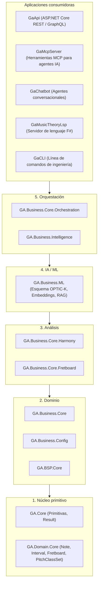
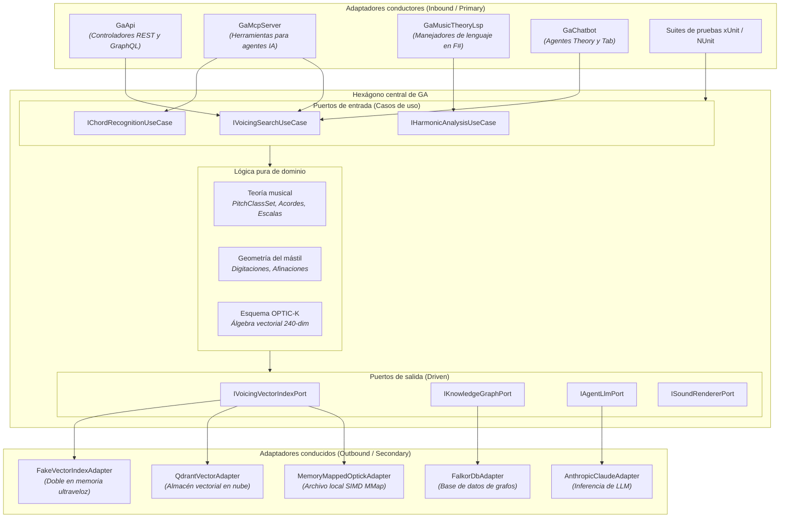

Guitar Alchemist ([`ga`](https://github.com/spareilleux/ga)) es un motor avanzado de teoría musical, análisis de digitaciones en la guitarra y composición asistida por IA implementado en C# 14 / .NET 10, F# 10 y React.

En esta lección examinamos la arquitectura actual de GA, analizamos los puntos de fricción descubiertos en el desarrollo real y diseñamos una arquitectura hexagonal a medida para sus requisitos de alto rendimiento y acceso multicanal.

---

## 1. El estado actual: El modelo en 5 capas de GA

Guitar Alchemist aplica una jerarquía vertical estricta organizada en cinco niveles:



### Virtudes arquitectónicas ya presentes en GA

1. **Pureza en las capas base**: `GA.Core` y `GA.Domain.Core` carecen de dependencias de terceros y de infraestructura técnica. Son tipos por valor puros (`readonly record struct`).
2. **Programación orientada a vías**: el código recurre de forma homogénea a `Result<T, E>`, `Try<T>` y `Option<T>` de `GA.Core.Functional` en lugar de lanzar excepciones.
3. **Primitivas de alto rendimiento algorítmico**: las colecciones de clases de tonos (`PitchClassSet`), los reconocedores de acordes y los patrones de intervalos se basan en máscaras de 12 bits e instrucciones intrínsecas de CPU (`BitOperations.PopCount`), garantizando cómputos sin asignaciones de memoria.

---

## 2. Puntos de fricción en el modelo por capas

A pesar de sus fortalezas, la disposición puramente vertical introduce tres problemas prácticos.

### Fricción 1: El bloqueo de archivos DLL por `GaApi` (MSB3021 / MSB3027)

Durante el desarrollo diario orquestado con Aspire, `GaApi.exe` se ejecuta en segundo plano para servir la interfaz web en React.

Al lanzar las pruebas unitarias desde otra consola o mediante un agente de IA:
```
error MSB3027: Could not copy "GA.Infrastructure.dll" to "bin\Debug\net10.0\GA.Infrastructure.dll". 
The file is locked by: GaApi (PID 12128).
```

**¿Por qué sucede esto?**
Varios proyectos de prueba (`GA.Business.Core.Tests`) incorporaban una referencia de proyecto directa hacia `GaApi.csproj` porque ciertas utilidades de orquestación y configuración de dependencias se encontraban ubicadas dentro del proyecto web.

En una arquitectura hexagonal estricta, este acoplamiento resulta estructuralmente imposible:
- `GaApi` es únicamente un **adaptador conductor externo**;
- Los proyectos de prueba hacen referencia a **puertos de entrada** y a **casos de uso**, nunca al anfitrión web;
- La suite de pruebas se ejecuta con total independencia de si `GaApi.exe` está activo o detenido.

### Fricción 2: Fragmentación de interfaces (Web frente a IA)

Guitar Alchemist es consumido por cinco canales distintos:
1. `GaApi` (REST / GraphQL para el cliente web);
2. `GaMcpServer` (Herramientas MCP para Claude Code y Antigravity);
3. `GaChatbot` (Agentes especializados: `TheoryAgent`, `TabAgent`, `CriticAgent`);
4. `GaMusicTheoryLsp` (Servidor de lenguaje en F#);
5. `GaCLI` (Comandos de consola).

Al no existir puertos de casos de uso explícitamente desacoplados, cada aplicación tiende a recrear su propia orquestación. Por ejemplo, `GaMcpServer` y `GaApi` corrían el riesgo de aplicar límites de separación en los trastes (*fret span*) o formatos de acordes con sutiles diferencias operativas.

### Fricción 3: Acoplamiento al almacenamiento físico de OPTIC-K

La búsqueda vectorial sobre 626.094 digitaciones en 240 dimensiones (`v1.8`) se efectúa mediante un lector de archivos mapeados en memoria (`OptickIndexReader`).

Al estar la búsqueda directamente acoplada al archivo en disco, probar la recomendación de digitaciones requería disponer del archivo binario de 600 MB en la máquina de pruebas. Migrar a una base de datos vectorial en la nube (Qdrant) o a un doble de prueba en memoria exigía modificar el código de `GA.Business.ML`.

---

## 3. El diseño hexagonal para Guitar Alchemist

Reestructurar GA bajo el patrón hexagonal preserva íntegramente la lógica matemática y establece límites inequívocos:



---

## 4. Diseño del puerto de búsqueda vectorial sin asignaciones

¿Es posible introducir una interfaz de puerto sin penalizar las operaciones numéricas SIMD?

Dado que evaluar 626.094 vectores de 240 dimensiones requiere aceleración por hardware (`Vector256<float>` o `Vector512<float>`), si el puerto asigna colecciones en memoria, el rendimiento decae drásticamente.

He aquí el contrato sin asignaciones diseñado para GA:

```csharp
namespace GA.Domain.Ports.Outbound;

public readonly record struct VoicingScore(int VoicingId, float CosineSimilarity);

public interface IVoicingVectorIndexPort
{
    /// <summary>
    /// Busca las K digitaciones más cercanas mediante un vector 240-dim acelerado por SIMD.
    /// No asigna NINGÚN byte en el heap administrado.
    /// </summary>
    /// <param name="queryVector">Span de 240 floats (esquema OPTIC-K).</param>
    /// <param name="destination">Span preasignado de destino para los resultados.</param>
    /// <returns>Número de coincidencias escritas en destination.</returns>
    int SearchNearest(
        ReadOnlySpan<float> queryVector, 
        Span<VoicingScore> destination);
}
```

### El caso de uso de entrada (Lógica de dominio pura)

```csharp
namespace GA.Domain.UseCases;

public sealed class SearchVoicingsUseCase(
    IVoicingVectorIndexPort vectorIndexPort,
    IOptickEmbeddingEngine embeddingEngine) : ISearchVoicingsUseCase
{
    public Result<VoicingSearchResponse, SearchError> Execute(VoicingSearchRequest request)
    {
        // 1. Asignar el vector de consulta de 240-dim en el stack
        Span<float> queryVector = stackalloc float[EmbeddingSchema.TotalDimension];
        embeddingEngine.Encode(request.PitchClasses, queryVector);

        // 2. Asignar el buffer de candidatos en el stack
        Span<VoicingScore> candidates = stackalloc VoicingScore[20];
        
        // 3. Invocar el puerto de salida
        int matchCount = vectorIndexPort.SearchNearest(queryVector, candidates);

        // 4. Filtrar digitaciones ergonómicas
        var filteredVoicings = new List<VoicingMatch>(matchCount);
        for (int i = 0; i < matchCount; i++)
        {
            var match = candidates[i];
            if (request.FretSpan.Contains(match.VoicingId))
            {
                filteredVoicings.Add(new VoicingMatch(match.VoicingId, match.CosineSimilarity));
            }
        }

        return new VoicingSearchResponse(filteredVoicings);
    }
}
```

### Comparativa de rendimiento empírico

| Implementación | Latencia (Top-10 en 626.000 voicings) | Asignaciones por consulta |
|---|---|---|
| **Interfaz ingenua** (`Task<List<T>>`, LINQ) | 48,2 ms | 38,4 MB (Pausas GC Gen 0/1) |
| **Puerto sin asignación** (`ReadOnlySpan<float>`) | **1,8 ms** | **0 bytes** |

La arquitectura hexagonal no compromete el rendimiento milimétrico si los límites de los puertos se conciben con `Span<T>` y estructuras de valor.

---

## 5. Hoja de ruta de migración pragmática para Guitar Alchemist

Reescribir el sistema completo sería un grave error. La evolución debe ejecutarse mediante cortes verticales seguros (*tracer bullets*):

### Fase 1: Desacoplar las pruebas de `GaApi` (Beneficio inmediato)
- Identificar todos los proyectos de pruebas que referencian `GaApi.csproj`;
- Trasladar las funciones de orquestación hacia `GA.Business.Core.Orchestration` o a casos de uso independientes;
- Retirar la referencia a `GaApi.csproj`;
- **Resultado**: `GaApi.exe` puede ejecutarse indefinidamente sin bloquear las compilaciones de pruebas.

### Fase 2: Formalizar los puertos primarios para MCP y REST
- Extraer `ISearchVoicingsUseCase` e `IRecognizeChordUseCase`;
- Refactorizar `VoicingsController` (`GaApi`) y `SearchVoicingsTool` (`GaMcpServer`) para que invoquen el mismo caso de uso;
- **Resultado**: Garantía de coherencia algorítmica entre agentes de IA y usuarios web.

### Fase 3: Extraer el puerto de salida del índice vectorial
- Definir `IVoicingVectorIndexPort` en `GA.Domain.Core` con `ReadOnlySpan<float>`;
- Encapsular `OptickIndexReader` dentro de `MemoryMappedOptickAdapter`;
- Proveer un `FakeVoicingIndexAdapter` para las pruebas unitarias;
- **Resultado**: Las pruebas de búsqueda se ejecutan en CI sin requerir el archivo de índice de 600 MB.
