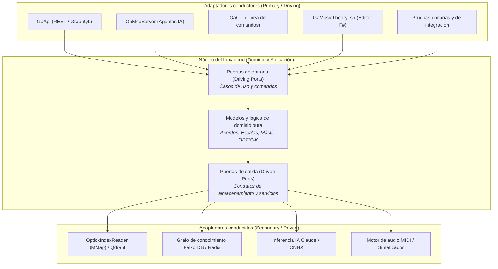

:::note[Entorno del curso]
El código y los análisis de rendimiento de este curso están construidos con el [.NET SDK](https://dotnet.microsoft.com/download) **10.0.112** y se ejecutan sobre .NET **10.0.12**, con las características de C# 14 habilitadas. El estudio de caso analiza componentes reales de producción de [Guitar Alchemist](https://github.com/spareilleux/ga): `GA.Domain.Core`, `GA.Business.ML`, `GaApi` y `GaMcpServer`.
:::

## Por qué aprendo esto

En la arquitectura tradicional por capas (Presentación &rarr; Lógica de negocio &rarr; Acceso a datos), la base de datos se sitúa en la raíz misma del árbol de dependencias. Con el tiempo, el esquema de la base de datos acaba dictando los modelos de dominio, las anotaciones de ORM contaminan las entidades de negocio, los controladores se sobrecargan de lógica de orquestación y las pruebas unitarias se vuelven imposibles sin levantar contenedores Docker o depender de complejas fixtures de datos.

En un dominio avanzado como [Guitar Alchemist](../music-theory-ga/) — que combina teoría musical formal, incrustaciones vectoriales OPTIC-K de 240 dimensiones, orquestación de agentes de IA, una API Web, un servidor MCP para agentes de programación, un servidor de lenguaje F# (LSP) y un mástil 3D interactivo en tiempo real —, el modelo en capas genera acoplamientos peligrosos:

- **Bloqueos de compilación y fragilidad en las pruebas**: los servicios en ejecución (como `GaApi.exe`) bloquean archivos DLL compartidos, impidiendo que los proyectos de pruebas que hacen referencia al proyecto web puedan compilar.
- **Fragmentación de interfaces de acceso**: la API Web (`GaApi`), el servidor Model Context Protocol (`GaMcpServer`), el LSP de F# (`GaMusicTheoryLsp`) y la CLI (`GaCLI`) necesitan invocar los mismos casos de uso teóricos, pero acaban duplicando la lógica de orquestación o acoplándose a modelos de petición HTTP.
- **Dependencia tecnológica**: la búsqueda por similitud vectorial está acoplada a archivos locales mapeados en memoria; migrar a Qdrant o a un doble de prueba en memoria exige alterar la lógica de negocio.

La **Arquitectura hexagonal** (también conocida como *Puertos y Adaptadores*), propuesta por Alistair Cockburn en 2005, resuelve estos problemas invirtiendo la perspectiva: **el dominio de negocio se sitúa en el centro absoluto, y la infraestructura técnica (HTTP, bases de datos, índices vectoriales, modelos de IA) se desplaza a la periferia como adaptadores intercambiables.**

## A quién va dirigido este curso

Eres un desarrollador de C# o .NET que domina la inyección de dependencias y las novedades de C# moderno (C# 12 a 14). Has construido APIs Web y trabajado con arquitecturas por capas o cebolla, pero deseas profundizar en:

1. En qué se diferencia fundamentalmente Puertos y Adaptadores de las arquitecturas por capas clásicas y de Clean Architecture;
2. El análisis riguroso de ventajas y costes: volumen de código, indirección y el **peaje de rendimiento** (despacho virtual, asignaciones en el heap y paso de memoria);
3. Cómo diseñar puertos con cero asignaciones en .NET 10 empleando `ReadOnlySpan<T>`, interfaces estáticas abstractas y programación orientada a vías (`Result<T, E>`);
4. Cómo aplicar este modelo en un proyecto real de alta exigencia algorítmica y de IA (Guitar Alchemist).

## Al terminar este curso, seré capaz de

- Explicar la simetría de Puertos y Adaptadores y la aplicación estricta del Principio de Inversión de Dependencias (DIP);
- Distinguir con precisión la Arquitectura Hexagonal de la Arquitectura Cebolla (Onion) y de Clean Architecture;
- Evaluar objetivamente cuándo la arquitectura hexagonal es indispensable y cuándo representa sobreingeniería;
- Diseñar límites de puertos con cero asignaciones en C# 14 mediante `ReadOnlySpan<T>` y registros por valor (`readonly record struct`);
- Estructurar el control de errores en los puertos mediante programación orientada a vías, sin lanzar excepciones;
- Unificar múltiples interfaces de entrada (REST, MCP, CLI, LSP) compartiendo casos de uso idénticos;
- Eliminar de raíz los bloqueos de archivos DLL y el acoplamiento de pruebas en soluciones .NET multiproyecto;
- Trazar un plan de migración pragmático y por fases desde una arquitectura en capas hacia un diseño hexagonal.

## Contenido

| # | Lección | Lo que aprenderás |
|---|---|---|
| 1 | [Principios y fundamentos](01-principles-and-foundations/) | Interior vs exterior, puertos primarios y secundarios, adaptadores y comparación con Onion/Clean Architecture |
| 2 | [Compromisos y crítica arquitectónica](02-trade-offs-and-critique/) | Testabilidad, paridad de interfaces e independencia tecnológica frente a código redundante, indirección y coste de rendimiento |
| 3 | [Arquitectura hexagonal en C# moderno](03-hexagonal-csharp-dotnet/) | Puertos sin asignaciones, `ReadOnlySpan<T>`, `Result<T, E>`, interfaces estáticas abstractas y pruebas con fakes en lugar de mocks |
| 4 | [Estudio de caso: Guitar Alchemist](04-guitar-alchemist-case-study/) | Análisis de las 5 capas de GA, resolución del bloqueo de compilación de `GaApi`, paridad IA/MCP y puertos vectoriales SIMD |
| 5 | [Diario](journal/) | Notas de progreso, mediciones de rendimiento, decisiones arquitectónicas y preguntas abiertas |

## Recursos

- Alistair Cockburn, [*Hexagonal Architecture (Ports and Adapters)*](https://alistair.cockburn.us/hexagonal-architecture/) (artículo original de 2005)
- Jeffrey Palermo, [*The Onion Architecture*](https://jeffreypalermo.com/2008/07/the-onion-architecture-part-1/) (2008)
- Robert C. Martin, [*The Clean Architecture*](https://blog.cleancoder.com/uncle-bob/2012/08/13/the-clean-architecture.html) (2012)
- Vaughn Vernon, *Implementing Domain-Driven Design*, Addison-Wesley, 2013 (Capítulo 4: Arquitectura)
- Repositorio de Guitar Alchemist: [`AllProjects.slnx`](https://github.com/spareilleux/ga)
