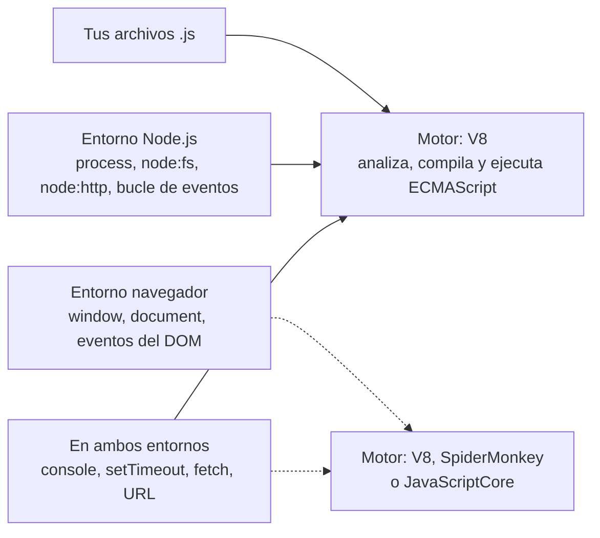

import { Tabs, TabItem } from '@astrojs/starlight/components';

Código: [`examples/l01_hello.js`](https://github.com/spareilleux/learn/blob/c65efe4fb76e61efd229793b296d3d7a44e71baf/code/javascript-for-csharp-java/examples/l01_hello.js), los proyectos [`l01-esm`](https://github.com/spareilleux/learn/tree/c65efe4fb76e61efd229793b296d3d7a44e71baf/code/javascript-for-csharp-java/l01-esm), [`l01-cjs`](https://github.com/spareilleux/learn/tree/c65efe4fb76e61efd229793b296d3d7a44e71baf/code/javascript-for-csharp-java/l01-cjs) y [`l01-interop`](https://github.com/spareilleux/learn/tree/c65efe4fb76e61efd229793b296d3d7a44e71baf/code/javascript-for-csharp-java/l01-interop), y los snippets de error de [`errors/`](https://github.com/spareilleux/learn/tree/c65efe4fb76e61efd229793b296d3d7a44e71baf/code/javascript-for-csharp-java/errors).

## Un motor y un entorno anfitrión

En .NET y Java, un solo producto te da el lenguaje, el runtime y la biblioteca estándar. JavaScript los reparte en tres:

| | C# | Java | JavaScript |
|---|---|---|---|
| El lenguaje | C#, compilado por Roslyn | Java, compilado por `javac` | [ECMAScript](https://tc39.es/ecma262/), analizado por el motor al cargarse |
| El runtime | el CLR | la JVM | un motor: [V8](https://v8.dev/), [SpiderMonkey](https://spidermonkey.dev/) o [JavaScriptCore](https://docs.webkit.org/Deep%20Dive/JSC/JavaScriptCore.html) |
| Archivos, red, procesos | la biblioteca de clases base | el JDK | el entorno anfitrión (host): Node.js, Deno, Bun o un navegador |

La especificación ECMAScript define los valores, los objetos, las funciones, `Array`, `Map`, `JSON` y `Promise`, y nada que toque el mundo exterior: ni archivos, ni red, ni siquiera `console.log`. Eso lo añade el entorno anfitrión. Node.js integra V8 y añade módulos como `node:fs`, un objeto `process` y un bucle de eventos; un navegador integra su motor y añade `document` y `window`.



Así, el mismo lenguaje ofrece globales distintos según dónde se ejecute:

```text
> node -p "typeof window"
undefined
> node -p "typeof process"
object
> node -p "process.versions.v8"
13.6.233.17-node.53
```

Este curso lo ejecuta todo en Node.js. El navegador es el tema de la lección 12, y el DOM corresponde al curso de React.

## Instalar Node.js 24

Node.js publica una versión mayor cada seis meses. Las versiones pares pasan a ser versiones de soporte a largo plazo (LTS) en octubre, y cada versión LTS tiene soporte durante unos 30 meses ([calendario de versiones](https://github.com/nodejs/Release#release-schedule)):

| | Publicada | LTS desde | Fin de vida |
|---|---|---|---|
| Node.js 22 "Jod" | abril de 2024 | octubre de 2024 | abril de 2027 |
| Node.js 24 "Krypton" | mayo de 2025 | octubre de 2025 | abril de 2028 |
| Node.js 26 | mayo de 2026 | octubre de 2026 | abril de 2029 |

Es parecido a .NET, donde [cada versión par es LTS](https://learn.microsoft.com/dotnet/core/releases-and-support) durante tres años, y a Java, donde [llega una nueva versión LTS cada dos años](https://www.oracle.com/java/technologies/java-se-support-roadmap.html). Este curso usa Node.js **24.21.0**, la última versión 24 a 14 de septiembre de 2026.

<Tabs syncKey="os">
<TabItem label="Windows">

Descargué el archivo ZIP, comprobé su SHA-256 con la lista que publica Node.js, y lo descomprimí en una carpeta propia, fuera del `PATH` global:

```powershell
Invoke-WebRequest https://nodejs.org/dist/v24.21.0/node-v24.21.0-win-x64.zip -OutFile node-v24.21.0-win-x64.zip
(Get-FileHash node-v24.21.0-win-x64.zip -Algorithm SHA256).Hash.ToLower()
(Invoke-RestMethod https://nodejs.org/dist/v24.21.0/SHASUMS256.txt) -split "`n" | Select-String 'win-x64.zip'
Expand-Archive node-v24.21.0-win-x64.zip -DestinationPath C:\tools   # crea C:\tools\node-v24.21.0-win-x64
C:\tools\node-v24.21.0-win-x64\node.exe --version
```

Los dos hashes deben ser idénticos: en mi máquina, ambos eran `158f7685…e541`, y los cuatro comandos tardaron 22 segundos. Añade la carpeta a tu `PATH` para llamar a `node` y `npm` desde cualquier terminal.

El instalador es otra opción: `winget install OpenJS.NodeJS.LTS` (*por verificar*: no lo he ejecutado). El 14 de septiembre de 2026, `winget show OpenJS.NodeJS.LTS` seguía ofreciendo la 24.19.0, dos versiones por detrás.

</TabItem>
<TabItem label="Linux / WSL">

[nvm](https://github.com/nvm-sh/nvm) instala versiones de Node.js en tu carpeta personal y cambia entre ellas, como un `global.json` para toda la shell (*por verificar*: no he ejecutado estos comandos):

```bash
curl -o- https://raw.githubusercontent.com/nvm-sh/nvm/v0.40.7/install.sh | bash
# abre un nuevo terminal, y luego:
nvm install 24.21.0
node --version
```

Los archivos de [nodejs.org/dist](https://nodejs.org/dist/v24.21.0/) (`node-v24.21.0-linux-x64.tar.xz`) son la otra vía, con el mismo `SHASUMS256.txt` que en Windows.

**En WSL**, instala Node.js *dentro* de la distribución y guarda tus proyectos en el sistema de archivos de Linux (`~/src/...`), no bajo `/mnt/c`: una carpeta `node_modules` contiene miles de archivos pequeños, y [leer archivos de Windows desde Linux es más lento](https://learn.microsoft.com/windows/wsl/filesystems#file-storage-and-performance-across-file-systems).

</TabItem>
<TabItem label="macOS">

El instalador de macOS (`node-v24.21.0.pkg`) está en [nodejs.org/dist](https://nodejs.org/dist/v24.21.0/), y nvm funciona en macOS igual que en Linux. Con [Homebrew](https://formulae.brew.sh/formula/node@24) (*por verificar*: no lo he ejecutado):

```bash
brew install node@24
echo 'export PATH="$(brew --prefix node@24)/bin:$PATH"' >> ~/.zshrc   # node@24 es keg-only: no se enlaza por defecto
node --version
```

</TabItem>
</Tabs>

Después, en cualquier SO:

```text
> node --version
v24.21.0
> npm --version
11.19.0
```

npm viene con Node.js: cada versión de Node.js incluye una versión de npm.

## Ejecutar JavaScript

```js
// examples/l01_hello.js
const names = process.argv.slice(2); // argv[0] es node, argv[1] es este archivo
console.log('Hello, world!');
for (const name of names) {
  console.log(`Hello, ${name}!`);
}
```

```text
> node examples/l01_hello.js Ada Grace
Hello, world!
Hello, Ada!
Hello, Grace!
```

| | C# | Java | Node.js |
|---|---|---|---|
| Ejecutar un archivo | `dotnet run app.cs` ([.NET 10](https://learn.microsoft.com/dotnet/core/sdk/file-based-apps)) | [`java Hello.java`](https://openjdk.org/jeps/330) | `node hello.js` |
| Evaluar una expresión | — | — | `node -p "0.1 + 0.2"` |
| Shell interactiva | C# Interactive en Visual Studio | [`jshell`](https://docs.oracle.com/en/java/javase/25/jshell/introduction-jshell.html) | `node`, y luego `.exit` |
| Volver a ejecutar en cada cambio | `dotnet watch` | — | [`node --watch hello.js`](https://nodejs.org/docs/latest-v24.x/api/cli.html#--watch) |
| Argumentos del programa | `args` | `String[] args` | [`process.argv`](https://nodejs.org/docs/latest-v24.x/api/process.html#processargv), desde el índice 2 |

No hay ningún paso de compilación que ejecutar: Node.js lee el código fuente y V8 lo compila sobre la marcha. `console.log` es el `Console.WriteLine` de JavaScript; las plantillas literales, entre comillas invertidas, interpolan como `$"…"` en C#. La [lección 2](../02-values-and-types/) explica `const`.

## npm y package.json

Una carpeta se convierte en un proyecto cuando tiene un `package.json`. [`npm init -y`](https://docs.npmjs.com/cli/v11/commands/npm-init) escribe uno con valores por defecto:

```text
> npm init -y
Wrote to C:\…\npmdemo\package.json:

{
  "name": "npmdemo",
  "version": "1.0.0",
  "description": "",
  "main": "index.js",
  "scripts": {
    "test": "echo \"Error: no test specified\" && exit 1"
  },
  "keywords": [],
  "author": "",
  "license": "ISC",
  "type": "commonjs"
}
```

npm 11.19 escribe `"type": "commonjs"` explícitamente; la [sección sobre los módulos](#módulos-es-modules-y-commonjs) más abajo explica por qué importa ese campo. Instalar un paquete lo añade a `dependencies`, lo descarga en `node_modules` y escribe `package-lock.json`:

```text
> npm install semver@7.7.2

added 1 package, and audited 2 packages in 782ms

found 0 vulnerabilities
```

```json
  "dependencies": {
    "semver": "^7.7.2"
  }
```

| | NuGet | Maven | npm |
|---|---|---|---|
| Manifiesto | `.csproj`, `<PackageReference>` | `pom.xml`, `<dependency>` | [`package.json`](https://docs.npmjs.com/cli/v11/configuring-npm/package-json), `dependencies` |
| Solo para compilar o probar | `PrivateAssets="all"` | `<scope>test</scope>` | `devDependencies` |
| Una versión escrita `7.7.2` | significa 7.7.2 o superior ([versionado de NuGet](https://learn.microsoft.com/nuget/concepts/package-versioning)) | un requisito flexible de 7.7.2 ([referencia del POM](https://maven.apache.org/pom.html#Dependency_Version_Requirement_Specification)) | exactamente 7.7.2 |
| Rango por defecto al añadir un paquete | la versión, como mínimo | la versión | `^7.7.2`: 7.7.2 o superior, por debajo de 8.0.0 ([semver](https://docs.npmjs.com/about-semantic-versioning)) |
| Archivo de bloqueo | `packages.lock.json`, [opcional](https://learn.microsoft.com/nuget/consume-packages/package-references-in-project-files#locking-dependencies) | ninguno | [`package-lock.json`](https://docs.npmjs.com/cli/v11/configuring-npm/package-lock-json), siempre |
| Dónde van los paquetes | una caché compartida, `~/.nuget/packages` | una caché compartida, `~/.m2/repository` | una carpeta `node_modules` en cada proyecto, llenada desde una caché |
| Restaurar exactamente el archivo de bloqueo | `dotnet restore --locked-mode` | — | [`npm ci`](https://docs.npmjs.com/cli/v11/commands/npm-ci) |
| Ejecutar una herramienta de un paquete | `dotnet tool run` | un goal de plugin | `npx <tool>` |

Haz commit de `package.json` y `package-lock.json`, nunca de `node_modules`. En CI, `npm ci` borra `node_modules` e instala exactamente lo que lista el archivo de bloqueo, o falla si el archivo de bloqueo no coincide con `package.json`.

### Scripts

Los `scripts` de `package.json` son comandos con nombre, lo más parecido a los targets de MSBuild o a los goals de Maven. [`l01-esm/package.json`](https://github.com/spareilleux/learn/blob/c65efe4fb76e61efd229793b296d3d7a44e71baf/code/javascript-for-csharp-java/l01-esm/package.json) tiene dos:

```json
{
  "name": "l01-esm",
  "version": "1.0.0",
  "private": true,
  "type": "module",
  "scripts": {
    "start": "node main.js",
    "greet": "node main.js Ada Grace"
  }
}
```

`npm run` imprime el script antes de ejecutarlo; [`node --run`](https://nodejs.org/docs/latest-v24.x/api/cli.html#--run), añadido en Node.js 22, lo ejecuta sin npm:

```text
> npm run greet

> l01-esm@1.0.0 greet
> node main.js Ada Grace

Hello, Ada!
Hello, Grace!
Bye, Ada!
l01-esm: main.js, typeof require = undefined
> node --run greet
Hello, Ada!
Hello, Grace!
Bye, Ada!
l01-esm: main.js, typeof require = undefined
```

Ambos añaden `node_modules/.bin` al `PATH`, así que un script puede llamar por su nombre a las herramientas de los paquetes instalados. `node --run` omite [intencionadamente](https://nodejs.org/docs/latest-v24.x/api/cli.html#intentional-limitations) los scripts `pre` y `post` que npm ejecuta alrededor de un script (ejercicio 2).

### En proyectos reales

El [`package.json`](https://github.com/spareilleux/learn/blob/c65efe4fb76e61efd229793b296d3d7a44e71baf/package.json#L1-L12) de este sitio declara `"type": "module"` y scripts que llaman a [Astro](https://docs.astro.build/): `npm run build` ejecuta `astro build`, que se encuentra en `node_modules/.bin`.

GuitarAlchemist/ga muestra dos trampas de un proyecto JavaScript mantenido por desarrolladores C#:

- [`Apps/ga-client`](https://github.com/GuitarAlchemist/ga/tree/a826864f3a012cad88e415954bf57eca0ce12aa6/Apps/ga-client) tiene a la vez un `package-lock.json` y un `pnpm-lock.yaml`. Son los archivos de bloqueo de dos gestores de paquetes, npm y [pnpm](https://pnpm.io/), y nada los mantiene de acuerdo: un desarrollador que ejecuta `npm install` y otro que ejecuta `pnpm install` pueden obtener versiones distintas de la misma dependencia.
- [`ReactComponents/ga-react-components/package.json`](https://github.com/GuitarAlchemist/ga/blob/a826864f3a012cad88e415954bf57eca0ce12aa6/ReactComponents/ga-react-components/package.json#L71) lista `@esbuild/win32-x64` en `devDependencies`. Ese paquete declara `"os": ["win32"]`, y npm se niega a instalarlo en cualquier otro sitio. La CI del curso lo instala en los tres SO: funciona en Windows, y en Linux npm se detiene con:

```text
npm error code EBADPLATFORM
npm error notsup Unsupported platform for @esbuild/win32-x64@0.25.12: wanted {"os":"win32","cpu":"x64"} (current: {"os":"linux","cpu":"x64"})
npm error notsup Valid os:   win32
npm error notsup Actual os:  linux
npm error notsup Valid cpu:  x64
npm error notsup Actual cpu: x64
```

macOS falla de la misma manera. La carpeta solo tiene un `pnpm-lock.yaml`, y pnpm 10 instaló en mi máquina un paquete para otro SO sin decir nada, así que el proyecto probablemente se instala con pnpm en todos los SO, pero no con npm (*por verificar* en Linux y macOS). La solución habitual es dejar fuera los paquetes de plataforma: esbuild los lista todos como `optionalDependencies`, y cada gestor de paquetes instala el que corresponde.

## Módulos: ES modules y CommonJS

Node.js tiene dos sistemas de módulos. CommonJS llegó primero, con Node.js en 2009: `require` carga un archivo, `module.exports` es lo que exporta. Los ES modules llegaron con el lenguaje en ECMAScript 2015, y son lo que entienden los navegadores: `import` y `export`.

| | CommonJS | ES modules |
|---|---|---|
| Importar | `const { hello } = require('./greet')` | `import { hello } from './greet.js'` |
| Exportar | `module.exports = { hello }` | `export function hello…` |
| Extensión del archivo en la ruta | opcional | obligatoria |
| Carga | síncrona, cuando se ejecuta `require` | los imports se resuelven antes de que se ejecute el módulo |
| Modo estricto ([lección 3](../03-functions-and-scope/#modo-estricto)) | solo con `'use strict'` | siempre |
| `await` en el nivel superior | no | sí |
| La carpeta del archivo actual | `__dirname` | [`import.meta.dirname`](https://nodejs.org/docs/latest-v24.x/api/esm.html#importmetadirname) |

En ambos, un módulo es un **archivo**: no hay ningún espacio de nombres que abarque varios archivos, y nada es visible para otros archivos salvo que se exporte. Comparado con C#, `export` es `public`, todo lo demás es `private` del archivo, e `import` nombra el archivo donde un `using` nombraría un espacio de nombres.

### Cómo decide Node.js

Node.js [elige el sistema de módulos](https://nodejs.org/docs/latest-v24.x/api/packages.html#determining-module-system) archivo por archivo:

1. un archivo `.mjs` es un ES module, un archivo `.cjs` es CommonJS;
2. un archivo `.js` sigue el campo `"type"` del `package.json` más cercano, `"module"` o `"commonjs"`;
3. un archivo `.js` sin ningún `"type"` por encima se analiza como CommonJS, y se vuelve a analizar como ES module si contiene `import` o `export` ([detección de sintaxis](https://nodejs.org/docs/latest-v24.x/api/packages.html#syntax-detection)).

El tercer caso funciona, con una advertencia. [`l01-interop/package.json`](https://github.com/spareilleux/learn/blob/c65efe4fb76e61efd229793b296d3d7a44e71baf/code/javascript-for-csharp-java/l01-interop/package.json) no tiene `"type"`, y `detect.js` contiene un `import`:

```text
> node detect.js
(node:PID) [MODULE_TYPELESS_PACKAGE_JSON] Warning: Module type of l01-interop/detect.js is not specified and it doesn't parse as CommonJS.
Reparsing as ES module because module syntax was detected. This incurs a performance overhead.
To eliminate this warning, add "type": "module" to l01-interop/package.json.
(Use `node --trace-warnings ...` to show where the warning was created)
8 undefined
```

:::note[Salidas de error en este curso]
Node.js imprime rutas absolutas, un identificador de proceso y un stack trace cuyos marcos nombran sus archivos internos. Las salidas de las lecciones muestran las rutas relativas a la carpeta del curso, `PID` en lugar del identificador de proceso, y ningún marco `at …`; [`normalize.mjs`](https://github.com/spareilleux/learn/blob/c65efe4fb76e61efd229793b296d3d7a44e71baf/code/javascript-for-csharp-java/normalize.mjs) hace los mismos cambios antes de que la CI las compare. Todo lo demás es la salida de Node.js 24.21.0, idéntica en Windows, Linux y macOS.
:::

### El mismo programa, dos veces

La versión ES module, en un paquete con `"type": "module"`:

```js
// l01-esm/greet.js
// Un ES module: lo que exporta se declara con export, todo lo demás queda privado del archivo
const punctuation = '!';

export function hello(name) {
  return `Hello, ${capitalize(name)}${punctuation}`;
}

export default function farewell(name) {
  return `Bye, ${capitalize(name)}${punctuation}`;
}

function capitalize(text) {
  return text.charAt(0).toUpperCase() + text.slice(1);
}
```

```js
// l01-esm/main.js
// "type": "module" en package.json: los archivos .js son ES modules
import { readFile } from 'node:fs/promises';
import path from 'node:path';
import farewell, { hello } from './greet.js'; // la extensión es obligatoria

const names = process.argv.length > 2 ? process.argv.slice(2) : ['world'];
for (const name of names) {
  console.log(hello(name));
}
console.log(farewell(names[0]));

// No hay __dirname en un ES module: import.meta da la ubicación del propio módulo
const manifest = JSON.parse(await readFile(path.join(import.meta.dirname, 'package.json'), 'utf8')); // await en el nivel superior
console.log(`${manifest.name}: ${path.basename(import.meta.filename)}, typeof require = ${typeof require}`);
```

```text
> node main.js
Hello, World!
Bye, World!
l01-esm: main.js, typeof require = undefined
```

Un módulo tiene cualquier número de exports *con nombre* y como mucho un export *por defecto*; `import farewell, { hello }` toma el export por defecto con un nombre que tú eliges, y `hello` con su propio nombre. Los módulos integrados empiezan por `node:`.

La versión CommonJS, en un paquete con `"type": "commonjs"`:

```js
// l01-cjs/greet.js
// Un módulo CommonJS: lo que exporta es lo que acabe en module.exports
const punctuation = '!';

function hello(name) {
  return `Hello, ${capitalize(name)}${punctuation}`;
}

function capitalize(text) {
  return text.charAt(0).toUpperCase() + text.slice(1);
}

module.exports = { hello };
```

```js
// l01-cjs/main.js
// "type": "commonjs" en package.json: los archivos .js son módulos CommonJS
const fs = require('node:fs');
const path = require('node:path');
const { hello } = require('./greet'); // la extensión se puede omitir

const names = process.argv.length > 2 ? process.argv.slice(2) : ['world'];
for (const name of names) {
  console.log(hello(name));
}

const manifest = JSON.parse(fs.readFileSync(path.join(__dirname, 'package.json'), 'utf8'));
console.log(`${manifest.name}: ${path.basename(__filename)}, typeof require = ${typeof require}`);
```

```text
> node main.js Ada
Hello, Ada!
l01-cjs: main.js, typeof require = function
```

### Mezclarlos

`require` en un ES module. El [`package.json`](https://github.com/spareilleux/learn/blob/c65efe4fb76e61efd229793b296d3d7a44e71baf/code/javascript-for-csharp-java/package.json) de la carpeta del curso dice `"type": "module"`:

```js
// errors/l01_require_in_esm.js
const fs = require('node:fs');
console.log(fs.existsSync('package.json'));
```

```text
errors/l01_require_in_esm.js:2
const fs = require('node:fs');
           ^

ReferenceError: require is not defined in ES module scope, you can use import instead
This file is being treated as an ES module because it has a '.js' file extension and 'package.json' contains "type": "module". To treat it as a CommonJS script, rename it to use the '.cjs' file extension.

Node.js v24.21.0
```

`import` en un archivo CommonJS:

```js
// errors/l01_import_in_cjs.cjs
import { readFileSync } from 'node:fs';
console.log(readFileSync);
```

```text
(node:PID) Warning: Failed to load the ES module: errors/l01_import_in_cjs.cjs. Make sure to set "type": "module" in the nearest package.json file or use the .mjs extension.
(Use `node --trace-warnings ...` to show where the warning was created)
errors/l01_import_in_cjs.cjs:2
import { readFileSync } from 'node:fs';
^^^^^^

SyntaxError: Cannot use import statement outside a module

Node.js v24.21.0
```

El error que más sorprende a los desarrolladores C# y Java, y también a los de TypeScript: un import de ES module sin su extensión.

```js
// errors/l01_missing_extension.js
import { show } from '../examples/show';
show('never', 'printed');
```

Ejecutado desde la carpeta `errors`:

```text
node:internal/modules/run_main:107
    triggerUncaughtException(
    ^

Error [ERR_MODULE_NOT_FOUND]: Cannot find module 'examples/show' imported from errors/l01_missing_extension.js
Did you mean to import "../examples/show.js"?
{
  code: 'ERR_MODULE_NOT_FOUND',
  url: 'examples/show'
}

Node.js v24.21.0
```

Ejecutado desde la carpeta del curso, con `node errors/l01_missing_extension.js`, el mismo archivo da el mismo error *sin* la línea `Did you mean to import "../examples/show.js"?`. Para encontrar esa pista, Node.js pregunta al resolvedor de CommonJS dónde habría encontrado `require` el archivo ([`resolve.js`, líneas 888-895](https://github.com/nodejs/node/blob/v24.21.0/lib/internal/modules/esm/resolve.js#L888-L895)), pero le da al resolvedor un módulo padre sin nombre de archivo, y para un padre así el resolvedor busca las rutas relativas desde la carpeta actual ([`loader.js`, líneas 1021-1028](https://github.com/nodejs/node/blob/v24.21.0/lib/internal/modules/cjs/loader.js#L1021-L1028)). La pista solo aparece cuando `../examples/show.js` también existe relativo al lugar donde escribiste el comando. El error en sí es correcto en ambos casos: añade la extensión.

### Usar uno desde el otro

Un ES module puede importar un módulo CommonJS. `module.exports` se convierte en el export por defecto, y Node.js [encuentra los exports con nombre](https://nodejs.org/docs/latest-v24.x/api/esm.html#commonjs-namespaces) leyendo el código fuente en busca de asignaciones como `exports.half = …`:

```js
// l01-interop/legacy.cjs
exports.half = (n) => n / 2;
exports.kind = 'CommonJS';
```

```js
// l01-interop/from-esm.mjs
import legacy, { half } from './legacy.cjs';

console.log('default import:', legacy);
console.log('named import:  ', half(3));
```

```text
default import: { half: [Function (anonymous)], kind: 'CommonJS' }
named import:   1.5
```

La dirección contraria, `require` de un ES module, antes era imposible. Funciona desde Node.js 22.12 sin ninguna opción, y la documentación de Node.js 24 [ya no lo califica de experimental](https://nodejs.org/docs/latest-v24.x/api/modules.html#loading-ecmascript-modules-using-require), siempre que el módulo no use `await` en el nivel superior:

```js
// l01-interop/modern.mjs
export const twice = (n) => n * 2;
export default 'ES module';
```

```js
// l01-interop/from-cjs.cjs
const modern = require('./modern.mjs');

console.log(modern);
console.log(modern.twice(21), modern.default);
```

```text
[Module: null prototype] {
  __esModule: true,
  default: 'ES module',
  twice: [Function: twice]
}
42 ES module
```

GuitarAlchemist/ga usa las extensiones como se pretende: sus frontends son paquetes `"type": "module"`, y el único archivo de configuración escrito con `module.exports` se llama [`postcss.config.cjs`](https://github.com/GuitarAlchemist/ga/blob/a826864f3a012cad88e415954bf57eca0ce12aa6/Apps/ga-client/postcss.config.cjs): si se llamara `.js`, sería un ES module, donde `module` no existe. Este sitio nombra sus scripts `.mjs`, como `scripts/sync-streeling.mjs`, lo que es redundante con `"type": "module"` y sigue siendo correcto si se elimina el campo.

**¿Cuál escribir?** ES modules, para el código nuevo: son el estándar, el formato del navegador, y lo que TypeScript y los bundlers producen por defecto. Todavía te encontrarás CommonJS en paquetes antiguos y archivos de configuración.

## Puntos clave

- ECMAScript es el lenguaje; V8 es el motor; Node.js es un entorno anfitrión que añade archivos, procesos y módulos. Un navegador es otro entorno anfitrión.
- Node.js 24 es la línea LTS activa hasta octubre de 2026 y mantiene soporte hasta abril de 2028; npm viene con él.
- `package.json` es el manifiesto y `package-lock.json` el archivo de bloqueo; haz commit de ambos, e instala en CI con `npm ci`.
- `npm install` escribe rangos `^`: se acepta cualquier versión menor o de parche posterior, y es el archivo de bloqueo el que fija la versión exacta.
- Un archivo `.js` es un ES module o un módulo CommonJS según el `"type"` del `package.json` más cercano; `.mjs` y `.cjs` fuerzan la elección.
- Los ES modules necesitan la extensión del archivo en los imports relativos, siempre son estrictos, y permiten `await` en el nivel superior.

## Ejercicios

1. Renombra `l01-cjs/greet.js` a `greet.mjs` y reescríbelo como ES module, pero deja `main.js` como módulo CommonJS. ¿Qué tiene que cambiar en `main.js`?

<details>
<summary>Solución</summary>

Solo la ruta: `require('./greet')` no encuentra `greet.mjs`, porque `require` solo prueba las extensiones `.js`, `.json` y `.node`. [`solutions/l01-ex1`](https://github.com/spareilleux/learn/tree/c65efe4fb76e61efd229793b296d3d7a44e71baf/code/javascript-for-csharp-java/solutions/l01-ex1):

```js
// main.js
const greet = require('./greet.mjs');

console.log(greet.hello('world'));
console.log('exports of greet.mjs:', Object.keys(greet));
```

```text
Hello, World!
exports of greet.mjs: [ 'hello' ]
```

`greet.mjs` se carga de forma síncrona porque no tiene `await` en el nivel superior. Si le añades uno, `require` lanza [`ERR_REQUIRE_ASYNC_MODULE`](https://nodejs.org/docs/latest-v24.x/api/errors.html#err_require_async_module).

</details>

2. En una copia de `l01-esm`, añade un script `"pregreet": "node -e \"console.log('pregreet runs')\""`. Ejecuta `npm run greet`, y luego `node --run greet`. ¿Qué cambia?

<details>
<summary>Solución</summary>

```text
> npm run greet

> l01-esm@1.0.0 pregreet
> node -e "console.log('pregreet runs')"

pregreet runs

> l01-esm@1.0.0 greet
> node main.js Ada Grace

Hello, Ada!
Hello, Grace!
Bye, Ada!
l01-esm: main.js, typeof require = undefined
```

```text
> node --run greet
Hello, Ada!
Hello, Grace!
Bye, Ada!
l01-esm: main.js, typeof require = undefined
```

npm ejecuta `pregreet` antes de `greet` e imprime cada comando; `node --run` solo ejecuta `greet`, en silencio. La [documentación de Node.js](https://nodejs.org/docs/latest-v24.x/api/cli.html#intentional-limitations) lo presenta como una limitación deliberada. Un proyecto que depende de scripts `pre`, como `pretest` para compilar antes de probar, debe seguir usando `npm run`.

</details>

3. Añade `"type": "module"` a `l01-interop/package.json` y vuelve a ejecutar `node detect.js`, y luego `node from-cjs.cjs`. ¿Qué cambia, y por qué a los archivos `.mjs` y `.cjs` no les afecta?

<details>
<summary>Solución</summary>

`node detect.js` imprime `8 undefined` sin la advertencia: el archivo `.js` es ahora un ES module por declaración, y Node.js no lo analiza dos veces. `from-cjs.cjs`, `legacy.cjs` y `modern.mjs` se comportan exactamente igual que antes, ya que su extensión decide antes de que se lea `"type"`. Añadir `"type": "module"` a un paquete solo cambia sus archivos `.js`: por eso un proyecto que hace el cambio suele renombrar algunos archivos de configuración a `.cjs`, como el `postcss.config.cjs` de GA.

</details>

## Fuentes

- [Node.js — Módulos: paquetes, determinar el sistema de módulos](https://nodejs.org/docs/latest-v24.x/api/packages.html#determining-module-system), [módulos ECMAScript](https://nodejs.org/docs/latest-v24.x/api/esm.html), [módulos CommonJS](https://nodejs.org/docs/latest-v24.x/api/modules.html), [opciones de línea de comandos](https://nodejs.org/docs/latest-v24.x/api/cli.html)
- [Calendario de versiones de Node.js](https://github.com/nodejs/Release#release-schedule), [descargas de Node.js 24.21.0](https://nodejs.org/dist/v24.21.0/)
- [npm — package.json](https://docs.npmjs.com/cli/v11/configuring-npm/package-json), [package-lock.json](https://docs.npmjs.com/cli/v11/configuring-npm/package-lock-json), [npm ci](https://docs.npmjs.com/cli/v11/commands/npm-ci), [versionado semántico](https://docs.npmjs.com/about-semantic-versioning)
- [ECMAScript — Módulos](https://tc39.es/ecma262/#sec-modules)
- [Microsoft — Aplicaciones basadas en archivos](https://learn.microsoft.com/dotnet/core/sdk/file-based-apps), [versionado de paquetes NuGet](https://learn.microsoft.com/nuget/concepts/package-versioning), [JEP 330 — Ejecutar programas de código fuente de un solo archivo](https://openjdk.org/jeps/330)
