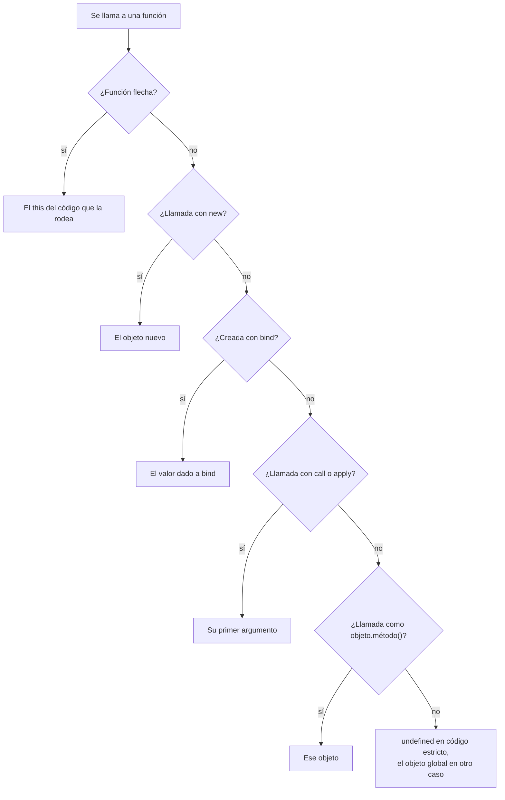

Código: los archivos [`examples/l03_*`](https://github.com/spareilleux/learn/tree/c65efe4fb76e61efd229793b296d3d7a44e71baf/code/javascript-for-csharp-java/examples), [`errors/l03_duplicate_function.js`](https://github.com/spareilleux/learn/blob/c65efe4fb76e61efd229793b296d3d7a44e71baf/code/javascript-for-csharp-java/errors/l03_duplicate_function.js), y los equivalentes en C# y Java en [`compare/l03_closures.cs`](https://github.com/spareilleux/learn/blob/c65efe4fb76e61efd229793b296d3d7a44e71baf/code/javascript-for-csharp-java/compare/l03_closures.cs), [`compare/L03MethodRef.java`](https://github.com/spareilleux/learn/blob/c65efe4fb76e61efd229793b296d3d7a44e71baf/code/javascript-for-csharp-java/compare/L03MethodRef.java) y [`compare_fail/L03Closures.java`](https://github.com/spareilleux/learn/blob/c65efe4fb76e61efd229793b296d3d7a44e71baf/code/javascript-for-csharp-java/compare_fail/L03Closures.java).

## Tres formas de escribir una función

```js
// examples/l03_functions.js
import { show } from './show.js';

function add(a, b) {
  return a + b;
}
const subtract = function (a, b) {
  return a - b;
};
const multiply = (a, b) => a * b;

show('add(2, 3)', add(2, 3));
show('subtract(2, 3)', subtract(2, 3));
show('multiply(2, 3)', multiply(2, 3));

// Pocos o demasiados argumentos: ningún error
show('add(2)', add(2));
show('add(2, 3, 4)', add(2, 3, 4));
show('add.length', add.length);

// Valores por defecto y parámetros rest
function greet(name = 'reader', ...titles) {
  return `Hello, ${[...titles, name].join(' ')}!`;
}
show('greet()', greet());
show("greet('Hopper', 'Admiral')", greet('Hopper', 'Admiral'));
show('greet(undefined)', greet(undefined));
show('greet(null)', greet(null));

// Sin sobrecarga: en el cuerpo de una función, la segunda declaración sustituye a la primera
function overloads() {
  function describe(page) {
    return `page ${page}`;
  }
  function describe(page, locale) {
    return `page ${page} in ${locale}`;
  }
  return describe('mission');
}
show('overloads()', overloads());

// Las funciones son objetos: se pueden guardar, pasar y recibir propiedades
const operations = { add, subtract, multiply };
show('Object.keys(operations)', Object.keys(operations));
// map llama a su callback con (elemento, índice, array): los argumentos extra se usan sin avisar
show('[1, 2, 3].map(multiply)', [1, 2, 3].map(multiply));
show("['1', '2', '3'].map(parseInt)", ['1', '2', '3'].map(parseInt));
show('typeof add', typeof add);
show('add.name', add.name);
```

```text
add(2, 3)                          5
subtract(2, 3)                     -1
multiply(2, 3)                     6
add(2)                             NaN
add(2, 3, 4)                       5
add.length                         2
greet()                            'Hello, reader!'
greet('Hopper', 'Admiral')         'Hello, Admiral Hopper!'
greet(undefined)                   'Hello, reader!'
greet(null)                        'Hello, !'
overloads()                        'page mission in undefined'
Object.keys(operations)            [ 'add', 'subtract', 'multiply' ]
[1, 2, 3].map(multiply)            [ 0, 2, 6 ]
['1', '2', '3'].map(parseInt)      [ 1, NaN, NaN ]
typeof add                         'function'
add.name                           'add'
```

| | C# | Java | JavaScript |
|---|---|---|---|
| Función con nombre | un método | un método | `function add(a, b) { … }`, una *declaración* |
| Función en una variable | `Func<int, int, int> add = (a, b) => a + b;` | `IntBinaryOperator add = (a, b) -> a + b;` | una *expresión* de función, o una *función flecha* `(a, b) => a + b` |
| Número incorrecto de argumentos | error de compilación | error de compilación | se acepta: los que faltan valen `undefined`, los sobrantes se ignoran |
| Valor por defecto | `int b = 0` | — | `b = 0`, usado cuando el argumento vale `undefined` |
| Número variable de argumentos | `params int[] rest` | `int... rest` | `...rest`, un array de verdad |
| Sobrecarga | por firma | por firma | ninguna |

Una llamada no comprueba nada: `add(2)` se ejecuta con `b` a `undefined`, y `2 + undefined` vale `NaN`. Un valor por defecto solo sustituye a `undefined`, así que `greet(null)` conserva el `null`. Tampoco hay sobrecarga: dentro de una función, un segundo `function describe` sustituye en silencio al primero, y el código que necesita dos comportamientos inspecciona sus argumentos. En el nivel superior de un módulo, el mismo duplicado se rechaza antes de que se ejecute nada, porque las declaraciones del nivel superior de un módulo siguen [las reglas de `let`](https://tc39.es/ecma262/#sec-module-semantics-static-semantics-early-errors):

```text
errors/l03_duplicate_function.js:5
function describe(page, locale) {
^

SyntaxError: Identifier 'describe' has already been declared

Node.js v24.21.0
```

Las funciones son objetos: tienen propiedades como `name` y `length`, y se pueden guardar y pasar como los delegados en C# o las interfaces funcionales en Java, sin un tipo con nombre. Pasar una como callback, sumado a la falta de comprobaciones, lleva a una trampa clásica. [`Array.prototype.map`](https://developer.mozilla.org/en-US/docs/Web/JavaScript/Reference/Global_Objects/Array/map) llama a su callback con tres argumentos: el elemento, su índice y el array. `multiply` usa los dos primeros, y devuelve `1 × 0`, `2 × 1` y `3 × 2`. `parseInt` toma el índice como base: `parseInt('1', 0)` trata la base 0 como 10, la base 1 no existe, y `'3'` no es una cifra en base 2. Escribe `map((text) => parseInt(text, 10))` para decir qué argumentos pasas.

## Hoisting y la zona muerta temporal

```js
// examples/l03_hoisting.js
import { attempt, show } from './show.js';

// Una declaración de función se puede llamar antes de su línea
show('square(4)', square(4));
function square(n) {
  return n * n;
}

// var se eleva con el valor undefined, para toda la función
function withVar() {
  const before = total;
  var total = 10;
  return [before, total];
}
show('withVar()', withVar());

// let, const y class también se elevan, pero leerlos antes de su línea lanza una excepción
function withLet() {
  const before = total;
  let total = 10;
  return [before, total];
}
attempt('withLet()', withLet);
attempt('typeof total, in the TDZ', () => {
  const kind = typeof total;
  let total = 1;
  return kind;
});
show('typeof neverDeclared', typeof neverDeclared);
attempt('new Later()', () => new Later());
class Later {}

// var no tiene ámbito de bloque: el if no la contiene
function blocks() {
  if (true) {
    var fromVar = 'visible';
    let fromLet = 'hidden';
  }
  return [fromVar, typeof fromLet];
}
show('blocks()', blocks());
```

```text
square(4)                          16
withVar()                          [ undefined, 10 ]
withLet()                          ReferenceError: Cannot access 'total' before initialization
typeof total, in the TDZ           ReferenceError: Cannot access 'total' before initialization
typeof neverDeclared               'undefined'
new Later()                        ReferenceError: Cannot access 'Later' before initialization
blocks()                           [ 'visible', 'undefined' ]
```

Antes de ejecutar una función o un módulo, el motor crea todas las variables que declara. Eso se llama *hoisting* (elevación), y lo que contiene una variable antes de su línea depende de cómo se declaró:

- una declaración de función está lista de inmediato, y por eso `square(4)` funciona encima de su definición, igual que un método se puede llamar antes de que aparezca en una clase C#;
- un `var` contiene `undefined`, y pertenece a toda la función, no al bloque donde está escrito;
- un `let`, un `const` o una `class` existe pero no se puede leer hasta que se haya ejecutado su línea. El tiempo entre el inicio del ámbito y esa línea es la *zona muerta temporal* (temporal dead zone, TDZ), y leer la variable ahí lanza un `ReferenceError`, incluso mediante `typeof`, que en otros casos devuelve `'undefined'` para un nombre que nunca se declaró.

C# se niega en tiempo de compilación a usar una variable local antes de su declaración. JavaScript solo puede negarse cuando se ejecuta la línea, y `let` y `const` al menos lo convierten en un error visible en lugar de un `undefined` silencioso. `var` es la razón para preferirlos: ignora los bloques, y se lleva mal con las closures, como muestra la siguiente sección.

## Closures

```js
// examples/l03_closures.js
import { attempt, show } from './show.js';

function counter() {
  let count = 0; // privada: solo las funciones devueltas pueden alcanzarla
  return {
    increment: () => ++count,
    current: () => count,
  };
}
const a = counter();
const b = counter();
a.increment();
a.increment();
b.increment();
show('a.current()', a.current());
show('b.current()', b.current());
show('a.count', a.count);

// Se captura la variable, así que un cambio posterior es visible
let label = 'draft';
const readLabel = () => label;
label = 'published';
show('readLabel()', readLabel());

// Bucles: var da una variable para todo el bucle, let da una por iteración
const withVar = [];
for (var i = 0; i < 3; i++) {
  withVar.push(() => i);
}
const withLet = [];
for (let j = 0; j < 3; j++) {
  withLet.push(() => j);
}
show('withVar, called', withVar.map((f) => f()));
show('withLet, called', withLet.map((f) => f()));

// Un callback que se ejecuta más tarde ve el valor de ese momento
const timeline = [];
for (var k = 0; k < 3; k++) {
  setTimeout(() => timeline.push(k), 0);
}
setTimeout(() => show('timeline', timeline), 0);
attempt('k, after the loop', () => k);
```

```text
a.current()                        2
b.current()                        1
a.count                            undefined
readLabel()                        'published'
withVar, called                    [ 3, 3, 3 ]
withLet, called                    [ 0, 1, 2 ]
k, after the loop                  3
timeline                           [ 3, 3, 3 ]
```

Una función conserva el acceso a las variables del ámbito donde se creó, incluso después de que ese ámbito haya terminado: `count` vive tanto como las funciones que la usan, un `count` por cada llamada a `counter`. Eso es una *closure* (clausura), y antes de que las clases tuvieran campos privados, era la forma de ocultar estado. La función captura la **variable**, no su valor en ese momento: `readLabel` ve `'published'`.

Es en los bucles donde eso importa. Un `var` en un `for` es una sola variable para todo el bucle, así que las tres funciones leen el mismo `i`, que vale `3` cuando se ejecutan. Con `let`, la especificación [crea una nueva variable en cada iteración](https://tc39.es/ecma262/#sec-createperiterationenvironment) y copia en ella el valor actual, así que cada función conserva la suya. Los temporizadores muestran lo mismo con callbacks que se ejecutan cuando el bucle ya ha terminado; la [lección 7](../#plan) explica cuándo.

C# y Java se encuentran con la misma cuestión, y la responden de otra manera:

```text
> dotnet run l03_closures.cs
for:     3, 3, 3
foreach: 0, 1, 2
method group: GA plays
```

```text
> javac L03Closures.java
L03Closures.java:10: error: local variables referenced from a lambda expression must be final or effectively final
            suppliers.add(() -> i);
                                ^
1 error
```

C# captura las variables, como JavaScript: un bucle `for` tiene una sola variable, y sus lambdas imprimen `3, 3, 3`. Su bucle `foreach` da a cada iteración su propia variable desde C# 5, un [cambio incompatible hecho exactamente por este motivo](https://ericlippert.com/2009/11/12/closing-over-the-loop-variable-considered-harmful-part-one/). Java se niega a compilar una lambda que captura una variable que cambia ([JLS 15.27.2](https://docs.oracle.com/javase/specs/jls/se25/html/jls-15.html#jls-15.27.2)), y te obliga a copiarla en una variable efectivamente final.

## this

En C# y Java, `this` es el objeto cuyo método se está ejecutando, decidido donde se escribe el método. En JavaScript, `this` es un parámetro implícito de toda función que no es flecha, y su valor se decide **en cada llamada** ([OrdinaryCallBindThis](https://tc39.es/ecma262/#sec-ordinarycallbindthis)).

```js
// examples/l03_this.js
import { attempt, show } from './show.js';

function whoAmI() {
  return this?.name;
}
const lesson = { name: 'lesson', whoAmI };
const journal = { name: 'journal' };

// Enlace implícito: el objeto antes del punto
show('lesson.whoAmI()', lesson.whoAmI());

// Enlace por defecto: una llamada simple, undefined en código estricto (módulos y clases)
show('whoAmI()', whoAmI());
const detached = lesson.whoAmI;
show('detached()', detached());

// Enlace explícito: call, apply y bind
show('whoAmI.call(journal)', whoAmI.call(journal));
show('whoAmI.apply(journal, [])', whoAmI.apply(journal, []));
const bound = whoAmI.bind(journal);
show('bound()', bound());
lesson.bound = bound;
show('lesson.bound()', lesson.bound());
show('bound.call(lesson)', bound.call(lesson));

// Enlace con new: un objeto nuevo
function Page(name) {
  this.name = name;
}
show("new Page('index')", new Page('index'));
const BoundPage = Page.bind(journal);
show("new BoundPage('index')", new BoundPage('index'));
show('journal, unchanged', journal);

// Las funciones flecha no tienen this propio: usan el de su entorno
const site = {
  name: 'site',
  pages: ['mission', 'journal'],
  withArrow() {
    return this.pages.map((page) => `${this.name}/${page}`);
  },
  withFunction() {
    return this.pages.map(function (page) {
      return `${this?.name}/${page}`;
    });
  },
  arrowMethod: () => typeof this,
};
show('site.withArrow()', site.withArrow());
show('site.withFunction()', site.withFunction());
show('site.arrowMethod()', site.arrowMethod());

// Un método de clase pasado como callback pierde su objeto
class Player {
  name = 'GA';
  play() {
    return `${this.name} plays`;
  }
}
const player = new Player();
attempt("['C'].map(player.play)", () => ['C'].map(player.play));
show("['C'].map(() => player.play())", ['C'].map(() => player.play()));
const play = player.play.bind(player);
show("['C'].map(play)", ['C'].map(play));
```

```text
lesson.whoAmI()                    'lesson'
whoAmI()                           undefined
detached()                         undefined
whoAmI.call(journal)               'journal'
whoAmI.apply(journal, [])          'journal'
bound()                            'journal'
lesson.bound()                     'journal'
bound.call(lesson)                 'journal'
new Page('index')                  Page { name: 'index' }
new BoundPage('index')             Page { name: 'index' }
journal, unchanged                 { name: 'journal' }
site.withArrow()                   [ 'site/mission', 'site/journal' ]
site.withFunction()                [ 'undefined/mission', 'undefined/journal' ]
site.arrowMethod()                 'undefined'
['C'].map(player.play)             TypeError: Cannot read properties of undefined (reading 'name')
['C'].map(() => player.play())     [ 'GA plays' ]
['C'].map(play)                    [ 'GA plays' ]
```

Cuatro reglas deciden `this`, de la más fuerte a la más débil:

1. **`new`**: `new Page('index')` crea un objeto y lo pasa como `this`. Gana incluso sobre `bind`: `new BoundPage('index')` ignora `journal`.
2. **Explícito**: [`call`](https://developer.mozilla.org/en-US/docs/Web/JavaScript/Reference/Global_Objects/Function/call) y [`apply`](https://developer.mozilla.org/en-US/docs/Web/JavaScript/Reference/Global_Objects/Function/apply) pasan `this` para una llamada; [`bind`](https://developer.mozilla.org/en-US/docs/Web/JavaScript/Reference/Global_Objects/Function/bind) devuelve una nueva función cuyo `this` queda fijado para siempre, así que ni un punto ni `call` pueden cambiarlo después.
3. **Implícito**: `lesson.whoAmI()` pasa el objeto antes del punto. La función no pertenece a `lesson`: la misma función llamada como `detached()` lo ha perdido.
4. **Por defecto**: una llamada simple pasa `undefined` en código estricto, y todo ES module y todo cuerpo de clase es estricto. En código no estricto, pasa en cambio el objeto global (ver el [modo estricto](#modo-estricto) más abajo).

Una **función flecha** no participa: no tiene `this` propio y usa el del código que la rodea, como cualquier otra variable capturada. Eso hace que las flechas sean adecuadas para los callbacks dentro de un método, como en `withArrow`, donde la `function` de `withFunction` recibe la regla 4 y pierde `site`. También las hace inadecuadas como métodos: `arrowMethod` ve el `this` del nivel superior del módulo, que es `undefined`.

El caso que muerde a los desarrolladores C# y Java es el último. `player.play` lee la función, sin llamarla; `map` la llama después sin punto, y la regla 4 da a `this` el valor `undefined`. En C#, un grupo de métodos como `Func<string> play = player.Play;` conserva su objeto, y lo mismo hace una referencia a método enlazada `player::play` en Java, como imprimen los programas de comparación (`method group: GA plays`, `method reference: GA plays`). En JavaScript, envuelve la llamada en una función flecha o aplica `bind` al método.



## Modo estricto

El [modo estricto](https://developer.mozilla.org/en-US/docs/Web/JavaScript/Reference/Strict_mode) corrigió en 2009 algunos errores de diseño de los primeros tiempos, sin romper las páginas antiguas: el código lo activa con la directiva `'use strict'`. Los ES modules y los cuerpos de clase son [siempre estrictos](https://tc39.es/ecma262/#sec-strict-mode-code); un archivo CommonJS no lo es, salvo que lo pida.

```js
// examples/l03_sloppy.cjs
function sloppy() {
  return this === globalThis;
}
function strict() {
  'use strict';
  return this;
}
console.log('sloppy() gets globalThis:', sloppy());
console.log('strict() gets:', strict());
console.log('this at the top of a CommonJS file is module.exports:', this === module.exports);

// Sin modo estricto, una errata crea una variable global
function typo() {
  totl = 42;
}
typo();
console.log('globalThis.totl:', globalThis.totl);
```

```text
sloppy() gets globalThis: true
strict() gets: undefined
this at the top of a CommonJS file is module.exports: true
globalThis.totl: 42
```

En código no estricto, una llamada simple pasa el objeto global como `this`, así que un método separado de su objeto lee y escribe propiedades globales en silencio en lugar de lanzar una excepción; asignar un nombre no declarado crea una variable global; y asignar una propiedad de solo lectura, como el objeto congelado de la [lección 2](../02-values-and-types/#let-const-y-var), no hace nada en lugar de lanzar una excepción. Escribe ES modules, y estos tres errores se convierten en excepciones.

## En GuitarAlchemist/ga: conservar this en los listeners de eventos

Un listener de eventos es un callback, así que la trampa de `player.play` se aplica a cada `addEventListener(…, this.method)`. El frontend de GA usa tres formas correctas de conservar `this`, y cada una guarda una referencia a la función que registra, porque `removeEventListener` necesita la *misma* función:

- [`LunarLanderEngine.ts`, líneas 427-433](https://github.com/GuitarAlchemist/ga/blob/a826864f3a012cad88e415954bf57eca0ce12aa6/ReactComponents/ga-react-components/src/components/PrimeRadiant/LunarLanderEngine.ts#L427-L433) enlaza cada manejador una sola vez, en el constructor, y guarda el resultado;
- [`InteractionHandler.ts`, líneas 53 y 65](https://github.com/GuitarAlchemist/ga/blob/a826864f3a012cad88e415954bf57eca0ce12aa6/ReactComponents/ga-react-components/src/components/PrimeRadiant/InteractionHandler.ts#L53-L65) declara los manejadores como funciones flecha en campos de clase;
- [`GodotBridge.ts`, líneas 197-220](https://github.com/GuitarAlchemist/ga/blob/a826864f3a012cad88e415954bf57eca0ce12aa6/ReactComponents/ga-react-components/src/components/PrimeRadiant/GodotBridge.ts#L197-L220) guarda una función flecha en un campo antes de registrarla.

Node.js tiene la misma clase [`EventTarget`](https://nodejs.org/docs/latest-v24.x/api/events.html#eventtarget-and-event-api) que los navegadores, así que los patrones se ejecutan sin navegador:

```js
// examples/l03_ga_listeners.js
const target = new EventTarget();
const ping = () => target.dispatchEvent(new Event('ping'));

// Un método pasado tal cual: this es el EventTarget, no el objeto
class Naive {
  count = 0;
  onPing() {
    this.count++;
  }
  start() {
    target.addEventListener('ping', this.onPing);
  }
}

// LunarLanderEngine.ts: enlazar una sola vez, guardar la función enlazada para quitarla después
class BindOnce {
  count = 0;
  constructor() {
    this.boundPing = this.onPing.bind(this);
  }
  onPing() {
    this.count++;
  }
  start() {
    target.addEventListener('ping', this.boundPing);
  }
  stop() {
    target.removeEventListener('ping', this.boundPing);
  }
}

// InteractionHandler.ts: una función flecha en un campo de clase, una por instancia
class ArrowField {
  count = 0;
  onPing = () => {
    this.count++;
  };
  start() {
    target.addEventListener('ping', this.onPing);
  }
  stop() {
    target.removeEventListener('ping', this.onPing);
  }
}

// El error que evitan los tres: bind crea una nueva función, así que este remove no quita nada
class BindTwice {
  count = 0;
  onPing() {
    this.count++;
  }
  start() {
    target.addEventListener('ping', this.onPing.bind(this));
  }
  stop() {
    target.removeEventListener('ping', this.onPing.bind(this));
  }
}

const naive = new Naive();
naive.start();
const listeners = [new BindOnce(), new ArrowField(), new BindTwice()];
for (const listener of listeners) listener.start();
ping();
for (const listener of listeners) listener.stop();
ping();

console.log('Naive.count     ', naive.count, '; target.count', target.count);
for (const listener of listeners) {
  console.log(`${listener.constructor.name}.count`.padEnd(16), listener.count);
}
console.log('bind returns a new function each time:', naive.onPing.bind(naive) === naive.onPing.bind(naive));
```

```text
Naive.count      0 ; target.count NaN
BindOnce.count   1
ArrowField.count 1
BindTwice.count  2
bind returns a new function each time: false
```

`Naive` ni siquiera falla: un `EventTarget` llama a sus listeners con el destino como `this`, así que `this.count++` crea una propiedad `count` en el destino, `undefined + 1` la convierte en `NaN`, y el contador del propio objeto se queda a cero. `BindOnce` y `ArrowField` reciben el primer ping y no el segundo. `BindTwice` recibe ambos, porque cada llamada a `bind` devuelve una función distinta, y `removeEventListener` no encontró nada que quitar: el listener sigue registrado durante toda la vida del destino, y lo mismo el objeto que retiene.

## Puntos clave

- Una llamada no comprueba sus argumentos: los que faltan valen `undefined`, los sobrantes se ignoran, y no hay sobrecarga.
- Pasar una función a `map` o a otro callback le pasa todos los argumentos que recibe ese callback, índice incluido.
- `let` y `const` tienen ámbito de bloque y lanzan una excepción si se leen antes de su línea; `var` tiene ámbito de función y se lee como `undefined`.
- Una closure captura variables, no valores; un `let` en un bucle `for` crea una variable por iteración.
- `this` depende de la llamada: `new`, luego `bind`, `call` o `apply`, luego el objeto antes del punto, y luego `undefined`. Las funciones flecha toman el `this` de su entorno.
- Un método pasado como callback pierde su objeto; envuélvelo en una función flecha, o enlázalo una sola vez y guarda el resultado.
- Los ES modules y las clases son estrictos, lo que convierte los errores silenciosos en excepciones.

## Ejercicios

1. Conserva el `var` del bucle `withVar`, y haz que las tres funciones devuelvan `0`, `1` y `2`.

<details>
<summary>Solución</summary>

[`solutions/l03_ex1_var_loop.js`](https://github.com/spareilleux/learn/blob/c65efe4fb76e61efd229793b296d3d7a44e71baf/code/javascript-for-csharp-java/solutions/l03_ex1_var_loop.js) muestra dos formas:

```js
const withParameter = [];
for (var i = 0; i < 3; i++) {
  withParameter.push(((copy) => () => copy)(i)); // el parámetro es una variable nueva en cada llamada
}
console.log(withParameter.map((f) => f()));

const withBind = [];
for (var j = 0; j < 3; j++) {
  withBind.push(((value) => value).bind(null, j)); // bind guarda el valor que tiene ahora el argumento
}
console.log(withBind.map((f) => f()));
```

```text
[ 0, 1, 2 ]
[ 0, 1, 2 ]
```

La primera llama a una función en cada iteración, y un parámetro es una variable nueva en cada llamada: es la solución de Java, una copia por iteración. La segunda usa la otra capacidad de `bind`, que fija los argumentos además de `this`. Antes de `let`, el código antiguo envolvía el cuerpo en una función invocada inmediatamente por el mismo motivo.

</details>

2. Escribe `once(fn)`, que devuelve una función que llama a `fn` solo la primera vez y devuelve el primer resultado en cada llamada posterior. Debe transmitir su `this` y sus argumentos, para que funcione como método.

<details>
<summary>Solución</summary>

[`solutions/l03_ex2_once.js`](https://github.com/spareilleux/learn/blob/c65efe4fb76e61efd229793b296d3d7a44e71baf/code/javascript-for-csharp-java/solutions/l03_ex2_once.js):

```js
function once(fn) {
  let called = false;
  let result;
  return function (...args) {
    if (!called) {
      called = true;
      result = fn.apply(this, args);
    }
    return result;
  };
}

const player = {
  starts: 0,
  start: once(function (label) {
    this.starts++;
    return `${label} started`;
  }),
};
console.log(player.start('first'));
console.log(player.start('second'));
console.log('starts:', player.starts);
```

```text
first started
first started
starts: 1
```

`called` y `result` viven en la closure, un par por cada llamada a `once`. La función devuelta debe ser una `function`, no una flecha: `player.start(…)` le da `player` como `this` por la regla 3, y `apply` transmite ese `this` a `fn`. Una flecha transmitiría el `this` del cuerpo de `once`, que es `undefined`.

</details>

3. Predice cada línea, y luego ejecuta [`solutions/l03_ex3_predict.js`](https://github.com/spareilleux/learn/blob/c65efe4fb76e61efd229793b296d3d7a44e71baf/code/javascript-for-csharp-java/solutions/l03_ex3_predict.js):

```js
class Tuner {
  note = 'E';
  read() {
    return this.note;
  }
  readArrow = () => this.note;
}
const tuner = new Tuner();
const other = new Tuner();

const { read, readArrow } = tuner;
attempt('read()', () => read());
show('readArrow()', readArrow());
show("read.call({ note: 'A' })", read.call({ note: 'A' }));
show("readArrow.call({ note: 'A' })", readArrow.call({ note: 'A' }));
show('tuner.read === other.read', tuner.read === other.read);
show('readArrow === other.readArrow', readArrow === other.readArrow);
```

<details>
<summary>Solución</summary>

```text
read()                             TypeError: Cannot read properties of undefined (reading 'note')
readArrow()                        'E'
read.call({ note: 'A' })           'A'
readArrow.call({ note: 'A' })      'E'
tuner.read === other.read          true
readArrow === other.readArrow      false
```

La desestructuración lee las dos propiedades sin llamarlas. `read` es un método: llamado solo, recibe `undefined` como `this`, ya que el cuerpo de una clase es estricto. `readArrow` fue creada por el inicializador del campo, donde `this` era `tuner`, y lo conserva: ni siquiera `call` puede cambiar el `this` de una flecha. Las dos últimas líneas muestran el coste: `read` es una sola función en el prototipo de la clase, compartida por todas las instancias ([lección 4](../04-objects-prototypes-classes/)), mientras que cada instancia recibe su propia `readArrow`.

</details>

## Fuentes

- [ECMAScript — definiciones de funciones](https://tc39.es/ecma262/#sec-function-definitions), [definiciones de funciones flecha](https://tc39.es/ecma262/#sec-arrow-function-definitions), [OrdinaryCallBindThis](https://tc39.es/ecma262/#sec-ordinarycallbindthis), [Function.prototype.bind](https://tc39.es/ecma262/#sec-function.prototype.bind), [declaraciones let y const](https://tc39.es/ecma262/#sec-let-and-const-declarations), [CreatePerIterationEnvironment](https://tc39.es/ecma262/#sec-createperiterationenvironment), [código en modo estricto](https://tc39.es/ecma262/#sec-strict-mode-code)
- [MDN — funciones](https://developer.mozilla.org/en-US/docs/Web/JavaScript/Reference/Functions), [closures](https://developer.mozilla.org/en-US/docs/Web/JavaScript/Guide/Closures), [this](https://developer.mozilla.org/en-US/docs/Web/JavaScript/Reference/Operators/this), [hoisting](https://developer.mozilla.org/en-US/docs/Glossary/Hoisting)
- [Eric Lippert — Closing over the loop variable considered harmful](https://ericlippert.com/2009/11/12/closing-over-the-loop-variable-considered-harmful-part-one/), [JLS 15.27.2 — cuerpo de la lambda](https://docs.oracle.com/javase/specs/jls/se25/html/jls-15.html#jls-15.27.2)
