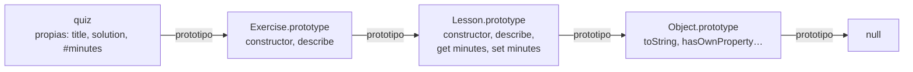

Código: los archivos [`examples/l04_*.js`](https://github.com/spareilleux/learn/tree/c65efe4fb76e61efd229793b296d3d7a44e71baf/code/javascript-for-csharp-java/examples), [`errors/l04_private_outside.js`](https://github.com/spareilleux/learn/blob/c65efe4fb76e61efd229793b296d3d7a44e71baf/code/javascript-for-csharp-java/errors/l04_private_outside.js), y los equivalentes en C# y Java en [`compare/l04_equality.cs`](https://github.com/spareilleux/learn/blob/c65efe4fb76e61efd229793b296d3d7a44e71baf/code/javascript-for-csharp-java/compare/l04_equality.cs) y [`compare/L04Equality.java`](https://github.com/spareilleux/learn/blob/c65efe4fb76e61efd229793b296d3d7a44e71baf/code/javascript-for-csharp-java/compare/L04Equality.java).

## Los objetos son bolsas de propiedades

```js
// examples/l04_objects.js
import { show } from './show.js';

const page = { title: 'Mission', order: 0 };
page.locale = 'en'; // añadir
delete page.order; // quitar
show('page', page);
show('page.author', page.author);
show("'title' in page", 'title' in page);
show("Object.hasOwn(page, 'title')", Object.hasOwn(page, 'title'));

// Los nombres de propiedad son cadenas (o símbolos): las demás claves se convierten
const grid = {};
grid[1] = 'one';
grid['1'] = 'one, again';
grid[{ x: 1 }] = 'an object';
grid[{ y: 2 }] = 'another object';
show('grid', grid);

// Orden: primero las claves con forma de entero, en orden ascendente, y luego las demás en orden de inserción
const lessons = { journal: 99, 10: 'ten', index: 0, 2: 'two' };
show('Object.keys(lessons)', Object.keys(lessons));

// Propiedades abreviadas, nombres calculados y métodos
const field = 'draft';
const title = 'Values and types';
const lesson = {
  title,
  [field]: true,
  describe() {
    return `${this.title} (${this.draft ? 'draft' : 'published'})`;
  },
};
show('lesson.describe()', lesson.describe());
show('Object.entries(lesson)', Object.entries(lesson));
```

```text
page                               { title: 'Mission', locale: 'en' }
page.author                        undefined
'title' in page                    true
Object.hasOwn(page, 'title')       true
grid                               { '1': 'one, again', '[object Object]': 'another object' }
Object.keys(lessons)               [ '2', '10', 'journal', 'index' ]
lesson.describe()                  'Values and types (draft)'
Object.entries(lesson)             [
  [ 'title', 'Values and types' ],
  [ 'draft', true ],
  [ 'describe', [Function: describe] ]
]
```

Un objeto C# o Java tiene los campos que declara su clase, ni más ni menos. Un objeto JavaScript se parece más a un `Dictionary<string, object>`, o al [`ExpandoObject`](https://learn.microsoft.com/dotnet/api/system.dynamic.expandoobject) de C#: las propiedades se añaden asignándolas, se quitan con `delete`, y una que falta se lee como `undefined`. El literal `{ … }` no necesita ninguna clase, y es la forma en que la mayor parte del código JavaScript se pasa datos.

Dos detalles de ese diccionario sorprenden:

- **Las claves son cadenas** (o [símbolos](https://developer.mozilla.org/en-US/docs/Web/JavaScript/Reference/Global_Objects/Symbol)). `grid[1]` y `grid['1']` son la misma propiedad, y todo objeto usado como clave se convierte en la misma cadena, `'[object Object]'`. Usa un [`Map`](https://developer.mozilla.org/en-US/docs/Web/JavaScript/Reference/Global_Objects/Map) cuando las claves no sean cadenas; la lección 5 lo compara con `Dictionary` y `HashMap`.
- **El orden no es solo el de inserción.** Las claves que parecen índices de array van primero, en orden numérico ascendente, y luego las demás cadenas en el orden en que se añadieron ([OrdinaryOwnPropertyKeys](https://tc39.es/ecma262/#sec-ordinaryownpropertykeys)). Un objeto indexado por año o por identificador acaba ordenado.

## La cadena de prototipos

```js
// examples/l04_prototypes.js
import { show } from './show.js';

const base = {
  kind: 'page',
  describe() {
    return `${this.title} is a ${this.kind}`;
  },
};
const mission = Object.create(base); // el prototipo de mission es base
mission.title = 'Mission';

show('mission.describe()', mission.describe());
show('Object.keys(mission)', Object.keys(mission));
show("Object.hasOwn(mission, 'kind')", Object.hasOwn(mission, 'kind'));
const { getPrototypeOf } = Object;
show('getPrototypeOf(mission) === base', getPrototypeOf(mission) === base);

// La lectura sube por la cadena; la escritura crea una propiedad propia que oculta la del prototipo
mission.kind = 'lesson';
show('mission.describe()', mission.describe());
show('base.kind', base.kind);

// Un cambio en el prototipo lo ve todo objeto que hereda de él, incluso los ya existentes
const journal = Object.create(base);
journal.title = 'Journal';
base.describe = function () {
  return `${this.title}, ${this.kind}, changed at run time`;
};
show('journal.describe()', journal.describe());

// El final de la cadena
show('getPrototypeOf(base)', getPrototypeOf(base));
show('getPrototypeOf(Object.prototype)', getPrototypeOf(Object.prototype));
const dictionary = Object.create(null);
show("'toString' in {}", 'toString' in {});
show("'toString' in dictionary", 'toString' in dictionary);
```

```text
mission.describe()                 'Mission is a page'
Object.keys(mission)               [ 'title' ]
Object.hasOwn(mission, 'kind')     false
getPrototypeOf(mission) === base   true
mission.describe()                 'Mission is a lesson'
base.kind                          'page'
journal.describe()                 'Journal, page, changed at run time'
getPrototypeOf(base)               [Object: null prototype] {}
getPrototypeOf(Object.prototype)   null
'toString' in {}                   true
'toString' in dictionary           false
```

Todo objeto tiene un enlace oculto a otro objeto, su **prototipo**, o a `null`. Leer una propiedad que el objeto no tiene continúa en el prototipo, luego en el prototipo del prototipo, hasta encontrar la propiedad o llegar a `null` ([OrdinaryGet](https://tc39.es/ecma262/#sec-ordinaryget)). `mission` tiene una propiedad propia, `title`, y encuentra `kind` y `describe` en `base`. Cuando se ejecuta `describe`, `this` sigue siendo `mission`, por la regla implícita de la [lección 3](../03-functions-and-scope/#this), así que el método lee el título de `mission`.

Esa búsqueda es la herencia de JavaScript, y difiere de una jerarquía de clases en tres aspectos:

- **Enlaza objetos, no tipos.** Cualquier objeto puede servir de prototipo de otro, con [`Object.create`](https://developer.mozilla.org/en-US/docs/Web/JavaScript/Reference/Global_Objects/Object/create).
- **La escritura no sube por la cadena.** `mission.kind = 'lesson'` crea una propiedad propia que oculta la del prototipo, y `base.kind` no cambia.
- **Está viva.** Sustituir `base.describe` cambia el método de todo objeto que hereda de `base`, incluidos los objetos creados antes del cambio. Así es como las bibliotecas antiguas añadían métodos a los tipos integrados, una práctica que hoy se desaconseja.

Los objetos simples heredan de `Object.prototype`, donde viven `toString` y `hasOwnProperty`; `in` los ve, `Object.hasOwn` no. `Object.create(null)` crea un objeto sin ningún prototipo, un diccionario sin claves heredadas.

## Clases

```js
// examples/l04_classes.js
import { attempt, show } from './show.js';

class Lesson {
  static count = 0;
  title; // campo público: una propiedad propia de cada instancia
  #minutes = 0; // campo privado: inalcanzable fuera del cuerpo de la clase

  constructor(title, minutes) {
    this.title = title;
    this.minutes = minutes; // llama al setter
    Lesson.count++;
  }

  get minutes() {
    return this.#minutes;
  }

  set minutes(value) {
    if (!Number.isInteger(value) || value < 0) {
      throw new RangeError(`minutes must be a non-negative integer, got ${value}`);
    }
    this.#minutes = value;
  }

  describe() {
    return `${this.title} (${this.#minutes} min)`;
  }

  static isLesson(value) {
    return #minutes in value; // ¿tiene value el campo privado de esta clase?
  }
}

class Exercise extends Lesson {
  constructor(title, minutes, solution) {
    super(title, minutes);
    this.solution = solution;
  }

  describe() {
    return `${super.describe()}, with a solution`;
  }
}

const values = new Lesson('Values and types', 25);
const quiz = new Exercise('Coercions', 10, 'details');
show('values.describe()', values.describe());
show('quiz.describe()', quiz.describe());
show('values', values);
show('Object.keys(quiz)', Object.keys(quiz));
show('Lesson.count', Lesson.count);
attempt("values.minutes = 'ten'", () => {
  values.minutes = 'ten';
});
show('values.minutes', values.minutes);

// Por debajo: una función, y métodos en su prototipo
show('typeof Lesson', typeof Lesson);
show("Object.hasOwn(values, 'describe')", Object.hasOwn(values, 'describe'));
const proto = Lesson.prototype;
show('values.describe === proto.describe', values.describe === proto.describe);
show('quiz.describe === proto.describe', quiz.describe === proto.describe);
show('quiz instanceof Lesson', quiz instanceof Lesson);
attempt("Lesson('no new')", () => Lesson('no new'));

// El motor comprueba los campos privados, no se ocultan por convención
show('Lesson.isLesson(quiz)', Lesson.isLesson(quiz));
show('Lesson.isLesson({ minutes: 5 })', Lesson.isLesson({ minutes: 5 }));
show("Object.hasOwn(values, '#minutes')", Object.hasOwn(values, '#minutes'));
show('JSON.stringify(values)', JSON.stringify(values));
attempt('proto.describe.call({ title })', () => proto.describe.call({ title: 'fake' }));
```

```text
values.describe()                  'Values and types (25 min)'
quiz.describe()                    'Coercions (10 min), with a solution'
values                             Lesson { title: 'Values and types' }
Object.keys(quiz)                  [ 'title', 'solution' ]
Lesson.count                       2
values.minutes = 'ten'             RangeError: minutes must be a non-negative integer, got ten
values.minutes                     25
typeof Lesson                      'function'
Object.hasOwn(values, 'describe')  false
values.describe === proto.describe true
quiz.describe === proto.describe   false
quiz instanceof Lesson             true
Lesson('no new')                   TypeError: Class constructor Lesson cannot be invoked without 'new'
Lesson.isLesson(quiz)              true
Lesson.isLesson({ minutes: 5 })    false
Object.hasOwn(values, '#minutes')  false
JSON.stringify(values)             '{"title":"Values and types"}'
proto.describe.call({ title })     TypeError: Cannot read private member #minutes from an object whose class did not declare it
```

La sintaxis se lee como C# o Java, y la mayor parte significa lo mismo:

| | C# | Java | JavaScript |
|---|---|---|---|
| Campo | `public string Title;` | `public String title;` | `title;`, una propiedad propia de cada instancia |
| Campo privado | `private int minutes;` | `private int minutes;` | `#minutes`, comprobado por el motor |
| Propiedad | `public int Minutes { get; set; }` | `getMinutes()`, `setMinutes()` | `get minutes()`, `set minutes(value)` |
| Miembro estático | `static int Count;` | `static int count;` | `static count = 0;` |
| Herencia | `class Exercise : Lesson` | `class Exercise extends Lesson` | `class Exercise extends Lesson`, un solo padre |
| Llamar al padre | `base.Describe()` | `super.describe()` | `super.describe()` |
| Varios constructores | sí | sí | un único `constructor` |
| Interfaces, clases abstractas | sí | sí | no; un objeto encaja si tiene los métodos a los que se llama |

Por debajo, `class` es una capa sobre los prototipos de la sección anterior ([ClassDefinitionEvaluation](https://tc39.es/ecma262/#sec-runtime-semantics-classdefinitionevaluation)). `Lesson` es una función, el constructor. Los métodos como `describe` se guardan una sola vez en `Lesson.prototype`, y cada instancia los encuentra a través de su enlace al prototipo, y por eso `values` no tiene un `describe` propio. `extends` enlaza `Exercise.prototype` con `Lesson.prototype`, así que la cadena de `quiz` es:



`quiz.describe` encuentra primero `Exercise.prototype.describe`, y `super.describe()` continúa un enlace más arriba. `instanceof` recorre la misma cadena, buscando `Lesson.prototype`. Lo que una clase añade sobre un prototipo escrito a mano es sobre todo seguridad: llamarla sin `new` lanza una excepción, su cuerpo es estricto, y sus métodos no son enumerables, así que un bucle `for…in` sobre una instancia no los lista.

**Los campos privados** son la única característica sin equivalente en los prototipos. Un nombre que empieza por `#` solo existe dentro del cuerpo de la clase; el código de fuera ni siquiera puede mencionarlo, y el módulo se rechaza antes de ejecutarse:

```js
// errors/l04_private_outside.js
class Lesson {
  #minutes = 25;
}
console.log('this line never runs');
console.log(new Lesson().#minutes);
```

```text
errors/l04_private_outside.js:6
console.log(new Lesson().#minutes);
                        ^

SyntaxError: Private field '#minutes' must be declared in an enclosing class

Node.js v24.21.0
```

Dentro de la clase, leer `#minutes` sobre un objeto que no lo tiene lanza un `TypeError`, como muestra la última línea de la salida, y `#minutes in value` lo comprueba sin lanzar nada. Los campos privados no son propiedades: `Object.hasOwn`, `Object.keys` y `JSON.stringify` no los ven. La reflexión de C# puede leer un campo privado, y la de Java también con `setAccessible`; nada en JavaScript puede leer un campo `#` desde fuera. La palabra clave `private` de TypeScript, en cambio, solo se comprueba en tiempo de compilación, y el próximo curso muestra lo que queda de ella en tiempo de ejecución.

**Los accesores** ejecutan código al leer o escribir una propiedad, como las propiedades de C#: `this.minutes = minutes` en el constructor pasa por el setter y su validación. Y los campos de una clase se crean en cada instancia, y por eso una función flecha en un campo, como en el patrón de listeners de la [lección 3](../03-functions-and-scope/#en-guitaralchemistga-conservar-this-en-los-listeners-de-eventos), cuesta una función por objeto.

## Igualdad y copias

```js
// examples/l04_equality_copy.js
import { attempt, show } from './show.js';

const a = { x: 1, y: 2 };
const b = { x: 1, y: 2 };
show('a === b', a === b);
show('a === a', a === a);

// Map y Set usan la misma identidad: dos claves de aspecto igual son dos claves
const visits = new Map();
visits.set({ x: 1, y: 2 }, 'first');
visits.set({ x: 1, y: 2 }, 'second');
show('visits.size', visits.size);
show('visits.get({ x: 1, y: 2 })', visits.get({ x: 1, y: 2 }));
const byKey = new Map([[`${a.x},${a.y}`, 'first']]);
show("byKey.get('1,2')", byKey.get('1,2'));

// El spread y Object.assign copian un nivel
const course = { title: 'JavaScript', tags: ['node'], created: new Date(Date.UTC(2026, 8, 14)) };
const shallow = { ...course };
shallow.title = 'TypeScript';
shallow.tags.push('typescript');
show('course.title', course.title);
show('course.tags', course.tags);

// structuredClone copia todo el grafo: Map, Set, Date, ciclos
const deep = structuredClone(course);
deep.tags.push('react');
show('course.tags', course.tags);
show('deep.created instanceof Date', deep.created instanceof Date);

// pero no las funciones, ni el prototipo de una instancia de clase
class Point {
  constructor(x, y) {
    this.x = x;
    this.y = y;
  }
  length() {
    return Math.hypot(this.x, this.y);
  }
}
const cloned = structuredClone(new Point(3, 4));
show('cloned', cloned);
show('cloned instanceof Point', cloned instanceof Point);
attempt('structuredClone({ f() {} })', () => structuredClone({ f() {} }));

// JSON.parse(JSON.stringify(...)) pierde más
const viaJson = JSON.parse(JSON.stringify({ ...course, draft: undefined }));
show('viaJson', viaJson);

// Object.freeze también es superficial
const frozen = Object.freeze({ tags: ['node'] });
frozen.tags.push('still mutable');
show('frozen.tags', frozen.tags);
```

```text
a === b                            false
a === a                            true
visits.size                        2
visits.get({ x: 1, y: 2 })         undefined
byKey.get('1,2')                   'first'
course.title                       'JavaScript'
course.tags                        [ 'node', 'typescript' ]
course.tags                        [ 'node', 'typescript' ]
deep.created instanceof Date       true
cloned                             { x: 3, y: 4 }
cloned instanceof Point            false
structuredClone({ f() {} })        DataCloneError: f() {} could not be cloned.
viaJson                            {
  title: 'JavaScript',
  tags: [ 'node', 'typescript' ],
  created: '2026-09-14T00:00:00.000Z'
}
frozen.tags                        [ 'node', 'still mutable' ]
```

Los records de C# y de Java se comparan por valor, y un `Dictionary` o un `HashMap` usa esa igualdad para sus claves:

```text
> dotnet run l04_equality.cs
a == b (record):        True
ReferenceEquals(a, b):  False
visits.Count:           1
c == d (class):         False
a with { Y = 5 }:       Point { X = 1, Y = 5 }
```

```text
> java L04Equality.java
a == b:                 false
a.equals(b):            true
visits.size():          1
```

JavaScript no tiene records, ni `Equals` o `equals` que sobrescribir, ni sobrecarga de operadores. `===` sobre dos objetos pregunta si son el mismo objeto, como `ReferenceEquals`, y [`Map`](https://developer.mozilla.org/en-US/docs/Web/JavaScript/Reference/Global_Objects/Map) y [`Set`](https://developer.mozilla.org/en-US/docs/Web/JavaScript/Reference/Global_Objects/Set) usan la misma identidad ([SameValueZero](https://tc39.es/ecma262/#sec-samevaluezero)): dos puntos con las mismas coordenadas son dos claves, y un nuevo `{ x: 1, y: 2 }` no encuentra ninguna de las dos. Para indexar un map por valor, construye una cadena o un número a partir de los valores, como hace `byKey`. Comparar dos objetos campo a campo es el ejercicio 1.

Las copias exigen el mismo cuidado, porque nada se copia implícitamente:

- **El spread** `{ ...course }` y [`Object.assign`](https://developer.mozilla.org/en-US/docs/Web/JavaScript/Reference/Global_Objects/Object/assign) copian las propiedades propias, a un nivel de profundidad: `shallow.tags` es el mismo array que `course.tags`. Es también lo que hace el `with` de C# sobre un record.
- **[`structuredClone`](https://developer.mozilla.org/en-US/docs/Web/API/Window/structuredClone)**, definido por el [estándar HTML](https://html.spec.whatwg.org/multipage/structured-data.html#dom-structuredclone) y disponible en Node.js, copia todo el grafo, incluidas las fechas, los maps, los sets y los ciclos. Rechaza las funciones, con un `DataCloneError`, y no conserva los prototipos: el clon de un `Point` es un objeto simple sin método `length`.
- **`JSON.parse(JSON.stringify(…))`**, el viejo truco, pierde más: las propiedades `undefined` desaparecen, las fechas se convierten en cadenas, y un `bigint` lanza una excepción.
- **`Object.freeze`** es superficial por el mismo motivo: congela un objeto, no los objetos a los que apunta.

## En GuitarAlchemist/ga: fusionar las preferencias guardadas

[`SceneOptions.tsx`](https://github.com/GuitarAlchemist/ga/blob/a826864f3a012cad88e415954bf57eca0ce12aa6/ReactComponents/ga-react-components/src/components/PrimeRadiant/SceneOptions.tsx#L57-L80) construye las opciones de una escena 3D: valores por defecto, luego parámetros de la URL como `?tower` que activan opciones ([líneas 62-73](https://github.com/GuitarAlchemist/ga/blob/a826864f3a012cad88e415954bf57eca0ce12aa6/ReactComponents/ga-react-components/src/components/PrimeRadiant/SceneOptions.tsx#L62-L73)), y luego las preferencias guardadas en `localStorage`, fusionadas con una sola línea ([línea 77](https://github.com/GuitarAlchemist/ga/blob/a826864f3a012cad88e415954bf57eca0ce12aa6/ReactComponents/ga-react-components/src/components/PrimeRadiant/SceneOptions.tsx#L77)):

```ts
if (saved) Object.assign(state, JSON.parse(saved));
```

Cada interruptor guarda el estado completo ([línea 94](https://github.com/GuitarAlchemist/ga/blob/a826864f3a012cad88e415954bf57eca0ce12aa6/ReactComponents/ga-react-components/src/components/PrimeRadiant/SceneOptions.tsx#L94)). Reducido a tres opciones, en JavaScript puro:

```js
// examples/l04_ga_assign.js
import { show } from './show.js';

function getDefaults(search, saved) {
  const state = { stars: true, tower: false, skyboxMode: 'milky-way' };
  // Líneas 62-73: los parámetros de la URL sustituyen los valores por defecto
  const params = new URLSearchParams(search);
  if (params.has('tower')) state.tower = true;
  // Líneas 75-78: después se fusionan las preferencias guardadas en localStorage
  if (saved) Object.assign(state, JSON.parse(saved));
  return state;
}

// Cada interruptor guarda el estado completo (líneas 94, 103 y 112), así que un estado guardado tiene todas las claves
const saved = JSON.stringify({ stars: false, tower: false, skyboxMode: 'milky-way' });
show("getDefaults('?tower', null)", getDefaults('?tower', null));
show("getDefaults('?tower', saved)", getDefaults('?tower', saved));

// Object.assign copia todas las propiedades propias del origen, conocidas o no
show('with an old key', getDefaults('', '{"bloomLevel":3,"stars":"yes"}'));

// JSON.parse hace de __proto__ una propiedad ordinaria; Object.assign la asigna después, lo que cambia el prototipo
const parsed = JSON.parse('{"__proto__":{"isAdmin":true}}');
show("Object.hasOwn(parsed, '__proto__')", Object.hasOwn(parsed, '__proto__'));
const state = getDefaults('', '{"__proto__":{"isAdmin":true}}');
show('state.isAdmin', state.isAdmin);
show("Object.hasOwn(state, 'isAdmin')", Object.hasOwn(state, 'isAdmin'));
show('{}.isAdmin', {}.isAdmin);

// El spread define propiedades en lugar de asignarlas: el prototipo sigue siendo Object.prototype
const spread = { ...parsed };
show('spread.isAdmin', spread.isAdmin);
show('Object.keys(spread)', Object.keys(spread));
```

```text
getDefaults('?tower', null)        { stars: true, tower: true, skyboxMode: 'milky-way' }
getDefaults('?tower', saved)       { stars: false, tower: false, skyboxMode: 'milky-way' }
with an old key                    { stars: 'yes', tower: false, skyboxMode: 'milky-way', bloomLevel: 3 }
Object.hasOwn(parsed, '__proto__') true
state.isAdmin                      true
Object.hasOwn(state, 'isAdmin')    false
{}.isAdmin                         undefined
spread.isAdmin                     undefined
Object.keys(spread)                [ '__proto__' ]
```

Ocurren tres cosas, de la más visible a la más oscura:

1. **La URL pierde frente al estado guardado.** `Object.assign` copia sus orígenes en orden, así que gana el último, y el estado guardado va el último. En cuanto un usuario ha cambiado una opción, el estado guardado contiene todas las claves, y `?tower` ya no activa la torre. El comentario encima del bloque de la URL llama a esos parámetros "overrides"; fusionarlos después de las preferencias guardadas haría que realmente se impusieran.
2. **Todo lo guardado se copia, conocido o no.** Una opción renombrada en una versión posterior se queda en `localStorage` y vuelve como `bloomLevel`, y un valor del tipo equivocado, `stars: 'yes'`, sustituye a un booleano. El tipo `SceneOptionsState` de TypeScript no comprueba lo que devuelve `JSON.parse`, ya que los tipos han desaparecido en tiempo de ejecución.
3. **Una clave `__proto__` cambia el prototipo.** [`JSON.parse`](https://tc39.es/ecma262/#sec-json.parse) crea una propiedad propia ordinaria llamada `__proto__`. `Object.assign` la *asigna* después al destino, y asignar `__proto__` llama al [setter `Object.prototype.__proto__`](https://tc39.es/ecma262/#sec-object.prototype.__proto__), que sustituye el prototipo del destino: `state.isAdmin` vale `true` sin ser una propiedad propia. Solo se ve afectado ese objeto, `{}.isAdmin` sigue valiendo `undefined`, y en GA los datos vienen del propio navegador del usuario, así que es una curiosidad más que un agujero. El mismo patrón aplicado a datos de una petición es una clase de vulnerabilidad conocida, la [contaminación de prototipos](https://developer.mozilla.org/en-US/docs/Web/Security/Attacks/Prototype_pollution) (prototype pollution). El spread no asigna, [define propiedades](https://tc39.es/ecma262/#sec-copydataproperties), y conserva `__proto__` como una clave normal.

El ejercicio 3 reescribe la función.

## Puntos clave

- Un objeto es un conjunto de claves de tipo cadena que puede cambiar en tiempo de ejecución; una propiedad que falta se lee como `undefined`; las claves con forma de entero se listan primero.
- Leer una propiedad recorre la cadena de prototipos; escribirla crea una propiedad propia. Los prototipos enlazan objetos, y sus cambios son vivos.
- `class` construye una función constructora y un prototipo: los métodos se comparten en el prototipo, los campos se crean en cada instancia.
- El motor impone los campos `#private`, invisibles para `Object.keys` y `JSON.stringify`.
- `===`, `Map` y `Set` comparan los objetos por identidad; no hay records ni `Equals` que sobrescribir.
- El spread y `Object.assign` copian un nivel; `structuredClone` copia en profundidad pero descarta los prototipos y rechaza las funciones.
- `Object.assign` deja ganar al último origen y copia todas las claves, `__proto__` incluida.

## Ejercicios

1. Escribe `deepEqual(a, b)`, verdadera cuando dos valores son idénticos, o son objetos con el mismo prototipo y las mismas claves propias con valores profundamente iguales. ¿Qué responde para dos fechas distintas, y por qué?

<details>
<summary>Solución</summary>

[`solutions/l04_ex1_deep_equal.js`](https://github.com/spareilleux/learn/blob/c65efe4fb76e61efd229793b296d3d7a44e71baf/code/javascript-for-csharp-java/solutions/l04_ex1_deep_equal.js):

```js
function deepEqual(a, b) {
  if (Object.is(a, b)) return true;
  if (typeof a !== 'object' || typeof b !== 'object' || a === null || b === null) return false;
  if (Object.getPrototypeOf(a) !== Object.getPrototypeOf(b)) return false;
  const keys = Object.keys(a);
  if (keys.length !== Object.keys(b).length) return false;
  return keys.every((key) => Object.hasOwn(b, key) && deepEqual(a[key], b[key]));
}

console.log(deepEqual({ x: 1, tags: ['a'] }, { tags: ['a'], x: 1 }));
console.log(deepEqual({ x: 1 }, { x: 1, y: undefined }));
console.log(deepEqual([1, 2], { 0: 1, 1: 2 }));
console.log(deepEqual(NaN, NaN), deepEqual(0, -0));
console.log(deepEqual(new Date(0), new Date(1)));
```

```text
true
false
false
true false
true
```

`Object.is` se ocupa de los primitivos, y dice que `NaN` es igual a `NaN` pero que `0` difiere de `-0`. La comprobación del prototipo distingue un array de un objeto con las mismas claves. La última línea es incorrecta a propósito: una fecha guarda su tiempo en un slot interno, no en una propiedad, así que dos fechas no tienen claves propias y parecen iguales. Una igualdad profunda general debe conocer cada tipo integrado; [`assert.deepStrictEqual`](https://nodejs.org/docs/latest-v24.x/api/assert.html#assertdeepstrictequalactual-expected-message) de Node.js lo hace, y la lección 9 lo usa en las pruebas.

</details>

2. Escribe una clase `Temperature` que guarde los grados Celsius en un campo privado, exponga un getter y un setter `fahrenheit`, tenga un método de fábrica estático `fromFahrenheit`, y se serialice como `{"celsius": …}` con `JSON.stringify`.

<details>
<summary>Solución</summary>

[`solutions/l04_ex2_temperature.js`](https://github.com/spareilleux/learn/blob/c65efe4fb76e61efd229793b296d3d7a44e71baf/code/javascript-for-csharp-java/solutions/l04_ex2_temperature.js):

```js
class Temperature {
  #celsius;

  constructor(celsius) {
    this.#celsius = celsius;
  }

  static fromFahrenheit(fahrenheit) {
    return new Temperature(((fahrenheit - 32) * 5) / 9);
  }

  get fahrenheit() {
    return (this.#celsius * 9) / 5 + 32;
  }

  set fahrenheit(value) {
    this.#celsius = ((value - 32) * 5) / 9;
  }

  toJSON() {
    return { celsius: this.#celsius };
  }
}

const room = new Temperature(20);
console.log(room.fahrenheit);
room.fahrenheit = 212;
console.log(JSON.stringify(room));
console.log(JSON.stringify(Temperature.fromFahrenheit(32)));
console.log(Object.keys(room), room);
```

```text
68
{"celsius":100}
{"celsius":0}
[] Temperature {}
```

Sin `toJSON`, `JSON.stringify(room)` imprimiría `{}`, ya que un campo privado no es una propiedad; [`toJSON`](https://developer.mozilla.org/en-US/docs/Web/JavaScript/Reference/Global_Objects/JSON/stringify#tojson_behavior) desempeña el papel de un conversor personalizado en `System.Text.Json` o Jackson. La última línea muestra la misma invisibilidad: ninguna clave, y la visualización de Node.js muestra un `Temperature` vacío.

</details>

3. Reescribe `getDefaults` del ejemplo de GA para que los parámetros de la URL ganen sobre las preferencias guardadas, se ignoren las claves guardadas que no son opciones, un valor guardado sustituya a un valor por defecto solo si tiene el mismo tipo, y `__proto__` no pueda cambiar nada.

<details>
<summary>Solución</summary>

[`solutions/l04_ex3_merge.js`](https://github.com/spareilleux/learn/blob/c65efe4fb76e61efd229793b296d3d7a44e71baf/code/javascript-for-csharp-java/solutions/l04_ex3_merge.js):

```js
function getDefaults(search, saved) {
  const state = { stars: true, tower: false, skyboxMode: 'milky-way' };
  const preferences = saved ? JSON.parse(saved) : {};
  for (const key of Object.keys(state)) {
    // Object.keys(state) lista las claves conocidas: __proto__ y las claves antiguas nunca se leen
    if (Object.hasOwn(preferences, key) && typeof preferences[key] === typeof state[key]) {
      state[key] = preferences[key];
    }
  }
  const params = new URLSearchParams(search);
  if (params.has('tower')) state.tower = true; // al final, así que gana la URL
  return state;
}

const saved = JSON.stringify({ stars: false, tower: false, skyboxMode: 'milky-way' });
console.log(getDefaults('?tower', saved));
console.log(getDefaults('', '{"bloomLevel":3,"stars":"yes","__proto__":{"isAdmin":true}}'));
console.log(getDefaults('', '{"__proto__":{"isAdmin":true}}').isAdmin);
```

```text
{ stars: false, tower: true, skyboxMode: 'milky-way' }
{ stars: true, tower: false, skyboxMode: 'milky-way' }
undefined
```

El bucle le da la vuelta a la pregunta: en lugar de copiar lo que contenga el objeto guardado, le pide al objeto guardado cada clave que conoce el estado. La prueba con `typeof` es una validación mínima; un valor como `skyboxMode` también tendría que ser una de las cadenas permitidas, y ahí es donde entra una biblioteca de esquemas, o los tipos estáticos y las comprobaciones en tiempo de ejecución del curso de TypeScript.

</details>

## Fuentes

- [ECMAScript — métodos internos de los objetos ordinarios](https://tc39.es/ecma262/#sec-ordinary-object-internal-methods-and-internal-slots), [OrdinaryOwnPropertyKeys](https://tc39.es/ecma262/#sec-ordinaryownpropertykeys), [ClassDefinitionEvaluation](https://tc39.es/ecma262/#sec-runtime-semantics-classdefinitionevaluation), [Object.assign](https://tc39.es/ecma262/#sec-object.assign), [CopyDataProperties](https://tc39.es/ecma262/#sec-copydataproperties), [Object.prototype.\_\_proto\_\_](https://tc39.es/ecma262/#sec-object.prototype.__proto__)
- [MDN — herencia y la cadena de prototipos](https://developer.mozilla.org/en-US/docs/Web/JavaScript/Guide/Inheritance_and_the_prototype_chain), [clases](https://developer.mozilla.org/en-US/docs/Web/JavaScript/Reference/Classes), [elementos privados](https://developer.mozilla.org/en-US/docs/Web/JavaScript/Reference/Classes/Private_elements), [structuredClone](https://developer.mozilla.org/en-US/docs/Web/API/Window/structuredClone)
- [HTML Standard — serialización y deserialización estructuradas](https://html.spec.whatwg.org/multipage/structured-data.html#dom-structuredclone)
- [Microsoft — records](https://learn.microsoft.com/dotnet/csharp/fundamentals/types/records), [Java — clases record](https://docs.oracle.com/en/java/javase/25/language/records.html)
