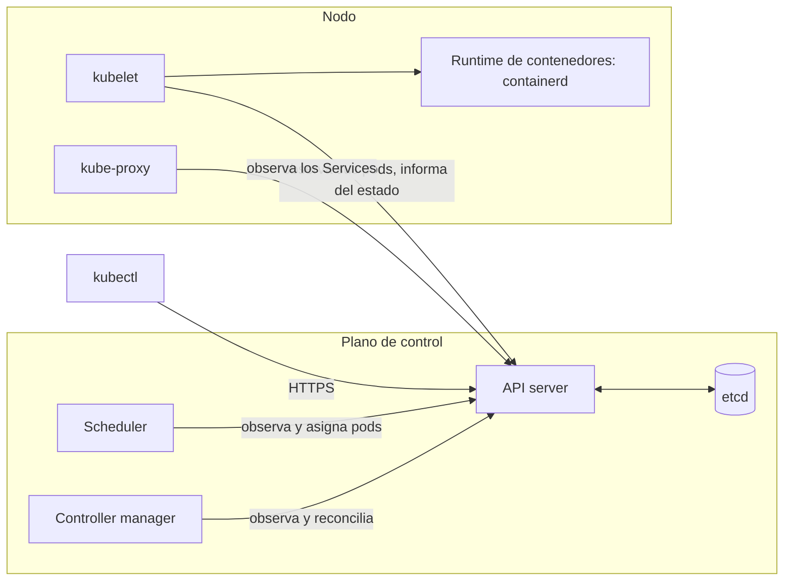

import { Tabs, TabItem } from '@astrojs/starlight/components';

Código completo: [`code/kubernetes`](https://github.com/spareilleux/learn/tree/main/code/kubernetes). La configuración del clúster es [`kind/cluster.yaml`](https://github.com/spareilleux/learn/blob/main/code/kubernetes/kind/cluster.yaml), y los comandos de esta lección están en [`l01/run.sh`](https://github.com/spareilleux/learn/blob/main/code/kubernetes/l01/run.sh). [`check.sh`](https://github.com/spareilleux/learn/blob/main/code/kubernetes/check.sh) los ejecuta contra un clúster real y compara sus salidas con los archivos de [`expected`](https://github.com/spareilleux/learn/tree/main/code/kubernetes/expected), tras sustituir las edades, los nombres generados y las direcciones IP por marcadores.

## De `docker run` a un estado deseado

En el [curso de contenedores WSL](../../wsl-containers/04-build-an-image/), construiste una imagen y la ejecutaste con un comando. Ese comando hacía algo en el acto: arrancaba un contenedor. Si el contenedor fallaba, nada lo volvía a levantar; si la máquina se reiniciaba, nada lo arrancaba de nuevo; para ejecutar tres copias, ejecutabas el comando tres veces.

Kubernetes funciona al revés. No le dices qué hacer; describes lo que debe existir («tres copias de esta imagen, accesibles con este nombre»), guardas esa descripción en el clúster, y un conjunto de programas la compara sin parar con lo que se está ejecutando de verdad y corrige la diferencia. Un desarrollador de C# ya ha escrito este bucle, como un `BackgroundService` que se despierta, lee el estado esperado de una base de datos, mira la realidad y actúa sobre la diferencia. Kubernetes son decenas de bucles así, llamados **controladores**, que comparten una base de datos.

| Conoces | En Kubernetes |
|---|---|
| `docker run` de una imagen | un **Pod**: uno o varios contenedores planificados juntos (lección 2) |
| ejecutar el comando tres veces, y reiniciar a mano | un **Deployment**: un número deseado de pods idénticos, mantenidos vivos y actualizados (lección 3) |
| `-p 8080:8080` y un nombre de host | un **Service**: un nombre y una dirección estables delante de pods que cambian (lección 4) |
| `docker compose up` con un archivo YAML | `kubectl apply -f` con manifiestos YAML |
| un bucle `BackgroundService` que converge hacia un objetivo | un controlador |
| `appsettings.json` y variables de entorno | ConfigMaps y Secrets (lección 5) |

## La arquitectura

Un clúster tiene un **plano de control**, que almacena y decide, y **nodos**, que ejecutan los contenedores. Nada en un nodo habla directamente con la base de datos: todos los componentes, `kubectl` incluido, pasan por el API server.



- El [**API server**](https://kubernetes.io/docs/concepts/architecture/#kube-apiserver) (`kube-apiserver`) es una API REST sobre HTTPS. Autentica a quien llama, valida cada objeto, lo almacena y permite a los demás componentes **observar** (watch) los cambios en lugar de consultar periódicamente.
- [**etcd**](https://etcd.io/) es el almacén clave-valor que hay detrás: el único lugar donde se guarda el estado del clúster.
- El [**scheduler**](https://kubernetes.io/docs/concepts/scheduling-eviction/kube-scheduler/) busca pods sin nodo, elige uno y registra la elección. No arranca nada por sí mismo.
- El [**controller manager**](https://kubernetes.io/docs/concepts/architecture/#kube-controller-manager) ejecuta los controladores integrados: el controlador de ReplicaSet crea o borra pods hasta que su número coincide, el controlador de Deployment gestiona ReplicaSets, y así sucesivamente.
- En cada nodo, el [**kubelet**](https://kubernetes.io/docs/concepts/architecture/#kubelet) observa los pods asignados a su nodo, pide al runtime de contenedores ([containerd](https://containerd.io/) aquí) que arranque sus contenedores, ejecuta sus sondas e informa de su estado.
- [**kube-proxy**](https://kubernetes.io/docs/concepts/architecture/#kube-proxy) convierte los Services en reglas de red en cada nodo.

El bucle es lo bastante corto para leerlo. [`manageReplicas`](https://github.com/kubernetes/kubernetes/blob/f54c212e3a2f75d674b717a9b29052b20b60aefc/pkg/controller/replicaset/replica_set.go#L649-L700), del controlador de ReplicaSet, calcula `diff := len(activePods) - int(*(rs.Spec.Replicas))`, crea pods cuando la diferencia es negativa y borra algunos cuando es positiva. No sabe por qué faltan pods: un fallo, un pod borrado y un ReplicaSet nuevo se ven igual. Eso es lo que hace robusto el modelo, y también por qué «borré el pod y volvió» sorprende a quien empieza.

## Elegir un clúster local

Cuatro herramientas ejecutan un clúster en una máquina de desarrollo. Todas te dan un API server real; se diferencian en cómo crean los nodos.

| Herramienta | Los nodos son | Versión comprobada el 2026-09-15 | Útil para |
|---|---|---|---|
| [kind](https://kind.sigs.k8s.io/) | contenedores de Docker o Podman | v0.33.0, Kubernetes 1.37.0 por defecto | CI y pruebas: el propio proyecto Kubernetes se prueba con él; varios nodos en una máquina |
| [k3d](https://k3d.io/) | contenedores que ejecutan [k3s](https://k3s.io/), una distribución más ligera | v5.9.0 | poca huella, con un balanceador de carga y Traefik integrados |
| [minikube](https://minikube.sigs.k8s.io/) | una VM o un contenedor | v1.39.0, Kubernetes 1.37.0 por defecto | complementos (dashboard, ingress, métricas) activados con un comando |
| [Docker Desktop](https://docs.docker.com/desktop/features/kubernetes/) | kubeadm, o kind desde el provisionador más reciente | depende de la versión de Docker Desktop | un clúster con una casilla, si ya usas Docker Desktop |

Este curso usa **kind**: es pequeño, se puede automatizar, es idéntico en los tres sistemas operativos y funciona en GitHub Actions. Todo lo que enseña se aplica a los otros tres y a los clústeres gestionados (lección 15), salvo donde una lección diga lo contrario.

kind necesita Docker (Docker Desktop en Windows y macOS, Docker Engine o Docker Desktop en Linux) o Podman. La herramienta `wslc` del curso de contenedores WSL no es uno de sus proveedores.

## Instalar kind y kubectl

`kubectl` es el cliente de línea de comandos. Su versión debe estar a una versión menor como mucho de la del clúster; aquí ambas son 1.37.0. Los comandos siguientes descargan las versiones fijadas, como en el [inicio rápido de kind](https://kind.sigs.k8s.io/docs/user/quick-start/#installing-from-release-binaries) y las [páginas de instalación de kubectl](https://kubernetes.io/docs/tasks/tools/).

<Tabs syncKey="os">
<TabItem label="Windows">

```powershell
mkdir $HOME\bin -Force
curl.exe -Lo $HOME\bin\kind.exe https://kind.sigs.k8s.io/dl/v0.33.0/kind-windows-amd64
curl.exe -Lo $HOME\bin\kubectl.exe https://dl.k8s.io/release/v1.37.0/bin/windows/amd64/kubectl.exe
# Añade $HOME\bin al PATH del usuario y abre una terminal nueva
[Environment]::SetEnvironmentVariable('Path', "$([Environment]::GetEnvironmentVariable('Path','User'));$HOME\bin", 'User')
```

</TabItem>
<TabItem label="Linux / WSL">

```bash
curl -Lo ./kind https://kind.sigs.k8s.io/dl/v0.33.0/kind-linux-amd64
curl -LO https://dl.k8s.io/release/v1.37.0/bin/linux/amd64/kubectl
chmod +x ./kind ./kubectl
sudo mv ./kind ./kubectl /usr/local/bin/
```

</TabItem>
<TabItem label="macOS">

```bash
# Apple silicon; usa darwin-amd64 en un Mac Intel
curl -Lo ./kind https://kind.sigs.k8s.io/dl/v0.33.0/kind-darwin-arm64
curl -LO https://dl.k8s.io/release/v1.37.0/bin/darwin/arm64/kubectl
chmod +x ./kind ./kubectl
sudo mv ./kind ./kubectl /usr/local/bin/
```

</TabItem>
</Tabs>

Cada versión publica también una suma SHA-256 junto al binario ([kind](https://github.com/kubernetes-sigs/kind/releases/tag/v0.33.0), `kubectl.exe.sha256` o `kubectl.sha256` para kubectl): compárala con `Get-FileHash` o `sha256sum` antes de fiarte de una descarga. Las descargas de Windows se ejecutaron en Windows 11, y la línea del `PATH` está *por verificar*: la máquina del autor ya tenía sus herramientas en el path. Los comandos de Linux siguen las mismas páginas y la CI del curso ejecuta su equivalente en Linux; la pestaña de macOS está *por verificar*.

```text
> kind version
kind v0.33.0 go1.26.7 windows/amd64
> kubectl version --client
Client Version: v1.37.0
Kustomize Version: v5.8.1
```

## Crear el clúster

Un archivo de configuración de kind da nombre al clúster, enumera sus nodos y fija la imagen de nodo por digest, para que todo el mundo ejecute el mismo Kubernetes:

```yaml
# El clúster del curso: un nodo, fijado a Kubernetes v1.37.0.
# kind create cluster --config kind/cluster.yaml
kind: Cluster
apiVersion: kind.x-k8s.io/v1alpha4
name: learn-k8s
nodes:
  - role: control-plane
    image: kindest/node:v1.37.0@sha256:a1ed56cfb0e7b93589bdf97c8cd566405a265939e3620fc4f5de89adff580ae5
    # Lección 4: un Service NodePort en 30080 responde en http://localhost:30080
    extraPortMappings:
      - containerPort: 30080
        hostPort: 30080
        listenAddress: 127.0.0.1
```

El digest es el que kind v0.33.0 usa por defecto, declarado en su [`defaults/image.go`](https://github.com/kubernetes-sigs/kind/blob/407a9675e6d9af1200b5f57f9ca52ec6cdacce74/pkg/apis/config/defaults/image.go#L20-L21). Un solo nodo es a la vez el plano de control y el único worker: suficiente para las lecciones 1 a 7, y ligero para un portátil.

```text
> kind create cluster --config kind/cluster.yaml
Creating cluster "learn-k8s" ...
 ✓ Ensuring node image (kindest/node:v1.37.0) 🖼️
 ✓ Preparing nodes 📦
 ✓ Writing configuration 📜
 ✓ Starting control-plane 🕹️
 ✓ Installing CNI 🔌
 ✓ Installing StorageClass 💾
Set kubectl context to "kind-learn-k8s"
You can now use your cluster with:

kubectl cluster-info --context kind-learn-k8s
```

En una terminal, cada paso muestra primero una animación, y kind termina con un enlace a su documentación; las líneas de arriba son el estado final. Tardó 58 segundos en la máquina del autor, con la imagen de nodo ya descargada. El «nodo» es un contenedor de Docker llamado `learn-k8s-control-plane`, que ejecuta systemd, containerd, el kubelet y el plano de control como contenedores dentro de él.

:::caution[Tus otros clústeres]
`kind create cluster` añade un contexto a tu kubeconfig (`~/.kube/config` por defecto) y lo convierte en el actual. Si también usas un clúster de trabajo, un `kubectl delete` posterior iría al contexto que esté activo. Para mantener kind aparte, apunta la variable de entorno `KUBECONFIG` a un archivo separado antes de crear el clúster, o comprueba `kubectl config current-context` antes de cualquier comando destructivo.
:::

## Echar un vistazo

```text
> kubectl version
Client Version: v1.37.0
Kustomize Version: v5.8.1
Server Version: v1.37.0
> kubectl get nodes
NAME                      STATUS   ROLES           AGE   VERSION
learn-k8s-control-plane   Ready    control-plane   11m   v1.37.0
```

El plano de control descrito arriba está ahí mismo, como pods en el namespace `kube-system`:

```text
> kubectl get pods -n kube-system
NAME                                              READY   STATUS    RESTARTS   AGE
coredns-559f6c778d-jlzvq                          1/1     Running   0          11m
coredns-559f6c778d-nvpd5                          1/1     Running   0          11m
etcd-learn-k8s-control-plane                      1/1     Running   0          11m
kindnet-8bcfl                                     1/1     Running   0          11m
kube-apiserver-learn-k8s-control-plane            1/1     Running   0          11m
kube-controller-manager-learn-k8s-control-plane   1/1     Running   0          11m
kube-proxy-kxrkk                                  1/1     Running   0          11m
kube-scheduler-learn-k8s-control-plane            1/1     Running   0          11m
```

- `etcd`, `kube-apiserver`, `kube-controller-manager` y `kube-scheduler` terminan con el nombre del nodo: son [**pods estáticos**](https://kubernetes.io/docs/tasks/configure-pod-container/static-pod/), que el kubelet arranca a partir de archivos del nodo antes de que exista ningún API server. Después, el API server muestra una copia de solo lectura de cada uno.
- `coredns-559f6c778d-…` tiene dos partes tras su nombre: `559f6c778d` identifica el ReplicaSet (un hash de la plantilla del pod), y los cinco últimos caracteres son aleatorios. [CoreDNS](https://coredns.io/) responde a las consultas DNS del clúster (lección 4).
- `kindnet` es el plugin de red de kind (el «CNI» del log de creación), y `kube-proxy` se ejecuta una vez por nodo: ambos tienen un único sufijo aleatorio porque los crea un DaemonSet (lección 7).

Los archivos de los pods estáticos están en el nodo, que es un contenedor, así que `docker exec` puede listarlos:

```text
> docker exec learn-k8s-control-plane ls /etc/kubernetes/manifests
etcd.yaml
kube-apiserver.yaml
kube-controller-manager.yaml
kube-scheduler.yaml
```

## kubectl habla HTTPS

`kubectl` es un cliente HTTP con buenos modales. Sube su nivel de detalle y aparece cada petición:

```text
> kubectl get nodes -v=6
I0915 00:17:57.387396   70612 round_trippers.go:632] "Response" verb="GET" url="https://127.0.0.1:55531/api/v1/nodes?limit=500" status="200 OK" milliseconds=6
NAME                      STATUS   ROLES           AGE    VERSION
learn-k8s-control-plane   Ready    control-plane   116s   v1.37.0
```

Las líneas anteriores, omitidas aquí, indican qué archivo kubeconfig se cargó y listan las feature gates del cliente.

La dirección, los certificados y el usuario vienen del archivo **kubeconfig**. Un **contexto** reúne un clúster, un usuario y un namespace por defecto bajo un nombre:

```text
> kubectl config get-contexts
CURRENT   NAME             CLUSTER          AUTHINFO         NAMESPACE
*         kind-learn-k8s   kind-learn-k8s   kind-learn-k8s
```

`kubectl config use-context <name>` cambia de contexto, `--context <name>` apunta a otro clúster para un solo comando, y `-n <namespace>` a otro namespace. El puerto, aquí 55531, lo elige Docker cuando kind crea el nodo; `kind get kubeconfig --name learn-k8s` vuelve a imprimir el archivo si lo pierdes.

La API también se documenta a sí misma. [`kubectl explain`](https://kubernetes.io/docs/reference/kubectl/generated/kubectl_explain/) lee el esquema que publica el servidor, así que siempre coincide con la versión del clúster:

```text
> kubectl explain pod.spec.restartPolicy
KIND:       Pod
VERSION:    v1

FIELD: restartPolicy <string>
ENUM:
    Always
    Never
    OnFailure

DESCRIPTION:
    Restart policy for all containers within the pod. One of Always, OnFailure,
    Never. In some contexts, only a subset of those values may be permitted.
    Default to Always. More info:
    https://kubernetes.io/docs/concepts/workloads/pods/pod-lifecycle/#restart-policy
    
    Possible enum values:
     - `"Always"`
     - `"Never"`
     - `"OnFailure"`
```

`kubectl api-resources` lista todos los tipos de objeto, con su nombre corto y su grupo de API. El grupo `apps` contiene las cargas de trabajo de las próximas lecciones:

```text
> kubectl api-resources --api-group=apps
NAME                  SHORTNAMES   APIVERSION   NAMESPACED   KIND
controllerrevisions                apps/v1      true         ControllerRevision
daemonsets            ds           apps/v1      true         DaemonSet
deployments           deploy       apps/v1      true         Deployment
replicasets           rs           apps/v1      true         ReplicaSet
statefulsets          sts          apps/v1      true         StatefulSet
```

## Un primer estado deseado

[`l01/hello.yaml`](https://github.com/spareilleux/learn/blob/main/code/kubernetes/l01/hello.yaml) pide dos copias de la imagen más pequeña que existe, [`pause`](https://github.com/kubernetes/kubernetes/tree/f54c212e3a2f75d674b717a9b29052b20b60aefc/build/pause), que no hace nada y nunca termina. El nodo ya la tiene, así que no se descarga nada.

```yaml
# Lección 1: un estado deseado. Dos copias de la imagen más pequeña que existe: pause no hace nada y nunca termina.
apiVersion: apps/v1
kind: Deployment
metadata:
  name: hello
spec:
  replicas: 2
  selector:
    matchLabels:
      app: hello
  template:
    metadata:
      labels:
        app: hello
    spec:
      containers:
        - name: pause
          image: registry.k8s.io/pause:3.10
```

Todo manifiesto tiene los mismos cuatro campos de primer nivel: `apiVersion` y `kind` dicen qué es el objeto, `metadata` le da nombre, y `spec` es el estado deseado. Los controladores añaden un quinto, `status`, con lo que observan.

Antes de almacenar nada, el API server puede validar un archivo. Una errata en el nombre de un campo, `replica:` en lugar de `replicas:` en [`l01/hello-invalid.yaml`](https://github.com/spareilleux/learn/blob/main/code/kubernetes/l01/hello-invalid.yaml), se rechaza:

```text
> kubectl apply --dry-run=server -f l01/hello-invalid.yaml
Error from server (BadRequest): error when creating "l01/hello-invalid.yaml": Deployment in version "v1" cannot be handled as a Deployment: strict decoding error: unknown field "spec.replica"
> kubectl apply --dry-run=server -f l01/hello.yaml
deployment.apps/hello created (server dry run)
```

Sin clúster, [kubeconform](https://github.com/yannh/kubeconform) comprueba los mismos archivos contra los esquemas JSON publicados. El [`validate.sh`](https://github.com/spareilleux/learn/blob/main/code/kubernetes/validate.sh) del curso lo ejecuta sobre todos los manifiestos, en Windows, Linux y macOS.

Cada lección trabaja en su propio **namespace**, una partición con nombre del clúster, para que borrar el namespace al final elimine todo lo que la lección creó:

```text
> kubectl create namespace l01
namespace/l01 created
> kubectl apply -n l01 -f l01/hello.yaml
deployment.apps/hello created
> kubectl rollout status -n l01 deployment/hello
deployment "hello" successfully rolled out
> kubectl get -n l01 rs,pods -l app=hello
NAME                               DESIRED   CURRENT   READY   AGE
replicaset.apps/hello-6f8b555b4b   2         2         2       1s

NAME                         READY   STATUS    RESTARTS   AGE
pod/hello-6f8b555b4b-6q7s9   1/1     Running   0          1s
pod/hello-6f8b555b4b-fv257   1/1     Running   0          1s
```

`kubectl rollout status` espera hasta que los pods están listos; antes de su última línea, imprime un número variable de líneas `Waiting for deployment…`, omitidas aquí y en el resto del curso cuando no aportan nada. Un archivo creó tres tipos de objetos: el Deployment, un ReplicaSet que este creó, y dos pods que creó el ReplicaSet. `-l app=hello` los selecciona por etiqueta, igual que el ReplicaSet encuentra «sus» pods.

### Cambiar el estado deseado

[`l01/hello-3-replicas.yaml`](https://github.com/spareilleux/learn/blob/main/code/kubernetes/l01/hello-3-replicas.yaml) difiere en una línea. `kubectl diff` lo envía al servidor, que calcula lo que cambiaría sin almacenarlo:

```text
> kubectl diff -n l01 -f l01/hello-3-replicas.yaml
...
-  generation: 1
+  generation: 2
...
-  replicas: 2
+  replicas: 3
```

(La salida real es un diff unificado entre dos directorios temporales; las líneas de arriba son sus cambios.) `generation` cuenta los cambios de `spec`: los controladores la comparan con la generación sobre la que actuaron por última vez, y así es como `kubectl rollout status` sabe si un cambio se ha procesado.

### Borrar lo deseado

Borra los dos pods, y el controlador de ReplicaSet ve que faltan dos:

```text
> kubectl delete pods -n l01 -l app=hello
pod "hello-6f8b555b4b-6q7s9" deleted from l01 namespace
pod "hello-6f8b555b4b-fv257" deleted from l01 namespace
> kubectl rollout status -n l01 deployment/hello
deployment "hello" successfully rolled out
> kubectl get events -n l01 --field-selector involvedObject.kind=ReplicaSet -o custom-columns=REASON:.reason,MESSAGE:.message
REASON             MESSAGE
SuccessfulCreate   Created pod: hello-6f8b555b4b-6q7s9
SuccessfulCreate   Created pod: hello-6f8b555b4b-fv257
SuccessfulCreate   Created pod: hello-6f8b555b4b-xlnl4
SuccessfulCreate   Created pod: hello-6f8b555b4b-wtgnm
```

Dos pods nuevos, con nombres nuevos, creados en menos de un segundo. Los eventos son el log del controlador: las dos primeras líneas son del `apply`, las dos últimas de su reacción al borrado. Para eliminar los pods definitivamente, cambias el estado deseado: borras el Deployment, o todo el namespace.

```text
> kubectl delete namespace l01
namespace "l01" deleted
```

## Limpieza

Un clúster kind sigue en marcha, y usando memoria, hasta que lo borras. Sus imágenes quedan en la caché de Docker, así que el siguiente `kind create cluster` es más rápido:

```bash
kind delete cluster --name learn-k8s
```

## Puntos clave

- Un clúster de Kubernetes almacena estados deseados en etcd, detrás de un API server con el que hablan todos los componentes; los controladores y los kubelets observan esos estados y convergen hacia ellos.
- El scheduler solo elige un nodo, el kubelet arranca contenedores, y el controlador de ReplicaSet cuenta pods: cada uno hace un trabajo pequeño en bucle.
- kind ejecuta cada nodo como un contenedor de Docker. Es un clúster real, fijado por el digest de la imagen de nodo, e igual en Windows, Linux y macOS.
- `kubectl` es un cliente HTTPS configurado por un kubeconfig; comprueba el contexto actual antes de los comandos destructivos.
- `kubectl explain`, `api-resources` y `--dry-run=server` preguntan al propio clúster, así que sus respuestas coinciden con su versión.
- Borrar un pod que gestiona un controlador provoca un reemplazo; cambias lo que existe cambiando el estado deseado.

## Ejercicios

**1.** Escala `hello` a cuatro réplicas con `kubectl scale -n l01 deployment/hello --replicas=4`, comprueba el resultado y vuelve a ejecutar `kubectl apply -n l01 -f l01/hello.yaml`. ¿Cuántas réplicas quedan, y por qué?

<details>
<summary>Solución</summary>

```text
> kubectl scale -n l01 deployment/hello --replicas=4
deployment.apps/hello scaled
> kubectl get -n l01 deployment hello
NAME    READY   UP-TO-DATE   AVAILABLE   AGE
hello   4/4     4            4           4s
> kubectl apply -n l01 -f l01/hello.yaml
deployment.apps/hello configured
> kubectl get -n l01 deployment hello
NAME    READY   UP-TO-DATE   AVAILABLE   AGE
hello   2/2     2            2           5s
```

Dos. `kubectl scale` cambió el estado deseado almacenado a 4, pero el archivo sigue diciendo 2, y `apply` hace que el objeto almacenado coincida con el archivo. Un cambio imperativo dura hasta el siguiente `apply`: en un equipo que aplica los manifiestos desde Git, el archivo es la verdad (lección 14).

</details>

**2.** ¿Qué imagen ejecuta el scheduler, y con qué argumentos de línea de comandos? Usa `kubectl get pod … -o jsonpath` en lugar de leer el archivo en el nodo.

<details>
<summary>Solución</summary>

```text
> kubectl get pod -n kube-system kube-scheduler-learn-k8s-control-plane -o jsonpath='{.spec.containers[0].image}{"\n"}{range .spec.containers[0].command[*]}{@}{"\n"}{end}'
registry.k8s.io/kube-scheduler:v1.37.0
kube-scheduler
--authentication-kubeconfig=/etc/kubernetes/scheduler.conf
--authorization-kubeconfig=/etc/kubernetes/scheduler.conf
--bind-address=127.0.0.1
--kubeconfig=/etc/kubernetes/scheduler.conf
--leader-elect=true
```

El scheduler llega al API server con su propio kubeconfig, como `kubectl`. `--leader-elect=true` permite ejecutar varias copias en un plano de control de alta disponibilidad mientras solo una de ellas planifica. En Windows PowerShell, conserva las comillas simples alrededor de la expresión JSONPath.

</details>

**3.** ¿Qué pasa durante una actualización progresiva si no fijas `maxSurge`? Responde con `kubectl explain`, sin buscar en la web.

<details>
<summary>Solución</summary>

```text
> kubectl explain deployment.spec.strategy.rollingUpdate.maxSurge
GROUP:      apps
KIND:       Deployment
VERSION:    v1

FIELD: maxSurge <IntOrString>


DESCRIPTION:
    The maximum number of pods that can be scheduled above the desired number of
    pods. Value can be an absolute number (ex: 5) or a percentage of desired
    pods (ex: 10%). This can not be 0 if MaxUnavailable is 0. Absolute number is
    calculated from percentage by rounding up. Defaults to 25%. Example: when
    this is set to 30%, the new ReplicaSet can be scaled up immediately when the
    rolling update starts, such that the total number of old and new pods do not
    exceed 130% of desired pods. Once old pods have been killed, new ReplicaSet
    can be scaled up further, ensuring that total number of pods running at any
    time during the update is at most 130% of desired pods.
    IntOrString is a type that can hold an int32 or a string. When used in JSON
    or YAML marshalling and unmarshalling, it produces or consumes the inner
    type. This allows you to have, for example, a JSON field that can accept a
    name or number.
```

Vale por defecto el 25 % de las réplicas deseadas, redondeado hacia arriba: con 2 réplicas, puede existir un pod de más durante la actualización. La lección 3 lo fija explícitamente.

</details>

## Fuentes

- Documentación de Kubernetes: [Cluster architecture](https://kubernetes.io/docs/concepts/architecture/), [Controllers](https://kubernetes.io/docs/concepts/architecture/controller/), [Objects in Kubernetes](https://kubernetes.io/docs/concepts/overview/working-with-objects/), [Namespaces](https://kubernetes.io/docs/concepts/overview/working-with-objects/namespaces/), [Organizing cluster access using kubeconfig files](https://kubernetes.io/docs/concepts/configuration/organize-cluster-access-kubeconfig/), [Server-side field validation](https://kubernetes.io/docs/reference/using-api/api-concepts/#field-validation)
- [Anuncio de la versión v1.37 de Kubernetes](https://kubernetes.io/blog/2026/08/26/kubernetes-v1-37-release/) y [versiones con soporte](https://kubernetes.io/releases/)
- kind: [inicio rápido](https://kind.sigs.k8s.io/docs/user/quick-start/), [configuración](https://kind.sigs.k8s.io/docs/user/configuration/), [notas de la versión v0.33.0](https://github.com/kubernetes-sigs/kind/releases/tag/v0.33.0)
- Código fuente en v1.37.0: [`replica_set.go`](https://github.com/kubernetes/kubernetes/blob/f54c212e3a2f75d674b717a9b29052b20b60aefc/pkg/controller/replicaset/replica_set.go#L649-L700)
