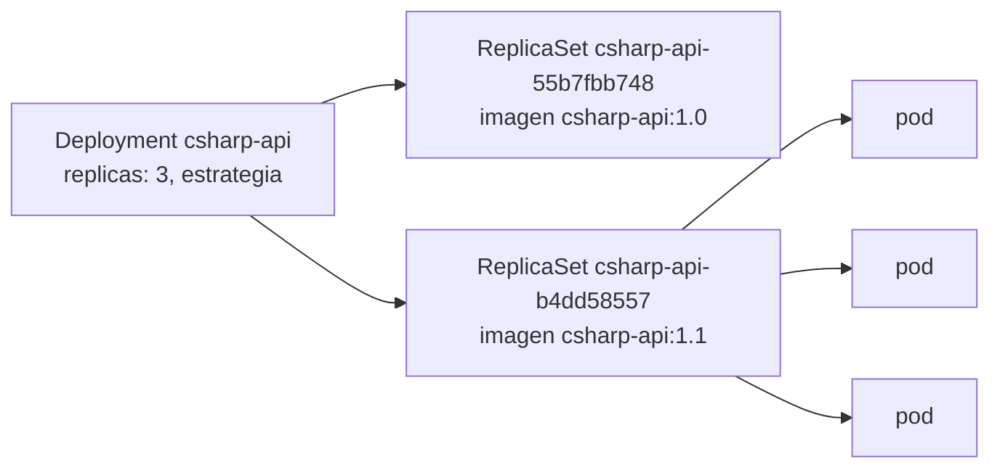

Código completo: [`code/kubernetes/l03`](https://github.com/spareilleux/learn/tree/main/code/kubernetes/l03), con sus comandos en [`l03/run.sh`](https://github.com/spareilleux/learn/blob/main/code/kubernetes/l03/run.sh). Las imágenes vienen de [`images.sh`](https://github.com/spareilleux/learn/blob/main/code/kubernetes/images.sh), como en la [lección 2](../02-pods/#las-imágenes); además etiqueta `csharp-api:1.0` una segunda vez como `csharp-api:1.1`, la «nueva versión» de esta lección.

Un pod por sí solo no se reemplaza cuando desaparece: si su nodo falla o alguien lo borra, ya no está. En la [lección 1](../01-architecture-and-local-cluster/), un **Deployment** volvía a crear los pods borrados. Esta lección muestra cómo: un Deployment no gestiona los pods directamente, sino **ReplicaSets**, uno por versión de la plantilla del pod, y pasa las réplicas de uno a otro cuando la plantilla cambia.



## La API de C# como Deployment

[`l03/csharp-api.yaml`](https://github.com/spareilleux/learn/blob/main/code/kubernetes/l03/csharp-api.yaml) envuelve el pod de la lección 2 en una plantilla, con tres réplicas y una estrategia de actualización:

```yaml
# Lección 3: la API de C# como un Deployment de tres réplicas, actualizado pod a pod sin perder capacidad.
apiVersion: apps/v1
kind: Deployment
metadata:
  name: csharp-api
  labels:
    app: csharp-api
spec:
  replicas: 3
  # ReplicaSets antiguos conservados para kubectl rollout undo
  revisionHistoryLimit: 5
  # Un rollout que no avanza durante 60 s se notifica como fallido (el valor por defecto es 600 s)
  progressDeadlineSeconds: 60
  selector:
    matchLabels:
      app: csharp-api
  strategy:
    type: RollingUpdate
    rollingUpdate:
      # Un pod de más durante la actualización, y nunca menos de 3 listos
      maxSurge: 1
      maxUnavailable: 0
  template:
    metadata:
      labels:
        app: csharp-api
    spec:
      containers:
        - name: api
          image: csharp-api:1.0
          imagePullPolicy: Never
          ports:
            - name: http
              containerPort: 8080
          resources:
            requests:
              cpu: 100m
              memory: 64Mi
            limits:
              memory: 256Mi
          readinessProbe:
            httpGet:
              path: /
              port: http
            periodSeconds: 5
          livenessProbe:
            httpGet:
              path: /
              port: http
            periodSeconds: 10
```

El `selector` dice qué pods pertenecen al Deployment, y debe coincidir con las etiquetas de la plantilla. El puerto del contenedor tiene ahora un nombre, `http`, que usan las sondas, y que también usarán los Services de la lección 4.

```text
> kubectl apply -n l03 -f l03/csharp-api.yaml
deployment.apps/csharp-api created
> kubectl rollout status -n l03 deployment/csharp-api --timeout=180s
Waiting for deployment "csharp-api" rollout to finish: 0 of 3 updated replicas are available...
Waiting for deployment "csharp-api" rollout to finish: 1 of 3 updated replicas are available...
Waiting for deployment "csharp-api" rollout to finish: 2 of 3 updated replicas are available...
deployment "csharp-api" successfully rolled out
```

`kubectl rollout status` espera hasta que cada réplica está actualizada y disponible, y su código de salida dice si el rollout tuvo éxito: es lo que comprueba un script de despliegue o un job de CI. El número de líneas `Waiting` cambia de una ejecución a otra.

```text
> kubectl get -n l03 deployment,rs,pods -l app=csharp-api
NAME                         READY   UP-TO-DATE   AVAILABLE   AGE
deployment.apps/csharp-api   3/3     3            3           2s

NAME                                    DESIRED   CURRENT   READY   AGE
replicaset.apps/csharp-api-55b7fbb748   3         3         3       2s

NAME                              READY   STATUS    RESTARTS   AGE
pod/csharp-api-55b7fbb748-7c9m5   1/1     Running   0          2s
pod/csharp-api-55b7fbb748-lr6hb   1/1     Running   0          2s
pod/csharp-api-55b7fbb748-snz8v   1/1     Running   0          2s
```

Los nombres cuentan la jerarquía. `55b7fbb748` es un hash de la plantilla del pod, calculado por el controlador de Deployment en [`sync.go`](https://github.com/kubernetes/kubernetes/blob/f54c212e3a2f75d674b717a9b29052b20b60aefc/pkg/controller/deployment/sync.go#L196-L207) y añadido al nombre, al selector y a los pods del ReplicaSet como la etiqueta `pod-template-hash`; después, el ReplicaSet añade un sufijo aleatorio a cada pod. Cada objeto registra también su propietario:

```text
> kubectl get -n l03 rs,pods -l app=csharp-api -o custom-columns=KIND:.kind,NAME:.metadata.name,OWNER:.metadata.ownerReferences[0].kind,OWNER-NAME:.metadata.ownerReferences[0].name
KIND         NAME                          OWNER        OWNER-NAME
ReplicaSet   csharp-api-55b7fbb748         Deployment   csharp-api
Pod          csharp-api-55b7fbb748-7c9m5   ReplicaSet   csharp-api-55b7fbb748
Pod          csharp-api-55b7fbb748-lr6hb   ReplicaSet   csharp-api-55b7fbb748
Pod          csharp-api-55b7fbb748-snz8v   ReplicaSet   csharp-api-55b7fbb748
```

Estas `ownerReferences` guían la [recolección de basura](https://kubernetes.io/docs/concepts/architecture/garbage-collection/): borra el Deployment, y sus ReplicaSets y sus pods se borran con él. Nunca editas tú mismo los ReplicaSets de un Deployment; el Deployment desharía tu cambio.

## Una actualización progresiva

Cualquier cambio en la plantilla del pod inicia un rollout: una imagen, una variable de entorno, un recurso, incluso una etiqueta. Los cambios fuera de la plantilla, como `replicas`, no. [`kubectl set image`](https://kubernetes.io/docs/reference/kubectl/generated/kubectl_set/kubectl_set_image/) cambia la imagen directamente en el clúster, y una anotación registra el motivo, para el historial de más abajo:

```text
> kubectl set image -n l03 deployment/csharp-api api=csharp-api:1.1
deployment.apps/csharp-api image updated
> kubectl annotate -n l03 deployment/csharp-api kubernetes.io/change-cause="image csharp-api:1.1"
deployment.apps/csharp-api annotated
> kubectl rollout status -n l03 deployment/csharp-api --timeout=180s
Waiting for deployment "csharp-api" rollout to finish: 1 out of 3 new replicas have been updated...
Waiting for deployment "csharp-api" rollout to finish: 1 out of 3 new replicas have been updated...
Waiting for deployment "csharp-api" rollout to finish: 1 out of 3 new replicas have been updated...
Waiting for deployment "csharp-api" rollout to finish: 2 out of 3 new replicas have been updated...
Waiting for deployment "csharp-api" rollout to finish: 2 out of 3 new replicas have been updated...
Waiting for deployment "csharp-api" rollout to finish: 2 out of 3 new replicas have been updated...
Waiting for deployment "csharp-api" rollout to finish: 2 out of 3 new replicas have been updated...
Waiting for deployment "csharp-api" rollout to finish: 1 old replicas are pending termination...
Waiting for deployment "csharp-api" rollout to finish: 1 old replicas are pending termination...
Waiting for deployment "csharp-api" rollout to finish: 1 old replicas are pending termination...
deployment "csharp-api" successfully rolled out
> kubectl get -n l03 rs -l app=csharp-api
NAME                    DESIRED   CURRENT   READY   AGE
csharp-api-55b7fbb748   0         0         0       6s
csharp-api-b4dd58557    3         3         3       3s
```

`csharp-api:1.1` es la misma imagen que `1.0` con otra etiqueta, pero la plantilla cambió, y con ella su hash: un ReplicaSet nuevo, `b4dd58557`, tiene ahora las tres réplicas, y el antiguo se conserva con cero, para las vueltas atrás. Los eventos del Deployment muestran cada paso:

```text
> kubectl get events -n l03 --field-selector involvedObject.kind=Deployment,involvedObject.name=csharp-api -o custom-columns=REASON:.reason,MESSAGE:.message --sort-by=.metadata.creationTimestamp
REASON              MESSAGE
ScalingReplicaSet   Scaled up replica set csharp-api-55b7fbb748 from 0 to 3
ScalingReplicaSet   Scaled up replica set csharp-api-b4dd58557 from 0 to 1
ScalingReplicaSet   Scaled down replica set csharp-api-55b7fbb748 from 3 to 2
ScalingReplicaSet   Scaled up replica set csharp-api-b4dd58557 from 1 to 2
ScalingReplicaSet   Scaled down replica set csharp-api-55b7fbb748 from 2 to 1
ScalingReplicaSet   Scaled up replica set csharp-api-b4dd58557 from 2 to 3
ScalingReplicaSet   Scaled down replica set csharp-api-55b7fbb748 from 1 to 0
```

La primera línea es la creación inicial; las otras seis son la actualización. Con `maxSurge: 1`, puede haber como mucho 3 + 1 = 4 pods, así que el controlador crea un pod nuevo. Con `maxUnavailable: 0`, al menos 3 deben estar disponibles, así que solo retira un pod antiguo cuando el nuevo está listo. Y otra vez, hasta que el ReplicaSet antiguo queda vacío. El bucle del controlador, en [`rolling.go`](https://github.com/kubernetes/kubernetes/blob/f54c212e3a2f75d674b717a9b29052b20b60aefc/pkg/controller/deployment/rolling.go#L31-L66), hace exactamente eso: escalar hacia arriba si puede, y si no, escalar hacia abajo si puede. El número de pods que añade viene de [`NewRSNewReplicas`](https://github.com/kubernetes/kubernetes/blob/f54c212e3a2f75d674b717a9b29052b20b60aefc/pkg/controller/deployment/util/deployment_util.go#L817-L842).

Los dos ajustes aceptan un número o un porcentaje. Los valores por defecto son 25 % y 25 %: con 3 réplicas, un pod de más (redondeado hacia arriba) y cero no disponibles (redondeado hacia abajo), lo mismo que aquí. La otra [estrategia](https://kubernetes.io/docs/concepts/workloads/controllers/deployment/#strategy), `Recreate`, borra todos los pods antiguos antes de crear los nuevos, para las aplicaciones que no pueden ejecutar dos versiones a la vez.

Este rollout dependía de la sonda de readiness: sin ella, un pod cuenta como disponible en cuanto arranca su contenedor, y los pods antiguos se retiran antes de que los nuevos puedan responder.

:::note[¿set image o apply?]
`kubectl set image` cambió el clúster, no `l03/csharp-api.yaml`, que sigue diciendo `1.0`: el siguiente `kubectl apply` de ese archivo volvería atrás sin que nadie se diera cuenta. Es práctico para una lección, y lo habitual es cambiar la imagen en el archivo, hacer commit y aplicarlo, quizá mediante una herramienta de GitOps (lección 14).
:::

## Una actualización rota

Ahora una imagen que no existe en el nodo:

```text
> kubectl set image -n l03 deployment/csharp-api api=csharp-api:9.9
deployment.apps/csharp-api image updated
> kubectl annotate -n l03 deployment/csharp-api kubernetes.io/change-cause="image csharp-api:9.9, which doesn't exist"
deployment.apps/csharp-api annotated
> kubectl rollout status -n l03 deployment/csharp-api --timeout=180s
Waiting for deployment "csharp-api" rollout to finish: 1 out of 3 new replicas have been updated...
error: deployment "csharp-api" exceeded its progress deadline
> kubectl get -n l03 pods -l app=csharp-api --sort-by=.metadata.creationTimestamp
NAME                          READY   STATUS              RESTARTS   AGE
csharp-api-b4dd58557-ssn94    1/1     Running             0          65s
csharp-api-b4dd58557-8p44v    1/1     Running             0          64s
csharp-api-b4dd58557-bz2dz    1/1     Running             0          63s
csharp-api-796c4fd69c-vc9zb   0/1     ErrImageNeverPull   0          61s
```

Tras 60 segundos sin progreso, `kubectl rollout status` termina con el código 1. El pod nuevo no puede arrancar: `ErrImageNeverPull`, porque `imagePullPolicy: Never` prohíbe buscar la etiqueta que falta en un registro. Con un registro, el mismo error da `ErrImagePull` y luego `ImagePullBackOff`.

Los tres pods de la versión 1.1 siguen en marcha: `maxUnavailable: 0` no retiró ninguno, porque ningún pod nuevo llegó a estar listo. El servicio no se interrumpe, y el Deployment dice las dos cosas a la vez:

```text
> kubectl get -n l03 deployment csharp-api
NAME         READY   UP-TO-DATE   AVAILABLE   AGE
csharp-api   3/3     1            3           68s
> kubectl get -n l03 deployment csharp-api -o jsonpath='{range .status.conditions[*]}{.type}={.status} {.reason}: {.message}{"\n"}{end}'
Available=True MinimumReplicasAvailable: Deployment has minimum availability.
Progressing=False ProgressDeadlineExceeded: ReplicaSet "csharp-api-796c4fd69c" has timed out progressing.
```

`Available=True`: responden suficientes réplicas. `Progressing=False` con el motivo `ProgressDeadlineExceeded`, fijado en [`progress.go`](https://github.com/kubernetes/kubernetes/blob/f54c212e3a2f75d674b717a9b29052b20b60aefc/pkg/controller/deployment/progress.go#L86-L95): la actualización está atascada. Kubernetes no vuelve atrás por sí solo; la condición es una señal para ti, tu pipeline o tus alertas. El Deployment sigue intentando arrancar el pod nuevo.

## Historial y vuelta atrás

Cada ReplicaSet es una **revisión** del Deployment, y `kubernetes.io/change-cause` da su descripción:

```text
> kubectl rollout history -n l03 deployment/csharp-api
deployment.apps/csharp-api 
REVISION  CHANGE-CAUSE
1         <none>
2         image csharp-api:1.1
3         image csharp-api:9.9, which doesn't exist

> kubectl rollout undo -n l03 deployment/csharp-api
Warning: resource deployments/csharp-api was previously managed with 'kubectl apply'. Rolling back will not update the kubectl.kubernetes.io/last-applied-configuration annotation, which may cause unexpected behavior on future 'kubectl apply' operations. Consider using 'kubectl apply' with your previous configuration file instead.
deployment.apps/csharp-api rolled back
> kubectl rollout status -n l03 deployment/csharp-api --timeout=180s | tail -1
deployment "csharp-api" successfully rolled out
> kubectl rollout history -n l03 deployment/csharp-api
deployment.apps/csharp-api 
REVISION  CHANGE-CAUSE
1         <none>
3         image csharp-api:9.9, which doesn't exist
4         image csharp-api:1.1

> kubectl get -n l03 deployment csharp-api -o jsonpath='{.spec.template.spec.containers[0].image}{"\n"}'
csharp-api:1.1
```

[`kubectl rollout undo`](https://kubernetes.io/docs/concepts/workloads/controllers/deployment/#rolling-back-a-deployment) vuelve a copiar en el Deployment la plantilla de la revisión anterior. Esa plantilla coincide con el ReplicaSet de la revisión 2, que se vuelve a escalar hacia arriba y se renumera como 4: un número de revisión no es una versión, es el orden en que se usaron por última vez los ReplicaSets. El pod fallido se retira al escalar su ReplicaSet a cero.

La advertencia de kubectl es el mismo problema que `set image`: `kubectl apply` recuerda en una anotación el último archivo aplicado, y una vuelta atrás no la actualiza. En un equipo, una vuelta atrás suele ser un commit de revert, aplicado como cualquier otro cambio.

`revisionHistoryLimit: 5` conserva cinco ReplicaSets antiguos; los más viejos se borran, y ya no puedes volver a ellos. El valor por defecto es 10.

## La API de Spring Boot

[`l03/java-reactor-api.yaml`](https://github.com/spareilleux/learn/blob/main/code/kubernetes/l03/java-reactor-api.yaml) tiene la misma forma con dos réplicas, requests y limits mayores para la JVM, y las tres sondas de la lección 2:

```yaml
          startupProbe:
            httpGet:
              path: /
              port: http
            periodSeconds: 1
            failureThreshold: 60
          readinessProbe:
            httpGet:
              path: /
              port: http
            periodSeconds: 5
          livenessProbe:
            httpGet:
              path: /
              port: http
            periodSeconds: 10
```

```text
> kubectl apply -n l03 -f l03/java-reactor-api.yaml
deployment.apps/java-reactor-api created
> kubectl rollout status -n l03 deployment/java-reactor-api --timeout=180s | tail -1
deployment "java-reactor-api" successfully rolled out
> kubectl get -n l03 deployment java-reactor-api
NAME               READY   UP-TO-DATE   AVAILABLE   AGE
java-reactor-api   2/2     2            2           3s
```

Su estrategia no está escrita, así que recibe los valores por defecto: `RollingUpdate`, 25 % de surge, 25 % no disponible. Las dos API se ejecutan ahora una junto a otra, cada una tras sus propias etiquetas; la lección 4 les da una dirección estable.

## Puntos clave

- Un Deployment posee ReplicaSets, uno por plantilla de pod, y cada ReplicaSet posee pods idénticos; los sufijos de los nombres son un hash de la plantilla y una cadena aleatoria.
- Cualquier cambio en la plantilla inicia un rollout; `maxSurge` y `maxUnavailable` deciden cuántos pods se crean y se retiran en cada paso, y las sondas de readiness deciden cuándo termina un paso.
- Un rollout fallido se detiene en `progressDeadlineSeconds` con `Progressing=False` y `ProgressDeadlineExceeded`; con `maxUnavailable: 0`, la versión antigua sigue sirviendo, y nada vuelve atrás automáticamente.
- `kubectl rollout status` da un código de salida a un script; `rollout history` lista las revisiones, y `rollout undo` restaura una plantilla anterior con un nuevo número de revisión.
- `kubectl set image` y `rollout undo` cambian el clúster, no tus archivos: mantén los archivos como fuente de verdad.

## Ejercicios

**1.** Vuelve explícitamente a la revisión 1, la `csharp-api:1.0` original. ¿Qué aspecto tiene el historial después?

<details>
<summary>Solución</summary>

```text
> kubectl rollout undo -n l03 deployment/csharp-api --to-revision=1
Warning: resource deployments/csharp-api was previously managed with 'kubectl apply'. Rolling back will not update the kubectl.kubernetes.io/last-applied-configuration annotation, which may cause unexpected behavior on future 'kubectl apply' operations. Consider using 'kubectl apply' with your previous configuration file instead.
deployment.apps/csharp-api rolled back
> kubectl rollout status -n l03 deployment/csharp-api --timeout=180s | tail -1
deployment "csharp-api" successfully rolled out
> kubectl get -n l03 deployment csharp-api -o jsonpath='{.spec.template.spec.containers[0].image}{"\n"}'
csharp-api:1.0
> kubectl rollout history -n l03 deployment/csharp-api
deployment.apps/csharp-api 
REVISION  CHANGE-CAUSE
3         image csharp-api:9.9, which doesn't exist
4         image csharp-api:1.1
5         <none>

```

La revisión 1 pasó a ser la revisión 5, y muestra el motivo de cambio con el que se creó su ReplicaSet: ninguno.

</details>

**2.** Lista los ReplicaSets del Deployment con, para cada uno, su imagen, su número de réplicas y su revisión. ¿Cuántos hay, y por qué `csharp-api:1.1` es uno de ellos si es la misma imagen que `1.0`?

<details>
<summary>Solución</summary>

La revisión es una anotación de cada ReplicaSet, `deployment.kubernetes.io/revision`; en JSONPath, los puntos de su nombre se escapan.

```text
> kubectl get -n l03 rs -l app=csharp-api -o jsonpath='{range .items[*]}{.metadata.name} {.spec.template.spec.containers[0].image} replicas={.spec.replicas} revision={.metadata.annotations.deployment\.kubernetes\.io/revision}{"\n"}{end}'
csharp-api-55b7fbb748 csharp-api:1.0 replicas=3 revision=5
csharp-api-796c4fd69c csharp-api:9.9 replicas=0 revision=3
csharp-api-b4dd58557 csharp-api:1.1 replicas=0 revision=4
```

Tres ReplicaSets, uno por plantilla distinta. El hash se calcula a partir de la plantilla, donde la imagen es solo una cadena: Kubernetes no sabe, ni le importa, que dos etiquetas apunten a la misma imagen. En el otro sentido, subir una imagen nueva con la misma etiqueta no cambia la plantilla, y no inicia ningún rollout.

</details>

**3.** Aplica [`l03/too-big.yaml`](https://github.com/spareilleux/learn/blob/main/code/kubernetes/l03/too-big.yaml), un Deployment cuyo pod pide 100 GiB de memoria. ¿Qué le pasa al pod, y dónde está el motivo?

<details>
<summary>Solución</summary>

```text
> kubectl apply -n l03 -f l03/too-big.yaml
deployment.apps/too-big created
> kubectl get -n l03 pods -l app=too-big
NAME                       READY   STATUS    RESTARTS   AGE
too-big-6b6fb97d68-jkj2t   0/1     Pending   0          0s
> kubectl get events -n l03 --field-selector reason=FailedScheduling -o custom-columns=TYPE:.type,REASON:.reason,MESSAGE:.message --no-headers | sort -u
Warning   FailedScheduling   0/1 nodes are available: 1 Insufficient memory. preemption: 0/1 nodes are available: 1 Preemption is not helpful for scheduling.
```

Se crean el Deployment y su ReplicaSet, y también el pod, pero el scheduler no encuentra ningún nodo con 100 GiB de memoria sin reservar: el pod se queda en `Pending`, sin nodo y sin contenedores. El evento del scheduler dice por qué; `preemption` significa que desalojar pods de menor prioridad tampoco liberaría espacio suficiente (las prioridades llegan en la lección 8). Cuenta la request, no el uso real: el nodo no tiene por qué estar lleno.

</details>

## Fuentes

- Documentación de Kubernetes: [Deployments](https://kubernetes.io/docs/concepts/workloads/controllers/deployment/), [ReplicaSet](https://kubernetes.io/docs/concepts/workloads/controllers/replicaset/), [Garbage collection](https://kubernetes.io/docs/concepts/architecture/garbage-collection/), [`kubectl rollout`](https://kubernetes.io/docs/reference/kubectl/generated/kubectl_rollout/), [`kubectl set image`](https://kubernetes.io/docs/reference/kubectl/generated/kubectl_set/kubectl_set_image/), [Images and pull policy](https://kubernetes.io/docs/concepts/containers/images/#image-pull-policy)
- Código fuente en v1.37.0: [`pkg/controller/deployment/sync.go`](https://github.com/kubernetes/kubernetes/blob/f54c212e3a2f75d674b717a9b29052b20b60aefc/pkg/controller/deployment/sync.go#L196-L207), [`rolling.go`](https://github.com/kubernetes/kubernetes/blob/f54c212e3a2f75d674b717a9b29052b20b60aefc/pkg/controller/deployment/rolling.go#L31-L66), [`util/deployment_util.go`](https://github.com/kubernetes/kubernetes/blob/f54c212e3a2f75d674b717a9b29052b20b60aefc/pkg/controller/deployment/util/deployment_util.go#L817-L842), [`progress.go`](https://github.com/kubernetes/kubernetes/blob/f54c212e3a2f75d674b717a9b29052b20b60aefc/pkg/controller/deployment/progress.go#L86-L95)
