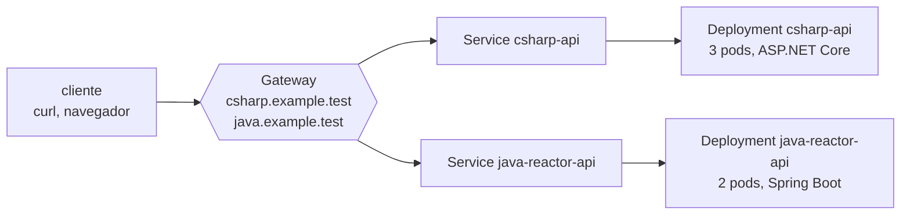

:::note[Versiones estudiadas]
[Kubernetes](https://kubernetes.io/docs/home/) **1.37.0**, la última versión menor a 2026-09-15, publicada el 2026-08-26 y [con soporte hasta el 2027-10-28](https://kubernetes.io/releases/). El clúster local es [kind](https://kind.sigs.k8s.io/) **0.33.0** con su imagen de nodo `kindest/node:v1.37.0`, fijada por digest, y `kubectl` **1.37.0**. La lección 4 añade [cloud-provider-kind](https://github.com/kubernetes-sigs/cloud-provider-kind) **0.11.1** para los balanceadores de carga y la Gateway API. Cada manifiesto y cada comando está en [`code/kubernetes`](https://github.com/spareilleux/learn/tree/main/code/kubernetes): [`check.sh`](https://github.com/spareilleux/learn/blob/main/code/kubernetes/check.sh) ejecuta cada lección contra el clúster y compara sus salidas con [`expected`](https://github.com/spareilleux/learn/tree/main/code/kubernetes/expected), tras sustituir las edades, los nombres generados y las direcciones IP. La CI valida los manifiestos con [kubeconform](https://github.com/yannh/kubeconform) en Windows, Linux y macOS, y ejecuta las lecciones en un clúster kind solo en Linux, porque los runners de Windows y macOS de GitHub no tienen Docker.
:::

## Por qué aprendo esto

Sé construir una imagen y ejecutarla; el [curso de contenedores WSL](../wsl-containers/) termina ahí. Luego alguien dice «despliégalo en el clúster», y copio un archivo YAML de otro servicio, cambio el nombre y cruzo los dedos. Cuando un pod se reinicia en bucle, o un Service no responde nada, pruebo cosas hasta que funciona, sin saber cuál lo arregló.

Quiero saber qué hace Kubernetes con lo que declaro: qué componente actúa sobre ello, en qué orden, y qué significa cada estado y cada evento. Para poder escribir manifiestos a conciencia, desplegar sin interrumpir el servicio, y encontrar lo que falla a partir de las propias respuestas del clúster.

## Para quién es este curso

Eres desarrollador de C# o Java, y ya has construido y ejecutado una imagen de contenedor. No necesitas conocer Kubernetes ni las redes de Linux. Las imágenes vienen de la lección 4 de [Contenedores WSL](../wsl-containers/04-build-an-image/); las lecciones de CI te remiten a [GitHub Actions](../github-actions/), y la lección 13 a [RabbitMQ](../rabbitmq/) por su operador de Kubernetes.

## El ejemplo conductor

Las dos pequeñas API web del curso de contenedores WSL, una minimal API de ASP.NET Core y una API de Spring Boot WebFlux, se ejecutan en un clúster kind de un nodo. Cada lección añade lo que necesita un despliegue real: sondas y recursos, actualizaciones progresivas, una dirección estable, configuración, almacenamiento, seguridad, empaquetado.

[Guitar Alchemist](https://github.com/GuitarAlchemist/ga) funciona con Docker Compose y .NET Aspire, con una línea de trabajo de Kubernetes planificada; la lección 2 compara las sondas de su guía de despliegue con sus imágenes.

## Al terminar este curso, sabré

- explicar qué hacen con un manifiesto el API server, etcd, el scheduler, los controladores y el kubelet;
- ejecutar un clúster local con kind, y usar `kubectl` contra él sin tocar mis otros clústeres;
- escribir pods con las sondas, requests y limits adecuados, y leer sus condiciones y eventos;
- desplegar las API de C# y de Spring con actualizaciones progresivas, y revertir una versión fallida;
- darles una dirección estable dentro y fuera del clúster, con Services, DNS, la Gateway API e Ingress;
- configurarlas, darles almacenamiento, y ejecutar tareas y agentes por nodo;
- controlar dónde se ejecutan los pods, cuántos se ejecutan y qué tienen permitido hacer;
- empaquetar un despliegue con Helm y Kustomize, y entregarlo con GitOps;
- diagnosticar `CrashLoopBackOff`, `ImagePullBackOff`, `Pending` y `OOMKilled` con la información del propio clúster;
- saber qué cambia en AKS, EKS y GKE.

## Plan

| # | Lección | Quizá ya conoces |
|---|---|---|
| 1 | [Arquitectura y un clúster local](01-architecture-and-local-cluster/) | `docker run`, Docker Compose, una política de reinicio |
| 2 | [Pods](02-pods/) | los health checks de ASP.NET Core, Spring Boot Actuator, `docker logs` |
| 3 | [Deployments](03-deployments/) | los despliegues blue/green, las ranuras de despliegue de Azure App Service |
| 4 | [Services y DNS](04-services-and-dns/) | un proxy inverso, YARP, Spring Cloud Gateway, `/etc/hosts` |
| 5 | Configuración: ConfigMaps y Secrets *(próximamente)* | `appsettings.json`, `application.yml`, variables de entorno |
| 6 | Almacenamiento: volúmenes, PersistentVolumes, StatefulSets | los volúmenes de Docker, una base de datos en un contenedor |
| 7 | Jobs, CronJobs y DaemonSets | `BackgroundService`, `@Scheduled`, un servicio de Windows |
| 8 | Planificación: afinidad, taints, topology spread, prioridades, disruption budgets | |
| 9 | Escalado: HPA, metrics-server, VPA, cluster autoscaler | las reglas de escalado horizontal de App Service |
| 10 | Seguridad: RBAC, ServiceAccounts, Pod Security Standards, NetworkPolicies | las políticas de autorización de ASP.NET Core, Spring Security |
| 11 | Empaquetado: Helm y Kustomize | NuGet y Maven, `appsettings.Production.json` |
| 12 | Observabilidad y diagnóstico | OpenTelemetry, `dotnet-counters`, Micrometer |
| 13 | Extender Kubernetes: CRD y operadores | |
| 14 | Entrega continua: GitOps con Argo CD o Flux, CI con GitHub Actions | [GitHub Actions](../github-actions/) |
| 15 | En producción: AKS, EKS, GKE, costes, actualizaciones | Azure, AWS o Google Cloud |

[Diario](journal/): lo que probé, lo que me sorprendió, lo que aún tengo que verificar.

## Recursos

- [Documentación de Kubernetes](https://kubernetes.io/docs/home/), en particular [Concepts](https://kubernetes.io/docs/concepts/), la [referencia de `kubectl`](https://kubernetes.io/docs/reference/kubectl/) y la [referencia de la API](https://kubernetes.io/docs/reference/kubernetes-api/)
- [Documentación de kind](https://kind.sigs.k8s.io/), con sus [problemas conocidos](https://kind.sigs.k8s.io/docs/user/known-issues/)
- [Gateway API](https://gateway-api.sigs.k8s.io/)
- [Notas de las versiones de Kubernetes](https://kubernetes.io/releases/) y el [blog de Kubernetes](https://kubernetes.io/blog/), donde se anuncian los cambios y las obsolescencias de cada versión
- [Documentación de Azure Kubernetes Service](https://learn.microsoft.com/azure/aks/)
- Código fuente: [kubernetes/kubernetes](https://github.com/kubernetes/kubernetes), [kubernetes-sigs/kind](https://github.com/kubernetes-sigs/kind), [kubernetes-sigs/cloud-provider-kind](https://github.com/kubernetes-sigs/cloud-provider-kind)
