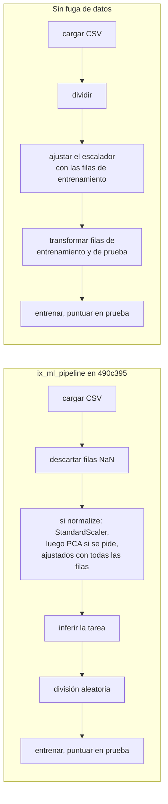

import { Tabs, TabItem } from '@astrojs/starlight/components';

Un modelo de aprendizaje automático es una función que no escribes tú: das ejemplos de entradas y de las respuestas que esperas, y un algoritmo elige la función. Antes de cualquier algoritmo, esta lección responde a dos preguntas que deciden si el resultado significa algo. ¿Qué son exactamente las entradas y las respuestas? ¿Y cómo se mide si la función es buena, en ejemplos que no ha visto?

| | ML.NET | Tribuo | IX |
|---|---|---|---|
| Un ejemplo | una fila de un `IDataView` | un `Example<T>` | una fila de un `Array2<f64>` |
| Las características | una columna `Features` de tipo vector | las características del `Example` | las columnas de la matriz |
| La etiqueta | una columna `Label` | la salida `T`: `Label`, `Regressor` | un `Array1<f64>` (regresión) o `Array1<usize>` (clases 0, 1, 2…) |
| División | [`TrainTestSplit`](https://learn.microsoft.com/dotnet/api/microsoft.ml.dataoperationscatalog.traintestsplit) | [`TrainTestSplitter`](https://tribuo.org/learn/4.3/javadoc/org/tribuo/evaluation/TrainTestSplitter.html) | `train_test_split` |
| Puntuaciones | [`RegressionMetrics`](https://learn.microsoft.com/dotnet/api/microsoft.ml.data.regressionmetrics), [`MulticlassClassificationMetrics`](https://learn.microsoft.com/dotnet/api/microsoft.ml.data.multiclassclassificationmetrics) | [`RegressionEvaluation`](https://tribuo.org/learn/4.3/javadoc/org/tribuo/regression/evaluation/RegressionEvaluation.html), [`LabelEvaluation`](https://tribuo.org/learn/4.3/javadoc/org/tribuo/classification/evaluation/LabelEvaluation.html) | funciones de `ix_supervised::metrics` |

## Ejecutar el código

El código del curso es un proyecto Cargo en `code/machine-learning-ix`, con un ejemplo por lección y uno por cada serie de soluciones de ejercicios. Necesitas [Rust](https://www.rust-lang.org/tools/install); el primer build descarga IX de GitHub y lo compila. La comprobación cruzada necesita [Python](https://www.python.org/downloads/) con numpy y scikit-learn.

<Tabs syncKey="os">
<TabItem label="Windows">

```powershell
cd code\machine-learning-ix
cargo run --release --example l01_evaluation
pip install numpy==2.4.2 scikit-learn==1.8.0
python crosscheck\crosscheck.py
```

</TabItem>
<TabItem label="Linux / WSL">

```bash
cd code/machine-learning-ix
cargo run --release --example l01_evaluation
python3 -m pip install numpy==2.4.2 scikit-learn==1.8.0
python3 crosscheck/crosscheck.py
```

</TabItem>
<TabItem label="macOS">

```bash
cd code/machine-learning-ix
cargo run --release --example l01_evaluation
python3 -m pip install numpy==2.4.2 scikit-learn==1.8.0
python3 crosscheck/crosscheck.py
```

</TabItem>
</Tabs>

`bash check.sh` ejecuta lo mismo que el CI: formato, [clippy](https://doc.rust-lang.org/clippy/), las pruebas unitarias y luego cada ejemplo, comparado con `expected/`.

## Características y etiquetas

Un conjunto de datos para aprendizaje supervisado son dos cosas: una matriz **X** con una fila por ejemplo y una columna por **característica** (*feature*), y un vector **y** con una **etiqueta** por fila. En IX ambos son arrays de [ndarray](https://docs.rs/ndarray/0.17/ndarray/), así que el curso carga sus archivos CSV con el crate [csv](https://docs.rs/csv/latest/csv/) en los mismos tipos ([`src/data.rs`, líneas 35-46](https://github.com/spareilleux/learn/blob/15cde43/code/machine-learning-ix/src/data.rs#L35-L46)):

```rust
pub fn load_builds(path: impl AsRef<Path>) -> Builds {
    let (_, rows) = records(path.as_ref());
    let n = rows.len();
    let pages = Array2::from_shape_fn((n, 1), |(i, _)| rows[i][2].parse().unwrap());
    let seconds = rows.iter().map(|r| r[3].parse().unwrap()).collect();
    // …
}
```

`pages` es una matriz de una columna, no un vector: todos los modelos de IX toman un `Array2`, incluso con una sola característica.

El primer conjunto de datos plantea una pregunta de regresión: ¿cuántos segundos tarda el build de este sitio, dado el número de páginas? Las primeras filas de `builds.csv`, y la primera salida de [`examples/l01_evaluation.rs`](https://github.com/spareilleux/learn/blob/15cde43/code/machine-learning-ix/examples/l01_evaluation.rs):

```text
created_at,sha,pages,build_seconds
2026-09-13T15:53:16Z,eda2608,18,10
2026-09-13T16:05:01Z,f43ba7e,110,12
```

```text
== builds.csv
x: [65, 1] [18.0, 110.0, 122.0], y: 65
y mean 18.846, std 5.424 (hand)
y mean 18.846, std 5.424 (ix_math::stats)
```

Ambas desviaciones estándar dividen por `n`, no por `n - 1`: [`ix_math::stats::std_dev`](https://github.com/GuitarAlchemist/ix/blob/490c39533627d296bf9f8f050e6fafc14d7a20c2/crates/ix-math/src/stats.rs#L15-L40) es la poblacional, como la de numpy por defecto; `sample_variance`, a su lado, divide por `n - 1`.

### Dónde lee IX sus datos

El lector CSV propio de IX, [`ix_io::csv_io::read_csv`](https://github.com/GuitarAlchemist/ix/blob/490c39533627d296bf9f8f050e6fafc14d7a20c2/crates/ix-io/src/csv_io.rs#L12-L38), interpreta cada campo como un `f64`, y un campo que no es un número se convierte en `NaN`, sin error. [`DataBatch::to_array2`](https://github.com/GuitarAlchemist/ix/blob/490c39533627d296bf9f8f050e6fafc14d7a20c2/crates/ix-io/src/protocol.rs#L95-L106) apila después las filas en la matriz. Leído con él, `builds.csv` tendría una columna de fechas `NaN` y una columna de hashes de commit `NaN`. El pipeline de ML detrás de la herramienta `ix_ml_pipeline` descarta por defecto cada fila que contiene un `NaN`, así que con un archivo así descartaría todas las filas y se detendría con `All rows contain NaN values` (según la lectura de [`ml_pipeline.rs`, líneas 167-188](https://github.com/GuitarAlchemist/ix/blob/490c39533627d296bf9f8f050e6fafc14d7a20c2/crates/ix-agent/src/ml_pipeline.rs#L167-L188); *por verificar* ejecutando la herramienta). Deja solo columnas numéricas en un archivo que le pases a IX.

## Entrenamiento y prueba

Un modelo se juzga con filas de las que no aprendió: si no, un modelo que memoriza las respuestas obtendría una puntuación perfecta. Así que las filas se dividen en dos: un **conjunto de entrenamiento** para ajustar el modelo y un **conjunto de prueba** para puntuarlo, usado una sola vez, al final.

Cómo dividir depende de la pregunta. Los builds están en orden temporal, y la pregunta trata del próximo build: la división honesta entrena con el pasado y prueba con el 20 % más reciente ([`src/evaluation.rs`, líneas 5-10](https://github.com/spareilleux/learn/blob/15cde43/code/machine-learning-ix/src/evaluation.rs#L5-L10)). [`ix_math::preprocessing::train_test_split`](https://github.com/GuitarAlchemist/ix/blob/490c39533627d296bf9f8f050e6fafc14d7a20c2/crates/ix-math/src/preprocessing.rs#L157-L200) primero baraja las filas, como `TrainTestSplit` de ML.NET y [`train_test_split`](https://scikit-learn.org/stable/modules/generated/sklearn.model_selection.train_test_split.html) de scikit-learn:

```text
== split
chronological: train 52, test 13, test pages 274..289
ix train_test_split: train 52, test 13, test pages [138, 253, 253, 130, 280, 241, 271, 130, 138, 138, 289, 274, 138]
```

El conjunto de prueba aleatorio mezcla builds del primer día con builds de la última hora: se le preguntaría al modelo por el pasado, con el futuro en su conjunto de entrenamiento. Para series temporales, scikit-learn tiene [`TimeSeriesSplit`](https://scikit-learn.org/stable/modules/generated/sklearn.model_selection.TimeSeriesSplit.html); `train_test_split` de IX siempre baraja.

## Una línea base y cuatro métricas de regresión

Antes de cualquier modelo, una **línea base** (*baseline*): la predicción más simple, que no usa ninguna característica. Para un número, es la media de las etiquetas de entrenamiento, 17.385 segundos, para cada build de prueba. Un modelo que no la supera no ha aprendido nada.

Con `yᵢ` los valores reales, `pᵢ` las predicciones e `ȳ` la media de los valores reales:

| Métrica | Fórmula | Unidad | Se lee como |
|---|---|---|---|
| MSE, error cuadrático medio | `1/n Σ (yᵢ - pᵢ)²` | segundos² | castiga sobre todo los errores grandes |
| RMSE | `√MSE` | segundos | un error típico, ponderado hacia los grandes |
| MAE, error absoluto medio | `1/n Σ abs(yᵢ - pᵢ)` | segundos | el error medio |
| R², coeficiente de determinación | `1 - Σ (yᵢ - pᵢ)² / Σ (yᵢ - ȳ)²` | ninguna | 1 es perfecto, 0 equivale a predecir `ȳ` |

Escritas a mano en [`src/evaluation.rs`, líneas 47-61](https://github.com/spareilleux/learn/blob/15cde43/code/machine-learning-ix/src/evaluation.rs#L47-L61), y en IX en [`metrics.rs`, líneas 48-87](https://github.com/GuitarAlchemist/ix/blob/490c39533627d296bf9f8f050e6fafc14d7a20c2/crates/ix-supervised/src/metrics.rs#L48-L87):

```text
== baseline on the chronological test set: always 17.385 s
hand: mse 107.000, rmse 10.344, mae 7.308, r2 -0.996
ix:   mse 107.000, rmse 10.344, mae 7.308, r2 -0.996
```

R² es negativo: la `ȳ` de su fórmula es la media de las etiquetas de **prueba**, 24.69 segundos, y la línea base predice la media de entrenamiento. Los builds se volvieron más lentos a medida que crecía el sitio, así que la media del pasado es peor apuesta que la media de los propios builds de prueba, que ningún modelo puede conocer de antemano. [`r2_score`](https://scikit-learn.org/stable/modules/model_evaluation.html) de scikit-learn da el mismo −0.996 en la comprobación cruzada.

## Escalar, y el conjunto de prueba que se filtra

Muchos algoritmos comparan las características entre sí, o dan pasos del mismo tamaño en todas las direcciones: una característica medida en cientos (páginas) pesa entonces más que una medida en unidades (segundos). **Estandarizar** expresa cada característica en desviaciones estándar respecto a su media: `z = (x - μ) / σ`.

`μ` y `σ` se aprenden de los datos, como los parámetros de un modelo, así que deben venir solo de las filas de entrenamiento y aplicarse sin cambios a las filas de prueba. [`StandardScaler::fit` y `transform`](https://github.com/GuitarAlchemist/ix/blob/490c39533627d296bf9f8f050e6fafc14d7a20c2/crates/ix-math/src/preprocessing.rs#L25-L54) están separados por esa razón, igual que el estimador [`NormalizeMeanVariance`](https://learn.microsoft.com/dotnet/api/microsoft.ml.normalizationcatalog.normalizemeanvariance) de ML.NET y su transformador, y `fit` y `transform` de [`NormalizerStandardize`](https://javadoc.io/doc/org.nd4j/nd4j-api/latest/org/nd4j/linalg/dataset/api/preprocessor/NormalizerStandardize.html) en Deeplearning4j:

```text
== scaling pages
hand, train rows: mean 184.038, std 62.476
ix,   train rows: mean 184.038, std 62.476
ix,   all rows:   mean 203.277, std 67.883
first test row scaled: 1.440 (train statistics), 1.042 (all rows)
```

Ajustado con todas las filas, el escalador ha visto el conjunto de prueba: el primer build de prueba, 274 páginas, queda a 1.042 desviaciones estándar por encima de la media en lugar de 1.440. El modelo se probaría con datos moldeados por el propio conjunto de prueba: eso es una **fuga de datos** (*leakage*), y hace que las puntuaciones parezcan mejores de lo que serán con datos nuevos ([scikit-learn, errores comunes](https://scikit-learn.org/stable/common_pitfalls.html)).

El pipeline de ML de IX, el código detrás de la herramienta MCP `ix_ml_pipeline`, lo hace en el orden equivocado cuando `normalize` está activado (está desactivado por defecto). [`run_pipeline`](https://github.com/GuitarAlchemist/ix/blob/490c39533627d296bf9f8f050e6fafc14d7a20c2/crates/ix-agent/src/ml_pipeline.rs#L190-L203) ajusta el escalador y el PCA sobre la matriz completa, y solo después [`run_classification`](https://github.com/GuitarAlchemist/ix/blob/490c39533627d296bf9f8f050e6fafc14d7a20c2/crates/ix-agent/src/ml_pipeline.rs#L537-L538) y `run_regression` ([líneas 704-705](https://github.com/GuitarAlchemist/ix/blob/490c39533627d296bf9f8f050e6fafc14d7a20c2/crates/ix-agent/src/ml_pipeline.rs#L704-L705)) dividen las filas:



El efecto sobre una puntuación depende de los datos; el mecanismo es el que se imprime arriba. Leí este orden en el código pero no he ejecutado la herramienta (*por verificar*).

## ¿Es regresión o clasificación?

El mismo pipeline adivina la tarea cuando no se le indica, con [`infer_task_type`](https://github.com/GuitarAlchemist/ix/blob/490c39533627d296bf9f8f050e6fafc14d7a20c2/crates/ix-math/src/preprocessing.rs#L234-L254): si cada etiqueta es un entero no negativo y hay como mucho 20 valores distintos (el umbral que [pasa `run_pipeline`](https://github.com/GuitarAlchemist/ix/blob/490c39533627d296bf9f8f050e6fafc14d7a20c2/crates/ix-agent/src/ml_pipeline.rs#L208-L221)), es clasificación. Los tiempos de build son segundos enteros:

```text
== infer_task_type: 18 distinct values -> MulticlassClassification { n_classes: 18 }
same seconds with 0.5 added to one row -> true
```

Si se le pide predecir los segundos de build, el pipeline entrenaría un clasificador con 18 clases, en el que 23 segundos es tan distinto de 24 como de 48. Sumar medio segundo a una fila lo vuelve a convertir en regresión. Las etiquetas enteras son habituales en regresión (conteos, precios en céntimos, duraciones), así que indica la tarea explícitamente.

## Métricas de clasificación

El segundo conjunto de datos plantea una pregunta de clasificación: ¿qué sistema operativo ejecutó un job de CI, a partir de los tiempos de sus pasos? 121 de los 186 jobs se ejecutaron en Ubuntu, 34 en Windows y 31 en macOS. La línea base es la clase más frecuente: responder siempre `ubuntu`.

```text
== jobs.csv: [186, 5] ["queue_s", "setup_s", "checkout_s", "post_checkout_s", "complete_s"], classes ["ubuntu", "windows", "macos"] = [121, 34, 31]
confusion matrix (rows = true class, columns = predicted):
[[121, 0, 0],
 [34, 0, 0],
 [31, 0, 0]]
accuracy 0.651 (hand), 0.651 (ix)
```

La **exactitud** (*accuracy*), la proporción de respuestas correctas, es del 65 % para un modelo que nunca mira un job. Con clases desequilibradas, la exactitud sola oculta si las clases raras se encuentran alguna vez. La **matriz de confusión** lo muestra: `m[t][p]` cuenta las filas de clase real `t` predichas como `p`. Para una clase `c`:

- **precisión** = `m[c][c] / Σₜ m[t][c]`: de los jobs predichos como `c`, la proporción que realmente son `c`;
- **exhaustividad** (*recall*) = `m[c][c] / Σₚ m[c][p]`: de los jobs que son `c`, la proporción predicha como `c`;
- **F1** = `2 · precision · recall / (precision + recall)`: alta solo cuando ambas lo son.

El promedio **macro** toma la media sobre las clases, así que cada clase cuenta lo mismo, sea cual sea su tamaño ([`src/evaluation.rs`, líneas 78-90](https://github.com/spareilleux/learn/blob/15cde43/code/machine-learning-ix/src/evaluation.rs#L78-L90); IX [`metrics.rs`, líneas 91-148](https://github.com/GuitarAlchemist/ix/blob/490c39533627d296bf9f8f050e6fafc14d7a20c2/crates/ix-supervised/src/metrics.rs#L91-L148)):

```text
ubuntu   precision 0.651 recall 1.000 f1 0.788 | ix 0.651 1.000 0.788
windows  precision 0.000 recall 0.000 f1 0.000 | ix 0.000 0.000 0.000
macos    precision 0.000 recall 0.000 f1 0.000 | ix 0.000 0.000 0.000
macro f1 0.263 (hand), 0.263 (ix f1_avg)
Confusion Matrix:
pred →	0	1	2
true 0:	121	0	0
true 1:	34	0	0
true 2:	31	0	0
```

Un F1 macro de 0.263 dice lo que la exactitud ocultaba. Una precisión sin nada predicho es 0/0: IX y la versión a mano devuelven 0, como scikit-learn por defecto, con una advertencia. [`MacroAccuracy`](https://learn.microsoft.com/dotnet/api/microsoft.ml.data.multiclassclassificationmetrics) de ML.NET es la misma idea: la exactitud de cada clase, promediada sobre las clases.

## Puntos clave

- Las características son una matriz y las etiquetas un vector; los modelos de IX toman `Array2<f64>` incluso para una sola característica, y el lector CSV de IX convierte el texto en `NaN` en silencio.
- Divide antes de aprender nada de los datos, incluido el escalador; divide por tiempo cuando la pregunta trata del futuro.
- Compara cada modelo con una línea base. El R² en un conjunto de prueba puede ser negativo.
- Con clases desequilibradas, lee la matriz de confusión y las puntuaciones por clase o macro, no solo la exactitud.
- El pipeline de ML de IX, cuando se le pide normalizar, ajusta su escalador antes de dividir; además considera clasificación las etiquetas enteras con pocos valores: indica la tarea, y no te fíes de sus puntuaciones de prueba sin comprobar el orden.

## Ejercicios

Las soluciones están en [`examples/l01_exercises.rs`](https://github.com/spareilleux/learn/blob/15cde43/code/machine-learning-ix/examples/l01_exercises.rs), y su salida en `expected/l01_exercises.txt`: el CI las comprueba con el resto.

1. Una línea base mejor para una serie temporal: predice cada build de prueba con los segundos del build inmediatamente anterior. Puntúala con el MAE, el RMSE y el R² de IX, junto a la media de entrenamiento.

<details>
<summary>Solución</summary>

[Líneas 12-27](https://github.com/spareilleux/learn/blob/15cde43/code/machine-learning-ix/examples/l01_exercises.rs#L12-L27):

```rust
let previous: Array1<f64> = test.iter().map(|&i| y[i - 1]).collect();
let mean = Array1::from_elem(test.len(), hand::mean(&pick(y, &train)));
for (name, p) in [("previous build", &previous), ("training mean", &mean)] {
    println!(
        "{name:14}: mae {:.3}, rmse {:.3}, r2 {:.3}",
        metrics::mae(&y_test, p),
        metrics::rmse(&y_test, p),
        metrics::r_squared(&y_test, p)
    );
}
```

```text
== exercise 1
previous build: mae 4.923, rmse 8.485, r2 -0.343
training mean : mae 7.308, rmse 10.344, r2 -0.996
```

El build anterior es mejor línea base en todas las métricas: sigue la tendencia. El R² sigue siendo negativo, porque el último build tardó 48 segundos, más del doble de los 21 segundos del anterior.

</details>

2. ¿Cuántos jobs de macOS caen en un conjunto de prueba aleatorio del 20 %? Cuéntalos para `train_test_split` con las semillas 0 a 9, y luego cuéntalos en cada fold de prueba de `StratifiedKFold` de IX con 5 folds.

<details>
<summary>Solución</summary>

[Líneas 29-45](https://github.com/spareilleux/learn/blob/15cde43/code/machine-learning-ix/examples/l01_exercises.rs#L29-L45):

```rust
let per_seed: Vec<usize> = (0..10)
    .map(|seed| {
        let split = train_test_split(&jobs.features, &labels, 0.2, seed).unwrap();
        split.y_test.iter().filter(|&&c| c == 2.0).count()
    })
    .collect();
let folds = StratifiedKFold::new(5).split(&jobs.os);
```

```text
== exercise 2
macos jobs in the 37 test rows of train_test_split, seeds 0 to 9: [6, 7, 6, 5, 7, 4, 7, 1, 7, 5]
StratifiedKFold(5), (test rows, macos jobs) per fold: [(39, 7), (37, 6), (37, 6), (37, 6), (36, 6)]
```

31 jobs de macOS de 186 son el 17 %, unos 6 de cada 37 filas. Una división aleatoria da cualquier cosa entre 1 y 7: con la semilla 7, el conjunto de prueba tiene un solo job de macOS, y una exhaustividad para macOS sería 0 o 1. Una división **estratificada** mantiene la proporción de cada clase en cada fold: [`StratifiedKFold::split`](https://github.com/GuitarAlchemist/ix/blob/490c39533627d296bf9f8f050e6fafc14d7a20c2/crates/ix-supervised/src/validation.rs#L169-L211) baraja las filas de cada clase y las reparte entre los folds por turnos. `train_test_split` toma `labels` como `f64`, el tipo de la regresión, y no tiene opción estratificada.

</details>

## Fuentes

- [scikit-learn: evaluación de modelos](https://scikit-learn.org/stable/modules/model_evaluation.html) y [errores comunes](https://scikit-learn.org/stable/common_pitfalls.html)
- [ML.NET: métricas de evaluación](https://learn.microsoft.com/dotnet/machine-learning/resources/metrics)
- James, Witten, Hastie, Tibshirani, Taylor, *[An Introduction to Statistical Learning](https://www.statlearning.com/)*, capítulos 2 y 5
- IX en `490c395`: [`ix-math/src/preprocessing.rs`](https://github.com/GuitarAlchemist/ix/blob/490c39533627d296bf9f8f050e6fafc14d7a20c2/crates/ix-math/src/preprocessing.rs), [`ix-supervised/src/metrics.rs`](https://github.com/GuitarAlchemist/ix/blob/490c39533627d296bf9f8f050e6fafc14d7a20c2/crates/ix-supervised/src/metrics.rs), [`ix-agent/src/ml_pipeline.rs`](https://github.com/GuitarAlchemist/ix/blob/490c39533627d296bf9f8f050e6fafc14d7a20c2/crates/ix-agent/src/ml_pipeline.rs)
