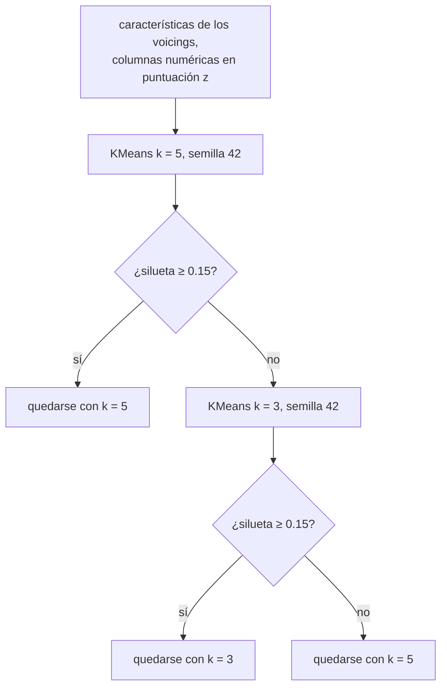

Las lecciones 2 y 3 aprendieron de respuestas: los segundos de build, el sistema operativo de cada job. El **agrupamiento** (*clustering*) no tiene respuestas. Busca grupos de filas cercanas entre sí y alejadas del resto, y te toca a ti decir si los grupos significan algo. Esta lección oculta el sistema operativo de los 186 jobs, agrupa sus cinco tiempos, y solo después mira el sistema operativo: una comprobación que rara vez tienes con datos reales.

IX usa el agrupamiento sobre sus propios datos: el crate `ix-voicings` agrupa los voicings de guitarra que enumera [GA](https://github.com/GuitarAlchemist/ga), con k-means y una regla para elegir el número de grupos. Esta lección aplica esa regla a los jobs.

| | ML.NET | Tribuo | scikit-learn | IX |
|---|---|---|---|---|
| k-means | [`KMeansTrainer`](https://learn.microsoft.com/dotnet/api/microsoft.ml.trainers.kmeanstrainer) | [`KMeansTrainer`](https://tribuo.org/learn/4.3/javadoc/org/tribuo/clustering/kmeans/KMeansTrainer.html) | [`KMeans`](https://scikit-learn.org/stable/modules/generated/sklearn.cluster.KMeans.html) | `ix_unsupervised::kmeans::KMeans` |
| Densidad | — | [`HdbscanTrainer`](https://tribuo.org/learn/4.3/javadoc/org/tribuo/clustering/hdbscan/HdbscanTrainer.html) | [`DBSCAN`](https://scikit-learn.org/stable/modules/generated/sklearn.cluster.DBSCAN.html) | `ix_unsupervised::dbscan::DBSCAN` |
| Mezcla gaussiana | — | — | [`GaussianMixture`](https://scikit-learn.org/stable/modules/generated/sklearn.mixture.GaussianMixture.html) | `ix_unsupervised::gmm::GMM` |
| Silueta | — | — | [`silhouette_score`](https://scikit-learn.org/stable/modules/generated/sklearn.metrics.silhouette_score.html) | `ix_voicings::silhouette_score` |

En IX, los tres algoritmos implementan [`Clusterer`](https://github.com/GuitarAlchemist/ix/blob/490c39533627d296bf9f8f050e6fafc14d7a20c2/crates/ix-unsupervised/src/traits.rs#L5-L13): `fit`, `predict` y `fit_predict`, que devuelve un índice de cluster por fila. El tutorial de IX los importa con `use ix_unsupervised::{KMeans, Clusterer};` ([`docs/unsupervised-learning/kmeans.md`, línea 60](https://github.com/GuitarAlchemist/ix/blob/490c39533627d296bf9f8f050e6fafc14d7a20c2/docs/unsupervised-learning/kmeans.md?plain=1#L60)), lo que no compila: el crate exporta sus módulos, no los tipos que contienen ([`lib.rs`](https://github.com/GuitarAlchemist/ix/blob/490c39533627d296bf9f8f050e6fafc14d7a20c2/crates/ix-unsupervised/src/lib.rs#L5-L14)). Las rutas que funcionan son `ix_unsupervised::kmeans::KMeans` e `ix_unsupervised::traits::Clusterer`; el curso conserva ambas como doctests, la que falla como `compile_fail` ([`src/lib.rs`, líneas 4-20](https://github.com/spareilleux/learn/blob/15cde43/code/machine-learning-ix/src/lib.rs#L4-L20)).

El programa es [`examples/l04_clustering.rs`](https://github.com/spareilleux/learn/blob/15cde43/code/machine-learning-ix/examples/l04_clustering.rs). Los clusters están hechos de distancias, así que primero estandariza los cinco tiempos, con todas las filas: en el agrupamiento no hay conjunto de prueba.

## k-means

k-means busca `k` centros, los **centroides**, y pone cada fila en el cluster de su centroide más cercano. Los mejores centroides son los que minimizan la **inercia**, la suma de las distancias al cuadrado de cada fila a su centroide:

```text
inertia = Σᵢ ‖xᵢ - μ(cᵢ)‖²
```

Encontrar el verdadero mínimo es difícil, así que el **algoritmo de Lloyd** alterna dos pasos que bajan cada uno la inercia, hasta que nada cambia:

1. asignar cada fila a su centroide más cercano;
2. mover cada centroide a la media de sus filas.

[`src/cluster.rs`, líneas 20-56](https://github.com/spareilleux/learn/blob/15cde43/code/machine-learning-ix/src/cluster.rs#L20-L56):

```rust
pub fn lloyd_step(x: &Array2<f64>, centroids: &Array2<f64>) -> (Array1<usize>, Array2<f64>) {
    let labels: Array1<usize> = x
        .rows()
        .into_iter()
        .map(|r| nearest(r, centroids))
        .collect();
    let mut moved = centroids.clone();
    for c in 0..centroids.nrows() {
        let members: Vec<usize> = (0..x.nrows()).filter(|&i| labels[i] == c).collect();
        if !members.is_empty() {
            let sum = members
                .iter()
                .fold(Array1::<f64>::zeros(x.ncols()), |acc, &i| acc + x.row(i));
            moved.row_mut(c).assign(&(sum / members.len() as f64));
        }
    }
    (labels, moved)
}
```

Dónde termina depende de dónde empieza. [`KMeans::fit`](https://github.com/GuitarAlchemist/ix/blob/490c39533627d296bf9f8f050e6fafc14d7a20c2/crates/ix-unsupervised/src/kmeans.rs#L126-L164) empieza con **k-means++** ([líneas 86-119](https://github.com/GuitarAlchemist/ix/blob/490c39533627d296bf9f8f050e6fafc14d7a20c2/crates/ix-unsupervised/src/kmeans.rs#L86-L119)): el primer centroide es una fila al azar, y cada uno de los siguientes es una fila extraída con una probabilidad proporcional a su distancia al cuadrado al centroide más cercano ya elegido, de modo que los centroides iniciales quedan repartidos. Luego ejecuta pasos de Lloyd hasta que los centroides se mueven menos de `1e-10` en distancia al cuadrado total. Para comparar, el programa arranca la versión a mano desde los centroides finales de IX: si IX se detuvo en un verdadero punto fijo, un paso no cambia nada.

```text
== k-means, k = 3
ix centroid 0: [-0.318, 0.167, -0.503, -0.472, -0.281]
ix centroid 1: [2.302, -0.162, 0.031, -0.003, 1.668]
ix centroid 2: [-0.352, -0.526, 1.888, 1.791, -0.063]
ix inertia 411.2367, hand inertia 411.2367
hand Lloyd steps from ix centroids until nothing moves: 1, same labels: true
clusters (rows) against OS (columns ["ubuntu", "windows", "macos"]):
[[120, 0, 9],
 [1, 0, 22],
 [0, 34, 0]]
```

En desviaciones estándar: el cluster 1 espera mucho en la cola (+2.3) y termina despacio (+1.7); el cluster 2 tiene checkouts largos (+1.9, +1.8). Al revelarlo, el sistema operativo encaja: el cluster 2 son los 34 jobs de Windows, el cluster 1 son 22 de los 31 jobs de macOS, el cluster 0 es Ubuntu con 9 jobs de macOS. Los tiempos llevan consigo el sistema operativo aunque nadie lo pida.

### Otro inicio, otra respuesta

```text
hand, starting from the first 3 rows: 5 steps, inertia 531.9563
ix, seeds 0 to 9: inertia [411.3595, 411.2367, 411.9568, 618.0229, 489.7771, 411.2367, 526.3602, 411.3595, 411.2367, 411.2322]
```

Los pasos de Lloyd solo van cuesta abajo, hasta el mínimo **local** más cercano. Diez semillas dan siete respuestas distintas, de 411.23 a 618.02; la semilla 42 resulta ser una de las buenas, y la semilla 9 es algo mejor. `n_init` de scikit-learn ejecuta varios inicios y se queda con la inercia más baja (la comprobación cruzada usa 50). IX ejecuta un inicio por `fit`, y su herramienta MCP `ix_kmeans` [siempre usa la semilla 42](https://github.com/GuitarAlchemist/ix/blob/490c39533627d296bf9f8f050e6fafc14d7a20c2/crates/ix-agent/src/handlers.rs#L301-L343): para obtener un buen k-means de IX, recorre tú mismo varias semillas y quédate con la inercia más baja.

## Elegir k

La inercia siempre baja cuando `k` crece: con un cluster por fila, vale 0. Así que la inercia no puede elegir `k`. La **silueta** sí puede. Para cada fila `i`, con `a` su distancia media a las demás filas de su cluster, y `b` su distancia media a las filas del cluster más cercano distinto del suyo:

```text
s(i) = (b - a) / max(a, b)
```

`s` está cerca de 1 cuando la fila está mucho más cerca de su propio cluster, cerca de 0 en una frontera, y es negativa en el cluster equivocado. El coeficiente de silueta es la media de `s` sobre todas las filas. Una fila sola en su cluster no tiene `a`; la [definición de Rousseeuw](https://doi.org/10.1016/0377-0427(87)90125-7) pone su `s` a 0 ([`src/cluster.rs`, líneas 106-133](https://github.com/spareilleux/learn/blob/15cde43/code/machine-learning-ix/src/cluster.rs#L106-L133)).

```text
== choosing k (ix KMeans, seed 42)
k 2: inertia  713.392, silhouette hand 0.4014, ix_voicings 0.4014
k 3: inertia  411.237, silhouette hand 0.4997, ix_voicings 0.4997
k 4: inertia  301.641, silhouette hand 0.4158, ix_voicings 0.4158
k 5: inertia  240.527, silhouette hand 0.4350, ix_voicings 0.4350
k 6: inertia  223.366, silhouette hand 0.3646, ix_voicings 0.3646
ix-voicings rule: silhouette(k = 5) = 0.4350 -> keep k = 5
```

La silueta alcanza su máximo en `k = 3`, el número de sistemas operativos. scikit-learn, quedándose con el mejor de 50 inicios, coincide para `k = 3` y `k = 4`, pero encuentra mejores agrupamientos que el inicio único de IX para los demás: inercia 631.311 para `k = 2`, 240.416 para `k = 5`, y 214.040 para `k = 6`, cuya silueta sube a 0.4400. Un inicio único no solo da una inercia peor: puede cambiar qué `k` parece el mejor.

### La regla de ix-voicings

[`ix_voicings::cluster`](https://github.com/GuitarAlchemist/ix/blob/490c39533627d296bf9f8f050e6fafc14d7a20c2/crates/ix-voicings/src/lib.rs#L714-L786) lee las características de los voicings de un instrumento (extensión de trastes, trastes usados, nota más grave y más aguda, calidad del acorde…), normalizadas a puntuación z por `featurize`, y las agrupa:



Es un umbral, no una comparación: `k = 5` se conserva en cuanto su silueta alcanza 0.15 ([líneas 718-719 y 770-776](https://github.com/GuitarAlchemist/ix/blob/490c39533627d296bf9f8f050e6fafc14d7a20c2/crates/ix-voicings/src/lib.rs#L770-L776)), aunque `k = 3` puntuaría más alto, como ocurre con los jobs (0.4997 frente a 0.4350). Cada candidato recibe un solo inicio, semilla 42. Por encima de 10,000 filas, la puntuación se calcula sobre una muestra de 5,000 ([líneas 611-628](https://github.com/GuitarAlchemist/ix/blob/490c39533627d296bf9f8f050e6fafc14d7a20c2/crates/ix-voicings/src/lib.rs#L611-L628)). Ejecuté la regla con los jobs, no con los voicings de GA, cuya exportación necesita la herramienta de línea de comandos de GA (*por verificar*).

### Dos casos límite

```text
== edge cases
silhouette of [0, 1 | 10]: hand 0.5963, ix_voicings 0.9296
KMeans(3) on [5, 5, 9, 9]: centroids [5.0, 9.0, 0.0]
predict [1.0] -> cluster 2
```

**Una fila sola en su cluster.** Las filas 0 y 1 puntúan `(10 - 1) / 10 = 0.9` y `(9 - 1) / 9 = 0.889`; la fila 2 está sola y puntúa 0: la media es 0.5963, el valor de scikit-learn en la comprobación cruzada. [`silhouette_score_exact`](https://github.com/GuitarAlchemist/ix/blob/490c39533627d296bf9f8f050e6fafc14d7a20c2/crates/ix-voicings/src/lib.rs#L664-L678) pone `a = 0` para una fila sola, así que su `s` pasa a ser `(b - 0) / b = 1`: la media es 0.9296. Cada cluster de un solo elemento sube la puntuación de IX, cuando debería contar como 0; los pequeños clusters de valores atípicos parecen un buen agrupamiento.

**Más clusters que filas distintas.** Con 3 clusters y 2 valores distintos, k-means++ no tiene ninguna fila a distancia positiva, y elige un duplicado. Un centroide se queda entonces sin filas, y el paso de Lloyd no tiene media a la que moverlo: la versión a mano lo deja en su sitio, y scikit-learn lo mueve a una fila. [La actualización de IX](https://github.com/GuitarAlchemist/ix/blob/490c39533627d296bf9f8f050e6fafc14d7a20c2/crates/ix-unsupervised/src/kmeans.rs#L137-L152) parte de una matriz de ceros y solo divide los clusters que tienen filas, así que el centroide de un cluster vacío salta al origen, `0.0`. `predict` envía entonces una fila nueva, 1.0, a un cluster que no contiene ninguna fila de entrenamiento. scikit-learn da `[5.0, 9.0, 9.0]` y advierte que encontró 2 clusters distintos. Con datos estandarizados el origen es la media de los datos, así que un centroide vaciado cae en medio de las filas; no he visto un cluster vaciarse a mitad de una ejecución real (*por verificar*).

## DBSCAN

k-means necesita `k`, y dibuja clusters redondos alrededor de centros. **DBSCAN** no necesita ninguna de las dos cosas: hace crecer los clusters a partir de regiones densas. Dos parámetros: un radio `eps` y un conteo `min_points`.

- Un **punto núcleo** tiene al menos `min_points` filas a distancia `eps` o menos, incluido él mismo.
- Un cluster es un conjunto de puntos núcleo a distancia `eps` unos de otros, uno tras otro, más las filas a distancia `eps` de ellos, los **puntos frontera**.
- Cualquier otra fila es **ruido**: DBSCAN puede decir que una fila no pertenece a ningún sitio.

[`src/cluster.rs`, líneas 67-104](https://github.com/spareilleux/learn/blob/15cde43/code/machine-learning-ix/src/cluster.rs#L67-L104) etiqueta el ruido con `-1` y los clusters con `0, 1, …`, como scikit-learn. [El DBSCAN de IX](https://github.com/GuitarAlchemist/ix/blob/490c39533627d296bf9f8f050e6fafc14d7a20c2/crates/ix-unsupervised/src/dbscan.rs#L1-L13) devuelve etiquetas `usize`, que no pueden ser negativas: el ruido es `0`, y los clusters empiezan en `1`. Resta 1 para comparar:

```text
== DBSCAN, min_points 5
eps 0.5: cluster sizes [12, 7, 15, 25, 23, 12, 6, 5, 7, 6], noise 68, ix labels - 1 == hand labels: true
eps 1: cluster sizes [84, 40, 13, 13, 7], noise 29, ix labels - 1 == hand labels: true
clusters (rows, noise last) against OS:
[[82, 0, 2],
 [34, 0, 6],
 [0, 13, 0],
 [0, 13, 0],
 [0, 0, 7],
 [5, 8, 16]]
eps 1.5: cluster sizes [162, 11], noise 13, ix labels - 1 == hand labels: true
eps 2: cluster sizes [164, 12], noise 10, ix labels - 1 == hand labels: true
```

Los mismos tamaños de cluster que scikit-learn, para cada `eps`. El radio lo decide todo: 10 clusters pequeños y 68 jobs de ruido con 0.5, dos clusters con 2. Con `eps = 1`, los clusters son casi puros, dos mayoritariamente Ubuntu, dos todo Windows, uno todo macOS, y el ruido contiene 16 de los 31 jobs de macOS. El código que trata la etiqueta 0 como un cluster, como lo sería en scikit-learn, fusiona en silencio el ruido de IX en un cluster.

## Mezclas gaussianas

k-means da a cada fila un cluster. Una **mezcla gaussiana** dice que cada fila se extrajo de una de `k` campanas, y da la probabilidad de cada una. Cada componente `k` tiene un peso `πₖ`, una media `μₖ` y aquí una varianza por característica `σ²ₖ` (una covarianza **diagonal**: las características varían de forma independiente dentro de una componente). La densidad de la mezcla:

```text
p(x) = Σₖ πₖ · Πⱼ exp(-(xⱼ - μₖⱼ)² / 2σ²ₖⱼ) / √(2π σ²ₖⱼ)
```

Los parámetros maximizan la **log-verosimilitud**, `Σᵢ ln p(xᵢ)`, que se encuentra con **esperanza-maximización** (EM), que alterna dos pasos como los de Lloyd:

- E: para cada fila, la **responsabilidad** de cada componente, `rᵢₖ = πₖ·pₖ(xᵢ) / p(xᵢ)`, una asignación suave;
- M: reestimar cada componente a partir de las filas, ponderadas por sus responsabilidades: `πₖ = Σᵢ rᵢₖ / n`, `μₖ = Σᵢ rᵢₖ·xᵢ / Σᵢ rᵢₖ`, y las varianzas de igual modo.

[`src/cluster.rs`, líneas 171-205](https://github.com/spareilleux/learn/blob/15cde43/code/machine-learning-ix/src/cluster.rs#L171-L205) escribe un paso; [`GMM::fit`](https://github.com/GuitarAlchemist/ix/blob/490c39533627d296bf9f8f050e6fafc14d7a20c2/crates/ix-unsupervised/src/gmm.rs#L84-L193) parte de `k` filas aleatorias distintas como medias, la varianza de los datos como varianzas y pesos iguales, y se detiene cuando la log-verosimilitud cambia menos de `1e-6`. Como con k-means, el programa da un paso más a mano desde los parámetros de IX:

```text
== Gaussian mixture, k = 3, diagonal covariances
weights [0.682, 0.175, 0.143]
log-likelihood ix 85.623, hand 85.623, after one more hand step 85.623
largest change of a mean in that step: below 1e-3
components (rows) against OS:
[[115, 0, 11],
 [3, 30, 0],
 [3, 4, 20]]
variance of queue_s         per component [0.392263, 0.143030, 1.747301]
variance of setup_s         per component [1.031510, 0.440962, 1.182363]
variance of checkout_s      per component [0.064918, 0.575761, 0.595058]
variance of post_checkout_s per component [0.248103, 0.581853, 0.435369]
variance of complete_s      per component [0.000001, 0.000001, 2.311161]
log-likelihood, seeds 0 to 9: [116.576, 116.576, 116.576, 552.879, -102.666, -102.666, 116.576, 116.576, -102.666, -102.666]
```

IX se detuvo en un punto fijo de EM: el paso a mano no cambia nada. Pero mira `complete_s`: en las componentes 0 y 1, su varianza es `0.000001`. Los tiempos son segundos enteros, y los jobs que agrupan esas componentes tienen el mismo `complete_s`: su varianza cae a 0 o casi, e [IX la sube a `1e-6`](https://github.com/GuitarAlchemist/ix/blob/490c39533627d296bf9f8f050e6fafc14d7a20c2/crates/ix-unsupervised/src/gmm.rs#L170-L171) para evitar dividir por cero. Una varianza de `1e-6` hace que la densidad de esas filas sea de unos `1 / √(2π · 1e-6) ≈ 400` a lo largo de esa característica, y suma unos `ln 400 ≈ 6` a la log-verosimilitud por cada una de ellas. Cuanto menor es el mínimo, mayor es la verosimilitud: con datos con valores repetidos, la verosimilitud de una mezcla gaussiana no tiene máximo, y EM recompensa a una componente por colapsar sobre ellos.

Entre semillas, la log-verosimilitud va de −102.666 a 552.879. Los valores más altos no son mejores modelos de los jobs; son modelos más colapsados. scikit-learn, con 10 inicios inicializados por k-means y `reg_covar = 1e-6` sumado a cada varianza, se queda con una solución en −102.667, a 0.001 de las semillas 4, 5, 8 y 9 de IX: como se queda con el mejor de sus inicios, ninguno de ellos llegó a una solución colapsada. Con un solo inicio y un mínimo, como en IX, la respuesta depende de la semilla; compara log-verosimilitudes solo entre modelos en los que ninguna varianza esté en el mínimo.

## Puntos clave

- k-means minimiza la inercia con pasos de Lloyd desde un inicio k-means++, y se detiene en un mínimo local: IX ejecuta un solo inicio, así que prueba varias semillas.
- La inercia no puede elegir `k`; la silueta sí. La silueta de IX en `ix-voicings` puntúa 1 a un singleton en lugar de 0, y su regla se queda con `k = 5` siempre que la silueta alcanza 0.15.
- Un cluster vacío de k-means en IX mueve su centroide al origen.
- DBSCAN encuentra clusters de cualquier forma y llama ruido al resto; IX etiqueta el ruido con 0 y los clusters desde 1.
- Una mezcla gaussiana da asignaciones suaves mediante EM. Con características discretas, su verosimilitud crece a medida que una varianza colapsa: una verosimilitud más alta puede ser un modelo peor.

## Ejercicios

Las soluciones están en [`examples/l04_exercises.rs`](https://github.com/spareilleux/learn/blob/15cde43/code/machine-learning-ix/examples/l04_exercises.rs), y su salida en `expected/l04_exercises.txt`.

1. Ejecuta k-means con `k = 3` (semilla 42) con los tiempos sin escalar, sin estandarizar. Compara su silueta y sus clusters frente al sistema operativo con los de los tiempos estandarizados. ¿Cuál es el mejor agrupamiento?

<details>
<summary>Solución</summary>

[Líneas 16-28](https://github.com/spareilleux/learn/blob/15cde43/code/machine-learning-ix/examples/l04_exercises.rs#L16-L28):

```rust
for (name, x) in [("raw", &jobs.features), ("standardized", &z)] {
    let labels = KMeans::new(3).with_seed(42).fit_predict(x);
    let mut table = Array2::<usize>::zeros((3, 3));
    for (&l, &o) in labels.iter().zip(&jobs.os) {
        table[[l, o]] += 1;
    }
    // …
}
```

```text
== exercise 1
raw: silhouette 0.5814, clusters (rows) against ["ubuntu", "windows", "macos"]:
[[118, 0, 6],
 [1, 34, 0],
 [2, 0, 25]]
standardized: silhouette 0.4997, clusters (rows) against ["ubuntu", "windows", "macos"]:
[[120, 0, 9],
 [1, 0, 22],
 [0, 34, 0]]
```

Los tiempos sin escalar dan una silueta más alta y clusters un poco más cercanos al sistema operativo: 9 jobs fuera del cluster de su sistema operativo, frente a 10. Pero las dos siluetas no son comparables: una mide distancias en segundos, la otra en desviaciones estándar, y las distancias sin escalar están dominadas por los tiempos que más varían. Escalar o no es una decisión sobre lo que significa «cercano», tomada antes de agrupar; ninguna puntuación calculada después puede tomarla por ti. Aquí las etiquetas sí podrían, porque las tenemos.

</details>

2. Con DBSCAN, `eps = 1.0` y `min_points = 5` sobre los tiempos estandarizados, cuenta los jobs de ruido por workflow y sistema operativo, y compara su `queue_s` medio con el de los jobs agrupados.

<details>
<summary>Solución</summary>

[Líneas 30-57](https://github.com/spareilleux/learn/blob/15cde43/code/machine-learning-ix/examples/l04_exercises.rs#L30-L57):

```rust
let labels = DBSCAN::new(1.0, 5).fit_predict(&z);
let mut noise: BTreeMap<(String, &str), usize> = BTreeMap::new();
for (i, &l) in labels.iter().enumerate() {
    if l == 0 {
        *noise
            .entry((jobs.workflows[i].clone(), OS_NAMES[jobs.os[i]]))
            .or_default() += 1;
    }
}
```

```text
== exercise 2
 3 Deploy to GitHub Pages (ubuntu)
 3 GHA 02: build and test (macos)
 1 GHA 02: build and test (ubuntu)
 1 GHA 02: build and test (windows)
 1 GHA 05: caches and artifacts (ubuntu)
 2 GHA 05: caches and artifacts (windows)
 2 GHA 10: custom actions (macos)
 2 Java course examples (macos)
 3 Java course examples (windows)
 9 Rust course examples (macos)
 2 Rust course examples (windows)
mean queue_s: noise 6.97, clustered 3.69
```

`l == 0` es ruido porque este es el DBSCAN de IX. Los jobs de ruido esperaron casi el doble por un runner, y el grupo más grande son los jobs de macOS del curso de Rust: el ruido aquí es sobre todo «esperó inusualmente mucho», el tipo de fila que señala un detector de anomalías construido sobre DBSCAN.

</details>

## Fuentes

- James, Witten, Hastie, Tibshirani, Taylor, *[An Introduction to Statistical Learning](https://www.statlearning.com/)*, capítulo 12 (agrupamiento)
- Rousseeuw, P. J. (1987), [*Silhouettes: a graphical aid to the interpretation and validation of cluster analysis*](https://doi.org/10.1016/0377-0427(87)90125-7), Journal of Computational and Applied Mathematics 20
- [scikit-learn: agrupamiento](https://scikit-learn.org/stable/modules/clustering.html) y [modelos de mezcla gaussiana](https://scikit-learn.org/stable/modules/mixture.html)
- IX en `490c395`: [`kmeans.rs`](https://github.com/GuitarAlchemist/ix/blob/490c39533627d296bf9f8f050e6fafc14d7a20c2/crates/ix-unsupervised/src/kmeans.rs), [`dbscan.rs`](https://github.com/GuitarAlchemist/ix/blob/490c39533627d296bf9f8f050e6fafc14d7a20c2/crates/ix-unsupervised/src/dbscan.rs), [`gmm.rs`](https://github.com/GuitarAlchemist/ix/blob/490c39533627d296bf9f8f050e6fafc14d7a20c2/crates/ix-unsupervised/src/gmm.rs), [`ix-voicings/src/lib.rs`](https://github.com/GuitarAlchemist/ix/blob/490c39533627d296bf9f8f050e6fafc14d7a20c2/crates/ix-voicings/src/lib.rs)
