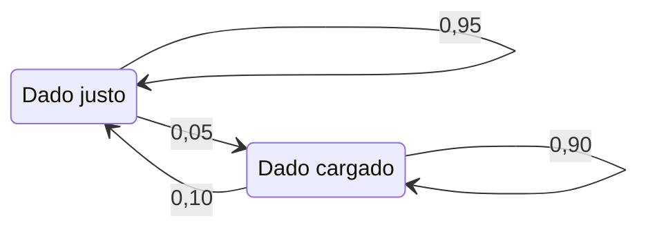

Las lecciones anteriores trataban cada fila como independiente de las demás. Una secuencia rompe esa hipótesis: lo que ocurre después depende de lo que acaba de ocurrir. Esta lección usa para ello los dos modelos del crate [`ix-graph`](https://github.com/GuitarAlchemist/ix/tree/490c39533627d296bf9f8f050e6fafc14d7a20c2/crates/ix-graph) fijado de IX: la cadena de Markov y el modelo oculto de Markov. El experimento ejecutable es [`l10_sequences.rs`](https://github.com/spareilleux/learn/blob/main/code/machine-learning-ix/examples/l10_sequences.rs), y las versiones escritas a mano están en [`sequence.rs`](https://github.com/spareilleux/learn/blob/main/code/machine-learning-ix/src/sequence.rs). [`crosscheck.py`](https://github.com/spareilleux/learn/blob/main/code/machine-learning-ix/crosscheck/crosscheck.py) recalcula con numpy todo lo que no usa los números aleatorios de IX. El [diario](../journal/#2026-09-29--cadenas-de-markov-y-un-casino-deshonesto) registra lo que se midió.

| Pregunta | Método | Función de IX | Qué significa la salida |
|---|---|---|---|
| ¿Dónde pasa la cadena su tiempo a largo plazo? | Distribución estacionaria | `MarkovChain::stationary_distribution` | Una estimación de π, con π P = π, por iteración de potencias |
| ¿Cuánto tarda la cadena en llegar por primera vez a un estado? | Tiempo medio de primer paso | `MarkovChain::mean_first_passage` | Una media de Monte Carlo sobre los recorridos que llegaron a tiempo |
| ¿Qué probabilidad tiene una secuencia entera de observaciones? | Algoritmo forward | `HiddenMarkovModel::forward` | ln P(observaciones), sumada sobre todos los caminos ocultos |
| ¿Qué camino oculto las explica mejor? | Viterbi | `HiddenMarkovModel::viterbi` | El camino más probable y su log-probabilidad |
| ¿Qué estado oculto es el más probable en cada paso? | Forward–backward | `forward_backward`, `map_estimate` | Probabilidades a posteriori por paso; su argmax no siempre es un camino |
| ¿Qué parámetros explican los datos? | Baum–Welch | `HiddenMarkovModel::baum_welch` | Un máximo local de la verosimilitud, desde un solo punto de partida |

Los datos de esta lección se inventan a propósito. Las tablas de CI del curso registran tiempos, no resultados, así que no contienen ninguna secuencia real de estados. De todos modos, solo un modelo cuya verdad se conoce permite puntuar un decodificador.

## 1. Una cadena de Markov y dónde se estabiliza

Una [cadena de Markov](https://github.com/GuitarAlchemist/ix/blob/490c39533627d296bf9f8f050e6fafc14d7a20c2/crates/ix-graph/src/markov.rs) es una matriz P cuya fila i da las probabilidades del estado siguiente desde el estado i. Aquí hay tres regímenes de mercado, alcista, bajista y estancado:

```text
P = [[0.90, 0.075, 0.025],
     [0.15, 0.80,  0.05 ],
     [0.25, 0.25,  0.50 ]]
```

Una distribución π que la cadena deja sin cambios, π P = π, se llama **estacionaria**. La versión escrita a mano la resuelve como un sistema lineal: (Pᵀ − I) π = 0 tiene una ecuación redundante, que se sustituye por π₀ + π₁ + π₂ = 1. La función [`stationary_distribution`](https://github.com/GuitarAlchemist/ix/blob/490c39533627d296bf9f8f050e6fafc14d7a20c2/crates/ix-graph/src/markov.rs#L56) de IX multiplica una distribución uniforme por P hasta que dos iterados difieren en menos de `tol`. Para esta cadena, ambas llegan a (5/8, 5/16, 1/16):

```text
== Markov chain: bull, bear, stagnant
  exact stationary distribution: [0.6250, 0.3125, 0.0625]
  IX power iteration:            [0.6250, 0.3125, 0.0625]
  largest gap below 1e-12: true
  is_ergodic(1): true
```

`is_ergodic(1)` es verdadero porque todos los coeficientes de P ya son positivos. La comprobación calcula P^steps y verifica que cada coeficiente supere `1e-10`: con un `steps` demasiado pequeño, una cadena que sí es ergódica aparece como no ergódica.

## 2. Cuánto tarda en llegar

El **tiempo medio de primer paso** mᵢ cuenta los pasos necesarios para ir del estado i a un estado objetivo. Para todo i distinto del objetivo, mᵢ = 1 + Σⱼ Pᵢⱼ mⱼ, con la suma sobre los estados j distintos del objetivo. Es un único sistema lineal, (I − Q) m = 1, donde Q es P sin la fila ni la columna del objetivo. El coeficiente del propio objetivo es su tiempo medio de retorno, que según el [lema de Kac](https://www.ams.org/journals/bull/1947-53-10/S0002-9904-1947-08927-8/) vale 1/π. Aquí, 1/0,0625 = 16.

La función [`mean_first_passage`](https://github.com/GuitarAlchemist/ix/blob/490c39533627d296bf9f8f050e6fafc14d7a20c2/crates/ix-graph/src/markov.rs#L94) de IX, en cambio, simula. Lanza `n_simulations` recorridos de como mucho `max_steps` pasos y promedia el paso de llegada de los recorridos que llegaron. Un recorrido que no llega a tiempo se descarta sin ningún aviso:

```text
== mean first passage to stagnant (state 2)
  exact, from bull, bear, stagnant: [31.4286, 28.5714, 16.0000]
  Kac: 1 / pi_2 = 16.0000
  IX, 20000 walks, at most 1000 steps: from bull 31.650, return 16.194
  IX, 20000 walks, at most   20 steps: from bull 9.836, return 3.763
  IX, 20000 walks, at most    5 steps: from bull 3.030, return 1.276
```

Con 1000 pasos, casi todos los recorridos llegan, y la estimación queda dentro del error de Monte Carlo alrededor de 31,43. Con 20 pasos la función devuelve 9,8, y con 5 pasos, 3,0. Entonces mide el tiempo medio de llegada *sabiendo que el recorrido llegó dentro del límite*, lo que nunca puede superar el límite, sea cual sea la media real. Para una cadena pequeña, el sistema lineal es exacto y más barato. Si simula, elija un `max_steps` muy superior a la respuesta que espera.

## 3. Una cadena que nunca se estabiliza

La cadena [[0, 1], [1, 0]] intercambia sus dos estados en cada paso. Tiene una distribución estacionaria, (½, ½), pero una cadena que empieza en un solo estado nunca se acerca a ella:

```text
== a periodic chain [[0, 1], [1, 0]]
  state_distribution from [1, 0], 1 to 4 steps: [0.0, 1.0] [1.0, 0.0] [0.0, 1.0] [1.0, 0.0]
  stationary_distribution: [0.5000, 0.5000]
  is_ergodic(100): false
```

`stationary_distribution` responde (½, ½) a la primera, porque su punto de partida uniforme ya es esa distribución. La respuesta es correcta, pero no dice nada sobre la convergencia. Es `is_ergodic` quien detecta esta cadena: todas las potencias de P conservan dos ceros.

## 4. Estados ocultos: el casino deshonesto

En un modelo oculto de Markov, la cadena no se observa. Cada estado oculto emite un símbolo con sus propias probabilidades, y solo se ven los símbolos. El ejemplo clásico es el casino ocasionalmente deshonesto de [Durbin, Eddy, Krogh y Mitchison](https://doi.org/10.1017/CBO9780511790492), sección 3.2. Un dado justo muestra cada cara con probabilidad 1/6. Un dado cargado muestra un seis la mitad de las veces, y cada una de las demás caras con probabilidad 1/10. El casino cambia de dado entre dos tiradas, y el ejemplo empieza con cualquiera de los dos dados con probabilidad ½:



El ejemplo extrae 1000 tiradas de este modelo con el generador xorshift del curso, el de la [lección 6](../06-ensembles/). Python reproduce ese generador, así que la comprobación cruzada ve las mismas tiradas.

**El algoritmo forward** calcula P(tiradas) sumando sobre los 2^1000 caminos ocultos, un paso cada vez: αₜ(j) = Σᵢ αₜ₋₁(i) Pᵢⱼ · bⱼ(oₜ). Escrito en el espacio de probabilidades, multiplica mil números del orden de 1/6 y cae por debajo del menor número binary64. Por eso la versión escrita a mano trabaja en escala logarítmica y suma con el truco log-sum-exp. La función [`forward`](https://github.com/GuitarAlchemist/ix/blob/490c39533627d296bf9f8f050e6fafc14d7a20c2/crates/ix-graph/src/hmm.rs#L148) de IX renormaliza α en cada paso y suma los logaritmos de los factores de escala, como en el [tutorial de Rabiner](https://doi.org/10.1109/5.18626):

```text
== the casino: 1000 rolls from the course's generator, seed 10
  true path: 259 loaded rolls in 23 runs; 239 sixes
  forward in probability space: T = 300 gives 8.832e-233, T = 1000 gives 0.000e0
  ln P(rolls), hand log space: -1761.7121
  ln P(rolls), IX forward:     -1761.7121
  agree within 1e-9: true
```

La versión directa todavía da una respuesta con 300 tiradas. Con 1000 tiradas devuelve 0, aunque la probabilidad real vale e^−1761,7.

## 5. Dos formas de decodificar, y por qué difieren

El [algoritmo de Viterbi](https://doi.org/10.1109/TIT.1967.1054010) sustituye la suma de la recurrencia forward por un máximo y guarda un puntero al mejor predecesor. Devuelve el **camino** más probable. Forward–backward devuelve, para cada tirada, la probabilidad **a posteriori** de cada dado dadas todas las tiradas. Tomar el dado más probable en cada tirada es la decodificación a posteriori, la función [`map_estimate`](https://github.com/GuitarAlchemist/ix/blob/490c39533627d296bf9f8f050e6fafc14d7a20c2/crates/ix-graph/src/hmm.rs#L307) de IX.

```text
== decoding the 1000 rolls
  Viterbi: hand path = IX path: true; log-probabilities agree within 1e-9: true
  Viterbi: agreement with the true states 0.869; 6 loaded runs
  posteriors: hand against IX forward_backward, largest gap below 1e-9: true
  posterior decoding (map_estimate): agreement with the true states 0.876; 16 loaded runs; same as hand argmax: true
```

La decodificación a posteriori acierta el dado algo más a menudo, 87,6 % frente a 86,9 %, pero divide los tramos cargados en 16 rachas, mientras que Viterbi encuentra 6. La verdad tiene 23. Viterbi optimiza el camino entero, así que cada cambio de dado le cuesta. La decodificación a posteriori optimiza cada tirada por separado y nunca comprueba si sus elecciones encadenan.

Puede que no encadenen en absoluto. En el modelo de tres estados de abajo, el estado 0 pasa siempre al estado 2, y los estados 1 y 2 pasan siempre al estado 1. El modelo empieza en 0, 1 o 2 con probabilidades 0,4, 0,3 y 0,3, y emite un único símbolo:

```text
== when the best states are not a path
  map_estimate: [0, 1], probability of that path 0.0000
  viterbi:      [0, 2], probability 0.4000
```

En el primer paso, el estado más probable es el 0, con 0,4. En el segundo, es el estado 1, con 0,3 + 0,3 = 0,6. La transición 0 → 1 tiene probabilidad 0, así que la decodificación a posteriori devuelve un camino que el modelo nunca puede producir. Use Viterbi cuando la respuesta deba ser un camino, y las probabilidades a posteriori cuando necesite una confianza paso a paso.

## 6. Aprender los parámetros: Baum–Welch

[Baum–Welch](https://doi.org/10.1214/aoms/1177697196) es el algoritmo de esperanza–maximización (EM) aplicado a un modelo oculto de Markov. Calcula las probabilidades a posteriori con los parámetros actuales, reestima los parámetros a partir de ellas y repite. De una iteración a la siguiente, la verosimilitud nunca disminuye. El ejemplo parte de una estimación errónea: probabilidades de quedarse de 0,8 y un dado cargado que muestra un seis una cuarta parte de las veces. Llama a `baum_welch` con `tol = 0`, de modo que la función ejecuta exactamente `k` iteraciones, para k = 1 a 10, y evalúa cada resultado con `forward`:

```text
== Baum-Welch from a wrong start, on the 1000 rolls
   0 iterations: ln P = -1775.9589
   1 iterations: ln P = -1767.1374
   2 iterations: ln P = -1766.1895
   3 iterations: ln P = -1765.0041
   4 iterations: ln P = -1763.6514
   5 iterations: ln P = -1762.2635
   6 iterations: ln P = -1760.9917
   7 iterations: ln P = -1759.9472
   8 iterations: ln P = -1759.1683
   9 iterations: ln P = -1758.6270
  10 iterations: ln P = -1758.2618
  never decreases: true
  after 10: stay fair 0.8505, stay loaded 0.8271, P(six | loaded) 0.4060; truth 0.9500, 0.9000, 0.5000
```

La verosimilitud sube en cada iteración. A partir de la sexta, supera la de los parámetros verdaderos, −1761,7, aunque los parámetros siguen lejos de la verdad. No es una contradicción: con una sola secuencia de 1000 tiradas, otros parámetros pueden explicar estas tiradas concretas mejor que los que las generaron. EM solo promete un máximo *local* de la verosimilitud, desde el punto de partida que se le da. Tampoco hay nada que distinga los dos estados: un punto de partida que ponga el dado cargado en el estado 0 aprende el mismo modelo con las etiquetas intercambiadas.

## 7. Los límites de la API de IX

```text
== edges
  viterbi on an impossible symbol: path [0, 0, 0], log-probability -inf
  forward on it: -inf
  backward entries all positive: true (a log-probability is never positive)
  a symbol outside the alphabet (6 on a die of 0 to 5): forward panics: true
```

- **Un símbolo imposible no produce un error.** En este modelo, ningún estado puede emitir el símbolo 2. Viterbi devuelve entonces un camino de ceros con log-probabilidad −∞, y `forward` devuelve −∞. Ambos valores son correctos, pero solo el −∞ revela que el camino no tiene sentido. Compruebe la log-probabilidad antes de usar el camino.
- **`backward` devuelve probabilidades renormalizadas, no logaritmos.** Su comentario habla de "log-probability". La tabla que devuelve contiene β dividido por los factores de escala del forward: números positivos, mientras que una log-probabilidad nunca es positiva.
- **Un símbolo fuera del alfabeto provoca un pánico.** `new` valida las tres tablas, pero no las observaciones: un 6 en un dado de caras 0 a 5 se sale de la tabla de emisión.

## Qué usar en nuestros repositorios

- **Cadenas pequeñas: resolver en lugar de simular.** Una distribución estacionaria o un tiempo medio de primer paso es un sistema lineal del tamaño del espacio de estados. Si simula con `mean_first_passage`, fije `max_steps` muy por encima de la respuesta, porque los recorridos que no llegan se descartan sin dejar rastro.
- **Trabajar siempre en escala logarítmica.** Las funciones `forward` y `viterbi` de IX ya lo hacen. Una recurrencia escrita a mano en el espacio de probabilidades se desborda por abajo tras unos cientos de pasos.
- **Elegir el decodificador según la pregunta.** Viterbi da un camino coherente, y las probabilidades a posteriori una confianza paso a paso. Ambos pueden ser correctos con los mismos datos y aun así discrepar.
- **Tratar Baum–Welch como una búsqueda.** Ejecútelo desde varios puntos de partida, compare las verosimilitudes finales y no tome sus parámetros por la verdad a partir de una sola secuencia.

## Ejercicios

1. Para la cadena [[1 − a, a], [b, 1 − b]], demuestre que π = (b, a)/(a + b) y dé el tiempo medio de retorno al estado 0. Compruebe ambos con a = 0,3 y b = 0,2.
2. ¿Por qué el valor que devuelve `mean_first_passage` con `max_steps = 5` nunca puede superar 5? ¿Qué habría que publicar junto a él para que fuera honesto?
3. En el modelo de tres estados de la sección 5, calcule a mano las probabilidades a posteriori de los dos pasos y la probabilidad del camino de Viterbi.
4. La decodificación a posteriori acertó el dado algo más a menudo que Viterbi, pero encontró 16 rachas cargadas frente a 23 reales. ¿Qué decodificador usaría para contar cuántas veces cambió de dado el casino, y por qué?

<details>
<summary>Soluciones</summary>

1. π P = π da π₀ a = π₁ b; con π₀ + π₁ = 1, se obtiene π = (b, a)/(a + b). Por el lema de Kac, el tiempo medio de retorno al estado 0 vale 1/π₀ = (a + b)/b. Con a = 0,3 y b = 0,2: π = (0,4; 0,6) y el tiempo de retorno vale 2,5, los valores que comprueban las pruebas unitarias de `sequence.rs`.
2. Solo promedia los recorridos que llegaron en 5 pasos como mucho, así que cada término de la media vale como mucho 5. Una estimación honesta indica también cuántos recorridos llegaron, o usa un límite tan grande que casi todos lleguen.
3. Las observaciones no aportan información, así que las probabilidades a posteriori siguen la cadena. En el paso 1 son las del inicio, (0,4; 0,3; 0,3). En el paso 2: el estado 1 viene del estado 1 o del 2, 0,3 + 0,3 = 0,6; el estado 2 viene del estado 0, 0,4; el estado 0 tiene 0. El camino de Viterbi es [0, 2], con probabilidad 0,4 · 1 = 0,4. Los caminos [1, 1] y [2, 1] tienen 0,3 cada uno.
4. Viterbi: el número de cambios es una propiedad del camino entero. La decodificación a posteriori elige cada tirada por separado y corta un tramo cargado en cuanto una tirada parece justa. Ninguno es exacto: Viterbi fusionó rachas reales y encuentra 6 frente a 23.

</details>

## Fuentes

- IX en el commit fijado `490c395`: [`markov.rs`](https://github.com/GuitarAlchemist/ix/blob/490c39533627d296bf9f8f050e6fafc14d7a20c2/crates/ix-graph/src/markov.rs) y [`hmm.rs`](https://github.com/GuitarAlchemist/ix/blob/490c39533627d296bf9f8f050e6fafc14d7a20c2/crates/ix-graph/src/hmm.rs).
- R. Durbin, S. Eddy, A. Krogh y G. Mitchison, [*Biological Sequence Analysis*](https://doi.org/10.1017/CBO9780511790492), Cambridge University Press, 1998, capítulo 3: el casino deshonesto, Viterbi, forward–backward y Baum–Welch.
- L. R. Rabiner, ["A tutorial on hidden Markov models and selected applications in speech recognition"](https://doi.org/10.1109/5.18626), *Proceedings of the IEEE* 77, 1989: la renormalización de las variables forward y backward.
- A. J. Viterbi, ["Error bounds for convolutional codes and an asymptotically optimum decoding algorithm"](https://doi.org/10.1109/TIT.1967.1054010), *IEEE Transactions on Information Theory* 13, 1967.
- L. E. Baum, T. Petrie, G. Soules y N. Weiss, ["A maximization technique occurring in the statistical analysis of probabilistic functions of Markov chains"](https://doi.org/10.1214/aoms/1177697196), *Annals of Mathematical Statistics* 41, 1970.
- M. Kac, ["On the notion of recurrence in discrete stochastic processes"](https://www.ams.org/journals/bull/1947-53-10/S0002-9904-1947-08927-8/), *Bulletin of the AMS* 53, 1947.
