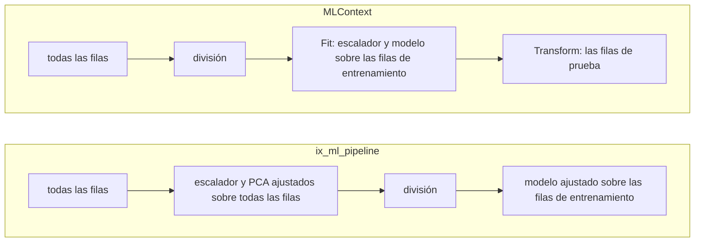

Un *pipeline* de aprendizaje automático encadena los pasos que van de los datos en bruto a una puntuación, y debe aprender cada paso solo con las filas de entrenamiento. [ML.NET](https://learn.microsoft.com/dotnet/machine-learning/) lo expresa con [`MLContext`](https://learn.microsoft.com/dotnet/api/microsoft.ml.mlcontext):
- las transformaciones y el entrenador son *estimadores*, encadenados con [`Append`](https://learn.microsoft.com/dotnet/api/microsoft.ml.learningpipelineextensions.append);
- un solo [`Fit`](https://learn.microsoft.com/dotnet/api/microsoft.ml.iestimator-1.fit) sobre el conjunto de entrenamiento los aprende todos;
- el modelo ajustado [transforma](https://learn.microsoft.com/dotnet/api/microsoft.ml.itransformer.transform) después el conjunto de prueba.

El [`Pipeline`](https://scikit-learn.org/stable/modules/generated/sklearn.pipeline.Pipeline.html) de scikit-learn hace lo mismo, y su guía explica por qué bajo [fuga de datos](https://scikit-learn.org/stable/common_pitfalls.html#data-leakage).

IX tiene dos cosas que se llaman pipeline, ambas en el commit fijado:
- [`ix-pipeline`](https://github.com/GuitarAlchemist/ix/tree/490c39533627d296bf9f8f050e6fafc14d7a20c2/crates/ix-pipeline) es un ejecutor general. Ejecuta un grafo dirigido acíclico (DAG) de pasos que intercambian JSON, construido en Rust o *rebajado* desde un archivo `ix.yaml` cuyas etapas llaman a las habilidades de IX.
- `ix_ml_pipeline` es una cadena fija de pasos, servida como *herramienta* por el servidor de [`ix-agent`](https://github.com/GuitarAlchemist/ix/tree/490c39533627d296bf9f8f050e6fafc14d7a20c2/crates/ix-agent). Un servidor habla el [Model Context Protocol](https://modelcontextprotocol.io/specification/2024-11-05/) (MCP): un asistente lo arranca y le envía un mensaje [JSON-RPC 2.0](https://www.jsonrpc.org/specification) por línea en su entrada estándar. Responde en su salida estándar, y registra en su salida de error. `initialize` abre la sesión, [`tools/list`](https://modelcontextprotocol.io/specification/2024-11-05/server/tools) lista las herramientas, y `tools/call` llama a una.

El [diario](../journal/#2026-09-30--lección-21-predicha-antes-de-medir) contiene ocho predicciones, P1 a P8, escritas a partir del código fuente y registradas antes de que se ejecutara ningún código de esta lección. La sección 13 las puntúa.

## 1. Qué corre dónde

`ix-pipeline` no añade ningún paquete al `Cargo.lock` del curso, así que P1 a P5 corren en los tres sistemas de la CI, en [`examples/l21_pipelines.rs`](https://github.com/spareilleux/learn/blob/main/code/machine-learning-ix/examples/l21_pipelines.rs). El mismo ejemplo repite los pasos de la herramienta con las propias funciones de IX: `train_test_split`, `StandardScaler`, `KNN`, `LinearRegression` y las métricas.

La herramienta en sí necesita `ix-agent`. Depender de él añadiría 197 paquetes al lock del curso, medido resolviendo una copia del manifiesto: 225 paquetes se vuelven 422. En su lugar, su binario de servidor, `ix-mcp`, se compila en el commit fijado fuera del repositorio. La compilación parte del `Cargo.lock` del curso, para que ndarray, rand y los demás crates comunes conserven las versiones del curso. [`src/mcp.rs`](https://github.com/spareilleux/learn/blob/main/code/machine-learning-ix/src/mcp.rs) es un pequeño cliente:
- arranca el servidor en un directorio vacío propio;
- escribe una línea por mensaje y lee las respuestas en un hilo;
- da a cada petición un plazo, 30 segundos, o 10 donde la predicción dice que no llega ninguna respuesta.

[`src/bin/l21_mcp.rs`](https://github.com/spareilleux/learn/blob/main/code/machine-learning-ix/src/bin/l21_mcp.rs) imprime lo que cita la lección, guardado en `local/l21_mcp.txt`. [`tests/l21_mcp.rs`](https://github.com/spareilleux/learn/blob/main/code/machine-learning-ix/tests/l21_mcp.rs) contiene un test ignorado por predicción, que la CI se salta.

Esta es la llamada de P5, con las 20 filas cortadas aquí:

```json
{"jsonrpc":"2.0","id":2,"method":"tools/call","params":{"name":"ix_ml_pipeline","arguments":{"source":{"type":"inline","data":[[0.0,0.0,1.0],[0.1,0.0,1.0],[0.2,0.0,1.0],[0.3,0.0,1.0],[0.4,0.0,1.0],[0.0,0.1,1.0],[0.1,0.1,1.0],[0.2,0.1,1.0],[0.3,0.1,1.0],[0.4,0.1,1.0],[5.0,5.0,2.0],[5.1,5.0,2.0],[5.2,…
```

Los `arguments` siguen con las otras filas, luego `"target_column":2`, `"split":{"test_ratio":0.3,"seed":42}` y `"return_predictions":true`. El `result.content[0].text` de la respuesta es el resultado de la herramienta en JSON indentado:

```json
{
  "data_shape": {
    "features": 2,
    "rows": 20
  },
  "metrics": {
    "accuracy": 1.0,
    "f1": 0.6666666666666666,
    "precision": 0.6666666666666666,
    "recall": 0.6666666666666666
  },
  "model": "knn",
  "model_params": {
    "k": 5
  },
  "persisted": false,
  "predictions": [
    1,
    2,
    2,
    2,
    1,
    1
  ],
  "preprocessing": {
    "nan_rows_dropped": 0,
    "normalized": false
  },
  "split": {
    "test": 6,
    "train": 14
  },
  "task": "classify",
  "timing_ms": 0
}
```

Una exactitud de 1 y una precisión de 2/3, con todas las predicciones acertadas: la sección 7 explica la diferencia. Un error vuelve como el texto `Error: …` con `isError` activado ([`main.rs` 281-301](https://github.com/GuitarAlchemist/ix/blob/490c39533627d296bf9f8f050e6fafc14d7a20c2/crates/ix-agent/src/main.rs#L281-L301)). El cliente compara los números bit a bit: toma cada número de este texto tal como está escrito y lo lee con la biblioteca estándar, que redondea correctamente.

## 2. Un ejecutor paralelo que ejecuta por turnos

La documentación del crate dice que «Independent branches run in parallel» ([`lib.rs` 3-5](https://github.com/GuitarAlchemist/ix/blob/490c39533627d296bf9f8f050e6fafc14d7a20c2/crates/ix-pipeline/src/lib.rs#L3-L5)), y la de `execute` que los nodos de un nivel «execute in parallel using std threads» ([`executor.rs` 115-118](https://github.com/GuitarAlchemist/ix/blob/490c39533627d296bf9f8f050e6fafc14d7a20c2/crates/ix-pipeline/src/executor.rs#L115-L118)). P1 construye un rombo con [`PipelineBuilder`](https://github.com/GuitarAlchemist/ix/blob/490c39533627d296bf9f8f050e6fafc14d7a20c2/crates/ix-pipeline/src/builder.rs): `load` alimenta a `a` y a `b`, que alimentan los dos a `report`. Cada función de cálculo anota el hilo en el que corre, y `a` y `b` duermen 50 ms cada uno. Abreviado de [`src/pipeline.rs`](https://github.com/spareilleux/learn/blob/main/code/machine-learning-ix/src/pipeline.rs):

```rust
let dag = PipelineBuilder::new()
    .source("load", || Ok(json!(1.0)))
    .node("a", |b| b.input("x", "load").compute(|i| {
        thread::sleep(nap);
        Ok(json!(i["x"].as_f64().unwrap() + 1.0))
    }))
    .node("b", |b| b.input("x", "load").compute(/* la misma, + 2.0 */))
    .node("report", |b| b.input("a", "a").input("b", "b").compute(/* a + b */))
    .build()?;
let result = execute(&dag, &HashMap::new(), &NoCache)?;
```

```
== P1, a diamond: load -> a and b -> report, a and b sleeping 50 ms each
  parallel_levels: [["load"], ["a", "b"], ["report"]]
  compute functions run: 4, all on the thread that called execute: yes
  total_duration at least 100 ms: yes; report = 5.0
```

`a` y `b` comparten un nivel, y corren uno detrás de otro. La rama para un nivel de varios nodos recorre los nodos con un iterador y llama a cada función de cálculo por turnos ([`executor.rs` 163-211](https://github.com/GuitarAlchemist/ix/blob/490c39533627d296bf9f8f050e6fafc14d7a20c2/crates/ix-pipeline/src/executor.rs#L163-L211)). Su comentario dice que `ComputeFn` «isn't Send», pero el tipo se declara `Send + Sync` ([`executor.rs` 11-13](https://github.com/GuitarAlchemist/ix/blob/490c39533627d296bf9f8f050e6fafc14d7a20c2/crates/ix-pipeline/src/executor.rs#L11-L13)). Nada impide que un [`std::thread::scope`](https://doc.rust-lang.org/std/thread/fn.scope.html) ejecute lado a lado los nodos del nivel (ejercicio 1). Los resultados son correctos; solo falta la velocidad prometida.

## 3. Una clave de caché sin el cálculo

[`PipelineCache`](https://github.com/GuitarAlchemist/ix/blob/490c39533627d296bf9f8f050e6fafc14d7a20c2/crates/ix-pipeline/src/executor.rs#L94-L103) es el punto de extensión para «connect to `ix-cache` or any other cache». La clave que recibe es `pipeline:`, el identificador del nodo, y un hash FNV-1a de las entradas del nodo ([`executor.rs` 309-325](https://github.com/GuitarAlchemist/ix/blob/490c39533627d296bf9f8f050e6fafc14d7a20c2/crates/ix-pipeline/src/executor.rs#L309-L325)). Lo que calcula el nodo no está en ella. P2 comparte una caché en memoria entre dos pipelines de un solo nodo, cuyo nodo `f` lee la entrada `value` = 10:

```
== P2, one cache shared by two pipelines: f(x) = x + 1, then f(x) = 2x, on value = 10
  x + 1: output 11, cache hits 0
  2x: output 11, cache hits 1
```

2 × 10 son 20. El segundo pipeline recibe la respuesta del primero, porque las dos claves son `pipeline:f:` y el hash de `{"x": 10}`. Lo mismo le pasa a una etapa de `ix.yaml` cuyos `args` cambian entre dos ejecuciones. `lower` guarda los `args` de una etapa dentro del cierre de cálculo, y las entradas solo contienen las salidas anteriores ([`lower.rs` 89-105](https://github.com/GuitarAlchemist/ix/blob/490c39533627d296bf9f8f050e6fafc14d7a20c2/crates/ix-pipeline/src/lower.rs#L89-L105)). Cada llamador en el commit fijado pasa `NoCache`, así que el defecto espera a la primera caché (ejercicio 2).

## 4. Las salidas finales, y un campo que no está

```
== P3, final_outputs and input_field
  final_outputs on the diamond: 4 entries, for 1 leaf
  field "missing" of {"a": 1}: {"a":1}; field "a": 1
```

`final_outputs` está documentado como si devolviera las salidas de los nodos hoja, y devuelve las de todos los nodos, bajo un comentario que dice «Can't easily determine without the DAG» ([`executor.rs` 58-71](https://github.com/GuitarAlchemist/ix/blob/490c39533627d296bf9f8f050e6fafc14d7a20c2/crates/ix-pipeline/src/executor.rs#L58-L71)); el DAG sí tiene [`leaves()`](https://github.com/GuitarAlchemist/ix/blob/490c39533627d296bf9f8f050e6fafc14d7a20c2/crates/ix-pipeline/src/dag.rs#L160-L169). [`input_field`](https://github.com/GuitarAlchemist/ix/blob/490c39533627d296bf9f8f050e6fafc14d7a20c2/crates/ix-pipeline/src/builder.rs#L73-L78) lee un campo de una salida anterior. Cuando falta el campo, el ejecutor pasa en su lugar la salida entera, sin error ([`executor.rs` 286-295](https://github.com/GuitarAlchemist/ix/blob/490c39533627d296bf9f8f050e6fafc14d7a20c2/crates/ix-pipeline/src/executor.rs#L286-L295)). Un nombre de campo mal escrito falla entonces más adelante, en el nodo que esperaba un número, o no falla.

## 5. Un hash con el nombre de otro, y un registro vacío

`ix pipeline run` escribe un archivo de bloqueo que registra el `args_hash` de cada etapa, documentado como «fnv1a64 over the canonicalized **template** args» ([`lock.rs` 50-51](https://github.com/GuitarAlchemist/ix/blob/490c39533627d296bf9f8f050e6fafc14d7a20c2/crates/ix-pipeline/src/lock.rs#L50-L51)). P4 llama a [`LockFile::from_run`](https://github.com/GuitarAlchemist/ix/blob/490c39533627d296bf9f8f050e6fafc14d7a20c2/crates/ix-pipeline/src/lock.rs#L107-L111) sobre una etapa `load` cuyos args son `{"data": [1.0, 2.0]}`, y vuelve a calcular el hash de dos maneras:

```
== P4, the lock file's args_hash, and lower without a linked skill
  canonical args: {"data":[1.0,2.0]}
  args_hash:                        fnv1a64:4762d1a4ed81a34d
  DefaultHasher of that string:     fnv1a64:4762d1a4ed81a34d  same: yes
  FNV-1a 64 of the same bytes:      fnv1a64:8091c3ce6ff9b24c  same: no
  lower(PipelineSpec::scaffold("demo")): stage 'load' references unknown skill 'stats'
```

`hash_json` pasa la cadena canónica al `DefaultHasher` de la biblioteca estándar e imprime el resultado después de `fnv1a64:` ([`lock.rs` 317-327](https://github.com/GuitarAlchemist/ix/blob/490c39533627d296bf9f8f050e6fafc14d7a20c2/crates/ix-pipeline/src/lock.rs#L317-L327)). La documentación de [`DefaultHasher`](https://doc.rust-lang.org/std/collections/hash_map/struct.DefaultHasher.html) avisa de que su «internal algorithm is not specified, and so it and its hashes should not be relied upon over releases». La verificación cruzada en Python calcula FNV-1a según su definición y obtiene `8091c3ce6ff9b24c`, el valor que promete la etiqueta; nadie fuera de la biblioteca estándar de Rust puede volver a calcular el otro. Un archivo de bloqueo está hecho para compararse con una ejecución posterior, quizá compilada con un Rust más nuevo. La corrección es una sola llamada: el ejecutor ya calcula FNV-1a para su clave de caché.

La última línea viene de [`lower`](https://github.com/GuitarAlchemist/ix/blob/490c39533627d296bf9f8f050e6fafc14d7a20c2/crates/ix-pipeline/src/lower.rs#L58-L64), que busca la habilidad de cada etapa en `ix-registry`. Ese registro es un slice «populated at link time by every `#[ix_skill]` annotation» ([`lib.rs` 69-72](https://github.com/GuitarAlchemist/ix/blob/490c39533627d296bf9f8f050e6fafc14d7a20c2/crates/ix-registry/src/lib.rs#L69-L72)), y las habilidades de IX viven en `ix-agent`. Un programa que solo depende de `ix-pipeline`, como este curso, no enlaza ninguna habilidad, así que el esqueleto que escribe `ix pipeline new` no se puede rebajar. Es un diseño, no un defecto, pero la página del crate no lo dice: para ejecutar una especificación, enlaza `ix-agent`, o usa la línea de comandos de IX.

## 6. La herramienta, paso a paso

`run_pipeline` en [`ml_pipeline.rs`](https://github.com/GuitarAlchemist/ix/blob/490c39533627d296bf9f8f050e6fafc14d7a20c2/crates/ix-agent/src/ml_pipeline.rs) ejecuta estos pasos, en este orden:
1. **Cargar.** Lee un archivo CSV, o las filas en línea. [`read_csv`](https://github.com/GuitarAlchemist/ix/blob/490c39533627d296bf9f8f050e6fafc14d7a20c2/crates/ix-io/src/csv_io.rs#L10-L38) convierte en NaN cada campo que no es un número.
2. **Quitar los NaN.** Quita cada fila que contiene un NaN, en una variable o en el objetivo ([167-188](https://github.com/GuitarAlchemist/ix/blob/490c39533627d296bf9f8f050e6fafc14d7a20c2/crates/ix-agent/src/ml_pipeline.rs#L167-L188)).
3. **Normalizar y reducir.** Con `normalize`, ajusta un `StandardScaler` sobre todas las filas ([190-195](https://github.com/GuitarAlchemist/ix/blob/490c39533627d296bf9f8f050e6fafc14d7a20c2/crates/ix-agent/src/ml_pipeline.rs#L190-L195)); con `pca_components`, ajusta también un PCA sobre todas las filas.
4. **Elegir.** Con `auto`, infiere la tarea y elige un modelo ([208-228](https://github.com/GuitarAlchemist/ix/blob/490c39533627d296bf9f8f050e6fafc14d7a20c2/crates/ix-agent/src/ml_pipeline.rs#L208-L228), [507-522](https://github.com/GuitarAlchemist/ix/blob/490c39533627d296bf9f8f050e6fafc14d7a20c2/crates/ix-agent/src/ml_pipeline.rs#L507-L522)). A lo sumo 20 enteros no negativos distintos hacen una clasificación, y se elige `knn` por debajo de 100 filas.
5. **Dividir, ajustar, puntuar.** Divide, 20 % para la prueba con la semilla 42 por defecto, y luego ajusta y puntúa ([704-705](https://github.com/GuitarAlchemist/ix/blob/490c39533627d296bf9f8f050e6fafc14d7a20c2/crates/ix-agent/src/ml_pipeline.rs#L704-L705)).
6. **Persistir.** Si se le pide, guarda el estado del modelo y el escalador en una caché en memoria, bajo una clave ([273-304](https://github.com/GuitarAlchemist/ix/blob/490c39533627d296bf9f8f050e6fafc14d7a20c2/crates/ix-agent/src/ml_pipeline.rs#L273-L304)).

Los pasos 3 y 5 son donde se aparta de `MLContext`:



## 7. Clases que no están

`run_classification` convierte las etiquetas en clases con `round() as usize` y cuenta `max + 1` clases ([533-534](https://github.com/GuitarAlchemist/ix/blob/490c39533627d296bf9f8f050e6fafc14d7a20c2/crates/ix-agent/src/ml_pipeline.rs#L533-L534)). Luego promedia la precisión, la exhaustividad y el F1 sobre cada clase de 0 a la más grande ([655-670](https://github.com/GuitarAlchemist/ix/blob/490c39533627d296bf9f8f050e6fafc14d7a20c2/crates/ix-agent/src/ml_pipeline.rs#L655-L670)). La [`precision`](https://github.com/GuitarAlchemist/ix/blob/490c39533627d296bf9f8f050e6fafc14d7a20c2/crates/ix-supervised/src/metrics.rs#L102-L118) de IX devuelve 0 para una clase nunca predicha. Así que las etiquetas 1 y 2 meten una clase 0 que ninguna fila tiene, y sus ceros bajan el promedio:

```
== P5, labels 1 and 2, all predicted right
  the tool's loop over classes 0 to 2: precision 0.6666666666666666, recall 0.6666666666666666, f1 0.6666666666666666
  precision_avg, recall_avg, f1_avg with Average::Macro: 0.6666666666666666, 0.6666666666666666, 0.6666666666666666
  labels 0 and 1, the tool's loop over classes 0 and 1: 1, 1, 1
```

El propio [`precision_avg`](https://github.com/GuitarAlchemist/ix/blob/490c39533627d296bf9f8f050e6fafc14d7a20c2/crates/ix-supervised/src/metrics.rs#L194-L211) de IX hace la misma cuenta, así que la biblioteca y la herramienta coinciden entre sí. El promedio macro de scikit-learn usa las etiquetas presentes, y da 1. La verificación cruzada imprime los dos:

```
labels 1 and 2, all right: scikit-learn macro 1 1 1
the same with labels=[0, 1, 2], as the tool counts them: 0.6666666666666666 0.6666666666666666 0.6666666666666666
```

A través de la herramienta, lo mismo se cumple bit a bit. La respuesta de P5 de la sección 1 tiene las dos clases entre sus predicciones de prueba, y 2/3 en todas partes salvo en la exactitud; etiquetadas 0 y 1, las mismas filas dan 1.

La cuenta empeora con objetivos reales. El `builds.csv` de la lección 1 tiene 18 duraciones de build distintas, todas en segundos enteros y la mayor de 48, así que la inferencia de tarea las toma por una clasificación. `run_classification` cuenta entonces 49 clases, y 13 filas de prueba pueden contener como mucho 13 de ellas:

```
  build_seconds: 18 distinct values, all whole: yes; task and model on auto: classify, knn
  knn, k = 5, 52 training and 13 test rows, 49 classes counted: accuracy 0.153846, precision 0.030612, recall 0.030612, f1 0.027211
```

## 8. Los tres puntos de la lección 1, ejecutados

La [lección 1](../01-data-and-evaluation/) leyó tres comportamientos de esta herramienta sin ejecutarlos. A través del servidor:

```
== P6, lesson 1's three items to verify, through the tool
  (a) builds.csv as it is: error: Error: execution failed: All rows contain NaN values
  (b) pages and build_seconds, defaults: task "classify", model "knn", 52 training and 13 test rows
      tool:   accuracy, precision, recall, f1 = [0.15384615384615385, 0.030612244897959183, 0.030612244897959183, 0.027210884353741496]
      replay: accuracy, precision, recall, f1 = [0.15384615384615385, 0.030612244897959183, 0.030612244897959183, 0.027210884353741496]
      same bits: 4 of 4
  (c) task regress, normalize on: ok; model "linear_regression", 13 predictions returned
      same bits as the replay that fits the scaler on all 65 rows: 16 of 16
      same bits as the replay that splits first and fits it on the 52 training rows: 3 of 16
      largest difference from the training-rows replay: 1.4210854715202004e-14
      mse 63.847900084610906, rmse 7.990488100523704, r2 0.0427346420955248
```

- **(a)** Las columnas de fecha y de commit del archivo no son números, así que cada fila contiene un NaN y todas las filas se van. El error no dice qué columna.
- **(b)** Las 49 clases de la sección 7, iguales bit a bit a la repetición con las funciones de IX.
- **(c)** Las 13 predicciones y las 3 métricas de la herramienta son las de la repetición que ajusta el escalador antes de dividir, hasta el último bit. Difieren del orden sin fuga en 13 números de 16, como mucho en 1,4·10⁻¹⁴. En aritmética exacta, una regresión lineal con término independiente da las mismas predicciones tras cualquier reescalado afín de sus variables: los pesos absorben la escala y el término independiente absorbe el desplazamiento. Este modelo oculta, pues, la fuga, y solo el redondeo delata el orden.

Un modelo basado en distancias, como el `knn` que la herramienta elige para las clasificaciones pequeñas, no absorbe el escalado en cuanto hay dos variables o más (ejercicio 4). La lección no lo midió; *por verificar*.

## 9. El orden de MLContext, como DAG de ix-pipeline

`ix-pipeline` puede expresar el orden sin fuga: cada paso es un nodo, y el escalador lo ajusta un nodo que solo lee las filas de entrenamiento. Abreviado de `leak_free_dag` en `src/pipeline.rs`:

```rust
PipelineBuilder::new()
    .source("data", move || Ok(data.clone()))
    .node("split", |b| b.input("d", "data").compute(/* train_test_split(x, y, 0.2, 42) */))
    .node("scaler", |b| b.input_field("x", "split", "x_train").compute(/* StandardScaler::fit */))
    .node("scale", |b| b.input("s", "split").input("c", "scaler").compute(/* transforma los dos lados */))
    .node("fit_predict", |b| b.input("x", "scale").input_field("y", "split", "y_train").compute(/* LinearRegression */))
    .node("score", |b| b.input("p", "fit_predict").input_field("y", "split", "y_test").compute(/* mse, rmse, r2 */))
    .build()?
```

```
== The order ML.NET's MLContext follows, as an ix-pipeline DAG
  levels: [["data"], ["split"], ["scaler"], ["scale"], ["fit_predict"], ["score"]]
  the same 16 numbers as the training-rows replay, bit for bit: 16 of 16
```

Los datos viajan entre los nodos como JSON, y `serde_json` conserva un `f64` exactamente, así que el DAG reproduce la repetición bit a bit. Lo que `MLContext` añade es el modelo ajustado como valor: aquí, las medias y las desviaciones del escalador son la salida de un nodo, y aplicarlas a una fila nueva exige construir otro DAG.

## 10. Un modelo persistido que no sabe predecir

`persist` guarda el `model_state` del modelo y el escalador, no el PCA ([273-304](https://github.com/GuitarAlchemist/ix/blob/490c39533627d296bf9f8f050e6fafc14d7a20c2/crates/ix-agent/src/ml_pipeline.rs#L273-L304)). `model_state` es nulo para `knn`, los bosques aleatorios y el transformer ([555](https://github.com/GuitarAlchemist/ix/blob/490c39533627d296bf9f8f050e6fafc14d7a20c2/crates/ix-agent/src/ml_pipeline.rs#L555), [587-592](https://github.com/GuitarAlchemist/ix/blob/490c39533627d296bf9f8f050e6fafc14d7a20c2/crates/ix-agent/src/ml_pipeline.rs#L587-L592), [646-650](https://github.com/GuitarAlchemist/ix/blob/490c39533627d296bf9f8f050e6fafc14d7a20c2/crates/ix-agent/src/ml_pipeline.rs#L646-L650)). `ix_ml_predict` solo maneja la regresión lineal, los árboles de decisión y k-medias ([384-419](https://github.com/GuitarAlchemist/ix/blob/490c39533627d296bf9f8f050e6fafc14d7a20c2/crates/ix-agent/src/ml_pipeline.rs#L384-L419)). P7 corre en un solo servidor:

```
== P7, one server: a persisted knn, then a prediction that panics
  (a) P5's rows persisted as l21-knn: ok, persisted true
      ix_ml_predict on l21-knn: error: Error: execution failed: Prediction not supported for algorithm 'knn'
  (b) 10 rows of 3 features, normalize, pca_components 1, persisted as l21-pca: ok, data_shape {"features":1,"rows":10}
      ix_ml_predict on a row of 3 features: no response
      stderr: ndarray: inputs 1 × 3 and 1 × 1 are not compatible for matrix multiplication
```

- **(a)** La herramienta dice `persisted: true` para un modelo que no sabe recargar. Las clasificaciones pequeñas en las que `auto` elige `knn`, por debajo de 100 filas, no se pueden persistir de forma útil en absoluto.
- **(b)** El PCA no se guarda, así que el modelo espera 1 variable y recibe las 3 que devuelve el escalador. [`LinearRegression::predict`](https://github.com/GuitarAlchemist/ix/blob/490c39533627d296bf9f8f050e6fafc14d7a20c2/crates/ix-supervised/src/linear_regression.rs#L76-L79) calcula `x.dot(w)`, y ndarray provoca un pánico cuando las formas no concuerdan. El cliente nunca recibe respuesta.

## 11. Un pánico, y ninguna respuesta más

El servidor ejecuta cada `tools/call` en un hilo propio, que escribe la respuesta cuando la herramienta termina ([`main.rs` 175-187](https://github.com/GuitarAlchemist/ix/blob/490c39533627d296bf9f8f050e6fafc14d7a20c2/crates/ix-agent/src/main.rs#L175-L187)). Un pánico termina ese hilo antes de que escriba nada, y nada lo atrapa. Hay algo peor. Cada herramienta registrada con `#[ix_skill]`, entre ellas `ix_ml_pipeline` e `ix_ml_predict`, pasa por `dispatch_action`. Esa función retiene el mutex de la cadena de middlewares mientras corre la habilidad ([`registry_bridge.rs` 221-250](https://github.com/GuitarAlchemist/ix/blob/490c39533627d296bf9f8f050e6fafc14d7a20c2/crates/ix-agent/src/registry_bridge.rs#L221-L250)). Un hilo que entra en pánico mientras retiene un [`Mutex`](https://doc.rust-lang.org/std/sync/struct.Mutex.html#poisoning) lo envenena, y cada `lock()` posterior devuelve un error, que `dispatch_action` convierte en pánico con `expect`:

```
  (c) tools/list afterwards: 97 tools
      P5's valid ix_ml_pipeline call afterwards: no response
      stderr: middleware chain mutex poisoned: PoisonError { .. }
      panics on stderr: 2
```

`tools/list` todavía responde, porque el bucle de lectura lo atiende sin la cadena. La llamada válida que respondía en la sección 1 ya no obtiene respuesta, y ninguna otra habilidad registrada la obtendrá hasta que el servidor se reinicie. Un asistente que espera sin plazo se queda colgado en la primera llamada; uno con plazo ve expirar todas las habilidades. Leído en la misma función, no medido: el bloqueo también serializa las habilidades, así que dos llamadas nunca ejecutan las suyas a la vez, sean cuales sean los hilos. La corrección es pequeña (ejercicio 5): soltar el bloqueo antes de llamar a la habilidad, o convertir un pánico en error con [`catch_unwind`](https://doc.rust-lang.org/std/panic/fn.catch_unwind.html).

## 12. Dos barreras delante de la habilidad

La cadena de middlewares ejecuta un detector de bucles, y luego una política de aprobación, antes de la habilidad ([`registry_bridge.rs` 65-82](https://github.com/GuitarAlchemist/ix/blob/490c39533627d296bf9f8f050e6fafc14d7a20c2/crates/ix-agent/src/registry_bridge.rs#L65-L82)). P8 arranca un servidor nuevo:

```
== P8, a fresh server: the loop detector, then the approval policy
  ix_ml_pipeline, seed 1: ok
  …
  ix_ml_pipeline, seed 10: ok
  ix_ml_pipeline, seed 11: error: Error: ix_loop_detect: circuit breaker tripped on tool 'ix_ml_pipeline' — circuit breaker tripped: 11 calls in the last 300s exceeds threshold 10. The agent should stop calling this tool and reconsider its approach. This is a governance-instrument safety check, not a transient error.
  ix_ml_predict on an unknown key: error: Error: execution failed: No persisted model found for key 'l21-nothing-here'
  tools/list: 97 tools; of the six in neither approval list, listed: 6
  ix_petri_analyze: error: Error: ix_approval: action blocked (ApprovalRequired) — action requires explicit approval (tier: tier_three, rationale: 1 evidence item(s))
```

- **El detector de bucles.** Cuenta las llamadas por nombre de herramienta, sean cuales sean los argumentos ([`action.rs` 112-124](https://github.com/GuitarAlchemist/ix/blob/490c39533627d296bf9f8f050e6fafc14d7a20c2/crates/ix-agent-core/src/action.rs#L112-L124)), y salta por encima de 10 en 5 minutos ([`lib.rs` 105-112](https://github.com/GuitarAlchemist/ix/blob/490c39533627d296bf9f8f050e6fafc14d7a20c2/crates/ix-loop-detect/src/lib.rs#L105-L112)). Once llamadas con once semillas distintas no son un bucle, pero se bloquean como si lo fueran: un barrido de semillas o una validación cruzada de más de 10 pliegues tiene que esperar 5 minutos. Las demás herramientas siguen pasando, como muestra la línea de `ix_ml_predict`.
- **La política de aprobación.** Clasifica las herramientas por nombre en dos listas escritas a mano, las que solo leen y las que modifican, y bloquea toda herramienta que no esté en ninguna como del nivel más arriesgado ([`classify.rs` 69-157](https://github.com/GuitarAlchemist/ix/blob/490c39533627d296bf9f8f050e6fafc14d7a20c2/crates/ix-approval/src/classify.rs#L69-L157), [`middleware.rs` 206-219](https://github.com/GuitarAlchemist/ix/blob/490c39533627d296bf9f8f050e6fafc14d7a20c2/crates/ix-approval/src/middleware.rs#L206-L219)). Seis de las herramientas que registra `ix-agent` no están en ninguna lista, entre ellas cuatro consultas al grafo de supuestos de IX. `tools/list` anuncia aun así las seis, y cada llamada a ellas se rechaza. Rechazar por defecto es la opción prudente; el defecto es que las listas y los registros se mantienen a mano, por separado.

## 13. Las predicciones, puntuadas

| | Predicción, escrita antes de la primera ejecución | Medido | Veredicto |
|---|---|---|---|
| P1 | `a` y `b` en un mismo nivel; las 4 funciones de cálculo en el hilo que llama; `total_duration` de al menos 100 ms | Como se predijo | Confirmada |
| P2 | Una caché compartida: x + 1 devuelve 11 sin acierto de caché; 2x devuelve 11 también, con un acierto | Como se predijo | Confirmada |
| P3 | `final_outputs` tiene 4 entradas; el campo `missing` de `{"a": 1}` da `{"a": 1}`, el campo `a` da 1 | Como se predijo | Confirmada |
| P4 | `args_hash` es `fnv1a64:` seguido del hash de `DefaultHasher`, no del de FNV-1a; `lower` sobre el esqueleto falla en la habilidad desconocida `stats` | `4762d1a4ed81a34d` frente a `8091c3ce6ff9b24c`; el mensaje como se predijo | Confirmada |
| P5 | `0.6666666666666666` tres veces en la CI, 1 para scikit-learn; a través de la herramienta, `knn`, exactitud 1, k/3, y k/2 para las etiquetas 0 y 1 | Como se predijo; k = 2 en los dos casos | Confirmada |
| P6 | (a) «All rows contain NaN values»; (b) `classify`, `knn`, 52 y 13 filas, los cuatro números de la repetición bit a bit; (c) 16 de 16 bit a bit como la repetición sobre todas las filas, y al menos uno de 16 distinto de la repetición sobre las filas de entrenamiento | (b) 4 de 4; (c) 16 de 16, y 13 de 16 distintos | Confirmada |
| P7 | (a) `persisted` verdadero, luego «Prediction not supported for algorithm 'knn'»; (b) 1 variable, ninguna respuesta en 10 s, el mensaje de ndarray; (c) `tools/list` responde, la llamada válida no obtiene respuesta, «middleware chain mutex poisoned» | Como se predijo | Confirmada |
| P8 | 10 resultados y luego el error del detector de bucles con «11 calls»; `ix_ml_predict` llega a su habilidad; las seis herramientas listadas; `ix_petri_analyze` bloqueada en el nivel tres | Como se predijo | Confirmada |

Las ocho se cumplieron en la primera ejecución, y ninguna predicción se cambió después. Los controles muestran que las comprobaciones pueden fallar:
- las etiquetas 0 y 1 dan 1, así que la comprobación de P5 no vale siempre 2/3;
- la repetición sobre las filas de entrenamiento difiere de la herramienta, así que la comparación bit a bit de P6 sabe distinguir dos órdenes;
- `ix_ml_predict` pasa el detector de bucles después de que `ix_ml_pipeline` lo haya hecho saltar, así que la cuenta es por herramienta.

El número de herramientas listadas, 97, se imprimió sin predicción.

## Qué usar en nuestros repositorios

- **`ix-pipeline`:** un DAG pequeño y sano. Sus niveles, `critical_path` y los campos de procedencia del archivo de bloqueo merecen la pena. No cuentes con su paralelismo, no conectes una caché antes de que la clave cubra el cálculo, y lee un campo con `input_field` solo si su ausencia no puede pasar desapercibida.
- **Archivos de bloqueo:** compara los `args_hash` solo entre binarios compilados con la misma versión de Rust, o vuelve a calcular FNV-1a tú mismo.
- **`ix_ml_pipeline`:** bien para un primer vistazo a través de un asistente. Para una cifra que vayas a citar:
  - da `task` y `model` explícitamente, ya que la inferencia convierte duraciones en segundos enteros en 49 clases;
  - lee las métricas macro solo si las etiquetas van de 0 a n − 1 y están todas presentes;
  - usa `normalize` solo con un modelo que sea invariante a él, o divide primero tú mismo.
- **Persistir:** solo `linear_regression`, `decision_tree` y `kmeans` saben volver a predecir, y nunca después de `pca_components`.
- **Un cliente de `ix-mcp`:** da un plazo a cada llamada, y reinicia el servidor después de una llamada que se quede sin respuesta: tras un pánico, ninguna habilidad registrada vuelve a responder.
- **Lotes:** más de 10 llamadas a una misma herramienta en 5 minutos hacen saltar el detector de bucles, así que agrupa el trabajo en una sola llamada, o espacia las llamadas.

## Ejercicios

1. Reescribe con `std::thread::scope` la rama de `execute` para un nivel de varios nodos, para que `a` y `b` de la sección 2 corran a la vez. ¿Por qué compila, y qué tiene que quedarse en el hilo que llama?
2. Propón una clave de caché para un nodo rebajado desde `ix.yaml` que no pueda devolver la respuesta de otra etapa. ¿Qué debe contener, y qué debe aportar un nodo construido con `PipelineBuilder`?
3. Etiquetas 1 y 2, todas las predicciones acertadas, y un conjunto de prueba que solo contiene la clase 2. ¿Qué precisión, exhaustividad y F1 informa la herramienta, y qué da el promedio macro de scikit-learn?
4. ¿Por qué una regresión lineal con término independiente da las mismas predicciones, en aritmética exacta, tanto si el escalador aprende sobre todas las filas como si aprende sobre las de entrenamiento? ¿Por qué los k vecinos más cercanos también con una variable, y por qué no con dos?
5. Cambia `dispatch_action` para que una habilidad que entra en pánico devuelva un error, y las llamadas siguientes funcionen. Da dos maneras, y lo que cuesta cada una.

<details>
<summary>Soluciones</summary>

1. Sustituye el iterador por un ámbito que lanza un hilo por nodo y los espera a todos. Un esbozo, no compilado contra el crate de IX:

   ```rust
   let shared = &outputs;
   let results: Vec<Result<(NodeId, NodeResult), PipelineError>> = thread::scope(|s| {
       let handles: Vec<_> = level
           .iter()
           .map(|&id| s.spawn(move || {
               execute_node(id, dag.get(id).unwrap(), shared, cache).map(|r| (id.clone(), r))
           }))
           .collect();
       handles.into_iter().map(|h| h.join().unwrap()).collect()
   });
   ```

   Compila porque un hilo de ámbito puede tomar prestado del que llama, y todo lo que toma prestado puede cruzar hilos. El `ComputeFn` del nodo es `Send + Sync`, `outputs` es un `Arc<Mutex<…>>`, y `cache` es un `&dyn PipelineCache`, cuyo trait exige `Send + Sync`. Dos cosas se quedan en el hilo que llama. Reunir las entradas tiene que ocurrir después del nivel anterior, lo que el orden de los niveles ya garantiza. Contar los aciertos de caché y rellenar `node_results` ocurren después de la espera. Un pánico en un nodo aparece ahora en el `join`, donde el ejecutor puede convertirlo en un `PipelineError`.
2. La clave debe nombrar lo que calcula el nodo, no solo lo que lee. Para una etapa rebajada, toma el nombre de la habilidad, un hash de sus `args` una vez resueltas las referencias `{"from"}`, y el hash de las entradas. Los args resueltos importan porque una referencia puede cambiar lo que hace una etapa. `PipelineNode` no tiene ese campo, así que añade uno, por ejemplo `fingerprint: String`, rellenado por `lower`. Un nodo construido con `PipelineBuilder` envuelve un cierre arbitrario, que no se puede hashear. Su autor debe dar una huella, una cadena de versión por ejemplo, o el nodo debe ser `no_cache`.
3. La herramienta cuenta las clases 0, 1 y 2:
   - clase 0: ninguna fila, así que precisión 0, exhaustividad 0 y F1 0;
   - clase 1: ninguna fila y ninguna predicción, así que de nuevo 0, 0 y 0;
   - clase 2: 1, 1 y 1.

   Cada promedio vale 1/3, impreso `0.3333333333333333`, y la exactitud vale 1. El promedio macro de scikit-learn usa las etiquetas presentes, aquí solo la 2, y da 1.
4. Un escalador estándar lleva cada variable x a (x − m)/s con s > 0. Un modelo lineal w·x + b vale entonces (w·s)·x' + (b + w·m) sobre la variable escalada, así que los mínimos cuadrados sobre (w, b) encuentran la misma función a uno y otro lado, y las mismas predicciones. Solo difiere el redondeo, que es lo que midió la sección 8. Con una variable, la aplicación es creciente, así que el orden de las distancias entre filas no cambia, ni tampoco los vecinos más cercanos. Con dos variables, cada una recibe su propia s, y el peso relativo de las variables en la distancia depende del cociente de las dos desviaciones. Ese cociente no es el mismo sobre todas las filas que sobre las de entrenamiento, así que un vecino puede cambiar.
5. Hay dos maneras:
   - **No retener un bloqueo exclusivo durante la habilidad.** La cadena solo está en un `Mutex` para que los tests puedan sustituirla, y producción «should treat it as read-only» ([`registry_bridge.rs` 62-65](https://github.com/GuitarAlchemist/ix/blob/490c39533627d296bf9f8f050e6fafc14d7a20c2/crates/ix-agent/src/registry_bridge.rs#L62-L65)). Ponla en un [`RwLock`](https://doc.rust-lang.org/std/sync/struct.RwLock.html#poisoning) y haz el dispatch con un bloqueo de lectura: un pánico en un lector no lo envenena, y las habilidades pueden correr lado a lado. El coste: cada middleware que guarda estado tiene que sincronizarlo por su cuenta. Eso afecta a la ventana del detector de bucles, y al middleware de creencias, que observa los resultados con un gancho posterior a la habilidad.
   - **Atrapar el pánico.** Envuelve la habilidad en `std::panic::catch_unwind(AssertUnwindSafe(|| …))` y devuelve `Err("skill panicked: …")`, y bloquea con `.lock().unwrap_or_else(PoisonError::into_inner)`. El coste: `catch_unwind` no atrapa un aborto. Afirmar la seguridad ante el desenrollado también afirma que el estado de la cadena es coherente tras un pánico a mitad de un dispatch, algo que alguien tiene que comprobar. Justo eso es lo que el envenenamiento sirve para señalar.

   En los dos casos, el hilo de trabajo debe escribir una respuesta de error cuando la habilidad falla, para que el cliente nunca espere para siempre.

</details>

## Fuentes

- IX en el commit fijado `490c395`:
  - `ix-pipeline`: [`lib.rs`](https://github.com/GuitarAlchemist/ix/blob/490c39533627d296bf9f8f050e6fafc14d7a20c2/crates/ix-pipeline/src/lib.rs), [`executor.rs`](https://github.com/GuitarAlchemist/ix/blob/490c39533627d296bf9f8f050e6fafc14d7a20c2/crates/ix-pipeline/src/executor.rs), [`builder.rs`](https://github.com/GuitarAlchemist/ix/blob/490c39533627d296bf9f8f050e6fafc14d7a20c2/crates/ix-pipeline/src/builder.rs), [`lock.rs`](https://github.com/GuitarAlchemist/ix/blob/490c39533627d296bf9f8f050e6fafc14d7a20c2/crates/ix-pipeline/src/lock.rs), [`lower.rs`](https://github.com/GuitarAlchemist/ix/blob/490c39533627d296bf9f8f050e6fafc14d7a20c2/crates/ix-pipeline/src/lower.rs);
  - `ix-agent`: [`ml_pipeline.rs`](https://github.com/GuitarAlchemist/ix/blob/490c39533627d296bf9f8f050e6fafc14d7a20c2/crates/ix-agent/src/ml_pipeline.rs), [`main.rs`](https://github.com/GuitarAlchemist/ix/blob/490c39533627d296bf9f8f050e6fafc14d7a20c2/crates/ix-agent/src/main.rs), [`registry_bridge.rs`](https://github.com/GuitarAlchemist/ix/blob/490c39533627d296bf9f8f050e6fafc14d7a20c2/crates/ix-agent/src/registry_bridge.rs);
  - [`ix-registry`](https://github.com/GuitarAlchemist/ix/blob/490c39533627d296bf9f8f050e6fafc14d7a20c2/crates/ix-registry/src/lib.rs), [`ix-loop-detect`](https://github.com/GuitarAlchemist/ix/blob/490c39533627d296bf9f8f050e6fafc14d7a20c2/crates/ix-loop-detect/src/lib.rs), [`ix-approval`](https://github.com/GuitarAlchemist/ix/blob/490c39533627d296bf9f8f050e6fafc14d7a20c2/crates/ix-approval/src/classify.rs), [`metrics.rs`](https://github.com/GuitarAlchemist/ix/blob/490c39533627d296bf9f8f050e6fafc14d7a20c2/crates/ix-supervised/src/metrics.rs).
- [Model Context Protocol, 2024-11-05](https://modelcontextprotocol.io/specification/2024-11-05/): [transportes](https://modelcontextprotocol.io/specification/2024-11-05/basic/transports), [ciclo de vida](https://modelcontextprotocol.io/specification/2024-11-05/basic/lifecycle), [herramientas](https://modelcontextprotocol.io/specification/2024-11-05/server/tools). [JSON-RPC 2.0](https://www.jsonrpc.org/specification).
- ML.NET: [`MLContext`](https://learn.microsoft.com/dotnet/api/microsoft.ml.mlcontext), [`IEstimator<TTransformer>.Fit`](https://learn.microsoft.com/dotnet/api/microsoft.ml.iestimator-1.fit), [`LearningPipelineExtensions.Append`](https://learn.microsoft.com/dotnet/api/microsoft.ml.learningpipelineextensions.append).
- scikit-learn: [`Pipeline`](https://scikit-learn.org/stable/modules/generated/sklearn.pipeline.Pipeline.html), [fuga de datos](https://scikit-learn.org/stable/common_pitfalls.html#data-leakage), [`precision_recall_fscore_support`](https://scikit-learn.org/stable/modules/generated/sklearn.metrics.precision_recall_fscore_support.html).
- Rust: [`std::thread::scope`](https://doc.rust-lang.org/std/thread/fn.scope.html), [envenenamiento de un `Mutex`](https://doc.rust-lang.org/std/sync/struct.Mutex.html#poisoning), [`std::panic::catch_unwind`](https://doc.rust-lang.org/std/panic/fn.catch_unwind.html), [`DefaultHasher`](https://doc.rust-lang.org/std/collections/hash_map/struct.DefaultHasher.html). G. Fowler, L. C. Noll, K.-P. Vo y D. Eastlake, [*The FNV Non-Cryptographic Hash Algorithm*](https://datatracker.ietf.org/doc/html/draft-eastlake-fnv), borrador del IETF.
