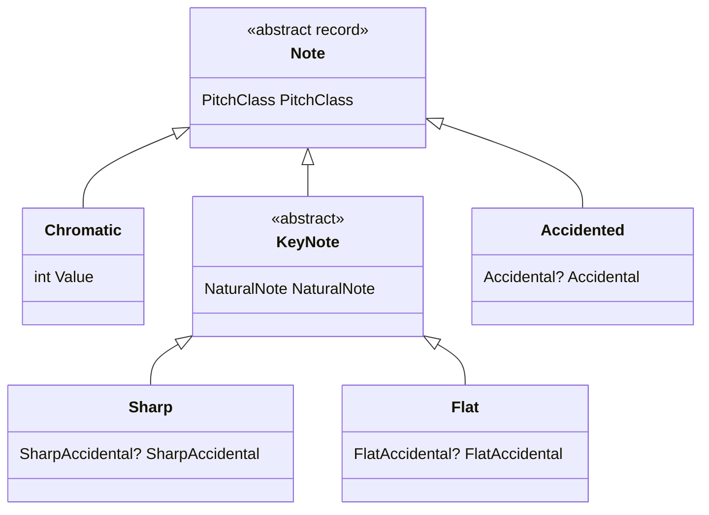

import FretboardC from '../../../../assets/music-theory-ga/l1-fretboard-c.svg';

Todas las demás lecciones se apoyan en cuatro ideas: una **altura** (*pitch*) es una nota a una altura dada, una **clase de altura** (*pitch class*) es esa nota en cualquier octava, un **intervalo** es la distancia entre dos notas y, en una guitarra, cada **traste** añade una de esas distancias, un semitono. Esta lección las recorre en ese orden: primero la idea musical, luego cómo se escribe y después los tipos que usa [Guitar Alchemist](https://github.com/GuitarAlchemist/ga) (GA) para representarla.

Todos los enlaces a GA apuntan al commit [`a826864`](https://github.com/GuitarAlchemist/ga/tree/a826864f3a012cad88e415954bf57eca0ce12aa6) de `GuitarAlchemist/ga`, aquel contra el que se compila el programa del curso.

## Ejecutar el programa de la lección

El programa del curso está en [`code/music-theory-ga`](https://github.com/spareilleux/learn/tree/main/code/music-theory-ga). [`fetch-ga.sh`](https://github.com/spareilleux/learn/blob/79d2198/code/music-theory-ga/fetch-ga.sh) clona GA en ese commit sin el contenido de sus archivos ([`--filter=blob:none`](https://git-scm.com/docs/git-clone#Documentation/git-clone.txt---filterfilter-spec)) y luego extrae solo tres proyectos con [`git sparse-checkout`](https://git-scm.com/docs/git-sparse-checkout). El proyecto C# referencia uno de ellos, `GA.Domain.Core`, como cualquier otro proyecto de una solución ([`GaTheory.csproj`](https://github.com/spareilleux/learn/blob/79d2198/code/music-theory-ga/GaTheory/GaTheory.csproj#L9-L14)). Necesitas el [SDK de .NET 10](https://dotnet.microsoft.com/download/dotnet/10.0) y Git; en Windows, ejecuta los comandos desde Git Bash.

```bash
bash code/music-theory-ga/check.sh                                   # todas las lecciones, comparadas con expected/
dotnet run --project code/music-theory-ga/GaTheory -c Release -- l1  # solo esta lección, después de check.sh
```

Cada tabla imprime el cálculo propio del curso, escrito a partir de las definiciones de los libros de texto en [`Theory.cs`](https://github.com/spareilleux/learn/blob/79d2198/code/music-theory-ga/GaTheory/Theory.cs), junto a la respuesta de GA, y `ok` o `DIFF`. Un `DIFF` no es un fallo del programa: es algo que GA hace de otra manera, y la lección lo explica. [`check.sh`](https://github.com/spareilleux/learn/blob/79d2198/code/music-theory-ga/check.sh) compara toda la salida, líneas `DIFF` incluidas, con [`expected/l1.txt`](https://github.com/spareilleux/learn/blob/79d2198/code/music-theory-ga/expected/l1.txt), en Linux, Windows y macOS en la CI.

## Altura y clase de altura

### La idea

Toca al aire la cuerda E grave y luego la misma nota doce trastes más arriba: la segunda nota suena «igual, solo que más aguda». Los músicos lo llaman **equivalencia de octava**. Una **altura** es una nota concreta, como el E de la cuerda grave; una **clase de altura** es todos los E de todas las octavas ([Open Music Theory, "Pitch and Pitch Class"](https://viva.pressbooks.pub/openmusictheory/chapter/pitch-and-pitch-class/)).

La música occidental divide la octava en doce **semitonos** iguales. Si conoces `TimeOnly` o `LocalTime`, una clase de altura es la hora en un reloj de 12 horas y una altura es una marca de tiempo completa: sumar doce semitonos cambia la octava, no la clase de altura.

### La notación

- La **notación científica (American Standard) de alturas** escribe una altura como un nombre de nota y un número de octava. Los números de octava cambian en C, y el C central es C4 ([Open Music Theory, "ASPN"](https://viva.pressbooks.pub/openmusictheory/chapter/aspn/)).
- Los **números de nota MIDI** cuentan semitonos de 0 a 127: el C central es 60 y A4 (440 Hz) es 69 ([MIDI tuning standard](https://en.wikipedia.org/wiki/MIDI_tuning_standard)). Así, `midi = 12 × (octave + 1) + pitch class`.
- La **notación entera** numera las clases de altura de C = 0 a B = 11. Todas las grafías enarmónicas de una nota comparten su número: B♯ es 0 y D♭ es 1 ([Open Music Theory, "Pitch and Pitch Class"](https://viva.pressbooks.pub/openmusictheory/chapter/pitch-and-pitch-class/)). Para que cada clase de altura ocupe un solo carácter, 10 y 11 se escriben a menudo T y E, como en la tabla de clases de conjuntos de [Open Music Theory, "Set Class and Prime Form"](https://viva.pressbooks.pub/openmusictheory/chapter/set-class-and-prime-form/), donde la escala mayor es `(013568T)`.

La primera tabla del programa convierte las seis cuerdas al aire de una guitarra, el C central, A4 y C♯4:

```text
== Pitches: MIDI number and pitch class (C4 = 60)
pitch    course               GA                   check
E2       midi 40 pc 4         midi 40 pc 4         ok
A2       midi 45 pc 9         midi 45 pc 9         ok
D3       midi 50 pc 2         midi 50 pc 2         ok
G3       midi 55 pc 7         midi 55 pc 7         ok
B3       midi 59 pc 11        midi 59 pc 11        ok
E4       midi 64 pc 4         midi 64 pc 4         ok
C4       midi 60 pc 0         midi 60 pc 0         ok
A4       midi 69 pc 9         midi 69 pc 9         ok
C#4      midi 61 pc 1         midi 61 pc 1         ok
GA prints pitch classes as: 0 1 2 3 4 5 6 7 8 9 T E
```

### En GA

- [`PitchClass`](https://github.com/GuitarAlchemist/ga/blob/a826864f3a012cad88e415954bf57eca0ce12aa6/Common/GA.Domain.Core/Theory/Atonal/PitchClass.cs#L22-L28) es un [`readonly record struct`](https://learn.microsoft.com/dotnet/csharp/language-reference/builtin-types/record) que contiene un `int` de 0 a 11: un value object, como escribirías un `Money` o un `EmailAddress`. Su setter [normaliza](https://github.com/GuitarAlchemist/ga/blob/a826864f3a012cad88e415954bf57eca0ce12aa6/Common/GA.Domain.Core/Theory/Atonal/PitchClass.cs#L197-L201) el valor módulo 12 mediante [`EnsureValueRange(…, normalize: true)`](https://github.com/GuitarAlchemist/ga/blob/a826864f3a012cad88e415954bf57eca0ce12aa6/Common/GA.Core/ValueObjects/ValueObjectUtils.cs#L25-L47), de modo que `PitchClass.FromValue(-1)` es 11: la aritmética de clases de altura nunca sale de la esfera del reloj. `ToString()` [imprime 10 y 11 como T y E](https://github.com/GuitarAlchemist/ga/blob/a826864f3a012cad88e415954bf57eca0ce12aa6/Common/GA.Domain.Core/Theory/Atonal/PitchClass.cs#L83-L88). Cuidado: la clase de altura `E` es B, no la nota E.
- [`Pitch`](https://github.com/GuitarAlchemist/ga/blob/a826864f3a012cad88e415954bf57eca0ce12aa6/Common/GA.Domain.Core/Primitives/Notes/Pitch.cs#L15-L24) es un `abstract record` con una `Octave` y una `PitchClass`, y tres subtipos según cómo se escriba la nota: `Chromatic`, `Sharp` y `Flat`.
- [`MidiNote`](https://github.com/GuitarAlchemist/ga/blob/a826864f3a012cad88e415954bf57eca0ce12aa6/Common/GA.Domain.Core/Primitives/Notes/MidiNote.cs#L39-L41) obtiene la octava y la clase de altura dividiendo entre 12, y [`MidiNote.Create`](https://github.com/GuitarAlchemist/ga/blob/a826864f3a012cad88e415954bf57eca0ce12aa6/Common/GA.Domain.Core/Primitives/Notes/MidiNote.cs#L93-L94) es la fórmula anterior, con [`Octave.Min`](https://github.com/GuitarAlchemist/ga/blob/a826864f3a012cad88e415954bf57eca0ce12aa6/Common/GA.Domain.Core/Primitives/Notes/Octave.cs#L16-L17) = −1.

## Nombres de notas y alteraciones

### La idea

Las siete **notas naturales** C D E F G A B son las teclas blancas de un piano. Entre la mayoría de ellas hay una clase de altura más (una tecla negra), salvo entre E y F y entre B y C, que están a solo un semitono. Una **alteración** sube (♯, sostenido) o baja (♭, bemol) una letra un semitono; los dobles sostenidos (𝄪, escrito `x`) y los dobles bemoles (𝄫) la mueven dos.

Así, una clase de altura tiene varios nombres: C♯ y D♭ son la misma tecla del piano, y también B♯ y C. Son grafías **enarmónicas** ([Open Music Theory, "Pitch and Pitch Class"](https://viva.pressbooks.pub/openmusictheory/chapter/pitch-and-pitch-class/)). Los números de octava siguen a la letra, no al sonido: B♯3 y C4 son la misma tecla, en dos octavas ([Open Music Theory, "ASPN"](https://viva.pressbooks.pub/openmusictheory/chapter/aspn/)). El nombre que eliges depende del contexto: la lección 3 muestra por qué un acorde de C menor se escribe C E♭ G y no C D♯ G.

```text
== Spellings: many names, one pitch class
note     course GA     check
C#       1      1      ok
Db       1      1      ok
B#       0      0      ok
Cb       11     11     ok
E#       5      5      ok
Fb       4      4      ok
Bbb      9      9      ok
Fx       7      7      ok
```

### En GA

[`Note`](https://github.com/GuitarAlchemist/ga/blob/a826864f3a012cad88e415954bf57eca0ce12aa6/Common/GA.Domain.Core/Primitives/Notes/Note.cs#L10-L19) es una jerarquía cerrada de records, la unión discriminada de GA: el equivalente en C# de una [sealed interface](https://docs.oracle.com/en/java/javase/21/language/sealed-classes-and-interfaces.html) de Java con implementaciones record.



- [`Note.Chromatic`](https://github.com/GuitarAlchemist/ga/blob/a826864f3a012cad88e415954bf57eca0ce12aa6/Common/GA.Domain.Core/Primitives/Notes/Note.cs#L39-L58) es una clase de altura sin grafía; se imprime como `C#/Db`.
- [`Note.Sharp`](https://github.com/GuitarAlchemist/ga/blob/a826864f3a012cad88e415954bf57eca0ce12aa6/Common/GA.Domain.Core/Primitives/Notes/Note.cs#L118-L140) y [`Note.Flat`](https://github.com/GuitarAlchemist/ga/blob/a826864f3a012cad88e415954bf57eca0ce12aa6/Common/GA.Domain.Core/Primitives/Notes/Note.cs#L189-L214) son los nombres usados en las tonalidades con sostenidos y con bemoles.
- [`Note.Accidented`](https://github.com/GuitarAlchemist/ga/blob/a826864f3a012cad88e415954bf57eca0ce12aa6/Common/GA.Domain.Core/Primitives/Notes/Note.cs#L262-L269) acepta cualquier [`Accidental`](https://github.com/GuitarAlchemist/ga/blob/a826864f3a012cad88e415954bf57eca0ce12aa6/Common/GA.Domain.Core/Primitives/Notes/Accidental.cs#L12-L50), del triple bemol al triple sostenido. Su clase de altura es la de la letra, tomada de [`NaturalNote.PitchClass`](https://github.com/GuitarAlchemist/ga/blob/a826864f3a012cad88e415954bf57eca0ce12aa6/Common/GA.Domain.Core/Primitives/Notes/NaturalNote.cs#L96-L106), más la alteración, normalizada: así es como `Cb` se convierte en 11.

## Intervalos

### La idea

Un intervalo tiene dos nombres a la vez ([Open Music Theory, "Intervals"](https://viva.pressbooks.pub/openmusictheory/chapter/intervals/)):

- su **número** cuenta letras, incluidos los dos extremos: de C a E hacia arriba es una tercera (C, D, E), sean cuales sean las alteraciones;
- su **cualidad** viene del número de semitonos. Los unísonos, cuartas, quintas y octavas son *justos* (P) y pasan a ser *aumentados* (A) o *disminuidos* (d) cuando son un semitono más anchos o más estrechos. Las segundas, terceras, sextas y séptimas son *mayores* (M) o *menores* (m), a un semitono de distancia, y más allá aumentadas o disminuidas.

Por eso C–D♯ y C–E♭ tienen ambos tres semitonos pero son intervalos distintos: una segunda aumentada y una tercera menor. Dar la vuelta a un intervalo (de C a E hacia arriba, luego de E a C hacia arriba) es una **inversión**: los números suman 9 (una tercera se convierte en sexta), justo sigue siendo justo, mayor pasa a menor y aumentado pasa a disminuido (mismo capítulo, "Intervallic Inversion").

Cuando solo importan las clases de altura, la distancia se reduce a 6 semitonos como máximo: es la **clase de intervalo**, y C–E (4) y E–C (8) son ambos clase de intervalo 4 ([Open Music Theory, "Intervals in Integer Notation"](https://viva.pressbooks.pub/openmusictheory/chapter/intervals-in-integer-notation/)). La lección 4 cuenta clases de intervalo.

```text
== Intervals: name from the letters, size in semitones, interval class
notes    course         GA             check
C-E      M3 4 ic4       M3 4 ic4       ok
C-Eb     m3 3 ic3       m3 3 ic3       ok
C-D#     A2 3 ic3       A2 3 ic3       ok
C-G      P5 7 ic5       P5 7 ic5       ok
C-F#     A4 6 ic6       A4 6 ic6       ok
C-Gb     d5 6 ic6       d5 6 ic6       ok
B-F      d5 6 ic6       d5 6 ic6       ok
E-C      m6 8 ic4       m6 8 ic4       ok
!M3      m6             m6             ok
```

### En GA

- [`Interval.Simple`](https://github.com/GuitarAlchemist/ga/blob/a826864f3a012cad88e415954bf57eca0ce12aa6/Common/GA.Domain.Core/Primitives/Intervals/Interval.Diatonic.Simple.cs#L12-L37) es un record con un `Size` (el número, [`SimpleIntervalSize`](https://github.com/GuitarAlchemist/ga/blob/a826864f3a012cad88e415954bf57eca0ce12aa6/Common/GA.Domain.Core/Primitives/Intervals/SimpleIntervalSize.cs#L70-L93), de 1 a 8, que sabe si es justo y su tamaño mayor o justo en semitonos) y una `Quality` ([`IntervalQuality`](https://github.com/GuitarAlchemist/ga/blob/a826864f3a012cad88e415954bf57eca0ce12aa6/Common/GA.Domain.Core/Primitives/Intervals/IntervalQuality.cs#L29-L35), de −3 para doblemente disminuido a +3 para doblemente aumentado). Sus semitonos son los del tamaño más la cualidad convertida en alteración.
- El operador `!` es [`ToInverse`](https://github.com/GuitarAlchemist/ga/blob/a826864f3a012cad88e415954bf57eca0ce12aa6/Common/GA.Domain.Core/Primitives/Intervals/Interval.Diatonic.Simple.cs#L40-L43): [`9 - Value`](https://github.com/GuitarAlchemist/ga/blob/a826864f3a012cad88e415954bf57eca0ce12aa6/Common/GA.Domain.Core/Primitives/Intervals/SimpleIntervalSize.cs#L124-L125) para el tamaño y la cualidad opuesta.
- [`GetInterval`](https://github.com/GuitarAlchemist/ga/blob/a826864f3a012cad88e415954bf57eca0ce12aa6/Common/GA.Domain.Core/Primitives/Extensions/NoteExtensions.cs#L104-L116) toma el número de las letras y los semitonos de las clases de altura, y luego busca la cualidad en [`DetermineQuality`](https://github.com/GuitarAlchemist/ga/blob/a826864f3a012cad88e415954bf57eca0ce12aa6/Common/GA.Domain.Core/Primitives/Extensions/NoteExtensions.cs#L13-L57), el mismo algoritmo que el [`Theory.Interval`](https://github.com/spareilleux/learn/blob/79d2198/code/music-theory-ga/GaTheory/Theory.cs#L43-L66) del curso. Los métodos de GA son [extension members](https://learn.microsoft.com/dotnet/csharp/whats-new/csharp-14#extension-members) de C# 14 (`extension(Note note1) { … }`).
- [`IntervalClass.FromValue`](https://github.com/GuitarAlchemist/ga/blob/a826864f3a012cad88e415954bf57eca0ce12aa6/Common/GA.Domain.Core/Theory/Atonal/IntervalClass.cs#L44-L52) reduce cualquier número de semitonos a 0–6.

## El mástil y las afinaciones

### La idea

Las cuerdas de una guitarra se numeran desde la que suena más aguda: la cuerda 1 es la E aguda y fina, y la cuerda 6 la E grave. La **afinación estándar** es E2 A2 D3 G3 B3 E4 de la cuerda 6 a la cuerda 1 ([Guitar tunings](https://en.wikipedia.org/wiki/Guitar_tunings)). Cada traste sube la cuerda un semitono, así que la nota de la cuerda *s*, traste *f*, es el número MIDI de la cuerda al aire más *f*. La misma altura aparece en varias cuerdas: C4 está en la cuerda 2 traste 1, la cuerda 3 traste 5 y la cuerda 4 traste 10. El módulo de Streeling [GTR-001 · El mapa del mástil](../../streeling/guitar-studies/gtr-001-the-fretboard-map/) recorre las notas naturales de cada cuerda.

```play
E2
A2
D3
G3
B3
E4
```

El diagrama dibuja los trastes 0 a 12 en afinación estándar, con la cuerda 1 arriba como en la tablatura, y marca cada posición de la clase de altura C con su altura. Hay seis: C3 en la cuerda 6 traste 8 y en la cuerda 5 traste 3, C4 en la cuerda 4 traste 10, la cuerda 3 traste 5 y la cuerda 2 traste 1, y C5 en la cuerda 1 traste 8. Tres posiciones tocan exactamente la misma altura, C4.

<FretboardC role="img" aria-label="Mástil de guitarra en afinación estándar, trastes 0 a 12, cuerda 1 arriba. Clase de altura C: cuerda 6 traste 8 (C3), cuerda 5 traste 3 (C3), cuerda 4 traste 10 (C4), cuerda 3 traste 5 (C4), cuerda 2 traste 1 (C4), cuerda 1 traste 8 (C5)." />

```text
== Standard tuning: string 1 is the highest
string   course     GA         check
1        E4         E4         ok
2        B3         B3         ok
3        G3         G3         ok
4        D3         D3         ok
5        A2         A2         ok
6        E2         E2         ok

== Fretboard: each fret adds one semitone
string/fret  course       GA           check
6/0          E2 40        E2 40        ok
6/3          G2 43        G2 43        ok
5/3          C3 48        C3 48        ok
2/1          C4 60        C4 60        ok
3/5          C4 60        C4 60        ok
1/8          C5 72        C5 72        ok
4/10         C4 60        C4 60        ok

== Where is pitch class C on frets 0-12? (string/fret)
course              6/8 5/3 4/10 3/5 2/1 1/8
GA, Note.Chromatic  6/8 5/3 4/10 3/5 2/1 1/8
GA, Note.Sharp      (none)
```

### En GA

- [`Tuning`](https://github.com/GuitarAlchemist/ga/blob/a826864f3a012cad88e415954bf57eca0ce12aa6/Common/GA.Domain.Core/Instruments/Tuning.cs#L18-L38) se construye a partir de una cadena de alturas: `Tuning.Default` analiza `"E2 A2 D3 G3 B3 E4"`, de grave a agudo, y [`BuildPitchArray`](https://github.com/GuitarAlchemist/ga/blob/a826864f3a012cad88e415954bf57eca0ce12aa6/Common/GA.Domain.Core/Instruments/Tuning.cs#L86-L109) la invierte cuando la primera altura es la más grave, para que el [indexador](https://github.com/GuitarAlchemist/ga/blob/a826864f3a012cad88e415954bf57eca0ce12aa6/Common/GA.Domain.Core/Instruments/Tuning.cs#L66-L79) `tuning[new Str(1)]` sea la cuerda más aguda, como cuentan los guitarristas.
- [`Str`](https://github.com/GuitarAlchemist/ga/blob/a826864f3a012cad88e415954bf57eca0ce12aa6/Common/GA.Domain.Core/Instruments/Primitives/Str.cs#L13-L17) (de 1 a 26) y [`Fret`](https://github.com/GuitarAlchemist/ga/blob/a826864f3a012cad88e415954bf57eca0ce12aa6/Common/GA.Domain.Core/Instruments/Primitives/Fret.cs#L15-L26) (−1 para una cuerda apagada, 0 al aire, hasta 36) son de nuevo value objects.
- [`Fretboard.GetNote`](https://github.com/GuitarAlchemist/ga/blob/a826864f3a012cad88e415954bf57eca0ce12aa6/Common/GA.Domain.Core/Instruments/Primitives/Fretboard.cs#L48-L68) suma el traste a la nota MIDI de la cuerda al aire, como arriba, pero recibe un índice de cuerda empezando en 0: `GetNote(0, 0)` es la cuerda 1.
- [`GetPositionsForNote`](https://github.com/GuitarAlchemist/ga/blob/a826864f3a012cad88e415954bf57eca0ce12aa6/Common/GA.Domain.Core/Instruments/Primitives/Fretboard.cs#L73-L88) compara la nota de cada posición con `Equals`. `GetNote` devuelve un `Note.Chromatic`, y los records de tipos distintos nunca son iguales, así que buscar `Note.Sharp.C` no encuentra nada: la línea `(none)` de arriba.

## Sorpresas encontradas al escribir esta lección

Al escribir las comparaciones aparecieron algunos puntos en los que GA responde otra cosa que la teoría. El programa del curso los conserva como líneas `DIFF`, para que la CI se entere si un commit posterior de GA los cambia; también están en el [diario](../journal/).

```text
== Surprises found while writing this lesson
call                       course       GA           check
Pitch.Flat.DFlat(4)        Db4          D4           DIFF
Pitch.Flat.GFlat(4)        Gb4          A4           DIFF
Pitch.Flat.FFlat(4)        Fb4          G4           DIFF
Pitch.Sharp.TryParse Eb2   rejected     B2           DIFF
Note.Flat.Parse B          B            Bb           DIFF
PitchClass.Parse A         9            10           DIFF
IntervalSize.TryParse x    False        throws ArgumentException DIFF
```

- `Pitch.Flat.DFlat(octave)`, `FFlat` y `GFlat` [construyen D, G y A](https://github.com/GuitarAlchemist/ga/blob/a826864f3a012cad88e415954bf57eca0ce12aa6/Common/GA.Domain.Core/Primitives/Notes/Pitch.cs#L285-L295) en lugar de D♭, F♭ y G♭. Las propiedades `DFlat4` y compañía son correctas; solo los métodos están mal.
- [`PitchParser`](https://github.com/GuitarAlchemist/ga/blob/a826864f3a012cad88e415954bf57eca0ce12aa6/Common/GA.Domain.Core/Primitives/Notes/PitchParser.cs#L20-L25) busca su patrón `([A-G])(#?)(10|11|[0-9])` sin anclas `^…$` e ignora las mayúsculas: en `"Eb2"`, el parser de sostenidos se salta la E y reconoce `b2` como B2.
- [`Note.Flat.TryParse`](https://github.com/GuitarAlchemist/ga/blob/a826864f3a012cad88e415954bf57eca0ce12aa6/Common/GA.Domain.Core/Primitives/Notes/Note.cs#L219-L237) pasa su entrada a mayúsculas *antes* de sustituir `♭` por `b`, y luego trata una `B` final como signo de bemol. Esas dos líneas lo estropean en los dos sentidos: la propia `"B"` se convierte en B♭, y un `"D♭"` auténtico se rechaza, porque la sustitución deja una `b` minúscula donde el `EndsWith("B")`, sensible a las mayúsculas, ya no la reconoce.
- [`PitchClass.TryParse`](https://github.com/GuitarAlchemist/ga/blob/a826864f3a012cad88e415954bf57eca0ce12aa6/Common/GA.Domain.Core/Theory/Atonal/PitchClass.cs#L252-L267) lee `A` y `B` como los dígitos 10 y 11, a propósito: el comentario los llama "common hex-like aliases sometimes used in set notation". La convención existe de verdad; el error está en el orden. Los alias se prueban *antes* que los nombres de notas, así que `"A"` es la clase de altura 10 y la nota A, la clase de altura 9, no se puede analizar en absoluto.
- [`SimpleIntervalSize.TryParse`](https://github.com/GuitarAlchemist/ga/blob/a826864f3a012cad88e415954bf57eca0ce12aa6/Common/GA.Domain.Core/Primitives/Intervals/SimpleIntervalSize.cs#L155-L164) lanza una excepción ante una entrada incorrecta en lugar de devolver `false`, al contrario de lo que pide el contrato de [`IParsable<TSelf>.TryParse`](https://learn.microsoft.com/dotnet/api/system.iparsable-1.tryparse), y [`CompoundIntervalSize.TryParse`](https://github.com/GuitarAlchemist/ga/blob/a826864f3a012cad88e415954bf57eca0ce12aa6/Common/GA.Domain.Core/Primitives/Intervals/CompoundIntervalSize.cs#L101-L110) hace lo mismo. La tabla acorta el nombre: el tipo es `SimpleIntervalSize`.

## Ejercicios

1. ¿Qué altura, número MIDI y clase de altura corresponden a la cuerda 4, traste 7, en afinación estándar?
2. Nombra los intervalos E–B♭ y A–C♯, con su tamaño en semitonos y su clase de intervalo.
3. En la afinación **drop D**, la cuerda 6 se baja a D2 ([Guitar tunings](https://en.wikipedia.org/wiki/Guitar_tunings)). ¿Dónde está la clase de altura D en los trastes 0 a 5? Construye ese mástil con los tipos `Tuning` y `Fretboard` de GA.

<details>
<summary>Soluciones</summary>

1. La cuerda 4 es D3 (MIDI 50); siete trastes más arriba está A3, MIDI 57, clase de altura 9.
2. De E a B♭ hay cinco letras (E F G A B) y 6 semitonos, uno menos que una quinta justa: una quinta disminuida, clase de intervalo 6. De A a C♯ hay tres letras y 4 semitonos: una tercera mayor, clase de intervalo 4.
3. Las cuerdas 6 y 4 al aire, la cuerda 5 traste 5 y la cuerda 2 traste 3. Con GA, una afinación es una colección de alturas analizada ([`Lesson1.cs`](https://github.com/spareilleux/learn/blob/79d2198/code/music-theory-ga/GaTheory/Lesson1.cs#L93-L118)):

   ```csharp
   var dropD = new Fretboard(new Tuning(PitchCollection.Parse("D2 A2 D3 G3 B3 E4")), 5);
   var positions = dropD.GetPositionsForNote(Note.Chromatic.D);
   ```

   ```text
   == Exercise solutions
   question               course               GA                   check
   1. string 4, fret 7    A3 midi 57 pc 9      A3 midi 57 pc 9      ok
   2. E-Bb                d5 6 ic6             d5 6 ic6             ok
   2. A-C#                M3 4 ic4             M3 4 ic4             ok
   3. D in drop D, 0-5    6/0 5/5 4/0 2/3      6/0 5/5 4/0 2/3      ok
   ```

</details>

## Puntos clave

- Una altura es una clase de altura más una octava; con números MIDI, `pitch class = midi % 12` y el C central es 60.
- Un nombre de nota es una letra más alteraciones; varios nombres comparten una clase de altura. GA conserva ambos: `PitchClass` para el número y los records `Note` para la grafía.
- El número de un intervalo viene de las letras y su cualidad de los semitonos; la clase de intervalo olvida tanto la dirección como la octava.
- En una guitarra, una posición es una cuerda y un traste: la altura de la cuerda al aire más un semitono por traste. GA numera las cuerdas desde la más aguda, como los guitarristas.
- Las primitivas de GA son pequeños value objects, `readonly record struct`s que validan o normalizan su rango, y records para las uniones: el mismo modelado que usarías para importes de dinero o identificadores.

## Fuentes

- Mark Gotham et al., [*Open Music Theory*](https://viva.pressbooks.pub/openmusictheory/), versión 2, 2023: capítulos [Pitch and Pitch Class](https://viva.pressbooks.pub/openmusictheory/chapter/pitch-and-pitch-class/), [ASPN](https://viva.pressbooks.pub/openmusictheory/chapter/aspn/), [Intervals](https://viva.pressbooks.pub/openmusictheory/chapter/intervals/), [Intervals in Integer Notation](https://viva.pressbooks.pub/openmusictheory/chapter/intervals-in-integer-notation/), [Set Class and Prime Form](https://viva.pressbooks.pub/openmusictheory/chapter/set-class-and-prime-form/). El libro se publica bajo [CC BY-SA 4.0](https://creativecommons.org/licenses/by-sa/4.0/).
- [MIDI tuning standard](https://en.wikipedia.org/wiki/MIDI_tuning_standard) (MIDI 60 = C4, 69 = A4) y [Guitar tunings](https://en.wikipedia.org/wiki/Guitar_tunings) (afinaciones estándar y drop D, numeración de las cuerdas), Wikipedia.
- GuitarAlchemist/ga en [`a826864`](https://github.com/GuitarAlchemist/ga/tree/a826864f3a012cad88e415954bf57eca0ce12aa6/Common/GA.Domain.Core): `Primitives/Notes`, `Primitives/Intervals`, `Theory/Atonal/PitchClass.cs`, `Instruments`.
