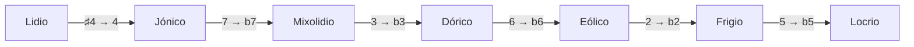

Una escala es un patrón de pasos; si se prescinde de la octava, es también un conjunto de clases de altura, y un conjunto de como mucho doce elementos cabe en doce bits. Esta lección va del patrón al número: cómo se construyen las escalas mayor y menores, por qué transponer una escala es rotar sus bits, qué es un modo y cómo [Guitar Alchemist](https://github.com/GuitarAlchemist/ga) (GA) construye sobre ese único `int`.

Todos los enlaces a GA apuntan al commit [`a826864`](https://github.com/GuitarAlchemist/ga/tree/a826864f3a012cad88e415954bf57eca0ce12aa6). Las salidas proceden del programa del curso (la [lección 1](../01-notes-and-the-fretboard/#ejecutar-el-programa-de-la-lección) explica cómo ejecutarlo):

```bash
dotnet run --project code/music-theory-ga/GaTheory -c Release -- l2
```

## Las escalas como patrones de pasos

### La idea

Toca las teclas blancas de un piano de C al C siguiente o, en la guitarra, la cuerda 5 desde el traste 3: C D E F G A B C. Es la **escala mayor**. Lo que la hace mayor no son sus notas sino las distancias entre ellas: dos tonos, un semitono, tres tonos, un semitono. Empieza el mismo patrón en cualquier nota y obtendrás la escala mayor de esa nota ([Open Music Theory, "Major Scales, Scale Degrees, and Key Signatures"](https://viva.pressbooks.pub/openmusictheory/chapter/major-scales/)).

En una guitarra, un tono son dos trastes y un semitono un traste, así que el patrón es literalmente un recuento de trastes: 2 2 1 2 2 2 1.

Las **escalas menores** empiezan con una tercera más baja ([Open Music Theory, "Minor Scales, Scale Degrees, and Key Signatures"](https://viva.pressbooks.pub/openmusictheory/chapter/minor-scales-scale-degrees-and-key-signatures/)):

| Escala | Pasos (W = 2, H = 1) | En semitonos |
|---|---|---|
| Menor natural | W H W W H W W | 2 1 2 2 1 2 2 |
| Menor armónica | W H W W H 3H H | 2 1 2 2 1 3 1 |
| Menor melódica, ascendente | W H W W W W H | 2 1 2 2 2 2 1 |

El mismo capítulo añade que la menor melódica desciende como la menor natural. Algunas colecciones no diatónicas completan el conjunto usado más abajo ([Open Music Theory, "Collections"](https://viva.pressbooks.pub/openmusictheory/chapter/collections/)): la **pentatónica** (2 2 3 2 3, las teclas negras), la escala de **tonos enteros** (seis tonos) y la escala **octatónica**, que alterna tonos y semitonos y que los músicos de jazz llaman escala **disminuida**. La escala de **blues** de seis notas es la pentatónica menor más una quinta bemol ([Blues scale](https://en.wikipedia.org/wiki/Blues_scale)).

### La notación

Una escala se escribe como sus notas desde la tónica, como sus pasos o como sus intervalos desde la tónica: P1 M2 M3 P4 P5 M6 M7 para la mayor, con los nombres de intervalos de la lección 1. Los músicos abrevian esta última forma en **grados**: `1 2 3 4 5 6 7` para la mayor, `1 2 b3 4 5 b6 b7` para la menor natural, donde `b3` significa «un semitono por debajo de la tercera de la escala mayor».

```text
== The major scale from its steps (2 = whole step, 1 = half step)
           course                 GA                     check
steps      2 2 1 2 2 2 1          2 2 1 2 2 2 1          ok
pcs        0 2 4 5 7 9 E          0 2 4 5 7 9 E          ok
intervals  P1 M2 M3 P4 P5 M6 M7   P1 M2 M3 P4 P5 M6 M7   ok
binary     101010110101           101010110101           ok
id         2741                   2741                   ok
```

### En GA

[`Scale`](https://github.com/GuitarAlchemist/ga/blob/a826864f3a012cad88e415954bf57eca0ce12aa6/Common/GA.Domain.Core/Theory/Tonal/Scales/Scale.cs#L53-L75) se construye a partir de una cadena de nombres de notas: `Scale.Major` es `new("C D E F G A B")` y `Scale.Blues` es `new("C Eb F F# G Bb")`. Una escala expone sus notas, sus `Intervals` desde la primera nota y un `PitchClassSet`, el conjunto no ordenado de sus clases de altura. Las tres escalas menores están [escritas desde A](https://github.com/GuitarAlchemist/ga/blob/a826864f3a012cad88e415954bf57eca0ce12aa6/Common/GA.Domain.Core/Theory/Tonal/Scales/Scale.cs#L116-L121) (`"A B C D E F G#"` para la menor armónica), las demás desde C.

## Una escala es un número de 12 bits

### La idea

Olvida el orden y la octava, y una escala de C mayor es el conjunto de clases de altura `{0, 2, 4, 5, 7, 9, 11}`. Un subconjunto de doce elementos es un campo de bits, exactamente como un enum `[Flags]` o un `EnumSet` de Java: el bit *n* está activado cuando la clase de altura *n* pertenece al conjunto. Hay 2¹² = 4096 conjuntos así, de modo que cada escala, acorde o fragmento melódico, reducido a sus clases de altura, tiene un id de 0 a 4095. El [catálogo de escalas](https://ianring.com/musictheory/scales/) de Ian Ring las numera así; C mayor es la [escala 2741](https://ianring.com/musictheory/scales/2741). El módulo de Streeling [MUS-006 · El universo de las escalas](../../streeling/music/mus-006-the-scale-universe/) parte de la misma idea.

### La notación

Escrito en binario, el bit más bajo está a la derecha, así que la clase de altura 0 (C) es el **último** carácter y B el primero:

| Bit (clase de altura) | 11 | 10 | 9 | 8 | 7 | 6 | 5 | 4 | 3 | 2 | 1 | 0 |
|---|---|---|---|---|---|---|---|---|---|---|---|---|
| Nota | B | A♯ | A | G♯ | G | F♯ | F | E | D♯ | D | C♯ | C |
| C mayor | 1 | 0 | 1 | 0 | 1 | 0 | 1 | 1 | 0 | 1 | 0 | 1 |

`101010110101` es 2048 + 512 + 128 + 32 + 16 + 4 + 1 = 2741. El curso calcula el id solo a partir de los pasos, con [`Theory.FromSteps`](https://github.com/spareilleux/learn/blob/79d2198/code/music-theory-ga/GaTheory/Theory.cs#L114-L124), y lo compara con el de GA para ocho escalas con tónica en C:

```text
== Scale ids (bit n = pitch class n, root on C)
scale            course GA     check
major            2741   2741   ok
natural minor    1453   1453   ok
harmonic minor   2477   2477   ok
melodic minor    2733   2733   ok
major pentatonic 661    661    ok
blues            1257   1257   ok
whole tone       1365   1365   ok
diminished       2925   2925   ok
Scale.NaturalMinor as GA stores it (A B C D E F G): id 2741
```

La última línea merece una segunda mirada: la escala menor natural de GA, escrita desde A, tiene **el mismo id que C mayor**. A menor y C mayor usan las mismas siete notas; son tonalidades *relativas* ([Open Music Theory, "Minor Scales"](https://viva.pressbooks.pub/openmusictheory/chapter/minor-scales-scale-degrees-and-key-signatures/)). Un conjunto de clases de altura no tiene primera nota, así que el id por sí solo no puede distinguirlas. Por eso el programa [transpone las escalas menores de GA hacia C](https://github.com/spareilleux/learn/blob/79d2198/code/music-theory-ga/GaTheory/Lesson2.cs#L37-L41) antes de comparar.

### En GA

[`PitchClassSetId`](https://github.com/GuitarAlchemist/ga/blob/a826864f3a012cad88e415954bf57eca0ce12aa6/Common/GA.Domain.Core/Theory/Atonal/PitchClassSetId.cs#L8-L28) es un `readonly record struct` en torno a un `int` de 0 a 4095, con las operaciones de conjuntos como operaciones de bits:

- [`FromPitchClasses`](https://github.com/GuitarAlchemist/ga/blob/a826864f3a012cad88e415954bf57eca0ce12aa6/Common/GA.Domain.Core/Theory/Atonal/PitchClassSetId.cs#L208-L217) combina con OR `1 << pc.Value` para cada clase de altura;
- `Cardinality` es [`BitOperations.PopCount`](https://learn.microsoft.com/dotnet/api/system.numerics.bitoperations.popcount), `Complement` es `Value ^ 0xFFF` e `IsScale` es `(Value & 1) == 1`: para GA, cualquier conjunto que contenga C es una escala;
- [`BinaryValue`](https://github.com/GuitarAlchemist/ga/blob/a826864f3a012cad88e415954bf57eca0ce12aa6/Common/GA.Domain.Core/Theory/Atonal/PitchClassSetId.cs#L40) es `Convert.ToString(Value, 2).PadLeft(12, '0')`, la cadena de arriba.

[`PitchClassSet`](https://github.com/GuitarAlchemist/ga/blob/a826864f3a012cad88e415954bf57eca0ce12aa6/Common/GA.Domain.Core/Theory/Atonal/PitchClassSet.cs#L351) envuelve el id con propiedades más ricas, e incluso enlaza cada conjunto con la página de Ian Ring: `ScalePageUrl` es `https://ianring.com/musictheory/scales/{Id.Value}`.

## Transponer es rotar los bits

### La idea

Transponer una escala mueve todas las notas el mismo número de semitonos: D mayor es C mayor subida 2. En clases de altura, `pc → (pc + n) mod 12`. En el campo de bits, sumar *n* a cada índice desplaza cada bit *n* posiciones a la izquierda, y los bits que pasan más allá de B vuelven a entrar por la derecha, en C: un **desplazamiento circular** sobre doce bits.

```text
== Transposing is rotating the bits
major on   course                     GA                         check
T0 C       2741 101010110101          2741 101010110101          ok
T2 D       2774 101011010110          2774 101011010110          ok
T7 G       2773 101011010101          2773 101011010101          ok
```

Compara `101010110101` (C) con `101011010110` (D): el patrón se ha movido dos posiciones a la izquierda, y los dos `10` iniciales han dado la vuelta hasta el final.

### La notación

La teoría de conjuntos escribe la transposición de *n* semitonos como **T*n*** ([Open Music Theory, "Pitch-Class Sets, Normal Order, and Transformations"](https://viva.pressbooks.pub/openmusictheory/chapter/pc-sets-normal-order-and-transformations/)): D mayor es T2 de C mayor, G mayor T7.

### En GA

[`PitchClassSetId.Transpose`](https://github.com/GuitarAlchemist/ga/blob/a826864f3a012cad88e415954bf57eca0ce12aa6/Common/GA.Domain.Core/Theory/Atonal/PitchClassSetId.cs#L78-L84) es la rotación, escrita a mano sobre doce bits porque [`BitOperations.RotateLeft`](https://learn.microsoft.com/dotnet/api/system.numerics.bitoperations.rotateleft) solo rota palabras completas de 32 o 64 bits:

```csharp
var n = (semitones % 12 + 12) % 12;
var v = (uint)Value & Mask12;
var rot = ((v << n) | (v >> (12 - n))) & Mask12;
```

La línea siguiente declara `Rotate(count) => Transpose(count)`, con el comentario "Rotation of PC set is transposition". Tenlo en cuenta para la sección siguiente: rotar los bits *no* es lo mismo que rotar la escala hacia una nueva nota inicial.

## Modos

### La idea

Toca de nuevo las teclas blancas, pero empieza y termina en D: D E F G A B C D. Las mismas notas que C mayor, otra nota de reposo y otro sonido, más oscuro, porque la tercera sobre D es menor. Es el **modo dórico**. Los siete **modos diatónicos** son las siete rotaciones de la escala mayor, cada una con su propia tónica ([Open Music Theory, "Diatonic Modes"](https://viva.pressbooks.pub/openmusictheory/chapter/diatonic-modes/)): las notas blancas desde C (jónico), D (dórico), E (frigio), F (lidio), G (mixolidio), A (eólico, la menor natural) y B (locrio).

Para comparar modos, ponlos sobre la misma tónica. Rotar el patrón de pasos hace justo eso: el dórico es 2 1 2 2 2 1 2, el patrón mayor empezado en su segundo paso. Como id, el modo dórico es el conjunto de las teclas blancas transpuesto para que D caiga en 0, es decir `T10`, o T−2, de 2741.

```text
== Modes of the major scale: rotate, then transpose back to 0
mode         course                 GA                     check
Ionian       2741 0 2 4 5 7 9 E     2741 0 2 4 5 7 9 E     ok
Dorian       1709 0 2 3 5 7 9 T     1709 0 2 3 5 7 9 T     ok
Phrygian     1451 0 1 3 5 7 8 T     1451 0 1 3 5 7 8 T     ok
Lydian       2773 0 2 4 6 7 9 E     2773 0 2 4 6 7 9 E     ok
Mixolydian   1717 0 2 4 5 7 9 T     1717 0 2 4 5 7 9 T     ok
Aeolian      1453 0 2 3 5 7 8 T     1453 0 2 3 5 7 8 T     ok
Locrian      1387 0 1 3 5 6 8 T     1387 0 1 3 5 6 8 T     ok
```

El lidio sobre C (2773) tiene el mismo id que G mayor (T7 arriba): C lidio usa las notas de G mayor. El módulo de Streeling [MUS-006](../../streeling/music/mus-006-the-scale-universe/) describe un modo como un "circular left shift by the distance to the next scale tone"; con bit *n* = clase de altura *n*, un desplazamiento a la izquierda de 2 da D **mayor** (2774), y hace falta el desplazamiento opuesto, T−2, para obtener D dórico sobre C (1709).

### La notación

Los modos se escriben como grados comparados con la escala mayor, o con la menor natural para los modos con tercera menor. Cada modo tiene entonces uno o dos grados **característicos**: el dórico es menor con un 6 elevado, el frigio menor con un 2 rebajado, el lidio mayor con un 4 elevado, el mixolidio mayor con un 7 rebajado y el locrio menor con el 2 y el 5 rebajados ([Open Music Theory, "Introduction to Diatonic Modes and the Chromatic Scale"](https://viva.pressbooks.pub/openmusictheory/chapter/intro-to-diatonic-modes-and-the-chromatic-scale/)). El mismo capítulo ordena los modos del más brillante al más oscuro. La tabla de arriba muestra por qué esa ordenación es tan regular: del lidio al locrio, cada modo rebaja exactamente una nota del anterior.



GA imprime esas fórmulas y marca los grados característicos con `>`:

```text
GA's formulas (intervals from the mode's root):
  Ionian       1   2   3   4   5   6   7
  Dorian       1   2  b3   4   5 >♮6  b7
  Phrygian     1 >b2  b3   4   5  b6  b7
  Lydian       1   2   3 >♯4   5   6   7
  Mixolydian   1   2   3   4   5   6 >b7
  Aeolian      1   2  b3   4   5  b6  b7
  Locrian      1 >b2  b3   4 >b5  b6  b7
```

Las marcas `>` coinciden con los grados característicos del libro de texto en los siete modos.

### En GA

- [`MajorScaleMode`](https://github.com/GuitarAlchemist/ga/blob/a826864f3a012cad88e415954bf57eca0ce12aa6/Common/GA.Domain.Core/Theory/Tonal/Modes/Diatonic/MajorScaleMode.cs#L16) es un modo de `Scale.Major` para un grado de 1 a 7. Sus notas vienen de [`NotesByRotation`](https://github.com/GuitarAlchemist/ga/blob/a826864f3a012cad88e415954bf57eca0ce12aa6/Common/GA.Domain.Core/Theory/Tonal/Modes/ScaleMode.cs#L111-L124), que rota la *lista de notas*, no los bits: las notas del dórico son D E F G A B C.
- [`ScaleMode.RefMode`](https://github.com/GuitarAlchemist/ga/blob/a826864f3a012cad88e415954bf57eca0ce12aa6/Common/GA.Domain.Core/Theory/Tonal/Modes/ScaleMode.cs#L38-L44) es el eólico cuando el modo contiene una tercera menor y el jónico en caso contrario: las dos referencias del libro de texto.
- [`ModeFormula`](https://github.com/GuitarAlchemist/ga/blob/a826864f3a012cad88e415954bf57eca0ce12aa6/Common/GA.Domain.Core/Primitives/Formulas/ModeFormula.cs#L27-L59) empareja la cualidad de cada intervalo con la cualidad del modo de referencia para el mismo número; un intervalo es característico cuando [las dos cualidades difieren](https://github.com/GuitarAlchemist/ga/blob/a826864f3a012cad88e415954bf57eca0ce12aa6/Common/GA.Domain.Core/Primitives/Intervals/ScaleModeIntervalBase.cs#L27-L57), y `Print` añade el `>` y, para la sexta mayor del dórico frente al `b6` de la menor, un becuadro.

## ¿Cuántos modos tiene una escala?

### La idea

Una escala de siete notas tiene siete rotaciones, pero no todas las escalas tienen tantos modos distintos como notas. La escala de tonos enteros es igual desde cualquier nota: un modo. La escala octatónica se repite cada tres semitonos: dos modos. La pentatónica tiene cinco ([Open Music Theory, "Collections"](https://viva.pressbooks.pub/openmusictheory/chapter/collections/)). El curso cuenta los modos de una escala como sus rotaciones distintas llevadas a 0 ([`Theory.Modes`](https://github.com/spareilleux/learn/blob/79d2198/code/music-theory-ga/GaTheory/Theory.cs#L196-L198)).

```text
== How many modes does a scale have?
scale            course GA     check
major            7      7      ok
natural minor    7      7      ok
harmonic minor   7      14     DIFF
melodic minor    7      7      ok
major pentatonic 5      5      ok
blues            6      24     DIFF
whole tone       1      1      ok
diminished       2      2      ok
```

### En GA

`PitchClassSet.ModalFamily` responde 14 para la menor armónica y 24 para el blues. Una [`ModalFamily`](https://github.com/GuitarAlchemist/ga/blob/a826864f3a012cad88e415954bf57eca0ce12aa6/Common/GA.Domain.Core/Theory/Atonal/ModalFamily.cs#L108-L131) no se construye a partir de rotaciones: GA toma todos los conjuntos que contienen 0, los agrupa por tamaño y por **vector interválico** (el recuento de cada intervalo que contienen, lección 4) y llama familia a cada grupo. Las rotaciones siempre comparten vector, así que una familia contiene los modos, pero otros conjuntos también pueden compartirlo:

- **menor armónica** (7 + 7): su imagen especular, 1 2 3 4 5 b6 7, la escala *mayor armónica* (el propio `Scale.HarmonicMajor` de GA), tiene los mismos intervalos en orden inverso, y por tanto el mismo vector y siete rotaciones más;
- **blues** (6 + 6 + 12): sus seis rotaciones, las seis de su imagen especular y doce conjuntos de otra clase de conjuntos con el mismo vector, una *relación Z* (lección 4).

Las otras seis escalas de la tabla son su propia imagen especular y no tienen pareja relacionada por Z, así que para ellas los dos recuentos coinciden. Ninguna respuesta es incorrecta, pero el nombre sugiere rotaciones, y quien cuente en GA los «modos de la menor armónica» obtiene el doble que el libro de texto.

## Otras operaciones sobre los bits

El **complemento** de un conjunto son todas las clases de altura que no contiene. El complemento de las teclas blancas son las teclas negras, que forman una colección pentatónica ([Open Music Theory, "Collections"](https://viva.pressbooks.pub/openmusictheory/chapter/collections/)). La **inversión** I0 lleva cada clase de altura *n* a −*n* mod 12, la imagen especular en torno a C; la lección 4 la usa para agrupar acordes.

```text
== Other operations on the bits
major        course                 GA                     check
complement   1354 1 3 6 8 T         1354 1 3 6 8 T         ok
inversion I0 1451 0 1 3 5 7 8 T     1451 0 1 3 5 7 8 T     ok
contains 0   True                   True                   ok
```

La inversión de C mayor es 1451, que también es C frigio en la tabla de modos: la escala mayor es su propia imagen especular (C mayor reflejada en torno a D devuelve C mayor), así que su inversión es uno de sus modos. En GA, [`Complement`](https://github.com/GuitarAlchemist/ga/blob/a826864f3a012cad88e415954bf57eca0ce12aa6/Common/GA.Domain.Core/Theory/Atonal/PitchClassSetId.cs#L26-L28) es un XOR, e `Inverse` llama a [`MirrorValue`](https://github.com/GuitarAlchemist/ga/blob/a826864f3a012cad88e415954bf57eca0ce12aa6/Common/GA.Domain.Core/Theory/Atonal/PitchClassSetId.cs#L178-L191), que lleva el bit *i* al bit (12 − *i*) mod 12.

```text
== Counting
sets                   course GA     check
all subsets of 12      4096   4096   ok
containing pc 0        2048   2048   ok
```

La mitad de los conjuntos contienen C, así que [`Scale.Items`](https://github.com/GuitarAlchemist/ga/blob/a826864f3a012cad88e415954bf57eca0ce12aa6/Common/GA.Domain.Core/Theory/Tonal/Scales/Scale.cs#L93-L97) tiene 2048 entradas, desde la nota C sola hasta la escala cromática. La definición de escala de GA es deliberadamente amplia; MUS-006 discute criterios más estrictos.

## Ejercicios

1. Calcula el id y la forma binaria de la escala pentatónica menor de C, pasos 3 2 2 3 2.
2. ¿Qué modo de la escala mayor tiene el id 1717?
3. Toma el complemento de la escala pentatónica mayor (661). ¿Qué escala mayor es?

<details>
<summary>Soluciones</summary>

1. Las clases de altura son 0 3 5 7 10: 1 + 8 + 32 + 128 + 1024 = **1193**, `010010101001`. MUS-006 llega al mismo número.
2. 1717 es 0 2 4 5 7 9 T: una escala mayor con el 7 rebajado, **mixolidio**. Desde los pasos, es la rotación que empieza en el quinto grado.
3. 661 es 0 2 4 7 9; su complemento es 1 3 5 6 8 T E, siete notas. Bajado un semitono, eso es 0 2 4 5 7 9 E, C mayor, así que el complemento es la escala de **F♯ (G♭) mayor**, T6 de C mayor. De nuevo las teclas negras y las blancas: el subconjunto pentatónico de C mayor y G♭ mayor no comparten ninguna nota.

```text
== Exercise solutions
question               course                 GA                     check
1. minor pentatonic    1193 010010101001      1193 010010101001      ok
2. mode 1717           Mixolydian             Mixolydian             ok
3. complement of 661   1 3 5 6 8 T E = T6     1 3 5 6 8 T E = T6     ok
```

El lado GA de cada respuesta está en [`Lesson2.cs`](https://github.com/spareilleux/learn/blob/79d2198/code/music-theory-ga/GaTheory/Lesson2.cs#L91-L106): `PitchClassSet.Parse("0357T")`, una búsqueda en `MajorScaleMode.Items` y `Scale.MajorPentatonic.PitchClassSet.Complement`.

</details>

## Puntos clave

- Una escala es un patrón de pasos desde una tónica; la escala mayor es 2 2 1 2 2 2 1, un recuento de trastes sobre una cuerda.
- Sin su tónica ni su octava, una escala es un conjunto de clases de altura, y ese conjunto es un número de 12 bits: C mayor es 2741. El `PitchClassSetId` de GA es ese `int`, con `PopCount`, XOR y desplazamientos como operaciones de conjuntos.
- Transponer es un desplazamiento circular sobre doce bits. Un modo es una rotación de las *notas*: para compararlo con otros modos, transponlo de vuelta a 0 (el dórico es T−2 de las teclas blancas, 1709).
- Del lidio al locrio, cada modo rebaja un grado del anterior; el `ModeFormula` de GA marca los grados característicos respecto al jónico o al eólico.
- Un id no conoce su tónica: A menor y C mayor son ambos 2741. La `ModalFamily` de GA agrupa los conjuntos por vector interválico, lo que es más amplio que las rotaciones: 14 «modos» para la menor armónica, 24 para el blues.

## Fuentes

- Mark Gotham et al., [*Open Music Theory*](https://viva.pressbooks.pub/openmusictheory/), versión 2, 2023, [CC BY-SA 4.0](https://creativecommons.org/licenses/by-sa/4.0/): capítulos [Major Scales, Scale Degrees, and Key Signatures](https://viva.pressbooks.pub/openmusictheory/chapter/major-scales/), [Minor Scales, Scale Degrees, and Key Signatures](https://viva.pressbooks.pub/openmusictheory/chapter/minor-scales-scale-degrees-and-key-signatures/), [Introduction to Diatonic Modes and the Chromatic Scale](https://viva.pressbooks.pub/openmusictheory/chapter/intro-to-diatonic-modes-and-the-chromatic-scale/), [Diatonic Modes](https://viva.pressbooks.pub/openmusictheory/chapter/diatonic-modes/), [Collections](https://viva.pressbooks.pub/openmusictheory/chapter/collections/), [Pitch-Class Sets, Normal Order, and Transformations](https://viva.pressbooks.pub/openmusictheory/chapter/pc-sets-normal-order-and-transformations/).
- Ian Ring, [*A Study of Musical Scales*](https://ianring.com/musictheory/scales/), y la [escala 2741](https://ianring.com/musictheory/scales/2741) (la numeración de esta lección).
- [Blues scale](https://en.wikipedia.org/wiki/Blues_scale), Wikipedia (escala de blues hexatónica).
- GuitarAlchemist/ga en [`a826864`](https://github.com/GuitarAlchemist/ga/tree/a826864f3a012cad88e415954bf57eca0ce12aa6/Common/GA.Domain.Core): `Theory/Atonal/PitchClassSetId.cs`, `PitchClassSet.cs`, `ModalFamily.cs`, `Theory/Tonal/Scales/Scale.cs`, `Theory/Tonal/Modes`, `Primitives/Formulas/ModeFormula.cs`.
