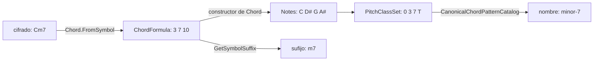

import Voicings from '../../../../assets/music-theory-ga/l3-voicings.svg';

Un cifrado de acorde como `Cm7` es un pequeño lenguaje: una fundamental, una cualidad, extensiones. Una forma de acorde de guitarra como `x32010` es otro. Esta lección analiza los dos: qué significa el cifrado, qué notas nombra y cómo escribirlas, qué es una inversión y cómo una forma sobre seis cuerdas se convierte en un conjunto de clases de altura y de nuevo en un nombre. En cada paso compara el libro de texto con [Guitar Alchemist](https://github.com/GuitarAlchemist/ga) (GA), y aquí los dos discrepan más a menudo que en las dos primeras lecciones.

Todos los enlaces a GA apuntan al commit [`a826864`](https://github.com/GuitarAlchemist/ga/tree/a826864f3a012cad88e415954bf57eca0ce12aa6). Las salidas proceden de:

```bash
dotnet run --project code/music-theory-ga/GaTheory -c Release -- l3
```

## Tríadas y acordes de séptima

### La idea

Una **tríada** son tres notas que se pueden apilar en terceras: una **fundamental**, una **tercera** por encima y una **quinta** por encima de la fundamental. Su **cualidad** viene de esos dos intervalos: una tercera mayor y una quinta justa forman una tríada **mayor**, una tercera menor y una quinta justa una tríada **menor**; una tercera menor y una quinta disminuida forman una tríada **disminuida**, una tercera mayor y una quinta aumentada una **aumentada** ([Open Music Theory, "Triads"](https://viva.pressbooks.pub/openmusictheory/chapter/triads/)). El módulo de Streeling [MUS-001 · ¿Qué es un acorde?](../../streeling/music/mus-001-what-is-a-chord/) construye las tríadas mayor y menor de la misma manera.

Apila una tercera más y obtienes un **acorde de séptima**. Cinco cualidades son habituales: séptima mayor (tríada mayor, séptima mayor), séptima de dominante (tríada mayor, séptima menor), séptima menor, séptima semidisminuida (tríada disminuida, séptima menor) y séptima disminuida (*fully diminished*) ([Open Music Theory, "Seventh Chords"](https://viva.pressbooks.pub/openmusictheory/chapter/seventh-chords/)). Apilar más da novenas, oncenas y trecenas.

### La notación

Un cifrado de acorde es una letra de fundamental seguida de sufijos ([Open Music Theory, "Chord Symbols"](https://viva.pressbooks.pub/openmusictheory/chapter/chord-symbols/)):

| Cifrado | Significado | Semitonos sobre la fundamental |
|---|---|---|
| `C` | tríada mayor: no se añade nada | 0 4 7 |
| `Cm`, `Cdim` o `C°`, `Caug` o `C+` | menor, disminuida, aumentada | 0 3 7, 0 3 6, 0 4 8 |
| `Csus4` (`Csus`), `Csus2` | la tercera sustituida por una cuarta o una segunda | 0 5 7, 0 2 7 |
| `C6` | tríada mayor más una sexta mayor | 0 4 7 9 |
| `C7` | séptima de dominante: un 7 a secas es una séptima **menor** | 0 4 7 10 |
| `Cmaj7` (`CΔ7`), `Cm7` | séptima mayor, séptima menor | 0 4 7 11, 0 3 7 10 |
| `Cm7♭5` (`Cø7`), `Cdim7` (`C°7`) | semidisminuido, disminuido | 0 3 6 10, 0 3 6 9 |
| `C9` | séptima de dominante más una novena mayor | 0 4 7 10 14 |
| `Cadd9` | tríada mayor más una novena, **sin** séptima | 0 4 7 14 |

El mismo capítulo enuncia las dos convenciones por defecto que confunden a los principiantes: una séptima añadida a una tríada es menor salvo que se indique `maj`, y `C9` implica esa séptima mientras que `Cadd9` no. Una novena es una octava más una segunda, así que 14 semitonos son la clase de altura 2.

```text
== Chord symbols on C: pitch classes
symbol   course         GA             check
C        0 4 7          0 4 7          ok
Cm       0 3 7          0 3 7          ok
Cdim     0 3 6          0 3 6          ok
Caug     0 4 8          0 4 8          ok
Csus2    0 2 7          0 2 7          ok
Csus4    0 5 7          0 5 7          ok
C6       0 4 7 9        0 4 7 9        ok
C7       0 4 7 T        0 4 7 T        ok
Cmaj7    0 4 7 E        0 4 7 E        ok
Cm7      0 3 7 T        0 3 7 T        ok
Cm7b5    0 3 6 T        0 3 6 T        ok
Cdim7    0 3 6 9        0 3 6 9        ok
C9       0 2 4 7 T      0 2 4 7 T      ok
Cadd9    0 2 4 7        0 2 4 7        ok
```

### En GA

Pasar de un cifrado a notas y volver atraviesa cuatro tipos de GA:



- [`Chord.FromSymbol`](https://github.com/GuitarAlchemist/ga/blob/a826864f3a012cad88e415954bf57eca0ce12aa6/Common/GA.Domain.Core/Theory/Harmony/Chord.cs#L75-L91) separa la fundamental del sufijo con una expresión regular, y luego [`ParseSuffix`](https://github.com/GuitarAlchemist/ga/blob/a826864f3a012cad88e415954bf57eca0ce12aa6/Common/GA.Domain.Core/Theory/Harmony/Chord.cs#L110-L141) es una expresión `switch` sobre el sufijo en minúsculas: `"m7b5" or "ø7"`, `"dim7" or "°7"`, y así sucesivamente, una rama por tipo de acorde. Cualquier otra cosa lanza una excepción.
- Cada rama devuelve una [`ChordFormula`](https://github.com/GuitarAlchemist/ga/blob/a826864f3a012cad88e415954bf57eca0ce12aa6/Common/GA.Domain.Core/Theory/Harmony/ChordFormula.cs#L121-L137), una lista con nombre de intervalos en semitonos sobre la fundamental (la fundamental misma está implícita): `FromSemitones("Half Diminished 7th", 3, 6, 10)`.
- El parser y el curso coinciden en los catorce cifrados.

## De las notas de vuelta a un cifrado

### La idea

Nombrar un acorde es el problema inverso: dadas las notas, encontrar la fundamental y el sufijo. Lo deciden los intervalos sobre la fundamental, y la diferencia entre dos acordes puede ser un solo semitono: `C7` y `Cmaj7` solo difieren en B♭ frente a B.

### En GA

GA tiene dos caminos de vuelta, y no coinciden.

**`ChordFormula.GetSymbolSuffix`** deduce una cualidad y luego una extensión a partir de los intervalos de la fórmula:

```text
== Pitch classes back to a symbol: GA's ChordFormula.GetSymbolSuffix
symbol   course   GA       check
C        (major)  (major)  ok
Cm       m        m        ok
Cdim     dim      dim      ok
Caug     aug      aug      ok
Csus2    sus2     sus2     ok
Csus4    sus4     sus4     ok
C6       6        6        ok
C7       7        7        ok
Cmaj7    maj7     7        DIFF
Cm7      m7       m7       ok
Cm7b5    m7b5     dim7     DIFF
Cdim7    dim7     dim6     DIFF
C9       9        9        ok
Cadd9    add9     add9     ok
```

Tres de los cinco acordes de séptima vuelven con el cifrado de otro acorde. El enum [`ChordQuality`](https://github.com/GuitarAlchemist/ga/blob/a826864f3a012cad88e415954bf57eca0ce12aa6/Common/GA.Domain.Core/Theory/Harmony/ChordQuality.cs#L10-L23) tiene los miembros `Major7`, `Minor7`, `HalfDiminished` y `Diminished7`, pero [`DetermineQuality`](https://github.com/GuitarAlchemist/ga/blob/a826864f3a012cad88e415954bf57eca0ce12aa6/Common/GA.Domain.Core/Theory/Harmony/ChordFormula.cs#L172-L214) nunca los devuelve: solo conoce `Suspended`, `Dominant` (tercera mayor y séptima menor), `Diminished`, `Augmented`, `Minor`, `Major` y `Other`. Después, [`GetSymbolSuffix`](https://github.com/GuitarAlchemist/ga/blob/a826864f3a012cad88e415954bf57eca0ce12aa6/Common/GA.Domain.Core/Theory/Harmony/ChordFormula.cs#L299-L325) concatena un sufijo de cualidad y un sufijo de extensión:

- `Cmaj7` es `Major` (sin séptima menor, luego no es dominante) más `Seventh`: `"" + "7"`, el cifrado del acorde de séptima de dominante;
- `Cm7b5` es `Diminished` más `Seventh`: `"dim" + "7"`, el cifrado del acorde *totalmente* disminuido;
- `Cdim7` es `Diminished`, y [`DetermineExtension`](https://github.com/GuitarAlchemist/ga/blob/a826864f3a012cad88e415954bf57eca0ce12aa6/Common/GA.Domain.Core/Theory/Harmony/ChordFormula.cs#L216-L294) lee su intervalo de 9 semitonos como una sexta: `"dim6"`. Nueve semitonos son una sexta mayor *o* una séptima disminuida; solo la grafía (B𝄫 en lugar de A) dice cuál, y una fórmula en semitonos no tiene grafía. La sección siguiente vuelve sobre esto.

Los miembros que `DetermineQuality` nunca devuelve no están sin usar en el resto de GA, y los cifrados correctos ya están escritos dos veces: [`CadenceChordParser`](https://github.com/GuitarAlchemist/ga/blob/a826864f3a012cad88e415954bf57eca0ce12aa6/Common/GA.Domain.Services/Chords/Parsing/CadenceChordParser.cs#L11-L14) hace corresponder `"maj7"`, `"m7b5"` y `"dim7"` con `Major7`, `HalfDiminished` y `Diminished7`, y el [`DslCommand`](https://github.com/GuitarAlchemist/ga/blob/a826864f3a012cad88e415954bf57eca0ce12aa6/Common/GA.Business.DSL/Types/DslCommand.fs#L227-L230) en F# los vuelve a imprimir como `maj7`, `m7`, `dim7` y `ø7`, los cifrados del libro de texto: Open Music Theory escribe F∅7 para el acorde semidisminuido y Fo7 para el totalmente disminuido (["Seventh Chords"](https://viva.pressbooks.pub/openmusictheory/chapter/seventh-chords/)). La tabla existe en el mismo commit; `ChordFormula` simplemente nunca llega hasta ella.

**`CanonicalChordPatternCatalog`** es una lista escrita a mano de patrones de intervalos con nombres y prioridades, y [`TryFindExact`](https://github.com/GuitarAlchemist/ga/blob/a826864f3a012cad88e415954bf57eca0ce12aa6/Common/GA.Domain.Core/Theory/Harmony/CanonicalChordPatternCatalog.cs#L165-L177) devuelve el primer patrón, por prioridad, cuyos intervalos coinciden exactamente. Nombra correctamente los catorce acordes:

```text
== GA's recognition catalog (CanonicalChordPatternCatalog.TryFindExact)
  C       0,4,7        major-triad
  Cm      0,3,7        minor-triad
  Cdim    0,3,6        diminished-triad
  Caug    0,4,8        augmented-triad
  Csus2   0,2,7        sus2
  Csus4   0,5,7        sus4
  C6      0,4,7,9      major-6
  C7      0,4,7,10     dominant-7
  Cmaj7   0,4,7,11     major-7
  Cm7     0,3,7,10     minor-7
  Cm7b5   0,3,6,10     half-diminished-7
  Cdim7   0,3,6,9      diminished-7
  C9      0,2,4,7,10   dominant-9
  Cadd9   0,2,4,7      add-9
```

Leer [el catálogo](https://github.com/GuitarAlchemist/ga/blob/a826864f3a012cad88e415954bf57eca0ce12aa6/Common/GA.Domain.Core/Theory/Harmony/CanonicalChordPatternCatalog.cs#L45-L112) revela cuatro conjuntos de intervalos listados dos veces con nombres distintos: `9-sus4` y `dominant-11` (0 2 5 7 10), `major-6-add-9` y `6-9`, `minor-6-add-9` y `minor-6-9`, `augmented-7` y `dominant-7-sharp-5` (0 4 8 10). Dos nombres para un mismo conjunto de clases de altura es normal en música, pero con una coincidencia exacta por prioridad, `dominant-11`, `6-9`, `minor-6-9` y `dominant-7-sharp-5` nunca pueden devolverse.

## Escribir los acordes

### La idea

Un acorde por terceras usa **una letra sí y otra no**: C E G, D F A, B D F. Para escribir un acorde, anota esas letras desde la fundamental y añade las alteraciones que dan a cada intervalo su cualidad ([Open Music Theory, "Triads", "Spelling Triads"](https://viva.pressbooks.pub/openmusictheory/chapter/triads/)). Así, C menor es C E♭ G, nunca C D♯ G: D♯ está sobre la letra de una segunda, y C–D♯ es una segunda aumentada, no una tercera menor (lección 1). Una séptima disminuida sobre C necesita una letra B para su séptima, rebajada dos veces: C E♭ G♭ B𝄫.

El curso escribe los acordes con [`Theory.Spell`](https://github.com/spareilleux/learn/blob/79d2198/code/music-theory-ga/GaTheory/Theory.cs#L76-L87): la letra viene del grado del acorde, la alteración de los semitonos.

```text
== Spelling: one letter per chord degree
symbol   course           GA               check
Cm       C Eb G           C D# G           DIFF
Eb       Eb G Bb          Eb G A#          DIFF
Ab       Ab C Eb          Ab C D#          DIFF
F#       F# A# C#         F# A# C#         ok
Bbm7     Bb Db F Ab       Bb C# F G#       DIFF
Cdim     C Eb Gb          C D# F#          DIFF
Cdim7    C Eb Gb Bbb      C D# F# A        DIFF
Gb7      Gb Bb Db Fb      Gb A# C# E       DIFF
```

### En GA

El [constructor de `Chord`](https://github.com/GuitarAlchemist/ga/blob/a826864f3a012cad88e415954bf57eca0ce12aa6/Common/GA.Domain.Core/Theory/Harmony/Chord.cs#L25-L44) conserva la fundamental tal como está escrita y construye cada una de las demás notas solo a partir de su clase de altura:

```csharp
var newPitchClassValue = (root.PitchClass.Value + interval.Interval.Semitones.Value) % 12;
var newNote = new PitchClass { Value = newPitchClassValue }.ToChromaticNote().ToAccidented();
```

Una clase de altura no tiene letra, y la conversión cabe en una línea: [`Note.Chromatic.ToAccidented`](https://github.com/GuitarAlchemist/ga/blob/a826864f3a012cad88e415954bf57eca0ce12aa6/Common/GA.Domain.Core/Primitives/Notes/Note.cs#L75-L77) es `ToSharp().ToAccidented()`, así que cada tecla negra recibe un nombre con sostenido. Las clases de altura siguen siendo correctas, y también los acordes cuya grafía correcta usa sostenidos (F♯ mayor), pero un acorde de tonalidad con bemoles como E♭ obtiene `Eb G A#`, mezclando ambos, y `Gb7` recibe un E como séptima. Para tocar, el sonido es el mismo. Para mostrar, analizar o nombrar los intervalos de la lección 1, la grafía es incorrecta: por sus letras, de E♭ a A♯ hay una cuarta (E F G A) de siete semitonos, no la quinta justa del acorde.

## Inversiones y acordes con barra

### La idea

El **bajo** es la nota más grave que suena. Un acorde con la fundamental en el bajo está en **estado fundamental**; con la tercera en el bajo, en **primera inversión**; con la quinta, en **segunda inversión**; con una séptima, en **tercera inversión**. La fundamental no cambia: C E G, E G C y G C E son todos C mayor ([Open Music Theory, "Inversion"](https://viva.pressbooks.pub/openmusictheory/chapter/inversion/)). No es la inversión interválica de la lección 1, ni la inversión de conjuntos de la lección 2: la misma palabra tiene tres significados.

### La notación

Un **acorde con barra** (*slash chord*) escribe el bajo tras una barra: `C/E` es una tríada de C mayor con E en el bajo ([Open Music Theory, "Chord Symbols"](https://viva.pressbooks.pub/openmusictheory/chapter/chord-symbols/)).

```text
== Inversions of C major
inversion  course                         GA                             check
0          C bass C inversion 0 Major     C bass C inversion 0 Major     ok
1          C/E bass E inversion 1 Major   C/E bass E inversion 1 Other   DIFF
2          C/G bass G inversion 2 Major   C/G bass G inversion 2 Major   ok
```

### En GA

- [`Bass`](https://github.com/GuitarAlchemist/ga/blob/a826864f3a012cad88e415954bf57eca0ce12aa6/Common/GA.Domain.Core/Theory/Harmony/Chord.cs#L183-L188) es `Notes[0]`, y [`GetInversion`](https://github.com/GuitarAlchemist/ga/blob/a826864f3a012cad88e415954bf57eca0ce12aa6/Common/GA.Domain.Core/Theory/Harmony/Chord.cs#L209-L223) cuenta dónde está la fundamental entre las notas: ambos correctos.
- [`ToInversion`](https://github.com/GuitarAlchemist/ga/blob/a826864f3a012cad88e415954bf57eca0ce12aa6/Common/GA.Domain.Core/Theory/Harmony/Chord.cs#L228-L244) rota las notas (E G C) y llama al constructor a partir de notas con la misma fundamental, que vuelve a analizar el acorde. [`AnalyzeChordFormula`](https://github.com/GuitarAlchemist/ga/blob/a826864f3a012cad88e415954bf57eca0ce12aa6/Common/GA.Domain.Core/Theory/Harmony/Chord.cs#L246-L260) mide cada nota desde la fundamental, pero empieza con `Notes.Skip(1) // Skip root`: tras la rotación, la nota omitida es el bajo. En primera inversión omite E, la tercera, así que la fórmula queda solo en G y C, sin tercera, y la cualidad es `Other`. En segunda inversión omite G, la quinta, que `DetermineQuality` no mira, así que la respuesta es correcta por suerte.

## Voicings sobre el mástil

### La idea

Un cifrado nombra clases de altura; un ***voicing*** (disposición) decide en qué octava se toca cada una, cuáles se duplican y cuáles se omiten ([Open Music Theory, "Jazz Voicings"](https://viva.pressbooks.pub/openmusictheory/chapter/jazz-voicings/)). En una guitarra, un voicing es un traste, o una cuerda apagada, por cuerda. Los diagramas de acordes de guitarra lo escriben como seis caracteres de la cuerda 6 (E grave) a la cuerda 1: `x` para una cuerda que no se toca, `0` para una cuerda al aire. El C mayor abierto es `x32010`: C en la cuerda 5 y E, G, C y E por encima, tres clases de altura en cinco cuerdas ([Guitar chord](https://en.wikipedia.org/wiki/Guitar_chord), "Triads"). El módulo de Streeling [GAA-001 · Tu primer acorde](../../streeling/guitar-alchemist-academy/gaa-001-your-first-chord/) explica cómo leer un diagrama de acorde, y [GTR-002 · Geometría CAGED](../../streeling/guitar-studies/gtr-002-caged-geometry/) muestra las cinco formas mayores abiertas y los intervalos de cada cuerda.

Para la mano cuentan dos medidas: la **extensión** (*span*), de la nota pisada más grave a la más aguda (las cuerdas al aire no cuestan nada), y si un dedo debe pisar varias cuerdas en el mismo traste, una **cejilla** (*barre*), como en la forma de F mayor `133211` ([Guitar chord](https://en.wikipedia.org/wiki/Guitar_chord)).

```text
== Voicings: fret numbers from string 6 (low E) to string 1 (high E)
shape    course                           GA                               check
x32010   0-1-0-2-3-x 0 4 7 span 2         0-1-0-2-3-x 0 4 7 span 2         ok
032010   0-1-0-2-3-0 0 4 7 span 2         0-1-0-2-3-0 0 4 7 span 2 barre   DIFF
x02210   0-1-2-2-0-x 0 4 9 span 1         0-1-2-2-0-x 0 4 9 span 1         ok
022100   0-0-1-2-2-0 4 8 E span 1         0-0-1-2-2-0 4 8 E span 1 barre   DIFF
320003   3-0-0-0-2-3 2 7 E span 1         3-0-0-0-2-3 2 7 E span 1 barre   DIFF
xx0232   2-3-2-0-x-x 2 6 9 span 1         2-3-2-0-x-x 2 6 9 span 1         ok
133211   1-1-2-3-3-1 0 5 9 span 2 barre   1-1-2-3-3-1 0 5 9 span 2 barre   ok
```

Las dos columnas imprimen el diagrama como lo hace GA, es decir **al revés**: `0-1-0-2-3-x` es `x32010` leído desde la cuerda 1.

Dibujadas como las dibujan los diagramas de acordes, con la cuerda 6 a la izquierda y la cejuela arriba, cuatro de estas formas quedan así. Una cruz marca una cuerda que no se toca, un círculo una cuerda al aire, y cada cuerda muestra la altura que suena. Las dos primeras son el mismo acorde de C mayor: `x32010` tiene C3 en el bajo, estado fundamental, y `032010` añade la E grave al aire, E2, que pone el acorde en primera inversión. `320003` es G mayor, y `133211` es F mayor con un dedo haciendo cejilla en el traste 1.

<Voicings role="img" aria-label="Cuatro diagramas de acordes. x32010: C3 E3 G3 C4 E4. 032010: E2 C3 E3 G3 C4 E4. 320003: G2 B2 D3 G3 B3 G4. 133211: una cejilla en el traste 1, F2 C3 F3 A3 C4 F4." />

```play
C3 E3 G3 C4 E4
E2 C3 E3 G3 C4 E4
G2 B2 D3 G3 B3 G4
F2 C3 F3 A3 C4 F4
```

### En GA

- [`Voicing`](https://github.com/GuitarAlchemist/ga/blob/a826864f3a012cad88e415954bf57eca0ce12aa6/Common/GA.Domain.Core/Instruments/Fretboard/Voicings/Core/Voicing.cs#L14-L36) es un `record` de `Position`s (`Position.Muted` o `Position.Played`, otra jerarquía cerrada) y notas MIDI. Su `Diagram` une las posiciones en el orden del array, y el [`VoicingGenerator`](https://github.com/GuitarAlchemist/ga/blob/a826864f3a012cad88e415954bf57eca0ce12aa6/Common/GA.Domain.Services/Fretboard/Voicings/Generation/VoicingGenerator.cs#L167) de GA rellena ese array en el orden de `Str.Range`, desde la [cuerda 1, "the first string (highest pitch)"](https://github.com/GuitarAlchemist/ga/blob/a826864f3a012cad88e415954bf57eca0ce12aa6/Common/GA.Domain.Core/Instruments/Primitives/Str.cs#L35-L38), así que los diagramas de GA empiezan por la E aguda, al contrario que los diagramas de acordes. El programa construye sus voicings [de la misma manera](https://github.com/spareilleux/learn/blob/79d2198/code/music-theory-ga/GaTheory/Lesson3.cs#L128-L137).
- [`FretSpan`](https://github.com/GuitarAlchemist/ga/blob/a826864f3a012cad88e415954bf57eca0ce12aa6/Common/GA.Domain.Core/Instruments/Fretboard/Voicings/Core/Voicing.cs#L38-L48) ignora las cuerdas al aire, como el curso.
- [`HasBarre`](https://github.com/GuitarAlchemist/ga/blob/a826864f3a012cad88e415954bf57eca0ce12aa6/Common/GA.Domain.Core/Instruments/Fretboard/Voicings/Core/Voicing.cs#L73-L80) es verdadero cuando tres cuerdas tocadas comparten traste, **traste 0 incluido**. Tres cuerdas al aire no son una cejilla, así que `032010` (C con un E grave), `022100` (E) y `320003` (G), que se tocan sin cejilla, salen como acordes con cejilla. Una cejilla es "one finger to press down multiple strings across a single fret" ([Barre chord](https://en.wikipedia.org/wiki/Barre_chord), Wikipedia), y ningún dedo pisa una cuerda al aire, así que las tres líneas son un error de GA y no una cuestión de definición. La tarea pendiente que anota el comentario sobre `HasBarre` ya está escrita: [`DetectBarreRequirement`](https://github.com/GuitarAlchemist/ga/blob/a826864f3a012cad88e415954bf57eca0ce12aa6/Common/GA.Domain.Services/Fretboard/Voicings/Analysis/VoicingPhysicalAnalyzer.cs#L219-L233) sí comprueba `fret > 0` y sí exige que las cuerdas sean contiguas, y por eso responde *no hay cejilla* para `133211`, cuyo traste 1 está en las cuerdas 6, 2 y 1. La regla del curso cuenta las cuerdas pisadas sin la contigüidad, así que también llamaría cejilla a una forma como `x1x1x1`. Las tres reglas son aproximaciones; solo la del curso acierta en todas las líneas de esta tabla.

## Nombrar un voicing

Una forma tiene un bajo, así que nombrarla significa encontrar una fundamental entre sus clases de altura, posiblemente distinta del bajo. El [`NameOf`](https://github.com/spareilleux/learn/blob/79d2198/code/music-theory-ga/GaTheory/Lesson3.cs#L43-L56) del curso prueba primero el bajo, luego las otras notas, y escribe un acorde con barra cuando la fundamental no es el bajo. La columna GA mide los intervalos desde el bajo y consulta `TryFindExact` ([`GaNameOf`](https://github.com/spareilleux/learn/blob/79d2198/code/music-theory-ga/GaTheory/Lesson3.cs#L58-L64)):

```text
== Naming a voicing: course tries the bass first, GA's catalog reads from the bass
  x32010  course C      GA major-triad
  032010  course C/E    GA (none)
  x02210  course Am     GA minor-triad
  022100  course E      GA major-triad
  320003  course G      GA major-triad
  xx0232  course D      GA major-triad
  133211  course F      GA major-triad
```

Medidas desde E, las notas de `032010` son 0 3 8, un patrón que no coincide con nada, porque los patrones del catálogo se miden desde la fundamental y E no es la fundamental. El diagrama de acordes de Wikipedia presenta `032010` como *el* acorde de C, mientras que su texto apaga la cuerda 6; si un E en el bajo es aceptable es una decisión musical, pero cambia el nombre. GA sí nombra inversiones en otros lugares: su herramienta MCP `ga_search_voicings` devolvió en esta sesión un voicing `8-8-x-x-7-x` etiquetado `C/E` (servidor MCP de GA, 2026-09-14, versión no indicada).

## Ejercicios

1. Escribe F♯dim7, una letra por grado del acorde.
2. Nombra las formas `x35543` y `x02010`: enumera sus notas de grave a agudo, luego encuentra una fundamental y un sufijo.

<details>
<summary>Soluciones</summary>

1. Las letras son F, A, C, E. Sobre F♯: A es una tercera menor, C una quinta disminuida (6 semitonos), y la séptima disminuida está a 9 semitonos, E♭: **F♯ A C E♭**. GA escribe D♯, la misma tecla en un piano pero la letra de una sexta.
2. `x35543` es C3 G3 C4 D♯4 G4. Con C como fundamental, los intervalos son 0 3 7: **Cm**, un acorde con cejilla en la forma de la cuerda A (escrito C E♭ G). `x02010` es A2 E3 G3 C4 E4: desde A, 0 3 7 10, **Am7**. Partiendo en cambio de C, las mismas notas son 0 4 7 9, C6 con A en el bajo: el curso prueba primero el bajo, y por eso responde Am7.

```text
== Exercise solutions
question         course               GA                   check
1. F#dim7        F# A C Eb            F# A C D#            DIFF
2. x35543  notes C3 G3 C4 D#4 G4  course Cm  GA minor-triad
2. x02010  notes A2 E3 G3 C4 E4  course Am7  GA minor-7
```

El programa imprime nombres de notas derivados de MIDI, de ahí el `D#4` de la segunda línea ([`Lesson3.cs`](https://github.com/spareilleux/learn/blob/79d2198/code/music-theory-ga/GaTheory/Lesson3.cs#L150-L158)).

</details>

## Lo que responde el servidor MCP de GA

GA también expone herramientas de acordes a los asistentes de IA mediante un servidor [MCP](https://modelcontextprotocol.io/). Consultado en esta sesión (2026-09-14; el servidor no indica su versión, así que estas respuestas pueden no corresponder al commit `a826864`), `ga_chord_intervals` devolvió:

| Cifrado | Respuesta MCP | Teoría |
|---|---|---|
| `Cm7b5` | P1 m3 P5 m7 | P1 m3 d5 m7 |
| `G7b9` | P1 M3 P5 m7 | P1 M3 P5 m7 m9 |
| `C9` | P1 M3 P5 M9 | P1 M3 P5 m7 M9 |
| `Cmaj9` | P1 M3 P5 M9 | P1 M3 P5 M7 M9 |

`ga_parse_chord("Cm7b5")` sí analizó la alteración (`"components":["ext:7","alt:b5"]`). La herramienta sigue un camino distinto de `Chord.FromSymbol`: el closure F# [`domain.chordIntervals`](https://github.com/GuitarAlchemist/ga/blob/a826864f3a012cad88e415954bf57eca0ce12aa6/Common/GA.Business.DSL/Closures/BuiltinClosures/DomainClosures.fs#L199-L227) conserva solo la tríada base más un intervalo por [extensión](https://github.com/GuitarAlchemist/ga/blob/a826864f3a012cad88e415954bf57eca0ce12aa6/Common/GA.Business.DSL/Closures/BuiltinClosures/DomainClosures.fs#L85-L98), ignora las alteraciones y lleva `9` y `maj9` a 14 semitonos sin su séptima. El parser C# del mismo commit acierta con `C9` (primera tabla de esta lección), así que las dos capas de GA se contradicen entre sí.

## Puntos clave

- Un cifrado de acorde es fundamental más cualidad más extensiones; un `7` a secas es una séptima menor, `9` la implica, `add9` no.
- Un acorde por terceras toma una letra sí y otra no; la grafía, no los semitonos, distingue una séptima disminuida de una sexta mayor. GA escribe a partir de las clases de altura, con sostenidos.
- La inversión tiene que ver con el bajo; la fundamental no cambia. Los acordes con barra escriben el bajo.
- Un voicing de guitarra es un traste o una cuerda apagada por cuerda; los diagramas de acordes empiezan por la E grave, los de GA por la E aguda.
- GA tiene varias maneras de nombrar un acorde (`GetSymbolSuffix`, el catálogo de patrones, las herramientas MCP) y dan respuestas distintas: prueba contra el catálogo, que coincidió con el libro de texto en todos los acordes en estado fundamental de esta lección.

## Fuentes

- Mark Gotham et al., [*Open Music Theory*](https://viva.pressbooks.pub/openmusictheory/), versión 2, 2023, [CC BY-SA 4.0](https://creativecommons.org/licenses/by-sa/4.0/): capítulos [Triads](https://viva.pressbooks.pub/openmusictheory/chapter/triads/), [Seventh Chords](https://viva.pressbooks.pub/openmusictheory/chapter/seventh-chords/), [Chord Symbols](https://viva.pressbooks.pub/openmusictheory/chapter/chord-symbols/), [Inversion](https://viva.pressbooks.pub/openmusictheory/chapter/inversion/), [Jazz Voicings](https://viva.pressbooks.pub/openmusictheory/chapter/jazz-voicings/).
- [Guitar chord](https://en.wikipedia.org/wiki/Guitar_chord), Wikipedia (acordes mayores en posición abierta, acordes con cejilla).
- GuitarAlchemist/ga en [`a826864`](https://github.com/GuitarAlchemist/ga/tree/a826864f3a012cad88e415954bf57eca0ce12aa6/Common/GA.Domain.Core): `Theory/Harmony` (`Chord.cs`, `ChordFormula.cs`, `ChordQuality.cs`, `CanonicalChordPatternCatalog.cs`), `Instruments/Fretboard/Voicings/Core/Voicing.cs`, `GA.Domain.Services/Fretboard/Voicings/Generation/VoicingGenerator.cs`, `GA.Business.DSL/Closures/BuiltinClosures/DomainClosures.fs`.
