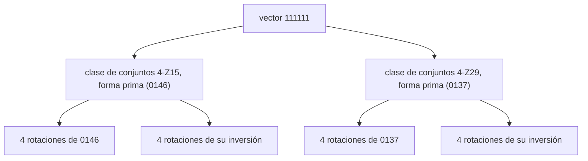

import BraceletInversion from '../../../../assets/music-theory-ga/l4-bracelet-inversion.svg';
import BraceletZ from '../../../../assets/music-theory-ga/l4-bracelet-z-relation.svg';

La lección 2 convirtió un acorde o una escala en un número de 12 bits. Esta lección agrupa esos números. Si dos conjuntos tienen la misma forma desplazada o reflejada, la teoría musical los pone en una misma **clase de conjuntos**, y los 4096 conjuntos se reparten en 224 clases. [Guitar Alchemist](https://github.com/GuitarAlchemist/ga) (GA) se basa en esa agrupación: sus formas primas, sus vectores interválicos y sus «familias modales» salen de ella, y sus herramientas MCP la usan para sugerir acordes sustitutos. El programa del curso lo recalcula todo a partir de las definiciones del libro de texto, para los 4096 conjuntos.

Todos los enlaces a GA apuntan al commit [`a826864`](https://github.com/GuitarAlchemist/ga/tree/a826864f3a012cad88e415954bf57eca0ce12aa6). Las salidas proceden de:

```bash
dotnet run --project code/music-theory-ga/GaTheory -c Release -- l4
```

## Transposición e inversión

### La idea

Una tríada de C mayor y una tríada de D mayor suenan parecidas: los mismos intervalos, otra altura. Es la **transposición** (lección 2). Una tríada de C mayor y una tríada de F menor también tienen mucho en común: los mismos tres intervalos, apilados en el orden opuesto. Una tríada mayor tiene una tercera mayor abajo y una tercera menor arriba; una tríada menor, al revés. Dar la vuelta a un conjunto sobre el reloj de clases de altura es la **inversión**: cada clase de altura *n* pasa a ser −*n* mod 12, y luego el resultado puede transponerse. Open Music Theory da exactamente este ejemplo: I0 de C mayor `[0, 4, 7]` es F menor `[5, 8, 0]` ([Open Music Theory, "Set Class and Prime Form"](https://viva.pressbooks.pub/openmusictheory/chapter/set-class-and-prime-form/)).

### La notación

**T*n*** transpone *n* semitonos; **I*n*** invierte y luego transpone *n*, así que I*n* lleva *x* a *n* − *x* ([Open Music Theory, "Pitch-Class Sets, Normal Order, and Transformations"](https://viva.pressbooks.pub/openmusictheory/chapter/pc-sets-normal-order-and-transformations/)). Un conjunto entre corchetes está ordenado, `[5, 8, 0]`; el curso imprime listas simples.

```text
== Transposition and inversion of a C major triad (0 4 7)
operation  course     GA         check
T2         2 6 9      2 6 9      ok
I0         0 5 8      0 5 8      ok
T2I        2 7 T      2 7 T      ok
```

T2 es D mayor (D F♯ A), I0 es F menor (F A♭ C), y T2I, inversión y luego T2, es G menor (G B♭ D).

En un brazalete, T*n* gira el polígono e I0 lo refleja respecto a la línea que pasa por 0 y 6: 4 va a 8 y 7 a 5, mientras que 0 se queda en su sitio. Las páginas de brazaletes de Ian Ring marcan esas líneas de reflexión con trazos punteados, sus "axes of reflective symmetry" ([escala 2741](https://ianring.com/musictheory/scales/2741)).

<BraceletInversion role="img" aria-label="Brazalete con dos triángulos reflejados respecto a un eje discontinuo que pasa por 0 y 6: la tríada de C mayor 0 4 7 y su inversión I0, la tríada de F menor 0 5 8. La clase de altura 0 pertenece a ambas." />

### En GA

`PitchClassSetId.Transpose` es la rotación de bits de la lección 2 e `Inverse` el reflejo de bits. [`TranspositionsAndInversions`](https://github.com/GuitarAlchemist/ga/blob/a826864f3a012cad88e415954bf57eca0ce12aa6/Common/GA.Domain.Core/Theory/Atonal/AtonalExtensions.cs#L28-L35) enumera las 24 formas de un conjunto, algunas de las cuales coinciden en los conjuntos simétricos.

## Vectores interválicos

### La idea

Cuenta cada par de notas de un conjunto y clasifica cada par por su clase de intervalo, de 1 a 6 (lección 1). Los seis recuentos forman el **vector interválico** del conjunto (ICV, *interval-class vector*): su contenido interválico, sea cual sea el orden, la octava o la grafía de sus notas ([Open Music Theory, "Interval-Class Vectors"](https://viva.pressbooks.pub/openmusictheory/chapter/interval-class-vectors/)). Una tríada de C mayor tiene una tercera menor o sexta mayor (ic3, E–G), una tercera mayor (ic4, C–E) y una cuarta o quinta (ic5, C–G): `<001110>`. Un conjunto de *n* notas tiene *n*(*n* − 1)/2 pares, así que el vector de una tríada suma 3 y el de un tetracordo 6.

Transponer un conjunto mueve todas sus notas juntas, e invertirlo da la vuelta a cada intervalo, lo que conserva su clase de intervalo. Por eso todos los conjuntos de una clase de conjuntos tienen el mismo vector. Lo contrario no siempre es cierto, como muestra la relación Z más abajo.

### La notación

El vector se escribe entre corchetes angulares, dígito a dígito cuando todos los recuentos son menores que 10: `<001110>`. El curso imprime espacios, `<0 0 1 1 1 0>`, porque un conjunto de 11 notas tiene recuentos de 10.

```text
== Interval-class vectors
set                course               GA                   check
C major triad      <0 0 1 1 1 0>        <0 0 1 1 1 0>        ok
A minor triad      <0 0 1 1 1 0>        <0 0 1 1 1 0>        ok
C7                 <0 1 2 1 1 1>        <0 1 2 1 1 1>        ok
Cm7b5              <0 1 2 1 1 1>        <0 1 2 1 1 1>        ok
Cdim7              <0 0 4 0 0 2>        <0 0 4 0 0 2>        ok
C major scale      <2 5 4 3 6 1>        <2 5 4 3 6 1>        ok
11 pitch classes   <10 10 10 10 10 5>   <10 10 10 10 10 5>   ok
all 12             <12 12 12 12 12 6>   <1 1 1 1 0 6>        DIFF
```

Algunas cosas que leer en esa tabla:

- C mayor y A menor, y C7 y Cm7♭5, tienen el mismo vector: son inversiones uno del otro. Refleja C7 (C E G B♭, 0 4 7 10) y obtienes 0 2 5 8, D F A♭ C, D semidisminuido.
- El acorde de séptima disminuida solo tiene terceras menores y trítonos: cuatro ic3 y dos ic6.
- El vector de la escala mayor `<254361>` usa seis dígitos distintos: cada clase de intervalo aparece un número de veces diferente. Wikipedia llama a esto la propiedad de **escala profunda** (*deep scale*), que "the major scale and its modes have" ([Interval vector](https://en.wikipedia.org/wiki/Interval_vector)).

### En GA

- [`IntervalClassVector`](https://github.com/GuitarAlchemist/ga/blob/a826864f3a012cad88e415954bf57eca0ce12aa6/Common/GA.Domain.Core/Theory/Atonal/IntervalClassVector.cs#L36-L48) almacena los seis recuentos (el de la escala mayor es una constante con nombre), e [`IsDeepScale`](https://github.com/GuitarAlchemist/ga/blob/a826864f3a012cad88e415954bf57eca0ce12aa6/Common/GA.Domain.Core/Theory/Atonal/IntervalClassVector.cs#L99) es la definición anterior en una línea de LINQ: `Vector.Values.Distinct().Count() == Vector.Values.Count()`.
- Para usar un vector como clave, [`IntervalClassVectorId`](https://github.com/GuitarAlchemist/ga/blob/a826864f3a012cad88e415954bf57eca0ce12aa6/Common/GA.Domain.Core/Theory/Atonal/IntervalClassVectorId.cs#L39-L85) empaqueta los seis recuentos en un solo `int` como dígitos en base 12: la escala mayor `<2 5 4 3 6 1>` es 608761 en base 12. Un dígito en base 12 llega hasta 11, y la escala cromática tiene recuentos de 12: se arrastran al dígito siguiente, y al decodificar el id se obtiene `<1 1 1 1 0 6>`. Es el único conjunto afectado, ya que un conjunto de 11 notas llega como máximo a 10.

## Formas primas y números de Forte

### La idea

Una clase de conjuntos necesita un nombre, y la convención es un miembro elegido, su **forma prima**. Primero se pone el conjunto en **orden normal**, su rotación más compacta: la que tiene la menor extensión de la primera a la última nota. Luego se hace lo mismo con su inversión, se conserva la más compacta de las dos y se transpone para que empiece en 0. Las formas primas se escriben entre paréntesis sin comas: C mayor y F menor son ambos `(037)` ([Open Music Theory, "Set Class and Prime Form"](https://viva.pressbooks.pub/openmusictheory/chapter/set-class-and-prime-form/)).

El catálogo de Allen Forte de 1973 también da a cada clase un **número de Forte**, *cardinalidad*-*índice*: `(037)` es 3-11, la escala mayor `(013568T)` 7-35. Una `Z` marca las clases que comparten su vector con otra clase.

El orden normal del curso desempata como describe Open Music Theory, por empaquetado ([`Theory.NormalOrder`](https://github.com/spareilleux/learn/blob/79d2198/code/music-theory-ga/GaTheory/Theory.cs#L145-L180)), y luego contrasta su resultado con 14 filas copiadas de la tabla de clases de conjuntos del libro ([`Lesson4.cs`](https://github.com/spareilleux/learn/blob/79d2198/code/music-theory-ga/GaTheory/Lesson4.cs#L9-L26)). Cada conjunto se transpone antes 5 semitonos, para que ninguno de los dos lados pueda limitarse a devolver su entrada:

```text
== Prime forms and Forte numbers (each set transposed by 5 first)
table row        course                         GA                             check
(037) 3-11       (037) 3-11 <001110>            (037) 3-11 <001110>            ok
(0158) 4-20      (0158) 4-20 <101220>           (0158) 4-20 <101220>           ok
(0358) 4-26      (0358) 4-26 <012120>           (0358) 4-26 <012120>           ok
(0258) 4-27      (0258) 4-27 <012111>           (0258) 4-27 <012111>           ok
(0369) 4-28      (0369) 4-28 <004002>           (0369) 4-28 <004002>           ok
(0146) 4-Z15     (0146) 4-Z15 <111111>          (0146) 4-Z15 <111111>          ok
(0137) 4-Z29     (0137) 4-Z29 <111111>          (0137) 4-Z29 <111111>          ok
(01568) 5-20     (01568) 5-20 <211231>          (01568) 5-20 <211231>          ok
(023679) 6-Z29   (023679) 6-Z29 <224232>        (023679) 6-Z29 <224232>        ok
(014579) 6-31    (014579) 6-31 <223431>         (014579) 6-31 <223431>         ok
(02468T) 6-35    (02468T) 6-35 <060603>         (02468T) 6-35 <060603>         ok
(013568T) 7-35   (013568T) 7-35 <254361>        (013568T) 7-35 <254361>        ok
(0145679) 7-Z18  (0145679) 7-Z18 <434442>       (0145679) 7-Z18 <434442>       ok
(0125679) 7-20   (0125679) 7-20 <433452>        (0125679) 7-20 <433452>        ok
```

En términos de acordes: 4-20 es el acorde de séptima mayor (C E G B desde B: 0 1 5 8), 4-26 la séptima menor, 4-27 la séptima de dominante y la séptima semidisminuida juntas, 4-28 la séptima disminuida, 6-35 la escala de tonos enteros.

### ¿Empaquetado a la izquierda o desde la derecha?

«Lo más compacto» deja empates, y hay dos maneras de resolverlos. Forte empaqueta las notas **a la izquierda**, hacia el principio; John Rahn, cuya versión es "now generally more popular", elige la versión "most dispersed from the right" ([List of set classes](https://en.wikipedia.org/wiki/List_of_set_classes)). El programa ejecuta ambas sobre los 4096 conjuntos:

```text
== Packed from the right (Rahn) or to the left (Forte)?
set classes where the two packings disagree: 6
  Rahn (01568)         Forte (01378)
  Rahn (014579)        Forte (013589)
  Rahn (023679)        Forte (013689)
  Rahn (0125679)       Forte (0124789)
  Rahn (0145679)       Forte (0123589)
  Rahn (0134578T)      Forte (0124579T)
sets whose GA prime form is Rahn's: 4096 of 4096
```

Wikipedia cuenta 17 diferencias entre las 352 clases bajo transposición sola; una vez incorporada la inversión, el programa encuentra 6. La tabla de Open Music Theory usa la grafía de Rahn para las cinco de ellas que están en las filas de arriba (5-20, 6-Z29, 6-31, 7-Z18, 7-20), y GA también.

### En GA

GA no ordena rotaciones en absoluto. [`PitchClassSetId.PrimeForm`](https://github.com/GuitarAlchemist/ga/blob/a826864f3a012cad88e415954bf57eca0ce12aa6/Common/GA.Domain.Core/Theory/Atonal/PitchClassSetId.cs#L123-L156) toma el **id más pequeño** entre las 24 transposiciones e inversiones:

```csharp
for (var i = 0; i < 12; i++)
{
    var t = Transpose(i).Value;
    if (t < min) min = t;
    var ti = inverse.Transpose(i).Value;
    if (ti < min) min = ti;
}
```

Con bit *n* = clase de altura *n*, un id pequeño evita las clases de altura altas, que es exactamente "dispersed from the right": (01568) es 1 + 2 + 32 + 64 + 256 = 355, mientras que el (01378) de Forte es 395. La última línea de la salida comprueba que el atajo y el algoritmo de Rahn coinciden en todos los conjuntos. Es un buen intercambio: un bucle de 24 iteraciones sobre enteros en lugar de ordenar rotaciones, y una forma canónica que además sirve de clave de `Dictionary`.

- [`SetClass`](https://github.com/GuitarAlchemist/ga/blob/a826864f3a012cad88e415954bf57eca0ce12aa6/Common/GA.Domain.Core/Theory/Atonal/SetClass.cs#L136-L143) enumera las formas primas distintas de todos los conjuntos.
- [`ForteCatalog.GetForteNumber`](https://github.com/GuitarAlchemist/ga/blob/a826864f3a012cad88e415954bf57eca0ce12aa6/Common/GA.Domain.Core/Theory/Atonal/ForteCatalog.cs#L30-L31) busca la forma prima en [`CanonicalForteCatalog`](https://github.com/GuitarAlchemist/ga/blob/a826864f3a012cad88e415954bf57eca0ce12aa6/Common/GA.Domain.Core/Theory/Atonal/CanonicalForteCatalog.cs#L3-L20), una tabla de texto con las etiquetas de Forte para las cardinalidades 0 a 6, y las demás derivadas de sus complementos. Su comentario advierte que el otro ordinal de GA, el «programático», no es la numeración de Forte.

## Contar las clases de conjuntos

¿Cuántas clases hay? Una clase de conjuntos es una manera de colocar cuentas en la esfera de un reloj de 12 horas, salvo rotación y reflexión: la combinatoria lo llama **brazalete** (*bracelet*), y sin reflexión **collar** (*necklace*). La OEIS da 224 brazaletes binarios y 352 collares binarios de 12 cuentas ([A000029](https://oeis.org/A000029), [A000031](https://oeis.org/A000031)).

```text
== Counting classes
equivalence            course GA     check
T and I (set classes)  224    224    ok
T only                 352    352    ok
```

La [`TranspositionClass`](https://github.com/GuitarAlchemist/ga/blob/a826864f3a012cad88e415954bf57eca0ce12aa6/Common/GA.Domain.Core/Theory/Atonal/TranspositionClass.cs#L21-L25) de GA es el segundo recuento, construido sobre `TranspositionPrimeForm`, el id más pequeño entre las 12 transposiciones solamente. El módulo de Streeling [MUS-006](../../streeling/music/mus-006-the-scale-universe/) cita 224 para "cardinalities 3 through 9"; ese número incluye todas las cardinalidades de 0 a 12.

## La relación Z

### La idea

Dos conjuntos pueden tener el mismo contenido interválico sin ser transposiciones ni inversiones el uno del otro. El ejemplo de Wikipedia es 4-Z15 `{0,1,4,6}` y 4-Z29 `{0,1,3,7}`: ambos contienen un intervalo de cada clase, `<111111>`, "but one can not transpose and/or invert the one set onto the other" ([Interval vector](https://en.wikipedia.org/wiki/Interval_vector)). Estos pares están **relacionados por Z**. Para los conjuntos de seis notas hay una regla elegante: el complemento de un hexacordo Z es su pareja Z (mismo artículo). El módulo de Streeling [MUS-002 · Más allá de la tonalidad](../../streeling/music/mus-002-beyond-tonality/) presenta los vectores interválicos y las relaciones Z con el mismo par.

Los dos brazaletes hacen visible la diferencia: ninguna rotación ni imagen especular convierte una forma en la otra, y sin embargo cada una contiene exactamente un par de notas a un semitono, uno a un tono, y así hasta un solo tritono.

<BraceletZ role="img" aria-label="Dos brazaletes. 4-Z15: 0 1 4 6. 4-Z29: 0 1 3 7. Formas distintas con el mismo vector interválico 111111." />

```text
== Z-relation: same vector, different set classes
set      course                       GA                           check
0146     <1 1 1 1 1 1> (0146) 4-Z15   <1 1 1 1 1 1> (0146) 4-Z15   ok
0137     <1 1 1 1 1 1> (0137) 4-Z29   <1 1 1 1 1 1> (0137) 4-Z29   ok
```

### En GA

La relación Z es lo que hace que la `ModalFamily` de GA (lección 2) sea más amplia que las rotaciones de un conjunto. Una familia es todo conjunto que contiene 0 con un vector dado. El curso cuenta lo mismo por fuerza bruta sobre los 4096 conjuntos y coincide con GA; el número de rotaciones va entre paréntesis:

```text
== Modal families: GA counts the sets containing 0 that share the vector
set (rotations)          course GA     check
major triad (3)          6      6      ok
dominant 7th (4)         8      8      ok
major scale (7)          7      7      ok
harmonic minor (7)       14     14     ok
0146 (4)                 16     16     ok
```

La familia de la tríada mayor contiene sus 3 rotaciones y las 3 de la tríada menor; la de la séptima de dominante, también las de la séptima semidisminuida. La escala mayor es su propia imagen especular: 7. El tetracordo de todos los intervalos `0146` reúne 4 + 4 rotaciones de su propia clase y 4 + 4 de 4-Z29. [`PitchClassSet.IsZRelated`](https://github.com/GuitarAlchemist/ga/blob/a826864f3a012cad88e415954bf57eca0ce12aa6/Common/GA.Domain.Core/Theory/Atonal/PitchClassSet.cs#L199-L211) se basa en la misma familia: es verdadero cuando un miembro no está entre las 24 transposiciones e inversiones del primer miembro.



## Lo que hace GA con las clases de conjuntos

### Acordes sustitutos

El servidor MCP de GA tiene una herramienta, `ga_set_class_subs`, que enumera los acordes de un vocabulario de 12 fundamentales que pertenecen a la misma clase de conjuntos que un acorde dado ([`ChordAtonalTool.GaSetClassSubs`](https://github.com/GuitarAlchemist/ga/blob/a826864f3a012cad88e415954bf57eca0ce12aa6/GaMcpServer/Tools/ChordAtonalTool.cs#L147-L192)). El programa del curso hace la misma búsqueda con sus propias formas primas y con el `PrimeForm` de GA, sobre doce tipos de acorde:

```text
== Same set class as Am, then G7, among 12 roots x 12 chord types
Am course: C Cm C# C#m D Dm Eb Ebm E Em F Fm F# F#m G Gm Ab Abm A Bb Bbm B Bm
Am GA:     C Cm C# C#m D Dm Eb Ebm E Em F Fm F# F#m G Gm Ab Abm A Bb Bbm B Bm
G7 course: C7 Cm7b5 C#7 C#m7b5 D7 Dm7b5 Eb7 Ebm7b5 E7 Em7b5 F7 Fm7b5 F#7 F#m7b5 Gm7b5 Ab7 Abm7b5 A7 Am7b5 Bb7 Bbm7b5 B7 Bm7b5
G7 GA:     C7 Cm7b5 C#7 C#m7b5 D7 Dm7b5 Eb7 Ebm7b5 E7 Em7b5 F7 Fm7b5 F#7 F#m7b5 Gm7b5 Ab7 Abm7b5 A7 Am7b5 Bb7 Bbm7b5 B7 Bm7b5
```

Todas las tríadas mayores y menores están en la clase de A menor, como dice Open Music Theory de las tríadas mayores y menores ([Set Class and Prime Form](https://viva.pressbooks.pub/openmusictheory/chapter/set-class-and-prime-form/)). En esta sesión (2026-09-14, versión del servidor no indicada), la herramienta MCP dio exactamente estas listas para Am y para G7, pero:

- su descripción dice "Am and C are NOT equivalent, but Am and Em are", lo que contradicen su propia respuesta y la teoría;
- imprimió todos los acordes bajo un encabezado `[maj]`, `C7` y `Cm7b5` incluidos: [la agrupación](https://github.com/GuitarAlchemist/ga/blob/a826864f3a012cad88e415954bf57eca0ce12aa6/GaMcpServer/Tools/ChordAtonalTool.cs#L187-L190) toma el primer sufijo del vocabulario con el que el nombre del acorde cumple `EndsWith`, y el primer sufijo es `""`, con el que termina cualquier cadena.

La equivalencia de clases de conjuntos es una afirmación fuerte sobre el contenido interválico, pero débil sobre la armonía: G7 y Gm7♭5 comparten una clase, no una función. Trata las "deepest substitutions" de la herramienta como candidatas que hay que escuchar.

### Vecinos por vector interválico

`ga_icv_neighbors` busca conjuntos cuyo vector se acerca al de un acorde: [`GrothendieckService.FindNearby`](https://github.com/GuitarAlchemist/ga/blob/a826864f3a012cad88e415954bf57eca0ce12aa6/Common/GA.Domain.Services/Atonal/Grothendieck/GrothendieckService.cs#L45-L90) recorre los 4096 conjuntos y conserva los que están dentro de una distancia L1, la suma de las diferencias absolutas de los seis recuentos. Preguntada por los vecinos de C a distancia 1, la herramienta devolvió doce líneas, todas idénticas:

```text
ICV neighbors of C (ICV <0 0 1 1 1 0>, dist ≤ 1):
  <0 0 1 1 1 0>  Δ=1  Forte:3-11 [Major Triad]
  <0 0 1 1 1 0>  Δ=1  Forte:3-11 [Major Triad]
  ...
```

El vector de una tríada siempre suma 3, así que otra tríada difiere al menos en 2, nunca en 1. La explicación está en [`GrothendieckDelta.FromIcVs`](https://github.com/GuitarAlchemist/ga/blob/a826864f3a012cad88e415954bf57eca0ce12aa6/Common/GA.Domain.Services/Atonal/Grothendieck/GrothendieckDelta.cs#L113-L134): cuando dos conjuntos distintos comparten vector, la diferencia se fija a `Ic1 = 1` a propósito, "to preserve musical differentiation expected by callers/tests". Así que «distancia 1» significa «mismo vector»: las 24 tríadas mayores y menores (la herramienta conserva las 12 primeras), y la etiqueta `Major Triad` se busca a partir del vector, así que también nombra las menores.

## Ejercicios

1. Calcula el vector interválico y la forma prima de la escala pentatónica menor de C, 0 3 5 7 10.
2. Cmaj7 y Am7 comparten tres notas. ¿Están en la misma clase de conjuntos?
3. Encuentra la pareja Z de 6-Z29 `(023679)`.

<details>
<summary>Soluciones</summary>

1. Diez pares: ningún semitono, tres tonos (E♭–F, F–G, B♭–C), dos terceras menores (C–E♭, G–B♭), una tercera mayor (E♭–G), cuatro cuartas o quintas y ningún trítono: `<032140>`. La forma prima es `(02479)`, 5-35, la clase de toda escala pentatónica. Las cuerdas al aire de una guitarra, E A D G B, también están en ella: G pentatónica mayor. MUS-002 obtiene para ellas `[0,2,5,7,9]`, una rotación del mismo conjunto, pero no su forma prima: su desempate compara las clases de altura 4 y 9 en lugar de los intervalos.
2. No. Cmaj7 es `(0158)`, 4-20, y Am7 (A C E G) es `(0358)`, 4-26. Am7 tiene las mismas notas que C6, no que Cmaj7.
3. El programa busca la otra clase con vector `<224232>`: `(014679)`, 6-Z50. Según la regla de Wikipedia, es también el complemento de 6-Z29: 1 4 5 8 10 11 tiene esa forma prima.

```text
== Exercise solutions
question             course                     GA                         check
1. minor pentatonic  <0 3 2 1 4 0> (02479)      <0 3 2 1 4 0> (02479)      ok
2. Cmaj7 vs Am7      (0158) (0358)              (0158) (0358)              ok
3. partner of 6-Z29  (014679) 6-Z50             (014679) 6-Z50             ok
```

En el lado GA, la pareja es la entrada de `SetClass.Items` con el mismo vector y una forma prima distinta ([`Lesson4.cs`](https://github.com/spareilleux/learn/blob/79d2198/code/music-theory-ga/GaTheory/Lesson4.cs#L144-L161)).

</details>

## Puntos clave

- Una clase de conjuntos es un conjunto salvo transposición e inversión; 4096 conjuntos forman 224 clases (352 sin inversión), los brazaletes y collares de 12 cuentas.
- El vector interválico cuenta los pares de notas por clase de intervalo. Una clase de conjuntos tiene un vector; un vector puede tener dos clases: la relación Z.
- Una forma prima es una convención de nombre. Forte y Rahn desempatan de forma distinta en 6 clases; Open Music Theory y GA usan Rahn, y GA la obtiene como el id de 12 bits mínimo, un truco que vale la pena recordar.
- Las familias modales de GA, `IsZRelated` y las herramientas de sustitución se basan todas en el vector o en la forma prima, así que heredan estas equivalencias: para ellas C y Am son «lo mismo», y un vector idéntico se presenta a distancia 1.
- La teoría y el núcleo de GA coinciden en todos los recuentos de esta lección; los desacuerdos están en las codificaciones (un id en base 12), las etiquetas y la salida de las herramientas.

## Fuentes

- Mark Gotham et al., [*Open Music Theory*](https://viva.pressbooks.pub/openmusictheory/), versión 2, 2023, [CC BY-SA 4.0](https://creativecommons.org/licenses/by-sa/4.0/): capítulos [Pitch-Class Sets, Normal Order, and Transformations](https://viva.pressbooks.pub/openmusictheory/chapter/pc-sets-normal-order-and-transformations/), [Set Class and Prime Form](https://viva.pressbooks.pub/openmusictheory/chapter/set-class-and-prime-form/) (con su tabla de clases de conjuntos), [Interval-Class Vectors](https://viva.pressbooks.pub/openmusictheory/chapter/interval-class-vectors/).
- [List of set classes](https://en.wikipedia.org/wiki/List_of_set_classes) (formas primas de Forte y de Rahn) e [Interval vector](https://en.wikipedia.org/wiki/Interval_vector) (relación Z, propiedad de escala profunda), Wikipedia.
- OEIS [A000029](https://oeis.org/A000029) (brazaletes) y [A000031](https://oeis.org/A000031) (collares).
- GuitarAlchemist/ga en [`a826864`](https://github.com/GuitarAlchemist/ga/tree/a826864f3a012cad88e415954bf57eca0ce12aa6/Common/GA.Domain.Core): `Theory/Atonal` (`PitchClassSetId.cs`, `PitchClassSet.cs`, `IntervalClassVector.cs`, `IntervalClassVectorId.cs`, `SetClass.cs`, `ForteCatalog.cs`, `CanonicalForteCatalog.cs`, `TranspositionClass.cs`), `GA.Domain.Services/Atonal/Grothendieck`, `GaMcpServer/Tools/ChordAtonalTool.cs`.
