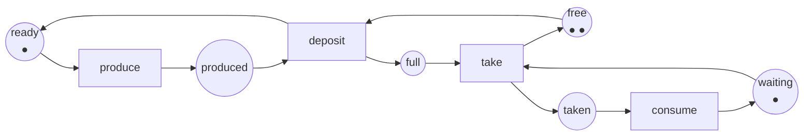
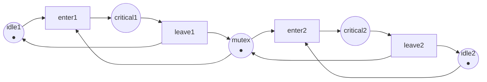

Código completo: [`code/petri-nets`](https://github.com/spareilleux/learn/tree/main/code/petri-nets). Esta lección la imprime `dotnet run --project Examples -c Release -- l1`, y su salida se compara con [`expected/l1.txt`](https://github.com/spareilleux/learn/blob/main/code/petri-nets/expected/l1.txt) mediante [`check.sh`](https://github.com/spareilleux/learn/blob/main/code/petri-nets/check.sh). En Windows, ejecuta `check.sh` desde Git Bash; todo lo demás es `dotnet` corriente.

## El problema que una máquina de estados no va a modelar

Aquí hay un búfer acotado con un productor y un consumidor, la forma de todos los [`Channel<T>`](https://learn.microsoft.com/dotnet/api/system.threading.channels.channel-1) y de todas las [`ArrayBlockingQueue`](https://docs.oracle.com/en/java/javase/21/docs/api/java.base/java/util/concurrent/ArrayBlockingQueue.html) que has escrito:

```csharp
// Dos hilos, una cola de dos huecos. ¿Cuáles son los estados de este sistema?
var buffer = Channel.CreateBounded<Item>(2);

// hilo productor
while (true)
{
    var item = Produce();               // tarda un rato
    await buffer.Writer.WriteAsync(item); // se bloquea cuando el búfer está lleno
}

// hilo consumidor
while (true)
{
    var item = await buffer.Reader.ReadAsync(); // se bloquea cuando el búfer está vacío
    Consume(item);                              // tarda un rato
}
```

Intenta dibujar eso como una máquina de estados. El productor tiene dos estados, «a punto de producir» y «sosteniendo un artículo que no ha depositado». El consumidor tiene dos. El búfer tiene tres, porque contiene cero, uno o dos artículos. Una máquina de estados tiene un único estado actual, así que necesita un estado por combinación: 2 × 2 × 3 = 12, y cada transición hay que trazarla desde cada estado donde se aplica. Añade un segundo productor y el dibujo se vuelve inservible.

El problema no es el dibujo. Es que el estado de este sistema no es un punto. Es una *distribución*: unas cosas están aquí, otras están allá, y varias de ellas se mueven de forma independiente. Una máquina de estados solo puede decir «el sistema está en el estado S». Yo quiero decir «el productor sostiene un artículo, un hueco está ocupado, un hueco está libre y el consumidor espera» — cuatro hechos ciertos a la vez que cambian en momentos distintos.

Una red de Petri dice exactamente eso. La introdujo [Carl Adam Petri](https://www.informatik.uni-hamburg.de/TGI/PetriNets/history/) en su tesis de 1962, *Kommunikation mit Automaten*, y la definición de abajo es la que da Murata en su artículo de síntesis de 1989 (sección II).

## Plazas, transiciones, arcos, marcas

Una red de Petri tiene dos clases de nodo y nada más:

- una **plaza**, dibujada como un círculo, es una condición o un contenedor: «el productor está listo», «un hueco está libre». Una plaza contiene un número de **marcas**, dibujadas como puntos;
- una **transición**, dibujada como una barra o un rectángulo, es un evento: «producir», «depositar»;
- un **arco** va de una plaza a una transición, o de una transición a una plaza, nunca entre dos nodos de la misma clase. Un arco lleva un **peso**, que vale 1 si no está escrito.

Las marcas, plaza por plaza, forman el **marcado**. El marcado es el estado de toda la red, y el marcado inicial se escribe M0. Aquí está el búfer acotado como red:



Seis plazas, cuatro transiciones, doce arcos. Los nombres se quedan en inglés en los tres idiomas: forman parte de la salida del programa, comparada por `check.sh`. El productor es la marca que se mueve entre `ready` y `produced`; el consumidor es la marca que se mueve entre `waiting` y `taken`; el búfer son dos marcas repartidas entre `free` y `full`. Merece la pena detenerse en ese último par: **un hueco libre también es una marca**. `free` contiene los huecos que nadie ha llenado todavía, y es la única razón por la que se puede detener al productor.

El analizador imprime la misma red como texto:

```
== The net ==
net producer-consumer
places      ready produced free full waiting taken
transitions produce deposit take consume
M0          (1, 0, 2, 0, 1, 0) = ready:1 free:2 waiting:1
arc         ready -> produce
arc         produce -> produced
arc         produced -> deposit
arc         free -> deposit
arc         deposit -> full
arc         deposit -> ready
arc         full -> take
arc         waiting -> take
arc         take -> taken
arc         take -> free
arc         taken -> consume
arc         consume -> waiting
```

El marcado `(1, 0, 2, 0, 1, 0)` es un vector, una entrada por plaza, en el orden en que las plazas están listadas. Ese orden no cambia nunca, y toda la lección 2 se apoya en él.

## La regla de disparo

Esta es toda la semántica, y cabe en dos frases.

> Una transición está **sensibilizada** en un marcado cuando cada plaza con un arco hacia ella contiene al menos el peso de ese arco.
> Disparar una transición sensibilizada retira esas marcas de sus plazas de entrada y añade, a cada plaza de salida, el peso del arco que lleva a ella. Las dos cosas ocurren a la vez.

Nada dice *qué* transición sensibilizada dispara, ni cuándo. Una red de Petri no planifica; describe lo que es posible. Por eso puede responder a «¿puede ocurrir esto alguna vez?» — la respuesta cubre todas las planificaciones a la vez.

En C# la regla son cuatro líneas, y es todo aquello sobre lo que se construye el resto de [`PetriNet.cs`](https://github.com/spareilleux/learn/blob/main/code/petri-nets/PetriNets/PetriNet.cs):

```csharp
/// <summary>Cierto cuando cada plaza de entrada de la transición contiene al menos el peso del arco.</summary>
public bool IsEnabled(Marking marking, int transition)
{
    for (var p = 0; p < Places.Count; p++)
    {
        if (marking[p] != Marking.Omega && marking[p] < Pre[p, transition]) return false;
    }
    return true;
}

public Marking Fire(Marking marking, int transition)
{
    if (!IsEnabled(marking, transition))
        throw new InvalidOperationException($"Transition {Transitions[transition].Name} is not enabled at {marking}.");
    var next = marking.ToArray();
    for (var p = 0; p < Places.Count; p++)
        next[p] = Marking.Add(next[p], Post[p, transition] - Pre[p, transition]);
    return new Marking(next);
}
```

`Pre[p, t]` es lo que el disparo de `t` le quita a `p`, `Post[p, t]` es lo que le devuelve. La lección 2 les da a esas dos matrices un nombre y un uso. `Marking.Omega` es un valor centinela que solo necesita la lección 3; ignóralo por ahora.

En el marcado inicial solo hay una transición sensibilizada, porque el consumidor no tiene nada que tomar y el productor nada que depositar:

```
== Enabled at the initial marking ==
produce
```

Una vuelta completa mueve las marcas y regresa al punto de partida:

```
== One round trip: produce, deposit, take, consume ==
          (1, 0, 2, 0, 1, 0)  ready:1 free:2 waiting:1
produce   (0, 1, 2, 0, 1, 0)  produced:1 free:2 waiting:1
deposit   (1, 0, 1, 1, 1, 0)  ready:1 free:1 full:1 waiting:1
take      (1, 0, 2, 0, 0, 1)  ready:1 free:2 taken:1
consume   (1, 0, 2, 0, 1, 0)  ready:1 free:2 waiting:1
```

Lee `deposit` con atención. Le quita una marca a `produced` **y** una a `free`, y pone una en `full` **y** otra de vuelta en `ready`. Un evento, cuatro plazas tocadas, atómicamente. Un arco de máquina de estados no puede hacer eso: convierte un estado actual en otro.

## La contrapresión, dibujada

Ahora llena el búfer y mira cómo se detiene el productor:

```
== Filling the buffer: the producer is stopped by the empty place free ==
          (1, 0, 2, 0, 1, 0)  ready:1 free:2 waiting:1
produce   (0, 1, 2, 0, 1, 0)  produced:1 free:2 waiting:1
deposit   (1, 0, 1, 1, 1, 0)  ready:1 free:1 full:1 waiting:1
produce   (0, 1, 1, 1, 1, 0)  produced:1 free:1 full:1 waiting:1
deposit   (1, 0, 0, 2, 1, 0)  ready:1 full:2 waiting:1
enabled now: produce take
after produce: (0, 1, 0, 2, 1, 0) produced:1 full:2 waiting:1
enabled now: take
deposit enabled: False  (free holds 0 tokens)
```

El productor todavía puede `produce` — puede sostener un artículo en la mano — pero `deposit` no está sensibilizada, porque `free` está vacía. Eso es `WriteAsync` bloqueándose, y no es una regla especial que el modelo haya necesitado: sale de aplicar la regla de disparo a una plaza vacía.

Es lo primero que te compra la red. En el código de C#, la contrapresión es una propiedad de la implementación de `Channel`, documentada en prosa y observada en ejecución. En la red es un número de marcas, y un programa puede comprobarlo.

## Dos cosas a la vez

El consumidor que toma un artículo y el productor que produce el siguiente son independientes. Nada en la red hace que uno espere al otro, y el marcado al que llegan es el mismo dispare quien dispare primero:

```
== Concurrency: produce and take do not compete, and the order does not matter ==
from (1, 0, 1, 1, 1, 0) ready:1 free:1 full:1 waiting:1
produce then take: (0, 1, 2, 0, 0, 1)
take then produce: (0, 1, 2, 0, 0, 1)
same marking: True
```

Dos transiciones sensibilizadas que no comparten ninguna plaza de entrada son **concurrentes**: pueden disparar en cualquier orden o, si lo prefieres, a la vez. Dos transiciones sensibilizadas que comparten una plaza de entrada con marcas suficientes solo para una de ellas están en **conflicto**: disparar una desensibiliza a la otra. La lección 4 convierte esa distinción en la propiedad llamada persistencia, y la lección 7 muestra que el conflicto es exactamente donde vive un cerrojo.

## Lo que cuesta el modelo

La red tiene seis plazas y cuatro transiciones. Sus marcados alcanzables son doce — el 2 × 2 × 3 del principio de esta lección:

```
== A state machine would need one state per combination ==
markings of this net: 12
tokens in the net: 4
```

La máquina de estados no está equivocada, entonces: es la forma *desplegada*. La red es la forma comprimida, y en la compresión está la palanca: el dibujo tiene 10 nodos y 12 arcos donde la máquina de estados tiene 12 estados y 20 aristas, y mantiene su tamaño cuando añades un segundo productor, donde la máquina de estados multiplica.

La segunda línea es un regalo. El número total de marcas no cambia nunca, en ninguno de los doce marcados, porque cada transición de esta red toma exactamente tantas marcas como devuelve. La lección 5 llama a eso un invariante de plazas y lo demuestra sin enumerar nada.

## La misma red como archivo

Las redes se intercambian entre herramientas como [PNML](https://www.pnml.org/), un formato XML normalizado como [ISO/IEC 15909-2:2011](https://www.iso.org/standard/43538.html). El analizador lo escribe, y `check.sh` compara lo que escribe con los archivos de [`nets/`](https://github.com/spareilleux/learn/tree/main/code/petri-nets/nets), de modo que la red de la imagen y la red del archivo no pueden separarse:

```xml
<?xml version="1.0" encoding="utf-8"?>
<pnml xmlns="http://www.pnml.org/version-2009/grammar/pnml">
  <net id="n1" type="http://www.pnml.org/version-2009/grammar/ptnet">
    <name>
      <text>producer-consumer</text>
    </name>
    <page id="page1">
      <place id="ready">
        <name>
          <text>ready</text>
        </name>
        <initialMarking>
          <text>1</text>
        </initialMarking>
      </place>
      <place id="produced">
        <name>
          <text>produced</text>
        </name>
      </place>
      <!-- free, full, waiting, taken siguen, luego las transiciones -->
      <transition id="produce">
        <name>
          <text>produce</text>
        </name>
      </transition>
      <arc id="a1" source="ready" target="produce" />
      <arc id="a2" source="produce" target="produced" />
    </page>
  </net>
</pnml>
```

El archivo completo es [`nets/producer-consumer.pnml`](https://github.com/spareilleux/learn/blob/main/code/petri-nets/nets/producer-consumer.pnml). El atributo de tipo dice de qué clase de red se trata: `ptnet` es la red plaza/transición de esta lección. La lección 8 conoce otro tipo, y la lección 11 conoce las herramientas que los leen.

## Puntos clave

- Una plaza es una condición o un contenedor, una transición es un evento, y las marcas en las plazas forman el marcado. El marcado es un vector, no un único estado.
- Una transición está sensibilizada cuando cada una de sus plazas de entrada contiene al menos el peso del arco, y el disparo consume y produce en un solo paso.
- La red nunca dice qué transición sensibilizada dispara. Ese silencio es lo que permite que un solo modelo cubra todos los entrelazados.
- Una plaza vacía es un evento bloqueado. Un búfer acotado se modela con una plaza que contiene sus huecos libres, y la contrapresión no necesita ninguna regla adicional.
- Dos transiciones sensibilizadas que no comparten plaza de entrada son concurrentes, y dispararlas en cualquier orden lleva al mismo marcado. Dos que compiten por las mismas marcas están en conflicto.
- Una red es la forma comprimida de la máquina de estados que habrías dibujado si no, y la compresión crece con el número de componentes independientes.

## Ejercicios

1. En la red de arriba, quita la plaza `free` y sus dos arcos. ¿Qué transición deja de estar restringida, y qué significa eso para el búfer?
2. Modela un cerrojo: dos hilos, cada uno con una plaza `idle` y una plaza `critical`, compartiendo una plaza `mutex` con una marca. ¿Qué dos transiciones están en conflicto, y en qué marcado?
3. Dale a la red de arriba un búfer de un solo hueco en lugar de dos, cambiando un número. ¿Cuántos marcados tiene ahora? Compruébalo con el analizador.
4. El arco de `deposit` a `ready` devuelve al productor al trabajo. ¿Qué significaría la red si faltara ese arco?

<details>
<summary>Soluciones</summary>

**1.** `deposit` deja de estar restringida: solo necesita una marca en `produced`. El productor puede entonces depositar indefinidamente sin que el consumidor tome nada, así que `full` crece sin límite y el conjunto de marcados alcanzables se vuelve infinito. Esa red es [`UnboundedProducer`](https://github.com/spareilleux/learn/blob/main/code/petri-nets/Examples/Nets.cs) en el código, y la lección 3 trata de lo que todavía se puede decir de ella.

**2.** La red es [`MutualExclusion`](https://github.com/spareilleux/learn/blob/main/code/petri-nets/Examples/Nets.cs):



`enter1` y `enter2` están en conflicto en el marcado inicial `(1, 0, 1, 0, 1)`: las dos están sensibilizadas, las dos necesitan la única marca de `mutex`, y disparar una desensibiliza a la otra. Eso es el cerrojo. La lección 4 comprueba que los dos hilos nunca están dentro a la vez, y la lección 5 lo demuestra con un invariante en lugar de una búsqueda.

**3.** Cambia el marcado inicial de `free` de 2 a 1. El analizador da la respuesta en la tabla de crecimiento de la lección 3: 8 marcados en lugar de 12. El productor, el consumidor y el búfer tienen ahora 2 × 2 × 2 combinaciones.

**4.** Sin el arco `deposit -> ready`, la marca que representa al productor la consumiría `deposit` y no volvería nunca. `produce` dispararía una vez, `deposit` una vez, y la mitad «productor» de la red quedaría muerta para siempre, mientras el consumidor vaciaba el único artículo y se paraba. La lección 4 le da nombre a ese fallo: la transición `produce` sería *L1-viva* — capaz de disparar una vez — en lugar de viva.

</details>

## Fuentes

- Tadao Murata, *Petri nets: Properties, analysis and applications*, **Proceedings of the IEEE** 77(4), abril de 1989, páginas 541–580, [doi:10.1109/5.24143](https://doi.org/10.1109/5.24143). La sección II define plazas, transiciones, arcos, marcados y la regla de disparo usados aquí.
- Wolfgang Reisig, *Understanding Petri Nets*, Springer, 2013, [doi:10.1007/978-3-642-33278-4](https://doi.org/10.1007/978-3-642-33278-4).
- [Petri Nets World](https://www.informatik.uni-hamburg.de/TGI/PetriNets/) y su [página de historia](https://www.informatik.uni-hamburg.de/TGI/PetriNets/history/), para la tesis de 1962 de Carl Adam Petri.
- [PNML](https://www.pnml.org/) e [ISO/IEC 15909-2:2011](https://www.iso.org/standard/43538.html), *Systems and software engineering — High-level Petri nets — Part 2: Transfer format*.
- [`Channel<T>`](https://learn.microsoft.com/dotnet/api/system.threading.channels.channel-1) y [`ArrayBlockingQueue`](https://docs.oracle.com/en/java/javase/21/docs/api/java.base/java/util/concurrent/ArrayBlockingQueue.html), los dos búferes acotados que esta lección modela.
