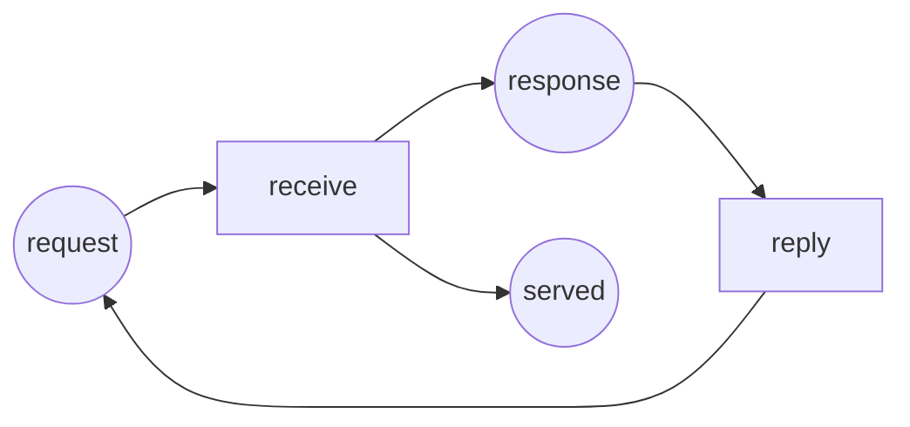

Código completo: [`code/petri-nets`](https://github.com/spareilleux/learn/tree/main/code/petri-nets). Esta lección la imprime `dotnet run --project Examples -c Release -- l2`, y se compara con [`expected/l2.txt`](https://github.com/spareilleux/learn/blob/main/code/petri-nets/expected/l2.txt).

La lección 1 dibujó una red y la disparó. Esta lección escribe lo mismo con números, porque una imagen no se le puede entregar a un programa, y porque un producto de matrices sustituye a toda una secuencia de disparos.

## La definición

Una **red plaza/transición** es una tupla *N* = (*P*, *T*, *F*, *W*, *M0*) donde

- *P* es un conjunto finito de plazas y *T* un conjunto finito de transiciones, con *P* y *T* disjuntos y no ambos vacíos;
- *F* ⊆ (*P* × *T*) ∪ (*T* × *P*) es el conjunto de arcos — de una plaza a una transición o de una transición a una plaza, nunca entre dos nodos de la misma clase;
- *W* : *F* → {1, 2, 3, …} da a cada arco un peso positivo;
- *M0* : *P* → {0, 1, 2, …} es el marcado inicial.

Esa es la definición de Murata (1989, sección II-A), y es lo que guarda [`PetriNet.cs`](https://github.com/spareilleux/learn/blob/main/code/petri-nets/PetriNets/PetriNet.cs): una lista de plazas, una lista de transiciones, una lista de arcos con peso y un marcado. Un marcado es un vector de ℕ^|*P*|, y fijar de una vez el orden de las plazas es lo que permite escribirlo `(1, 0, 2, 0, 1, 0)`.

## Tres matrices

En lugar de guardar los arcos como una lista, ponlos en dos tablas indexadas por plaza y por transición:

- **Pre**[*p*, *t*] es el peso del arco de *p* a *t*, o 0 cuando no hay ninguno: lo que el disparo de *t* le **quita** a *p*;
- **Post**[*p*, *t*] es el peso del arco de *t* a *p*: lo que el disparo de *t* le **da** a *p*.

El analizador las imprime para el productor y el consumidor de la lección 1:

```
Pre (tokens a firing takes from the place)
          produce deposit    take consume
ready           1       0       0       0
produced        0       1       0       0
free            0       1       0       0
full            0       0       1       0
waiting         0       0       1       0
taken           0       0       0       1
Post (tokens a firing puts into the place)
          produce deposit    take consume
ready           0       1       0       0
produced        1       0       0       0
free            0       0       1       0
full            0       1       0       0
waiting         0       0       0       1
taken           0       0       1       0
```

La regla de disparo de la lección 1 se lee directamente en ellas. La transición *t* está sensibilizada en *M* cuando *M* ≥ **Pre**[·, *t*] plaza por plaza; dispararla da *M*′ = *M* − **Pre**[·, *t*] + **Post**[·, *t*].

Como la resta y la suma van siempre juntas, la diferencia merece un nombre. La **matriz de incidencia** es

> *C* = **Post** − **Pre**

y su columna *t* es el cambio de marcado que produce el disparo de *t*:

```
C = Post - Pre (change of marking per firing)
          produce deposit    take consume
ready          -1       1       0       0
produced        1      -1       0       0
free            0      -1       1       0
full            0       1      -1       0
waiting         0       0      -1       1
taken           0       0       1      -1
```

Lee la columna `deposit` de arriba abajo: −1 en `produced`, −1 en `free`, +1 en `full`, +1 en `ready`. Un evento, cuatro plazas, en una sola columna. Lee la misma columna en la impresión que el analizador da transición por transición:

```
== One firing as a column of C ==
produce    -1  1  0  0  0  0
deposit     1 -1 -1  1  0  0
take        0  0  1 -1 -1  1
consume     0  0  0  0  1 -1
```

Aquí cada columna suma cero, que es la forma numérica de «esta red ni crea ni destruye marcas». La lección 1 observó que el total siempre era 4; aquí se ve por qué, una transición cada vez.

**Lo que *C* tira.** La matriz de incidencia conoce la *diferencia*, no las dos mitades. Un bucle propio — un arco *p* → *t* y un arco *t* → *p* — aporta 0 a *C*, exactamente igual que si no hubiera arco, aunque cambia cuándo está sensibilizada *t*. Las redes sin bucles propios se llaman *puras*, y todo lo que se apoya solo en *C* se les aplica sin nota al pie. Las redes de este curso son puras; el analizador guarda **Pre** y **Post** por separado de todos modos, porque la regla de disparo necesita **Pre**.

## La ecuación de estado

Supongamos que una secuencia de transiciones σ dispara desde *M0* y alcanza *M*. Cuenta cuántas veces aparece cada transición en σ y pon los recuentos en un vector *x* — su **vector de recuentos de disparo**, también llamado vector de Parikh de σ. Cada disparo añade su columna de *C*, así que sumándolo todo:

> *M* = *M0* + *C* · *x*

Esta es la **ecuación de estado** (Murata 1989, sección V-A). La demostración es una línea de inducción: disparar *t* en *M* da *M* + *C*[·, *t*], así que tras σ el marcado es *M0* más la suma de las columnas, que es *C* · *x*.

Sobre una secuencia real, la ecuación y la regla de disparo coinciden:

```
== The state equation on a real sequence ==
sequence  produce deposit produce take
x         (2, 1, 1, 0)   in the order produce deposit take consume
M0        (1, 0, 2, 0, 1, 0)
M0 + C x  (0, 1, 2, 0, 0, 1)
fired     (0, 1, 2, 0, 0, 1)
```

Fíjate en lo que la ecuación *no* contiene: el orden. Dos secuencias con los mismos recuentos llegan al mismo marcado, y la ecuación no sabe distinguirlas:

```
== The same x in a different order ==
produce deposit take produce -> (0, 1, 2, 0, 0, 1)
same marking: True
```

Es una virtud cuando la quieres — toda una familia de entrelazados se reduce a un solo hecho aritmético — y una trampa cuando la olvidas, que es el resto de esta lección.

El C# es tan corto como las matemáticas ([`StateEquation.cs`](https://github.com/spareilleux/learn/blob/main/code/petri-nets/PetriNets/StateEquation.cs)):

```csharp
public static int[] Apply(PetriNet net, Marking start, int[] firingCount)
{
    var c = net.Incidence();
    var result = start.ToArray();
    for (var p = 0; p < net.Places.Count; p++)
        for (var t = 0; t < net.Transitions.Count; t++)
            result[p] += c[p, t] * firingCount[t];
    return result;
}
```

El tipo de retorno es `int[]`, no `Marking`: pueden salir entradas negativas, y una entrada negativa es la manera que tiene la ecuación de decir que ningún orden de esos disparos funciona.

## Necesaria, no suficiente

Así que si *M* es alcanzable desde *M0*, entonces *M* = *M0* + *C* · *x* tiene una solución *x* con entradas enteras no negativas. La ecuación es una condición **necesaria**, y eso solo ya es útil: sin solución no hay secuencia, demostrado por aritmética, sin búsqueda alguna.

El recíproco es falso, y aquí hay una red que lo muestra. Dos servicios se pasan una marca: `receive` convierte una petición en respuesta y cuenta un intercambio terminado en `served`, `reply` vuelve a convertir la respuesta en petición. Nadie envió la primera petición, así que `request` empieza vacía.



Su matriz de incidencia tiene tres filas y dos columnas:

```
C = Post - Pre (change of marking per firing)
          receive   reply
request        -1       1
response        1      -1
served          1       0
```

Nada está sensibilizado en `(0, 0, 0)`: `receive` quiere una marca en `request`, `reply` quiere una en `response`, y no hay ninguna. La red tiene exactamente un marcado alcanzable, y es un marcado muerto:

```
reachability graph of handshake: 1 state, 0 firings
places request response served
  M0 = (0, 0, 0)  (empty)
  dead marking M0 = (0, 0, 0)  (empty)
```

Pregúntale ahora a la ecuación si podría haberse servido un intercambio, es decir, si `(0, 0, 1)` es alcanzable. Toma *x* = (1, 1): `receive` una vez y `reply` una vez. En `request` eso da −1 + 1 = 0, en `response` +1 − 1 = 0, en `served` +1 + 0 = 1. Las cuentas cuadran:

```
target    (0, 0, 1)  served:1
solution  x = (1, 1)   in the order receive reply
reachable: False
spurious markings up to 2 tokens: (0, 0, 1) (0, 0, 2)
```

La última línea sale de una búsqueda exhaustiva en el analizador: enumera todos los marcados con como mucho dos marcas, se queda con los que el grafo de alcanzabilidad no contiene, y le pregunta a la ecuación por cada uno. Dos marcados pasan la ecuación y son inalcanzables. Se llaman **soluciones espurias**, y la razón se ve en la historia: la ecuación deja que `receive` tome prestada la marca que `reply` solo producirá después. Disparar es una planificación; la ecuación es una auditoría de fin de año.

Así que la ecuación de estado te da una mitad limpia de la respuesta:

- ninguna solución entera no negativa ⟹ **no alcanzable**, demostrado;
- existe una solución ⟹ **quizá alcanzable**, y todavía hay que ir a mirar.

*Por verificar: Murata indica (1989, sección V-A) que para algunas clases de redes — las redes acíclicas en particular — la ecuación de estado es a la vez necesaria y suficiente. No he podido leer el artículo en sí, solo relatos secundarios, así que no lo afirmo aquí; la búsqueda de soluciones espurias del analizador es la única evidencia que este curso ofrece por ahora.*

## Resolver en el otro sentido

Dos preguntas sobre la misma matriz tienen nombre, y sostienen el resto del curso:

- los vectores *y* ≥ 0 con *y* · *C* = 0 son los **invariantes de plazas**: para tal *y*, el número ponderado de marcas *y* · *M* es el mismo en todos los marcados alcanzables, porque cada disparo le añade *y* · *C*[·, *t*] = 0;
- los vectores *x* ≥ 0 con *C* · *x* = 0 son los **invariantes de transiciones**: una secuencia cuyos recuentos son *x*, si puede ejecutarse, vuelve al marcado del que salió.

El analizador ya calcula ambos, y sobre el productor y el consumidor dicen lo que la lección 1 observó a mano:

```
== Invariants read off the same matrix (lesson 5) ==
invariants of producer-consumer
  place invariants (3):
    ready + produced = 1
    free + full = 2
    waiting + taken = 1
  transition invariants (1):
    produce + deposit + take + consume
```

Tres frases, ciertas para los doce marcados, obtenidas sin enumerar ninguno: el productor está exactamente en uno de sus dos estados, el búfer tiene exactamente dos huecos, el consumidor está exactamente en uno de sus dos estados. La segunda es la prueba de que el búfer no puede desbordarse — `full` ≤ 2 porque `free` ≥ 0. La lección 5 explica cómo se calculan y qué más deciden.

## Puntos clave

- Una red plaza/transición es (*P*, *T*, *F*, *W*, *M0*): plazas, transiciones, arcos con peso entre las dos clases, y un marcado inicial.
- **Pre** y **Post** son los pesos de los arcos como matrices; *C* = **Post** − **Pre** es la matriz de incidencia, una columna por transición, y esa columna es el cambio que la transición produce.
- *C* olvida los bucles propios. Las redes que no los tienen se llaman puras, y los argumentos matriciales se les aplican limpiamente.
- La ecuación de estado *M* = *M0* + *C* · *x* vale para toda secuencia de disparos, con *x* contando los disparos. Ignora el orden.
- Es necesaria y no suficiente: sin solución se demuestra la inalcanzabilidad, con solución no se demuestra nada. Los marcados que la pasan sin ser alcanzables son soluciones espurias, y este curso exhibe dos.
- La misma matriz, resuelta a cero, da los invariantes de plazas y de transiciones — afirmaciones sobre todos los marcados alcanzables, sin enumerar ninguno.

## Ejercicios

1. Escribe la matriz de incidencia de la red de exclusión mutua de la lección 1 (plazas `idle1`, `critical1`, `idle2`, `critical2`, `mutex`; transiciones `enter1`, `leave1`, `enter2`, `leave2`). ¿Qué observas en los pares de columnas?
2. El vector *y* = (0, 1, 0, 1, 1), en el orden de esas plazas, pondera `critical1`, `critical2` y `mutex` con 1. Comprueba que *y* · *C* = 0, y di con palabras qué significa *y* · *M* = 1 para los dos hilos.
3. Toma el productor y el consumidor, y el vector de recuentos de disparo *x* = (3, 3, 3, 3). ¿Qué marcado predice la ecuación de estado? ¿Es alcanzable?
4. Encuentra un vector de recuentos de disparo que la ecuación de estado acepte para el productor y el consumidor pero que ninguna secuencia pueda realizar, o argumenta por qué no puedes. (Pista: el analizador tiene un método `SpuriousMarkings`; la pregunta interesante es a qué red lo apuntas.)

<details>
<summary>Soluciones</summary>

**1.** Con las plazas en el orden `idle1 critical1 idle2 critical2 mutex` y las transiciones `enter1 leave1 enter2 leave2`:

```
           enter1 leave1 enter2 leave2
idle1          -1      1      0      0
critical1       1     -1      0      0
idle2           0      0     -1      1
critical2       0      0      1     -1
```

La columna de `leave1` es la de `enter1` con el signo cambiado, y lo mismo para el hilo 2: cada par de transiciones deshace exactamente a la otra. Por eso *x* = (1, 1, 0, 0) es un invariante de transiciones, y el analizador encuentra los dos en la lección 4.

**2.** *y* · *C* toma la fila `critical1` más la fila `critical2` más la fila `mutex`. Columna a columna: `enter1` da 1 + 0 − 1 = 0, `leave1` da −1 + 0 + 1 = 0, `enter2` da 0 + 1 − 1 = 0, `leave2` da 0 − 1 + 1 = 0. Así que *y* · *C* = 0, e *y* · *M* mantiene el valor que tiene en *M0*, que es 0 + 0 + 1 = 1. Con palabras: en todo marcado alcanzable, el número de hilos en sección crítica más el número de cerrojos libres es exactamente uno. Como ambos recuentos son no negativos, `critical1` y `critical2` nunca valen 1 a la vez — los dos hilos nunca están dentro juntos. Es una prueba de la exclusión mutua, y no ha mirado ni un marcado.

**3.** *C* · (3, 3, 3, 3) es tres veces la suma de las cuatro columnas, y esas cuatro columnas suman el vector nulo — es el invariante de transiciones impreso más arriba. Así que la ecuación predice el propio *M0*, `(1, 0, 2, 0, 1, 0)`, que por supuesto es alcanzable: dispara tres veces la vuelta completa de la lección 1.

**4.** No puedes, y los tres invariantes de plazas dicen por qué. Todo marcado que satisface la ecuación satisface también cada invariante de plazas, así que cumple `ready + produced` = 1, `free + full` = 2 y `waiting + taken` = 1. Quedan 2 × 3 × 2 = 12 marcados, y la lección 3 muestra que los doce son alcanzables. Los dos conjuntos coinciden, así que esta red no tiene ninguna solución espuria — `StateEquation.SpuriousMarkings` no devuelve nada para ella, y una prueba unitaria lo mantiene así.

Lo que la red `handshake` tiene y esta no es un **sifón** que empieza vacío. Un conjunto de plazas *S* es un sifón cuando toda transición que mete una marca en *S* también saca una de *S*; un conjunto así nunca puede ganar una marca que no tuviera, así que un sifón vacío se queda vacío para siempre, y toda transición con una entrada en él está muerta. En `handshake`, {`request`, `response`} es exactamente eso. La lección 6 usa los sifones y su imagen especular, las trampas, para decidir la vivacidad sin búsqueda.

</details>

## Fuentes

- Tadao Murata, *Petri nets: Properties, analysis and applications*, **Proceedings of the IEEE** 77(4), abril de 1989, páginas 541–580, [doi:10.1109/5.24143](https://doi.org/10.1109/5.24143). Sección II-A para la definición, sección V-A para la matriz de incidencia y la ecuación de estado.
- Wolfgang Reisig, *Understanding Petri Nets*, Springer, 2013, [doi:10.1007/978-3-642-33278-4](https://doi.org/10.1007/978-3-642-33278-4).
- [`StateEquation.cs`](https://github.com/spareilleux/learn/blob/main/code/petri-nets/PetriNets/StateEquation.cs) e [`Invariants.cs`](https://github.com/spareilleux/learn/blob/main/code/petri-nets/PetriNets/Invariants.cs) en este repositorio, y las pruebas de [`PetriNetTests.cs`](https://github.com/spareilleux/learn/blob/main/code/petri-nets/Tests/PetriNetTests.cs) que los mantienen honestos.
