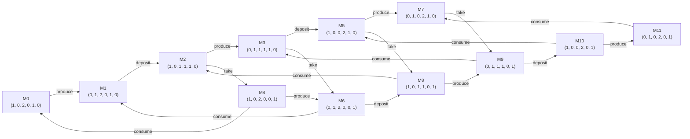
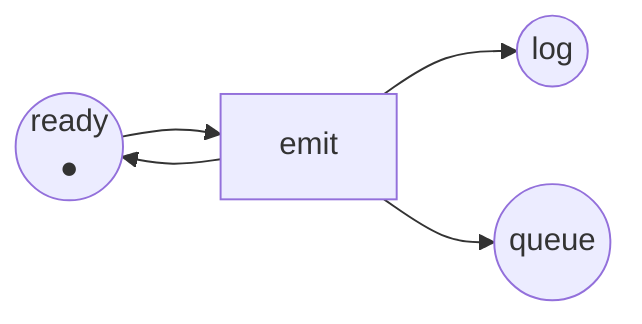

Código completo: [`code/petri-nets`](https://github.com/spareilleux/learn/tree/main/code/petri-nets). Esta lección la imprime `dotnet run --project Examples -c Release -- l3`, y se compara con [`expected/l3.txt`](https://github.com/spareilleux/learn/blob/main/code/petri-nets/expected/l3.txt).

La lección 2 dio una condición aritmética que solo sabe refutar. Para *decidir* si un marcado es alcanzable hay un método brutal y evidente: partir de *M0*, disparar todo lo que pueda dispararse y seguir hasta que no aparezca nada nuevo. Ese es el grafo de alcanzabilidad, y esta lección trata de cuándo funciona, de cuándo no, y de qué hacer entonces.

## Construirlo

El **conjunto de alcanzabilidad** R(*N*, *M0*) es el conjunto de marcados alcanzables desde *M0* por cualquier secuencia de disparos. El **grafo de alcanzabilidad** le añade los disparos: un nodo por marcado alcanzable, una flecha etiquetada por disparo.

La construcción es un recorrido en anchura cuya función sucesor es la regla de disparo ([`ReachabilityGraph.cs`](https://github.com/spareilleux/learn/blob/main/code/petri-nets/PetriNets/ReachabilityGraph.cs)):

```csharp
while (queue.Count > 0)
{
    var from = queue.Dequeue();
    foreach (var t in net.EnabledTransitions(states[from]))
    {
        var next = net.Fire(states[from], t);
        if (!index.TryGetValue(next, out var to))
        {
            if (states.Count >= limit) { complete = false; continue; }
            to = states.Count;
            states.Add(next);
            index[next] = to;
            queue.Enqueue(to);
        }
        steps.Add(new Step(from, t, to));
    }
}
```

Dos detalles hacen que la salida sea utilizable y no solo correcta. El recorrido en anchura, para que los estados se numeren en un orden que no depende de la disposición de una tabla hash, y la ordenación de los disparos antes de devolverlos — si no, la misma red imprimiría un grafo distinto en otra máquina, y ningún archivo podría compararse. Y hay un `limit`: sin él, el bucle de arriba no termina con la segunda red de esta lección.

Para el productor y el consumidor de la lección 1, termina en doce:

```
reachability graph of producer-consumer: 12 states, 20 firings
places ready produced free full waiting taken
  M0 = (1, 0, 2, 0, 1, 0)  ready:1 free:2 waiting:1
  M1 = (0, 1, 2, 0, 1, 0)  produced:1 free:2 waiting:1
  M2 = (1, 0, 1, 1, 1, 0)  ready:1 free:1 full:1 waiting:1
  M3 = (0, 1, 1, 1, 1, 0)  produced:1 free:1 full:1 waiting:1
  M4 = (1, 0, 2, 0, 0, 1)  ready:1 free:2 taken:1
  M5 = (1, 0, 0, 2, 1, 0)  ready:1 full:2 waiting:1
  M6 = (0, 1, 2, 0, 0, 1)  produced:1 free:2 taken:1
  M7 = (0, 1, 0, 2, 1, 0)  produced:1 full:2 waiting:1
  M8 = (1, 0, 1, 1, 0, 1)  ready:1 free:1 full:1 taken:1
  M9 = (0, 1, 1, 1, 0, 1)  produced:1 free:1 full:1 taken:1
  M10 = (1, 0, 0, 2, 0, 1)  ready:1 full:2 taken:1
  M11 = (0, 1, 0, 2, 0, 1)  produced:1 full:2 taken:1
  M0 --produce--> M1
  M1 --deposit--> M2
  M2 --produce--> M3
  M2 --take--> M4
  M3 --deposit--> M5
  M3 --take--> M6
  M4 --produce--> M6
  M4 --consume--> M0
  M5 --produce--> M7
  M5 --take--> M8
  M6 --deposit--> M8
  M6 --consume--> M1
  M7 --take--> M9
  M8 --produce--> M9
  M8 --consume--> M2
  M9 --deposit--> M10
  M9 --consume--> M3
  M10 --produce--> M11
  M10 --consume--> M5
  M11 --consume--> M7
```

El analizador dibuja el mismo grafo, así que la imagen y el listado salen del mismo sitio:



Estas son las doce combinaciones que contó la lección 1: el productor en uno de dos estados, el consumidor en uno de dos, el búfer con cero, uno o dos artículos. Todas son alcanzables, que es lo que necesitaba el ejercicio 4 de la lección 2.

Lee M2 y sus dos sucesores. Desde `ready:1 free:1 full:1 waiting:1`, `produce` lleva a M3 y `take` lleva a M4 — y luego M3 hace `take` hasta M6 y M4 hace `produce` hasta M6, el mismo marcado. Ese cuadrado cerrado es el rombo de la lección 1, dibujado. Donde el grafo tiene un rombo, la red tiene concurrencia; donde tiene un nodo con dos flechas salientes que nunca vuelven a juntarse, la red tiene una elección.

Una vez que el grafo existe, varias preguntas se vuelven consultas:

- **¿es *M* alcanzable?** Si *M* está entre los estados.
- **¿puede interbloquearse el sistema?** Si hay un estado sin flecha saliente. Aquí no hay ninguno.
- **¿cuántas marcas puede contener `full`?** El máximo sobre los estados: dos.
- **¿puede el sistema volver al principio?** Si el estado 0 es alcanzable desde todos los estados.

La lección 4 convierte cada una de esas preguntas en una propiedad con nombre y una línea de salida.

## Por qué nadie construye esto a mano

El grafo crece. No siempre como esperas, y merece la pena mirarlo:

```
== How fast the graph grows ==
capacity  states  firings
       1       8       12
       2      12       20
       3      16       28
       4      20       36
       5      24       44
       6      28       52
       7      32       60
       8      36       68
```

Agrandar el búfer cuesta cuatro estados por hueco: lineal, porque el búfer es un solo componente cuyo estado es un número. Añade ahora componentes. Los filósofos comensales — *n* filósofos en una mesa, cada uno necesitando los tenedores de ambos lados, tomados de una vez:

```
philosophers  states  firings
           2       3        4
           3       4        6
           4       7       16
           5      11       30
           6      18       60
           7      29      112
           8      47      208
           9      76      378
          10     123      680
```

3, 4, 7, 11, 18, 29, 47, 76, 123 — cada uno es la suma de los dos anteriores. Son los números de Lucas, que crecen como la razón áurea elevada a *n*. Exponencial, con una base pequeña solo porque los filósofos comparten sus tenedores con los vecinos, lo que restringe lo que puede ocurrir a la vez.

Quita el reparto, y la base pasa a ser el espacio de estados entero de un componente:

```
independent copies  states  firings
                 1      12       20
                 2     144      480
                 3    1728     8640
                 4   20736   138240
                 5  248832  2073600
```

Cinco copias independientes de una red de doce marcados: 12⁵ = 248 832 marcados. Este es el **problema de la explosión de estados**, y es la razón de ser de todo el resto de la materia. El modelo no tiene nada de malo — esos marcados son realmente todos distintos — pero un enfoque que los enumera deja de funcionar en algún punto entre la cuarta y la quinta copia de un sistema de seis plazas.

Ya se ven dos salidas. La lección 5 demuestra cosas sobre todos los marcados a la vez con invariantes, y nunca construye un grafo. La lección 15 cubre las técnicas que conservan el grafo pero dejan de explorar entrelazados que llevan al mismo sitio: la reducción de orden parcial y los desplegados.

## Cuando el grafo es infinito

Toma el productor y el consumidor, y quita la plaza `free` con sus dos arcos — el cambio del que hablaba el ejercicio 1 de la lección 1. Nada más se mueve:

```
== Remove the place free and the graph becomes infinite ==
net unbounded-producer
places      ready produced full waiting taken
transitions produce deposit take consume
M0          (1, 0, 0, 1, 0) = ready:1 waiting:1
arc         ready -> produce
arc         produce -> produced
arc         produced -> deposit
arc         deposit -> full
arc         deposit -> ready
arc         full -> take
arc         waiting -> take
arc         take -> taken
arc         taken -> consume
arc         consume -> waiting
```

`deposit` ya no necesita un hueco libre. El productor puede funcionar indefinidamente sin que el consumidor tome nada, y `full` crece sin límite. La búsqueda no termina; solo la detiene el `limit`:

```
stopped after 50 states, complete: False
largest number of tokens in full among them: 13
```

Cincuenta estados después, el búfer contiene trece artículos y no hay razón para que pare. Eso es una cola no acotada en un sistema real, y lo interesante es lo pequeño que fue el cambio: una plaza, dos arcos, ni una línea de «lógica».

## El árbol de cobertura

Karp y Miller resolvieron esto en 1969, en un artículo sobre esquemas de programas paralelos, y Murata presenta la construcción en la sección IV-A. La idea es una mentira bien elegida.

Construye un árbol en lugar de un grafo, desde *M0*, disparando todo lo sensibilizado. Cuando un marcado nuevo *M* cubre estrictamente a uno de sus propios antepasados *M*′ — es decir, *M* ≥ *M*′ plaza por plaza y *M* ≠ *M*′ — entonces el camino de *M*′ a *M* puede repetirse, y toda plaza donde *M* creció puede bombearse tan alto como quieras. Escribe pues **ω** en esas plazas, un símbolo que significa «cualquier número de marcas», con ω + *k* = ω y ω − *k* = ω, y ω ≥ *n* para todo *n*. Detén una rama cuando su marcado ya aparece en el camino desde la raíz.

Eso es todo [`CoverabilityTree.cs`](https://github.com/spareilleux/learn/blob/main/code/petri-nets/PetriNets/CoverabilityTree.cs):

```csharp
/// <summary>Sustituye por omega toda plaza que haya crecido desde un antepasado que este marcado cubre estrictamente.</summary>
private static Marking WithOmegas(PetriNet net, List<CoverabilityNode> nodes, int parent, Marking marking)
{
    var tokens = marking.ToArray();
    foreach (var ancestor in Ancestors(nodes, parent).Append(nodes[parent]))
    {
        if (!marking.StrictlyCovers(ancestor.Marking)) continue;
        for (var p = 0; p < net.Places.Count; p++)
        {
            if (tokens[p] != Marking.Omega && tokens[p] > ancestor.Marking[p]) tokens[p] = Marking.Omega;
        }
    }
    return new Marking(tokens);
}
```

El árbol es siempre finito, para cualquier red. Sobre el productor no acotado tiene diecisiete nodos:

```
coverability tree of unbounded-producer: 17 nodes
places ready produced full waiting taken
  root (1, 0, 0, 1, 0)
    produce -> (0, 1, 0, 1, 0)
      deposit -> (1, 0, ω, 1, 0)
        produce -> (0, 1, ω, 1, 0)
          deposit -> (1, 0, ω, 1, 0)  [already on this path]
          take -> (0, 1, ω, 0, 1)
            deposit -> (1, 0, ω, 0, 1)
              produce -> (0, 1, ω, 0, 1)  [already on this path]
              consume -> (1, 0, ω, 1, 0)  [already on this path]
            consume -> (0, 1, ω, 1, 0)  [already on this path]
        take -> (1, 0, ω, 0, 1)
          produce -> (0, 1, ω, 0, 1)
            deposit -> (1, 0, ω, 0, 1)  [already on this path]
            consume -> (0, 1, ω, 1, 0)
              deposit -> (1, 0, ω, 1, 0)  [already on this path]
              take -> (0, 1, ω, 0, 1)  [already on this path]
          consume -> (1, 0, ω, 1, 0)  [already on this path]
  bound of ready: 1
  bound of produced: 1
  bound of full: unbounded
  bound of waiting: 1
  bound of taken: 1
  dead transitions: none
```

Mira la tercera línea. El primer `deposit` produce `(1, 0, 1, 1, 0)`, que cubre estrictamente la raíz `(1, 0, 0, 1, 0)`: igual en todo, una marca más en `full`. Así que `full` se vuelve ω, y de ahí en adelante todo el subárbol lo lleva. Diecisiete nodos sustituyen a un grafo infinito, y responden a la pregunta que importaba: **`full` no está acotada, todas las demás plazas son seguras.**

Ese es el uso principal del árbol. Murata enumera lo que decide (sección IV-A):

- la **acotación** de la red, y de cada plaza: una plaza no está acotada exactamente cuando ω aparece en ella en algún punto del árbol;
- **qué transiciones están muertas**: una transición que no etiqueta ningún arco del árbol no puede disparar nunca;
- y cuando la red *sí* está acotada, el árbol contiene todos los marcados alcanzables, así que responde a todo lo que responde el grafo.

## Lo que ω olvida

Es una mentira, aunque cuidadosa, y el precio aparece enseguida. Sobre el productor y el consumidor acotados, el árbol tiene cincuenta y seis nodos para doce marcados, porque un árbol repite cada marcado una vez por cada camino que llega a él:

```
coverability tree of producer-consumer: 56 nodes
```

Y sobre una red no acotada, ω destruye información que no se puede recuperar:

```
== What omega forgets ==
The tree says full is unbounded. It cannot say whether full ever holds exactly 3 tokens
while the consumer waits, because omega replaced the count.
```

Así que el árbol de cobertura **no** decide la alcanzabilidad. `(1, 0, 3, 1, 0)` y `(1, 0, 3, 0, 1)` aparecen ambos en el árbol como `(1, 0, ω, …)`, y el árbol no puede decirte cuál alcanza realmente la red. Tampoco decide la vivacidad, por la misma razón. No es una debilidad de esta implementación: Murata lo enuncia como una limitación del método, y por eso la lección 4 solo le pide la vivacidad al analizador sobre el grafo finito.

## Qué es decidible, y a qué precio

El resumen honesto, con los resultados que lo establecieron:

- **La acotación y la cobertura son decidibles**, con esta construcción y sus refinamientos. El coste exacto se conoce: la cobertura es EXPSPACE-completa — la cota inferior es el informe técnico de Yale de Lipton, 1976, *The reachability problem requires exponential space*, y la cota superior correspondiente es Rackoff, [*The covering and boundedness problems for vector addition systems*](https://doi.org/10.1016/0304-3975%2878%2990036-1), **Theoretical Computer Science** 6(2), 1978, páginas 223–231. *Por verificar: cito el informe de Lipton a partir de fuentes secundarias; no he leído el original.*
- **La alcanzabilidad es decidible**, demostrado por Mayr ([STOC 1981](https://doi.org/10.1145/800076.802477)) y Kosaraju ([STOC 1982](https://doi.org/10.1145/800070.802201)) — y tardó casi veinte años desde que se planteó la pregunta.
- **La alcanzabilidad es Ackermann-completa.** La cota superior es de Leroux y Schmitz, [LICS 2019](https://doi.org/10.1109/LICS.2019.8785796); la cota inferior correspondiente se demostró en 2021 por Czerwiński y Orlikowski ([FOCS 2021](https://doi.org/10.1109/FOCS52979.2021.00120)) y, de forma independiente, por Leroux ([FOCS 2021](https://doi.org/10.1109/FOCS52979.2021.00121)). Ackermann no es una figura retórica: la función crece más deprisa que cualquier función primitiva recursiva, así que ningún algoritmo para el problema general puede ser práctico en el peor caso.

No leas esto como «las redes de Petri no sirven en la práctica». Léelo como «pedir alcanzabilidad completa sobre una red no acotada es la pregunta cara». Las redes que la gente analiza de verdad están acotadas, o se analizan con invariantes, o pertenecen a una clase estructural donde la pregunta se desmorona — que es para lo que están las lecciones 5 y 6.

## Puntos clave

- El grafo de alcanzabilidad tiene un nodo por marcado alcanzable y una flecha etiquetada por disparo. Construido en anchura y con la salida ordenada, es el mismo en todas las máquinas, que es la única manera de que una lección lo pueda citar.
- Una vez que existe, la alcanzabilidad, el interbloqueo, las cotas y la reversibilidad son consultas.
- Explota. Agrandar un componente cuesta linealmente; añadir componentes independientes multiplica. Cinco copias de una red de doce marcados tienen 248 832.
- Una red cuyo conjunto alcanzable es infinito no tiene grafo que construir, y un cambio minúsculo — una plaza quitada — basta para llegar ahí.
- El árbol de cobertura de Karp–Miller sigue siendo finito para toda red, escribiendo ω en una plaza de la que se ha mostrado que crece. Decide la acotación, las cotas por plaza y las transiciones muertas.
- No decide ni la alcanzabilidad ni la vivacidad: ω ha tirado los recuentos que esas preguntas necesitan.
- La alcanzabilidad es decidible y Ackermann-completa; la cobertura es decidible y EXPSPACE-completa.

## Ejercicios

1. Construye a mano el grafo de alcanzabilidad de la red de exclusión mutua de la lección 1 — tiene pocos marcados. ¿Cuántos hay, y qué pares de transiciones llegan a estar sensibilizados a la vez?
2. En el grafo del productor y el consumidor de arriba, encuentra la secuencia de disparos más corta de M0 a M11 = `(0, 1, 0, 2, 0, 1)`. ¿Qué está haciendo el sistema en ese marcado?
3. El árbol de cobertura del productor no acotado tiene 17 nodos, y el del acotado tiene 56. Explica por qué es la red *no acotada* la que se lleva el árbol más pequeño.
4. Da una red con dos plazas donde el árbol de cobertura escriba ω en las dos, y di qué secuencia se lo hace escribir.

<details>
<summary>Soluciones</summary>

**1.** Tres marcados: `(1, 0, 1, 0, 1)` sin nadie dentro, `(0, 1, 1, 0, 0)` con el hilo 1 dentro, y `(1, 0, 0, 1, 0)` con el hilo 2 dentro. El grafo es un triángulo con dos flechas en cada sentido pasando por el marcado del medio. El único par de transiciones que llega a estar sensibilizado a la vez es `enter1` y `enter2`, en el primer marcado — y están en conflicto, así que solo disparará una. La lección 4 imprime esos tres marcados como los estados de origen de esa red.

**2.** Ocho disparos — M11 es el marcado más lejano de los doce: `produce, deposit, produce, deposit, produce, take, deposit, produce`, siguiendo M0 → M1 → M2 → M3 → M5 → M7 → M9 → M10 → M11. En M11 el productor sostiene un artículo que no puede poner en ningún sitio (`produced:1`, y `free` vale 0), el búfer está lleno con dos artículos, y el consumidor tiene uno que no ha consumido: todo lo que puede estar sosteniendo algo lo está. El método `PathTo` del analizador hace el mismo recorrido en anchura, y una prueba unitaria fija esta secuencia.

**3.** Porque el árbol se detiene en cuanto un marcado se repite *en su propio camino*, y ω hace que los marcados se repitan mucho antes. En la red no acotada, el tercer nodo ya lleva ω en `full`, lo que reduce todos los «un artículo más en el búfer» al mismo símbolo; sus diecisiete nodos contienen solo seis marcados distintos. En la red acotada, `full` toma de verdad tres valores distintos, y el árbol tiene que deletrear todos los caminos a través de los doce marcados — un grafo de 12 nodos y 20 aristas se despliega en un árbol de 56.

**4.** El productor no acotado ya lo hace con una sola plaza, una vez quitado el consumidor; para dos, dale al productor dos plazas de salida:



`emit` toma la marca de `ready` y la devuelve, añadiendo una marca en `log` y otra en `queue` cada vez. Disparar `emit` una vez da `(1, 1, 1)`, que cubre estrictamente la raíz `(1, 0, 0)` tanto en `log` como en `queue`, así que el árbol escribe `(1, ω, ω)` de inmediato. Esta red es `EmitLoop` en el código, y una prueba unitaria comprueba que `log` y `queue` salen no acotadas mientras `ready` sigue siendo segura.

Dos cosas que notar. El par de arcos entre `ready` y `emit` es un bucle propio, así que la matriz de incidencia de la lección 2 tiene ahí un cero aunque la regla de disparo siga necesitando esa marca — es la impureza de la que avisaba la lección 2, en la red más pequeña que la tiene. Y la forma es la del productor no acotado sin la apariencia de consumidor: una transición que devuelve su marca de entrada al instante es un bucle sin freno.

</details>

## Fuentes

- Richard M. Karp y Raymond E. Miller, *Parallel program schemata*, **Journal of Computer and System Sciences** 3(2), mayo de 1969, páginas 147–195, [doi:10.1016/S0022-0000(69)80011-5](https://doi.org/10.1016/S0022-0000%2869%2980011-5). La construcción del árbol de cobertura está en este artículo.
- Tadao Murata, *Petri nets: Properties, analysis and applications*, **Proceedings of the IEEE** 77(4), abril de 1989, páginas 541–580, [doi:10.1109/5.24143](https://doi.org/10.1109/5.24143). La sección IV-A presenta el árbol de cobertura y enumera lo que decide y lo que no.
- Charles Rackoff, *The covering and boundedness problems for vector addition systems*, **Theoretical Computer Science** 6(2), 1978, páginas 223–231, [doi:10.1016/0304-3975(78)90036-1](https://doi.org/10.1016/0304-3975%2878%2990036-1).
- Ernst W. Mayr, *An algorithm for the general Petri net reachability problem*, STOC 1981, [doi:10.1145/800076.802477](https://doi.org/10.1145/800076.802477); S. Rao Kosaraju, *Decidability of reachability in vector addition systems*, STOC 1982, [doi:10.1145/800070.802201](https://doi.org/10.1145/800070.802201).
- Jérôme Leroux y Sylvain Schmitz, *Reachability in vector addition systems is primitive-recursive in fixed dimension*, LICS 2019, [doi:10.1109/LICS.2019.8785796](https://doi.org/10.1109/LICS.2019.8785796); Wojciech Czerwiński y Łukasz Orlikowski, *Reachability in vector addition systems is Ackermann-complete*, FOCS 2021, [doi:10.1109/FOCS52979.2021.00120](https://doi.org/10.1109/FOCS52979.2021.00120); Jérôme Leroux, *The reachability problem for Petri nets is not primitive recursive*, FOCS 2021, [doi:10.1109/FOCS52979.2021.00121](https://doi.org/10.1109/FOCS52979.2021.00121).
