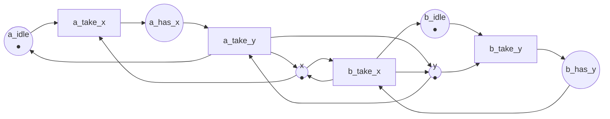

Código completo: [`code/petri-nets`](https://github.com/spareilleux/learn/tree/main/code/petri-nets). Esta lección la imprime `dotnet run --project Examples -c Release -- l4`, y se compara con [`expected/l4.txt`](https://github.com/spareilleux/learn/blob/main/code/petri-nets/expected/l4.txt).

La lección 3 construyó el grafo de alcanzabilidad. Esta lección le hace preguntas. Cada propiedad de abajo está definida para una red y su marcado inicial, se decide en [`NetProperties.cs`](https://github.com/spareilleux/learn/blob/main/code/petri-nets/PetriNets/NetProperties.cs), y luego se muestra sobre una red que no la tiene — porque una definición que solo has visto satisfecha es una definición que no has entendido.

Cinco redes sostienen la lección:

| red | lo que modela |
|---|---|
| `producer-consumer` | lección 1: un productor, un consumidor, dos huecos |
| `mutual-exclusion` | dos hilos y un cerrojo |
| `two-locks` | dos hilos que necesitan dos cerrojos, tomados en órdenes opuestos |
| `start-once` | un servicio que arranca una vez y luego sirve para siempre |
| `handshake` | lección 2: una petición y una respuesta, sin primera petición |

## Acotación y seguridad

Una plaza *p* está ***k*-acotada** cuando ningún marcado alcanzable pone en ella más de *k* marcas. Una red está *k*-acotada cuando todas sus plazas lo están, **acotada** cuando lo está para algún *k*, y **segura** cuando está 1-acotada.

Es la propiedad que se traduce más directamente a código. Una plaza acotada es una cola de capacidad fija, un pool de tamaño fijo, un array que puedes reservar una vez. Una plaza no acotada es una fuga de memoria esperando a un consumidor lento. Una plaza segura es un booleano: la condición se cumple o no.

El productor y el consumidor está 2-acotado y no es seguro, porque `free` y `full` se reparten dos marcas:

```
  bound of ready: 1
  bound of produced: 1
  bound of free: 2
  bound of full: 2
  bound of waiting: 1
  bound of taken: 1
  bounded:       yes (2-bounded)
  safe:          no
```

La red de exclusión mutua es segura — cada plaza es una condición que se cumple o no — y el productor no acotado de la lección 3 no está acotado en absoluto, cosa que el analizador solo puede decir a través del árbol de cobertura:

```
== The unbounded net, seen by the coverability tree ==
bounded: False
  bound of ready: 1
  bound of produced: 1
  bound of full: unbounded
  bound of waiting: 1
  bound of taken: 1
```

Cuatro de sus cinco plazas son seguras. Solo `full` crece, y es la que sería una cola en memoria.

## La vivacidad, en cinco niveles

«Viva» suena a una propiedad y son cinco. Murata (1989, sección II-C) gradúa una transición *t* según lo que todavía puede hacer:

- **L0, muerta**: *t* no puede disparar nunca. No hay ningún marcado alcanzable donde esté sensibilizada.
- **L1**: *t* puede disparar al menos una vez, en alguna secuencia desde *M0*.
- **L2**: para todo *k*, hay una secuencia desde *M0* en la que *t* dispara al menos *k* veces.
- **L3**: hay una secuencia infinita desde *M0* en la que *t* dispara infinitas veces.
- **L4, viva**: desde *todo* marcado alcanzable hay una secuencia que dispara *t*.

Cada nivel implica los anteriores, y L4 es el interesante, porque es el único que sobrevive a todo lo que el sistema ya haya hecho. Una transición L1 tiene *un* buen camino; una transición L4 no tiene ninguno malo. Una **red** es viva cuando todas sus transiciones son L4.

Traducido: L4 es «esta operación siempre podrá volver a ocurrir», que es lo que quieres decir cuando afirmas que un sistema no tiene interbloqueo *ni* inanición. L1 es «este camino de código es alcanzable», que es lo que te dice un informe de cobertura.

El analizador da un nivel por transición. Sobre un grafo de alcanzabilidad finito, L2 y L3 coinciden, y los imprime juntos: si *t* puede disparar *k* veces para todo *k*, entonces para *k* mayor que el número de aristas algún disparo de *t* tiene que estar en un ciclo alcanzable desde *M0*, y dar vueltas a ese ciclo para siempre da la secuencia infinita que pide L3. Así que el analizador decide L2/L3 buscando un disparo de *t* cuyo origen y destino estén en la misma componente fuertemente conexa, y L4 comprobando que todo marcado alcanzable puede aún alcanzar un marcado donde *t* esté sensibilizada.

```csharp
// L2/L3: algún disparo de t está en un ciclo, así que puede repetirse para siempre.
var onCycle = graph.Steps.Any(step => step.Transition == t && components[step.From] == components[step.To]);
if (!onCycle) { liveness[t] = Liveness.L1; continue; }

// L4: todo marcado alcanzable puede aún alcanzar un marcado donde t está sensibilizada.
var canReach = Backward(predecessors, sources, states.Count);
liveness[t] = canReach.All(x => x) ? Liveness.Live : Liveness.L2L3;
```

El productor y el consumidor es vivo: las cuatro transiciones son L4. La red `handshake` de la lección 2 es el extremo contrario, y el analizador lo dice con una palabra por transición:

```
  live:          no
    receive    L0, dead
    reply      L0, dead
```

## La ausencia de interbloqueo no es la vivacidad

Un marcado sin ninguna transición sensibilizada es un **marcado muerto**. Una red está **libre de interbloqueo** cuando ningún marcado alcanzable está muerto.

Es tentador tratar la ausencia de interbloqueo como la propiedad que quieres. No basta, y `start-once` es el contraejemplo: un servicio arranca, y luego acepta y termina peticiones para siempre. Algo siempre puede disparar, así que la red está libre de interbloqueo — y `start` no volverá a disparar nunca:

```
== start-once ==
properties of start-once
  bound of stopped: 1
  bound of running: 1
  bound of serving: 1
  bounded:       yes (1-bounded)
  safe:          yes
  deadlock-free: yes
  live:          no
    start      L1, can fire once
    accept     L4, live
    finish     L4, live
  reversible:    no
  home states:   (0, 1, 0) (0, 0, 1)
  persistent:    yes
```

Aquí no es un fallo — se *supone* que un servicio arranca una vez — y ese es justo el punto. «Viva» no es sinónimo de «correcta»: es una pregunta precisa, y la respuesta correcta para `start` es L1. Lo que pregunta una revisión de verdad es qué transiciones deben ser L4 y cuáles no, y el analizador te da la lista con la que contrastar.

La otra dirección es el caso clásico. Dos hilos, dos cerrojos, tomados en órdenes opuestos:



El hilo A toma `x` y luego `y`; el hilo B toma `y` y luego `x`; cada uno suelta los dos cuando termina. Nada en la imagen dice «interbloqueo», y el analizador encuentra uno:

```
== two-locks ==
properties of two-locks
  ...
  deadlock-free: no
    dead marking (0, 1, 0, 1, 0, 0)  a_has_x:1 b_has_y:1
  live:          no
    a_take_x   L2/L3, can fire for ever but not from everywhere
    a_take_y   L2/L3, can fire for ever but not from everywhere
    b_take_y   L2/L3, can fire for ever but not from everywhere
    b_take_x   L2/L3, can fire for ever but not from everywhere
  reversible:    no
  home states:   (0, 1, 0, 1, 0, 0)
  persistent:    no
```

Lee la columna de vivacidad. Todas las transiciones son L2/L3, no L4: cada una puede disparar para siempre — los dos hilos pueden turnarse indefinidamente — y ninguna puede disparar desde *todos* los marcados alcanzables, porque desde el muerto no puede nada. Así se ve un interbloqueo en esta graduación, y por eso L2 es una promesa tan débil: una prueba de carga que corre una hora sin atascarse ha demostrado L2, no L4.

La línea `home states: (0, 1, 0, 1, 0, 0)` dice el mismo hecho de la peor manera posible: el único marcado al que esta red siempre puede volver es el interbloqueo.

El analizador también imprime cómo llegar allí, como el camino más corto desde *M0* en el grafo de alcanzabilidad:

```
== How the two locks deadlock ==
M3 = (0, 1, 0, 1, 0, 0)  a_has_x:1 b_has_y:1
  reached by: a_take_x, b_take_y
```

Dos disparos. A tiene `x` y espera `y`; B tiene `y` y espera `x`. El arreglo que todo desarrollador de C# y Java conoce — tomar los cerrojos en el mismo orden en todas partes — es, en esta red, «hacer que `b_take_x` vaya antes que `b_take_y`», y el ejercicio 2 te pide comprobar que el interbloqueo desaparece.

## Reversibilidad y estados de origen

Una red es **reversible** cuando *M0* es alcanzable desde todo marcado alcanzable: haya hecho lo que haya hecho, puede volver al principio. Más en general, un marcado *M* es un **estado de origen** cuando *M* es alcanzable desde todo marcado alcanzable.

Reversible es lo que quieres de un servidor: después de atender cualquier cosa, vuelve al reposo, listo para la siguiente. Es lo que hace el productor y el consumidor, y lo que no hace `start-once`, ya que nada devuelve la marca a `stopped`. Un flujo de trabajo, en cambio, **no** debe ser reversible: todo su sentido es terminar.

El analizador decide ambas cosas sobre el grafo — la reversibilidad con una búsqueda hacia atrás desde el estado 0, y los estados de origen buscando una única componente fuertemente conexa terminal, cuyos marcados son entonces exactamente los estados de origen.

## Persistencia

Una red es **persistente** cuando, para dos transiciones sensibilizadas cualesquiera, disparar una deja a la otra sensibilizada. Dicho de otro modo, lo único que puede quitarte el derecho a disparar es disparar.

Es el conflicto, enunciado como propiedad. El productor y el consumidor es persistente: `produce` y `take` nunca compiten por una marca, que es el rombo de la lección 1. La red de exclusión mutua no lo es, y la única línea que lo dice es el cerrojo:

```
== mutual-exclusion ==
  ...
  safe:          yes
  deadlock-free: yes
  live:          yes
    enter1     L4, live
    leave1     L4, live
    enter2     L4, live
    leave2     L4, live
  reversible:    yes
  home states:   (1, 0, 1, 0, 1) (0, 1, 1, 0, 0) (1, 0, 0, 1, 0)
  persistent:    no
```

Segura, viva, reversible y no persistente: eso es un buen cerrojo. `enter1` y `enter2` están ambas sensibilizadas en el marcado inicial y cada una desensibiliza a la otra, que es todo el papel de la marca de `mutex`. Una red persistente no tiene esa elección en ninguna parte, y por eso las redes persistentes son mucho más fáciles de analizar — y por eso casi ningún programa concurrente interesante es una de ellas.

## Lo que el grafo demuestra, y lo que no puede

Todo lo anterior se ha decidido por enumeración. Eso funciona mientras el grafo sea finito, y cada respuesta es exacta. En cuanto la red no está acotada, el grafo desaparece, y el árbol de cobertura de la lección 3 solo responde a algunas de estas preguntas: sigue decidiendo la acotación y qué transiciones están muertas, pero ω ha tirado los recuentos de marcas que harían falta para la vivacidad o la alcanzabilidad.

Dos hechos merecen salir de esta lección:

- **La alcanzabilidad es decidible.** Demostrado de forma independiente por Mayr ([STOC 1981](https://doi.org/10.1145/800076.802477)) y Kosaraju ([STOC 1982](https://doi.org/10.1145/800070.802201)). También es espectacularmente cara: el problema es Ackermann-completo, con la cota superior de Leroux y Schmitz ([LICS 2019](https://doi.org/10.1109/LICS.2019.8785796)) y la cota inferior correspondiente de Czerwiński y Orlikowski ([FOCS 2021](https://doi.org/10.1109/FOCS52979.2021.00120)) y de Leroux ([FOCS 2021](https://doi.org/10.1109/FOCS52979.2021.00121)).
- **La vivacidad no es más fácil.** Hack demostró en 1974 que el problema de la vivacidad y el de la alcanzabilidad son [recursivamente equivalentes](https://doi.org/10.1109/SWAT.1974.28): un algoritmo para cualquiera de los dos da un algoritmo para el otro. Así que «¿puede este sistema volver siempre a hacer X?» es exactamente igual de difícil que «¿puede este sistema alcanzar el estado M?».

Para las redes de esta lección nada de eso importa, porque doce marcados caben en una pantalla. Importa en cuanto modelas algo real, y por eso la lección 5 cambia la pregunta: en lugar de enumerar marcados, demostrar algo sobre todos a la vez.

## Puntos clave

- **Acotada** significa que ninguna plaza se desborda; *k*-acotada da la capacidad; **segura** significa que cada plaza es un booleano. Una plaza no acotada es una cola no acotada.
- **La vivacidad tiene cinco niveles.** L0 muerta, L1 puede disparar una vez, L2 puede disparar arbitrariamente a menudo, L3 puede disparar infinitas veces en una ejecución, L4 siempre puede volver a disparar. Una red es viva cuando todas sus transiciones son L4.
- **Libre de interbloqueo es más débil que viva.** `start-once` no tiene interbloqueo y no es viva; `two-locks` tiene un interbloqueo y todas sus transiciones son L2/L3, que es exactamente lo que te habría mostrado una prueba de carga larga.
- **Reversible** significa que el marcado inicial siempre es alcanzable de nuevo; un **estado de origen** es un marcado que siempre lo es. Un servidor debería ser reversible, un flujo de trabajo no.
- **Persistente** significa que ninguna transición sensibilizada es desensibilizada nunca por otra. Un cerrojo es precisamente una violación de la persistencia.
- Todo esto se decide de forma exacta sobre un grafo de alcanzabilidad finito, y en general es decidible pero Ackermann-difícil; vivacidad y alcanzabilidad son recursivamente equivalentes.

## Ejercicios

1. El productor y el consumidor está 2-acotado. ¿Qué número único cambiarías para hacerlo seguro, y qué sería entonces el sistema?
2. Invierte el orden en que el hilo B toma sus cerrojos — `b_take_x` primero, luego `b_take_y` — para que los dos hilos tomen `x` antes que `y`. Construye la red y comprueba: ¿está libre de interbloqueo? ¿es viva? ¿es reversible?
3. `start-once` está libre de interbloqueo y no es viva. Modifícala para que sea viva, sin quitar ninguna transición.
4. ¿Cuál de las cinco propiedades exigirías de verdad (a) a un bucle de consumo de RabbitMQ, (b) a un flujo de trabajo de procesamiento de pedidos, (c) a un cerrojo? Da una propiedad que deba cumplirse y una que no, para cada caso.

<details>
<summary>Soluciones</summary>

**1.** Pon el marcado inicial de `free` a 1. La red se vuelve segura, y el sistema se convierte en una entrega en mano sin ningún búfer: el productor no puede depositar un segundo artículo hasta que el consumidor haya tomado el primero. Es la diferencia entre `Channel.CreateBounded(2)` y `Channel.CreateBounded(1)` — o, en Java, entre una `ArrayBlockingQueue(2)` y una `SynchronousQueue`, salvo que la red aún deja al productor *sostener* un artículo, cosa que una `SynchronousQueue` no hace.

**2.** Con los dos hilos tomando `x` primero, la red está libre de interbloqueo, es viva y es reversible. La razón se ve sin el analizador: un hilo solo puede estar esperando `y` mientras tiene `x`, y solo un hilo puede tener `x`, así que como mucho hay un hilo bloqueado, y el que tiene los dos cerrojos siempre termina. La regla general — imponer un orden total sobre la toma de cerrojos — es exactamente este argumento, y la lección 6 da la condición estructural que hay detrás.

**3.** Añade un arco desde una plaza a la que la red vuelve una y otra vez hacia `stopped`, o, más sencillo, añade una transición `stop` de `running` a `stopped`. Entonces el marcado `(1, 0, 0)` vuelve a ser alcanzable desde todas partes, `start` se vuelve L4, y la red es viva *y* reversible. Fíjate en lo que has modelado: un servicio que se puede reiniciar.

**4.** Un conjunto de respuestas defendible.

(a) Un bucle de consumo de RabbitMQ debe ser **vivo** — cada confirmación tiene que poder volver a ser posible siempre — y **no** debe ser una red cuya plaza «cola» esté no acotada, o el broker estará guardando mensajes que nadie toma. La acotación aquí no es una finura de modelado: es la alarma sobre la profundidad de la cola.

(b) Un flujo de trabajo de procesamiento de pedidos **no** debe ser reversible — tiene que terminar — y debe estar **libre de interbloqueo** en el sentido de que toda ejecución alcanza su marcado final en vez de pararse a mitad de camino. La lección 10 convierte eso en una sola propiedad llamada *soundness*, más fuerte que cualquiera de estas dos.

(c) Un cerrojo **no** debe ser persistente — eso es lo que es un cerrojo — y debe ser **seguro**: dos marcas en `mutex` serían dos hilos en la sección crítica.

</details>

## Fuentes

- Tadao Murata, *Petri nets: Properties, analysis and applications*, **Proceedings of the IEEE** 77(4), abril de 1989, páginas 541–580, [doi:10.1109/5.24143](https://doi.org/10.1109/5.24143). La sección II-C define la acotación, la seguridad, los cinco niveles de vivacidad, la reversibilidad, los estados de origen y la persistencia, en ese orden.
- Michel Hack, *The recursive equivalence of the reachability problem and the liveness problem for Petri nets and vector addition systems*, 15th Annual Symposium on Switching and Automata Theory, 1974, páginas 156–164, [doi:10.1109/SWAT.1974.28](https://doi.org/10.1109/SWAT.1974.28).
- Ernst W. Mayr, *An algorithm for the general Petri net reachability problem*, STOC 1981, [doi:10.1145/800076.802477](https://doi.org/10.1145/800076.802477); S. Rao Kosaraju, *Decidability of reachability in vector addition systems*, STOC 1982, [doi:10.1145/800070.802201](https://doi.org/10.1145/800070.802201).
- Jérôme Leroux y Sylvain Schmitz, *Reachability in vector addition systems is primitive-recursive in fixed dimension*, LICS 2019, [doi:10.1109/LICS.2019.8785796](https://doi.org/10.1109/LICS.2019.8785796); Wojciech Czerwiński y Łukasz Orlikowski, *Reachability in vector addition systems is Ackermann-complete*, FOCS 2021, [doi:10.1109/FOCS52979.2021.00120](https://doi.org/10.1109/FOCS52979.2021.00120); Jérôme Leroux, *The reachability problem for Petri nets is not primitive recursive*, FOCS 2021, [doi:10.1109/FOCS52979.2021.00121](https://doi.org/10.1109/FOCS52979.2021.00121).
