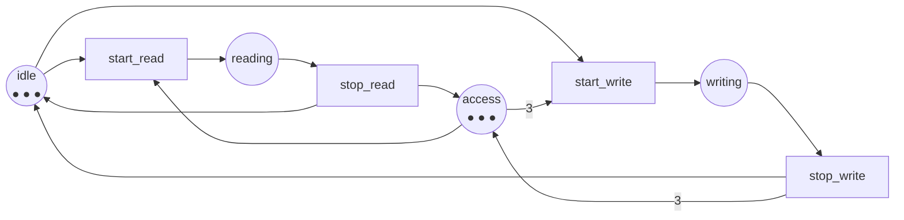

Código completo: [`code/petri-nets`](https://github.com/spareilleux/learn/tree/main/code/petri-nets). Esta lección la imprime `dotnet run --project Examples -c Release -- l7`, y se compara con [`expected/l7.txt`](https://github.com/spareilleux/learn/blob/main/code/petri-nets/expected/l7.txt).

Las seis primeras lecciones construyeron la maquinaria. Esta la gasta en los cinco patrones de los que está hecho todo programa concurrente, y pone cada red junto a la construcción a la que ya recurres: [`lock`](https://learn.microsoft.com/dotnet/csharp/language-reference/statements/lock), [`SemaphoreSlim`](https://learn.microsoft.com/dotnet/api/system.threading.semaphoreslim), [`Channel<T>`](https://learn.microsoft.com/dotnet/api/system.threading.channels.channel), [`ReaderWriterLockSlim`](https://learn.microsoft.com/dotnet/api/system.threading.readerwriterlockslim), y en Java [`synchronized`](https://docs.oracle.com/javase/specs/jls/se21/html/jls-14.html), [`ReentrantLock`](https://docs.oracle.com/en/java/javase/21/docs/api/java.base/java/util/concurrent/locks/ReentrantLock.html), [`Semaphore`](https://docs.oracle.com/en/java/javase/21/docs/api/java.base/java/util/concurrent/Semaphore.html), [`ArrayBlockingQueue`](https://docs.oracle.com/en/java/javase/21/docs/api/java.base/java/util/concurrent/ArrayBlockingQueue.html) y [`ReentrantReadWriteLock`](https://docs.oracle.com/en/java/javase/21/docs/api/java.base/java/util/concurrent/locks/ReentrantReadWriteLock.html).

El [curso de C# avanzado](../../csharp-advanced/) dedicó las lecciones [6](../../csharp-advanced/06-channels/), [7](../../csharp-advanced/07-tpl-dataflow/) y [8](../../csharp-advanced/08-rx-net/) a medir la contrapresión. Esta lección la modela en lugar de medirla, y lo que allí se medía aquí es una plaza.

| patrón | la red | la construcción |
|---|---|---|
| un cerrojo | una marca en una plaza que leen los dos hilos | `lock`, `Monitor`, `synchronized`, `ReentrantLock` |
| un semáforo contador | *k* marcas en esa plaza | `new SemaphoreSlim(k)`, `new Semaphore(k)` |
| un canal acotado | una plaza que contiene los huecos libres | `Channel.CreateBounded(k)`, `new ArrayBlockingQueue(k)` |
| un cerrojo de lectura/escritura | un arco de peso *n* a la misma plaza | `ReaderWriterLockSlim`, `ReentrantReadWriteLock` |
| los filósofos | un anillo de plazas compartidas | cualquier orden de recursos sobre el que hayas discutido |

## Un cerrojo es una marca

La lección 4 construyó la red y la lección 5 calculó sus invariantes. Júntalas y el cerrojo deja de ser una convención:

```
== One lock, and the invariant that is the proof ==
invariants of mutual-exclusion
  place invariants (3):
    idle1 + critical1 = 1
    critical1 + critical2 + mutex = 1
    idle2 + critical2 = 1
  transition invariants (2):
    enter1 + leave1
    enter2 + leave2
markings where both threads are inside: 0 out of 3
```

`critical1 + critical2 + mutex = 1` es la especificación de un mutex, escrita como aritmética. Como ninguno de los tres recuentos puede ser negativo, como mucho uno de `critical1` y `critical2` vale 1 alguna vez. La última línea es la misma afirmación comprobada por fuerza bruta sobre los tres marcados alcanzables, que es lo que harías en una prueba; el invariante es lo que harías en una demostración, y no le importa cuántos marcados haya.

Los dos invariantes de transiciones son la otra mitad del contrato: `enter1 + leave1` dice que un hilo que toma el cerrojo lo devuelve. Una red donde `leave1` no existiera no tendría tal invariante, que es el modelo de un cerrojo que se te olvidó soltar.

## k permisos en vez de uno

Nada en la red dice que la marca sea única. Pon *k* de ellas y tienes un semáforo contador:

```
== k permits instead of one: the counting semaphore ==
threads  permits  states  greatest number inside at once  invariant
      3        1       4                              1  permits + inside1 + inside2 + inside3 = 1
      3        2       7                              2  permits + inside1 + inside2 + inside3 = 2
      3        3       8                              3  permits + inside1 + inside2 + inside3 = 3
```

El lado derecho del invariante *es* el argumento del constructor. `new SemaphoreSlim(2)` es `permits = 2` en el marcado inicial y nada más; el analizador mide entonces que nunca hay más de dos de los tres hilos dentro, que es lo que el invariante ya decía.

Fíjate en la columna del medio. Tres hilos y tres permisos dan 8 = 2³ marcados, porque el semáforo ha dejado de restringir nada — cada hilo está dentro o fuera de forma independiente. Dos permisos dan 7: exactamente el único marcado con los tres dentro eliminado. El número de marcados que quita una primitiva de concurrencia es una medida justa de cuánto está haciendo.

## Un canal acotado es la plaza `free`

El ejemplo conductor de este curso es un canal acotado desde la lección 1, y la plaza `free` es la cota desde la lección 1 también:

```
== A bounded channel is the place free ==
capacity  states  bound of full  invariant
       1       8              1  free + full = 1
       2      12              2  free + full = 2
       3      16              3  free + full = 3
       4      20              4  free + full = 4
```

`Channel.CreateBounded<T>(new BoundedChannelOptions(k))` es `free = k`. Un productor que se bloquea en `WriteAsync` es la transición `deposit` sin estar sensibilizada, porque `free` no tiene nada. Eso es toda la contrapresión, y es una plaza.

Dos cosas que la tabla concreta. El número de estados crece *linealmente* con la capacidad, 4·(*k*+1), no exponencialmente — una cola acotada es algo barato de modelar. Y la cota de `full` es siempre la capacidad, demostrada por `free + full = k` sin el grafo, que es la prueba de la lección 5 reformulada para todos los *k* a la vez.

Lo que la red *no* modela es el tiempo. Dice que el productor puede estar bloqueado, nunca cuánto tiempo, y no tiene opinión sobre si `Channel.CreateBounded` con `BoundedChannelFullMode.DropOldest` es la elección correcta. La lección 9 añade el tiempo y la pregunta pasa a ser respondible.

## Lectores y escritores: un arco de peso 3

La primera red de este curso con un arco con peso. Tres permisos en `access`; un lector toma uno; un escritor toma los tres:

```
net readers-writers
places      idle reading writing access
transitions start_read stop_read start_write stop_write
M0          (3, 0, 0, 3) = idle:3 access:3
arc         idle -> start_read
arc         access -> start_read
arc         start_read -> reading
arc         reading -> stop_read
arc         stop_read -> idle
arc         stop_read -> access
arc         idle -> start_write
arc         access -> start_write (weight 3)
arc         start_write -> writing
arc         writing -> stop_write
arc         stop_write -> idle
arc         stop_write -> access (weight 3)
```



Los invariantes dicen lo que el cerrojo garantiza:

```
invariants of readers-writers
  place invariants (2):
    idle + reading + writing = 3
    reading + 3*writing + access = 3
  transition invariants (2):
    start_read + stop_read
    start_write + stop_write
```

`reading + 3*writing + access = 3` lleva toda la política. `writing` es como mucho 1, porque 3·`writing` no puede pasar de 3. Y cuando `writing` vale 1, tanto `reading` como `access` valen 0 — un escritor excluye a todos los lectores *y* a todos los demás escritores, no por una regla que alguien se acordó de imponer sino por aritmética. El peso 3 del arco es la exclusión.

El comportamiento lo confirma:

```
properties of readers-writers
  bound of idle: 3
  bound of reading: 3
  bound of writing: 1
  bound of access: 3
  bounded:       yes (3-bounded)
  safe:          no
  deadlock-free: yes
  live:          yes
    start_read L4, live
    stop_read  L4, live
    start_write L4, live
    stop_write L4, live
  reversible:    yes
  home states:   (3, 0, 0, 3) (2, 1, 0, 2) (2, 0, 1, 0) (1, 2, 0, 1) (0, 3, 0, 0)
  persistent:    no
markings with a writer and a reader at once: 0
markings with two writers at once: 0
```

Segura, no; viva, sí; libre de interbloqueo, sí. Todo lo que se supone que es un cerrojo de lectura/escritura.

## Viva y muerta de hambre al mismo tiempo

Y ahora la parte que vale por toda la lección. `start_write` es L4 — desde todo marcado alcanzable, alguna secuencia la dispara. Aquí está la misma red, desde el mismo grafo:

```
== Live and starved at the same time ==
start_write is live: True
and yet the net can run for ever without ever firing it:
  M3 = (1, 2, 0, 1)  --start_read-->
  M4 = (0, 3, 0, 0)  --stop_read-->
```

Dos marcados y dos disparos, dando vueltas para siempre: un lector empieza, un lector para, y `access` nunca vuelve a 3, así que el escritor nunca entra. Todo marcado de ese ciclo puede *alcanzar* un marcado donde `start_write` esté sensibilizada — eso es lo que significa L4 — y la red no tiene ninguna obligación de ir allí.

Es la inanición del escritor con la que tiene que lidiar todo cerrojo de lectura/escritura, y es exactamente lo que la vivacidad a secas **no** prohíbe. La vivacidad es «siempre posible»; la inanición va de «acaba ocurriendo», que es una hipótesis de *equidad* sobre el planificador, no una propiedad de la red. Una red de Petri no tiene planificador. Dilo en los dos vocabularios:

- **Redes de Petri**: la vivacidad L4 es una propiedad de tiempo ramificado del grafo de alcanzabilidad; la ausencia de una ejecución infinita que evite *t* es una propiedad distinta y más fuerte, y necesita una restricción de equidad para volverse cierta.
- **C#**: `ReaderWriterLockSlim` documenta una política justo para esto, y `new ReaderWriterLockSlim(LockRecursionPolicy.NoRecursion)` no dice nada sobre la preferencia del escritor. El `ReentrantReadWriteLock` de Java recibe un indicador `fair` en su constructor, y ese indicador es la hipótesis sobre el planificador que esta red no tiene.

El analizador encuentra el ciclo con una búsqueda en profundidad sobre el grafo de alcanzabilidad con `start_write` borrada de él ([`ReachabilityGraph.CycleAvoiding`](https://github.com/spareilleux/learn/blob/main/code/petri-nets/PetriNets/ReachabilityGraph.cs)). Cualquier ciclo así alcanzable desde *M0* es una ejecución en la que la transición no dispara nunca. Es una función pequeña y una costumbre útil: cuando una propiedad dice «siempre acaba», pídele al grafo la ejecución en la que no.

## Los filósofos, un tenedor cada vez

La lección 3 contó los marcados de los filósofos tomando los dos tenedores en una sola transición, y encontró los números de Lucas. Esa red nunca se interbloquea, porque la transición atómica es una mentira: toma dos cerrojos con una instrucción.

Tómalos de uno en uno, como hace el código real, y:

```
== The philosophers, with and without one fork at a time ==
philosophers  both forks at once        one fork at a time       one of them reversed
              states  deadlocks          states  deadlocks         states  deadlocks
           2       3          0               6          1              5          0
           3       4          0              14          1             12          0
           4       7          0              34          1             29          0
           5      11          0              82          1             70          0
           6      18          0             198          1            169          0
```

Tres columnas, una lección cada una.

**Izquierda**: el modelo atómico. Sin interbloqueo a ningún tamaño, y el menor espacio de estados — los números de Lucas 3, 4, 7, 11, 18 del diario de la lección 3.

**Centro**: un tenedor cada vez. Exactamente **un** marcado de interbloqueo a cada tamaño, y un espacio de estados que se aleja del modelo atómico a medida que el anillo crece: el doble de marcados con dos filósofos, once veces más con seis. Ese único marcado muerto es el que todo el mundo dibuja:

```
== The deadlock of five philosophers, and how to reach it ==
dead markings: 1 out of 82
M78 = holding1:1 holding2:1 holding3:1 holding4:1 holding5:1
  reached by: take_first1, take_first2, take_first3, take_first4, take_first5
  places holding nothing: 15 of 20, every fork among them
  that set is a siphon: True
  largest trap inside it: {}
```

Cinco disparos, uno por filósofo, todos cogiendo su tenedor izquierdo. Todos los tenedores han desaparecido, y el teorema de la lección 6 nombra lo que ha pasado: las plazas vacías forman un sifón sin ninguna trampa dentro, así que una vez vacío lo está para siempre.

**Derecha**: el arreglo. El filósofo 5 va primero a por el tenedor derecho, y el interbloqueo desaparece a todos los tamaños. La estructura dice por qué, sin ningún marcado:

```
three philosophers, one fork at a time: 7 minimal siphons, 1 of them with no marked trap
  {eating1, fork1, eating2, fork2, eating3, fork3}
with one of them reversed: 6 minimal siphons, 0 of them with no marked trap
```

Invertir un filósofo no añade una guarda, un tiempo de espera ni un reintento. **Elimina un sifón** — el que contiene todos los tenedores y todas las plazas `eating`, el único sin trampa marcada. Lo que queda tiene una trampa marcada en todo sifón, lo que por la implicación demostrada en la lección 6 es una prueba de la ausencia de interbloqueo.

Esa es la respuesta de Dijkstra de 1971 ([*Hierarchical ordering of sequential processes*](https://doi.org/10.1007/BF00289519)), y es la misma respuesta que la del ejercicio de la lección 4 sobre dos cerrojos: imponer un orden total sobre los recursos. Aquí puedes ver lo que el orden le hace a la estructura.

## Lo que la red dice y lo que no

Merece la pena ser explícito, porque aquí es donde el modelado se tuerce:

- **no modela el tiempo.** Ni tiempos de espera, ni reintentos escalonados, ni «el cerrojo suele estar libre». La lección 9 añade eso.
- **no modela la equidad.** El escritor se muere de hambre en una red viva; los filósofos pueden ser educados para siempre. Una red dice lo que *puede* pasar, nunca lo que *va a* pasar.
- **no modela la reentrada.** Un `lock (gate)` tomado dos veces por el mismo hilo está bien en C# y es un interbloqueo en esta red. Modelarlo necesita una marca por hilo, y el modelo crece.
- **sí modela la contención exactamente.** Que es lo único que peor hacen las pruebas de carga, porque solo te enseñan entrelazados que ocurrieron.

## Puntos clave

- Un **cerrojo** es una marca en una plaza compartida; el invariante `critical1 + critical2 + mutex = 1` es la prueba, y es la misma afirmación que la especificación.
- Un **semáforo contador** son *k* marcas en esa plaza. El lado derecho del invariante es el argumento del constructor.
- Un **canal acotado** es una plaza que contiene los huecos libres. Bloquearse es una transición que no está sensibilizada; el número de estados crece linealmente con la capacidad.
- Un **cerrojo de lectura/escritura** es un arco de peso *n*. `reading + 3*writing + access = 3` demuestra aritméticamente que un escritor excluye a todos.
- **Viva no significa equitativa.** `start_write` es L4 y la red aún tiene una ejecución infinita que no la dispara nunca. La equidad es una hipótesis sobre el planificador; `ReentrantReadWriteLock(true)` es donde Java la pone.
- **Tomar los tenedores de uno en uno introduce exactamente un interbloqueo**, a todos los tamaños. Invertir un filósofo elimina el sifón que no tiene trampa marcada, que es lo que «ordena tus cerrojos» hace estructuralmente.

## Ejercicios

1. La red de exclusión mutua tiene tres marcados; el semáforo contador con 3 hilos y 3 permisos tiene ocho. Explica la diferencia en una frase, y di qué significa para las pruebas.
2. Modela un cerrojo que un hilo se olvida de soltar: toma la red de exclusión mutua y quita `leave1`. ¿Qué propiedad de la lección 4 se rompe primero, y qué les pasa a los invariantes de transiciones de la lección 5?
3. Un colega propone arreglar los filósofos con un tiempo de espera: un filósofo que sostiene un tenedor demasiado tiempo lo deja y lo reintenta. ¿Esa red está libre de interbloqueo? ¿Es viva? ¿Cuál de las dos es la propiedad que el colega quiere de verdad, y cuál es la que el arreglo no da?
4. La red de lectores y escritores permite tres lectores simultáneos porque `access` empieza con tres marcas y un lector toma una. ¿Qué cambiaría si un lector tomara dos? Predice el invariante y la cota de `reading`, y luego di qué cerrojo real modela eso.

<details>
<summary>Soluciones</summary>

**1.** Con tantos permisos como hilos el semáforo no restringe nada, así que los tres hilos son independientes y los marcados se multiplican: 2³ = 8. Con un permiso están acoplados y solo 4 de esos 8 sobreviven. Para las pruebas, el recuento *es* el espacio de entrelazados: una batería de pruebas contra la versión de 3 permisos está explorando ocho estados sin contención en ninguno, que es por lo que un semáforo dimensionado al número de hilos pasa todas las pruebas y no protege nada.

**2.** El analizador construye esa red como `mutual-exclusion-leaky` e imprime:

```
  deadlock-free: no
    dead marking (0, 1, 1, 0, 0)  critical1:1 idle2:1
  live:          no
    enter1     L1, can fire once
    enter2     L2/L3, can fire for ever but not from everywhere
    leave2     L2/L3, can fire for ever but not from everywhere
  reversible:    no
  home states:   (0, 1, 1, 0, 0)
invariants of mutual-exclusion-leaky
  place invariants (3):
    idle1 + critical1 = 1
    critical1 + critical2 + mutex = 1
    idle2 + critical2 = 1
  transition invariants (1):
    enter2 + leave2
siphons of mutual-exclusion-leaky: 3 minimal siphons
  siphon {idle1}
    largest trap inside it: {}  marked at M0: no
  siphon {idle2, critical2}
    largest trap inside it: {idle2, critical2}  marked at M0: yes
  siphon {critical2, mutex}
    largest trap inside it: {}  marked at M0: no
  every siphon contains a marked trap: no
  minimal traps: {critical1} {idle2, critical2}
```

La **vivacidad** se rompe primero — `enter1` baja a L1, y las otras dos a L2/L3 — y la ausencia de interbloqueo se va con ella: el marcado donde el hilo 1 se queda en su sección crítica y el hilo 2 está en reposo no tiene nada sensibilizado, y es el único estado de origen, que es lo peor que le puede pasar a un estado de origen.

Dos de las lecciones anteriores muestran el mismo daño desde su propio ángulo. En los términos de la lección 5, el invariante de transiciones `enter1 + leave1` ha desaparecido: ya no hay ningún multiconjunto de disparos que involucre a `enter1` y se cancele, y ese invariante que falta *es* el bloque `finally` que falta. En los términos de la lección 6, dos de los tres sifones minimales no contienen ahora ninguna trampa — `{critical2, mutex}`, el cerrojo y el único hilo que aún puede tenerlo, y `{idle1}`, a la que el hilo 1 abandona una vez y a la que no vuelve nunca.

Yo había predicho `{critical1, critical2, mutex}` y no acerté con ninguno de los dos. `{critical1}` resulta ser una *trampa* en vez de parte de un sifón, ya que nada la vacía. Es la tercera vez en este curso que recalcular le gana a recordar.

**3.** No he construido esta red, así que lo que sigue es un argumento y no una medición — *por verificar*. Debería estar libre de interbloqueo y seguir sin ser viva en el sentido que el colega quiere. Con tiempos de espera algo siempre puede disparar — dejar un tenedor, volver a cogerlo — así que ningún marcado está muerto. Pero todos los filósofos pueden agotar el tiempo en el mismo instante, dejar su tenedor y volver a tomarlo, para siempre: `eat` sigue siendo L4, y hay una ejecución infinita en la que nadie come, exactamente como el escritor muerto de hambre de más arriba. Eso es un livelock. El colega quiere «todo el mundo acaba comiendo», que es una propiedad de equidad que ninguna red P/T a secas expresa; el tiempo de espera compra «el sistema nunca se para», que es la ausencia de interbloqueo. La lección 4 avisó de que libre de interbloqueo es más débil que viva, y esta es la versión de ese aviso que cuesta dinero en producción.

**4.** El invariante pasa a ser `2*reading + 3*writing + access = 3`, así que `reading` es como mucho 1 y `writing` es como mucho 1, y los dos no pueden valer 1 a la vez ya que 2 + 3 > 3. Eso ya no es un cerrojo de lectura/escritura — es un simple mutex con dos formas distintas de entrar en él, que es lo que obtienes cuando el modo «compartido» no es realmente compartible. La versión realista es el cambio contrario: dale a `access` más marcas que lectores hay, y el lado de los lectores deja de ser una restricción, que es el `new SemaphoreSlim(int.MaxValue)` que la gente escribe cuando quiere decir «sin límite» y luego se pregunta por qué el servicio de abajo se cae.

</details>

## Fuentes

- Edsger W. Dijkstra, *Hierarchical ordering of sequential processes*, **Acta Informatica** 1(2), 1971, páginas 115–138, [doi:10.1007/BF00289519](https://doi.org/10.1007/BF00289519). Los filósofos comensales y el orden que los resuelve. Registro confirmado a través de Crossref; artículo no leído. *Por verificar.*
- Tadao Murata, *Petri nets: Properties, analysis and applications*, **Proceedings of the IEEE** 77(4), abril de 1989, páginas 541–580, [doi:10.1109/5.24143](https://doi.org/10.1109/5.24143), sección III para estos patrones de modelado. Tras muro de pago y no leído. *Por verificar.*
- [`SemaphoreSlim`](https://learn.microsoft.com/dotnet/api/system.threading.semaphoreslim), [`Channel`](https://learn.microsoft.com/dotnet/api/system.threading.channels.channel) y [`ReaderWriterLockSlim`](https://learn.microsoft.com/dotnet/api/system.threading.readerwriterlockslim) en Microsoft Learn; [`ReentrantReadWriteLock`](https://docs.oracle.com/en/java/javase/21/docs/api/java.base/java/util/concurrent/locks/ReentrantReadWriteLock.html) y [`ArrayBlockingQueue`](https://docs.oracle.com/en/java/javase/21/docs/api/java.base/java/util/concurrent/ArrayBlockingQueue.html) en la API de Java SE 21, por el indicador `fair` que esta lección llama una hipótesis sobre el planificador.
- La contrapresión que esta lección modela en vez de medir: [C# avanzado, lecciones 6 a 9](../../csharp-advanced/06-channels/).
