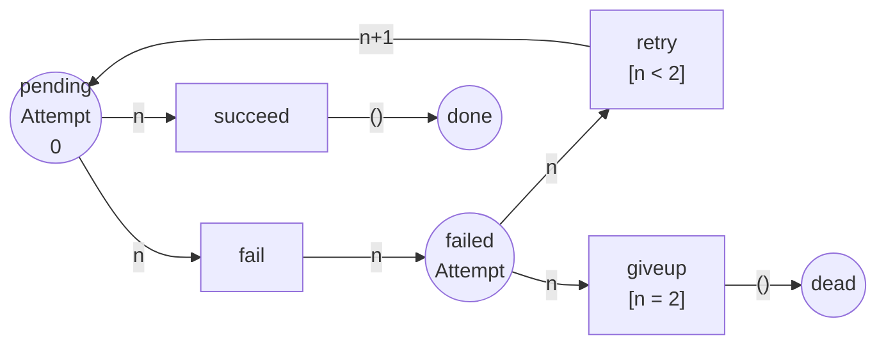

Código completo: [`code/petri-nets`](https://github.com/spareilleux/learn/tree/main/code/petri-nets). Esta lección la imprime `dotnet run --project Examples -c Release -- l8`, y se compara con [`expected/l8.txt`](https://github.com/spareilleux/learn/blob/main/code/petri-nets/expected/l8.txt).

Todo lo anterior se ha construido con marcas indistinguibles. Una marca en `full` significa «hay un artículo en el búfer» y nada más — ni qué artículo, ni de qué tamaño, ni cuántas veces se ha intentado ya.

Es la misma restricción que escribir una cola de `object` y hacer conversiones, o un `ArrayList` antes de los [genéricos](https://learn.microsoft.com/dotnet/csharp/fundamentals/types/generics). Funciona, y te obliga a codificar todo lo que quieras distinguir como *más plazas*.

Una **red de Petri coloreada** le da un valor a la marca. Cada plaza tiene un **conjunto de colores** — un tipo — y contiene marcas de ese tipo; cada transición tiene variables, una **guarda** y **expresiones de arco** que dicen qué color toma y qué color da. El modelo deja de repetirse, exactamente igual que `Channel<T>` te evita escribir `ChannelOfOrder` y `ChannelOfInvoice`.

El beneficio y la trampa están los dos en esta lección: el plegado es real, y es un plegado de la *imagen*, no del espacio de estados.

## Una política de reintentos con una plaza de mensajes muertos

El ejemplo es uno que tiene todo sistema basado en mensajes. Una entrega está pendiente; tiene éxito, o falla; un fallo se reintenta hasta un límite de intentos, tras el cual va a la plaza de mensajes muertos. Cuatro plazas, cuatro transiciones, y la marca lleva el intento en el que va:

```
== A retry policy, in colour ==
coloured net retry
  colset Attempt = {0, 1, 2}
  place       pending : Attempt
  place       failed : Attempt
  place       done : UNIT
  place       dead : UNIT
  transition  succeed  var n : Attempt
  transition  fail  var n : Attempt
  transition  retry  var n : Attempt  [n < 2]
  transition  giveup  var n : Attempt  [n = 2]
  arc         pending -> succeed   n
  arc         succeed -> done   ()
  arc         pending -> fail   n
  arc         fail -> failed   n
  arc         failed -> retry   n
  arc         retry -> pending   n+1
  arc         failed -> giveup   n
  arc         giveup -> dead   ()
  M0          pending: 0
```



Cuatro piezas de vocabulario, cada una con una traducción directa:

| red coloreada | C# |
|---|---|
| un **conjunto de colores** `Attempt = {0, 1, 2}` | el parámetro de tipo: `record Delivery(int Attempt)` |
| una **variable** `var n : Attempt` | el patrón que enlaza la carga útil |
| una **guarda** `[n < 2]` | la cláusula `when` de una rama de `switch` |
| una **expresión de arco** `n+1` | la proyección que escribes en el cuerpo |

`UNIT` es el conjunto de colores con un solo valor. Una plaza de color `UNIT` contiene marcas que no llevan nada, que es precisamente una plaza de una red ordinaria — así que las redes P/T son las redes coloreadas en las que toda plaza es `UNIT`, y nada de las lecciones 1 a 7 se ha tirado.

## La marca que sabe en qué intento va

El analizador tiene su propia regla de disparo para las redes coloreadas ([`Coloured.cs`](https://github.com/spareilleux/learn/blob/main/code/petri-nets/PetriNets/Coloured.cs)): una transición está sensibilizada bajo una *ligadura* de su variable cuando la guarda se cumple y toda plaza de entrada tiene una marca del color que calcula la expresión de arco.

```
== A token that carries the attempt it is on ==
            pending: 0
fail(n=0)   failed: 0
retry(n=0)  pending: 1
fail(n=1)   failed: 1
retry(n=1)  pending: 2
fail(n=2)   failed: 2
giveup(n=2) dead
```

Una sola marca de principio a fin, y su color es el estado del reintento. La línea `retry(n=0)  pending: 1` es la expresión de arco `n+1` haciendo lo que una red P/T no tiene forma de expresar: aritmética sobre la marca.

Y `giveup` solo dispara una vez que `n` vale 2, porque su guarda lo dice. Sin la guarda, una entrega iría a la plaza de mensajes muertos en su primer fallo; sin la guarda `[n < 2]` de `retry`, la expresión `n+1` se saldría del final del conjunto de colores. La guarda no es documentación — decide qué ligaduras existen siquiera.

## El despliegue: la misma red, sin color

Toda red coloreada sobre conjuntos de colores **finitos** es una red P/T ordinaria disfrazada. `Unfold()` la escribe: una plaza por (plaza, color), una transición por (transición, ligadura que la guarda acepta).

```
== The same net without colour: its unfolding ==
net retry
places      pending_0 pending_1 pending_2 failed_0 failed_1 failed_2 done dead
transitions succeed_0 succeed_1 succeed_2 fail_0 fail_1 fail_2 retry_0 retry_1 giveup_2
M0          (1, 0, 0, 0, 0, 0, 0, 0) = pending_0:1
arc         pending_0 -> succeed_0
arc         succeed_0 -> done
arc         pending_1 -> succeed_1
arc         succeed_1 -> done
arc         pending_2 -> succeed_2
arc         succeed_2 -> done
arc         pending_0 -> fail_0
arc         fail_0 -> failed_0
arc         pending_1 -> fail_1
arc         fail_1 -> failed_1
arc         pending_2 -> fail_2
arc         fail_2 -> failed_2
arc         failed_0 -> retry_0
arc         retry_0 -> pending_1
arc         failed_1 -> retry_1
arc         retry_1 -> pending_2
arc         failed_2 -> giveup_2
arc         giveup_2 -> dead
```

Lee la lista de transiciones. `retry` se convirtió en `retry_0` y `retry_1` — dos de las tres ligaduras — y `giveup` se convirtió en `giveup_2` a solas. Las guardas no sobrevivieron como guardas; se *evaluaron hasta desaparecer*, y lo que queda es la red que habrías dibujado a mano si nunca hubieras oído hablar del color. El despliegue se escribe en [`nets/retry.pnml`](https://github.com/spareilleux/learn/blob/main/code/petri-nets/nets/retry.pnml) como todas las demás redes de este curso, así que cualquier herramienta P/T puede leerlo.

Esa es toda la relación, y merece la pena decirlo sin rodeos: **para conjuntos de colores finitos, las redes coloreadas no añaden ningún poder expresivo.** Añaden notación. Las pruebas unitarias comprueban que disparar una transición coloreada y disparar su gemela desplegada dan el mismo marcado, así que el plegado no es solo una afirmación de esta lección.

## Lo que el plegado compra de verdad

Aquí está la medición. La misma política, con el límite de intentos creciendo:

```
== What the unfolding costs ==
attempts  coloured places  coloured transitions  unfolded places  unfolded transitions  markings
       2                4                     4                8                     9         8
       3                4                     4               10                    12        10
       5                4                     4               14                    18        14
      10                4                     4               24                    33        24
      20                4                     4               44                    63        44
```

Las dos columnas de la izquierda no se mueven nunca. El modelo coloreado de una política con veinte reintentos son las mismas cuatro plazas y cuatro transiciones que el modelo con dos; solo creció el conjunto de colores, y un conjunto de colores es una declaración.

Las tres columnas de la derecha crecen linealmente, y la última es el meollo. **El número de marcados alcanzables no cambia con el plegado** — es el mismo 2·*k*+4 tanto si escribiste el modelo en color como si lo escribiste a mano, porque un marcado coloreado *es* un vector sobre pares (plaza, color). El color te ahorra dibujar el modelo. No te ahorra absolutamente nada en el análisis.

Ese es el resumen honesto de la extensión, y es la razón por la que la lección 15 trata de técnicas de reducción y no de notación. Si tu modelo tiene cien tipos de mensaje, el color convierte cien copias de un diagrama en un diagrama; el espacio de estados sigue teniendo dentro las cien copias, y las herramientas que se las apañan — [CPN Tools](https://cpntools.org/) con reducciones por simetría y equivalencia — se las apañan explotando la simetría que el color hizo visible, no ignorándola.

## Lo que el despliegue dice después

Una vez desplegada, toda pregunta de las lecciones 3 a 6 se aplica sin cambios:

```
reachability graph of retry: 8 states, 9 firings
places pending_0 pending_1 pending_2 failed_0 failed_1 failed_2 done dead
  M0 = (1, 0, 0, 0, 0, 0, 0, 0)  pending_0:1
  M1 = (0, 0, 0, 0, 0, 0, 1, 0)  done:1
  M2 = (0, 0, 0, 1, 0, 0, 0, 0)  failed_0:1
  M3 = (0, 1, 0, 0, 0, 0, 0, 0)  pending_1:1
  M4 = (0, 0, 0, 0, 1, 0, 0, 0)  failed_1:1
  M5 = (0, 0, 1, 0, 0, 0, 0, 0)  pending_2:1
  M6 = (0, 0, 0, 0, 0, 1, 0, 0)  failed_2:1
  M7 = (0, 0, 0, 0, 0, 0, 0, 1)  dead:1
  M0 --succeed_0--> M1
  M0 --fail_0--> M2
  M2 --retry_0--> M3
  M3 --succeed_1--> M1
  M3 --fail_1--> M4
  M4 --retry_1--> M5
  M5 --succeed_2--> M1
  M5 --fail_2--> M6
  M6 --giveup_2--> M7
  dead marking M1 = (0, 0, 0, 0, 0, 0, 1, 0)  done:1
  dead marking M7 = (0, 0, 0, 0, 0, 0, 0, 1)  dead:1
```

Ocho marcados, y dos de ellos muertos. Por una vez eso no es un fallo: una entrega se *supone* que termina, en `done` o en `dead`, y una red que modela un proceso finito tiene que tener marcados muertos. Las propiedades lo dicen sin rodeos:

```
  bounded:       yes (1-bounded)
  safe:          yes
  deadlock-free: no
    dead marking (0, 0, 0, 0, 0, 0, 1, 0)  done:1
    dead marking (0, 0, 0, 0, 0, 0, 0, 1)  dead:1
  live:          no
    succeed_0  L1, can fire once
    ...
  reversible:    no
  home states:   none
```

Todo L1, nada vivo, ningún estado de origen, no reversible. Leído contra la lección 4 esto parece una catástrofe, y contra el sistema que modela es correcto: la política de reintentos termina, nunca da vueltas para siempre, y hay exactamente dos formas de que acabe. La lección 10 le da a esta forma su propio nombre — una red de flujo de trabajo — y su propia propiedad de corrección, la *soundness*, que pide precisamente que toda ejecución acabe en uno de los marcados finales previstos y que no quede nada atrás.

Dos cosas más que esta lectura da gratis. Todo mensaje llega a un final, porque el grafo es acíclico y finito. Y no queda nada atrás: todo marcado muerto tiene exactamente una marca, en `done` o en `dead`, con las otras seis plazas vacías — ninguna entrega a medio procesar atascada en `failed_1`.

## La guarda es lo que elimina las ligaduras

```
== The guard is what removes the bindings ==
succeed    guard (none)   bindings kept: n=0 n=1 n=2
fail       guard (none)   bindings kept: n=0 n=1 n=2
retry      guard n < 2    bindings kept: n=0 n=1
giveup     guard n = 2    bindings kept: n=2
```

Nueve transiciones en el despliegue en vez de doce, porque dos guardas eliminaron tres ligaduras entre las dos. Una guarda en una red coloreada es un filtro *estático* sobre el despliegue — nunca aparece en tiempo de ejecución, decide qué existe.

Es una diferencia real con la cláusula `when` a la que corresponde en C#. `case Delivery { Attempt: < 2 }` se evalúa cuando llega el mensaje; `[n < 2]` se evalúa cuando se construye el modelo. De ahí se siguen dos cosas: una guarda solo puede mencionar las variables propias de la transición, y una red coloreada con una guarda cara no cuesta nada en tiempo de ejecución y lo cuesta todo en tiempo de despliegue.

## Dónde se detiene el color

- **Conjuntos de colores infinitos.** Nada de lo anterior necesitaba que el conjunto de colores fuera pequeño, pero sí necesitaba que fuera *finito*. Un `Attempt` que recorra todos los números naturales no se puede desplegar, y las redes coloreadas sobre conjuntos de colores infinitos son Turing-completas — toda pregunta de la lección 4 se vuelve indecidible. En la práctica, las herramientas o acotan el conjunto de colores o aceptan que están haciendo model checking de un programa.
- **Una variable por transición.** El analizador de este curso enlaza una variable por transición, que basta para el reintento y no basta para una transición que une dos mensajes distintos. Las redes coloreadas de verdad enlazan una tupla, y su despliegue crece como el producto de los conjuntos de colores en vez de como la suma.
- **El espacio de estados sigue ahí.** Dicho tres veces en esta lección porque es lo que la gente se equivoca sobre la extensión.

La norma es [ISO/IEC 15909-1:2019](https://www.iso.org/standard/67235.html), que define las redes de alto nivel y la subclase de las *redes simétricas* — a grandes rasgos, las redes coloreadas cuyos conjuntos de colores y expresiones están restringidos lo bastante como para que la simetría se pueda explotar automáticamente. La implementación de referencia es [CPN Tools](https://cpntools.org/), cuyas inscripciones se escriben en CPN ML, un dialecto de Standard ML: en ese mundo, las expresiones de arco son funciones de verdad y los conjuntos de colores son tipos de verdad, y la notación de esta lección es el rincón pequeño de todo eso que se despliega.

## Puntos clave

- Una **red coloreada** le da un valor a las marcas. Una plaza tiene un **conjunto de colores** (un tipo), una transición tiene una variable, una **guarda** y **expresiones de arco**.
- `UNIT` es el conjunto de colores de un solo valor, así que toda red P/T de las lecciones 1 a 7 es una red coloreada cuyas plazas tienen todas el color `UNIT`.
- Sobre conjuntos de colores **finitos**, toda red coloreada se **despliega** en una red P/T ordinaria: una plaza por color, una transición por ligadura que la guarda acepta. No se gana ningún poder expresivo.
- **El color pliega el modelo, no el espacio de estados.** Cuatro plazas y cuatro transiciones a cualquier límite de intentos; los marcados alcanzables siguen creciendo como 2·*k*+4.
- Una **guarda** se evalúa cuando la red se despliega, no cuando llega una marca. Decide qué transiciones existen.
- La red de reintentos está 1-acotada, tiene **dos marcados muertos** y ninguna transición viva, y esa es la respuesta correcta para algo que se supone que termina. La lección 10 le pone nombre a esa forma.
- Sobre conjuntos de colores **infinitos** no hay despliegue ni queda decidibilidad.

## Ejercicios

1. Añade un conjunto de colores `Priority = {low, high}` a la red de reintentos de modo que una entrega de prioridad alta se reintente cinco veces y una de prioridad baja una. ¿Cuántas plazas y transiciones tiene el modelo coloreado, y cuántas tiene el despliegue?
2. El despliegue tiene nueve transiciones y la red coloreada tiene cuatro. ¿Cuál de las dos preferirías darle a un colega que revisa la política de reintentos, y cuál preferirías darle a un model checker? Di por qué en una frase cada una.
3. Pon el límite de intentos a 0 y predice el despliegue antes de ejecutarlo.
4. La lección dice que el color no ahorra nada en el análisis. Nombra la única situación en la que eso es falso, y di qué tiene que saber la herramienta para aprovecharla.

<details>
<summary>Soluciones</summary>

**1.** El modelo coloreado conserva cuatro plazas y no gana nada estructuralmente: el conjunto de colores pasa a ser un producto, `Attempt × Priority`, la guarda de `retry` pasa a ser `n < limit(p)` y la de `giveup` pasa a ser `n = limit(p)`. Cuatro plazas y cuatro transiciones, igual. El despliegue es el producto: `pending` y `failed` pasan a ser 6 × 2 = 12 plazas cada una para un rango de intentos de 0 a 5, más `done` y `dead`, y las transiciones se multiplican igual. Esa proporción — constante a la izquierda, producto a la derecha — es todo el argumento a favor de la notación, y toda la advertencia sobre lo que esconde.

**2.** La coloreada al colega: es la política, en una página, y la guarda se lee como la frase con la que se redactó la política. La desplegada al model checker, o mejor dicho a cualquier cosa que tenga que razonar sobre ella: toda técnica de las lecciones 2 a 6 está definida sobre redes P/T, y los invariantes, sifones y trampas del despliegue son los que sostienen las pruebas. Es exactamente lo que hace el analizador — color para el lector, despliegue para el análisis.

**3.** Con el límite a 0 el conjunto de colores es `{0}`, la guarda `n < 0` de `retry` no acepta nada y la guarda `n = 0` de `giveup` acepta el único valor. El analizador lo confirma:

```
== Exercise 3: a guard no binding satisfies deletes the transition ==
retry keeps 0 bindings when the limit is 0
net retry-0
places      pending_0 failed_0 done dead
transitions succeed_0 fail_0 giveup_0
M0          (1, 0, 0, 0) = pending_0:1
```

Cuatro plazas, tres transiciones: `retry` ha desaparecido por completo del despliegue. Una transición cuya guarda no satisface ninguna ligadura no es una transición que nunca dispara — es una transición que no existe, que es una afirmación más fuerte y más útil que el L0 de la lección 4.

**4.** Cuando los colores son **simétricos** — cuando permutarlos manda la red sobre sí misma. Entonces el espacio de estados se puede cocientar por el grupo de simetría y el análisis se ejecuta sobre las clases de equivalencia, que es para lo que están el método de simetría de CPN Tools y las redes simétricas de ISO/IEC 15909-1. La herramienta tiene que conocer la simetría, lo que significa que tiene que estar declarada o ser inferible a partir de conjuntos de colores y expresiones restringidos — y esa restricción es la razón entera de que la subclase *simétrica* exista como algo separado de las redes coloreadas en general. En la red de reintentos no hay simetría que explotar: los intentos están ordenados, y `n+1` rompe cualquier permutación.

</details>

## Fuentes

- Kurt Jensen y Lars M. Kristensen, *Coloured Petri Nets: Modelling and Validation of Concurrent Systems*, Springer, 2009, [doi:10.1007/b95112](https://doi.org/10.1007/b95112). La referencia para el formalismo y para CPN Tools. Registro confirmado a través de Crossref; no leído. *Por verificar.*
- [CPN Tools](https://cpntools.org/), la implementación, y CPN ML, el lenguaje de inscripciones.
- [ISO/IEC 15909-1:2019](https://www.iso.org/standard/67235.html), *Systems and software engineering — High-level Petri nets — Part 1: Concepts, definitions and graphical notation*, que es donde se definen las clases de redes de alto nivel y simétricas. El registro se comprobó en iso.org; la norma cuesta 227 CHF y no la he leído. *Por verificar.*
- La implementación que imprime esta lección: [`Coloured.cs`](https://github.com/spareilleux/learn/blob/main/code/petri-nets/PetriNets/Coloured.cs), con el despliegue y las pruebas que contrastan un disparo coloreado con su gemelo desplegado.
