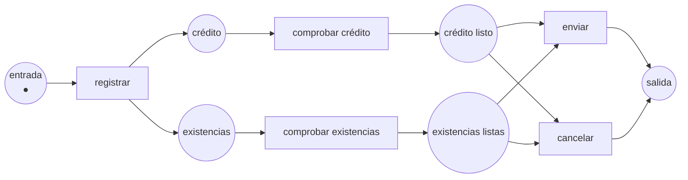

Código completo: [`code/petri-nets`](https://github.com/spareilleux/learn/tree/main/code/petri-nets). Esta lección la imprime `dotnet run --project Examples -c Release -- l10`, y se compara con [`expected/l10.txt`](https://github.com/spareilleux/learn/blob/main/code/petri-nets/expected/l10.txt).

Las redes de las nueve lecciones anteriores se ejecutan para siempre. Un productor produce, un consumidor consume, un cerrojo se toma y se suelta, y la pregunta interesante es si eso puede salir mal en la próxima hora o en el próximo año.

Un proceso de negocio tiene la forma justamente contraria. Llega un pedido, le ocurre algo, y se va. Tiene una sola entrada y una sola salida, se supone que termina, y la pregunta no es si se bloquea en general sino si **este caso** — este pedido, esta reclamación, este ticket — llega al final sin dejar nada detrás.

Esa forma tiene nombre, una definición lo bastante pequeña como para comprobarla, y una propiedad de corrección llamada **solidez** (*soundness*) que un programa puede decidir. Es además la parte de la teoría de redes de Petri que se escapó a la industria: todo motor de flujos de trabajo y todo diagrama BPMN está a una traducción de lo que hace esta lección.

## Una entrada, una salida

Una **red de flujo de trabajo** es una red de Petri ordinaria con tres restricciones:

1. una plaza **fuente**, sin arco entrante — el caso llega allí;
2. una plaza **sumidero**, sin arco saliente — el caso se marcha por allí;
3. todo nodo está en un camino de la fuente al sumidero, así que nada es inalcanzable y nada es un callejón sin salida.

La tercera condición es más fácil de comprobar de lo que parece. Añade una transición del sumidero de vuelta a la fuente — el **cortocircuito** — y se convierte exactamente en «esta red es fuertemente conexa», que el analizador decide desde la [lección 6](../06-structural-classes/).

Aquí hay un pedido, con la forma que tiene casi todo proceso: un registro, dos comprobaciones que se ejecutan a la vez, y una decisión al final.

```
== An order, as a workflow net ==
net order-sound
places      in credit stock credit-done stock-done out
transitions register check-credit check-stock ship cancel
M0          (1, 0, 0, 0, 0, 0) = in:1
arc         in -> register
arc         register -> credit
arc         register -> stock
arc         credit -> check-credit
arc         check-credit -> credit-done
arc         stock -> check-stock
arc         check-stock -> stock-done
arc         credit-done -> ship
arc         stock-done -> ship
arc         ship -> out
arc         credit-done -> cancel
arc         stock-done -> cancel
arc         cancel -> out
```



```
== What makes it a workflow net ==
source: in
sink:   out
why not: (it is one)
short-circuited net adds: t-star
```

Dos formas merecen nombre, porque son las dos compuertas de toda notación de procesos:

- **`register` es una bifurcación Y**: una transición con dos plazas de salida. Las dos ramas arrancan y se ejecutan a la vez — el marcado tras `register` tiene dos marcas, que es justo lo que una máquina de estados no sabe decir.
- **la elección entre `ship` y `cancel` es una bifurcación O exclusiva**: dos transiciones compitiendo por las mismas marcas. Se dispara exactamente una. Que la elección sea *libre* aquí — ambas transiciones ven las mismas plazas de entrada — hace de esta una red de libre elección, sobre la que la [lección 6](../06-structural-classes/) tiene teoremas.

Una convergencia son esas dos formas al revés: una convergencia Y es una transición que espera varias plazas, una convergencia O exclusiva es una plaza alimentada por varias transiciones.

## La solidez, en tres condiciones

Una red de flujo de trabajo es **sólida** cuando, arrancada con una marca en la fuente:

1. **opción de terminar** — desde todo marcado alcanzable, el marcado con una marca en el sumidero sigue siendo alcanzable. El caso siempre puede terminar todavía;
2. **terminación limpia** — ningún marcado alcanzable pone una marca en el sumidero mientras otra cosa sigue en marcha. Terminar significa terminado;
3. **ninguna transición muerta** — toda tarea puede ser ejecutada por algún caso. Una tarea que ningún caso alcanza es o un error o una mentira del diagrama.

El pedido de arriba satisface las tres:

```
== Soundness, condition by condition ==
net: order-sound
  reachable markings:  6
  option to complete:  yes
  proper completion:   yes
  no dead transitions: yes
  sound: yes
```

Seis marcados para un proceso con dos ramas concurrentes. Fíjate en que el analizador informa de la condición que falla y del marcado que la rompe, no de un veredicto: «no sólido» por sí solo no es algo sobre lo que un responsable de proceso pueda actuar.

## El error más común en BPMN

Bifurcar con Y, converger con O exclusiva. Se lee perfectamente en un diagrama — *comprobar el crédito, comprobar las existencias, y terminar* — y es falso:

```
== An AND split joined by an XOR: the case ends while a branch is still running ==
net: order-and-xor
  reachable markings:  10
  option to complete:  no
    the final marking is never reached, from anywhere
  proper completion:   no
    finishes with something left: (0, 0, 1, 0, 0, 1); (0, 1, 0, 0, 0, 1); (0, 0, 0, 0, 1, 1); and 2 more
  no dead transitions: yes
  sound: no
```

Las dos ramas recibieron una marca; cualquiera de ellas por sí sola declara el caso terminado. Así que el sumidero recibe su marca mientras la otra rama sigue trabajando, y luego recibe una segunda. `(0, 0, 0, 0, 0, 2)` está en esa lista: **dos** marcas en el sumidero, un pedido entregado dos veces.

Relee la primera línea: el marcado final no se alcanza nunca *desde ningún sitio*. No «algunos caminos se atascan» — el estado final correcto no existe en esta red en absoluto. Toda tarea puede ejecutarse todavía, así que una prueba que ejercite cada tarea pasa. El defecto está en la convergencia, y solo ahí.

## El error espejo

Bifurcar con O exclusiva, converger con Y. El registro elige una rama; el envío espera las dos:

```
== An XOR split joined by an AND: the case stops one step short ==
net: order-xor-and
  reachable markings:  5
  option to complete:  no
    the final marking is never reached, from anywhere
  proper completion:   yes
  no dead transitions: no
    never enabled: ship
  sound: no
```

La terminación limpia se cumple — no queda nada detrás, porque nada termina nunca. Ese par merece guardarse: una condición puede satisfacerse de forma vacía, y un verificador que informara solo de «2 de 3 condiciones» sería inútil. La condición que falla señala `ship` como una transición que ningún caso alcanzará jamás, que es la frase que hay que llevarle a quien dibujó el diagrama.

## Sólido no significa terminante

Una revisión que puede devolver el caso para rehacerlo:

```
== A rework loop: sound, and able to run for ever without finishing ==
net: order-rework
  reachable markings:  4
  option to complete:  yes
  proper completion:   yes
  no dead transitions: yes
  sound: yes
a cycle that never approves: review rework
```

La red es sólida, y contiene un ciclo en el que `approve` no se dispara nunca. Un caso puede rehacerse para siempre.

Es la misma distinción que la [lección 4](../04-properties/) hacía entre vivacidad e inanición, en el vocabulario de los procesos: la solidez dice que el caso **siempre puede todavía** terminar, nunca que **vaya** a hacerlo. Si el requisito es «todo caso termina», la solidez no es esa propiedad — hace falta acotar el bucle, es decir meter el contador de intentos en la red, que es la red coloreada de la [lección 8](../08-coloured-nets/), o una tasa y un tiempo medio, que es la [lección 9](../09-time-and-probability/).

## Decidido dos veces

Las tres condiciones de arriba se comprueban sobre el grafo de alcanzabilidad de la red. Hay una ruta completamente distinta hacia el mismo veredicto.

**Teorema de van der Aalst (1997):** una red de flujo de trabajo es sólida exactamente cuando su red cortocircuitada — la que tiene una transición del sumidero de vuelta a la fuente — es **viva** y **acotada**.

Esas son las dos propiedades de la [lección 4](../04-properties/), calculadas por código que no sabe nada de flujos de trabajo:

```
== The same four verdicts through the short circuit ==
net              sound?  live?  bounded?  live and bounded?  agree?
order-sound      yes     yes    yes       yes                yes
order-and-xor    no      no     no        no                 yes
order-xor-and    no      no     yes       no                 yes
order-rework     yes     yes    yes       yes                yes
```

Cuatro redes, dos rutas independientes, cuatro coincidencias — y una prueba unitaria falla si alguna vez dejan de coincidir. Es la misma disciplina que la cola resuelta dos veces de la [lección 9](../09-time-and-probability/), y por la misma razón: las redes interesantes son aquellas en las que solo existe una ruta.

El teorema no es una casualidad, y la tercera columna dice por qué. Mira la red rota a través de su cortocircuito:

```
== What the short circuit is doing ==
order-and-xor-short-circuited: bound unbounded
  register        L1
  check-credit    L1
  check-stock     L1
  finish-credit   L1
  finish-stock    L1
  t-star          L1
```

**No acotada.** Cada caso deja una marca de sobra, `t-star` devuelve las marcas del sumidero a la fuente, y los restos se acumulan sin límite. «La terminación limpia falla» y «el cortocircuito no está acotado» son el mismo hecho contado dos veces — una marca dejada atrás, vista una vez por caso o acumulada sobre infinitos casos.

Y todas las transiciones son solo L1, porque el grafo nunca terminó: el analizador se detuvo en su límite, así que solo puede decir que cada transición se dispara al menos una vez. Una red no acotada no es viva, que es la otra mitad del teorema.

La red espejo se cortocircuita en algo acotado pero no vivo: nada se acumula, y `ship` no se dispara nunca. Los dos fallos son propiedades distintas del mismo cortocircuito, y por eso el teorema necesita las dos.

## Traducir desde y hacia BPMN

[BPMN 2.0](https://www.omg.org/spec/BPMN/2.0/) es la notación en la que los procesos se dibujan de verdad. Su núcleo se traduce a redes de flujo de trabajo directamente:

| BPMN | Red de flujo de trabajo |
|---|---|
| Tarea, actividad | Transición |
| Flujo de secuencia | Plaza entre dos transiciones |
| Compuerta paralela (Y), bifurcación / convergencia | Transición con varias plazas de salida / de entrada |
| Compuerta exclusiva (O), bifurcación / convergencia | Plaza con varias transiciones de salida / plaza alimentada por varias transiciones |
| Evento de inicio | La plaza fuente |
| Evento de fin | La plaza sumidero |

Lo que no se traduce importa igual. Las **compuertas inclusivas** (O — *tomar cualquier subconjunto no vacío de ramas y luego esperar exactamente a esas*) no tienen traducción local: la convergencia tiene que saber qué ramas se tomaron, y eso no es algo que diga un marcado. Las **regiones de cancelación**, los **eventos de frontera** y los **flujos de excepción** retiran marcas de donde quiera que estén, cosa que una red ordinaria no sabe hacer — hace falta una **red con reinicio**, donde la alcanzabilidad es indecidible. Los **datos** y los **recursos** no están en el modelo en absoluto.

Ese es el resumen honesto de la relación: el flujo de control de un diagrama BPMN es una red de flujo de trabajo, y todo lo que el diagrama dice sobre datos, roles, tiempo y excepciones no lo es.

## El otro sentido: la minería de procesos

Todo lo anterior parte de un modelo. La **minería de procesos** parte del registro — los eventos que un motor de flujos, un ERP o un sistema de tickets ya escribe — y produce el modelo.

Sus tres preguntas son:

- **descubrimiento**: ¿qué red explica este registro? El algoritmo α lee las relaciones de orden entre eventos y construye con ellas una red de flujo de trabajo; los algoritmos posteriores manejan mejor el ruido y los bucles.
- **conformidad**: ¿encaja el registro con el modelo, y permite el modelo cosas que el registro nunca muestra? Los dos números son la *fitness* y la *precisión*, y tiran en sentidos opuestos — una red que lo permite todo encaja perfectamente con cualquier registro.
- **mejora**: devolver a la red las duraciones y frecuencias medidas, que es el tiempo de la [lección 9](../09-time-and-probability/) tomado de los datos en vez de supuesto.

Nada de eso está implementado en este curso. Se nombra aquí porque es donde el formalismo se gana de verdad la vida, y porque la herramienta en la que ocurre la mayor parte, [ProM](https://promtools.org/), habla el mismo [PNML](https://www.pnml.org/) en el que la lección 11 intercambia redes. *Por verificar: no he ejecutado ProM.*

## Dónde se detiene esto

- **La solidez tiene variantes, y no coinciden.** La solidez *relajada* pide solo que cada transición esté en algún camino de la fuente al sumidero. La solidez *débil* prescinde de la condición de las transiciones muertas. La solidez *generalizada* pide *k* marcas en la fuente en vez de una, lo que es estrictamente más fuerte y es lo que quieres si los casos comparten recursos. Decir «el proceso es sólido» sin decir cuál no dice gran cosa.
- **Decidir la solidez cuesta tanto como el espacio de estados.** Es EXPSPACE-difícil en general, como todo lo que está aguas abajo de la alcanzabilidad. Para las redes de flujo de trabajo **de libre elección** es polinómico, por el teorema del rango — y la libre elección es exactamente la restricción «ninguna tarea compite por un recurso mientras además elige una rama», que la mayoría de los procesos dibujados cumple por casualidad. Esa es la razón práctica por la que la teoría es utilizable.
- **Un caso cada vez.** Toda esta lección mira una marca entrando en la fuente. Los procesos reales hacen pasar miles de casos por las mismas tareas, compitiendo por las mismas personas y las mismas máquinas, y esa interacción es invisible aquí. La solidez generalizada es el primer paso; una red coloreada con una plaza de recursos es el modelo honesto.

## Puntos clave

- Una **red de flujo de trabajo** tiene una fuente, un sumidero y nada fuera del camino entre ambos. La tercera condición es «el cortocircuito es fuertemente conexo».
- La **solidez** son tres condiciones: el caso siempre puede terminar todavía, terminar no deja nada detrás, y ninguna tarea es inalcanzable. Un verificador debe nombrar cuál falló y dónde.
- Los dos errores de compuertas — **bifurcación Y con convergencia O exclusiva**, **bifurcación O exclusiva con convergencia Y** — rompen casi todos los procesos que están rotos, y hacen fallar condiciones *distintas*. El primero entrega el pedido dos veces; el segundo no lo entrega nunca.
- Una condición puede cumplirse de forma vacía. `order-xor-and` termina limpiamente porque no termina nunca.
- **Sólido no significa terminante.** Un bucle de revisión es sólido y puede ejecutarse para siempre, igual que una transición viva puede pasar hambre.
- El **teorema de van der Aalst** convierte la solidez en vivacidad más acotación del cortocircuito — dos propiedades de la lección 4, calculadas por código que no sabe nada de procesos. Úsalo como comprobación, no como atajo.
- Una marca dejada atrás y un cortocircuito no acotado son el mismo defecto, contado una vez o contado para siempre.
- Las compuertas paralelas y exclusivas de BPMN se traducen exactamente a redes. Las inclusivas, la cancelación, los datos y los recursos no.

## Ejercicios

1. El pedido termina con `ship` o con `cancel`. Añade un paso que deba ocurrir después de ambos — una facturación — y di, antes de ejecutarlo, si la red sigue siendo sólida y cuántos marcados tiene.
2. `order-and-xor` no es sólida. Repárala cambiando exactamente una cosa, y di cuál de las tres condiciones arregla tu reparación.
3. Toma el productor y el consumidor de la lección 1. ¿Es una red de flujo de trabajo? Responde sin lanzar el analizador, y después compruébalo.
4. Un proceso tiene una tarea cancelable mientras se ejecuta, que retira el caso desde donde haya llegado. Di por qué ningún arco que puedas añadir a una red de flujo de trabajo hace eso, y en qué tendría que convertirse el modelo.

<details>
<summary>Soluciones</summary>

**1.** Sigue siendo sólida, y gana exactamente un marcado. `ship` y `cancel` alimentan ambos una nueva plaza `decided`, una transición `invoice` la lleva a `out`, y `out` deja de ser el destino de dos transiciones.

```
net: ex1-invoice
  reachable markings:  7
  option to complete:  yes
  proper completion:   yes
  no dead transitions: yes
  sound: yes
```

Yo predije 8 y el analizador dijo 7, cosa que merece confesarse porque el motivo es el argumento del ejercicio. Un paso en secuencia añade **un** marcado — aquel en que la marca está en `decided` — venga lo que venga antes. Solo la concurrencia multiplica: son las dos comprobaciones las que convirtieron dos pasos en cuatro marcados. Añadir una tarea después de una convergencia *correcta* cuesta un estado; añadirla dentro de una rama paralela cuesta un factor.

**2.** Sustituye las dos transiciones finales por una sola que consuma a la vez `credit-done` y `stock-done`. Eso convierte la convergencia O exclusiva en una convergencia Y y hace de la red la `order-sound` menos la elección. Arregla directamente la **terminación limpia** — no queda nada detrás porque nada termina antes de tiempo — y la opción de terminar se sigue, porque el marcado final pasa a ser alcanzable:

```
net: ex2-repaired
  reachable markings:  6
  option to complete:  yes
  proper completion:   yes
  no dead transitions: yes
  sound: yes
```

La reparación equivocada instructiva consiste en obligar a `out` a tener como mucho una marca añadiendo una plaza que lo limite. Eso no repara el proceso; esconde la segunda marca bloqueando la red en su lugar, y el verificador traslada su queja de la terminación limpia a la opción de terminar. Una restricción de capacidad no es una corrección de corrección.

**3.** No lo es. Toda plaza del productor y el consumidor tiene un arco entrante — `ready` desde `deposit`, `free` desde `take`, y así — así que no hay fuente, y por el mismo argumento no hay sumidero. El analizador lo dice:

```
no place is a source: every place has an incoming arc, so nothing starts the case
```

Eso no es un defecto de la red. Es la diferencia entre un sistema, que se ejecuta para siempre, y un caso, que llega y se va. La mayoría de las redes de este curso son de la primera clase, y la solidez no es una pregunta que se les pueda hacer en absoluto.

**4.** Un arco retira un número fijo de marcas de una plaza *con nombre*. La cancelación tiene que retirar las marcas que existan, estén donde estén, en un subconjunto desconocido de plazas — y la transición tendría que estar sensibilizada sin importar cuántas haya, cosa que ningún peso de arco expresa. Codificarlo a mano significa una transición por cada configuración posible de la región de cancelación, es decir la explosión de estados escrita dentro del modelo en vez de descubierta por el analizador.

El modelo tiene que convertirse en una **red con reinicio**, con arcos que vacían una plaza contenga lo que contenga. El precio es severo y conviene conocerlo: la alcanzabilidad allí es indecidible, y la acotación con ella. Es el ejemplo más claro del curso de una extensión que compra expresividad al precio de toda la teoría — el tema de la lección 15.

</details>

## Fuentes

- Wil van der Aalst, «Verification of Workflow Nets», en *Application and Theory of Petri Nets 1997*, Springer LNCS 1248, [doi:10.1007/3-540-63139-9_48](https://doi.org/10.1007/3-540-63139-9_48) — donde se definen las redes de flujo de trabajo, la solidez y el teorema del cortocircuito. Registro confirmado vía Crossref; no leído. *Por verificar.*
- Wil van der Aalst, «The Application of Petri Nets to Workflow Management», *Journal of Circuits, Systems and Computers* 8(1), 1998, [doi:10.1142/S0218126698000043](https://doi.org/10.1142/S0218126698000043) — la versión panorámica, y la que suele citarse para la correspondencia con BPMN. Registro confirmado vía Crossref; no leído. *Por verificar.*
- Wil van der Aalst, *Process Mining: Data Science in Action*, 2.ª edición, Springer, 2016, [doi:10.1007/978-3-662-49851-4](https://doi.org/10.1007/978-3-662-49851-4) — descubrimiento, conformidad y mejora, y los algoritmos nombrados arriba. Registro confirmado vía Crossref; no leído. *Por verificar.*
- [BPMN 2.0](https://www.omg.org/spec/BPMN/2.0/), la especificación de la OMG de la que parte la tabla de compuertas.
- Verbeek, Basten y van der Aalst, «Diagnosing Workflow Processes using Woflan», *The Computer Journal* 44(4), 2001, [doi:10.1093/comjnl/44.4.246](https://doi.org/10.1093/comjnl/44.4.246) — el verificador de solidez cuya costumbre de decir *qué* condición falló, y con qué marcado, imita el informe de esta lección. Registro confirmado vía Crossref; no leído, y Woflan mismo no se ha ejecutado aquí. *Por verificar.*
- [ProM](https://promtools.org/), la caja de herramientas de minería de procesos dentro de la cual vive ahora Woflan, y donde están implementados los algoritmos de descubrimiento y conformidad de arriba. No ejecutado aquí. *Por verificar.*
- La implementación que imprime esta lección: [`Workflow.cs`](https://github.com/spareilleux/learn/blob/main/code/petri-nets/PetriNets/Workflow.cs), con las tres condiciones, el cortocircuito y las pruebas que obligan a las dos rutas a coincidir.
