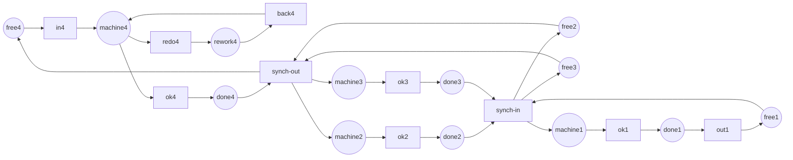

Código completo: [`code/petri-nets`](https://github.com/spareilleux/learn/tree/main/code/petri-nets). Esta lección la imprime `dotnet run --project Examples -c Release -- l12`, comparada con [`expected/l12.txt`](https://github.com/spareilleux/learn/blob/main/code/petri-nets/expected/l12.txt).

Una lección titulada «aplicaciones industriales» suele significar una bibliografía: una lista de artículos en los que alguien modeló una fábrica, y la afirmación de que salió bien. Eso es infalsable, y no es como funciona el resto de este curso.

Hay una fuente mejor. El [Model Checking Contest](https://mcc.lip6.fr/) se celebra cada año en la conferencia sobre redes de Petri. A las herramientas se les da una colección pública de modelos — 1 953 instancias en la edición de 2026 — se les hace la misma pregunta sobre cada uno, y los resultados se publican íntegros, respuestas incluidas. Los modelos vienen del taller, del diseño de protocolos, del hardware, de la biología de sistemas. Son las aplicaciones industriales, en forma de ficheros.

Así que esta lección continúa lo que empezó la [lección 11](../11-tools-and-interoperability/). Toma veintiuna de esas instancias, ejecuta sobre ellas el analizador de este curso, y compara cada uno de cuatro números con lo que dice el concurso. Todas las demás lecciones comprueban este analizador contra sí mismo; esta lo comprueba contra números calculados por otras seis herramientas, sobre redes que nadie aquí escribió.

## Lo que pide el concurso

El examen *StateSpace* del concurso pide cuatro números sobre una red:

- cuántos marcados son alcanzables;
- cuántos arcos tiene el grafo de alcanzabilidad;
- el mayor número de marcas que llega a tener una sola plaza;
- el mayor número de marcas que llega a tener un marcado entero.

Un analizador que coincide en los cuatro tiene bien la regla de disparo, el lector y el grafo. Un analizador que coincide en el primero y no en el tercero tiene un defecto más sutil que el que encontraría cualquier prueba unitaria de este repositorio.

El concurso publica un `estimated result` por instancia: el valor en el que coincide una mayoría de las herramientas participantes, ponderada por la tasa de confianza medida de cada una. Esa columna es el oráculo de esta lección. Está redondeada por encima del millón, de modo que para las dos instancias mayores las cifras usadas aquí son las que `tedd`, `TY` y la medalla de oro de 2025 imprimieron cada uno, coincidiendo.

## Las cinco industrias, y la que está escasa

```
== The contest's models, by industry ==
Model Checking Contest 2026, StateSpace examination, raw-result-analysis.csv
instance                        markings    arcs          what it models
-- manufacturing
FMS-PT-00002                    3444        16311         a flexible manufacturing system, three part types
Kanban-PT-00005                 2546432     24460016      four kanban cells, work released against a free card
SwimmingPool-PT-01              89621       450003        a swimming pool where bags and baskets are the resources
ResAllocation-PT-R003C003       92          257           processes taking shared resources in a fixed order
ResAllocation-PT-R010C002       6144        20480         the same, ten resources and two processes
-- protocols
TokenRing-PT-005                166         365           a token ring, the token being the right to speak
TokenRing-PT-010                58905       294050        the same ring with ten stations
Raft-PT-02                      7381        55824         the leader election of the Raft consensus algorithm
DrinkVendingMachine-PT-02       1024        7680          a vending machine and two customers
BridgeAndVehicles-PT-V04P05N02  2874        7160          a one-lane bridge with vehicles on both sides
Railroad-PT-005                 1838        7699          trains and a controller over a shared crossing
CircularTrains-PT-012           195         496           twelve trains on a circular track, one section each
-- hardware and shared memory
SharedMemory-PT-000005          1863        10395         processors contending for one memory bus
Dekker-PT-010                   6144        171530        Dekker's mutual exclusion, ten processes
Peterson-PT-2                   20754       62262         Peterson's mutual exclusion
DatabaseWithMutex-PT-02         153         312           database sites replicating under a mutex
-- biochemistry
ERK-PT-000001                   13          30            the ERK signalling pathway, one molecule of each species
ERK-PT-000010                   47047       372372        the same pathway, ten molecules of each
Angiogenesis-PT-01              110         288           the signalling that makes blood vessels grow
CircadianClock-PT-000001        128         624           the gene circuit of a circadian clock
-- security
QuasiCertifProtocol-PT-02       1029        3084          a certification protocol for electronic documents
```

Las agrupaciones son mías; los modelos y los números son del concurso. Cuatro de las cinco industrias del [plan](../) de este curso están bien representadas. **La seguridad no.** Una instancia, y es un protocolo más que un modelo de control de acceso. Hagan lo que hagan las redes de Petri en la investigación en seguridad, no está llegando a este banco de pruebas, y no voy a fingir lo contrario a partir de una lista de títulos de artículos.

Lo que cada industria pide al modelo es distinto, y la pregunta decide qué lección de este curso necesitas:

| Industria | Qué es una marca | La pregunta | Dónde se trató |
|---|---|---|---|
| Taller flexible | una pieza, un palé, una tarjeta kanban | ¿puede desbordarse un búfer?; ¿cuál es el rendimiento? | [4](../04-properties/), [5](../05-invariants/), [9](../09-time-and-probability/) |
| Protocolos | un mensaje, un derecho a emitir | ¿puede bloquearse?; ¿le toca el turno a cada estación? | [4](../04-properties/), [3](../03-the-reachability-graph/) |
| Hardware, memoria compartida | una petición, un cerrojo, una señal | ¿es seguro?; ¿pueden dos maestros ocupar el bus? | [4](../04-properties/), [7](../07-modelling-concurrency/) |
| Bioquímica | una molécula | ¿qué estados son siquiera alcanzables?; ¿qué se conserva? | [3](../03-the-reachability-graph/), [5](../05-invariants/) |
| Seguridad | una credencial, un certificado | ¿se puede alcanzar ese marcado malo? | [3](../03-the-reachability-graph/) |

La acotación es la pregunta del taller porque un búfer que se desborda es un suelo de fábrica cubierto de piezas. La vivacidad es la pregunta de los protocolos porque un protocolo que se bloquea es una conexión colgada. En bioquímica nadie pregunta si el modelo se bloquea — un sistema químico que alcanza el equilibrio no es un error — se pregunta qué especies pueden coexistir, y cuáles son las leyes de conservación. El mismo formalismo, cinco razones distintas para abrirlo.

## Una fábrica, reconstruida aquí

El modelo Kanban del concurso — [su propia ficha](https://mcc.lip6.fr/2026/pdf/Kanban-form.pdf) dice que se extrajo de un banco de pruebas usado para [SMART](https://www.smart.cs.iastate.edu/), y está en el concurso desde 2011 — son cuatro celdas de producción. Cada celda tiene un número fijo de *tarjetas kanban*: una pieza solo puede entrar en la celda si hay una tarjeta libre, que es toda la idea del kanban — el tamaño del búfer es el número de tarjetas, y lo imponen las marcas en vez de comprobarlo una persona.

El trabajo entra por la celda 4, se separa hacia las celdas 2 y 3 que van en paralelo, y se reúne en la celda 1. Cada celda puede devolver una pieza por un bucle de retrabajo. Dieciséis plazas, dieciséis transiciones, cuarenta arcos, y un parámetro: el número de tarjetas.



Las etiquetas son los nombres de plazas y transiciones de la red, no prosa: reaparecen tal cual en los listados de más abajo, así que no se traducen. `free` es la reserva de tarjetas, `machine` el mecanizado, `rework` el retrabajo, `done` el búfer de salida. El bucle de retrabajo solo está dibujado para la celda 4; las celdas 1, 2 y 3 tienen las mismas tres transiciones, omitidas para que la imagen siga siendo legible.

`Nets.Kanban(n)` la construye. La red no se copia de un fichero — se escribe a partir de la descripción publicada, lo que significa que cuando sus números coinciden con los del concurso, son el modelado *y* el análisis los que están bien, no solo el lector de PNML.

```
== What enumerating it costs ==
cards   markings        arcs            arcs per marking
1       160             616             3.9
2       4600            28120           6.1
3       58400           446400          7.6
5       2546432         24460016        9.6   published by the contest, not run here
```

Cinco tarjetas: **2 546 432 marcados y 24 460 016 arcos**, exactamente lo que el concurso publica para `Kanban-PT-00005`. A este analizador le lleva unos diecinueve segundos y unos cuantos gigabytes; `check.sh` se detiene en tres tarjetas para seguir siendo rápido, y la ejecución con cinco se reproduce más abajo.

Mira la última columna antes de seguir. Los arcos no crecen al mismo ritmo que los marcados — 3,9 por marcado, luego 6,1, luego 7,6, luego 9,6. Esa es toda la historia del resto de esta lección.

## Cuatro invariantes, y ningún grafo

```
== Four invariants, and no graph at all ==
invariants of kanban-3
  place invariants (6):
    free1 + machine1 + rework1 + done1 = 3
    free2 + machine2 + rework2 + done2 = 3
    free2 + machine3 + rework3 + done3 = 3
    machine2 + rework2 + done2 + free3 = 3
    free3 + machine3 + rework3 + done3 = 3
    free4 + machine4 + rework4 + done4 = 3
  transition invariants (5):
    redo1 + back1
    ok1 + ok2 + ok3 + ok4 + in4 + out1 + synch-in + synch-out
    redo2 + back2
    redo3 + back3
    redo4 + back4
```

Cuatro de ellos son las celdas: toda tarjeta de una celda está libre, o en la máquina, o en retrabajo, o en el búfer de salida. Es el invariante propio de la fábrica, escrito por un jefe de taller mucho antes de que nadie lo escribiera como un vector, y dice que ninguna plaza de la celda puede contener jamás más que el número de tarjetas — para *todo* marcado alcanzable, de *toda* instancia, sin enumerar ni uno.

Yo esperaba cuatro. Hay **seis**, y los dos de más mezclan las celdas 2 y 3. Son reales, y los ejercicios piden explicar por qué.

```
== The same bounds, paid for twice ==
place       invariants    reachability graph
free1       2             2
machine1    2             2
rework1     2             2
done1       2             2
…
markings enumerated: 0 for the invariants, 4600 for the graph
```

Dos columnas, la misma respuesta, y el coste es lo que importa: la de la izquierda es una matriz, la de la derecha es cada marcado de la red. Con dos tarjetas son 4 600 marcados; con cinco, dos millones y medio; con cincuenta, un número que nadie va a enumerar. La columna de la izquierda no cambia.

Este es el argumento de la [lección 5](../05-invariants/), y si se repite aquí es porque un modelo industrial es justo donde la diferencia deja de ser académica.

## Una fábrica resulta ser una red de libre elección

```
== What kind of net a factory turns out to be ==
structure of kanban-1
  ordinary (every arc weight 1):  yes
  pure (no self-loop):            yes
  strongly connected:             yes
  state machine:                  no
  marked graph:                   no
  free choice:                    yes
  extended free choice:           yes
  asymmetric choice:              yes
properties of kanban-1
  …
  bounded:       yes (1-bounded)
  safe:          yes
  deadlock-free: yes
  live:          yes
  reversible:    yes
  home states:   160 markings
  persistent:    no
```

No es una máquina de estados — `synch-out` tiene tres plazas de entrada, así que las marcas se dividen — ni un grafo marcado, porque `machine1` alimenta dos transiciones. Sí **es** de libre elección: la única plaza que alimenta dos transiciones es el `machine` de cada celda, que alimenta `redo` y `ok`, y ninguna de las dos lee nada más. Así que todo el aparato de la [lección 6](../06-structural-classes/) se le aplica: el teorema de Commoner, los sifones y las trampas, una prueba de vivacidad que nunca construye un grafo.

Y `persistent: no`, por la misma razón por la que es de libre elección: `redo` y `ok` se disputan la misma marca, y disparar una deshabilita la otra. El retrabajo es una elección, y una elección es exactamente lo que la persistencia prohíbe.

## Contra los propios ficheros del concurso

```
== Against the contest's own files ==
instance                        markings    arcs          seconds   agrees
Angiogenesis-PT-01              110         288           0.00      yes
BridgeAndVehicles-PT-V04P05N02  2874        7160          0.00      yes
CircadianClock-PT-000001        128         624           0.00      yes
CircularTrains-PT-012           195         496           0.00      yes
DatabaseWithMutex-PT-02         153         312           0.00      yes
Dekker-PT-010                   6144        171530        0.12      yes
DrinkVendingMachine-PT-02       1024        7680          0.00      yes
ERK-PT-000001                   13          30            0.00      yes
ERK-PT-000010                   47047       372372        0.20      yes
FMS-PT-00002                    3444        16311         0.01      yes
Kanban-PT-00005                 2546432     24460016      14.57     yes
Peterson-PT-2                   20754       62262         0.26      yes
QuasiCertifProtocol-PT-02       1029        3084          0.01      yes
Raft-PT-02                      7381        55824         0.04      yes
Railroad-PT-005                 1838        7699          0.02      yes
ResAllocation-PT-R003C003       92          257           0.00      yes
ResAllocation-PT-R010C002       6144        20480         0.02      yes
SharedMemory-PT-000005          1863        10395         0.01      yes
SwimmingPool-PT-01              89621       450003        0.22      yes
TokenRing-PT-010                58905       294050        4.99      yes
TokenRing-PT-005                166         365           0.00      yes
69 files refused on their net type: the same models as coloured nets
130 P/T files skipped: the contest rounds their answer, so there is nothing to compare
```

:::note[Este bloque no lo produce `check.sh`]
Los modelos del concurso no están incluidos en este repositorio, así que `check.sh` ejecuta `l12` sin ellos y esa sección imprime un aviso en su lugar. Para reproducirlo: descargar los archivos por modelo de [mcc.lip6.fr](https://mcc.lip6.fr/models.php) — `FMS`, `Kanban`, `TokenRing`, `ERK`, `Angiogenesis`, `CircadianClock`, `SharedMemory`, `Dekker`, `Peterson`, `QuasiCertifProtocol`, `Railroad`, `ResAllocation`, `SwimmingPool`, `CircularTrains`, `DrinkVendingMachine`, `Raft`, `BridgeAndVehicles`, `DatabaseWithMutex` — descomprimirlos en un mismo directorio, y ejecutar `dotnet run --project Examples -c Release -- l12 <ese directorio>`. El listado de arriba viene de esa ejecución el 2026-09-22.
:::

**Veintiuna instancias, cuatro números cada una, todas coincidentes.** Ochenta y cuatro números calculados aquí que otras seis herramientas ya habían calculado, sobre dieciocho modelos de cuatro industrias, y ni un desacuerdo.

Es la primera validación externa de este curso. Once lecciones demostraron que el analizador coincide consigo mismo. Esta dice otra cosa: sobre redes escritas por otra gente, con otros fines, esta regla de disparo y este lector producen las mismas respuestas que `tedd`, `ITS-Tools` y `TY`.

Los 69 rechazos son la lección 11 repitiéndose: cada modelo del concurso se entrega dos veces, una como red P/T y otra como la red coloreada con la que se dibujó, y la mitad coloreada se rechaza por su URI de tipo. Los 130 ficheros omitidos son las instancias cuya respuesta publicada está redondeada — no hay nada que comparar con cuatro cifras significativas.

## Dónde se detiene este

```
== Just above the line ==
instance                markings      arcs            best time in the contest
FMS-PT-00005            2895018       23527185        tedd, 5.3 s, 2117 MB
Kanban-PT-00005         2546432       24460016        tedd, 2.1 s, 1400 MB
Peterson-PT-3           3407946       13631784        tedd, 6.3 s, 3062 MB
Dekker-PT-020           11534336      1216348180      tedd, 2.3 s, 1209 MB
Angiogenesis-PT-05      42734935      486873657       tedd, 5.1 s, 3162 MB
```

Las tres primeras, este analizador las hace. `FMS-PT-00005` tarda 17,7 segundos, `Peterson-PT-3` 267,6 segundos, y las dos coinciden con el concurso. `Dekker-PT-020` y `Angiogenesis-PT-05` no las hace: con el montículo limitado a 8 GiB, ambas lanzan `OutOfMemoryException`, a los 158 y 128 segundos.

Mira qué las separa. `Peterson-PT-3` tiene 3,4 millones de marcados y 13,6 millones de arcos, y cabe. `Dekker-PT-020` tiene 11,5 millones de marcados — tres veces más — y **1 200 millones de arcos**, noventa veces más. No son los marcados los que agotan la memoria. Son los arcos, y por eso aquella columna de la tabla de crecimiento merecía una mirada.

Y `tedd` hace `Dekker-PT-020` en **2,3 segundos con 1,2 GB**. No almacena 1 200 millones de arcos, porque no almacena arcos: un diagrama de decisión representa el conjunto de marcados de forma simbólica, y el tamaño del grafo deja de ser la memoria que cuesta. Esa es la diferencia entre un analizador didáctico y una herramienta, y no es una diferencia de cuidado ni de lenguaje. Es una diferencia de representación, y no hay optimización de una `List<Step>` que la cruce.

Una nota honesta en el otro sentido: `petrivet`, el participante del propio concurso que explora explícitamente, agotó la hora en `FMS-PT-00005`, `Dekker-PT-020` y `Angiogenesis-PT-05`. La enumeración explícita es un camino duro para todos, y la versión que da este curso no es vergonzosa. Simplemente está del lado malo de un muro que tres de los seis participantes atravesaron.

## El árbol de cobertura no te salva

La [lección 3](../03-the-reachability-graph/) presentó el árbol de cobertura como lo que se construye cuando el grafo de alcanzabilidad es infinito. Sobre una red industrial es peor que el grafo, y por mucho.

`CoverabilityTree.Build(Nets.Kanban(1))` — una red con **160 marcados alcanzables** — no termina. Con el montículo limitado a 2 GiB lanza `OutOfMemoryException` a los 15,5 segundos; sin límite llegó a 35,7 GB y doce minutos de CPU sin volver. La razón es que el árbol es un árbol: poda una rama cuando un marcado repite uno de sus propios antepasados, y nunca fusiona dos ramas que llegan al mismo marcado. Una red fuertemente conexa con dieciséis transiciones tiene un número astronómico de caminos a través de 160 marcados.

Por eso `l12` imprime dos columnas de cotas y no las tres de `Report.Bounds`. El árbol de cobertura es la respuesta correcta a «¿está esta plaza no acotada?» en una red pequeña, y no es una herramienta que uno lleve a una fábrica. Queda anotado en el [diario](../journal/) como una limitación del propio código de este curso, porque es el primer sitio en once lecciones donde un componente funciona exactamente como está especificado y aun así es inútil.

## Puntos clave

- **Un banco de pruebas público vale más que una bibliografía.** El Model Checking Contest publica los modelos *y* las respuestas, así que una afirmación sobre redes industriales se puede comprobar en vez de citar.
- El analizador coincide con el concurso en **21 instancias, cuatro números cada una** — la primera vez que algo de este curso se comprueba contra software que nadie de aquí escribió.
- Un **Kanban reconstruido a mano** da exactamente los 2 546 432 marcados del concurso, lo que valida el modelado y no solo el lector de PNML.
- Cada industria le hace una pregunta distinta al mismo formalismo: **acotación** para el taller, **vivacidad** para los protocolos, **seguridad** para el hardware, **conservación** para la bioquímica, **un único marcado malo** para la seguridad informática.
- **La seguridad está escasa en este banco de pruebas** — una instancia de veintiuna. Es un hecho sobre el banco de pruebas, y vale más que una lista de artículos.
- **Los invariantes escalan y los grafos no.** Seis invariantes de plaza acotan cada plaza del Kanban para cualquier número de tarjetas, a partir de una matriz, mientras que el grafo cuesta 2,5 millones de marcados con cinco tarjetas.
- Una fábrica resulta ser una **red de libre elección**, así que los teoremas de la lección 6 se le aplican, y **no es persistente**, porque el retrabajo es una elección.
- **Son los arcos los que agotan la memoria, no los marcados**: 3,4 millones de marcados con 13,6 millones de arcos caben; 11,5 millones de marcados con 1 200 millones de arcos, no.
- Una herramienta de diagramas de decisión hace esa misma red en **2,3 segundos y 1,2 GB**. La distancia es de representación, no de optimización.
- El **árbol de cobertura es inutilizable** en una red con 160 marcados. Funcionar como está especificado y ser inútil son cosas distintas.

## Ejercicios

1. `Report.Bounds` imprime tres columnas y esta lección imprime dos. Di cuál falta, por qué, y qué implica eso sobre cuándo un árbol de cobertura es la herramienta adecuada.
2. Los invariantes de plaza de `kanban-3` son seis, no cuatro, y dos de ellos mezclan las celdas 2 y 3: `free2 + machine3 + rework3 + done3 = 3`. Explica cómo eso puede ser una ley de conservación verdadera, y si es independiente de los otros cuatro.
3. El examen StateSpace del concurso pide cuatro números. Tres de ellos este analizador los lee del grafo de alcanzabilidad. Di cuál podría obtenerse sin grafo, cómo, y cuánto valdría la respuesta.
4. `Dekker-PT-020` tiene 11,5 millones de marcados y 1 200 millones de arcos. Estima lo que esos arcos le cuestan en bytes a este analizador, y di qué cambiarías primero si hubiera que hacerlo caber en 8 GiB — y si merecería la pena.

<details>
<summary>Soluciones</summary>

**1.** La columna que falta es la del árbol de cobertura. Falta porque `CoverabilityTree.Build` no vuelve con `kanban-2`, y tampoco vuelve con `kanban-1`: limitado a 2 GiB lanza `OutOfMemoryException` en 15,5 segundos, sin límite llegó a 35,7 GB sin terminar, sobre una red con 160 marcados alcanzables.

La implicación es que el árbol de cobertura no es un grafo de alcanzabilidad en pequeño, es un objeto distinto con un coste distinto. Responde a una pregunta que el grafo no puede — «¿está esta plaza no acotada?» en una red con infinitos marcados — y lo paga con una estructura cuyo tamaño depende del número de *caminos*, no del número de marcados. Úsalo en una red que sospeches no acotada y que quepa dibujada en una página. Más allá, usa los invariantes: `Invariants.PlaceBounds` responde a la misma pregunta para una red acotada a partir de una matriz, que es lo que hace la tabla de dos columnas de esta lección.

**2.** Es cierto porque las celdas 2 y 3 están perfectamente sincronizadas. `synch-out` pone una marca en `machine2` *y* otra en `machine3` en el mismo disparo, y `synch-in` saca una de `done2` *y* otra de `done3`. Las marcas entran en las dos celdas juntas y salen juntas, así que en todo marcado alcanzable el número de tarjetas en curso en la celda 2 — `machine2 + rework2 + done2` — es igual al de la celda 3. Sustituyendo esa igualdad en el invariante propio de la celda 3, `free3 + machine3 + rework3 + done3 = n`, se obtiene el de la celda 2, y cruzando las mitades se obtienen los dos invariantes mixtos.

Así que no, no son independientes: son consecuencias de los cuatro invariantes de celda más la sincronización. Lo que devuelve `Invariants.Places` es el conjunto de invariantes semipositivos de *soporte mínimo*, que no es una base de espacio vectorial y que es habitualmente mayor que el rango del espacio nulo. Esa es la respuesta honesta a la sorpresa: seis no contradice a cuatro, es otra pregunta la que se responde. Quien quiera una base tendrá que reducirlos.

**3.** El tercero: el mayor número de marcas que llega a tener una sola plaza. Es exactamente `Invariants.PlaceBounds`, y para `kanban-n` devuelve `n` para las dieciséis plazas, sin grafo. El cuarto, el mayor número de marcas de un marcado entero, se puede *acotar* igual — sumando las cotas por plaza — pero la suma es una sobrestimación, porque supone que cada plaza alcanza su máximo a la vez. Para el Kanban solo es ajustada leída por celda: cuatro celdas de `n` tarjetas dan `4n`, y la respuesta del concurso para cinco tarjetas es 20. Los dos primeros números, los marcados y los arcos, no se consiguen sin construir algo, y esa es toda la razón del interés del concurso.

**4.** Un `Step` es un record de tres `int`, o sea 12 bytes de carga útil; como objeto del montículo, con su cabecera y el alineamiento a 8 bytes, son 32 bytes, y una `List<Step>` de mil doscientos millones de entradas quiere unos 38 GB antes del array de referencias — y la estrategia de crecimiento por duplicación implica un pico transitorio de alrededor de vez y media eso. Así que nunca estuvo cerca de los 8 GiB.

El primer cambio es dejar de almacenar `Steps`. Toda propiedad de `NetProperties` que necesite los sucesores puede recalcularlos a demanda a partir del marcado: disparar es barato, y el grafo solo hace falta como conjunto de marcados más la capacidad de enumerar los sucesores de un estado. Eso solo convierte 38 GB en el coste de los marcados, unos 11,5 millones × un `int[]` pequeño, que sí cabe.

Si merece la pena: no. Movería el muro de 11 millones de marcados a quizá 100 millones, y `Angiogenesis-PT-05` con 42 millones seguiría necesitando rederivar sus 487 millones de arcos en cada recorrido. Las herramientas que responden sobre estas instancias no son una `List<Step>` mejor — nunca enumeran. Reescribir este analizador para alcanzar una instancia más lo haría más largo, más lento de leer, y seguiría estando del lado malo del muro. Su trabajo es que se lea.

</details>

## Fuentes

- [El Model Checking Contest](https://mcc.lip6.fr/), con sus [modelos](https://mcc.lip6.fr/models.php) y sus [resultados completos de 2026](https://mcc.lip6.fr/2026/results.php), entre ellos `GlobalSummary.csv` y `raw-result-analysis.csv`, de donde sale cada número publicado que se cita en esta lección.
- Las fichas de modelo del concurso, [Kanban](https://mcc.lip6.fr/2026/pdf/Kanban-form.pdf) y [FMS](https://mcc.lip6.fr/2026/pdf/FMS-form.pdf), ambas presentadas por Lom Messan Hillah y en el concurso desde 2011. Las dos indican que la red se extrajo de un banco de pruebas usado para [SMART](https://www.smart.cs.iastate.edu/), la herramienta de Gianfranco Ciardo. La red Kanban de esta lección se reconstruyó a partir de la imagen y los nombres de plazas de esa ficha, no se copió del fichero.
- Kordon et al., *Presentation of the 9th Edition of the Model Checking Contest*, TACAS 2019, [doi:10.1007/978-3-030-17502-3_4](https://doi.org/10.1007/978-3-030-17502-3_4), para cómo se construye y se puntúa el concurso. Referencia confirmada; no leído. *Por verificar.*
- [TINA](https://projects.laas.fr/tina/) en el LAAS-CNRS, desde donde se presentó `tedd`, y [TAPAAL](https://www.tapaal.net/) — dos de las seis herramientas contra las que se comprueba esta lección.
- El código que esta lección imprime: [`Mcc.cs`](https://github.com/spareilleux/learn/blob/main/code/petri-nets/Examples/Mcc.cs) para las respuestas publicadas, [`Nets.cs`](https://github.com/spareilleux/learn/blob/main/code/petri-nets/Examples/Nets.cs) para la red Kanban, y [`KanbanTests.cs`](https://github.com/spareilleux/learn/blob/main/code/petri-nets/Tests/KanbanTests.cs) para lo que la fija.
