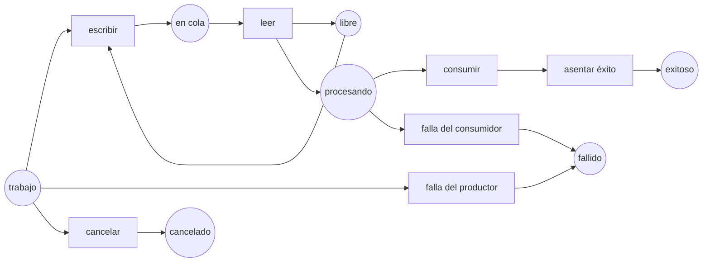

Esta lección conecta el analizador con código que realmente ejecutamos. El [curso de C# avanzado](../../csharp-advanced/) ya mide [`Channel<T>`](https://learn.microsoft.com/dotnet/api/system.threading.channels.channel-1), [TPL Dataflow](https://learn.microsoft.com/dotnet/standard/parallel-programming/dataflow-task-parallel-library) y [Rx.NET](https://github.com/dotnet/reactive). Aquí el mismo ciclo de vida se hace lo bastante finito para enumerarlo: una plaza acotada, un elemento, un productor y un consumidor.

El objetivo no es ejecutar trabajo de producción dentro de un motor de redes de Petri. La red es un pequeño **oráculo de especificación** junto a la implementación. Enumera los estados que una futura prueba de ejecución deberá distinguir. Las pruebas enfocadas de esta lección validan el propio modelo; no ejecutan `Channel<T>`, Dataflow ni Rx.

## Ejecutar el experimento

```bash
dotnet test code/petri-nets/Tests -c Release --filter PipelineLifecycleTests
dotnet run --project code/petri-nets/Examples -c Release -- l14
```

El modelo es [`Nets.PipelineLifecycle`](https://github.com/spareilleux/learn/blob/main/code/petri-nets/Examples/Nets.cs), sus aserciones están en [`PipelineLifecycleTests.cs`](https://github.com/spareilleux/learn/blob/main/code/petri-nets/Tests/PipelineLifecycleTests.cs) y el formato de intercambio es [`pipeline-lifecycle.pnml`](https://github.com/spareilleux/learn/blob/main/code/petri-nets/nets/pipeline-lifecycle.pnml).

## Un vocabulario común del ciclo de vida



| Plaza o transición de Petri | `Channel<T>` | TPL Dataflow | Rx.NET |
|---|---|---|---|
| `free` | una plaza acotada disponible en la cola | **no equivalente**: `BoundedCapacity` de un block de ejecución también cuenta el elemento que se está procesando | sin equivalente salvo que se añada un puente acotado |
| `write` | `WriteAsync` aceptado | `SendAsync` aceptado | `OnNext` |
| `producer fails` | `TryComplete(error)` | poner la fuente en fallo y propagar la terminación | `OnError` |
| `consumer fails` | cancelar y esperar a los productores; completar el writer | poner el block en fallo; observar los envíos rechazados | disponer la suscripción y esperar el trabajo asíncrono |
| `succeeded` | writer cerrado, cola drenada, ambos lados asentados | todos los blocks enlazados **y todas las tareas colectoras** terminados | `OnCompleted` observado y trabajo planificado asentado |
| `cancelled` | cancelación solicitada **y ambas tareas asentadas** | cancelación observada por todos los blocks | suscripción dispuesta y trabajo planificado asentado |

La última redacción es el contrato que debería imponer una prueba de ejecución. La pequeña red de abajo hace de la cancelación una transición atómica previa al inicio directamente hacia `cancelled`; por tanto **supone** el asentamiento en vez de observarlo. Un modelo mayor necesita separar `cancel_requested` de las plazas de participantes asentados. Cerrar una cola tampoco demuestra que su contenido se drenó.

## El resultado ejecutable

```text
== One bounded C# pipeline, with success, failure and cancellation made explicit ==
markings: 8   graph complete: True
dead markings: 3   non-terminal dead markings: 0
queue capacity invariant free + queued = 1: True
write -> read -> consume -> settle_success                 succeeded
producer_fail -> settle_producer_failure                   failed
write -> read -> consumer_fail                             failed
cancel                                                     cancelled
```

La prueba de capacidad es el invariante de cola Channel `free + queued = 1`. Una escritura consume la plaza libre; una lectura la devuelve. Ningún entrelazado puede crear un segundo elemento en cola. No es un invariante de un block de ejecución Dataflow, porque Dataflow mantiene el elemento en ejecución dentro de `BoundedCapacity`.

El recuento de marcados muertos exige una lectura más cuidadosa. [`ReachabilityGraph.DeadStates`](https://github.com/spareilleux/learn/blob/main/code/petri-nets/PetriNets/ReachabilityGraph.cs) significa «nada más puede dispararse». Eso incluye el final correcto de un workflow finito. La propiedad útil no es «ningún marcado muerto», sino:

1. el grafo de alcanzabilidad está completo;
2. cada marcado muerto contiene exactamente una marca terminal con nombre;
3. cada disposición prevista es alcanzable;
4. ningún participante ni elemento en cola queda fuera de esa disposición.

Las pruebas imponen las tres primeras. La cuarta importa cuando el modelo crece de un elemento a varios productores y consumidores.

## Qué añade esto a C# avanzado

Las lecciones [6](../../csharp-advanced/06-channels/), [7](../../csharp-advanced/07-tpl-dataflow/), [8](../../csharp-advanced/08-rx-net/) y [9](../../csharp-advanced/09-choosing-streams/) ya ejecutan los mecanismos. En particular, la lección 9 observa que:

- un channel cuyo productor lanza una excepción sin `Complete(error)` deja a su lector esperando;
- un channel acotado cuyo consumidor falla puede dejar bloqueado al productor;
- la terminación de Dataflow solo atraviesa enlaces configurados para propagarla;
- en Rx, terminación, errores, disposición y asentamiento del trabajo planificado son eventos distintos.

La red de Petri no reemplaza esas pruebas. Hace revisables los estados candidatos del ciclo de vida. El siguiente experimento es añadir un fixture de ejecución determinista, reproducir una planificación fallida en el seam público de C# y relacionar sus observaciones con el modelo; esa relación no está implementada aquí.

## Lanes de agentes: el mismo método, otro invariante

La primera mitad del programa `l14` modela el bloqueo de directorio usado por lanes de agentes concurrentes. La versión protegida conserva `free + held1 + held2 = 1`; la limpieza sin protección puede borrar el bloqueo de otra lane y alcanzar un marcado donde ambas creen poseerlo.

```text
guarded:   7 markings, no marking with two holders
unguarded: 10 markings, 1 marking with two holders
shortest counterexample: take1 -> fail2 -> clean_hit2 -> take2
```

Las redes de Petri encajan bien porque la afirmación de seguridad trata sobre **todos los entrelazados**, mientras que una prueba de carga solo muestrea las planificaciones que la máquina ejecutó.

## Límite del experimento

Los ejemplos Channel/Dataflow/Rx del curso de C# avanzado reproducen la **forma** de ciertos métodos de GA en revisiones fijadas. Son experimentos del mecanismo, no pruebas de los binarios actuales de GA. Esta red de un elemento tampoco puede reproducir a un productor bloqueado por backpressure tras el fallo del consumidor, y su cancelación solo ocurre antes del inicio. Un hallazgo de repositorio debe etiquetar esa fidelidad de evidencia y confirmarse con una prueba de regresión contra la revisión objetivo antes de declararse resuelto.

La entrega RabbitMQ, los leases de Redis, las actualizaciones progresivas de Kubernetes y los handoffs multiagente necesitan más marcas, tiempo y semánticas de fallo externas. Siguen siendo experimentos futuros; esta lección no deduce sus garantías del modelo de una sola plaza.

## Ejercicios

1. Añade un segundo productor. ¿Qué plazas necesitan una marca por productor y qué invariante sigue demostrando la capacidad?
2. Añade `cancel_requested` separado de `cancelled`. Construye un marcado en el que se pidió cancelar pero un productor sigue bloqueado.
3. Añade una transición de retry al consumidor. ¿Qué marcados terminales siguen siendo legítimos y qué supuesto de equidad permite decir que acabará asentándose?
4. Asocia un acuse de RabbitMQ y una dead-letter exchange a plazas y transiciones. Marca cada afirmación que exigiría un experimento con un broker real.

## Ideas clave

- Las redes de Petri complementan las pruebas de concurrencia C# cuando enumeran estados del ciclo de vida y las pruebas reproducen los contraejemplos en seams públicos.
- `free + queued = capacity` es la versión estructural de la backpressure acotada.
- Una terminación correcta también es un marcado muerto; clasifica por separado los marcados muertos terminales y no terminales.
- Terminación, solicitud de cancelación, asentamiento de participantes y drenaje de la cola son hechos distintos.
- Mantén el modelo junto al código de producción, no dentro de su ruta de ejecución.
