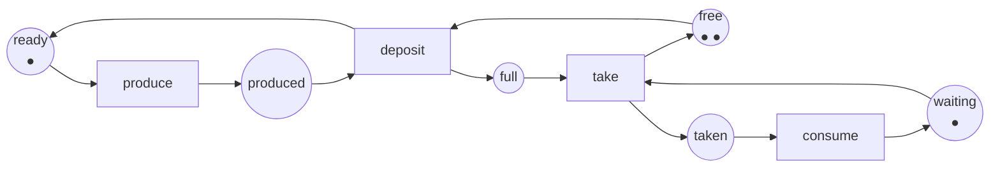

:::note[Sobre qué se ejecuta este curso]
El analizador de este curso es un proyecto de C# en [`code/petri-nets`](https://github.com/spareilleux/learn/tree/main/code/petri-nets), compilado con el [SDK de .NET](https://dotnet.microsoft.com/download) **10.0.112** y ejecutado sobre .NET **10.0.12**, las versiones instaladas en mi máquina el 2026-09-15. Lee y escribe [PNML](https://www.pnml.org/), aplica la regla de disparo, construye grafos de alcanzabilidad y árboles de cobertura, calcula invariantes de plazas y de transiciones, decide las clases estructurales con sus sifones, trampas y circuitos, y despliega una red coloreada en una ordinaria. [`check.sh`](https://github.com/spareilleux/learn/blob/main/code/petri-nets/check.sh) ejecuta las pruebas unitarias y cada lección, y compara la salida con [`expected`](https://github.com/spareilleux/learn/tree/main/code/petri-nets/expected); todos los listados de estas lecciones están pegados desde esa salida. Las herramientas externas se nombran y se enlazan, nunca son necesarias. [`petri-nets-examples.yml`](https://github.com/spareilleux/learn/blob/main/.github/workflows/petri-nets-examples.yml) ejecuta `check.sh` en Ubuntu, Windows y macOS; se ejecutó por primera vez el 2026-09-16 en el commit `53ceefc` y pasó en los tres.
:::

## Por qué estoy aprendiendo esto

Sé dibujar una máquina de estados. He escrito varias en C# con un `enum` y un `switch`, y en Java con un patrón estado, y funcionan mientras el sistema hace una cosa a la vez. Luego ocurren dos cosas al mismo tiempo. Dos hilos toman dos cerrojos en dos órdenes. Un `Channel<T>` se llena y el productor se bloquea para siempre. Un flujo de trabajo tiene tres ramas y nadie sabe decir si todas pueden terminar.

Una máquina de estados no puede decir nada de eso, porque tiene un estado actual, y lo que estoy modelando tiene varios. Lo que quiero es un modelo cuyo estado sea una *distribución*: tantas peticiones en la cola, tantos trabajadores ocupados, un cerrojo tomado. Una red de Petri es exactamente eso, y viene con un pequeño cuerpo de matemáticas que responde preguntas que hoy respondo con pruebas de carga y esperanza:

- **¿puede desbordarse esta cola?** No «se desbordó el martes pasado» — *puede*, alguna vez, bajo cualquier entrelazado;
- **¿puede este sistema interbloquearse?** Y si puede, cuál es la secuencia más corta que llega allí;
- **¿va a terminar este flujo de trabajo?** Desde todos los estados en los que puede acabar, no solo el camino feliz.

Esas tres preguntas las decide un programa en este curso, sobre redes que modelan cosas reales: un búfer acotado, una exclusión mutua, dos cerrojos tomados en órdenes opuestos.

## Para quién es este curso

Eres desarrollador de C# o de Java. Has escrito código concurrente y modelado procesos con máquinas de estados. No necesitas más matemáticas que sumar vectores y multiplicar una matriz por uno; el curso introduce lo que usa, y la primera matriz aparece en la lección 2 solo porque hace más fácil algo concreto.

Las lecciones sobre concurrencia se apoyan en lo que ya sabes. La lección 7 toma la contrapresión de las [lecciones 6 a 9 del curso de C# avanzado](../csharp-advanced/) — channels, TPL Dataflow, Rx — y la modela en lugar de medirla. La lección 14 inicia el dogfooding del repositorio con un ciclo de vida C# acotado y un bloqueo de lanes de agentes; RabbitMQ y Kubernetes quedan como experimentos posteriores explícitos.

## El ejemplo conductor

Un productor, un consumidor y un búfer de dos huecos. Tres plazas contienen el estado del productor, del consumidor y del búfer; cuatro transiciones son los eventos. Nada es un «estado actual»: el marcado dice dónde está cada marca, todas a la vez.

Los nombres de las plazas y de las transiciones se quedan en inglés en los tres idiomas: forman parte de la salida del programa, comparada por `check.sh`, y traducirlos haría que los listados dejaran de coincidir.

Esta red tiene doce marcados alcanzables, nunca se interbloquea, y la plaza `free` es toda la razón por la que el búfer no puede desbordarse — quítala y el conjunto de marcados alcanzables se vuelve infinito. Las lecciones 1 a 4 demuestran las tres afirmaciones, y la lección 5 demuestra la primera otra vez sin mirar ni un solo marcado.

## Al terminar este curso podré

- leer y dibujar una red de Petri, y decir qué significa su marcado en el sistema que modela;
- escribir la matriz de incidencia de una red, y saber qué decide y qué no decide la ecuación de estado;
- construir un grafo de alcanzabilidad, y un árbol de cobertura cuando el grafo es infinito;
- decidir acotación, seguridad, vivacidad, ausencia de interbloqueo, reversibilidad y persistencia, y decir cuáles de ellas exige realmente un sistema dado;
- calcular invariantes de plazas y de transiciones, y usar uno como una prueba válida para todos los marcados alcanzables;
- reconocer máquinas de estados, grafos marcados y redes de libre elección, y usar los teoremas que vienen con esas clases;
- modelar exclusión mutua, productor-consumidor, lectores-escritores y los filósofos comensales, y comparar los modelos con las construcciones de C# y de Java que representan;
- usar redes coloreadas, temporizadas y estocásticas, y saber qué cuesta cada extensión al análisis;
- comprobar la *soundness* de un flujo de trabajo, y traducir entre BPMN y redes de flujo de trabajo;
- intercambiar redes con TINA, LoLA, CPN Tools, GreatSPN y TAPAAL mediante PNML;
- modelar partes de los sistemas de este repositorio, y decir con honestidad qué encontró el modelo y qué se le escapó;
- saber dónde se detiene el formalismo: qué es indecidible, qué es decidible pero desesperado, y a qué recurrir en su lugar.

## Plan

| # | Lección | Lo que quizá ya conoces |
|---|---|---|
| 1 | [Por qué las redes de Petri](01-why-petri-nets/) | las máquinas de estados, `enum` más `switch`, una cola acotada |
| 2 | [La definición formal y la matriz de incidencia](02-the-incidence-matrix/) | los vectores, un producto de matrices |
| 3 | [El grafo de alcanzabilidad](03-the-reachability-graph/) | un recorrido en anchura, la explosión de una matriz de pruebas |
| 4 | [Propiedades](04-properties/) | interbloqueo, inanición, livelock |
| 5 | [Invariantes](05-invariants/) | un invariante de bucle, una cantidad conservada |
| 6 | [Clases estructurales: máquinas de estados, grafos marcados, redes de libre elección](06-structural-classes/) | |
| 7 | [Modelar la concurrencia: exclusión mutua, productor-consumidor, lectores-escritores, filósofos](07-modelling-concurrency/) | `lock`, `SemaphoreSlim`, `Channel<T>`, `synchronized`, `ReentrantLock` |
| 8 | [Redes coloreadas](08-coloured-nets/) | los genéricos, un mensaje tipado |
| 9 | [Tiempo y probabilidad: redes temporizadas, estocásticas, GSPN](09-time-and-probability/) | los percentiles, un modelo de colas |
| 10 | [Flujos de trabajo: redes de flujo de trabajo, *soundness*, BPMN, *process mining*](10-workflows/) | BPMN, un motor de flujos de trabajo |
| 11 | [Herramientas e interoperabilidad: PNML, TINA, LoLA, Snoopy, PIPE, CPN Tools, GreatSPN, TAPAAL](11-tools-and-interoperability/) | un formato de intercambio en XML |
| 12 | [Aplicaciones industriales: talleres flexibles, protocolos, hardware, bioquímica, seguridad](12-industrial-applications/) | un banco de pruebas público, un espacio de estados |
| 13 | [Frente a otros formalismos: TLA+, statecharts, álgebras de procesos, autómatas temporizados](13-against-other-formalisms/) | un segundo espacio de estados, calculado en otra parte |
| 14 | [En nuestros sistemas: pipelines C# y lanes de agentes](14-on-our-systems/) | [C# avanzado](../csharp-advanced/); RabbitMQ y Kubernetes son experimentos posteriores |
| 15 | Límites y qué viene después: indecidibilidad, desplegados, reducción de orden parcial, extensiones | |

[Diario](journal/): lo que intenté, lo que me sorprendió, lo que me queda por verificar.

## Recursos

- [Petri Nets World](https://www.informatik.uni-hamburg.de/TGI/PetriNets/), el portal de la comunidad, con su [lista de herramientas](http://www2.informatik.uni-hamburg.de/tgi/PetriNets/tools/) y sus [bibliografías](http://www2.informatik.uni-hamburg.de/tgi/PetriNets/bibliographies/)
- Tadao Murata, *Petri nets: Properties, analysis and applications*, **Proceedings of the IEEE** 77(4), abril de 1989, páginas 541–580, [doi:10.1109/5.24143](https://doi.org/10.1109/5.24143) — el artículo de síntesis que este curso cita más a menudo
- Wolfgang Reisig, *Understanding Petri Nets*, Springer, 2013, [doi:10.1007/978-3-642-33278-4](https://doi.org/10.1007/978-3-642-33278-4)
- [PNML, el Petri Net Markup Language](https://www.pnml.org/), normalizado como [ISO/IEC 15909-1:2019](https://www.iso.org/standard/67235.html) (conceptos), [ISO/IEC 15909-2:2011](https://www.iso.org/standard/43538.html) (formato de intercambio) e [ISO/IEC 15909-3:2021](https://www.iso.org/standard/81504.html) (extensiones)
- Herramientas: [TINA](https://projects.laas.fr/tina/), [LoLA](https://theo.informatik.uni-rostock.de/theo-forschung/tools/lola/), [CPN Tools](https://cpntools.org/), [GreatSPN](http://www.di.unito.it/~greatspn/index.html), [TAPAAL](https://www.tapaal.net/), [Snoopy](https://www-dssz.informatik.tu-cottbus.de/DSSZ/Software/Snoopy), [PIPE](https://github.com/sarahtattersall/PIPE)
- El [Model Checking Contest](https://mcc.lip6.fr/), donde esas herramientas se enfrentan cada año sobre un conjunto público de redes
- El código fuente de este curso: [`code/petri-nets`](https://github.com/spareilleux/learn/tree/main/code/petri-nets)
