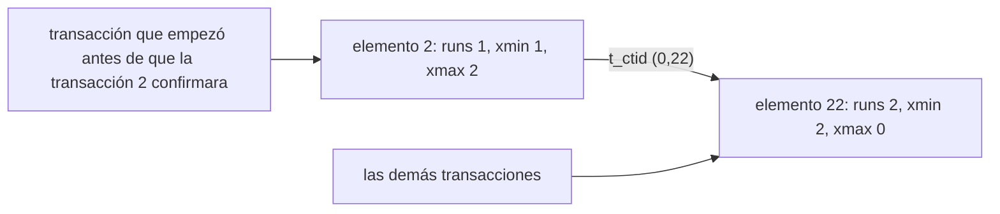

El script de la lección es [`sql/06-mvcc.sql`](https://github.com/spareilleux/learn/blob/a5e397e/code/postgresql-aurora/sql/06-mvcc.sql), comparado con [`expected/06-mvcc.txt`](https://github.com/spareilleux/learn/blob/a5e397e/code/postgresql-aurora/expected/06-mvcc.txt). Un script se ejecuta en una sesión, y la concurrencia necesita dos: el resto de la lección está en [`csharp/L06.cs`](https://github.com/spareilleux/learn/blob/a5e397e/code/postgresql-aurora/csharp/L06.cs) y [`java/…/L06.java`](https://github.com/spareilleux/learn/blob/a5e397e/code/postgresql-aurora/java/src/main/java/dev/learn/pg/L06.java), que se ejecutan como en la [lección 4](../04-csharp-java/#ejecutar-los-ejemplos):

```bash
dotnet run --project csharp -c Release -- l06-isolation
java -jar java/target/pg.jar l06-lost-update
```

Cada programa abre dos conexiones, A y B, y ejecuta sus instrucciones en un orden fijo. Cuando B tiene que esperar a A, el programa no puede simplemente esperar a que vuelva el comando de B, así que una tercera conexión consulta [`pg_stat_activity`](https://www.postgresql.org/docs/18/monitoring-stats.html#MONITORING-PG-STAT-ACTIVITY-VIEW) hasta que B espera un bloqueo ([líneas 22-37](https://github.com/spareilleux/learn/blob/a5e397e/code/postgresql-aurora/csharp/L06.cs#L22-L37)):

```csharp
    // Consulta hasta que la sesión con este ID de proceso espera un bloqueo, y devuelve las sesiones que la bloquean
    static async Task<int[]> WaitUntilBlocked(NpgsqlDataSource dataSource, int pid)
    {
        await using var observer = await dataSource.OpenConnectionAsync();
        while (true)
        {
            await using var command = new NpgsqlCommand(
                "SELECT pg_blocking_pids(pid) FROM pg_stat_activity WHERE pid = $1 AND wait_event_type = 'Lock'", observer);
            command.Parameters.Add(new() { Value = pid });
            if (await command.ExecuteScalarAsync() is int[] blockers)
            {
                return blockers;
            }
            await Task.Delay(20);
        }
    }
```

[`pg_blocking_pids`](https://www.postgresql.org/docs/18/functions-info.html#FUNCTIONS-INFO-SESSION) devuelve las sesiones que tienen lo que espera. Con eso, cada salida es la misma en cada ejecución, y `check.sh` las compara con `expected/l06-*.txt`.

| SQL Server | PostgreSQL |
|---|---|
| `READ COMMITTED` toma bloqueos compartidos, salvo que `READ_COMMITTED_SNAPSHOT` esté activado | `READ COMMITTED` lee una instantánea, siempre: los lectores nunca esperan a los escritores |
| versiones antiguas en el version store (tempdb, o la base con accelerated database recovery) | versiones antiguas en la propia tabla, hasta que `VACUUM` las elimina |
| `READ UNCOMMITTED` lee filas no confirmadas | `READ UNCOMMITTED` es `READ COMMITTED` |
| `SNAPSHOT`, error de conflicto de actualización 3960 | `REPEATABLE READ`, SQLSTATE `40001` |
| `SERIALIZABLE` con bloqueos de rango de claves | `SERIALIZABLE` con serializable snapshot isolation, `40001` |
| `SET LOCK_TIMEOUT`, error 1222 | `lock_timeout`, SQLSTATE `55P03` |
| `READPAST` | `SKIP LOCKED` |
| víctima del deadlock elegida por `DEADLOCK_PRIORITY`, error 1205 | la sesión que detecta el ciclo, SQLSTATE `40P01` |
| escalado de bloqueos a la tabla | sin escalado: los bloqueos de fila se escriben en las filas |

## Versiones de fila

Una tabla para la lección: una fila por workflow, con autovacuum desactivado, para que el script decida cuándo se ejecuta `VACUUM` ([líneas 9-23](https://github.com/spareilleux/learn/blob/a5e397e/code/postgresql-aurora/sql/06-mvcc.sql#L9-L23)):

```sql
-- Una fila por workflow, en una tabla que autovacuum no toca: el script decide cuándo se ejecuta VACUUM
CREATE TABLE ci.workflow_totals (
    workflow_name text PRIMARY KEY,
    runs          integer NOT NULL,
    failures      integer NOT NULL
) WITH (autovacuum_enabled = false);
-- Los ID de transacción de abajo son relativos a este, para que la salida no dependa de cuántas transacciones ejecutó antes el servidor
SELECT pg_current_xact_id()::text::bigint AS base \gset
INSERT INTO ci.workflow_totals
SELECT workflow_name, count(*), count(*) FILTER (WHERE conclusion = 'failure')
FROM ci.runs GROUP BY workflow_name ORDER BY workflow_name;

-- Cada versión de fila lleva la transacción que la creó (xmin) y la que la borró (xmax), y su lugar (ctid)
SELECT ctid, xmin::text::bigint - :base AS xmin, xmax, workflow_name, runs
FROM ci.workflow_totals WHERE workflow_name LIKE 'GHA 0%' ORDER BY workflow_name LIMIT 3;
```

```text
CREATE TABLE
INSERT 0 21
 ctid  | xmin | xmax |      workflow_name      | runs
-------+------+------+-------------------------+------
 (0,2) |    1 |    0 | GHA 01: hello           |    1
 (0,3) |    1 |    0 | GHA 02: build and test  |    3
 (0,4) |    1 |    0 | GHA 02: exercise checks |    1
(3 rows)
```

Cada versión de fila lleva [columnas de sistema](https://www.postgresql.org/docs/18/ddl-system-columns.html) que `SELECT *` no muestra:

- `xmin`, la transacción que creó la versión. El script resta el ID de la transacción justo anterior al `INSERT`, guardado por el [`\gset`](https://www.postgresql.org/docs/18/app-psql.html#APP-PSQL-META-COMMAND-GSET) de `psql` en la variable `base`: los ID absolutos dependen de todo lo que el servidor hizo antes.
- `xmax`, la transacción que la borró o la bloqueó; `0` si ninguna.
- `ctid`, su lugar físico: página 0, elemento 2.

Un `UPDATE` no modifica la fila en su sitio ([líneas 25-36](https://github.com/spareilleux/learn/blob/a5e397e/code/postgresql-aurora/sql/06-mvcc.sql#L25-L36)):

```sql
-- Un UPDATE escribe una nueva versión y marca la antigua como borrada
UPDATE ci.workflow_totals SET runs = runs + 1 WHERE workflow_name = 'GHA 01: hello';
SELECT ctid, xmin::text::bigint - :base AS xmin, xmax, workflow_name, runs
FROM ci.workflow_totals WHERE workflow_name = 'GHA 01: hello';

-- Ambas versiones siguen en la página
CREATE EXTENSION pageinspect;
SELECT lp, t_ctid, t_xmin::text::bigint - :base AS t_xmin,
       CASE WHEN t_xmax::text = '0' THEN NULL ELSE t_xmax::text::bigint - :base END AS t_xmax
FROM heap_page_items(get_raw_page('ci.workflow_totals', 0))
WHERE lp IN (2, 22)
ORDER BY lp;
```

```text
UPDATE 1
  ctid  | xmin | xmax | workflow_name | runs
--------+------+------+---------------+------
 (0,22) |    2 |    0 | GHA 01: hello |    2
(1 row)

CREATE EXTENSION
 lp | t_ctid | t_xmin | t_xmax
----+--------+--------+--------
  2 | (0,22) |      1 |      2
 22 | (0,22) |      2 |
(2 rows)
```

La fila vive ahora en `(0,22)`, creada por la transacción 2. [`pageinspect`](https://www.postgresql.org/docs/18/pageinspect.html) lee la página en bruto: el elemento 2, la versión antigua, sigue ahí, con `xmax` 2 y un `t_ctid` que apunta a la nueva versión. Una transacción que empezó antes de que la transacción 2 confirmara sigue leyendo el elemento 2; las demás siguen la cadena hasta el elemento 22. Esto es [MVCC](https://www.postgresql.org/docs/18/mvcc-intro.html): cada transacción ve las versiones que estaban confirmadas cuando se tomó su instantánea, y nadie espera para leer.

La página después de la actualización, en imagen: la versión antigua apunta a la nueva, y cada transacción lee la versión que su instantánea puede ver.



SQL Server con `READ_COMMITTED_SNAPSHOT` hace lo mismo con otra disposición: la fila se actualiza en su sitio, y la versión antigua se copia al version store. PostgreSQL deja las versiones antiguas donde estaban, lo que hace instantáneo un rollback, y deja la limpieza para más tarde.

## Versiones muertas y VACUUM

Un `UPDATE` revertido también deja versiones muertas ([líneas 38-47](https://github.com/spareilleux/learn/blob/a5e397e/code/postgresql-aurora/sql/06-mvcc.sql#L38-L47)):

```sql
-- Un UPDATE revertido también deja una versión muerta
BEGIN;
UPDATE ci.workflow_totals SET failures = 0;
ROLLBACK;
CREATE EXTENSION pgstattuple;
SELECT tuple_count, dead_tuple_count, table_len FROM pgstattuple('ci.workflow_totals');

-- VACUUM hace reutilizable el espacio de las versiones muertas; el archivo conserva su tamaño
VACUUM ci.workflow_totals;
SELECT tuple_count, dead_tuple_count, table_len, free_space > 0 AS has_free_space FROM pgstattuple('ci.workflow_totals');
```

```text
BEGIN
UPDATE 21
ROLLBACK
CREATE EXTENSION
 tuple_count | dead_tuple_count | table_len
-------------+------------------+-----------
          21 |               22 |      8192
(1 row)

VACUUM
 tuple_count | dead_tuple_count | table_len | has_free_space
-------------+------------------+-----------+----------------
          21 |                0 |      8192 | t
(1 row)
```

[`pgstattuple`](https://www.postgresql.org/docs/18/pgstattuple.html) cuenta 22 versiones muertas: la versión antigua del primer `UPDATE`, y las 21 versiones de la transacción revertida. `ROLLBACK` no reescribió nada; la transacción solo queda marcada como abortada, y sus versiones son invisibles para todos.

[`VACUUM`](https://www.postgresql.org/docs/18/routine-vacuuming.html) elimina las versiones que ya ninguna transacción puede ver, y registra su espacio como libre para inserciones y actualizaciones posteriores. El archivo conserva sus 8 kB: `VACUUM` solo devuelve espacio al sistema operativo cuando las páginas del final del archivo están vacías. [Autovacuum](https://www.postgresql.org/docs/18/routine-vacuuming.html#AUTOVACUUM) lo ejecuta en segundo plano, por defecto cuando están muertas el 20 % de las filas de una tabla más 50.

## Bloat

Lo mismo a escala: cada fila del historial de pasos de 440 800 filas de la [lección 5](../05-indexes/), actualizada una vez ([líneas 49-65](https://github.com/spareilleux/learn/blob/a5e397e/code/postgresql-aurora/sql/06-mvcc.sql#L49-L65)):

```sql
-- Bloat a escala: cada fila del historial de pasos actualizada una vez
ALTER TABLE ci.step_history SET (autovacuum_enabled = false);
SELECT pg_size_pretty(pg_relation_size('ci.step_history')) AS before;
UPDATE ci.step_history SET duration = duration + interval '1 second';
SELECT pg_size_pretty(pg_relation_size('ci.step_history')) AS after_update,
       dead_tuple_count, round(dead_tuple_percent) AS dead_percent
FROM pgstattuple('ci.step_history');
VACUUM ci.step_history;
SELECT pg_size_pretty(pg_relation_size('ci.step_history')) AS after_vacuum, round(free_percent) AS free_percent
FROM pgstattuple('ci.step_history');
-- La siguiente actualización completa reutiliza el espacio libre en lugar de hacer crecer el archivo
UPDATE ci.step_history SET duration = duration - interval '1 second';
VACUUM ci.step_history;
SELECT pg_size_pretty(pg_relation_size('ci.step_history')) AS after_second_update;
-- VACUUM FULL reescribe la tabla, bajo un bloqueo ACCESS EXCLUSIVE
VACUUM FULL ci.step_history;
SELECT pg_size_pretty(pg_relation_size('ci.step_history')) AS after_vacuum_full;
```

```text
ALTER TABLE
 before
--------
 76 MB
(1 row)

UPDATE 440800
 after_update | dead_tuple_count | dead_percent
--------------+------------------+--------------
 151 MB       |           440800 |           48
(1 row)

VACUUM
 after_vacuum | free_percent
--------------+--------------
 151 MB       |           50
(1 row)

UPDATE 440800
VACUUM
 after_second_update
---------------------
 151 MB
(1 row)

VACUUM
 after_vacuum_full
-------------------
 76 MB
(1 row)
```

1. El `UPDATE` duplica la tabla: 440 800 versiones nuevas, y otras tantas muertas, el 48 % del archivo.
2. `VACUUM` libera la mitad del archivo, pero el archivo se queda en 151 MB.
3. El siguiente `UPDATE` completo escribe sus nuevas versiones en ese espacio libre: 151 MB, no 226.
4. [`VACUUM FULL`](https://www.postgresql.org/docs/18/sql-vacuum.html) copia las versiones vivas a un archivo nuevo: 76 MB. Mantiene un bloqueo `ACCESS EXCLUSIVE` durante toda la copia, así que mientras tanto nadie puede ni siquiera leer la tabla.

Una tabla que se queda al doble de su tamaño tras un proceso por lotes es normal, y el espacio se reutiliza. Una tabla que no para de crecer significa que `VACUUM` no da abasto, o no puede eliminar nada: el ejercicio 1 muestra qué lo detiene.

## Actualizaciones HOT

Una versión nueva necesita normalmente una entrada nueva en cada índice de la tabla. Cuando no cambia ninguna columna indexada y la página tiene sitio, PostgreSQL escribe una *heap-only tuple*: la nueva versión va a la misma página, y los índices siguen apuntando a la antigua, que enlaza con ella ([líneas 67-74](https://github.com/spareilleux/learn/blob/a5e397e/code/postgresql-aurora/sql/06-mvcc.sql#L67-L74)):

```sql
-- Actualizaciones HOT: una nueva versión en la misma página, sin cambio en los índices, cuando no cambia ninguna columna indexada y la página tiene sitio
ALTER TABLE ci.workflow_totals SET (fillfactor = 70);
VACUUM FULL ci.workflow_totals;
SELECT pg_stat_reset_single_table_counters('ci.workflow_totals'::regclass) \gset
UPDATE ci.workflow_totals SET failures = failures + 1;
UPDATE ci.workflow_totals SET workflow_name = workflow_name || ' ' WHERE workflow_name LIKE 'GHA 0%';
SELECT pg_stat_force_next_flush() \gset
SELECT n_tup_upd, n_tup_hot_upd FROM pg_stat_user_tables WHERE relid = 'ci.workflow_totals'::regclass;
```

```text
ALTER TABLE
VACUUM
UPDATE 21
UPDATE 15
 n_tup_upd | n_tup_hot_upd
-----------+---------------
        36 |            21
(1 row)
```

- [`fillfactor`](https://www.postgresql.org/docs/18/sql-createtable.html#RELOPTION-FILLFACTOR) `= 70` deja vacío el 30 % de cada página cuando se escribe la tabla; `VACUUM FULL` lo aplica a las filas existentes.
- Las 21 actualizaciones de `failures`, una columna que no está en ningún índice, fueron todas HOT.
- Las 15 actualizaciones de `workflow_name`, la clave primaria, no.

[`pg_stat_user_tables`](https://www.postgresql.org/docs/18/monitoring-stats.html#MONITORING-PG-STAT-ALL-TABLES-VIEW) cuenta ambas. Las estadísticas se envían al final de una transacción, como mucho una vez por segundo: `pg_stat_force_next_flush()` las envía en la siguiente, para que el recuento esté ahí cuando el script lo lee. Un índice sobre una columna que cambia a menudo cuesta más que sus propias actualizaciones: hace que toda actualización de la fila sea no HOT ([heap-only tuples](https://www.postgresql.org/docs/18/storage-hot.html)).

## Niveles de aislamiento

A lee la misma fila dos veces en una transacción, y B confirma un incremento entre las dos lecturas ([líneas 55-79](https://github.com/spareilleux/learn/blob/a5e397e/code/postgresql-aurora/csharp/L06.cs#L55-L79)):

```csharp
    public static async Task Isolation()
    {
        await using var dataSource = await Totals();
        await using var a = await dataSource.OpenConnectionAsync();
        await using var b = await dataSource.OpenConnectionAsync();

        // A lee dos veces en una transacción; B confirma una actualización entre ambas lecturas
        foreach (var level in new[] { "READ COMMITTED", "REPEATABLE READ", "SERIALIZABLE" })
        {
            await Exec(a, $"BEGIN ISOLATION LEVEL {level}");
            var first = await Scalar<int>(a, ReadDeploy);
            await Exec(b, IncrementDeploy);
            var second = await Scalar<int>(a, ReadDeploy);
            await Exec(a, "COMMIT");
            Console.WriteLine($"{level}: A reads {first}, B commits +1, A reads {second}");
        }

        // La actualización de B aún no está confirmada: A nunca la ve, ni siquiera cuando pide READ UNCOMMITTED
        await Exec(b, "BEGIN");
        await Exec(b, IncrementDeploy);
        await Exec(a, "BEGIN ISOLATION LEVEL READ UNCOMMITTED");
        Console.WriteLine($"READ UNCOMMITTED: B has not committed, A reads {await Scalar<int>(a, ReadDeploy)}");
        await Exec(a, "COMMIT");
        await Exec(b, "ROLLBACK");
    }
```

```text
READ COMMITTED: A reads 65, B commits +1, A reads 66
REPEATABLE READ: A reads 66, B commits +1, A reads 66
SERIALIZABLE: A reads 67, B commits +1, A reads 67
READ UNCOMMITTED: B has not committed, A reads 68
```

- En [`READ COMMITTED`](https://www.postgresql.org/docs/18/transaction-iso.html#XACT-READ-COMMITTED), el nivel por defecto de PostgreSQL, cada instrucción toma una instantánea nueva: la segunda lectura de A ve la confirmación de B.
- En `REPEATABLE READ` y `SERIALIZABLE`, la instantánea se toma en la primera instrucción de la transacción y se mantiene hasta el final: A lee 66 dos veces.
- `READ UNCOMMITTED` se acepta y se comporta como `READ COMMITTED`: PostgreSQL nunca muestra una fila no confirmada.
- B nunca esperó. Con el `REPEATABLE READ` por bloqueos de SQL Server, el bloqueo compartido de A sobre la fila habría hecho esperar al `UPDATE` de B hasta que A confirmara.

## Actualizaciones perdidas

Dos sesiones leen el mismo contador, suman uno en la aplicación y lo vuelven a escribir ([líneas 81-127](https://github.com/spareilleux/learn/blob/a5e397e/code/postgresql-aurora/csharp/L06.cs#L81-L127)):

```csharp
    public static async Task LostUpdate()
    {
        await using var dataSource = await Totals();
        await using var a = await dataSource.OpenConnectionAsync();
        await using var b = await dataSource.OpenConnectionAsync();
        var start = await Scalar<int>(a, ReadDeploy);
        Console.WriteLine($"runs before: {start}");

        // Leer, sumar uno en la aplicación, volver a escribir: la escritura de B sustituye a la de A
        await Exec(a, "BEGIN");
        await Exec(b, "BEGIN");
        var readByA = await Scalar<int>(a, ReadDeploy);
        var readByB = await Scalar<int>(b, ReadDeploy);
        await Exec(a, $"UPDATE ci.workflow_runs SET runs = {readByA + 1} WHERE workflow_name = 'Deploy to GitHub Pages'");
        await Exec(a, "COMMIT");
        await Exec(b, $"UPDATE ci.workflow_runs SET runs = {readByB + 1} WHERE workflow_name = 'Deploy to GitHub Pages'");
        await Exec(b, "COMMIT");
        Console.WriteLine($"READ COMMITTED, read then write: two increments, runs = {await Scalar<int>(a, ReadDeploy)}");

        // Lo mismo en REPEATABLE READ: la escritura de B falla, porque la fila cambió después de la instantánea de B
        await Exec(a, "BEGIN ISOLATION LEVEL REPEATABLE READ");
        await Exec(b, "BEGIN ISOLATION LEVEL REPEATABLE READ");
        readByA = await Scalar<int>(a, ReadDeploy);
        readByB = await Scalar<int>(b, ReadDeploy);
        await Exec(a, $"UPDATE ci.workflow_runs SET runs = {readByA + 1} WHERE workflow_name = 'Deploy to GitHub Pages'");
        await Exec(a, "COMMIT");
        try
        {
            await Exec(b, $"UPDATE ci.workflow_runs SET runs = {readByB + 1} WHERE workflow_name = 'Deploy to GitHub Pages'");
        }
        catch (PostgresException e)
        {
            Console.WriteLine($"REPEATABLE READ, read then write: B gets {e.SqlState}: {e.MessageText}");
            await Exec(b, "ROLLBACK");
        }
        Console.WriteLine($"runs = {await Scalar<int>(a, ReadDeploy)}");

        // runs = runs + 1 en READ COMMITTED: B espera al bloqueo de fila de A, y luego suma uno a la fila que A confirmó
        await Exec(a, "BEGIN");
        await Exec(a, IncrementDeploy);
        var waiting = Exec(b, IncrementDeploy);
        var blockers = await WaitUntilBlocked(dataSource, b.ProcessID);
        Console.WriteLine($"READ COMMITTED, runs = runs + 1: B waits, blocked by A: {blockers.SequenceEqual([a.ProcessID])}");
        await Exec(a, "COMMIT");
        await waiting;
        Console.WriteLine($"runs = {await Scalar<int>(a, ReadDeploy)}");
    }
```

```text
runs before: 65
READ COMMITTED, read then write: two increments, runs = 66
REPEATABLE READ, read then write: B gets 40001: could not serialize access due to concurrent update
runs = 67
READ COMMITTED, runs = runs + 1: B waits, blocked by A: True
runs = 69
```

- En `READ COMMITTED`, ambas leen 65 y ambas escriben 66: un incremento se pierde, sin error.
- En `REPEATABLE READ`, el `UPDATE` de B encuentra una fila que cambió después de su instantánea, y falla con SQLSTATE [`40001`](https://www.postgresql.org/docs/18/errcodes-appendix.html), un fallo de serialización. La aplicación debe revertir y volver a ejecutar toda la transacción, leyendo el nuevo valor. El aislamiento `SNAPSHOT` de SQL Server da el error 3960 en la misma situación.
- `runs = runs + 1` en una sola instrucción no necesita ningún nivel de aislamiento: B espera al bloqueo de fila de A, luego vuelve a leer la fila que A confirmó, y suma uno a 68. La [documentación de `READ COMMITTED`](https://www.postgresql.org/docs/18/transaction-iso.html#XACT-READ-COMMITTED) describe esta nueva comprobación de la fila actualizada.

Lo mismo en Java, donde [`setTransactionIsolation`](https://docs.oracle.com/en/java/javase/25/docs/api/java.sql/java/sql/Connection.html#setTransactionIsolation(int)) fija el nivel de la siguiente transacción ([líneas 30-58](https://github.com/spareilleux/learn/blob/a5e397e/code/postgresql-aurora/java/src/main/java/dev/learn/pg/L06.java#L30-L58)):

```java
    static void lostUpdate() throws SQLException {
        try (Connection a = DriverManager.getConnection(L04.url()); Connection b = DriverManager.getConnection(L04.url())) {
            update(a, "DROP TABLE IF EXISTS ci.workflow_runs");
            update(a, "CREATE TABLE ci.workflow_runs AS SELECT workflow_name, count(*)::int AS runs FROM ci.runs GROUP BY workflow_name");
            // JDBC empieza una transacción con setAutoCommit(false); el nivel de aislamiento se aplica a la siguiente
            int[] levels = {Connection.TRANSACTION_READ_COMMITTED, Connection.TRANSACTION_REPEATABLE_READ};
            String[] names = {"READ COMMITTED", "REPEATABLE READ"};
            for (int i = 0; i < levels.length; i++) {
                String name = names[i];
                for (Connection c : new Connection[] {a, b}) {
                    c.setAutoCommit(false);
                    c.setTransactionIsolation(levels[i]);
                }
                long readByA = scalar(a, READ_DEPLOY);
                long readByB = scalar(b, READ_DEPLOY);
                update(a, "UPDATE ci.workflow_runs SET runs = " + (readByA + 1) + " WHERE workflow_name = 'Deploy to GitHub Pages'");
                a.commit();
                try {
                    update(b, "UPDATE ci.workflow_runs SET runs = " + (readByB + 1) + " WHERE workflow_name = 'Deploy to GitHub Pages'");
                    b.commit();
                    System.out.println(name + ": A and B read " + readByA + ", both write " + (readByA + 1) + ", runs = " + scalar(a, READ_DEPLOY));
                } catch (SQLException e) {
                    b.rollback();
                    System.out.println(name + ": A and B read " + readByA + ", B's write gets " + e.getSQLState() + ": " + e.getMessage());
                }
                a.commit();
            }
        }
    }
```

```text
READ COMMITTED: A and B read 65, both write 66, runs = 66
REPEATABLE READ: A and B read 66, B's write gets 40001: ERROR: could not serialize access due to concurrent update
```

El mensaje de pgjdbc empieza por la severidad, `ERROR:`; el `MessageText` de Npgsql no.

## Write skew y SERIALIZABLE

Una regla que abarca dos filas: de las dos imágenes de runner, al menos una debe seguir habilitada. A deshabilita macOS y B deshabilita Windows, cada una tras comprobar que hay dos habilitadas ([líneas 129-160](https://github.com/spareilleux/learn/blob/a5e397e/code/postgresql-aurora/csharp/L06.cs#L129-L160)):

```csharp
    public static async Task WriteSkew()
    {
        await using var dataSource = Db.DataSource();
        await using var a = await dataSource.OpenConnectionAsync();
        await using var b = await dataSource.OpenConnectionAsync();
        // Dos imágenes de runner; la regla: al menos una sigue habilitada. A deshabilita macOS, B deshabilita Windows.
        const string Check = "SELECT count(*) FROM ci.runner_images WHERE enabled";
        foreach (var level in new[] { "REPEATABLE READ", "SERIALIZABLE" })
        {
            await Exec(a, """
                DROP TABLE IF EXISTS ci.runner_images;
                CREATE TABLE ci.runner_images (label text PRIMARY KEY, enabled boolean NOT NULL);
                INSERT INTO ci.runner_images VALUES ('macos-latest', true), ('windows-latest', true);
                """);
            await Exec(a, $"BEGIN ISOLATION LEVEL {level}");
            await Exec(b, $"BEGIN ISOLATION LEVEL {level}");
            Console.WriteLine($"{level}: A sees {await Scalar<long>(a, Check)} enabled, B sees {await Scalar<long>(b, Check)} enabled");
            await Exec(a, "UPDATE ci.runner_images SET enabled = false WHERE label = 'macos-latest'");
            await Exec(b, "UPDATE ci.runner_images SET enabled = false WHERE label = 'windows-latest'");
            await Exec(a, "COMMIT");
            try
            {
                await Exec(b, "COMMIT");
                Console.WriteLine("  both commit");
            }
            catch (PostgresException e)
            {
                Console.WriteLine($"  A commits, B's COMMIT gets {e.SqlState}: {e.MessageText}");
            }
            Console.WriteLine($"  enabled now: {await Scalar<long>(a, Check)}");
        }
    }
```

```text
REPEATABLE READ: A sees 2 enabled, B sees 2 enabled
  both commit
  enabled now: 0
SERIALIZABLE: A sees 2 enabled, B sees 2 enabled
  A commits, B's COMMIT gets 40001: could not serialize access due to read/write dependencies among transactions
  enabled now: 1
```

En `REPEATABLE READ`, A y B actualizan filas distintas, así que nada entra en conflicto, y ambas confirman: no queda ninguna imagen habilitada. Esta anomalía es el *write skew*, y el aislamiento por instantáneas lo permite, en PostgreSQL como en el `SNAPSHOT` de SQL Server.

El [`SERIALIZABLE`](https://www.postgresql.org/docs/18/transaction-iso.html#XACT-SERIALIZABLE) de PostgreSQL es *serializable snapshot isolation*: sigue leyendo instantáneas y no toma bloqueos de lectura, pero registra lo que leyó cada transacción, y hace fallar una transacción cuando las lecturas y escrituras de las transacciones confirmadas forman un patrón que ningún orden en serie podría producir. Aquí falla el `COMMIT` de B, con `40001`. El `SERIALIZABLE` de SQL Server evita la misma anomalía con bloqueos de rango de claves, así que las dos sesiones se bloquearían entre sí.

## Bloqueos

Bloqueos de fila y de tabla mantenidos por una transacción abierta ([líneas 76-91](https://github.com/spareilleux/learn/blob/a5e397e/code/postgresql-aurora/sql/06-mvcc.sql#L76-L91)):

```sql
-- Bloqueos mantenidos por la transacción abierta de esta sesión
BEGIN;
SELECT runs FROM ci.workflow_totals WHERE workflow_name = 'Deploy to GitHub Pages' FOR UPDATE;
SELECT relation::regclass, mode, granted
FROM pg_locks
WHERE pid = pg_backend_pid() AND locktype = 'relation' AND relation::regclass::text LIKE 'ci.%'
ORDER BY 1, 2;
-- Un bloqueo de fila no está en pg_locks: está escrito en el xmax de la versión de fila
CREATE EXTENSION pgrowlocks;
SELECT locked_row, multi, modes FROM pgrowlocks('ci.workflow_totals');
ALTER TABLE ci.workflow_totals ADD COLUMN note text;
SELECT relation::regclass, mode, granted
FROM pg_locks
WHERE pid = pg_backend_pid() AND locktype = 'relation' AND relation::regclass::text LIKE 'ci.%'
ORDER BY 1, 2;
ROLLBACK;
```

```text
BEGIN
 runs
------
   65
(1 row)

        relation         |     mode     | granted
-------------------------+--------------+---------
 ci.workflow_totals      | RowShareLock | t
 ci.workflow_totals_pkey | RowShareLock | t
(2 rows)

CREATE EXTENSION
 locked_row | multi |     modes
------------+-------+----------------
 (0,22)     | f     | {"For Update"}
(1 row)

ALTER TABLE
        relation         |        mode         | granted
-------------------------+---------------------+---------
 ci.workflow_totals      | AccessExclusiveLock | t
 ci.workflow_totals      | RowShareLock        | t
 ci.workflow_totals_pkey | RowShareLock        | t
(3 rows)

ROLLBACK
```

- `SELECT … FOR UPDATE` toma un bloqueo `ROW SHARE` sobre la tabla y su índice, que solo entra en conflicto con `EXCLUSIVE` y `ACCESS EXCLUSIVE` ([bloqueos a nivel de tabla](https://www.postgresql.org/docs/18/explicit-locking.html#LOCKING-TABLES)).
- El bloqueo de fila en sí no está en [`pg_locks`](https://www.postgresql.org/docs/18/view-pg-locks.html): está escrito en el `xmax` de la versión de fila, que lee [`pgrowlocks`](https://www.postgresql.org/docs/18/pgrowlocks.html). Un millón de filas bloqueadas no ocupan memoria en la tabla de bloqueos, así que PostgreSQL no tiene escalado de bloqueos.
- `ALTER TABLE … ADD COLUMN` toma `ACCESS EXCLUSIVE`, que entra en conflicto con cualquier otro bloqueo, incluido el `ACCESS SHARE` de un simple `SELECT`.

Lo que ve una segunda sesión ([líneas 162-206](https://github.com/spareilleux/learn/blob/a5e397e/code/postgresql-aurora/csharp/L06.cs#L162-L206)):

```csharp
    public static async Task Locks()
    {
        await using var dataSource = await Totals();
        await using var a = await dataSource.OpenConnectionAsync();
        await using var b = await dataSource.OpenConnectionAsync();
        await Exec(a, "BEGIN");
        await Exec(a, ReadDeploy + " FOR UPDATE");

        // NOWAIT y lock_timeout convierten una espera en un error
        try
        {
            await Exec(b, ReadDeploy + " FOR UPDATE NOWAIT");
        }
        catch (PostgresException e)
        {
            Console.WriteLine($"NOWAIT: {e.SqlState}: {e.MessageText}");
        }
        await Exec(b, "SET lock_timeout = '200ms'");
        try
        {
            await Exec(b, IncrementDeploy);
        }
        catch (PostgresException e)
        {
            Console.WriteLine($"lock_timeout: {e.SqlState}: {e.MessageText}");
        }
        await Exec(b, "RESET lock_timeout");

        // Una lectura simple nunca espera un bloqueo de fila
        Console.WriteLine($"B reads without waiting: {await Scalar<int>(b, ReadDeploy)}");

        // Sin tiempo límite, B espera mientras A mantenga abierta su transacción
        var waiting = Exec(b, IncrementDeploy);
        var blockers = await WaitUntilBlocked(dataSource, b.ProcessID);
        await using (var observer = await dataSource.OpenConnectionAsync())
        await using (var command = new NpgsqlCommand("SELECT wait_event_type, wait_event, state FROM pg_stat_activity WHERE pid = $1", observer))
        {
            command.Parameters.Add(new() { Value = b.ProcessID });
            await using var reader = await command.ExecuteReaderAsync();
            await reader.ReadAsync();
            Console.WriteLine($"B: wait_event_type={reader.GetString(0)}, wait_event={reader.GetString(1)}, state={reader.GetString(2)}, blocked by A: {blockers.SequenceEqual([a.ProcessID])}");
        }
        await Exec(a, "COMMIT");
        Console.WriteLine($"A commits, B's UPDATE returns: {await waiting} row");
    }
```

```text
NOWAIT: 55P03: could not obtain lock on row in relation "workflow_runs"
lock_timeout: 55P03: canceling statement due to lock timeout
B reads without waiting: 65
B: wait_event_type=Lock, wait_event=transactionid, state=active, blocked by A: True
A commits, B's UPDATE returns: 1 row
```

- [`NOWAIT`](https://www.postgresql.org/docs/18/sql-select.html#SQL-FOR-UPDATE-SHARE) falla de inmediato, y [`lock_timeout`](https://www.postgresql.org/docs/18/runtime-config-client.html#GUC-LOCK-TIMEOUT) a los 200 ms, ambos con `55P03`.
- Un simple `SELECT` lee la versión confirmada, sin esperar.
- Un `UPDATE` en espera muestra `wait_event_type = Lock` y `wait_event = transactionid`: una sesión que espera un bloqueo de fila espera a que termine la transacción que lo tiene.

Una migración que ejecuta `ALTER TABLE` mientras una transacción larga lee la tabla la espera, y cada consulta que llega después del `ALTER TABLE` espera detrás de él, porque su petición `ACCESS EXCLUSIVE` está antes en la cola. Fijar `lock_timeout` antes del DDL de una migración convierte esa caída del servicio en un error que se puede reintentar.

## Deadlocks

A bloquea una fila y B otra, y luego cada una pide la de la otra ([líneas 208-237](https://github.com/spareilleux/learn/blob/a5e397e/code/postgresql-aurora/csharp/L06.cs#L208-L237)):

```csharp
    public static async Task Deadlock()
    {
        await using var dataSource = await Totals();
        await using var a = await dataSource.OpenConnectionAsync();
        await using var b = await dataSource.OpenConnectionAsync();
        // La comprobación de deadlocks se ejecuta en una sesión que ha esperado deadlock_timeout (1 s por defecto):
        // B comprueba a los 100 ms y A a los 10 s, así que B es siempre la que detecta el ciclo y se cancela
        await Exec(a, "SET deadlock_timeout = '10s'");
        await Exec(b, "SET deadlock_timeout = '100ms'");

        await Exec(a, "BEGIN");
        await Exec(b, "BEGIN");
        await Exec(a, "UPDATE ci.workflow_runs SET runs = runs + 1 WHERE workflow_name = 'Deploy to GitHub Pages'");
        await Exec(b, "UPDATE ci.workflow_runs SET runs = runs + 1 WHERE workflow_name = 'Rust course examples'");
        Console.WriteLine("A locks Deploy to GitHub Pages, B locks Rust course examples");
        var waiting = Exec(a, "UPDATE ci.workflow_runs SET runs = runs + 1 WHERE workflow_name = 'Rust course examples'");
        await WaitUntilBlocked(dataSource, a.ProcessID);
        Console.WriteLine("A waits for Rust course examples");
        try
        {
            await Exec(b, "UPDATE ci.workflow_runs SET runs = runs + 1 WHERE workflow_name = 'Deploy to GitHub Pages'");
        }
        catch (PostgresException e)
        {
            Console.WriteLine($"B asks for Deploy to GitHub Pages: {e.SqlState}: {e.MessageText}");
            await Exec(b, "ROLLBACK");
        }
        Console.WriteLine($"A's UPDATE returns {await waiting} row");
        await Exec(a, "COMMIT");
    }
```

```text
A locks Deploy to GitHub Pages, B locks Rust course examples
A waits for Rust course examples
B asks for Deploy to GitHub Pages: 40P01: deadlock detected
A's UPDATE returns 1 row
```

PostgreSQL no busca deadlocks todo el tiempo. Una sesión que ha esperado [`deadlock_timeout`](https://www.postgresql.org/docs/18/runtime-config-locks.html#GUC-DEADLOCK-TIMEOUT), un segundo por defecto, busca un ciclo en las esperas, y si lo encuentra, hace fallar su propia instrucción con `40P01`. El programa da a B un tiempo más corto que a A, así que B es siempre la sesión que comprueba, y falla. El lock monitor de SQL Server elige él mismo la víctima, por `DEADLOCK_PRIORITY` y después por el coste del rollback. En ambos, la solución es la misma: tomar los bloqueos en el mismo orden en todas partes, y reintentar la víctima.

## En Aurora

*Por verificar: nada de esta sección se ejecutó en AWS.* Aurora PostgreSQL conserva el MVCC de PostgreSQL: las versiones de fila, `VACUUM`, los niveles de aislamiento y los bloqueos se comportan como en esta lección. Lo que cambia es que los lectores son otras instancias, que comparten el almacenamiento del writer.

- **Autovacuum sigue siendo necesario.** AWS lo recomienda encarecidamente («strongly recommend»), y está activado por defecto ([autovacuum en Aurora PostgreSQL](https://docs.aws.amazon.com/AmazonRDS/latest/AuroraUserGuide/Appendix.PostgreSQL.CommonDBATasks.Autovacuum.html)). El autovacuum adaptativo, `rds.adaptive_autovacuum`, sube sus parámetros cuando la métrica de CloudWatch `MaximumUsedTransactionIDs` alcanza `autovacuum_freeze_max_age` o 500 millones, pero «transaction ID wraparound is still possible», y AWS sugiere una alarma de CloudWatch sobre ella. [Diagnosticar el bloat de tablas e índices](https://docs.aws.amazon.com/AmazonRDS/latest/AuroraUserGuide/AuroraPostgreSQL.diag-table-ind-bloat.html) usa `pgstattuple`, como esta lección.
- **Una consulta en una réplica frena `VACUUM` en el writer.** «`hot_standby_feedback` is enabled by default and unmodifiable in Aurora PostgreSQL», y «it prevents autovacuum on the writer instance from removing dead rows that might still be needed by queries running on the reader instance» ([bloqueadores de vacuum identificables](https://docs.aws.amazon.com/AmazonRDS/latest/AuroraUserGuide/Appendix.PostgreSQL.CommonDBATasks.Autovacuum_Monitoring.Resolving_Identifiableblockers.html)). La transacción abierta del ejercicio 1 puede estar en otra instancia: busca `backend_xmin` en `pg_stat_activity` también en los readers. En PostgreSQL comunitario, `hot_standby_feedback` está desactivado por defecto, y la [documentación de hot standby](https://www.postgresql.org/docs/18/hot-standby.html) describe la contrapartida.
- **El DDL en el writer puede cancelar consultas en los readers.** «Currently, only `ACCESS EXCLUSIVE` relation locks are replicated to reader instances», y la reproducción espera `max_standby_streaming_delay` antes de cancelar una consulta del reader que tiene un bloqueo en conflicto ([`Lock:Relation`](https://docs.aws.amazon.com/AmazonRDS/latest/AuroraUserGuide/apg-waits.lockrelation.html)). Esa página da 30 segundos como valor por defecto; la tabla de parámetros de Aurora PostgreSQL 14 da 14 000 ms: *por verificar* en un grupo de parámetros de 18. La consulta cancelada recibe «canceling statement due to conflict with recovery» ([replicación](https://docs.aws.amazon.com/AmazonRDS/latest/AuroraUserGuide/AuroraPostgreSQL.Replication.html)). El `ALTER TABLE` de la sección de bloqueos le haría eso a un informe que se ejecuta en una réplica.
- **Extensiones.** `pgstattuple` 1.5 y `pgrowlocks` 1.2 están en la [tabla de extensiones de Aurora PostgreSQL 18](https://docs.aws.amazon.com/AmazonRDS/latest/AuroraPostgreSQLReleaseNotes/AuroraPostgreSQL.Extensions.html); `pageinspect` no, así que la página en bruto de la sección de versiones de fila no se puede leer allí. `pg_visibility` 1.2 y `amcheck` 1.4 sí están.

Los programas de esta lección necesitan ambas sesiones en el writer: a través del reader endpoint, sus `UPDATE` fallarían.

## Puntos clave

- Un `UPDATE` escribe una nueva versión de fila; `xmin`, `xmax` y `ctid` las muestran, y `VACUUM` elimina las que nadie puede ver.
- El bloat es espacio que `VACUUM` hizo reutilizable, no devuelto; `VACUUM FULL` lo devuelve bajo un bloqueo exclusivo.
- Las actualizaciones HOT evitan escribir en los índices cuando no cambia ninguna columna indexada y la página tiene sitio: `fillfactor` y menos índices ayudan.
- Los lectores nunca esperan a los escritores. `READ COMMITTED` toma una instantánea por instrucción, `REPEATABLE READ` y `SERIALIZABLE` una por transacción.
- Leer y luego escribir pierde actualizaciones en `READ COMMITTED`; `REPEATABLE READ` y `SERIALIZABLE` fallan en su lugar con `40001`, y la aplicación reintenta.
- Los bloqueos de fila viven en las filas: sin escalado, y `SKIP LOCKED` sirve para construir colas.
- `lock_timeout` antes del DDL, bloqueos en un orden coherente, y un reintento para `40P01`.

## Ejercicios

1. La sesión A abre una transacción `REPEATABLE READ` y lee una fila. La sesión B actualiza todas las filas de la tabla y luego ejecuta `VACUUM`. ¿Cuántas versiones muertas quedan, y por qué? ¿Qué pasa cuando A confirma?

<details>
<summary>Solución</summary>

`l06-vacuum-horizon`, [líneas 239-257](https://github.com/spareilleux/learn/blob/a5e397e/code/postgresql-aurora/csharp/L06.cs#L239-L257):

```csharp
    // Ejercicio 1: una transacción abierta impide que VACUUM elimine las filas muertas
    public static async Task VacuumHorizon()
    {
        await using var dataSource = await Totals();
        await using var a = await dataSource.OpenConnectionAsync();
        await using var b = await dataSource.OpenConnectionAsync();
        await Exec(b, "CREATE EXTENSION IF NOT EXISTS pgstattuple");
        const string Dead = "SELECT dead_tuple_count FROM pgstattuple('ci.workflow_runs')";

        await Exec(a, "BEGIN ISOLATION LEVEL REPEATABLE READ");
        Console.WriteLine($"A opens a snapshot: {await Scalar<int>(a, ReadDeploy)} runs");
        Console.WriteLine($"B updates {await Exec(b, "UPDATE ci.workflow_runs SET runs = runs + 1")} rows");
        await Exec(b, "VACUUM ci.workflow_runs");
        Console.WriteLine($"VACUUM while A is open: {await Scalar<long>(b, Dead)} dead row versions left");
        Console.WriteLine($"A still reads {await Scalar<int>(a, ReadDeploy)} runs");
        await Exec(a, "COMMIT");
        await Exec(b, "VACUUM ci.workflow_runs");
        Console.WriteLine($"VACUUM after A commits: {await Scalar<long>(b, Dead)} dead row versions left");
    }
```

```text
A opens a snapshot: 65 runs
B updates 21 rows
VACUUM while A is open: 21 dead row versions left
A still reads 65 runs
VACUUM after A commits: 0 dead row versions left
```

La instantánea de A puede necesitar todavía las versiones antiguas, y las necesita: A sigue leyendo 65. `VACUUM` solo elimina las versiones muertas para la instantánea más antigua de cualquier transacción abierta, el *xmin horizon*, así que las 21 se quedan. Cuando A confirma, desaparecen. Una aplicación que deja una transacción abierta, como una conexión «idle in transaction» en un pool, detiene `VACUUM` en toda la base de datos; [`idle_in_transaction_session_timeout`](https://www.postgresql.org/docs/18/runtime-config-client.html#GUC-IDLE-IN-TRANSACTION-SESSION-TIMEOUT) cierra esas sesiones, y `pg_stat_activity.backend_xmin` muestra quién retiene el horizonte.

</details>

2. Reescribe el ejemplo de write skew en Java con `SERIALIZABLE`: cada sesión deshabilita su imagen solo si hay dos habilitadas, y reintenta toda su transacción cuando recibe `40001`. ¿Qué hace B en su segundo intento?

<details>
<summary>Solución</summary>

`l06-retry`, [líneas 60-114](https://github.com/spareilleux/learn/blob/a5e397e/code/postgresql-aurora/java/src/main/java/dev/learn/pg/L06.java#L60-L114):

```java
    /** Exercise 2: retry a serializable transaction that fails with 40001, re-reading the data at each attempt. */
    static void retry() throws SQLException {
        try (Connection a = DriverManager.getConnection(L04.url()); Connection b = DriverManager.getConnection(L04.url())) {
            update(a, "DROP TABLE IF EXISTS ci.runner_images");
            update(a, "CREATE TABLE ci.runner_images (label text PRIMARY KEY, enabled boolean NOT NULL)");
            update(a, "INSERT INTO ci.runner_images VALUES ('macos-latest', true), ('windows-latest', true)");
            for (Connection c : new Connection[] {a, b}) {
                c.setAutoCommit(false);
                c.setTransactionIsolation(Connection.TRANSACTION_SERIALIZABLE);
            }
            // El primer intento de A se ejecuta en medio de la transacción de B, para que ambas vean dos imágenes habilitadas
            boolean[] interleave = {true};
            disableUnlessLast(b, "windows-latest", () -> {
                if (interleave[0]) {
                    interleave[0] = false;
                    disableUnlessLast(a, "macos-latest", () -> { });
                }
            });
            try (Statement statement = a.createStatement();
                 ResultSet rs = statement.executeQuery("SELECT string_agg(label, ', ' ORDER BY label) FROM ci.runner_images WHERE enabled")) {
                rs.next();
                System.out.println("enabled now: " + rs.getString(1));
            }
            a.commit();
        }
    }

    interface Step {
        void run() throws SQLException;
    }

    private static void disableUnlessLast(Connection connection, String label, Step beforeCommit) throws SQLException {
        String who = label.startsWith("windows") ? "B" : "A";
        for (int attempt = 1; ; attempt++) {
            try {
                long enabled = scalar(connection, "SELECT count(*) FROM ci.runner_images WHERE enabled");
                if (enabled < 2) {
                    connection.commit();
                    System.out.println(who + " attempt " + attempt + ": " + enabled + " enabled, keeps " + label);
                    return;
                }
                update(connection, "UPDATE ci.runner_images SET enabled = false WHERE label = '" + label + "'");
                beforeCommit.run();
                connection.commit();
                System.out.println(who + " attempt " + attempt + ": " + enabled + " enabled, disables " + label);
                return;
            } catch (SQLException e) {
                connection.rollback();
                if (!"40001".equals(e.getSQLState())) {
                    throw e;
                }
                System.out.println(who + " attempt " + attempt + ": " + e.getSQLState() + ", retrying");
            }
        }
    }
```

```text
A attempt 1: 2 enabled, disables macos-latest
B attempt 1: 40001, retrying
B attempt 2: 1 enabled, keeps windows-latest
enabled now: windows-latest
```

A ejecuta toda su transacción en medio de la de B, justo antes del commit de B. El primer commit de B falla con `40001`. Su segundo intento vuelve a leer el recuento, encuentra una sola imagen habilitada, y mantiene Windows. El reintento debe volver a ejecutar las lecturas, no solo la instrucción que falló: la decisión dependía de ellas. `40001` y `40P01` son los dos SQLSTATE que vale la pena reintentar automáticamente.

</details>

3. Las ejecuciones fallidas de la instantánea forman una cola de reejecuciones. Dos workers toman cada uno los tres primeros jobs con los que nadie más está trabajando, en dos transacciones abiertas. ¿Qué jobs obtiene cada uno? El worker A borra sus jobs y confirma, el worker B revierte: ¿qué queda?

<details>
<summary>Solución</summary>

`l06-skip-locked`, [líneas 259-284](https://github.com/spareilleux/learn/blob/a5e397e/code/postgresql-aurora/csharp/L06.cs#L259-L284):

```csharp
    // Ejercicio 3: dos workers toman jobs de la misma cola sin esperarse el uno al otro
    public static async Task SkipLocked()
    {
        await using var dataSource = Db.DataSource();
        await using var a = await dataSource.OpenConnectionAsync();
        await using var b = await dataSource.OpenConnectionAsync();
        await Exec(a, """
            DROP TABLE IF EXISTS ci.rerun_queue;
            CREATE TABLE ci.rerun_queue AS
            SELECT row_number() OVER (ORDER BY started_at, run_id)::int AS id, run_id, workflow_name
            FROM ci.runs WHERE conclusion = 'failure';
            """);
        const string Claim = """
            SELECT string_agg(id::text, ', ' ORDER BY id) FROM (
                SELECT id FROM ci.rerun_queue ORDER BY id LIMIT 3 FOR UPDATE SKIP LOCKED
            ) AS claimed
            """;
        await Exec(a, "BEGIN");
        await Exec(b, "BEGIN");
        Console.WriteLine($"worker A claims jobs {await Scalar<string>(a, Claim)}");
        Console.WriteLine($"worker B claims jobs {await Scalar<string>(b, Claim)}");
        await Exec(a, "DELETE FROM ci.rerun_queue WHERE id IN (1, 2, 3)");
        await Exec(a, "COMMIT");
        await Exec(b, "ROLLBACK");
        Console.WriteLine($"A deleted its jobs, B rolled back: {await Scalar<long>(a, "SELECT count(*) FROM ci.rerun_queue")} jobs left, next claim: {await Scalar<string>(a, Claim)}");
    }
```

```text
worker A claims jobs 1, 2, 3
worker B claims jobs 4, 5, 6
A deleted its jobs, B rolled back: 13 jobs left, next claim: 4, 5, 6
```

`FOR UPDATE SKIP LOCKED` bloquea las filas que devuelve y se salta las filas que otra transacción ha bloqueado, donde un simple `FOR UPDATE` esperaría: A obtiene los jobs 1 a 3 y B los jobs 4 a 6, sin esperar. El rollback de B libera sus bloqueos, así que los jobs 4 a 6 son los siguientes en reclamarse, y quedan 13 de los 16 jobs. SQL Server lo escribe con las sugerencias `READPAST` y `UPDLOCK`.

</details>

## Fuentes

- Documentación de PostgreSQL 18: [control de concurrencia](https://www.postgresql.org/docs/18/mvcc.html), [aislamiento de transacciones](https://www.postgresql.org/docs/18/transaction-iso.html), [bloqueo explícito](https://www.postgresql.org/docs/18/explicit-locking.html), [vacuum rutinario](https://www.postgresql.org/docs/18/routine-vacuuming.html), [`VACUUM`](https://www.postgresql.org/docs/18/sql-vacuum.html), [heap-only tuples](https://www.postgresql.org/docs/18/storage-hot.html), [columnas de sistema](https://www.postgresql.org/docs/18/ddl-system-columns.html), [`pageinspect`](https://www.postgresql.org/docs/18/pageinspect.html), [`pgstattuple`](https://www.postgresql.org/docs/18/pgstattuple.html), [`pgrowlocks`](https://www.postgresql.org/docs/18/pgrowlocks.html), [`pg_locks`](https://www.postgresql.org/docs/18/view-pg-locks.html), [`pg_stat_activity`](https://www.postgresql.org/docs/18/monitoring-stats.html#MONITORING-PG-STAT-ACTIVITY-VIEW), [parámetros de gestión de bloqueos](https://www.postgresql.org/docs/18/runtime-config-locks.html), [valores por defecto de conexión del cliente](https://www.postgresql.org/docs/18/runtime-config-client.html), [códigos de error](https://www.postgresql.org/docs/18/errcodes-appendix.html)
- Java: [`Connection`](https://docs.oracle.com/en/java/javase/25/docs/api/java.sql/java/sql/Connection.html)
- SQL Server: [guía de bloqueo de transacciones y versiones de fila](https://learn.microsoft.com/sql/relational-databases/sql-server-transaction-locking-and-row-versioning-guide), [accelerated database recovery](https://learn.microsoft.com/sql/relational-databases/accelerated-database-recovery-concepts), [guía de deadlocks](https://learn.microsoft.com/sql/relational-databases/sql-server-deadlocks-guide), [`SET DEADLOCK_PRIORITY`](https://learn.microsoft.com/sql/t-sql/statements/set-deadlock-priority-transact-sql), [sugerencias de tabla](https://learn.microsoft.com/sql/t-sql/queries/hints-transact-sql-table), [`SET LOCK_TIMEOUT`](https://learn.microsoft.com/sql/t-sql/statements/set-lock-timeout-transact-sql), [error 1222](https://learn.microsoft.com/sql/relational-databases/errors-events/mssqlserver-1222-database-engine-error)
- Amazon Aurora: [autovacuum](https://docs.aws.amazon.com/AmazonRDS/latest/AuroraUserGuide/Appendix.PostgreSQL.CommonDBATasks.Autovacuum.html), [bloqueadores de vacuum](https://docs.aws.amazon.com/AmazonRDS/latest/AuroraUserGuide/Appendix.PostgreSQL.CommonDBATasks.Autovacuum_Monitoring.Resolving_Identifiableblockers.html), [bloat de tablas e índices](https://docs.aws.amazon.com/AmazonRDS/latest/AuroraUserGuide/AuroraPostgreSQL.diag-table-ind-bloat.html), [`Lock:Relation`](https://docs.aws.amazon.com/AmazonRDS/latest/AuroraUserGuide/apg-waits.lockrelation.html), [replicación](https://docs.aws.amazon.com/AmazonRDS/latest/AuroraUserGuide/AuroraPostgreSQL.Replication.html), [versiones de las extensiones](https://docs.aws.amazon.com/AmazonRDS/latest/AuroraPostgreSQLReleaseNotes/AuroraPostgreSQL.Extensions.html), todas consultadas el 2026-09-16
