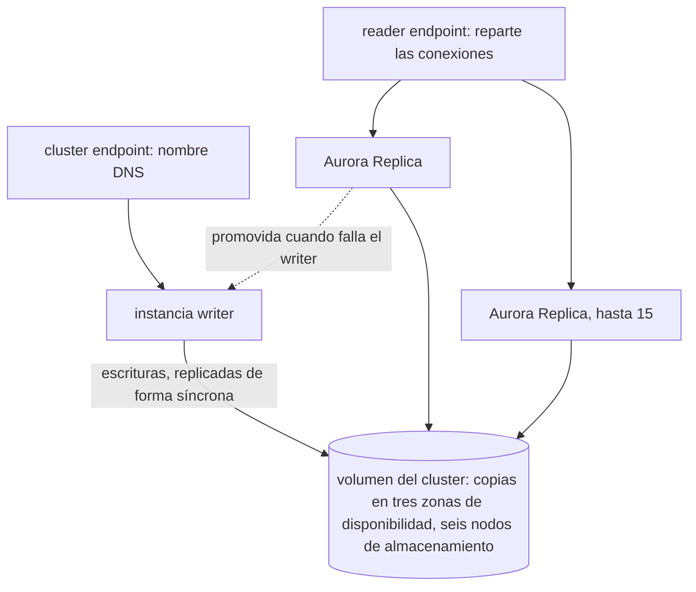

Esta lección no tiene ninguna cuenta de AWS detrás: el curso no crea ningún recurso de AWS ni usa credenciales. Todo lo que dice sobre Aurora viene de la documentación de AWS, consultada el 2026-09-16, y está *por verificar*. Las páginas de AWS no llevan fecha propia, así que la fecha es la de mi lectura. Lo que se puede ejecutar en local, se ejecuta: una conmutación por error vista desde C# y Java, en [`csharp/L12.cs`](https://github.com/spareilleux/learn/blob/eb0303d795a88c25a467391c1f127befe75c98f8/code/postgresql-aurora/csharp/L12.cs) y [`java/…/L12.java`](https://github.com/spareilleux/learn/blob/eb0303d795a88c25a467391c1f127befe75c98f8/code/postgresql-aurora/java/src/main/java/dev/learn/pg/L12.java), cuyas salidas `check.sh` compara con [`expected/l12-failover-cs.txt`](https://github.com/spareilleux/learn/blob/eb0303d795a88c25a467391c1f127befe75c98f8/code/postgresql-aurora/expected/l12-failover-cs.txt) y [`expected/l12-failover-java.txt`](https://github.com/spareilleux/learn/blob/eb0303d795a88c25a467391c1f127befe75c98f8/code/postgresql-aurora/expected/l12-failover-java.txt). El ejercicio está en [`sql/12-exercises.sql`](https://github.com/spareilleux/learn/blob/eb0303d795a88c25a467391c1f127befe75c98f8/code/postgresql-aurora/sql/12-exercises.sql).

Cada una de las lecciones anteriores terminaba con una sección sobre Aurora; esta las reúne y añade lo que dejaron fuera.

| Azure SQL Database | Aurora PostgreSQL |
|---|---|
| servidor lógico, bases de datos | DB cluster: una instancia writer, hasta 15 Aurora Replicas, un volumen de clúster |
| [Hyperscale](https://learn.microsoft.com/azure/azure-sql/database/service-tier-hyperscale): cómputo separado de un almacenamiento distribuido | la misma idea: instancias conectadas a un volumen de almacenamiento repartido en tres zonas de disponibilidad |
| grupos de conmutación por error, un listener de lectura y escritura | el cluster endpoint, que se desplaza al nuevo writer |
| escalado horizontal de lectura, `ApplicationIntent=ReadOnly` | el reader endpoint, o custom endpoints |
| nivel de cómputo serverless | Aurora Serverless, en unidades de capacidad de Aurora (ACU) |
| [replicación geográfica activa](https://learn.microsoft.com/azure/azure-sql/database/active-geo-replication-overview) | Aurora Global Database |
| autenticación de Microsoft Entra | autenticación de base de datos IAM |

## El volumen de clúster

Una instancia de Aurora ejecuta el motor de PostgreSQL, pero no sobre su propio disco. «Aurora data is stored in the cluster volume, which is a single, virtual volume that uses solid state drives (SSDs). A cluster volume consists of copies of the data across three Availability Zones in a single AWS Region» ([almacenamiento de Aurora](https://docs.aws.amazon.com/AmazonRDS/latest/AuroraUserGuide/Aurora.Overview.StorageReliability.html)), y «when data is written to the primary DB instance, Aurora synchronously replicates the data across Availability Zones to six storage nodes associated with your cluster volume» ([alta disponibilidad](https://docs.aws.amazon.com/AmazonRDS/latest/AuroraUserGuide/Concepts.AuroraHighAvailability.html)).

Lo que se deduce para las lecciones anteriores:

- **Réplicas sin replicación que configurar.** «The cluster volume is shared among all instances in your Aurora PostgreSQL DB cluster» ([replicación de Aurora PostgreSQL](https://docs.aws.amazon.com/AmazonRDS/latest/AuroraUserGuide/AuroraPostgreSQL.Replication.html)). El `pg_basebackup`, los slots y el `pg_rewind` de la lección 10 no tienen equivalente que ejecutar: añadir una réplica no copia los datos.
- **El almacenamiento crece solo.** La [página de cuotas](https://docs.aws.amazon.com/AmazonRDS/latest/AuroraUserGuide/CHAP_Limits.html) da un volumen máximo de 256 TiB para Aurora PostgreSQL 17.5, 16.9, 15.13 y posteriores, y de 128 TiB para las versiones anteriores, y un tamaño máximo de tabla de 32 TiB. La tabla de cuotas de la misma página sigue diciendo 128 TiB sin versión, y la [descripción general](https://docs.aws.amazon.com/AmazonRDS/latest/AuroraUserGuide/CHAP_AuroraOverview.html) dice 256 TiB sin ella: la tabla por versión es la precisa.
- **Copias de seguridad sin `archive_command`.** Lección 11: copias continuas en S3, restauraciones en clústeres nuevos.

## Réplicas y conmutación por error

«After you create the primary (writer) instance, you can create up to 15 read-only Aurora Replicas» ([alta disponibilidad](https://docs.aws.amazon.com/AmazonRDS/latest/AuroraUserGuide/Concepts.AuroraHighAvailability.html)). Su retraso «is usually much less than 100 milliseconds after the primary instance has written an update» ([replicación de Aurora](https://docs.aws.amazon.com/AmazonRDS/latest/AuroraUserGuide/Aurora.Replication.html)).

Cuando el writer falla, Aurora promueve una réplica: la del mejor nivel de promoción, donde «priorities range from 0 for the highest priority to 15 for the lowest priority», y entre niveles iguales «the replica that is largest in size». Lo que ve la aplicación: «A failure event results in a brief interruption, during which read and write operations fail with an exception. However, service is typically restored in less than 60 seconds, and often less than 30 seconds.» Sin réplica, hay que crear una instancia nueva, lo que «typically takes less than 10 minutes».

## Endpoints y DNS

La lección 3 presentó los endpoints ([endpoints de Aurora](https://docs.aws.amazon.com/AmazonRDS/latest/AuroraUserGuide/Aurora.Overview.Endpoints.html)):

- El **cluster endpoint** es un nombre DNS que apunta al writer. «The physical IP address pointed to by the cluster endpoint changes when the failover mechanism promotes a new DB instance to be the read/write primary instance for the cluster» ([cluster endpoint](https://docs.aws.amazon.com/AmazonRDS/latest/AuroraUserGuide/Aurora.Endpoints.Cluster.html)).
- El **reader endpoint** «balances connections to available Aurora Replicas in an Aurora DB cluster. It doesn't balance individual queries» ([reader endpoint](https://docs.aws.amazon.com/AmazonRDS/latest/AuroraUserGuide/Aurora.Endpoints.Reader.html)). Un pool que abrió sus conexiones en el reader endpoint se queda en las réplicas a las que llegó.
- Los **custom endpoints** agrupan instancias elegidas, «up to five custom endpoints for each provisioned Aurora cluster or Aurora serverless cluster» ([custom endpoints](https://docs.aws.amazon.com/AmazonRDS/latest/AuroraUserGuide/Aurora.Endpoints.Custom.html)); los **instance endpoints** llegan a una sola instancia.

El cluster, su volumen y sus endpoints, tal como los describe la documentación.



Una conmutación por error cambia un registro DNS, y un cliente que guarda el DNS en caché sigue conectándose al antiguo writer. Las [prácticas recomendadas](https://docs.aws.amazon.com/AmazonRDS/latest/AuroraUserGuide/Aurora.BestPractices.html) de AWS: «If your client application is caching the Domain Name Service (DNS) data of your DB instances, set a time-to-live (TTL) value of less than 30 seconds.» La JVM guarda en caché las respuestas DNS por su cuenta; la [página de conmutación por error rápida para Java](https://docs.aws.amazon.com/AmazonRDS/latest/AuroraUserGuide/AuroraPostgreSQL.BestPractices.FastFailover.html) de AWS fija `networkaddress.cache.ttl` a 1.

## Una conmutación por error desde C# y Java, en local

El cluster endpoint oculta el cambio detrás de un nombre DNS. El otro enfoque de la lección 4 da al driver todas las instancias y le deja encontrar el writer. Eso se puede ejecutar en local: [`ops/12-cluster.sh`](https://github.com/spareilleux/learn/blob/eb0303d795a88c25a467391c1f127befe75c98f8/code/postgresql-aurora/ops/12-cluster.sh) arranca `node1`, un primario en el puerto 5433, y `node2`, su standby en el 5434, dentro del contenedor del curso, como en la lección 10; `server.sh` publica ambos puertos ([líneas 15-35](https://github.com/spareilleux/learn/blob/eb0303d795a88c25a467391c1f127befe75c98f8/code/postgresql-aurora/ops/12-cluster.sh#L15-L35)):

```bash
# La contraseña de postgres es la del servidor del curso; las conexiones por socket Unix dentro del contenedor no la necesitan
echo learn > password
initdb -D node1 --auth-local=trust --auth-host=scram-sha-256 --pwfile=password > /dev/null
rm password
cat >> node1/postgresql.conf <<'EOF'
listen_addresses = '*'
shared_buffers = 32MB
EOF
# Las conexiones desde el host llegan por la red de Docker, no desde 127.0.0.1
echo "host all all all scram-sha-256" >> node1/pg_hba.conf
pg_ctl -D node1 -l node1.log -o "-p 5433" -w start > /dev/null || exit 1
psql -X -q -p 5433 -c 'CREATE DATABASE learn'
psql -X -q -p 5433 -d learn -c 'CREATE TABLE orders (id int GENERATED ALWAYS AS IDENTITY PRIMARY KEY, written_on int NOT NULL DEFAULT inet_server_port())'

pg_basebackup -p 5433 -D node2 -R -X stream -c fast
pg_ctl -D node2 -l node2.log -o "-p 5434" -w start > /dev/null || exit 1
for _ in $(seq 150); do
  [ "$(psql -X -Atq -p 5433 -c "SELECT count(*) FROM pg_stat_replication WHERE state = 'streaming'")" = 1 ] && break
  sleep 0.2
done
echo "node1: primary on port 5433, node2: standby on port 5434"
```

`check.sh` lo vuelve a ejecutar antes de cada programa. El programa C# ([`L12.cs`, líneas 33-93](https://github.com/spareilleux/learn/blob/eb0303d795a88c25a467391c1f127befe75c98f8/code/postgresql-aurora/csharp/L12.cs#L33-L93)):

```csharp
    public static async Task Failover()
    {
        await using var cluster = new NpgsqlDataSourceBuilder(Cluster).BuildMultiHost();
        var writer = cluster.WithTargetSession(TargetSessionAttributes.ReadWrite);
        var standby = cluster.WithTargetSession(TargetSessionAttributes.Standby);
        await using (var connection = await standby.OpenConnectionAsync())
        {
            Console.WriteLine($"standby: {await Describe(connection)}");
        }
        Console.WriteLine($"before: {await Write(writer)}");

        // Una conexión abierta antes de la conmutación por error, y node1 detenido por su propio servidor: pg_ctl -W no espera
        await using var open = await writer.OpenConnectionAsync();
        await using (var admin = await writer.OpenConnectionAsync())
        {
            await using var stop = new NpgsqlCommand("COPY (SELECT) TO PROGRAM '/usr/lib/postgresql/18/bin/pg_ctl -D /tmp/node1 -m fast -W stop'", admin);
            try
            {
                await stop.ExecuteNonQueryAsync();
            }
            catch (NpgsqlException)
            {
                // El apagado puede terminar esta sesión antes de que vuelva COPY
            }
        }
        while (true)
        {
            try
            {
                await using var direct = new NpgsqlConnection(Cluster.Replace("localhost:5433,localhost:5434", "localhost:5433"));
                await direct.OpenAsync();
                await Task.Delay(100);
            }
            catch (NpgsqlException)
            {
                break;
            }
        }
        Console.WriteLine("node1 stopped");
        await using var query = new NpgsqlCommand("SELECT 1", open);
        try
        {
            await query.ExecuteScalarAsync();
        }
        catch (NpgsqlException)
        {
            // La excepción depende de la máquina: una PostgresException 57P01 en Linux en CI, «Exception while reading
            // from stream» a través de Docker Desktop en Windows. El estado de la conexión es el mismo en ambos casos
            Console.WriteLine($"open connection: the query fails, FullState = {open.FullState}");
        }
        Console.WriteLine($"no primary: {await Write(writer)}");

        // La promoción, que Aurora hace por sí misma: node2 deja de reproducir WAL y acepta escrituras
        await using (var connection = await standby.OpenConnectionAsync())
        {
            await using var promote = new NpgsqlCommand("SELECT pg_promote()", connection);
            Console.WriteLine($"pg_promote() on node2: {await promote.ExecuteScalarAsync()}");
        }
        // La misma fuente de datos, con la misma lista de hosts, encuentra ahora su writer en node2
        Console.WriteLine($"after: {await Write(writer)}");
    }
```

```text
standby: port 5434, pg_is_in_recovery() = True
before: order written on port 5433
node1 stopped
open connection: the query fails, FullState = Broken
no primary: NpgsqlException: No suitable host was found.
pg_promote() on node2: True
after: order written on port 5434
```

El programa Java hace lo mismo con el `targetServerType` de pgjdbc ([`L12.java`, líneas 31-75](https://github.com/spareilleux/learn/blob/eb0303d795a88c25a467391c1f127befe75c98f8/code/postgresql-aurora/java/src/main/java/dev/learn/pg/L12.java#L31-L75)):

```java
    static void failover() throws Exception {
        String primary = CLUSTER + "&targetServerType=primary";
        String secondary = CLUSTER + "&targetServerType=secondary";
        try (Connection connection = DriverManager.getConnection(secondary);
             Statement statement = connection.createStatement();
             ResultSet rs = statement.executeQuery("SELECT inet_server_port(), pg_is_in_recovery()")) {
            rs.next();
            System.out.println("secondary: port " + rs.getInt(1) + ", pg_is_in_recovery() = " + rs.getBoolean(2));
        }
        System.out.println("before: " + write(primary));

        // Una conexión abierta antes de la conmutación por error, y node1 detenido por su propio servidor: pg_ctl -W no espera
        try (Connection open = DriverManager.getConnection(primary)) {
            try (Connection admin = DriverManager.getConnection(primary); Statement statement = admin.createStatement()) {
                statement.execute("COPY (SELECT) TO PROGRAM '/usr/lib/postgresql/18/bin/pg_ctl -D /tmp/node1 -m fast -W stop'");
            } catch (SQLException e) {
                // El apagado puede terminar esta sesión antes de que vuelva COPY
            }
            String node1 = CLUSTER.replace("localhost:5433,localhost:5434", "localhost:5433");
            while (true) {
                try (Connection direct = DriverManager.getConnection(node1)) {
                    Thread.sleep(100);
                } catch (SQLException e) {
                    break;
                }
            }
            System.out.println("node1 stopped");
            try (Statement statement = open.createStatement()) {
                statement.execute("SELECT 1");
            } catch (SQLException e) {
                System.out.println("open connection: " + e.getSQLState() + ": " + e.getMessage());
            }
        }
        System.out.println("no primary: " + write(primary));

        // La promoción, que Aurora hace por sí misma: node2 deja de reproducir WAL y acepta escrituras
        try (Connection connection = DriverManager.getConnection(secondary);
             Statement statement = connection.createStatement();
             ResultSet rs = statement.executeQuery("SELECT pg_promote()")) {
            rs.next();
            System.out.println("pg_promote() on node2: " + rs.getBoolean(1));
        }
        // La misma URL encuentra ahora su primario en node2
        System.out.println("after: " + write(primary));
    }
```

```text
secondary: port 5434, pg_is_in_recovery() = true
before: order written on port 5433
node1 stopped
open connection: 57P01: FATAL: terminating connection due to administrator command
no primary: 08001: Could not find a server with specified targetServerType: primary
pg_promote() on node2: true
after: order written on port 5434
```

- **El fallo.** El programa detiene `node1` desde dentro: [`COPY … TO PROGRAM`](https://www.postgresql.org/docs/18/sql-copy.html) ejecuta `pg_ctl` en el servidor, como el superusuario `postgres`, y `-W` vuelve sin esperar. Hace las veces del fallo de instancia que Aurora detecta.
- **La conexión abierta se rompe.** pgjdbc recibe el `57P01` del servidor, «terminating connection due to administrator command». La excepción de Npgsql depende de la máquina: la misma `PostgresException` con `57P01` en Linux en la CI, solo «Exception while reading from stream» en Windows a través de Docker Desktop, donde el socket se cerró antes de que se leyera el mensaje; por eso el programa C# imprime el `FullState` de la conexión, `Broken` en ambos casos. En ambos casos, la transacción en curso en esa conexión se pierde, como dice el «read and write operations fail with an exception» de AWS.
- **Sin writer durante un momento.** Entre el fallo y la promoción, [Npgsql](https://www.npgsql.org/doc/failover-and-load-balancing.html) responde «No suitable host» y pgjdbc «Could not find a server with specified targetServerType: primary». El standby sigue respondiendo, en solo lectura.
- **La promoción.** En Aurora, la hace AWS. Aquí, el programa llama a `pg_promote()` en `node2`, a través de una conexión `Standby` o `secondary`.
- **La misma cadena de conexión encuentra el nuevo writer.** Ninguno de los dos programas cambia su lista de hosts: cada driver comprueba qué host acepta escrituras, y ahora es `node2`. Ambos drivers guardan en caché el estado de los hosts, 10 segundos por defecto (`Host Recheck Seconds` en Npgsql, [`hostRecheckSeconds`](https://jdbc.postgresql.org/documentation/use/) en pgjdbc); la escritura justo después de la promoción encontró de todos modos `node2`. Cómo trata cada driver un host que recuerda como standby cuando no conoce ningún primario está *por verificar* en su código fuente.

Lo que esto no reproduce: en Aurora, los nombres de host de las instancias no cambian, pero la aplicación normalmente solo conoce los endpoints. Los drivers de AWS siguen en cambio la topología del clúster. «The AWS drivers rely on monitoring DB cluster status and being aware of the cluster topology to determine the new writer. This approach reduces switchover and failover times to single-digit seconds, compared to tens of seconds for open-source drivers» ([drivers de AWS](https://docs.aws.amazon.com/AmazonRDS/latest/AuroraUserGuide/IAMDBAuth.Connecting.Drivers.html)):

- En Java, el [AWS Advanced JDBC Wrapper](https://github.com/aws/aws-advanced-jdbc-wrapper/blob/4.4.0/README.md), 4.4.0 publicado el 2026-08-20, envuelve pgjdbc; su [failover plugin v2](https://github.com/aws/aws-advanced-jdbc-wrapper/blob/4.4.0/docs/using-the-jdbc-driver/using-plugins/UsingTheFailover2Plugin.md) vigila la topología desde un hilo aparte.
- En .NET, el [AWS Advanced .NET Data Provider Wrapper](https://github.com/aws/aws-advanced-dotnet-data-provider-wrapper/blob/2.2.0/README.md), 2.2.0 publicado el 2026-08-05, «does not connect directly to any database, but enables support of AWS and Aurora functionalities on top of an underlying .NET driver», con un paquete para Npgsql. La lista de drivers de AWS de la guía del usuario de Aurora todavía no lo menciona.

## Aurora Serverless

Una instancia de Aurora Serverless cambia de tamaño mientras se ejecuta. Su unidad es la ACU: «Each ACU is a combination of approximately 2 gibibytes (GiB) of memory, corresponding CPU, and networking. […] Aurora serverless offers capacity from 0 ACUs to 256 ACUs» ([cómo funciona](https://docs.aws.amazon.com/AmazonRDS/latest/AuroraUserGuide/aurora-serverless-v2.how-it-works.html)), «in increments of 0.5 ACU» ([requisitos](https://docs.aws.amazon.com/AmazonRDS/latest/AuroraUserGuide/aurora-serverless-v2.requirements.html)). La guía de AWS la llama ahora «Aurora serverless»; las URL de las páginas siguen diciendo `serverless-v2`, y «Aurora Serverless v1» es el producto obsoleto.

- **Hasta cero.** Una instancia con un mínimo de 0 ACU se pausa «if they don't have any connections initiated by user activity within a specified time period», desde Aurora PostgreSQL 16.3, 15.7, 14.12 o 13.15 ([pausa automática](https://docs.aws.amazon.com/AmazonRDS/latest/AuroraUserGuide/aurora-serverless-v2-auto-pause.html)). Si las conexiones inactivas del pool de una aplicación impiden que una instancia se pause está *por verificar*.
- **Clústeres mixtos.** «You can set up a cluster that contains both Aurora serverless and provisioned capacity, called a mixed-configuration cluster»: un writer aprovisionado con readers serverless, por ejemplo.
- **Versiones.** La tabla de capacidades enumera versiones hasta la 16 «and higher». Que las versiones de PostgreSQL 18 tengan el rango de 0 a 256 ACU está *por verificar*.

## Global Database

«An Aurora global database has a primary DB cluster in one Region, and up to 10 secondary DB clusters in different Regions», replicados «with latency typically under a second», y «Aurora uses the cluster storage volume and not the database engine for fast, low-overhead replication» ([Global Database](https://docs.aws.amazon.com/AmazonRDS/latest/AuroraUserGuide/aurora-global-database.html)).

- **El switchover** es planificado: «Because this feature synchronizes secondary DB clusters with the primary before making any other changes, RPO is 0 (no data loss)». **El failover** es para una caída regional, y «the RPO for this approach is typically a non-zero value measured in seconds» ([recuperación ante desastres](https://docs.aws.amazon.com/AmazonRDS/latest/AuroraUserGuide/aurora-global-database-disaster-recovery.html)): el commit perdido de la lección 10, entre regiones. El parámetro `rds.global_db_rpo` le fija un límite superior, «but doing so might affect transaction processing on the primary».
- **Reenvío de escrituras.** Un clúster secundario puede reenviar escrituras al primario: «In Aurora PostgreSQL version 16 and higher major versions, global write forwarding is supported in all minor versions» ([reenvío de escrituras](https://docs.aws.amazon.com/AmazonRDS/latest/AuroraUserGuide/aurora-global-database-write-forwarding-apg.html)).

## RDS Proxy

La lección 4 trató el uso compartido de conexiones de [RDS Proxy](https://docs.aws.amazon.com/AmazonRDS/latest/AuroraUserGuide/rds-proxy.html) y las instrucciones que fijan una sesión. En cuanto a la disponibilidad, AWS añade que «bypasses Domain Name System (DNS) caches to reduce failover times by up to 66% for Aurora Multi-AZ databases» ([planificación](https://docs.aws.amazon.com/AmazonRDS/latest/AuroraUserGuide/rds-proxy-planning.html)). Dos límites de la misma página importan a los clientes PostgreSQL:

- «RDS Proxy doesn't currently support canceling a query from a client by issuing a CancelRequest»: `NpgsqlCommand.Cancel()` de Npgsql y `Statement.cancel()` de pgjdbc envían una.
- «Any statement with a text size greater than 16 KB causes the proxy to pin the session to the current connection.»

La [tabla de versiones de RDS Proxy](https://docs.aws.amazon.com/AmazonRDS/latest/AuroraUserGuide/Concepts.Aurora_Fea_Regions_DB-eng.Feature.RDS_Proxy.html) da Aurora PostgreSQL 18.3 y posteriores.

## Autenticación de base de datos IAM

La lección 4 mostró cómo renuevan los drivers un token. El resto, de la [autenticación de base de datos IAM](https://docs.aws.amazon.com/AmazonRDS/latest/AuroraUserGuide/UsingWithRDS.IAMDBAuth.html):

- El usuario de la base de datos necesita un rol: `GRANT rds_iam TO db_userx`, y entonces «IAM authentication takes precedence over password authentication, so the user must log in as an IAM user» ([crear una cuenta de base de datos](https://docs.aws.amazon.com/AmazonRDS/latest/AuroraUserGuide/UsingWithRDS.IAMDBAuth.DBAccounts.html)).
- La política IAM permite la acción `rds-db:connect` sobre un recurso que nombra el clúster y el usuario de la base de datos ([política IAM](https://docs.aws.amazon.com/AmazonRDS/latest/AuroraUserGuide/UsingWithRDS.IAMDBAuth.IAMPolicy.html)).
- Las comprobaciones de tokens le cuestan al servidor: «You must have between 300 and 1000 MiB extra memory on your database for reliable connectivity.»
- El ejemplo de `psql` de AWS se conecta con `sslmode=verify-full`.

## Configuraciones de almacenamiento, dimensionamiento y Limitless

- **Standard o I/O-Optimized.** Con Aurora Standard, «you also pay a standard rate per 1 million requests for I/O operations»; con I/O-Optimized, «you pay only for the usage and storage of your DB clusters, with no additional charges for read and write I/O operations». La regla de AWS: «Aurora I/O-Optimized is the best choice when your I/O spending is 25% or more of your total Aurora database spending», y un clúster puede pasarse a él «once every 30 days» ([almacenamiento](https://docs.aws.amazon.com/AmazonRDS/latest/AuroraUserGuide/Aurora.Overview.StorageReliability.html)). La lección 13 vuelve sobre los costes.
- **max_connections** sigue a la memoria de la instancia: `LEAST({DBInstanceClassMemory/9531392},5000)` ([rendimiento y escalado](https://docs.aws.amazon.com/AmazonRDS/latest/AuroraUserGuide/AuroraPostgreSQL.Managing.html)). `DBInstanceClassMemory` parte de la memoria de la clase de instancia, y después «subtracts memory reserved for the operating system and the RDS processes that manage the instance» ([fórmulas de parámetros](https://docs.aws.amazon.com/AmazonRDS/latest/AuroraUserGuide/USER_ParamValuesRef.html)). El ejercicio lo calcula.
- **Limitless Database** reparte tablas en shards entre instancias «to process millions of write transactions per second» ([Limitless](https://docs.aws.amazon.com/AmazonRDS/latest/AuroraUserGuide/limitless.html)). Ejecuta versiones especiales, «16.X-limitless», y «supports only the Aurora I/O-Optimized DB cluster storage configuration» ([requisitos](https://docs.aws.amazon.com/AmazonRDS/latest/AuroraUserGuide/limitless-reqs-limits.html)); el calendario de versiones no tiene ninguna versión Limitless 17 ni 18.

## Versiones y soporte

El [calendario de versiones de Aurora PostgreSQL](https://docs.aws.amazon.com/AmazonRDS/latest/AuroraPostgreSQLReleaseNotes/aurorapostgresql-release-calendar.html):

| Versión mayor | Primera versión de Aurora | Fin del soporte estándar |
|---|---|---|
| 13 | | 28 de febrero de 2026, y después Extended Support hasta el 28 de febrero de 2029 |
| 14 | | 28 de febrero de 2027, y después Extended Support hasta el 28 de febrero de 2030 |
| 17 | | 28 de febrero de 2030 |
| 18 | 11 de junio de 2026, con 18.3 | 28 de febrero de 2031 |

- **Las versiones menores** tienen sus propias fechas de fin: 18.3 hasta el 30 de noviembre de 2027, y 18.4, publicada el 21 de agosto de 2026, hasta el 31 de diciembre de 2027.
- **Extended Support** «allows you to continue running a database on a major engine version past the Aurora end of standard support date for an additional cost» ([Extended Support](https://docs.aws.amazon.com/AmazonRDS/latest/AuroraUserGuide/extended-support.html)). Aurora PostgreSQL 13 está en él desde el 1 de marzo de 2026.
- **Una fecha que no copiar.** La tabla de versiones mayores del calendario da a PostgreSQL 18 una «community release date» del 26 de febrero de 2026. PostgreSQL 18.0 se publicó el 25 de septiembre de 2025, según sus [notas de versión](https://www.postgresql.org/docs/18/release-18.html); el 26 de febrero de 2026 es la fecha que la tabla de versiones menores da para 18.3.
- **Las funcionalidades llegan después.** PostgreSQL 18 tiene una columna en la tabla de RDS Proxy, pero todavía no en las tablas de blue/green ni de zero-ETL ([lección 11](../11-backup/#en-aurora), [lección 10](../10-replication/#en-aurora)).

## Puntos clave

- Las instancias de Aurora comparten un volumen de clúster, seis copias en tres zonas de disponibilidad: no hay replicación que configurar entre instancias.
- Una conmutación por error tarda normalmente menos de 60 segundos, y las transacciones en curso fallan: las aplicaciones reintentan.
- El cluster endpoint sigue al writer a través del DNS: mantén las cachés DNS por debajo de 30 segundos, o usa un driver que siga la topología.
- Una cadena de conexión con varios hosts encuentra sola el nuevo writer, como mostró la conmutación por error local con Npgsql y pgjdbc.
- Serverless escala en pasos de 0,5 ACU, hasta cero con la pausa automática; Global Database copia a otras regiones en un segundo aproximadamente, con un RPO de segundos en un failover.
- RDS Proxy acorta las conmutaciones por error pero no reenvía las solicitudes de cancelación; los tokens IAM necesitan memoria adicional en el servidor.
- Consulta la tabla de versiones de una funcionalidad antes de suponer que admite Aurora PostgreSQL 18.

## Ejercicios

1. Calcula el `max_connections` por defecto de Aurora para instancias con 2, 4, 16, 32 y 64 GiB de memoria, como si `DBInstanceClassMemory` fuera toda la memoria. ¿A partir de qué tamaño se aplica el tope de 5000?

<details>
<summary>Solución</summary>

[`sql/12-exercises.sql`](https://github.com/spareilleux/learn/blob/eb0303d795a88c25a467391c1f127befe75c98f8/code/postgresql-aurora/sql/12-exercises.sql):

```sql
-- Lección 12, ejercicio 1: el max_connections por defecto de Aurora, LEAST({DBInstanceClassMemory/9531392}, 5000), para algunos tamaños
-- de memoria. DBInstanceClassMemory es algo menor que la memoria de la clase de instancia: son límites superiores.
SELECT memory_gib, least(memory_gib::bigint * 1024 * 1024 * 1024 / 9531392, 5000) AS max_connections
FROM unnest(ARRAY[2, 4, 16, 32, 64]) AS memory_gib
ORDER BY memory_gib;
```

```text
 memory_gib | max_connections
------------+-----------------
          2 |             225
          4 |             450
         16 |            1802
         32 |            3604
         64 |            5000
(5 rows)
```

La división es una división entera de bytes: unas 112,7 conexiones por GiB. El tope se aplica a partir de 5000 × 9 531 392 bytes, unos 44,4 GiB de `DBInstanceClassMemory`, así que un poco más de memoria en la instancia. Un pool de 50 conexiones en cada una de 40 instancias de la aplicación necesita 2000: una instancia de 16 GiB se queda pequeña, por rápida que sea su CPU.

</details>

2. Una aplicación escribe a través del cluster endpoint y después, en la misma petición, vuelve a leer la fila a través del reader endpoint, y a veces no la encuentra. ¿Por qué, y cuáles son dos soluciones?

<details>
<summary>Solución</summary>

Las Aurora Replicas son asíncronas: su retraso es «usually much less than 100 milliseconds», no cero. La lectura llegó a una réplica que aún no había aplicado la escritura: el standby de la lección 10, al que el script tenía que esperar antes de leer.

- Lee tus propias escrituras en el writer: la misma conexión, o el cluster endpoint, para las lecturas que siguen a una escritura.
- Envía al reader endpoint solo lo que tolera datos ligeramente desfasados: informes, búsquedas, listados.

Esperar en la réplica a una posición, como hacía `until_true` en la lección 10, no es algo que una aplicación deba hacer en cada petición.

</details>

3. Durante la conmutación por error local, ¿por qué la conexión abierta antes del fallo no se recuperó sola, mientras que el siguiente `OpenConnectionAsync()` o `getConnection` encontró `node2`?

<details>
<summary>Solución</summary>

Una conexión es una sesión en un proceso servidor: cuando `node1` se detuvo, ese proceso terminó, con su transacción. Nada puede trasladar una sesión a otro servidor, tampoco en Aurora, donde AWS escribe que «read and write operations fail with an exception». Abrir una conexión *nueva* vuelve a ejecutar la selección de host del driver, que comprueba el rol de cada host: `node2` había sido promovido. Una aplicación sobrevive a una conmutación por error capturando el error y reintentando la transacción completa en una conexión nueva, como hacía con `40001` el bucle de reintentos de la lección 6.

</details>

## Fuentes

- AWS, todas consultadas el 2026-09-16: [almacenamiento de Aurora](https://docs.aws.amazon.com/AmazonRDS/latest/AuroraUserGuide/Aurora.Overview.StorageReliability.html), [alta disponibilidad](https://docs.aws.amazon.com/AmazonRDS/latest/AuroraUserGuide/Concepts.AuroraHighAvailability.html), [descripción general](https://docs.aws.amazon.com/AmazonRDS/latest/AuroraUserGuide/CHAP_AuroraOverview.html), [cuotas y límites](https://docs.aws.amazon.com/AmazonRDS/latest/AuroraUserGuide/CHAP_Limits.html), [replicación de Aurora](https://docs.aws.amazon.com/AmazonRDS/latest/AuroraUserGuide/Aurora.Replication.html), [replicación de Aurora PostgreSQL](https://docs.aws.amazon.com/AmazonRDS/latest/AuroraUserGuide/AuroraPostgreSQL.Replication.html), [endpoints](https://docs.aws.amazon.com/AmazonRDS/latest/AuroraUserGuide/Aurora.Overview.Endpoints.html), [cluster endpoint](https://docs.aws.amazon.com/AmazonRDS/latest/AuroraUserGuide/Aurora.Endpoints.Cluster.html), [reader endpoint](https://docs.aws.amazon.com/AmazonRDS/latest/AuroraUserGuide/Aurora.Endpoints.Reader.html), [custom endpoints](https://docs.aws.amazon.com/AmazonRDS/latest/AuroraUserGuide/Aurora.Endpoints.Custom.html), [prácticas recomendadas](https://docs.aws.amazon.com/AmazonRDS/latest/AuroraUserGuide/Aurora.BestPractices.html), [conmutación por error rápida con Java](https://docs.aws.amazon.com/AmazonRDS/latest/AuroraUserGuide/AuroraPostgreSQL.BestPractices.FastFailover.html), [drivers de AWS](https://docs.aws.amazon.com/AmazonRDS/latest/AuroraUserGuide/IAMDBAuth.Connecting.Drivers.html), [Serverless: cómo funciona](https://docs.aws.amazon.com/AmazonRDS/latest/AuroraUserGuide/aurora-serverless-v2.how-it-works.html), [requisitos](https://docs.aws.amazon.com/AmazonRDS/latest/AuroraUserGuide/aurora-serverless-v2.requirements.html), [pausa automática](https://docs.aws.amazon.com/AmazonRDS/latest/AuroraUserGuide/aurora-serverless-v2-auto-pause.html), [Global Database](https://docs.aws.amazon.com/AmazonRDS/latest/AuroraUserGuide/aurora-global-database.html), [su recuperación ante desastres](https://docs.aws.amazon.com/AmazonRDS/latest/AuroraUserGuide/aurora-global-database-disaster-recovery.html), [reenvío de escrituras](https://docs.aws.amazon.com/AmazonRDS/latest/AuroraUserGuide/aurora-global-database-write-forwarding-apg.html), [RDS Proxy](https://docs.aws.amazon.com/AmazonRDS/latest/AuroraUserGuide/rds-proxy.html), [su planificación](https://docs.aws.amazon.com/AmazonRDS/latest/AuroraUserGuide/rds-proxy-planning.html) y [versiones](https://docs.aws.amazon.com/AmazonRDS/latest/AuroraUserGuide/Concepts.Aurora_Fea_Regions_DB-eng.Feature.RDS_Proxy.html), [autenticación de base de datos IAM](https://docs.aws.amazon.com/AmazonRDS/latest/AuroraUserGuide/UsingWithRDS.IAMDBAuth.html), [cuentas de base de datos](https://docs.aws.amazon.com/AmazonRDS/latest/AuroraUserGuide/UsingWithRDS.IAMDBAuth.DBAccounts.html), [política IAM](https://docs.aws.amazon.com/AmazonRDS/latest/AuroraUserGuide/UsingWithRDS.IAMDBAuth.IAMPolicy.html), [rendimiento y escalado](https://docs.aws.amazon.com/AmazonRDS/latest/AuroraUserGuide/AuroraPostgreSQL.Managing.html), [fórmulas de parámetros](https://docs.aws.amazon.com/AmazonRDS/latest/AuroraUserGuide/USER_ParamValuesRef.html), [Limitless Database](https://docs.aws.amazon.com/AmazonRDS/latest/AuroraUserGuide/limitless.html), [sus requisitos](https://docs.aws.amazon.com/AmazonRDS/latest/AuroraUserGuide/limitless-reqs-limits.html), [calendario de versiones](https://docs.aws.amazon.com/AmazonRDS/latest/AuroraPostgreSQLReleaseNotes/aurorapostgresql-release-calendar.html), [Extended Support](https://docs.aws.amazon.com/AmazonRDS/latest/AuroraUserGuide/extended-support.html)
- Drivers de AWS en GitHub: [AWS Advanced JDBC Wrapper 4.4.0](https://github.com/aws/aws-advanced-jdbc-wrapper/blob/4.4.0/README.md), [failover plugin v2](https://github.com/aws/aws-advanced-jdbc-wrapper/blob/4.4.0/docs/using-the-jdbc-driver/using-plugins/UsingTheFailover2Plugin.md), [AWS Advanced .NET Data Provider Wrapper 2.2.0](https://github.com/aws/aws-advanced-dotnet-data-provider-wrapper/blob/2.2.0/README.md)
- Npgsql: [conmutación por error y balanceo de carga](https://www.npgsql.org/doc/failover-and-load-balancing.html); pgjdbc: [parámetros de conexión](https://jdbc.postgresql.org/documentation/use/)
- PostgreSQL 18: [`COPY`](https://www.postgresql.org/docs/18/sql-copy.html), [notas de versión](https://www.postgresql.org/docs/18/release-18.html)
- Microsoft: [Hyperscale](https://learn.microsoft.com/azure/azure-sql/database/service-tier-hyperscale), [replicación geográfica activa](https://learn.microsoft.com/azure/azure-sql/database/active-geo-replication-overview)
