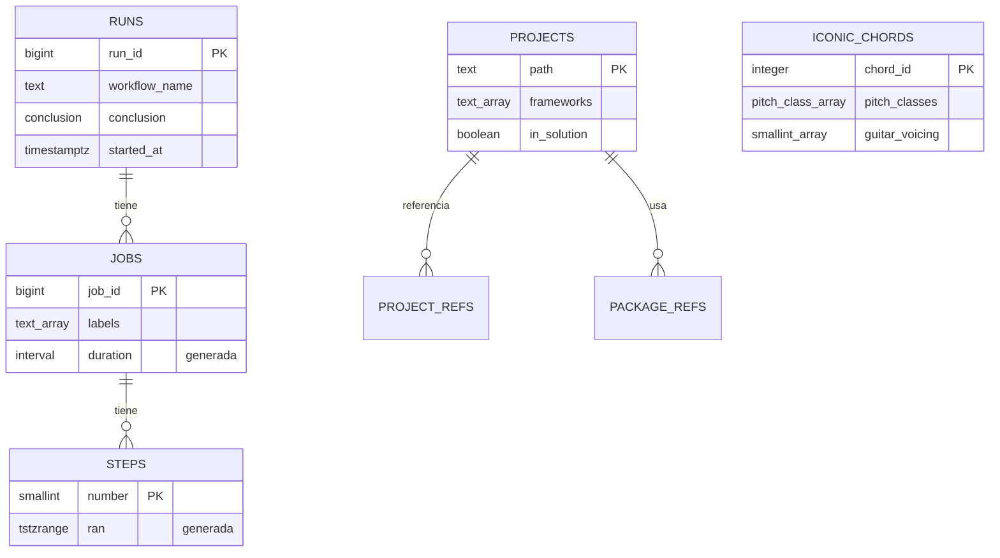

:::note[Versiones estudiadas]
[PostgreSQL](https://www.postgresql.org/docs/18/) **18.6**, la versión menor actual de la versión mayor más reciente a 2026-09-15 según la [página de la política de versiones](https://www.postgresql.org/support/versioning/) (PostgreSQL 18 tiene soporte hasta noviembre de 2030), en la imagen Docker oficial [`postgres:18.6-trixie`](https://hub.docker.com/_/postgres), digest `sha256:4ef4dbc939d61acea57712655ddb4b4ab27419c913f94cca0cd57cb3ea3c2280`. Los scripts de [pgvector](https://github.com/pgvector/pgvector) de la lección 8 se ejecutan sobre [`pgvector/pgvector:0.8.6-pg18-trixie`](https://hub.docker.com/r/pgvector/pgvector), el mismo PostgreSQL 18.6 con pgvector **0.8.6**, digest `sha256:78bf48b801e792f99e3ac62b5036fd3876e9be48afda16c1e331af1c75ceb2ff`. Los clientes son [Npgsql](https://www.npgsql.org/) **10.0.3** y su [proveedor EF Core](https://www.npgsql.org/efcore/) **10.0.3** en .NET 10, y el [driver JDBC de PostgreSQL](https://jdbc.postgresql.org/) **42.7.13** con [HikariCP](https://github.com/brettwooldridge/HikariCP) **7.1.0** en Java 25. En AWS, la versión más reciente que figura en las [notas de versión de Aurora PostgreSQL](https://docs.aws.amazon.com/AmazonRDS/latest/AuroraPostgreSQLReleaseNotes/AuroraPostgreSQL.Updates.html) ese mismo día es **Aurora PostgreSQL 18.4.1** (21 de agosto de 2026), compatible con PostgreSQL 18.4.

Cada ejemplo está en [`code/postgresql-aurora`](https://github.com/spareilleux/learn/tree/main/code/postgresql-aurora): [`check.sh`](https://github.com/spareilleux/learn/blob/main/code/postgresql-aurora/check.sh) ejecuta cada script SQL con `psql` y cada programa C# y Java contra una base nueva, y compara su salida con los archivos de [`expected`](https://github.com/spareilleux/learn/tree/main/code/postgresql-aurora/expected). La CI compila los programas en Windows, Linux y macOS, y lo ejecuta todo contra PostgreSQL solo en Linux, porque los runners de Windows y macOS de GitHub no tienen Docker.
:::

## Por qué estoy aprendiendo esto

He pasado años con SQL Server: T-SQL, SSMS, planes de ejecución, columnas `IDENTITY`, migraciones de Entity Framework. Cada vez más proyectos que encuentro empiezan en PostgreSQL, a menudo en un servicio gestionado como Amazon Aurora, y me di cuenta de que escribía SQL Server con la sintaxis de PostgreSQL. Funciona, hasta que un nombre de columna tiene una mayúscula, un `DateTime` vuelve con tres horas de diferencia, o un pool de cien conexiones se encuentra con un servidor que permite cien.

Quiero conocer PostgreSQL tal como es: sus tipos, su SQL, cómo ejecuta las transacciones y usa los índices, cómo replica y cómo se hace su copia de seguridad. Después quiero saber qué cambia Aurora: qué gestiona AWS por mí, qué pierdo y cuánto cuesta.

## A quién va dirigido este curso

Eres desarrollador C# o Java. Conoces el SQL de [SQL Server](https://learn.microsoft.com/sql/sql-server/) o de otra base de datos: joins, agrupaciones, índices, transacciones. Ya has ejecutado un contenedor. No necesitas conocer PostgreSQL. El lado Java supone el nivel de [Java para desarrolladores C#](../java-for-csharp/); la lección 4 remite las preguntas de Spring Data a [Spring Boot, Spring Cloud y Reactor para desarrolladores C#](../spring-cloud-reactor/), y la lección 1 remite las preguntas de contenedores a [Contenedores WSL](../wsl-containers/). El [curso de DuckDB](../duckdb/) consulta los mismos datos de CI con un motor analítico: es una buena comparación, no un requisito previo.

## SQL Server, PostgreSQL y Aurora en una tabla

| | SQL Server | PostgreSQL | Aurora PostgreSQL |
|---|---|---|---|
| Licencia | comercial (ediciones Express y Developer gratuitas) | [PostgreSQL License](https://www.postgresql.org/about/licence/), código abierto | un servicio gestionado de AWS, facturado por instancia o unidad de capacidad, almacenamiento y E/S |
| Servidor | un proceso, hilos | un proceso por conexión | el motor de PostgreSQL sobre el almacenamiento distribuido de AWS |
| Nivel superior | instancia → bases de datos → esquemas | clúster → bases de datos → esquemas | DB cluster: un writer, readers, un volumen de almacenamiento compartido |
| Cuenta de administración | `sa`, `sysadmin` | `postgres`, un superusuario | un miembro de `rds_superuser`, nunca un superusuario real |
| Herramienta cliente | `sqlcmd`, SSMS | `psql`, pgAdmin | `psql` y la consola de AWS |
| Desde .NET | `Microsoft.Data.SqlClient` | Npgsql | Npgsql |
| Desde Java | driver JDBC de Microsoft | driver JDBC de PostgreSQL | driver JDBC de PostgreSQL, o el AWS Advanced JDBC Wrapper |

## Los datos

El curso reutiliza datos que este sitio ya publica, en lugar de una tienda o una biblioteca inventada:

- **El historial de CI de este sitio**, la misma instantánea que el [curso de DuckDB](../duckdb/): 125 ejecuciones de GitHub Actions, sus 315 jobs y 2204 pasos, exportados el 2026-09-14 en [`code/duckdb/data`](https://github.com/spareilleux/learn/tree/main/code/duckdb/data).
- **Los proyectos .NET de [Guitar Alchemist](https://github.com/GuitarAlchemist/ga)**, tal como los extrajo el [curso de LadybugDB](../ladybugdb/) en el commit `a26a7893`: 111 proyectos, sus referencias entre proyectos y sus 478 referencias de paquetes, en [`code/ladybugdb/data/ga`](https://github.com/spareilleux/learn/tree/main/code/ladybugdb/data/ga).
- **Los acordes icónicos de Guitar Alchemist**, los 17 acordes de [`IconicChords.yaml`](https://github.com/GuitarAlchemist/ga/blob/32f143c/Common/GA.Business.Config/IconicChords.yaml) en el commit `32f143c`, convertidos a JSON por [`extract_chords.py`](https://github.com/spareilleux/learn/blob/main/code/postgresql-aurora/data/extract_chords.py).

La lección 2 construye el modelo que cada lección posterior carga desde [`sql/schema.sql`](https://github.com/spareilleux/learn/blob/main/code/postgresql-aurora/sql/schema.sql):

El esquema `ci` contiene las tres primeras tablas, el esquema `ga` las demás.

## Al final de este curso, sabré

- ejecutar PostgreSQL en un contenedor y trabajar en `psql`, con bases de datos, esquemas, roles y privilegios;
- elegir los tipos de PostgreSQL a propósito: `text`, `numeric`, `timestamptz`, `uuid`, `jsonb`, arrays y rangos, con restricciones, dominios y columnas generadas;
- escribir el SQL que PostgreSQL hace mejor que T-SQL: CTE recursivas, funciones de ventana, `LATERAL`, `DISTINCT ON`, `RETURNING`, upserts y `MERGE`;
- usar PostgreSQL desde C# con Npgsql y EF Core, y desde Java con JDBC y HikariCP, incluidos los pools, las sentencias preparadas y `COPY`;
- leer un plan de consulta y elegir el índice adecuado: B-tree, GIN, GiST, BRIN, índices parciales y de expresión;
- explicar MVCC, los niveles de aislamiento, los bloqueos y `VACUUM`, y reproducir un deadlock;
- guardar y buscar JSON y texto, y escribir funciones, triggers y extensiones;
- particionar tablas grandes, replicarlas, hacer copias de seguridad, restaurarlas y actualizarlas;
- ejecutar la misma base de datos en Amazon Aurora PostgreSQL, sabiendo qué difiere, y estimar cuánto cuesta, incluida una migración desde SQL Server.

## Plan

| # | Lección | Si conoces SQL Server |
|---|---|---|
| 1 | [Primeros pasos: un contenedor, `psql`, bases de datos, esquemas y roles](01-getting-started/) | `sqlcmd`, logins y usuarios, `dbo`, `TOP`, `IDENTITY` |
| 2 | [Tipos y modelado](02-types/) | `datetimeoffset`, `nvarchar`, columnas calculadas, índices únicos y `NULL` |
| 3 | [Consultas: CTE, ventanas, `LATERAL`, upserts y `MERGE`](03-queries/) | `CROSS APPLY`, `OUTPUT inserted.*`, `MERGE` |
| 4 | [PostgreSQL desde C# y Java](04-csharp-java/) | pool de `SqlConnection`, `SqlBulkCopy`, proveedores de EF Core |
| 5 | [Índices y planes: B-tree, GIN, BRIN, `EXPLAIN (ANALYZE, BUFFERS)`](05-indexes/) | planes de ejecución, columnas incluidas, índices filtrados |
| 6 | [Transacciones y MVCC: niveles de aislamiento, bloqueos, `VACUUM`, bloat, deadlocks](06-transactions/) | `READ_COMMITTED_SNAPSHOT`, el version store |
| 7 | [JSON y búsqueda: operadores e índices `jsonb`, búsqueda de texto completo, `pg_trgm`](07-json-search/) | `OPENJSON`, catálogos de texto completo |
| 8 | [Funciones y extensiones: PL/pgSQL, triggers, `pgvector`](08-functions/) | procedimientos T-SQL, CLR |
| 9 | Particionado y tablas grandes *(la siguiente)* | funciones y esquemas de partición |
| 10 | Replicación y alta disponibilidad: WAL, replicación física y lógica | grupos de disponibilidad Always On, trasvase de registros |
| 11 | Copia de seguridad, restauración y actualizaciones: `pg_dump`, recuperación a un momento dado, `pg_upgrade` | `BACKUP`, `RESTORE`, actualizaciones en el sitio |
| 12 | Amazon Aurora PostgreSQL: almacenamiento, réplicas, endpoints, Serverless v2, Global Database, RDS Proxy, autenticación IAM, Performance Insights | Azure SQL Database, Hyperscale |
| 13 | Migración y costes: de SQL Server a PostgreSQL y Aurora con AWS DMS y Babelfish | el Data Migration Assistant |

Cada una de las ocho primeras lecciones termina con una sección breve sobre lo que cambia en Aurora, según la documentación de AWS; la lección 12 vuelve sobre ello en profundidad. Nada de eso se ejecuta en AWS: el curso no crea ningún recurso de AWS, así que todo lo relativo a Aurora está marcado *por verificar*.

[Diario](journal/): lo que probé, lo que me sorprendió, lo que aún tengo que verificar.

## Recursos

- [Documentación de PostgreSQL 18](https://www.postgresql.org/docs/18/), en particular el [tutorial](https://www.postgresql.org/docs/18/tutorial.html), [el lenguaje SQL](https://www.postgresql.org/docs/18/sql.html), [los tipos de datos](https://www.postgresql.org/docs/18/datatype.html) y [la administración del servidor](https://www.postgresql.org/docs/18/admin.html)
- [Notas de versión de PostgreSQL 18](https://www.postgresql.org/docs/18/release-18.html)
- [Referencia de `psql`](https://www.postgresql.org/docs/18/app-psql.html)
- [Documentación de Npgsql](https://www.npgsql.org/doc/) y el [proveedor EF Core de Npgsql](https://www.npgsql.org/efcore/)
- [Documentación del driver JDBC de PostgreSQL](https://jdbc.postgresql.org/documentation/)
- [Guía del usuario de Amazon Aurora PostgreSQL](https://docs.aws.amazon.com/AmazonRDS/latest/AuroraUserGuide/Aurora.AuroraPostgreSQL.html)
- Código fuente: [PostgreSQL](https://github.com/postgres/postgres), [la imagen Docker](https://github.com/docker-library/postgres), [Npgsql](https://github.com/npgsql/npgsql), [el proveedor EF Core](https://github.com/npgsql/efcore.pg), [el driver JDBC](https://github.com/pgjdbc/pgjdbc)
