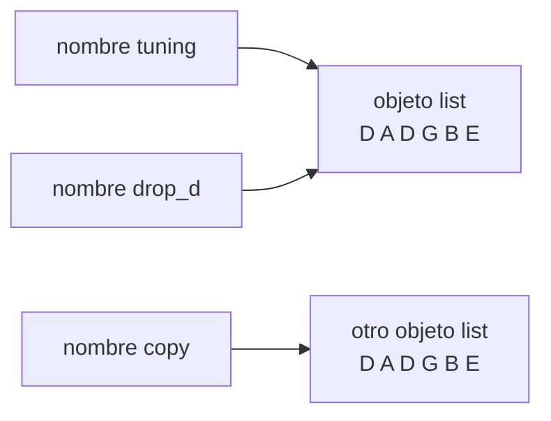

Código: los archivos [`examples/l02_*`](https://github.com/spareilleux/learn/tree/7d3b4bcda19a81326612cd833dc03b9ca77d3451/code/python-for-csharp-java/examples) y [`errors/l02_*`](https://github.com/spareilleux/learn/tree/7d3b4bcda19a81326612cd833dc03b9ca77d3451/code/python-for-csharp-java/errors), y los equivalentes en C# y Java en [`compare/l02_values.cs`](https://github.com/spareilleux/learn/blob/7d3b4bcda19a81326612cd833dc03b9ca77d3451/code/python-for-csharp-java/compare/l02_values.cs), [`compare/L02Values.java`](https://github.com/spareilleux/learn/blob/7d3b4bcda19a81326612cd833dc03b9ca77d3451/code/python-for-csharp-java/compare/L02Values.java), [`compare_fail/l02_scope.cs`](https://github.com/spareilleux/learn/blob/7d3b4bcda19a81326612cd833dc03b9ca77d3451/code/python-for-csharp-java/compare_fail/l02_scope.cs) y [`compare_fail/L02Scope.java`](https://github.com/spareilleux/learn/blob/7d3b4bcda19a81326612cd833dc03b9ca77d3451/code/python-for-csharp-java/compare_fail/L02Scope.java).

## Todo es un objeto

C# divide los tipos en tipos por valor, copiados en la asignación, y tipos por referencia, compartidos. Java tiene primitivos y objetos. Python solo tiene objetos: un número, una cadena, `None`, una función y una clase son todos objetos en el heap, cada uno con un tipo, y una variable siempre hace referencia a uno. El [modelo de datos](https://docs.python.org/3.14/reference/datamodel.html) de la referencia del lenguaje empieza con esta frase: "Objects are Python's abstraction for data."

```python
# examples/l02_objects.py
def with_tax(price: float) -> float:
    return price * 1.15


# Números, texto, None, funciones y clases son todos objetos, y todo objeto tiene un tipo
for value in [42, 3.5, "capo", None, with_tax, int, type]:
    print(type(value))

print(isinstance(True, int), True + True)  # bool es una subclase de int
print(2**100)  # un int no tiene tamaño fijo, así que nunca desborda
print(with_tax.__name__, with_tax.__annotations__)
```

```text
> uv run python examples/l02_objects.py
<class 'int'>
<class 'float'>
<class 'str'>
<class 'NoneType'>
<class 'function'>
<class 'type'>
<class 'type'>
True 2
1267650600228229401496703205376
with_tax {'price': <class 'float'>, 'return': <class 'float'>}
```

Una clase es un objeto de tipo `type`, y también lo es el propio `type`. `bool` deriva de `int`, así que `True + True` vale `2`. Un `int` crece hasta el tamaño que necesita, donde el `int` de C# tiene 32 bits y da la vuelta; la [lección 3](../03-collections/#números) muestra las dos cosas. Y una función es un objeto con atributos, entre ellos las anotaciones que, según la [lección 1](../01-install-and-run/#un-verificador-de-tipos-lee-las-anotaciones), Python conserva y no impone.

Los tipos pequeños se comportan de todos modos como los tipos por valor de C#, por otra razón: `int`, `float`, `str`, `tuple` y `None` son **inmutables**. Ninguna operación modifica un objeto `int`; `count += 1` crea o encuentra el objeto mayor en `1` y enlaza `count` a él. Así que compartirlos no tiene consecuencias, y la pregunta "¿copiado o compartido?" solo importa para los objetos mutables: listas, diccionarios, sets y la mayoría de las instancias de clases.

## Nombres, no cajas

El [modelo de ejecución](https://docs.python.org/3.14/reference/executionmodel.html) llama a las variables *nombres*, y a la asignación *enlace* (*binding*): `x = value` hace que el nombre `x` haga referencia al objeto, y nunca lo copia. Es lo que hace una variable de un tipo por referencia en C# y Java, aplicado a todos los tipos.

```python
# examples/l02_names.py
tuning = ["E", "A", "D", "G", "B", "E"]
drop_d = tuning  # un segundo nombre para la misma lista: no se copia nada
drop_d[0] = "D"
print("tuning:", tuning)
print("same object:", drop_d is tuning)

copy = list(tuning)  # una lista nueva con los mismos elementos
print("equal:", copy == tuning, "same object:", copy is tuning)

# += modifica una lista en el sitio, pero construye una tupla nueva y enlaza el nombre a ella
chord = ["C", "E"]
chord_alias = chord
chord += ["G"]
print("list: ", chord, chord_alias)

frozen: tuple[str, ...] = ("C", "E")
frozen_alias = frozen
frozen += ("G",)
print("tuple:", frozen, frozen_alias)
```

```text
> uv run python examples/l02_names.py
tuning: ['D', 'A', 'D', 'G', 'B', 'E']
same object: True
equal: True same object: False
list:  ['C', 'E', 'G'] ['C', 'E', 'G']
tuple: ('C', 'E', 'G') ('C', 'E')
```



`is` compara identidades, como `ReferenceEquals` en C# o `==` sobre objetos en Java, y `==` compara valores, como `Equals` o `equals`. Para las listas, `==` compara los elementos, lo que no hace el `List<T>` de C#.

`+=` es la sorpresa del archivo. Para una lista, llama al método en el sitio `__iadd__` de la lista, que extiende el objeto que comparten los dos nombres. Una tupla no tiene ese método, así que `frozen += ("G",)` calcula `frozen + ("G",)`, una tupla nueva, y enlaza `frozen` a ella: `frozen_alias` sigue designando la antigua. La misma línea tiene dos significados, decididos por el tipo del objeto en tiempo de ejecución.

## Los argumentos se comparten, no se copian

Una llamada enlaza cada parámetro al objeto pasado, exactamente como lo haría una asignación. El nombre oficial es *llamada por referencia a objeto* (*call by object reference*); es lo que hace Java con todos los objetos, y lo que hace C# con los tipos por referencia pasados sin `ref`:

```python
# examples/l02_arguments.py
def add_capo(strings: list[str]) -> None:
    strings.append("capo")  # modifica la lista del llamador: el parámetro designa el mismo objeto


def retune(strings: list[str]) -> None:
    strings = ["D", "A", "D", "G", "A", "D"]  # enlaza el nombre local a una lista nueva; el llamador no ve nada
    print("inside retune:", strings)


tuning = ["E", "A", "D", "G", "B", "E"]
add_capo(tuning)
print("after add_capo:", tuning)
retune(tuning)
print("after retune:  ", tuning)
```

```text
> uv run python examples/l02_arguments.py
after add_capo: ['E', 'A', 'D', 'G', 'B', 'E', 'capo']
inside retune: ['D', 'A', 'D', 'G', 'A', 'D']
after retune:   ['E', 'A', 'D', 'G', 'B', 'E', 'capo']
```

Una llamada a un método sobre el parámetro llega al objeto del llamador; una asignación al parámetro no. No hay `ref` ni `out`: una función que necesita devolver un valor nuevo lo devuelve, incluidos varios valores, como una tupla (ejercicio 1).

## Identidad e igualdad

En C#, hacer boxing de un `int` crea un objeto nuevo cada vez, y el autoboxing de Java reutiliza objetos `Integer` en caché de -128 a 127, como promete la documentación de [`Integer.valueOf`](https://docs.oracle.com/en/java/javase/25/docs/api/java.base/java/lang/Integer.html#valueOf(int)). CPython también guarda en caché los enteros pequeños, de -5 a 256, como un detalle de implementación que menciona la documentación de [`PyLong_FromLong`](https://docs.python.org/3.14/c-api/long.html#c.PyLong_FromLong). El compilador advierte sobre la comparación que depende de ello:

```python
# errors/l02_identity.py
small = int("100")
big = int("1000")
print(small == 100, small is 100)
print(big == 1000, big is 1000)
```

```text
> uv run python errors/l02_identity.py
errors/l02_identity.py:4: SyntaxWarning: "is" with 'int' literal. Did you mean "=="?
  print(small == 100, small is 100)
errors/l02_identity.py:5: SyntaxWarning: "is" with 'int' literal. Did you mean "=="?
  print(big == 1000, big is 1000)
True True
True False
```

```text
> dotnet run l02_values.cs
False True
False True
quantity: 3
> java L02Values.java
true true
false true
quantity: 3
```

Tres diseños dan tres conjuntos de respuestas a la misma pregunta: C# hace boxing en un objeto nuevo cada vez, Java guarda en caché hasta 127, CPython hasta 256. Solo `==`, `Equals` y `equals` son fiables. mypy 2.3.1 no informa de nada en este archivo; la advertencia viene del compilador de Python, impresa antes de que se ejecute la primera línea. El único caso en que `is` es la comparación correcta es un singleton, y Python tiene tres: `None`, `True` y `False`.

## Dinámico y fuerte

Python tiene **tipado dinámico**: un nombre no tiene tipo, y el mismo nombre puede hacer referencia a una cadena y después a un float. También tiene **tipado fuerte**: un objeto nunca se convierte en silencio en otro tipo. JavaScript es dinámico y débil, y C# es estático y fuerte, con algunas conversiones implícitas:

```python
# errors/l02_strong.py
quantity = 3
print("quantity: " + str(quantity))
print(True + True, 2 * "ab", [0] * 3)  # un bool es un int, y * repite una secuencia
print("quantity: " + quantity)
```

```text
> uv run python errors/l02_strong.py
quantity: 3
2 abab [0, 0, 0]
Traceback (most recent call last):
  File "errors/l02_strong.py", line 5, in <module>
    print("quantity: " + quantity)
          ~~~~~~~~~~~~~^~~~~~~~~~
TypeError: can only concatenate str (not "int") to str
> uv run mypy errors/l02_strong.py
errors/l02_strong.py:5: error: Unsupported operand types for + ("str" and "int")  [operator]
Found 1 error in 1 file (checked 1 source file)
```

C# y Java aceptan `"quantity: " + quantity` y convierten el número, como imprimieron más arriba `l02_values.cs` y `L02Values.java`; JavaScript también ([lección 2 de JavaScript](../../javascript-for-csharp-java/02-values-and-types/#conversiones----análisis-de-texto-y-valores-truthy)). Python se niega, en tiempo de ejecución, y mypy se niega antes. La conversión hay que escribirla: `str(quantity)`, o una f-string, `f"quantity: {quantity}"`, que prefiere la lección 3.

Volver a enlazar un nombre a otro tipo se ejecuta sin queja, y es donde mypy y Python discrepan:

```python
# errors/l02_rebind.py
price = "9.99"  # texto de un archivo CSV
price = float(price)  # el mismo nombre contiene ahora un float
print(price * 2)
```

```text
> uv run python errors/l02_rebind.py
19.98
> uv run mypy errors/l02_rebind.py
errors/l02_rebind.py:3: error: Incompatible types in assignment (expression has type "float", variable has type "str")  [assignment]
Found 1 error in 1 file (checked 1 source file)
```

mypy da a un nombre el tipo de su primera asignación, como hace `var` en C#. El código verificado con mypy usa un segundo nombre, `price_text` y luego `price`; la opción [`allow_redefinition`](https://mypy.readthedocs.io/en/stable/config_file.html#confval-allow_redefinition) de mypy acepta este patrón, y mypy 2.0 hizo esa opción más flexible.

## Valores truthy

`if` y `while` aceptan cualquier objeto, no solo un `bool`. Las reglas de [evaluación del valor de verdad](https://docs.python.org/3.14/library/stdtypes.html#truth-value-testing) dicen qué objetos cuentan como falsos: `None`, `False`, los ceros de todos los tipos numéricos, y las cadenas y colecciones vacías. Todo lo demás es verdadero:

```python
# examples/l02_truthiness.py
for value in [0, 0.0, "", [], {}, None, "0", [0], -1]:
    print(f"{value!r:>6} is {bool(value)}")


def label(quantity: int | None) -> str:
    if not quantity:  # verdadero para None, y también para 0
        return "quantity unknown"
    return f"{quantity} in stock"


def label_checked(quantity: int | None) -> str:
    if quantity is None:
        return "quantity unknown"
    return f"{quantity} in stock"


print(label(None), "|", label(0), "|", label(3))
print(label_checked(None), "|", label_checked(0), "|", label_checked(3))
```

```text
> uv run python examples/l02_truthiness.py
     0 is False
   0.0 is False
    '' is False
    [] is False
    {} is False
  None is False
   '0' is True
   [0] is True
    -1 is True
quantity unknown | quantity unknown | 3 in stock
quantity unknown | 0 in stock | 3 in stock
```

`if items:` es la prueba idiomática de "no vacío", y se lee mejor que `if len(items) > 0:`. Pero `if not quantity:` trata `0` como ausente, un bug del que mypy no informa, ya que las dos ramas son válidas para un `int | None`. Cuando `None` significa "ausente", comprueba `None`.

## None

`None` es el único objeto de tipo `NoneType`. Desempeña el papel de `null`, con una diferencia: es un objeto, así que `None` tiene un tipo y métodos, y el error viene de lo que el código hace con él. Dos formas de obtener `None` sin pedirlo:

```python
# errors/l02_none.py
tuning = ["E", "A", "D", "G", "B", "E"]
ordered = tuning.sort()  # ordena la lista en el sitio, y devuelve None
print(ordered)

beliefs = {"tetravalent-logic": {"truth": "T"}}
belief = beliefs.get("governance")  # None cuando falta la clave
print(belief["truth"])
```

```text
> uv run python errors/l02_none.py
None
Traceback (most recent call last):
  File "errors/l02_none.py", line 8, in <module>
    print(belief["truth"])
          ~~~~~~^^^^^^^^^
TypeError: 'NoneType' object is not subscriptable
> uv run mypy errors/l02_none.py
errors/l02_none.py:8: error: Value of type "dict[str, str] | None" is not indexable  [index]
Found 1 error in 1 file (checked 1 source file)
```

Un método que modifica un objeto en el sitio devuelve `None`, por convención, para que nadie lo confunda con una copia: `list.sort()` ordena y no devuelve nada, y la función integrada `sorted(tuning)` devuelve una lista nueva. `dict.get` devuelve `None` para una clave que falta, como `Map.get` en Java, donde `beliefs["governance"]` lanzaría `KeyError`. El `TypeError` es el `NullReferenceException` de Python, y nombra el tipo, `'NoneType' object`; para un atributo dice `AttributeError: 'NoneType' object has no attribute …`.

mypy detectó el segundo caso, porque el tipo de retorno declarado de `dict.get` incluye `None`, igual que los tipos de referencia anulables señalan un posible `null` en C#. No informó del primero: asignar el resultado de `sort()` es legal, y el error solo se ve cuando `ordered` se usa como lista.

## Ámbito: funciones, no bloques

Un bloque no crea un ámbito en Python. `if`, `for`, `while` y `with` enlazan nombres en la función que los contiene, o en el módulo en el nivel superior; solo las funciones, las clases, las comprensiones y los módulos tienen su propio ámbito.

```python
# errors/l02_scope.py
for string in ["E", "A", "D"]:
    last = string.lower()
print(string, last)  # un bucle no es un ámbito: los dos nombres siguen existiendo

count = 0


def add_one() -> None:
    count += 1  # una asignación en cualquier parte de la función hace que count sea local en toda ella


add_one()
```

```text
> uv run python errors/l02_scope.py
D d
Traceback (most recent call last):
  File "errors/l02_scope.py", line 13, in <module>
    add_one()
    ~~~~~~~^^
  File "errors/l02_scope.py", line 10, in add_one
    count += 1  # an assignment anywhere in the function makes count local to all of it
    ^^^^^
UnboundLocalError: cannot access local variable 'count' where it is not associated with a value
```

La variable del bucle y `last` sobrevivieron al bucle, donde C# y Java se niegan a compilar el mismo `print`:

```text
> dotnet run l02_scope.cs
compare_fail/l02_scope.cs(6,19): error CS0103: The name 'text' does not exist in the current context
compare_fail/l02_scope.cs(6,26): error CS0103: The name 'last' does not exist in the current context

The build failed. Fix the build errors and run again.
> javac L02Scope.java
L02Scope.java:7: error: cannot find symbol
        System.out.println(text + last);
                           ^
  symbol:   variable text
  location: class L02Scope
L02Scope.java:7: error: cannot find symbol
        System.out.println(text + last);
                                  ^
  symbol:   variable last
  location: class L02Scope
2 errors
```

El segundo error es el que sorprende. El compilador decide, para cada función, qué nombres son locales, y un nombre que la función asigna en cualquier parte es local en toda ella. `count += 1` lee el `count` local antes de que nada lo haya asignado. Leer un nombre del módulo desde una función funciona; asignarlo requiere `global count`, y asignar un nombre de una función contenedora requiere `nonlocal`, que usa la [lección 4](../04-functions/#closures). mypy 2.3.1 no informa de ningún error en este archivo.

La búsqueda de nombres sigue cuatro niveles, conocidos como LEGB: el ámbito local (**L**ocal), los ámbitos de las funciones contenedoras (**E**nclosing), el ámbito global del módulo (**G**lobal), y los nombres integrados (**B**uilt-in) como `len`, `print` e `input`. Un nombre local puede ocultar uno integrado, lo que es legal y a veces confuso (más abajo).

## Los bloques son la sangría

Dos puntos abren un bloque, y el bloque son las líneas sangradas debajo. Las llaves de C# desaparecen, y también la elección de estilo: [PEP 8](https://peps.python.org/pep-0008/), la guía de estilo de Python, pide cuatro espacios por nivel, y formateadores como Ruff la aplican (lección 13). Un bloque vacío necesita la instrucción `pass`. Mezclar tabulaciones y espacios en un archivo es un `TabError`, y una línea sangrada a un nivel que no existe es un `IndentationError`, ambos lanzados por el compilador antes de que se ejecute nada.

## Importar ejecuta el módulo

La [lección 1](../01-install-and-run/#ejecutar-código) mostró que un import ejecuta el código de nivel superior de un módulo, una vez, y guarda el módulo en caché en `sys.modules`. `def` y `class` también son instrucciones que se ejecutan: importar un módulo crea sus funciones y sus clases, y ejecuta todo lo demás en el nivel superior, incluidas las lecturas de archivos y las llamadas de red.

```python
# examples/l02_config.py
print(f"running the top-level code of {__name__}")
STRINGS = 6
```

```python
# examples/l02_import_twice.py
import sys

import l02_config

print("imported, STRINGS =", l02_config.STRINGS)
import l02_config  # ya está en sys.modules: no se ejecuta nada

print("in sys.modules:", "l02_config" in sys.modules)
```

```text
> uv run python examples/l02_import_twice.py
running the top-level code of l02_config
imported, STRINGS = 6
in sys.modules: True
```

Lo más parecido en C# es un constructor estático, y en Java un inicializador estático: código que se ejecuta una vez, la primera vez que se usa un tipo. Un módulo va más allá, porque todo su cuerpo es ese código. Cuando falla, el import falla, y todos los módulos que lo importan fallan con él. El agente de gobernanza de GA busca así su carpeta de datos; reducido a las líneas que importan:

```python
# errors/l02_governance.py
# Reducido de Apps/demerzel-agent/src/services/governance.py de GA: la búsqueda se ejecuta cuando se importa el módulo
import os
from pathlib import Path


def find_governance_root() -> Path:
    candidate = Path(__file__).resolve()
    for _ in range(3):
        candidate = candidate.parent
        governance = candidate / "governance" / "demerzel"
        if governance.is_dir():
            return governance
    env = os.environ.get("DEMERZEL_ROOT")
    if env:
        return Path(env)
    raise FileNotFoundError("Could not locate governance/demerzel/ directory")


GOV_ROOT = find_governance_root()


def list_beliefs() -> list[Path]:
    return sorted((GOV_ROOT / "state" / "beliefs").glob("*.belief.json"))
```

```python
# errors/l02_import_governance.py
print("before the import")
import l02_governance

print(l02_governance.list_beliefs())
```

```text
> uv run python errors/l02_import_governance.py
before the import
Traceback (most recent call last):
  File "errors/l02_import_governance.py", line 3, in <module>
    import l02_governance
  File "errors/l02_governance.py", line 20, in <module>
    GOV_ROOT = find_governance_root()
  File "errors/l02_governance.py", line 17, in find_governance_root
    raise FileNotFoundError("Could not locate governance/demerzel/ directory")
FileNotFoundError: Could not locate governance/demerzel/ directory
```

El traceback pasa por la línea del `import`: el programa no llamó a `list_beliefs`, solo importó el módulo que la define. Una prueba que importe cualquier módulo del agente, una herramienta de documentación que lo importe para leer sus docstrings, o un plugin de un verificador de tipos que lo cargue, fallan todos en una máquina sin la carpeta. mypy no ve nada malo, ya que el código está bien tipado. El ejercicio 3 mueve la búsqueda a una función.

## En proyectos reales

**El agente de gobernanza de GA**, en el commit [`cc42d21`](https://github.com/GuitarAlchemist/ga/commit/cc42d215504631e168daf3bdf2c6d47b5c9fbe93):

- [`src/services/governance.py`, líneas 13-28](https://github.com/GuitarAlchemist/ga/blob/cc42d215504631e168daf3bdf2c6d47b5c9fbe93/Apps/demerzel-agent/src/services/governance.py#L13-L28), es el módulo reducido arriba. Su búsqueda sube diez carpetas padre desde el archivo, luego recurre a `DEMERZEL_ROOT`, y `GOV_ROOT = find_governance_root()` se ejecuta al importar. `import src.services.governance` en mi copia del agente lanzó el mismo `FileNotFoundError`, y funcionó en cuanto se definió `DEMERZEL_ROOT`. Como la variable de entorno se lee después del recorrido, una carpeta llamada `governance/demerzel` en cualquier carpeta padre gana sobre ella.
- [`src/agents/epistemic_agent.py`, línea 15](https://github.com/GuitarAlchemist/ga/blob/cc42d215504631e168daf3bdf2c6d47b5c9fbe93/Apps/demerzel-agent/src/agents/epistemic_agent.py#L15), declara `async def handle(input: list[Message])`. El parámetro oculta la función integrada `input` dentro de `handle`, lo que aquí no tiene consecuencias y es una trampa para la próxima persona que añada una llamada a `input()` en esa función. El mismo archivo usa los valores truthy donde encajan, `reason or 'not specified'` en la [línea 118](https://github.com/GuitarAlchemist/ga/blob/cc42d215504631e168daf3bdf2c6d47b5c9fbe93/Apps/demerzel-agent/src/agents/epistemic_agent.py#L118), y comprueba `None` donde cero es un valor válido, `if actual is None: continue` en la [línea 51](https://github.com/GuitarAlchemist/ga/blob/cc42d215504631e168daf3bdf2c6d47b5c9fbe93/Apps/demerzel-agent/src/agents/epistemic_agent.py#L51).

**El servicio graphiti de GA** guarda su servicio en un nombre de nivel de módulo, [`graphiti_service: GraphitiMusicService = None`](https://github.com/GuitarAlchemist/ga/blob/cc42d215504631e168daf3bdf2c6d47b5c9fbe93/Apps/ga-graphiti-service/main.py#L29), asignado con `global graphiti_service` en la función de arranque de la aplicación ([línea 35](https://github.com/GuitarAlchemist/ga/blob/cc42d215504631e168daf3bdf2c6d47b5c9fbe93/Apps/ga-graphiti-service/main.py#L35)). Sin `global`, la asignación crearía un nombre local y el del módulo seguiría valiendo `None`, como mostró `add_one`. La anotación dice que el nombre siempre contiene un servicio, y su primer valor es `None`: `GraphitiMusicService | None` es el tipo honesto, y la lección 6 muestra lo que mypy dice al respecto.

## Puntos clave

- Todo valor es un objeto, y un nombre hace referencia a uno. La asignación y el paso de argumentos enlazan nombres; nunca copian.
- Los objetos inmutables (`int`, `str`, `tuple`, `None`) pueden compartirse sin riesgo; para los mutables, un segundo nombre es una segunda forma de modificar el mismo objeto. `+=` modifica una lista en el sitio y vuelve a enlazar una tupla.
- `is` compara la identidad y `==` compara los valores. Usa `is` solo con `None`, `True` y `False`.
- Python es dinámico y fuerte: un nombre puede cambiar de tipo, un objeto nunca se convierte en silencio. mypy da a cada nombre un solo tipo.
- Las colecciones vacías, los ceros y `None` son falsos. Comprueba `is None` cuando cero o vacío es un valor válido.
- Solo las funciones, las clases, las comprensiones y los módulos crean ámbitos. Una asignación hace que un nombre sea local en toda la función.
- Importar un módulo ejecuta su código de nivel superior una vez. Limita ese código a definiciones, y haz las búsquedas, la E/S y las conexiones en funciones.

## Ejercicios

1. Reescribe `retune` de [`examples/l02_arguments.py`](https://github.com/spareilleux/learn/blob/7d3b4bcda19a81326612cd833dc03b9ca77d3451/code/python-for-csharp-java/examples/l02_arguments.py) de dos maneras: una que modifica la lista del llamador, para que otro nombre de la misma lista vea la nueva afinación, y otra que la deja intacta y devuelve una lista nueva.

<details>
<summary>Solución</summary>

[`solutions/l02_ex1_tuning.py`](https://github.com/spareilleux/learn/blob/7d3b4bcda19a81326612cd833dc03b9ca77d3451/code/python-for-csharp-java/solutions/l02_ex1_tuning.py):

```python
# solutions/l02_ex1_tuning.py
STANDARD = ("E", "A", "D", "G", "B", "E")


def retune_in_place(strings: list[str], notes: tuple[str, ...]) -> None:
    # La asignación a un slice sustituye los elementos de la lista del llamador en lugar de volver a enlazar el parámetro
    strings[:] = notes


def retuned(notes: tuple[str, ...]) -> list[str]:
    # O dejar intacta la lista del llamador y devolver una nueva
    return list(notes)


if __name__ == "__main__":
    tuning = ["D", "A", "D", "G", "A", "D"]
    alias = tuning
    retune_in_place(tuning, STANDARD)
    print(alias, alias is tuning)
    print(retuned(("D", "G", "D", "G", "B", "D")))
```

```text
> uv run python solutions/l02_ex1_tuning.py
['E', 'A', 'D', 'G', 'B', 'E'] True
['D', 'G', 'D', 'G', 'B', 'D']
```

`strings[:] = notes` es una asignación a un slice del objeto, no al nombre, así que llama a un método de la lista, como `append`; la lección 3 explica los slices. La versión que devuelve una lista nueva suele ser el mejor diseño, ya que el llamador ve en la llamada que vuelve algo nuevo, y nadie puede modificar la tupla de notas. Las mismas funciones se prueban en [`tests/test_l02.py`](https://github.com/spareilleux/learn/blob/7d3b4bcda19a81326612cd833dc03b9ca77d3451/code/python-for-csharp-java/tests/test_l02.py).

</details>

2. La tienda quiere tres etiquetas: `quantity unknown` para `None`, `out of stock` para `0`, y `3 in stock` en los demás casos. Corrige `label` en [`examples/l02_truthiness.py`](https://github.com/spareilleux/learn/blob/7d3b4bcda19a81326612cd833dc03b9ca77d3451/code/python-for-csharp-java/examples/l02_truthiness.py).

<details>
<summary>Solución</summary>

[`solutions/l02_ex2_label.py`](https://github.com/spareilleux/learn/blob/7d3b4bcda19a81326612cd833dc03b9ca77d3451/code/python-for-csharp-java/solutions/l02_ex2_label.py):

```python
# solutions/l02_ex2_label.py
def label(quantity: int | None) -> str:
    if quantity is None:
        return "quantity unknown"
    if quantity == 0:
        return "out of stock"
    return f"{quantity} in stock"


if __name__ == "__main__":
    for quantity in [None, 0, 3]:
        print(label(quantity))
```

```text
> uv run python solutions/l02_ex2_label.py
quantity unknown
out of stock
3 in stock
```

El orden de las comprobaciones importa: `quantity == 0` después de `quantity is None`, para que mypy sepa que `quantity` es un `int` a partir de ahí, el estrechamiento que hace C# después de `if (quantity is null) return`.

</details>

3. Modifica el módulo de gobernanza de [`errors/l02_governance.py`](https://github.com/spareilleux/learn/blob/7d3b4bcda19a81326612cd833dc03b9ca77d3451/code/python-for-csharp-java/errors/l02_governance.py) para que importarlo nunca falle, `DEMERZEL_ROOT` tenga prioridad sobre la búsqueda de carpetas, y una prueba pueda apuntarlo a una carpeta temporal.

<details>
<summary>Solución</summary>

La búsqueda se convierte en una función, llamada cuando se listan las creencias. [`solutions/l02_ex3_governance.py`](https://github.com/spareilleux/learn/blob/7d3b4bcda19a81326612cd833dc03b9ca77d3451/code/python-for-csharp-java/solutions/l02_ex3_governance.py):

```python
# solutions/l02_ex3_governance.py
import os
from pathlib import Path


def governance_root() -> Path:
    # Se busca cuando una función la necesita, no cuando se importa el módulo
    env = os.environ.get("DEMERZEL_ROOT")
    if env:
        return Path(env)
    for parent in Path(__file__).resolve().parents:
        governance = parent / "governance" / "demerzel"
        if governance.is_dir():
            return governance
    raise FileNotFoundError("Could not locate governance/demerzel/ directory; set DEMERZEL_ROOT")


def list_beliefs() -> list[str]:
    beliefs = governance_root() / "state" / "beliefs"
    return sorted(path.name for path in beliefs.glob("*.belief.json"))


if __name__ == "__main__":
    print("imported without an error")
    try:
        print(list_beliefs())
    except FileNotFoundError as e:
        print("error:", e)
```

```text
> uv run python solutions/l02_ex3_governance.py
imported without an error
error: Could not locate governance/demerzel/ directory; set DEMERZEL_ROOT
```

La prueba de [`tests/test_l02.py`](https://github.com/spareilleux/learn/blob/7d3b4bcda19a81326612cd833dc03b9ca77d3451/code/python-for-csharp-java/tests/test_l02.py) importa el módulo al principio del archivo, lo que ahora funciona en cualquier sitio, luego crea dos archivos de creencias en la carpeta `tmp_path` de pytest y define la variable con `monkeypatch.setenv`, que pytest deshace después de la prueba:

```python
def test_the_lookup_happens_when_beliefs_are_listed(monkeypatch: pytest.MonkeyPatch, tmp_path: Path) -> None:
    # El import al principio de este archivo funcionó sin carpeta de gobernanza
    beliefs = tmp_path / "state" / "beliefs"
    beliefs.mkdir(parents=True)
    (beliefs / "b.belief.json").write_text("{}", encoding="utf-8")
    (beliefs / "a.belief.json").write_text("{}", encoding="utf-8")
    monkeypatch.setenv("DEMERZEL_ROOT", str(tmp_path))
    assert l02_ex3_governance.list_beliefs() == ["a.belief.json", "b.belief.json"]
```

Llamar a `governance_root()` en cada listado cuesta unas pocas comprobaciones del sistema de archivos; si eso importa, `functools.cache` de la [lección 4](../04-functions/#decoradores) conserva el primer resultado, sin hacer nada todavía en el momento del import. La lección 9 trata `tmp_path` y `monkeypatch`.

</details>

## Fuentes

- [Python — Data model: objects, values and types](https://docs.python.org/3.14/reference/datamodel.html#objects-values-and-types), [Execution model: naming and binding](https://docs.python.org/3.14/reference/executionmodel.html#naming-and-binding), [Truth value testing](https://docs.python.org/3.14/library/stdtypes.html#truth-value-testing), [Identity comparisons](https://docs.python.org/3.14/reference/expressions.html#is-not), [The import system](https://docs.python.org/3.14/reference/import.html)
- [Python FAQ — Why am I getting an UnboundLocalError when the variable has a value?](https://docs.python.org/3.14/faq/programming.html#why-am-i-getting-an-unboundlocalerror-when-the-variable-has-a-value), [How do I write a function with output parameters (call by reference)?](https://docs.python.org/3.14/faq/programming.html#how-do-i-write-a-function-with-output-parameters-call-by-reference)
- [PEP 8 — Style guide for Python code](https://peps.python.org/pep-0008/)
- [mypy — The mypy configuration file](https://mypy.readthedocs.io/en/stable/config_file.html)
- [Java — `Integer.valueOf(int)`](https://docs.oracle.com/en/java/javase/25/docs/api/java.base/java/lang/Integer.html#valueOf(int)), [Microsoft — Conversión boxing y unboxing](https://learn.microsoft.com/dotnet/csharp/programming-guide/types/boxing-and-unboxing)
