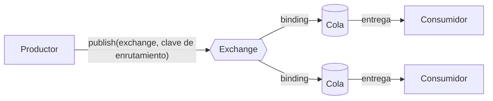

import { Tabs, TabItem } from '@astrojs/starlight/components';

Ejemplo completo: [`L01.cs`](https://github.com/spareilleux/learn/blob/main/code/rabbitmq/csharp/L01.cs) y [`L01.java`](https://github.com/spareilleux/learn/blob/main/code/rabbitmq/java/client/src/main/java/dev/learn/rabbitmq/L01.java). [`check.sh`](https://github.com/spareilleux/learn/blob/main/code/rabbitmq/check.sh) los ejecuta y compara su salida, y la de los comandos CLI de abajo, con los archivos de [`expected`](https://github.com/spareilleux/learn/tree/main/code/rabbitmq/expected).

## El modelo

Un broker de mensajes se sitúa entre los programas que envían mensajes y los que los reciben, para que ninguno tenga que conocer al otro ni ejecutarse al mismo tiempo. El protocolo nativo de RabbitMQ es [AMQP 0-9-1](https://www.rabbitmq.com/tutorials/amqp-concepts), y su modelo tiene más piezas que «poner un mensaje en una cola»:



Un productor nunca escribe en una cola. Publica un mensaje en un **exchange**, con una **clave de enrutamiento** (*routing key*). El exchange compara el mensaje con sus **bindings**, las reglas que lo enlazan con colas, y deja una copia en cada cola que coincide. Una **cola** (*queue*) guarda los mensajes en orden hasta que un **consumidor** los toma y confirma su recepción. La lección 2 trata de exchanges y bindings; la lección 4, de los acuses de recibo.

| AMQP 0-9-1 | Qué es | Lo más parecido que quizá conozcas |
|---|---|---|
| connection | una conexión TCP de larga duración de un cliente al broker | una `SqlConnection` en un pool, un `HttpClient` compartido |
| channel | una sesión ligera multiplexada sobre una conexión; casi todas las operaciones ocurren en un canal | una `Session` de JMS |
| virtual host | un espacio de nombres aislado de exchanges, colas y permisos; `/` por defecto | una base de datos en una instancia de SQL Server |
| exchange | un enrutador, cuyo tipo fija las reglas | un topic de Azure Service Bus |
| binding | una regla de un exchange a una cola (o a otro exchange) | una regla de suscripción |
| queue | un búfer ordenado que leen los consumidores | una cola o una suscripción de Service Bus |
| message | propiedades (tipo de contenido, ID de mensaje, cabeceras…) y un cuerpo de bytes | una petición HTTP: cabeceras y un cuerpo |

RabbitMQ 4 habla también otros protocolos, entre ellos [AMQP 1.0](https://www.rabbitmq.com/docs/amqp), [MQTT](https://www.rabbitmq.com/docs/mqtt) y los [streams](https://www.rabbitmq.com/docs/streams); la lección 12 los cubre. AMQP 0-9-1 sigue siendo el que usan el cliente .NET, el cliente Java y Spring AMQP, y el que hablan la mayoría de las aplicaciones existentes.

## Ejecutar RabbitMQ en un contenedor

La [imagen Docker](https://hub.docker.com/_/rabbitmq) oficial viene en dos variantes: `rabbitmq:4.3.5` es el broker solo, y `rabbitmq:4.3.5-management` añade el plugin de gestión, su interfaz web y su API HTTP. El curso fija el tag exacto; en mi máquina correspondía al digest `sha256:57bddb6fbc3498b5d8b5a14dc6f4506073ebcf94c66ba2a7678c335faa8dd631`.

<Tabs syncKey="os">
<TabItem label="Windows">

Con Docker Desktop, en PowerShell:

```powershell
docker run -d --name rabbitmq --hostname rabbitmq --user rabbitmq `
  -p 5672:5672 -p 15672:15672 rabbitmq:4.3.5-management
```

Con `wslc` (consulta [Contenedores WSL](../../wsl-containers/)) o Podman, se aplican las mismas opciones:

```powershell
wslc run -d --name rabbitmq --hostname rabbitmq --user rabbitmq -p 5672:5672 -p 15672:15672 rabbitmq:4.3.5-management
podman run -d --name rabbitmq --hostname rabbitmq --user rabbitmq -p 5672:5672 -p 15672:15672 docker.io/library/rabbitmq:4.3.5-management
```

</TabItem>
<TabItem label="Linux / WSL">

```bash
docker run -d --name rabbitmq --hostname rabbitmq --user rabbitmq \
  -p 5672:5672 -p 15672:15672 rabbitmq:4.3.5-management
```

</TabItem>
<TabItem label="macOS">

```bash
docker run -d --name rabbitmq --hostname rabbitmq --user rabbitmq \
  -p 5672:5672 -p 15672:15672 rabbitmq:4.3.5-management
```

</TabItem>
</Tabs>

Ejecuté el comando de Docker Desktop en Windows el 2026-09-15; `wslc` 2.9.11 lista `--hostname` y `--user` en `wslc run --help`, pero los comandos de `wslc` y Podman, y los de Linux y macOS, están *por verificar* en esta máquina (la CI ejecuta la misma imagen en Linux como servicio de GitHub Actions). El [`broker.sh`](https://github.com/spareilleux/learn/blob/main/code/rabbitmq/broker.sh) del curso envuelve estos comandos, con `bash broker.sh start` y `bash broker.sh stop`.

Cada opción tiene su razón:

- **`-p 5672:5672`** publica el puerto AMQP, y **`-p 15672:15672`** la interfaz de gestión y la API HTTP.
- **`--hostname rabbitmq`** fija el nombre del nodo. Un nodo RabbitMQ se llama `rabbit@<hostname>`, y guarda sus datos en un directorio con el nombre del nodo. Docker da un hostname aleatorio a cada contenedor nuevo, así que sin esta opción un contenedor recreado sobre el mismo volumen arranca con otro nombre y no encuentra sus colas. La [documentación de la imagen](https://hub.docker.com/_/rabbitmq) pide fijarlo por esa razón.
- **`--user rabbitmq`** ejecuta todo lo que corre en el contenedor, incluidos los comandos que lanzas con `docker exec`, como el usuario `rabbitmq`. La sección siguiente muestra qué pasa sin ella.

### El broker que se detenía antes de arrancar

Mi primer `broker.sh` arrancaba el contenedor sin `--user` y luego esperaba al broker en un bucle que ejecutaba `docker exec rabbitmq rabbitmq-diagnostics -q check_port_connectivity` cada segundo. El contenedor se detuvo en menos de dos segundos. Su log:

```text
2026-09-15 04:20:55.976303+00:00 [error] <0.153.0> Error when reading /var/lib/rabbitmq/.erlang.cookie: eacces
...
Kernel pid terminated (application_controller) ("{application_start_failure,rabbitmq_prelaunch,{{shutdown,{failed_to_start_child,prelaunch,{badmatch,{error,{{shutdown,{failed_to_start_child,auth,{\"Error when reading /var/lib/rabbitmq/.erlang.cookie: eacces\",...
```

La **cookie de Erlang** es un secreto compartido. Los nodos RabbitMQ la usan para hablar entre sí, y también las [herramientas CLI](https://www.rabbitmq.com/docs/cli): `rabbitmqctl` y `rabbitmq-diagnostics` no son clientes HTTP, se unen al nodo por la distribución de Erlang (puerto 25672) y deben presentar la misma cookie. El primer proceso que necesita la cookie y no encuentra el archivo crea `/var/lib/rabbitmq/.erlang.cookie`. `docker exec` se ejecuta como root por defecto, así que mi primer comando de diagnóstico, un segundo después de arrancar el contenedor, ganó la carrera y creó el archivo, propiedad de root con el modo `0400`. El nodo, que la imagen ejecuta como el usuario `rabbitmq`, ya no podía leerlo. Para reproducirlo basta una línea después del `docker run` sin `--user`:

```text
$ docker exec rabbitmq rabbitmq-diagnostics -q check_port_connectivity
$ docker exec rabbitmq ls -la /var/lib/rabbitmq/.erlang.cookie
-r-------- 1 root root 20 Sep 15 00:00 /var/lib/rabbitmq/.erlang.cookie
```

Un contenedor arrancado normalmente, en el que el nodo escribió el archivo él mismo, muestra `rabbitmq rabbitmq` como propietario. Un health check como el `test: rabbitmq-diagnostics ping` de Docker Compose con un intervalo corto provoca el mismo fallo; se informó en [docker-library/rabbitmq#695](https://github.com/docker-library/rabbitmq/issues/695). Con `--user rabbitmq`, la CLI se ejecuta con el mismo usuario que el nodo, y cree quien cree el archivo, el nodo puede leerlo. Lo comprobé en local con un health check cada segundo, y el contenedor de servicio de la CI del curso usa la misma opción.

## ¿Está vivo? Las herramientas CLI

RabbitMQ incluye [varias herramientas CLI](https://www.rabbitmq.com/docs/cli): `rabbitmqctl` para la administración (usuarios, colas, políticas), `rabbitmq-diagnostics` para health checks e inspección, `rabbitmq-plugins` para los plugins, y `rabbitmq-queues`, `rabbitmq-streams` y `rabbitmq-upgrade` para tareas más especializadas. En un contenedor, ejecútalas con `docker exec`:

```text
$ docker exec rabbitmq rabbitmq-diagnostics server_version
Asking node rabbit@rabbitmq for its RabbitMQ version...
4.3.5
```

```text
$ docker exec rabbitmq rabbitmq-diagnostics listeners
Asking node rabbit@rabbitmq to report its protocol listeners ...
Interface: [::], port: 15672, protocol: http, purpose: HTTP API
Interface: [::], port: 15692, protocol: http/prometheus, purpose: Prometheus exporter API over HTTP
Interface: [::], port: 25672, protocol: clustering, purpose: inter-node and CLI tool communication
Interface: [::], port: 5672, protocol: amqp, purpose: AMQP 0-9-1 and AMQP 1.0
```

Los listeners cuentan toda la historia de los puertos: 5672 para los clientes (AMQP 0-9-1 y, desde RabbitMQ 4.0, AMQP 1.0 en el mismo puerto), 15672 para el plugin de gestión, 15692 para las métricas de Prometheus (lección 10), y 25672 para las herramientas CLI y los demás nodos. La imagen activa dos plugins:

```text
$ docker exec rabbitmq rabbitmq-plugins list --enabled
Listing plugins with pattern ".*" ...
 Configured: E = explicitly enabled; e = implicitly enabled
 | Status: * = running on rabbit@rabbitmq
 |/
[E*] rabbitmq_management 4.3.5
[E*] rabbitmq_prometheus 4.3.5
```

Para un health check, la [guía de monitorización](https://www.rabbitmq.com/docs/monitoring#health-checks) recomienda comandos que prueban una sola cosa cada uno, del menos intrusivo al más intrusivo: `rabbitmq-diagnostics -q ping`, `check_running`, `check_local_alarms`, `check_port_connectivity`. El último se conecta a cada listener, y por eso `broker.sh` lo espera:

```text
$ docker exec rabbitmq rabbitmq-diagnostics check_port_connectivity
Testing TCP connections to all active listeners on node rabbit@rabbitmq using hostname resolution ...
Will connect to rabbitmq:15672
Will connect to rabbitmq:15692
Will connect to rabbitmq:25672
Will connect to rabbitmq:5672
Successfully connected to ports 5672, 15672, 15692, 25672 on node rabbit@rabbitmq (using node hostname resolution)
```

## La interfaz de gestión y la API HTTP

Abre [http://localhost:15672](http://localhost:15672) e inicia sesión como `guest` con la contraseña `guest`. La pestaña Overview muestra las tasas de mensajes y la memoria y el disco del nodo; las pestañas Connections, Channels, Exchanges y Queues listan lo que crea la sección siguiente, y la página de una cola tiene un botón «Get messages» muy práctico para depurar.

Por defecto, RabbitMQ solo acepta el usuario `guest` desde localhost ([control de acceso](https://www.rabbitmq.com/docs/access-control#loopback-users)). Las conexiones que llegan por el puerto publicado de Docker vienen de la red del contenedor, no de su interfaz loopback, así que la imagen levanta la restricción en `/etc/rabbitmq/conf.d/10-defaults.conf`:

```ini
## DEFAULT SETTINGS ARE NOT MEANT TO BE TAKEN STRAIGHT INTO PRODUCTION
## see https://www.rabbitmq.com/configure.html for further information
## on configuring RabbitMQ

## allow access to the guest user from anywhere on the network
## https://www.rabbitmq.com/access-control.html#loopback-users
## https://www.rabbitmq.com/production-checklist.html#users
loopback_users.guest = false
```

Eso vale en un portátil y está mal en cualquier otro sitio; la lección 9 sustituye a `guest`. Todo lo que muestra la interfaz viene de la [API HTTP](https://www.rabbitmq.com/docs/http-api-reference), a la que los scripts pueden llamar directamente. El parámetro `columns` conserva solo los campos que pides, y `%2F` es el virtual host `/` codificado para URL:

```text
$ curl -s -u guest:guest "http://localhost:15672/api/overview?columns=rabbitmq_version,erlang_version,cluster_name,node"
{"rabbitmq_version":"4.3.5","cluster_name":"rabbit@rabbitmq","erlang_version":"27.3.4.17","node":"rabbit@rabbitmq"}
$ curl -s -u guest:guest "http://localhost:15672/api/queues/%2F/hello?columns=name,type,durable,messages"
{"durable":true,"messages":0,"name":"hello","type":"classic"}
```

En Windows, escribe `curl.exe` en PowerShell, donde `curl` es un alias de `Invoke-WebRequest`. La imagen ejecuta RabbitMQ 4.3.5 sobre Erlang/OTP 27.3; la [página de compatibilidad con Erlang](https://www.rabbitmq.com/docs/which-erlang) indica 27.x como la serie soportada para 4.3.5.

## Un primer productor

El programa en C# usa [RabbitMQ.Client](https://www.rabbitmq.com/client-libraries/dotnet-api-guide) 7, cuya API es asíncrona de principio a fin. Una pequeña utilidad, [`Broker.ConnectAsync`](https://github.com/spareilleux/learn/blob/main/code/rabbitmq/csharp/Broker.cs), crea una `ConnectionFactory` para `localhost` (o `RABBITMQ_HOST`) y da nombre a la conexión:

```csharp
public static async Task Send()
{
    await using IConnection connection = await ConnectAsync("l01-send");
    Console.WriteLine($"connected to {Text(connection.ServerProperties?["product"])} {Text(connection.ServerProperties?["version"])}");

    // Un canal es una sesión ligera multiplexada sobre la conexión; casi todas las operaciones AMQP ocurren en un canal.
    await using IChannel channel = await connection.CreateChannelAsync();

    // Declarar es idempotente: crea la cola, o comprueba que la existente tiene los mismos parámetros.
    QueueDeclareOk queue = await channel.QueueDeclareAsync("hello", durable: true, exclusive: false, autoDelete: false);
    Console.WriteLine($"queue {queue.QueueName}: {queue.MessageCount} message(s) waiting");

    for (var i = 1; i <= 3; i++)
    {
        // El exchange por defecto "" entrega a la cola cuyo nombre es la clave de enrutamiento.
        await channel.BasicPublishAsync(exchange: "", routingKey: "hello", body: Bytes($"Hello {i}"));
        Console.WriteLine($"sent Hello {i}");
    }
}
```

Compílalo y ejecútalo desde `code/rabbitmq` (el comando es el mismo en los tres SO):

```text
$ dotnet run --project csharp -- l01-send
connected to RabbitMQ 4.3.5
queue hello: 0 message(s) waiting
sent Hello 1
sent Hello 2
sent Hello 3
```

Cuatro cosas de estas pocas líneas importan para el resto del curso:

- **Las conexiones y los canales viven mucho.** La [guía del cliente .NET](https://www.rabbitmq.com/client-libraries/dotnet-api-guide#connection-and-channel-lifespan) califica abrir una conexión por operación de «unnecessary and strongly discouraged»: es una conexión TCP con un saludo de protocolo. Una aplicación abre una al arrancar, como un `HttpClient` compartido, y abre canales sobre ella.
- **Declarar es idempotente.** `QueueDeclareAsync` crea `hello` si no existe y tiene éxito sin cambiar nada si existe con los mismos parámetros. Tanto el productor como el consumidor la declaran, así que cualquiera puede arrancar primero. La lección 2 muestra qué pasa cuando los parámetros difieren.
- **El exchange por defecto.** Cada virtual host tiene un exchange cuyo nombre es la cadena vacía, con un binding implícito a cada cola con el nombre de la propia cola. Publicar en `""` con la clave de enrutamiento `hello` llega por tanto a la cola `hello`; es lo que hace que AMQP parezca «enviar a una cola» en los tutoriales.
- **La cola es durable.** Una cola durable sobrevive a un reinicio del broker. RabbitMQ 4.3 ya ni siquiera permite una cola no durable que no sea exclusiva de su conexión, como descubrió la lección 4.

El cliente Java hace lo mismo con llamadas bloqueantes. `connection.getServerProperties()` devuelve la misma tabla, cuyas cadenas se imprimen directamente:

```java
static void send() throws Exception {
    try (Connection connection = connect("l01-send-java");
         Channel channel = connection.createChannel()) {
        var server = connection.getServerProperties();
        System.out.println("connected to " + server.get("product") + " " + server.get("version"));

        AMQP.Queue.DeclareOk queue = channel.queueDeclare("hello", true, false, false, null);
        System.out.println("queue " + queue.getQueue() + ": " + queue.getMessageCount() + " message(s) waiting");

        for (int i = 1; i <= 3; i++) {
            // exchange "", clave de enrutamiento = nombre de la cola, sin propiedades
            channel.basicPublish("", "hello", null, bytes("Hello " + i));
            System.out.println("sent Hello " + i);
        }
    }
}
```

Compílalo una vez con `mvn -f java/pom.xml package`, que produce un JAR ejecutable; después `java -jar java/client/target/rabbitmq-client.jar l01-send` imprime exactamente las mismas líneas que el programa en C#.

## El broker en medio

Nada ha consumido todavía los mensajes. El broker los guarda:

```text
$ docker exec rabbitmq rabbitmqctl list_queues name messages consumers
Timeout: 60.0 seconds ...
Listing queues for vhost / ...
name	messages	consumers
hello	3	0
```

`list_queues` recibe los nombres de las columnas que mostrar; `rabbitmqctl help list_queues` las lista todas. El productor ha terminado, y los tres mensajes esperan a un consumidor que aún no existe. Este es el desacoplamiento que aporta un broker: los dos programas no tienen que ejecutarse al mismo tiempo, ni estar escritos en el mismo lenguaje.

## Un primer consumidor, en el otro lenguaje

El consumidor Java registra un callback con `basicConsume`, y el broker le empuja los mensajes:

```java
static void receive() throws Exception {
    try (Connection connection = connect("l01-receive-java");
         Channel channel = connection.createChannel()) {
        AMQP.Queue.DeclareOk queue = channel.queueDeclare("hello", true, false, false, null);
        System.out.println("queue " + queue.getQueue() + ": " + queue.getMessageCount() + " message(s) waiting");

        CountDownLatch waiting = new CountDownLatch(queue.getMessageCount());
        // El callback se ejecuta en el pool de hilos consumidores del cliente, un mensaje a la vez por canal.
        channel.basicConsume("hello", true,
                (consumerTag, delivery) -> {
                    System.out.println("received " + text(delivery.getBody()));
                    waiting.countDown();
                },
                consumerTag -> { });
        await(waiting, "the waiting messages");
    }
}
```

```text
$ java -jar java/client/target/rabbitmq-client.jar l01-receive
queue hello: 3 message(s) waiting
received Hello 1
received Hello 2
received Hello 3
```

El programa Java leyó lo que escribió el programa en C#: el broker solo ve bytes y propiedades. Un consumidor real se ejecuta hasta que la aplicación se detiene; este se detiene en cuanto ha leído lo que esperaba, para que su salida se pueda comparar. El consumidor en C# es igual con un [`AsyncEventingBasicConsumer`](https://github.com/rabbitmq/rabbitmq-dotnet-client/blob/740faf07f04ade7d35d3539e20613c6ac6b9b46f/projects/RabbitMQ.Client/Events/AsyncEventingBasicConsumer.cs), cuyo evento `ReceivedAsync` devuelve una `Task`:

```csharp
var consumer = new AsyncEventingBasicConsumer(channel);
consumer.ReceivedAsync += (_, delivery) =>
{
    Console.WriteLine($"received {Text(delivery.Body)}");
    if (--remaining == 0)
    {
        done.TrySetResult();
    }
    return Task.CompletedTask;
};

// autoAck: true significa que el broker olvida un mensaje en cuanto lo envía. La lección 4 muestra lo que cuesta.
await channel.BasicConsumeAsync("hello", autoAck: true, consumer);
```

`autoAck: true` (el segundo argumento de `basicConsume` en Java) es con lo que empiezan los [tutoriales de RabbitMQ](https://www.rabbitmq.com/tutorials/tutorial-one-dotnet), y lo que sustituye la lección 4: un consumidor que falla con mensajes en la mano los pierde.

## Puntos clave

- Un productor envía a un exchange con una clave de enrutamiento; los bindings deciden qué colas reciben una copia; los consumidores leen colas. El exchange por defecto `""` enruta a la cola con el nombre de la clave.
- Las conexiones son conexiones TCP de larga duración; los canales son sesiones baratas sobre ellas. Abre una conexión por aplicación, no una por mensaje.
- Declarar exchanges y colas es idempotente, así que cada programa declara lo que usa.
- Ejecuta la imagen con un `--hostname` fijo, para que el nodo conserve su nombre y sus datos, y con `--user rabbitmq`, para que una herramienta CLI ejecutada como root no pueda crear la cookie de Erlang antes que el nodo y tumbarlo.
- `rabbitmq-diagnostics` comprueba la salud, `rabbitmqctl` administra, y la interfaz de gestión muestra los mismos datos que la API HTTP en el puerto 15672.
- El broker guarda bytes y propiedades: un productor en C# y un consumidor en Java deben ponerse de acuerdo en la cola y el formato, nada más.

## Ejercicios

1. Ejecuta `l01-send` dos veces sin consumidor, luego `rabbitmqctl list_queues name messages consumers`, luego `l01-receive`. Predice cada línea antes de ejecutar.

<details>
<summary>Solución</summary>

```text
$ dotnet run --project csharp -- l01-send
connected to RabbitMQ 4.3.5
queue hello: 0 message(s) waiting
sent Hello 1
sent Hello 2
sent Hello 3
$ dotnet run --project csharp -- l01-send
connected to RabbitMQ 4.3.5
queue hello: 3 message(s) waiting
sent Hello 1
sent Hello 2
sent Hello 3
$ docker exec rabbitmq rabbitmqctl list_queues name messages consumers
Timeout: 60.0 seconds ...
Listing queues for vhost / ...
name	messages	consumers
hello	6	0
$ dotnet run --project csharp -- l01-receive
queue hello: 6 message(s) waiting
received Hello 1
received Hello 2
received Hello 3
received Hello 1
received Hello 2
received Hello 3
```

La segunda declaración encuentra la cola con tres mensajes y no los toca: declarar nunca vacía una cola. La cola guarda los mensajes en orden de publicación, así que el consumidor recibe los tres mensajes de la primera ejecución antes que los de la segunda. Los cuerpos son idénticos; solo su posición los distingue, que es una de las razones por las que la lección 3 da un ID a cada mensaje.

</details>

2. El botón «Get messages» de la interfaz de gestión llama a la API HTTP. Publica tres mensajes con `l01-send`, y luego toma un mensaje de `hello` dos veces con el modo `reject_requeue_true` y una vez con `ack_requeue_false`. Predice, para cada llamada, el mensaje devuelto, su indicador `redelivered`, `message_count` y las propiedades, y la longitud de la cola al final.

<details>
<summary>Solución</summary>

```text
$ curl -s -u guest:guest -H 'content-type: application/json' -X POST 'http://localhost:15672/api/queues/%2F/hello/get' -d '{"count":1,"ackmode":"reject_requeue_true","encoding":"auto"}'
[{"payload_bytes":7,"redelivered":false,"exchange":"","routing_key":"hello","message_count":2,"properties":[],"payload":"Hello 1","payload_encoding":"string"}]
$ curl -s -u guest:guest -H 'content-type: application/json' -X POST 'http://localhost:15672/api/queues/%2F/hello/get' -d '{"count":1,"ackmode":"reject_requeue_true","encoding":"auto"}'
[{"payload_bytes":7,"redelivered":true,"exchange":"","routing_key":"hello","message_count":2,"properties":[],"payload":"Hello 1","payload_encoding":"string"}]
$ curl -s -u guest:guest -H 'content-type: application/json' -X POST 'http://localhost:15672/api/queues/%2F/hello/get' -d '{"count":1,"ackmode":"ack_requeue_false","encoding":"auto"}'
[{"payload_bytes":7,"redelivered":true,"exchange":"","routing_key":"hello","message_count":2,"properties":[],"payload":"Hello 1","payload_encoding":"string"}]
$ docker exec rabbitmq rabbitmqctl list_queues name messages
Timeout: 60.0 seconds ...
Listing queues for vhost / ...
name	messages
hello	2
```

Las tres llamadas devuelven `Hello 1`. `reject_requeue_true` toma el mensaje y lo devuelve a la cabeza de la cola, así que la llamada siguiente obtiene el mismo, ahora marcado `redelivered`; `ack_requeue_false` lo elimina, y quedan dos mensajes. `message_count` es el número de mensajes que quedan en la cola una vez retirado el devuelto, como el campo del mismo nombre de `basic.get-ok`, así que marca 2 cada vez. `properties` está vacío: ninguno de los dos clientes añade un tipo de contenido, un ID de mensaje o un modo de entrega si el código no lo fija. En la interfaz, las mismas opciones forman la lista «Ack Mode» de la sección «Get messages» de una cola, y «Nack message requeue true» es el modo que conviene cuando solo quieres mirar. Ejecuté estos comandos en Git Bash; en PowerShell, `curl.exe` necesita otras comillas para el JSON, lo que está *por verificar*.

</details>

3. Detén el broker (`docker rm -f rabbitmq`) y ejecuta `l01-send` en los dos lenguajes. ¿Qué informa cada cliente, y cuánto tarda cada uno en rendirse?

<details>
<summary>Solución</summary>

En Windows, sin nada escuchando en el puerto 5672, el cliente en C# se rindió tras 4,3 segundos, el cliente Java tras 165 milisegundos (solo las excepciones externas, sin las trazas de pila):

```text
Unhandled exception. RabbitMQ.Client.Exceptions.BrokerUnreachableException: None of the specified endpoints were reachable
 ---> System.AggregateException: One or more errors occurred. (Connection failed, host 127.0.0.1:5672)
 ---> RabbitMQ.Client.Exceptions.ConnectFailureException: Connection failed, host 127.0.0.1:5672
 ---> System.Net.Sockets.SocketException (10061): No connection could be made because the target machine actively refused it.
```

```text
Exception in thread "main" java.net.ConnectException: Connection refused: getsockopt
```

Ambos son un «connection refused»; el cliente .NET lo envuelve en `BrokerUnreachableException`, que es el tipo que conviene capturar al arrancar. Adónde van los cuatro segundos está *por verificar*: Windows reintenta una conexión TCP rechazada antes de informarla, y `localhost` se resuelve tanto a `::1` como a `127.0.0.1`, pero no he trazado cuál prueba primero el cliente. Cuando ejecuté la misma prueba una fracción de segundo después de `docker rm -f`, el error de C# fue otro, `connection.start was never received, likely due to a network timeout`, con `An established connection was aborted by the software in your host machine` debajo: la redirección de puertos de Docker Desktop aún aceptaba la conexión TCP, y luego la cerraba. Ninguno de los dos programas reintenta; un servicio en producción necesita una política de reintentos alrededor de su primera conexión, y la lección 3 examina la recuperación automática de las conexiones que caen más tarde.

</details>

## Fuentes

- RabbitMQ: [AMQP 0-9-1 model explained](https://www.rabbitmq.com/tutorials/amqp-concepts), [herramientas CLI](https://www.rabbitmq.com/docs/cli), [plugin de gestión](https://www.rabbitmq.com/docs/management), [referencia de la API HTTP](https://www.rabbitmq.com/docs/http-api-reference), [monitorización y health checks](https://www.rabbitmq.com/docs/monitoring#health-checks), [control de acceso](https://www.rabbitmq.com/docs/access-control), [red y puertos](https://www.rabbitmq.com/docs/networking#ports), [versiones de Erlang soportadas](https://www.rabbitmq.com/docs/which-erlang), [información de versiones](https://www.rabbitmq.com/release-information)
- [Guía de la API del cliente .NET](https://www.rabbitmq.com/client-libraries/dotnet-api-guide) y [guía de la API del cliente Java](https://www.rabbitmq.com/client-libraries/java-api-guide); [tutorial uno en C#](https://www.rabbitmq.com/tutorials/tutorial-one-dotnet)
- La imagen Docker: [documentación](https://hub.docker.com/_/rabbitmq), [código fuente](https://github.com/docker-library/rabbitmq), [issue #695](https://github.com/docker-library/rabbitmq/issues/695) sobre la cookie creada por un health check
