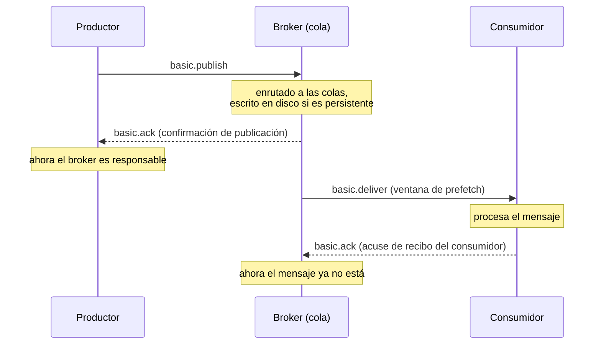

Ejemplo completo: [`L04.cs`](https://github.com/spareilleux/learn/blob/main/code/rabbitmq/csharp/L04.cs), con las confirmaciones de publicación en Java en [`L04.java`](https://github.com/spareilleux/learn/blob/main/code/rabbitmq/java/client/src/main/java/dev/learn/rabbitmq/L04.java). Entre dos de sus programas, [`check.sh`](https://github.com/spareilleux/learn/blob/main/code/rabbitmq/check.sh) reinicia el broker.

## Una cadena de custodia

«RabbitMQ perdió mi mensaje» suele significar que alguien entregó un mensaje sin comprobar que el otro lado lo había tomado. Un mensaje cambia de manos dos veces, y AMQP tiene un recibo para cada entrega:



Hasta que llega la confirmación, el productor es responsable del mensaje: si la conexión cae, solo el productor puede volver a enviarlo. Entre la entrega y el acuse de recibo, el broker guarda el mensaje y se lo da a otro si el consumidor desaparece. Esta lección rompe cada eslabón a propósito e imprime el resultado.

## Acuses de recibo del consumidor

Un consumidor elige, al llamar a `basic.consume`, entre dos modos. Con el **acuse de recibo automático** (`autoAck: true`), el broker da un mensaje por entregado en cuanto lo escribe en el socket. Con el **acuse de recibo manual**, el mensaje se queda en la cola, marcado como no confirmado, hasta que el consumidor envía `basic.ack` con su delivery tag.

Los programas simulan un fallo con un consumidor que procesa mensajes hasta uno concreto, luego deja de procesar nada, como un proceso muerto, y cierra su canal, que es lo que ve el broker cuando se pierde una conexión:

```csharp
ReceivedAsync += async (_, delivery) =>
{
    if (Crashed.Task.IsCompleted)
    {
        return;
    }
    var body = Text(delivery.Body);
    if (body == crashOn)
    {
        Console.WriteLine($"  consumer 1 crashes while handling {body}");
        Crashed.TrySetResult();
        return;
    }
    Console.WriteLine($"  consumer 1 handled {body}");
    if (!autoAck)
    {
        await Channel.BasicAckAsync(delivery.DeliveryTag, multiple: false);
    }
};
```

Un segundo consumidor lee después lo que queda. Con `autoAck: true` y cinco tareas:

```text
autoAck: true, 5 tasks
  consumer 1 handled task 1
  consumer 1 crashes while handling task 2
  work.autoack holds 0 message(s)
```

Las tareas 2 a 5 han desaparecido. El broker empujó las cinco al consumidor 1 en cuanto se suscribió, y las olvidó; el cliente las tenía en memoria cuando murió. La [guía de acuses de recibo](https://www.rabbitmq.com/docs/confirms#acknowledgement-modes) dice que el modo automático «should be considered unsafe» por esta razón. El mismo fallo con acuses de recibo manuales, y cuatro tareas:

```text
autoAck: false, prefetch 1, 4 tasks
  consumer 1 handled task 1
  consumer 1 crashes while handling task 2
  work.manual holds 3 message(s)
  consumer 2 handled task 2 redelivered=True
  consumer 2 handled task 3 redelivered=False
  consumer 2 handled task 4 redelivered=False
autoAck: false, prefetch unlimited, 4 tasks
  consumer 1 handled task 1
  consumer 1 crashes while handling task 2
  work.manual holds 3 message(s)
  consumer 2 handled task 2 redelivered=True
  consumer 2 handled task 3 redelivered=True
  consumer 2 handled task 4 redelivered=True
```

No se pierde nada: «any delivery (message) that was not acked is automatically requeued when the channel (or connection) on which the delivery happened is closed», en palabras de la guía. El indicador **`redelivered`** difiere entre las dos ejecuciones, y dice más sobre el prefetch que sobre el fallo:

- Con un **prefetch de 1**, el broker envía un mensaje, espera su acuse de recibo y luego envía el siguiente. El consumidor 1 nunca recibió las tareas 3 y 4, así que llegan al consumidor 2 con `redelivered=False`.
- **Sin límite de prefetch**, el broker envió todas las tareas al consumidor 1 de golpe. Las tareas 3 y 4 se habían entregado, aunque nunca se procesaron, así que vuelven con `redelivered=True`.

`redelivered=True` significa por tanto «puede que este mensaje ya se haya entregado», no «alguien empezó a procesarlo». Un consumidor no puede usarlo para saltarse trabajo; puede usarlo como indicio de que es posible un duplicado, de lo que trata la última sección.

## Rechazar un mensaje

Un consumidor que no puede procesar un mensaje envía [`basic.nack`](https://www.rabbitmq.com/docs/nack) o `basic.reject` (el original de AMQP, para un solo mensaje) con un indicador `requeue`. [`Nack`](https://github.com/spareilleux/learn/blob/main/code/rabbitmq/csharp/L04.cs) usa `basic.get` para mostrar cada paso, sobre una cola que contiene `task 1` y `task 2`:

```text
get task 1 delivery-tag=1 redelivered=False (then 1 ready)
  nack requeue=true: back in the queue, at its original position
get task 1 delivery-tag=2 redelivered=True (then 1 ready)
  reject requeue=false: discarded (or dead-lettered, lesson 6)
get task 2 delivery-tag=3 redelivered=False (then 0 ready)
  ack: removed
work.nack holds 0 message(s)
```

- `requeue: true` devolvió `task 1` **a la cabeza** de la cola, así que el siguiente `basic.get` lo devolvió otra vez, con un delivery tag nuevo y `redelivered=True`. La guía dice que un mensaje devuelto a la cola vuelve «to its original position in its queue, if possible». Un consumidor que hace nack con requeue de un mensaje que nunca podrá procesar crea un bucle que gira tan rápido como lo permite la red.
- `requeue: false` lo eliminó. Sin un dead-letter exchange, que configura la lección 6, eso significa borrado.
- Los **delivery tags** cuentan las entregas en un canal, 1, 2, 3, reentregas incluidas. Solo son válidos en el canal que los recibió: confirmar en otro canal lo cierra con un error `PRECONDITION_FAILED - unknown delivery tag`.

## Prefetch: la ventana del consumidor

`BasicQosAsync(prefetchSize: 0, prefetchCount: 3, global: false)` fija cuántos mensajes sin confirmar envía el broker a cada consumidor del canal. Un consumidor que nunca confirma, sobre una cola de diez:

```text
received 3, still ready in the queue: 7
channel closed, ready again: 10
```

El broker se detuvo en tres y guardó siete mensajes **listos** (*ready*) para otros consumidores; cerrar el canal volvió a dejar listos los tres sin confirmar. El prefetch es la forma en que RabbitMQ reparte el trabajo entre consumidores que compiten: un consumidor lento que retiene sus tres mensajes no recibe más, y los demás se llevan el resto. Una ventana ilimitada, el valor por defecto de un canal nuevo, deja que el broker empuje toda la cola a la memoria de un solo consumidor. La [guía del prefetch](https://www.rabbitmq.com/docs/consumer-prefetch) y la guía de acuses de recibo sugieren que «values in the 100 through 300 range usually offer optimal throughput»; el valor por defecto de 250 de Spring AMQP está en ese rango. Para un trabajo que tarda segundos por mensaje, un prefetch de 1 da el reparto más justo.

## Confirmaciones de publicación

El otro eslabón está entre el productor y el broker. Una publicación es «dispara y olvida»: que `BasicPublishAsync` termine solo significa que los bytes salieron del proceso. Con las [confirmaciones de publicación](https://www.rabbitmq.com/docs/confirms#publisher-confirms) activadas en el canal, el broker responde a cada publicación con `basic.ack` una vez que ha asumido la responsabilidad, o con `basic.nack` si la rechaza. RabbitMQ.Client 7 puede seguir las respuestas por ti:

```csharp
var options = new CreateChannelOptions(publisherConfirmationsEnabled: true, publisherConfirmationTrackingEnabled: true);
await using IChannel channel = await connection.CreateChannelAsync(options);
```

Con el seguimiento activado, `BasicPublishAsync` no termina hasta que llega la confirmación, y lanza una excepción si el broker rechaza o devuelve el mensaje. Cinco publicaciones, las dos últimas a una cola declarada con `x-max-length` 1 y `x-overflow` a `reject-publish`:

```csharp
await PublishAsync("orders.confirmed", mandatory: false, "order 1");
await PublishAsync("no-such-queue", mandatory: false, "order 2");
await PublishAsync("no-such-queue", mandatory: true, "order 3");
await PublishAsync("orders.limited", mandatory: false, "order 4");
await PublishAsync("orders.limited", mandatory: false, "order 5");
```

```text
#1 order 1 to orders.confirmed: confirmed
#2 order 2 to no-such-queue: confirmed
#3 order 3 to no-such-queue: PublishReturnException 312 NO_ROUTE
#4 order 4 to orders.limited: confirmed
#5 order 5 to orders.limited: PublishException IsReturn=False "Message rejected by broker."
```

Cada línea merece una lectura atenta:

1. **Confirmado** significa que el mensaje llegó a cada cola a la que se enrutó y, para un mensaje persistente en una cola durable, que se escribió en disco. El broker [escribe en disco por lotes](https://www.rabbitmq.com/docs/confirms#when-publishes-are-confirmed) «after an interval (a few hundred milliseconds)», así que las confirmaciones de mensajes persistentes tardan eso con poca carga.
2. **Un mensaje no enrutable también se confirma.** El broker «will issue a confirm once the exchange verifies a message won't route to any queue». El pedido 2 ha desaparecido, y la confirmación lo dice solo en el sentido de que el broker ya no tiene nada que hacer con él. Una confirmación no es una prueba de entrega.
3. **`mandatory` lo hace visible.** El broker envía `basic.return` antes del `basic.ack`, y el cliente convierte la pareja en una [`PublishReturnException`](https://github.com/rabbitmq/rabbitmq-dotnet-client/blob/740faf07f04ade7d35d3539e20613c6ac6b9b46f/projects/RabbitMQ.Client/Exceptions/PublishException.cs#L76-L113) que lleva el código y el texto de respuesta.
4. La cola limitada aceptó el pedido 4.
5. **Un nack.** Con `reject-publish`, una cola llena rechaza los mensajes nuevos y, según la [guía del límite de longitud](https://www.rabbitmq.com/docs/maxlength), «the publisher will be informed of the reject via a `basic.nack`». El cliente lanza una simple `PublishException` con `IsReturn=False`. La guía de confirmaciones dice además que, fuera de eso, solo se envía un nack cuando «an internal error occurs in the Erlang process responsible for a queue», por eso una cola llena es la forma más fácil de ver uno.

Los números `#1` a `#5` son los **números de secuencia de publicación** del canal, que `GetNextPublishSequenceNumberAsync` devuelve antes de cada publicación y a los que se refieren las confirmaciones.

El cliente Java te deja a ti la espera. `confirmSelect()` activa las confirmaciones, `waitForConfirms(timeout)` bloquea hasta que todas las publicaciones pendientes están confirmadas y devuelve `false` si alguna recibió un nack, y un `ReturnListener` recibe `basic.return`:

```java
// Pone el canal en modo confirmación: desde ahora el broker confirma (ack) o rechaza (nack) cada publicación, numerada desde 1.
channel.confirmSelect();
// Se ejecuta en el hilo de la conexión cuando llega basic.return, antes de la confirmación que lo sigue.
channel.addReturnListener(r -> System.out.println("   basic.return " + r.getReplyCode() + " " + r.getReplyText()));
```

```text
#1 order 1 to orders.confirmed: confirmed
#2 order 2 to no-such-queue: confirmed
   basic.return 312 NO_ROUTE
#3 order 3 to no-such-queue: confirmed
#4 order 4 to orders.limited: confirmed
#5 order 5 to orders.limited: nacked
```

El return listener imprimió su línea antes de que `waitForConfirms` volviera para el pedido 3: `basic.return` llega primero, como dice la guía. A diferencia del seguimiento del cliente .NET, el cliente Java informa ese mensaje como confirmado, y le toca a la aplicación relacionar la devolución con la publicación. Esperar cada confirmación por turno, como hacen ambos programas, es simple y lento; publicar un lote y esperar una vez, o publicar en paralelo con un límite de confirmaciones pendientes (el parámetro `outstandingPublisherConfirmationsRateLimiter` de `CreateChannelOptions`), es más rápido. La lección 11 mide la diferencia.

## Sobrevivir a un reinicio del broker

Un mensaje solo sobrevive a un reinicio si su cola es **durable** y el mensaje es **persistente** (`delivery_mode` 2, `DeliveryModes.Persistent`). El primer programa publica un mensaje persistente y uno transitorio en una cola durable, y luego intenta declarar una cola no durable:

```text
orders.durable holds 2 message(s), both confirmed
non-durable queue refused: 541 INTERNAL_ERROR - Feature `transient_nonexcl_queues` is deprecated.
By default, this feature is not permitted anymore.
The feature will be removed from a future major RabbitMQ version, regardless of the configuration; actual version to be determined.
To...
channel open: False, connection open: False
```

`check.sh` ejecuta entonces `docker restart` sobre el broker, y el segundo programa mira:

```text
orders.durable: persistent order
orders.transient: 404 NOT_FOUND - no queue 'orders.transient' in vhost '/'
```

El mensaje transitorio se perdió con el reinicio, aunque se había confirmado. La cola no durable nunca existió: RabbitMQ 4.3.5 se niega a crear una cola que no es ni durable ni exclusiva. [`rabbit_amqqueue.erl`](https://github.com/rabbitmq/rabbitmq-server/blob/0dde27bfdd1984ff7e157226fd97656854a7f359/deps/rabbit/src/rabbit_amqqueue.erl#L115-L119) declara la [funcionalidad obsoleta](https://www.rabbitmq.com/docs/deprecated-features) `transient_nonexcl_queues` en la fase `denied_by_default`, y el [código de declaración](https://github.com/rabbitmq/rabbitmq-server/blob/0dde27bfdd1984ff7e157226fd97656854a7f359/deps/rabbit/src/rabbit_amqqueue.erl#L234-L240) responde con un 541 `INTERNAL_ERROR`, un error de conexión: la última línea del programa muestra que se cerró toda la conexión, no solo el canal. Una aplicación antigua que declara colas `durable: false`, como hacían muchos tutoriales, falla en su primera declaración tras actualizar a 4.x. La obsolescencia se puede levantar en la configuración (`deprecated_features.permit.transient_nonexcl_queues = true`) hasta que se retire la funcionalidad, lo que está *por verificar* en 4.3.5.

El texto del error se corta en `To...`. Un texto de respuesta es una short string de AMQP, de 255 bytes como mucho, y el aviso es más largo; el texto completo está en el log del broker.

## Los duplicados son normales: consumidores idempotentes

Las reglas anteriores dan una entrega **al menos una vez** (*at-least-once*): un mensaje nunca se pierde una vez confirmado y persistido, y puede llegar más de una vez. Dos sucesos corrientes producen duplicados:

- un productor que no recibe una confirmación, porque la conexión cayó después de que el broker guardara el mensaje, lo publica de nuevo;
- un consumidor que procesó un mensaje y murió antes de que su acuse de recibo llegara al broker lo recibe de nuevo.

[`Idempotent`](https://github.com/spareilleux/learn/blob/main/code/rabbitmq/csharp/L04.cs) reproduce ambos. El productor envía `P-1` dos veces con el mismo ID de mensaje, como tras una confirmación perdida. El consumidor 1 cobra `P-2` y falla antes de confirmarlo. Los consumidores recuerdan los ID que ya han procesado:

```csharp
var id = delivery.BasicProperties.MessageId!;
if (processed.Add(id))
{
    balance += int.Parse(Text(delivery.Body));
    Console.WriteLine($"{name}: {id} redelivered={delivery.Redelivered} charged, balance {balance}");
}
else
{
    Console.WriteLine($"{name}: {id} redelivered={delivery.Redelivered} already processed, acknowledged without charging");
}
```

```text
consumer 1: P-1 redelivered=False charged, balance 30
consumer 1: P-1 redelivered=False already processed, acknowledged without charging
consumer 1: P-2 redelivered=False charged, balance 75
consumer 1: crashes before acknowledging P-2
consumer 2: P-2 redelivered=True already processed, acknowledged without charging
final balance 75
```

Sin la comprobación, el saldo sería 150. El duplicado `P-1` llegó con `redelivered=False`, ya que el broker entregó cada copia una vez: solo el ID del mensaje lo delata. En el programa, los ID procesados son un `HashSet<string>` compartido por los dos consumidores; en un servicio real son una tabla con una clave única sobre el ID del mensaje, actualizada en la misma transacción de base de datos que el saldo, para que «procesado» y «cobrado» no puedan discrepar. La lección 7 vuelve sobre ello con el patrón outbox, que resuelve el problema simétrico en el lado de la publicación.

## Qué protege qué

| Fallo | Sin protección | Protección |
|---|---|---|
| el consumidor falla con mensajes en la mano | perdidos con `autoAck: true` | acuses de recibo manuales |
| el consumidor falla tras procesar, antes de confirmar | procesado dos veces | consumidor idempotente (ID de mensaje) |
| un consumidor lento | el broker empuja la cola a su memoria | un límite de prefetch |
| cae la conexión del productor | el mensaje puede perderse | confirmaciones de publicación, y volver a publicar |
| reintento tras una confirmación perdida | duplicado | consumidor idempotente |
| nada enruta el mensaje | descartado, y aun así confirmado | `mandatory`, exchange alternativo |
| cola llena con `reject-publish` | rechazado | la confirmación es un nack: frenar, reintentar más tarde |
| reinicio del broker | mensajes transitorios perdidos | cola durable y mensajes persistentes |

## Puntos clave

- Un mensaje es responsabilidad del productor hasta la confirmación, y del broker hasta el acuse de recibo del consumidor. Cada «mensaje perdido» es un hueco en esa cadena.
- El acuse de recibo automático pierde todo lo que tenía un consumidor que falla. El acuse de recibo manual devuelve a la cola los mensajes sin confirmar cuando se cierra el canal.
- `redelivered=True` significa «quizá ya entregado», y depende de la ventana de prefetch; solo un ID de mensaje identifica un duplicado.
- El prefetch limita los mensajes sin confirmar de un consumidor. Si lo dejas ilimitado, un consumidor se lleva toda la cola; de 100 a 300 va bien para handlers rápidos, 1 para los lentos.
- Una confirmación de publicación significa «el broker asumió la responsabilidad», no «una cola lo recibió»: los mensajes no enrutables se confirman. Añade `mandatory` para saberlo. Una cola `reject-publish` llena responde con nack.
- Cola durable más mensaje persistente sobreviven a un reinicio. RabbitMQ 4.3 rechaza las colas no durables y no exclusivas con un error de conexión.
- La entrega es al menos una vez: haz idempotentes a los consumidores con un ID de mensaje guardado en la misma transacción que el efecto.

## Ejercicios

1. Ejecuta el fallo con acuses de recibo manuales y un prefetch de 2. ¿Qué tareas recibe el consumidor 2 con `redelivered=True`?

<details>
<summary>Solución</summary>

```text
autoAck: false, prefetch 2, 4 tasks
  consumer 1 handled task 1
  consumer 1 crashes while handling task 2
  work.manual holds 3 message(s)
  consumer 2 handled task 2 redelivered=True
  consumer 2 handled task 3 redelivered=True
  consumer 2 handled task 4 redelivered=False
```

El broker envió primero las tareas 1 y 2. Cuando el consumidor 1 confirmó la tarea 1, se abrió un hueco en la ventana y siguió la tarea 3, así que las tareas 2 y 3 estaban entregadas y sin confirmar cuando se cerró el canal. La tarea 4 nunca salió de la cola. El indicador te dice hasta dónde llegó la ventana, no hasta dónde llegó el consumidor; `check.sh` lo ejecuta como `l04-exercise-prefetch`.

</details>

2. El productor en C# vio el pedido 2 a `no-such-queue` como confirmado. Tu servicio publica en un exchange cuyos bindings gestiona otro equipo. ¿Qué dos cambios te permiten detectar un binding que falta, o sobrevivir a él, y qué cuesta cada uno?

<details>
<summary>Solución</summary>

- Publicar con **`mandatory: true`**. Con el seguimiento de confirmaciones, `BasicPublishAsync` lanza `PublishReturnException` 312 `NO_ROUTE`, como con el pedido 3, y el productor puede registrarlo, alertar o reintentar. El coste es una trama más por mensaje no enrutable y código de tratamiento en cada productor.
- Dar al exchange un **exchange alternativo**, preferiblemente mediante una política, como en la lección 2. Los mensajes no enrutables se guardan en una cola propia, incluso los de productores que no activan `mandatory`. El coste es una cola que vigilar y vaciar, y el riesgo de que se llene en silencio si nadie lo hace.

Las dos cosas juntas son habituales: el exchange alternativo lo atrapa todo, y `mandatory` se usa en los productores que deben saberlo de inmediato. Ten en cuenta que con un exchange alternativo el mensaje *sí* se enruta, así que `mandatory` ya no lo informa.

</details>

3. El mensaje transitorio en una cola durable se confirmó y luego se perdió con el reinicio. ¿Por qué un sistema publicaría aún mensajes transitorios a propósito?

<details>
<summary>Solución</summary>

Porque la persistencia cuesta una escritura en disco, y la confirmación la espera (unos cientos de milisegundos del intervalo de lote con poca carga, según la guía de confirmaciones). Los mensajes que no valen nada tras un reinicio, como el último precio de una divisa o una invalidación de caché que un servicio reiniciado ya no necesita, pueden ahorrársela. La cola durable y sus bindings sobreviven de todos modos, así que los consumidores encuentran su topología tras el reinicio, y solo se pierden los mensajes en tránsito. También conviene saber que RabbitMQ 4.3 ya no permite expresar «toda la cola es desechable» con una cola no durable, salvo una exclusiva ligada a una conexión. La diferencia de rendimiento entre mensajes persistentes y transitorios está *por verificar* en la lección 11.

</details>

## Fuentes

- RabbitMQ: [acuses de recibo de los consumidores y confirmaciones de publicación](https://www.rabbitmq.com/docs/confirms), [prefetch de los consumidores](https://www.rabbitmq.com/docs/consumer-prefetch), [acuses de recibo negativos](https://www.rabbitmq.com/docs/nack), [límite de longitud de las colas](https://www.rabbitmq.com/docs/maxlength), [colas y durabilidad](https://www.rabbitmq.com/docs/queues#durability), [funcionalidades obsoletas](https://www.rabbitmq.com/docs/deprecated-features), [guía de fiabilidad](https://www.rabbitmq.com/docs/reliability)
- Código fuente del cliente .NET en v7.2.2: [`CreateChannelOptions.cs`](https://github.com/rabbitmq/rabbitmq-dotnet-client/blob/740faf07f04ade7d35d3539e20613c6ac6b9b46f/projects/RabbitMQ.Client/CreateChannelOptions.cs#L89-L98), [`PublishException.cs`](https://github.com/rabbitmq/rabbitmq-dotnet-client/blob/740faf07f04ade7d35d3539e20613c6ac6b9b46f/projects/RabbitMQ.Client/Exceptions/PublishException.cs#L40-L113)
- Código fuente del servidor en v4.3.5: [`rabbit_amqqueue.erl`](https://github.com/rabbitmq/rabbitmq-server/blob/0dde27bfdd1984ff7e157226fd97656854a7f359/deps/rabbit/src/rabbit_amqqueue.erl#L2100-L2111)
- [Referencia completa de AMQP 0-9-1](https://www.rabbitmq.com/amqp-0-9-1-reference): `basic.ack`, `basic.nack`, `basic.qos`, `confirm.select`
