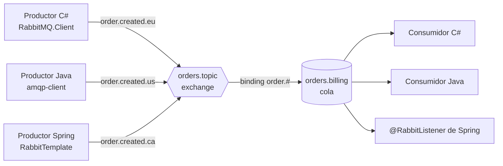

:::note[Versiones estudiadas]
[RabbitMQ](https://www.rabbitmq.com/docs) **4.3.5**, la última versión a 2026-09-15, en la imagen Docker oficial [`rabbitmq:4.3.5-management`](https://hub.docker.com/_/rabbitmq). Los clientes son [RabbitMQ.Client](https://www.nuget.org/packages/RabbitMQ.Client) **7.2.2** sobre .NET 10, el [cliente Java de RabbitMQ](https://www.rabbitmq.com/client-libraries/java-api-guide) **5.35.0** sobre Java 25, y [Spring AMQP](https://docs.spring.io/spring-amqp/reference/) **4.1.1** de Spring Boot 4.1.1. Cada ejemplo está en [`code/rabbitmq`](https://github.com/spareilleux/learn/tree/main/code/rabbitmq): [`check.sh`](https://github.com/spareilleux/learn/blob/main/code/rabbitmq/check.sh) ejecuta cada programa contra un broker recién creado y compara su salida con los archivos de [`expected`](https://github.com/spareilleux/learn/tree/main/code/rabbitmq/expected). La CI compila los clientes en Windows, Linux y macOS, y los ejecuta contra el broker solo en Linux, porque los runners de Windows y macOS de GitHub no tienen Docker.
:::

## Por qué aprendo esto

Llevo años enviando mensajes por RabbitMQ, casi siempre a través de una biblioteca que lo ocultaba: MassTransit en un proyecto, Spring AMQP en otro. Funcionó hasta el día en que dejó de hacerlo. Un consumidor se reinició y algunos pedidos se procesaron dos veces; otra vez, desaparecieron mensajes y nadie supo decir adónde habían ido. Cada vez me di cuenta de que conocía la API de la biblioteca y no el broker que había debajo.

Quiero saber qué hace realmente RabbitMQ con un mensaje desde que un productor lo envía hasta que un consumidor confirma su recepción, para poder diseñar una topología a conciencia, elegir el tipo de cola adecuado y averiguar qué salió mal con las herramientas del propio broker.

## Para quién es este curso

Eres desarrollador de C# o Java. Has publicado o consumido mensajes, quizá a través de MassTransit, NServiceBus, Spring AMQP o Spring Cloud Stream, y ya has ejecutado un contenedor. No necesitas conocer AMQP. La parte de Java supone el nivel de [Java para desarrolladores C#](../java-for-csharp/); la lección 3 remite las preguntas sobre Spring a [Spring Boot, Spring Cloud y Reactor para desarrolladores C#](../spring-cloud-reactor/), y la lección 1 las preguntas sobre contenedores a [Contenedores WSL](../wsl-containers/).

## El ejemplo conductor

Las lecciones usan flujos pequeños y reconocibles en lugar de una sola aplicación: líneas de log enrutadas por gravedad, precios difundidos a varias pantallas, pedidos y pagos. Un programa en C# ([`code/rabbitmq/csharp`](https://github.com/spareilleux/learn/tree/main/code/rabbitmq/csharp)), un programa con el cliente Java y una aplicación Spring Boot ([`code/rabbitmq/java`](https://github.com/spareilleux/learn/tree/main/code/rabbitmq/java)) intercambian los mismos mensajes, porque un broker es el lugar donde se encuentran lenguajes distintos.

Ninguno de los repositorios de GuitarAlchemist usa RabbitMQ en su código, así que todavía no hay un caso práctico sacado de ellos; el [diario](journal/) anota la única configuración que encontré.

## Al final de este curso, sabré

- explicar el modelo AMQP 0-9-1: conexiones, canales, exchanges, bindings, colas y mensajes;
- ejecutar RabbitMQ en un contenedor e inspeccionarlo con la interfaz de gestión, `rabbitmqctl` y `rabbitmq-diagnostics`;
- diseñar una topología con exchanges direct, fanout, topic y headers, y tratar los mensajes que nada enruta;
- escribir productores y consumidores en C#, en Java y con Spring AMQP que interoperen;
- decir quién es responsable de un mensaje en cada paso, y usar acuses de recibo, prefetch, confirmaciones de publicación y persistencia para no perder ninguno;
- elegir entre colas clásicas, colas quorum y streams;
- tratar los fallos con dead lettering, TTL y reintentos;
- operar un clúster, asegurarlo, monitorizarlo y dimensionarlo;
- mantener RabbitMQ en el tiempo: actualizaciones, definiciones, Kubernetes.

## Plan

| # | Lección | Lo que quizá ya conoces |
|---|---|---|
| 1 | [Primeros pasos](01-getting-started/) | una cola vista desde MassTransit o Spring, `docker run` |
| 2 | [Topología: exchanges, bindings y colas](02-topology/) | los topics y reglas de suscripción de Azure Service Bus, los destinos JMS |
| 3 | [Clientes en C#, Java y Spring AMQP](03-clients/) | la vida de un `HttpClient`, los consumidores `async`, `RabbitTemplate` |
| 4 | [Fiabilidad: acuses de recibo, prefetch, confirmaciones](04-reliability/) | las transacciones de base de datos, la entrega al menos una vez |
| 5 | Tipos de colas: clásicas, quorum y streams *(la próxima)* | Raft, las particiones de Kafka |
| 6 | Errores: dead lettering, TTL, reintentos y mensajes diferidos | los reintentos de Polly, las colas de error de MassTransit |
| 7 | Patrones: work queues, publish/subscribe, RPC, consumidores en competencia, outbox | el outbox transaccional de MassTransit o de Spring Modulith |
| 8 | Clustering y alta disponibilidad: particiones de red, quorum | los clústeres de conmutación por error |
| 9 | Seguridad: virtual hosts, usuarios, permisos, TLS | las cadenas de conexión, los certificados en Kestrel |
| 10 | Observabilidad: Prometheus, Grafana, métricas clave, alarmas, control de flujo | OpenTelemetry, `dotnet-counters` |
| 11 | Rendimiento y dimensionamiento, medidos | BenchmarkDotNet |
| 12 | Otros protocolos: streams y super streams, MQTT, AMQP 1.0; RabbitMQ y Kafka | Kafka, Azure Event Hubs |
| 13 | Operaciones: actualizaciones, definiciones, el Cluster Operator de Kubernetes | los charts de Helm, las actualizaciones progresivas |

[Diario](journal/): lo que probé, lo que me sorprendió, lo que aún tengo que verificar.

## Recursos

- [Documentación de RabbitMQ](https://www.rabbitmq.com/docs), en particular [AMQP 0-9-1 model explained](https://www.rabbitmq.com/tutorials/amqp-concepts), los [exchanges](https://www.rabbitmq.com/docs/exchanges), las [colas](https://www.rabbitmq.com/docs/queues), los [acuses de recibo de los consumidores y confirmaciones de publicación](https://www.rabbitmq.com/docs/confirms), y las [recomendaciones para despliegues en producción](https://www.rabbitmq.com/docs/production-checklist)
- [Tutoriales de RabbitMQ](https://www.rabbitmq.com/tutorials), en C# y Java entre otros lenguajes
- [Guía de la API del cliente .NET](https://www.rabbitmq.com/client-libraries/dotnet-api-guide) y [guía de la API del cliente Java](https://www.rabbitmq.com/client-libraries/java-api-guide)
- [Referencia de Spring AMQP](https://docs.spring.io/spring-amqp/reference/) y [el capítulo de mensajería de Spring Boot](https://docs.spring.io/spring-boot/reference/messaging/amqp.html)
- [Referencia completa de AMQP 0-9-1](https://www.rabbitmq.com/amqp-0-9-1-reference): cada método y cada campo del protocolo
- Código fuente: [rabbitmq-server](https://github.com/rabbitmq/rabbitmq-server), [rabbitmq-dotnet-client](https://github.com/rabbitmq/rabbitmq-dotnet-client), [rabbitmq-java-client](https://github.com/rabbitmq/rabbitmq-java-client), [la imagen Docker](https://github.com/docker-library/rabbitmq)
