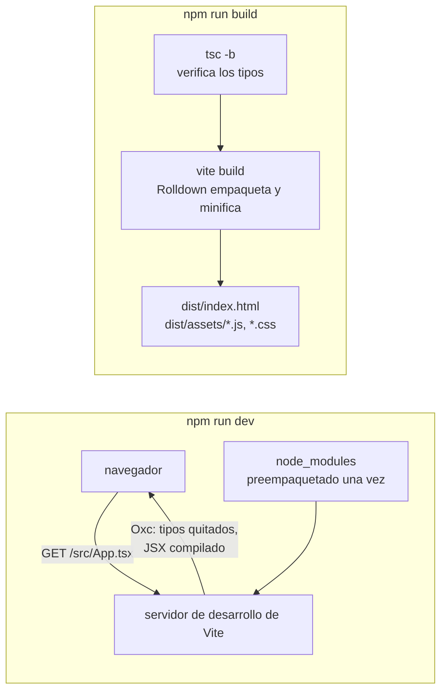

import { Tabs, TabItem } from '@astrojs/starlight/components';

Código: la aplicación del curso en [`code/react-vite`](https://github.com/spareilleux/learn/tree/3f7a5df/code/react-vite), su [`vite.config.ts`](https://github.com/spareilleux/learn/blob/3f7a5df/code/react-vite/vite.config.ts), y los scripts que capturan las salidas de esta lección: [`scripts/dev-start.mjs`](https://github.com/spareilleux/learn/blob/3f7a5df/code/react-vite/scripts/dev-start.mjs), [`scripts/dev-module.mjs`](https://github.com/spareilleux/learn/blob/3f7a5df/code/react-vite/scripts/dev-module.mjs) y [`scripts/hmr.mjs`](https://github.com/spareilleux/learn/blob/3f7a5df/code/react-vite/scripts/hmr.mjs).

## Qué es Vite, para un desarrollador .NET o Java

Un front end web .NET empieza con `dotnet new blazorwasm`, se ejecuta con `dotnet watch` y se publica con `dotnet publish`; MSBuild lo compila todo antes de que nada se ejecute. Un proyecto React empieza con `create-vite`, se ejecuta con `vite` y se publica con `vite build`, y entre medias, [Vite](https://vite.dev/) cumple dos papeles que .NET confía a una sola herramienta:

| | .NET (Blazor) | Java (Maven) | Vite |
|---|---|---|---|
| Crear un proyecto | `dotnet new blazorwasm` | `mvn archetype:generate` | `npm create vite`, que ejecuta `create-vite` |
| Archivos de proyecto | `.csproj` | `pom.xml` | `package.json`, `vite.config.ts`, `tsconfig.json` |
| Bucle de desarrollo | `dotnet watch`: recompilar, luego hot reload | recompilar, reiniciar | un servidor de desarrollo que compila cada archivo cuando el navegador lo pide |
| Verificación de tipos | el compilador, parte de cada build | `javac`, parte de cada build | `tsc`, un paso aparte que Vite no ejecuta |
| Build de producción | `dotnet publish` | `mvn package` | `vite build`: archivos HTML, JavaScript y CSS estáticos |

Durante el desarrollo, Vite es un **servidor**: el navegador carga `index.html`, luego pide cada módulo, y Vite compila el TypeScript y el JSX de cada archivo en ese momento, con [Oxc](https://oxc.rs/), un compilador escrito en Rust. Para producción, Vite es un **bundler**: [Rolldown](https://rolldown.rs/), también en Rust, empaqueta y minifica la aplicación en unos pocos archivos. [Vite 8](https://vite.dev/blog/announcing-vite8), publicado en marzo de 2026, sustituyó las dos herramientas que las versiones anteriores usaban para esas tareas, esbuild y Rollup, por Rolldown y Oxc.



El curso usa las versiones vigentes el 15 de septiembre de 2026: **Vite 8.3.0** con [`@vitejs/plugin-react`](https://github.com/vitejs/vite-plugin-react/tree/main/packages/plugin-react) 6.1.1, **React 19.3.0**, y TypeScript 7.0.2, la versión del [curso de TypeScript](../../typescript-for-csharp-java/01-compiler-and-tooling/). Vite 8 requiere Node.js 20.19 o 22.12 y posteriores; el curso se ejecuta con Node.js 24.21.0, como los cursos de JavaScript y TypeScript.

## Crear el proyecto

[`create-vite`](https://vite.dev/guide/#scaffolding-your-first-vite-project) copia una plantilla en una carpeta nueva. `npm create vite` es la forma corta que muestra la documentación: npm convierte `npm create vite` en la ejecución del paquete `create-vite`. Los comandos de abajo fijan su versión y responden a sus preguntas con opciones, para que den el mismo resultado cada vez.

<Tabs syncKey="os">
<TabItem label="Windows">

```powershell
npx create-vite@9.2.1 guitar-app --template react-ts --no-interactive
Set-Location guitar-app
npm install
npm run dev
```

</TabItem>
<TabItem label="Linux / WSL">

```bash
npx create-vite@9.2.1 guitar-app --template react-ts --no-interactive
cd guitar-app
npm install
npm run dev
```

</TabItem>
<TabItem label="macOS">

```bash
npx create-vite@9.2.1 guitar-app --template react-ts --no-interactive
cd guitar-app
npm install
npm run dev
```

</TabItem>
</Tabs>

Sin `--no-interactive`, en una terminal, `create-vite` pregunta el nombre, el framework y la variante, y ofrece instalar y arrancar el proyecto. El `check.sh` del curso ejecuta el mismo comando en su carpeta `out`:

```text
│
◇  Scaffolding project in out/guitar-app...
│
└  Done. Now run:

  cd guitar-app
  npm install
  npm run dev
```

`create-vite --help` lista las demás plantillas, entre ellas `react-compiler-ts`, el mismo proyecto con el [React Compiler](https://react.dev/learn/react-compiler) que trata la lección 10, y una opción `--eslint` que sustituye oxlint por ESLint.

### Lo que contiene la plantilla

```text
.gitignore
.oxlintrc.json
README.md
index.html
package.json
public/favicon.svg
public/icons.svg
src/App.css
src/App.tsx
src/assets/hero.png
src/assets/react.svg
src/assets/vite.svg
src/index.css
src/main.tsx
tsconfig.app.json
tsconfig.json
tsconfig.node.json
vite.config.ts
```

| Archivo | Papel | Lo más parecido en .NET |
|---|---|---|
| `index.html` | el punto de entrada: Vite lo lee y sigue su `<script type="module">` | `wwwroot/index.html` en Blazor WebAssembly |
| `src/main.tsx` | monta el componente raíz en el elemento `root` | `Program.cs` |
| `src/App.tsx` | el componente raíz | `App.razor` |
| `vite.config.ts` | la configuración de Vite, con el plugin de React | la parte de build del `.csproj` |
| `tsconfig.json` | dos referencias de proyecto, una para el código del navegador y otra para `vite.config.ts` | una solución con dos proyectos |
| `tsconfig.app.json`, `tsconfig.node.json` | las opciones del compilador de cada proyecto | dos archivos `.csproj` |
| `package.json` | dependencias y scripts | referencias de paquetes y targets de build |
| `.oxlintrc.json` | las reglas de lint | `.editorconfig` y analizadores |
| `public/` | archivos copiados tal cual, con sus nombres | archivos estáticos de `wwwroot` |

`index.html` está en la raíz y no en `public`, porque para Vite es código fuente: [la guía](https://vite.dev/guide/#index-html-and-project-root) lo llama el punto de entrada del grafo de módulos. Su última línea carga `/src/main.tsx`, y `main.tsx` renderiza la aplicación:

```tsx
// src/main.tsx
import { StrictMode } from 'react';
import { createRoot } from 'react-dom/client';
import './index.css';
import App from './App.tsx';

createRoot(document.getElementById('root')!).render(
  <StrictMode>
    <App />
  </StrictMode>,
);
```

[`createRoot`](https://react.dev/reference/react-dom/client/createRoot) recibe un elemento del DOM, y `render` muestra un componente en él; a partir de ahí React es dueño de todo lo que hay dentro de ese elemento. [`StrictMode`](https://react.dev/reference/react/StrictMode) añade comprobaciones solo en desarrollo, que muestra la lección 3. El `!` es la aserción de no nulo de TypeScript ([lección 2 de TypeScript](../../typescript-for-csharp-java/02-structural-typing/)): `getElementById` devuelve `HTMLElement | null`, y la plantilla sabe que `index.html` tiene el elemento.

### package.json

```json
{
  "name": "guitar-app",
  "private": true,
  "version": "0.0.0",
  "type": "module",
  "scripts": {
    "dev": "vite",
    "build": "tsc -b && vite build",
    "lint": "oxlint",
    "preview": "vite preview"
  },
  "dependencies": {
    "react": "^19.2.8",
    "react-dom": "^19.2.8"
  },
  "devDependencies": {
    "@types/node": "^24.13.3",
    "@types/react": "^19.2.18",
    "@types/react-dom": "^19.2.7",
    "@vitejs/plugin-react": "^6.1.1",
    "oxlint": "^1.81.0",
    "typescript": "~6.0.2",
    "vite": "^8.3.0"
  }
}
```

`react` es la biblioteca que conoce los componentes y el estado, y `react-dom` la parte que actualiza el DOM del navegador; React Native sustituye la segunda por otro renderizador. Los paquetes `@types` contienen las declaraciones de tipos. La plantilla pide React `^19.2.8`, así que `npm install` obtiene hoy la 19.3.0, y TypeScript `~6.0.2`, que solo admite 6.0.x. El [`package.json`](https://github.com/spareilleux/learn/blob/3f7a5df/code/react-vite/package.json) propio del curso fija cada versión exactamente, añade Vitest, Testing Library y jsdom para las pruebas, y usa TypeScript 7.0.2, que verifica los mismos dos proyectos.

El script `build` ejecuta primero `tsc -b`, el `-b` de las referencias de proyecto, que verifica ambos proyectos, y `vite build` solo si `tsc` tiene éxito. Ese orden importa, y el resto de la lección muestra por qué.

## El servidor de desarrollo

`npm run dev` ejecuta `vite`:

```text

  VITE v8.3.0  ready in N ms

  ➜  Local:   http://localhost:5199/
  ➜  Network: use --host to expose
```

El puerto por defecto de Vite es 5173; los scripts del curso usan 5199 con `--strictPort`, que se detiene en lugar de elegir el siguiente puerto libre. En una terminal, Vite imprime además `press h + enter to show help`, los atajos para abrir el navegador, reiniciar o salir. El servidor arranca en una fracción de segundo sea cual sea el tamaño de la aplicación, porque todavía no compila nada: espera al navegador.

[`scripts/dev-module.mjs`](https://github.com/spareilleux/learn/blob/3f7a5df/code/react-vite/scripts/dev-module.mjs) arranca el mismo servidor con la [API JavaScript](https://vite.dev/guide/api-javascript) de Vite, pide una URL como lo haría el navegador e imprime la respuesta. Primero la página:

```html
GET / -> 200 text/html
<!doctype html>
<html lang="en">
  <head>
    <script type="module">import { injectIntoGlobalHook } from "/@react-refresh";
injectIntoGlobalHook(window);
window.$RefreshReg$ = () => {};
window.$RefreshSig$ = () => (type) => type;</script>

    <script type="module" src="/@vite/client"></script>

    <meta charset="UTF-8" />
    <meta name="viewport" content="width=device-width, initial-scale=1.0" />
    <title>React (Vite) course</title>
  </head>
  <body>
    <div id="root"></div>
    <script type="module" src="/src/main.tsx"></script>
  </body>
</html>
```

Vite añadió dos scripts a `index.html`: `/@vite/client`, que se conecta al servidor para recibir actualizaciones, y el preámbulo de React Refresh, del plugin de React. Después el navegador pide `/src/main.tsx`:

```js
GET /src/main.tsx -> 200 text/javascript
const StrictMode = __vite__cjsImport0_react["StrictMode"];const createRoot = __vite__cjsImport1_reactDom_client["createRoot"];const _jsxDEV = __vite__cjsImport4_react_jsxDevRuntime["jsxDEV"];import __vite__cjsImport0_react from "/node_modules/.vite/deps/react.js?v=HASH";
import __vite__cjsImport1_reactDom_client from "/node_modules/.vite/deps/react-dom_client.js?v=HASH";
import "/src/index.css";
import App from "/src/App.tsx";
var _jsxFileName = "src/main.tsx";
import __vite__cjsImport4_react_jsxDevRuntime from "/node_modules/.vite/deps/react_jsx-dev-runtime.js?v=HASH";
createRoot(document.getElementById("root")).render(/* @__PURE__ */ _jsxDEV(StrictMode, { children: /* @__PURE__ */ _jsxDEV(App, {}, void 0, false, {
	fileName: _jsxFileName,
	lineNumber: 8,
	columnNumber: 5
}, this) }, void 0, false, {
	fileName: _jsxFileName,
	lineNumber: 7,
	columnNumber: 3
}, this));

//# sourceMappingURL=data:application/json;base64,…
```

Ese archivo es lo que ejecuta el navegador, y cada cambio respecto al código fuente tiene una razón:

- **Los tipos han desaparecido**, incluido el `!` después de `getElementById`. Como en la [lección 1 de TypeScript](../../typescript-for-csharp-java/01-compiler-and-tooling/#un-error-de-tipo-no-detiene-nada), quitar los tipos no verifica nada.
- **El JSX se convirtió en llamadas de función**: `<StrictMode><App /></StrictMode>` es ahora `_jsxDEV(StrictMode, { children: _jsxDEV(App, {}) })`, con el nombre de archivo y la línea de cada elemento para que las advertencias de React puedan señalar el código fuente. La lección 2 abre esa transformación.
- **Los imports se convirtieron en URL**, porque el navegador carga los módulos por URL y no sabe nada de `node_modules`. `react` se sirve desde `/node_modules/.vite/deps/react.js`: Vite [preempaquetó](https://vite.dev/guide/dep-pre-bundling) cada dependencia en un solo archivo una vez, convirtió el paquete CommonJS de React en un módulo ES, de ahí los nombres `__vite__cjsImport`, y añadió un hash para la caché del navegador.
- **El CSS se importa como un módulo**: `import "/src/index.css"` devuelve un pequeño script que inserta los estilos en la página.
- **Un source map va en línea**, para que el depurador del navegador muestre `main.tsx` tal como lo escribiste. Las salidas del curso lo acortan a `…`.

Un desarrollador .NET puede compararlo con un archivo Razor compilado bajo demanda, un archivo por petición, con la diferencia de que el resultado va al navegador y no a la memoria del servidor. Por eso el arranque no depende del tamaño de la aplicación: una página que no está abierta nunca se compila.

## Hot module replacement y Fast Refresh

Edita un componente y guarda: la página cambia sin recargarse, y el componente conserva su estado. Dos mecanismos trabajan juntos. La [API HMR](https://vite.dev/guide/api-hmr) de Vite envía un mensaje a la página cuando un archivo cambia, y [React Refresh](https://github.com/facebook/react/tree/main/packages/react-refresh), la parte del plugin de React también llamada Fast Refresh, sustituye la función del componente conservando el estado que React guarda para él. El final de lo que el servidor envía para `App.tsx` muestra el código del plugin:

```js
// el final de GET /src/App.tsx, de expected/l01_dev_app.txt
_s(App, "oDgYfYHkD9Wkv4hrAPCkI/ev3YU=");
_c = App;
var _c;
$RefreshReg$(_c, "App");
import * as RefreshRuntime from "/@react-refresh";
const inWebWorker = typeof WorkerGlobalScope !== 'undefined' && self instanceof WorkerGlobalScope;
import * as __vite_react_currentExports from "/src/App.tsx";
if (import.meta.hot && !inWebWorker) {
  if (!window.$RefreshReg$) {
    throw new Error(
      "@vitejs/plugin-react can't detect preamble. Something is wrong."
    );
  }

  const currentExports = __vite_react_currentExports;
  queueMicrotask(() => {
    RefreshRuntime.registerExportsForReactRefresh("src/App.tsx", currentExports);
    import.meta.hot.accept((nextExports) => {
      if (!nextExports) return;
      const invalidateMessage = RefreshRuntime.validateRefreshBoundaryAndEnqueueUpdate("src/App.tsx", currentExports, nextExports);
      if (invalidateMessage) import.meta.hot.invalidate(invalidateMessage);
    });
  });
}
```

`$RefreshReg$` registra el componente `App` bajo su archivo y su nombre, y `_s(App, "…")` guarda una firma de los hooks que llama, aquí un `useState`. `import.meta.hot.accept` le dice a Vite que este módulo puede sustituirse a sí mismo: cuando el archivo cambia, la página importa la nueva versión, y React Refresh intercambia la función. Si la firma cambió, porque se añadió o quitó un hook, el estado antiguo ya no corresponde, y React monta el componente de nuevo.

[`scripts/hmr.mjs`](https://github.com/spareilleux/learn/blob/3f7a5df/code/react-vite/scripts/hmr.mjs) se conecta al WebSocket del servidor con el protocolo `vite-hmr`, como hace `/@vite/client`, pide los módulos de la página, edita el título en una copia de `App.tsx` e imprime lo que envía el servidor:

```json
{
  "type": "connected"
}
{
  "type": "update",
  "updates": [
    {
      "type": "js-update",
      "timestamp": TIMESTAMP,
      "path": "/src/App.tsx",
      "acceptedPath": "/src/App.tsx",
      "explicitImportRequired": false,
      "isWithinCircularImport": false
    }
  ]
}
```

Un mensaje, para un módulo: la página volverá a importar `/src/App.tsx`, y nada más. El resto lo comprobé a mano en un navegador, en Windows: tras tres clics en el contador y dos en la cejilla, editar el título en `App.tsx` cambió el encabezado, el contador seguía diciendo 3 y la cejilla 2, y una variable definida en `window` antes de la edición seguía ahí, así que la página no se había recargado. Es el hot reload de `dotnet watch`, con la diferencia de que el estado sobrevive en un componente cuyo código cambió.

Fast Refresh tiene una condición, que la configuración de lint de la plantilla impone con `react/only-export-components`: un archivo que exporta componentes solo debería exportar componentes. Un archivo que además exporta una función o una constante no puede sustituirse con seguridad, y un cambio en él recarga la página. El curso guarda sus funciones auxiliares, como `transpose` en la lección 3, en archivos `.ts` propios.

## Un error de tipo llega a producción

Vite quita los tipos; no los verifica. El `check.sh` del curso copia la aplicación en `out/l01-type-error` y cambia una línea de `App.tsx`, de `count + 1` a `count + '1'`, y luego la construye:

```text
> npx vite build
vite v8.3.0 building client environment for production...
transforming...
✓ 24 modules transformed.
rendering chunks...
computing gzip size...
dist/index.html                   0.40 kB │ gzip:  0.27 kB
dist/assets/index-Cl5cuL7y.css    0.09 kB │ gzip:  0.11 kB
dist/assets/index-QMb0bu8p.js   222.62 kB │ gzip: 69.73 kB

✓ built in N ms
```

El build tiene éxito. Serví ese bundle con `vite preview` e hice clic en el botón dos veces: mostró `Count is 01`, y luego `Count is 011`, porque `count + '1'` concatena, como explica la [lección 2 de JavaScript](../../javascript-for-csharp-java/02-values-and-types/). `tsc -b` sobre la misma copia:

```text
> npx tsc -b --pretty false
src/App.tsx(10,53): error TS2345: Argument of type '(count: number) => string' is not assignable to parameter of type 'SetStateAction<number>'.
  Type '(count: number) => string' is not assignable to type '(prevState: number) => number'.
    Type 'string' is not assignable to type 'number'.
```

`tsc` termina con el código 1, y `npm run build`, que es `tsc -b && vite build`, se detiene antes de Vite. La [documentación de Vite](https://vite.dev/guide/features.html#transpile-only) lo dice sin rodeos: Vite solo transpila, la verificación de tipos corresponde al editor y al proceso de build, y sugiere `tsc --noEmit --watch` en una segunda terminal durante el desarrollo. Un proyecto cuyo script `build` es solo `vite build` publica todo lo que `tsc` habría rechazado; el [curso de TypeScript encontró un proyecto así en GA](../../typescript-for-csharp-java/01-compiler-and-tooling/#en-proyectos-reales).

## Construir para producción

`npm run build` sobre la aplicación del curso:

```text
> npx tsc -b --pretty false
> npx vite build
vite v8.3.0 building client environment for production...
transforming...
✓ 24 modules transformed.
rendering chunks...
computing gzip size...
dist/index.html                   0.40 kB │ gzip:  0.27 kB
dist/assets/index-Cl5cuL7y.css    0.09 kB │ gzip:  0.11 kB
dist/assets/index-BQ_Vbf-Q.js   222.62 kB │ gzip: 69.73 kB

✓ built in N ms
```

```text
> ls dist
assets/index-BQ_Vbf-Q.js
assets/index-Cl5cuL7y.css
index.html
```

Veinticuatro módulos se convirtieron en un archivo JavaScript y un archivo CSS, minificados por Oxc. La mayor parte de los 223 kB, 70 kB comprimidos, es React y React DOM. El hash de cada nombre de archivo cambia con el contenido: el error de tipo de arriba dio `index-QMb0bu8p.js` para un archivo del mismo tamaño. Un servidor puede entonces decir a los navegadores que guarden `assets/` en caché para siempre, ya que un nuevo build escribe nombres nuevos, y solo hay que revalidar `index.html`.

`dist` es un sitio estático: cualquier servidor web puede servirlo, incluidos los archivos estáticos de ASP.NET Core o la carpeta `static` de Spring Boot, que configura la lección 13. `npm run preview` ejecuta [`vite preview`](https://vite.dev/guide/cli.html#vite-preview), un servidor local para `dist` que [la documentación](https://vite.dev/guide/cli.html#vite-preview) dice que no se use como servidor de producción. Por defecto el bundle apunta a los navegadores de [Baseline](https://web.dev/baseline) Widely Available en una fecha fijada para cada versión mayor de Vite; para Vite 8, son Chrome y Edge 111, Firefox 114 y Safari 16.4 ([building for production](https://vite.dev/guide/build)).

:::note[Salidas en este curso]
Las salidas son las de Node.js 24.21.0, Vite 8.3.0, TypeScript 7.0.2 y Vitest 5.0.0. Las rutas se muestran relativas a la carpeta del curso, las duraciones como `N`, los hashes de caché del servidor de desarrollo como `HASH`, una marca de tiempo HMR como `TIMESTAMP`, y los source maps en línea como `…`; [`normalize.mjs`](https://github.com/spareilleux/learn/blob/3f7a5df/code/react-vite/normalize.mjs) hace los mismos cambios antes de que `check.sh` compare las salidas con las que se pegan aquí, en Windows, Linux y macOS.
:::

## En GuitarAlchemist/ga

La aplicación React principal de GA, [`ReactComponents/ga-react-components`](https://github.com/GuitarAlchemist/ga/tree/8cc8c5a17c685c779c46cd5e6d0a3f5d5036cc41/ReactComponents/ga-react-components), en el commit [`8cc8c5a`](https://github.com/GuitarAlchemist/ga/commit/8cc8c5a17c685c779c46cd5e6d0a3f5d5036cc41), es un proyecto Vite de una generación anterior: su `package.json` pide React [`^18.3.1`](https://github.com/GuitarAlchemist/ga/blob/8cc8c5a17c685c779c46cd5e6d0a3f5d5036cc41/ReactComponents/ga-react-components/package.json#L57), `@vitejs/plugin-react` [`^4.3.2`](https://github.com/GuitarAlchemist/ga/blob/8cc8c5a17c685c779c46cd5e6d0a3f5d5036cc41/ReactComponents/ga-react-components/package.json#L82) y Vite [`^5.4.8`](https://github.com/GuitarAlchemist/ga/blob/8cc8c5a17c685c779c46cd5e6d0a3f5d5036cc41/ReactComponents/ga-react-components/package.json#L92), es decir, esbuild y Rollup en lugar de Oxc y Rolldown. Su [script `build`](https://github.com/GuitarAlchemist/ga/blob/8cc8c5a17c685c779c46cd5e6d0a3f5d5036cc41/ReactComponents/ga-react-components/package.json#L11-L15) es `vite build` a secas, con `tsc -b` en dos scripts aparte, `build:with-types` y `typecheck`.

Su `vite.config.ts` tiene 3005 líneas, y muestra hasta dónde puede llegar el servidor de desarrollo. La [configuración en sí](https://github.com/GuitarAlchemist/ga/blob/8cc8c5a17c685c779c46cd5e6d0a3f5d5036cc41/ReactComponents/ga-react-components/vite.config.ts#L2839-L2869) lista seis plugins, escucha en el puerto 5176 en todas las interfaces de red, y redirige `/api`, `/hubs` y `/graphql` al backend ASP.NET Core en el puerto 5232, y `/proxy/ollama` a un servidor Ollama local. Cuatro de los plugins añaden middleware con [`configureServer`](https://vite.dev/guide/api-plugin.html#configureserver): uno solo de ellos [registra 27 manejadores](https://github.com/GuitarAlchemist/ga/blob/8cc8c5a17c685c779c46cd5e6d0a3f5d5036cc41/ReactComponents/ga-react-components/vite.config.ts#L1438-L1451), 23 de ellos bajo `/dev-data/`, que sirven como JSON el backlog del repositorio, los informes de calidad y la actividad de los agentes. Un [comentario](https://github.com/GuitarAlchemist/ga/blob/8cc8c5a17c685c779c46cd5e6d0a3f5d5036cc41/ReactComponents/ga-react-components/vite.config.ts#L57-L64) explica que un túnel de Cloudflare expone este servidor de desarrollo como el sitio de demostración público, de modo que toda petición parece local, y una función comprueba la cabecera `Host` para mantener privados los endpoints de control. El servidor de desarrollo es un servidor web Node.js, y GA lo usa como tal; `vite build` no escribe nada de ese middleware en `dist`, y un despliegue estático no tendría ninguno de esos endpoints.

[`Apps/ga-client`](https://github.com/GuitarAlchemist/ga/blob/8cc8c5a17c685c779c46cd5e6d0a3f5d5036cc41/Apps/ga-client/package.json#L11) es la otra aplicación React. Su script `dev` imprime que es el cliente de demostración heredado, y termina con un error para que su servidor Vite no ocupe el puerto del principal; `dev:legacy` lo arranca de todos modos.

## Puntos clave

- Vite es un servidor de desarrollo que compila cada archivo cuando el navegador lo pide, y un bundler, Rolldown, para producción. Vite 8 usa Oxc y Rolldown donde las versiones anteriores usaban esbuild y Rollup.
- `index.html` es el punto de entrada; `main.tsx` monta el componente raíz con `createRoot`.
- El servidor de desarrollo quita los tipos, compila el JSX a llamadas de función, convierte los imports en URL y sirve las dependencias preempaquetadas.
- HMR envía una actualización por módulo cambiado, y Fast Refresh sustituye un componente conservando su estado, siempre que su archivo exporte solo componentes.
- Vite nunca verifica los tipos: mantén `tsc -b` antes de `vite build`, como hace el script `build` de la plantilla.
- `vite build` escribe un sitio estático con nombres de archivo basados en el hash del contenido, para cualquier servidor web.

## Ejercicios

1. Genera la plantilla con `create-vite` 9.2.1, y compara su `package.json` y su `tsconfig.app.json` con el [`package.json`](https://github.com/spareilleux/learn/blob/3f7a5df/code/react-vite/package.json) y el [`tsconfig.app.json`](https://github.com/spareilleux/learn/blob/3f7a5df/code/react-vite/tsconfig.app.json) del curso. ¿Qué cambió el curso, y por qué?

<details>
<summary>Solución</summary>

Las diferencias, a partir de los archivos de la plantilla de arriba y los del curso:

| | Plantilla | Curso | Por qué |
|---|---|---|---|
| Versiones | rangos: `^19.2.8`, `~6.0.2` | exactas: `19.3.0`, `7.0.2` | las salidas pegadas en las lecciones no deben cambiar cuando se publica una nueva versión |
| TypeScript | 6.0 | 7.0.2 | la versión del curso de TypeScript, y `tsc -b` da el mismo resultado en este proyecto |
| Pruebas | ninguna | `vitest`, `jsdom`, `@testing-library/react`, `@testing-library/dom`, `@testing-library/user-event` | cada componente de las lecciones 2 a 4 tiene una prueba |
| `strict` | no escrito: es el valor por defecto desde TypeScript 6.0 | escrito explícitamente | el código copiado a un proyecto más antiguo sigue fallando de forma visible, como argumenta la [lección 1 de TypeScript](../../typescript-for-csharp-java/01-compiler-and-tooling/#tsconfigjson) |
| `allowArbitraryExtensions` | activado, para imports como `.png` con un archivo de declaración | ausente | el curso no importa recursos |
| `vite.config.ts` | el plugin de React | añade una sección `test` para Vitest | las pruebas se ejecutan en jsdom, un DOM escrito en JavaScript |
| `create-vite` | — | una dependencia de desarrollo | `check.sh` ejecuta la generación de esta lección con la versión fijada |

El curso también quitó la página de demostración de la plantilla, sus imágenes y su CSS, y dejó `index.html`, `main.tsx`, el `tsconfig.json` de dos proyectos y la configuración de lint tal como estaban.

</details>

2. En una copia de la aplicación, haz que `npm run build` falle por un error de tipo, y luego haz que `vite build` a secas lo publique. ¿Qué códigos de salida obtienes, y qué muestra el botón en la página construida?

<details>
<summary>Solución</summary>

Es el experimento de [Un error de tipo llega a producción](#un-error-de-tipo-llega-a-producción), que `check.sh` ejecuta en cada ejecución de la CI: `vite build` termina con el código 0 y escribe `dist`, `tsc -b` termina con el código 1, y `npm run build` se detiene después de `tsc`, así que `dist` no se escribe. En la página construida solo por `vite build`, el primer clic muestra `Count is 01`: el `0` inicial es un número, `0 + '1'` es la cadena `'01'`, y el clic siguiente da `'011'`.

</details>

3. Este sitio se sirve bajo `/learn`. Construye la aplicación para un sitio servido bajo `/learn/react-vite/`, y averigua qué cambia en `dist/index.html`.

<details>
<summary>Solución</summary>

La opción [`base`](https://vite.dev/config/shared-options.html#base), en `vite.config.ts` o en la línea de comandos:

```text
> npx vite build --base /learn/react-vite/ --outDir out/l01-base
vite v8.3.0 building client environment for production...
transforming...
✓ 24 modules transformed.
rendering chunks...
computing gzip size...
out/l01-base/index.html                   0.43 kB │ gzip:  0.28 kB
out/l01-base/assets/index-Cl5cuL7y.css    0.09 kB │ gzip:  0.11 kB
out/l01-base/assets/index-BQ_Vbf-Q.js   222.62 kB │ gzip: 69.73 kB

✓ built in N ms
```

```html
<!doctype html>
<html lang="en">
  <head>
    <meta charset="UTF-8" />
    <meta name="viewport" content="width=device-width, initial-scale=1.0" />
    <title>React (Vite) course</title>
    <script type="module" crossorigin src="/learn/react-vite/assets/index-BQ_Vbf-Q.js"></script>
    <link rel="stylesheet" crossorigin href="/learn/react-vite/assets/index-Cl5cuL7y.css">
  </head>
  <body>
    <div id="root"></div>
  </body>
</html>
```

El script y la hoja de estilos empiezan ahora por `/learn/react-vite/`, y el archivo JavaScript tiene el mismo hash que antes, así que su contenido no cambió. Vite también movió el `<script>` al `<head>` y quitó el que cargaba `/src/main.tsx`. Sin `base`, una página servida en `/learn/react-vite/` pediría `/assets/index-….js` en la raíz del dominio, y recibiría un 404. En `check.sh`, el comando se ejecuta con `MSYS_NO_PATHCONV=1`: Git Bash en Windows convierte un argumento que empieza por `/` en una ruta de Windows, y la primera versión de la salida del curso decía `/Program Files/Git/learn/react-vite/assets/…`.

</details>

## Fuentes

- [Vite — Getting started](https://vite.dev/guide/), [Why Vite](https://vite.dev/guide/why), [Features: TypeScript](https://vite.dev/guide/features.html#typescript), [Dependency pre-bundling](https://vite.dev/guide/dep-pre-bundling), [HMR API](https://vite.dev/guide/api-hmr), [Building for production](https://vite.dev/guide/build), [CLI](https://vite.dev/guide/cli), [Announcing Vite 8](https://vite.dev/blog/announcing-vite8)
- [React — Build a React app from scratch](https://react.dev/learn/build-a-react-app-from-scratch), [`createRoot`](https://react.dev/reference/react-dom/client/createRoot), [`StrictMode`](https://react.dev/reference/react/StrictMode), [React 19.3](https://react.dev/blog/2026/09/09/react-19-3)
- [`@vitejs/plugin-react`](https://github.com/vitejs/vite-plugin-react/tree/main/packages/plugin-react), [React Refresh](https://github.com/facebook/react/tree/main/packages/react-refresh), [Oxc](https://oxc.rs/), [Rolldown](https://rolldown.rs/)
- [Microsoft — .NET hot reload con dotnet watch](https://learn.microsoft.com/aspnet/core/test/hot-reload)
