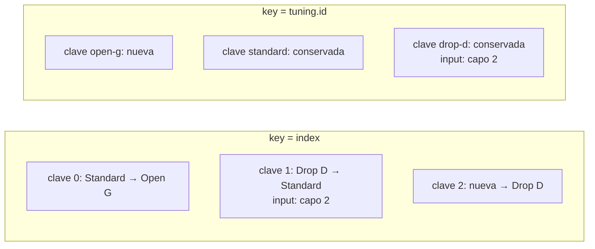

Código: [`src/l02`](https://github.com/spareilleux/learn/tree/3f7a5df/code/react-vite/src/l02), los fragmentos de error [`errors/l02_props.tsx`](https://github.com/spareilleux/learn/blob/3f7a5df/code/react-vite/errors/l02_props.tsx), [`errors/l02_html.tsx`](https://github.com/spareilleux/learn/blob/3f7a5df/code/react-vite/errors/l02_html.tsx) y [`errors/l02_children.tsx`](https://github.com/spareilleux/learn/blob/3f7a5df/code/react-vite/errors/l02_children.tsx), y las soluciones de los ejercicios en [`src/solutions`](https://github.com/spareilleux/learn/tree/3f7a5df/code/react-vite/src/solutions). Cada prueba imprime lo que renderiza, y `check.sh` compara esa salida con la que se pega aquí.

## Un componente es una función

En Blazor, un componente es un archivo `.razor` que el compilador convierte en una clase: sus entradas son propiedades marcadas con `[Parameter]`, y el marcado que las rodea se convierte en un método que construye un árbol de render. En WPF, un `UserControl` es un archivo XAML y una clase de code-behind, con propiedades de dependencia para sus entradas. Un [componente React](https://react.dev/learn/your-first-component) es una función: recibe un objeto, sus **props**, y devuelve lo que hay que mostrar.

```tsx
// src/l02/TuningCard.tsx
import type { ReactNode } from 'react';

// Las props de un componente son un solo objeto, descrito por un tipo
export interface TuningCardProps {
  name: string;
  notes: readonly string[];
  capo?: number;
  children?: ReactNode;
}

// Un componente es una función que recibe sus props y devuelve lo que hay que renderizar
export function TuningCard({ name, notes, capo = 0, children }: TuningCardProps) {
  return (
    <article className="tuning-card">
      <h2>{name}</h2>
      <p>
        {notes.join(' ')}, capo {capo}
      </p>
      {children}
    </article>
  );
}
```

El mismo componente en Blazor tendría este aspecto; está aquí para comparar, y el curso no lo compila.

```razor
@* TuningCard.razor *@
<article class="tuning-card">
    <h2>@Name</h2>
    <p>@string.Join(" ", Notes), capo @Capo</p>
    @ChildContent
</article>

@code {
    [Parameter, EditorRequired] public string Name { get; set; } = "";
    [Parameter, EditorRequired] public IReadOnlyList<string> Notes { get; set; } = [];
    [Parameter] public int Capo { get; set; }
    [Parameter] public RenderFragment? ChildContent { get; set; }
}
```

| | Blazor | React |
|---|---|---|
| Entradas | una propiedad por `[Parameter]` | un objeto de props, tipado por una interfaz |
| Entrada obligatoria | `[EditorRequired]`, una advertencia | una propiedad sin `?`, un error de `tsc` |
| Valor por defecto | un inicializador de propiedad | un valor por defecto en la desestructuración: `capo = 0` |
| Contenido entre las etiquetas | `RenderFragment ChildContent` | `children`, de tipo `ReactNode` |
| Marcado | Razor, con `@` delante del C# | JSX, con `{ }` alrededor del JavaScript |
| Se usa como | `<TuningCard Name="Drop D" Notes="dropD" />` | `<TuningCard name="Drop D" notes={dropD} />` |

La lista de parámetros usa la desestructuración, que trata la [lección 3 de JavaScript](../../javascript-for-csharp-java/03-functions-and-scope/): `{ name, notes, capo = 0, children }` lee cuatro propiedades del objeto de props, con un valor por defecto para `capo`. `readonly string[]` acepta cualquier array de cadenas y promete no modificarlo, como muestra la [lección 2 de TypeScript](../../typescript-for-csharp-java/02-structural-typing/#readonly). El nombre empieza por mayúscula, y eso es una regla, como muestran las secciones siguientes.

La prueba renderiza el componente con [React Testing Library](https://testing-library.com/docs/react-testing-library/intro) en [Vitest](https://vitest.dev/), e imprime el HTML que produjo:

```tsx
// src/l02/TuningCard.test.tsx
test('renders the props and the children', () => {
  const { container } = render(
    <TuningCard name="Drop D" notes={['D', 'A', 'D', 'G', 'B', 'E']} capo={2}>
      <p>Lower the sixth string by a whole tone.</p>
    </TuningCard>,
  );
  showHtml('<TuningCard>', container);
  expect(container.querySelector('h2')?.textContent).toBe('Drop D');
});
```

```text
✓ renders the props and the children
  <TuningCard>
  <div>
    <article
      class="tuning-card"
    >
      <h2>
        Drop D
      </h2>
      <p>
        D A D G B E
        , capo 
        2
      </p>
      <p>
        Lower the sixth string by a whole tone.
      </p>
    </article>
  </div>
```

`render` monta el componente en un `div` de un DOM simulado, [jsdom](https://github.com/jsdom/jsdom); el `div` exterior es ese contenedor. `className` se convirtió en `class`, y el párrafo entre las etiquetas ocupó el lugar de `{children}`. El párrafo muestra tres nodos de texto, porque `{notes.join(' ')}`, `, capo ` y `{capo}` son tres hijos del `p`; el navegador los muestra en una sola línea.

## El JSX son llamadas de función

El JSX no es HTML, y tampoco es un lenguaje de plantillas: es una sintaxis para llamadas de función. [`scripts/jsx.mjs`](https://github.com/spareilleux/learn/blob/3f7a5df/code/react-vite/scripts/jsx.mjs) compila `TuningCard.tsx` con Oxc, como hace `vite build`:

```js
import { jsx as _jsx, jsxs as _jsxs } from "react/jsx-runtime";
// Un componente es una función que recibe sus props y devuelve lo que hay que renderizar
export function TuningCard({ name, notes, capo = 0, children }) {
	return /* @__PURE__ */ _jsxs("article", {
		className: "tuning-card",
		children: [
			/* @__PURE__ */ _jsx("h2", { children: name }),
			/* @__PURE__ */ _jsxs("p", { children: [
				notes.join(" "),
				", capo ",
				capo
			] }),
			children
		]
	});
}
```

Cada elemento se convirtió en una llamada a `jsx` o `jsxs` de `react/jsx-runtime`, con el tipo del elemento y un objeto con sus props. Los hijos son una prop más, `children`: un solo valor, o un array cuando hay varios; `jsxs` es la variante para varios hijos escritos en el código fuente, una lista que React sabe fija y que no necesita claves. El import lo añade el compilador, y por eso el archivo no importa React: es el runtime "automático", seleccionado por `"jsx": "react-jsx"` en [`tsconfig.app.json`](https://www.typescriptlang.org/tsconfig/#jsx).

En la llamada, el tipo es una **cadena** para `article`, `h2` y `p`, y sería la **función** `TuningCard` para `<TuningCard />`. Esa es la regla de la mayúscula: el [manual de TypeScript](https://www.typescriptlang.org/docs/handbook/jsx.html) dice que un nombre JSX que empieza por minúscula es un elemento intrínseco, una etiqueta HTML, y un nombre que empieza por mayúscula es un valor en el ámbito, un componente.

¿Qué devuelve la llamada? La segunda prueba lo imprime:

```tsx
test('a JSX expression is an object that describes the element', () => {
  const element = <TuningCard name="Standard" notes={['E', 'A', 'D', 'G', 'B', 'E']} />;
  console.log(element.type === TuningCard, element.props, element.key);
});
```

```text
✓ a JSX expression is an object that describes the element
  true { name: 'Standard', notes: [ 'E', 'A', 'D', 'G', 'B', 'E' ] } null
```

Un [elemento React](https://react.dev/reference/react/createElement) es un objeto simple: un tipo, unas props y una clave. Crearlo no llamó a `TuningCard`; React llama a la función más tarde, cuando renderiza el elemento. Un componente devuelve un árbol de esos objetos, una descripción de la pantalla, y `react-dom` hace que el DOM coincida con esa descripción. Lo más parecido en Blazor es el código `RenderTreeBuilder` que escribe el compilador de Razor, con una diferencia de estilo: la descripción de React es un valor corriente que puedes guardar en una variable, pasar como prop o meter en un array.

Como el JSX es una expresión, JavaScript hace el resto: `{ }` contiene cualquier expresión, una condición es `? :` o `&&`, y un bucle es `map`, como muestran las lecciones siguientes. No hay `@if` ni `@foreach`. Las [reglas del JSX](https://react.dev/learn/writing-markup-with-jsx) se deducen de las llamadas de función: un componente devuelve una sola raíz, ya que una función devuelve un solo valor, y `<>…</>`, un [Fragment](https://react.dev/reference/react/Fragment), agrupa varios elementos sin añadir un nodo al DOM; toda etiqueta se cierra, `<br />` incluida.

## Lo que tsc verifica en el JSX

Las props son un tipo objeto, así que `tsc` las verifica como los argumentos de una llamada. [`errors/l02_props.tsx`](https://github.com/spareilleux/learn/blob/3f7a5df/code/react-vite/errors/l02_props.tsx) usa `TuningCard` de cuatro maneras incorrectas:

```text
errors/l02_props.tsx:7:8 - error TS2741: Property 'name' is missing in type '{ notes: string[]; }' but required in type 'TuningCardProps'.

7       <TuningCard notes={['E', 'A', 'D', 'G', 'B', 'E']} />
         ~~~~~~~~~~

  src/l02/TuningCard.tsx:5:3 - 'name' is declared here.
    5   name: string;
        ~~~~

errors/l02_props.tsx:8:72 - error TS2322: Type 'string' is not assignable to type 'number'.

8       <TuningCard name="Drop D" notes={['D', 'A', 'D', 'G', 'B', 'E']} capo="2" />
                                                                         ~~~~

  src/l02/TuningCard.tsx:7:3 - The expected type comes from property 'capo' which is declared here on type 'IntrinsicAttributes & TuningCardProps'
    7   capo?: number;
        ~~~~

errors/l02_props.tsx:9:33 - error TS2322: Type 'string' is not assignable to type 'readonly string[]'.

9       <TuningCard name="Open G" notes="D G D G B D" />
                                  ~~~~~

  src/l02/TuningCard.tsx:6:3 - The expected type comes from property 'notes' which is declared here on type 'IntrinsicAttributes & TuningCardProps'
    6   notes: readonly string[];
        ~~~~~

errors/l02_props.tsx:10:72 - error TS2322: Type '{ name: string; notes: string[]; strings: number; }' is not assignable to type 'IntrinsicAttributes & TuningCardProps'.
  Property 'strings' does not exist on type 'IntrinsicAttributes & TuningCardProps'.

10       <TuningCard name="DADGAD" notes={['D', 'A', 'D', 'G', 'A', 'D']} strings={6} />
                                                                          ~~~~~~~


Found 4 errors in the same file, starting at: errors/l02_props.tsx:7

exit 1
```

- Un atributo entre comillas es una cadena: `capo="2"` pasa la cadena `"2"`, y un número necesita llaves, `capo={2}`. Razor convierte `Capo="2"` en un `int` por ti; JSX no.
- Una prop desconocida es un error, como la [comprobación de propiedades sobrantes](../../typescript-for-csharp-java/02-structural-typing/#comprobación-de-propiedades-sobrantes) de un literal de objeto. `IntrinsicAttributes` añade las props que acepta todo componente, como `key`.

Los elementos HTML también están tipados, por `@types/react`, y sus props siguen los nombres de las propiedades del DOM más que los atributos del HTML. [`errors/l02_html.tsx`](https://github.com/spareilleux/learn/blob/3f7a5df/code/react-vite/errors/l02_html.tsx) está escrito como se escribiría en HTML:

```text
errors/l02_html.tsx:2:10 - error TS6133: 'tuningName' is declared but its value is never read.

2 function tuningName({ name }: { name: string }) {
           ~~~~~~~~~~

errors/l02_html.tsx:3:14 - error TS2322: Type '{ class: string; children: string; }' is not assignable to type 'DetailedHTMLProps<HTMLAttributes<HTMLHeadingElement>, HTMLHeadingElement>'.
  Property 'class' does not exist on type 'DetailedHTMLProps<HTMLAttributes<HTMLHeadingElement>, HTMLHeadingElement>'. Did you mean 'className'?

3   return <h2 class="tuning-name">{name}</h2>;
               ~~~~~

errors/l02_html.tsx:8:12 - error TS2322: Type '{ for: string; children: Element[]; }' is not assignable to type 'DetailedHTMLProps<LabelHTMLAttributes<HTMLLabelElement>, HTMLLabelElement>'.
  Property 'for' does not exist on type 'DetailedHTMLProps<LabelHTMLAttributes<HTMLLabelElement>, HTMLLabelElement>'. Did you mean 'htmlFor'?

8     <label for="capo">
             ~~~

errors/l02_html.tsx:9:7 - error TS2339: Property 'tuningName' does not exist on type 'JSX.IntrinsicElements'.

9       <tuningName name="Standard" />
        ~~~~~~~~~~~~~~~~~~~~~~~~~~~~~~

errors/l02_html.tsx:10:55 - error TS2322: Type '{ id: string; type: "number"; min: number; max: string; onchange: () => void; }' is not assignable to type 'DetailedHTMLProps<InputHTMLAttributes<HTMLInputElement>, HTMLInputElement>'.
  Property 'onchange' does not exist on type 'DetailedHTMLProps<InputHTMLAttributes<HTMLInputElement>, HTMLInputElement>'. Did you mean 'onChange'?

10       <input id="capo" type="number" min={0} max="12" onchange={() => {}} />
                                                         ~~~~~~~~


Found 5 errors in the same file, starting at: errors/l02_html.tsx:2

exit 1
```

- `class` y `for` son palabras reservadas en JavaScript, así que React les da el nombre de las propiedades del DOM, `className` y `htmlFor`, y [escribe la mayoría de los atributos en camelCase](https://react.dev/learn/writing-markup-with-jsx), `onChange` y `tabIndex` entre ellos. `aria-*` y `data-*` conservan sus guiones.
- `<tuningName />` empieza por minúscula, así que `tsc` lo busca entre las etiquetas HTML, en `JSX.IntrinsicElements`, y no lo encuentra. La función del mismo nombre queda entonces sin usar, de ahí el primer error.
- `min={0}` y `max="12"` se aceptan ambos: los tipos de `@types/react` admiten un número o una cadena para estos atributos, como hace el HTML.

## Children

`children` tiene el tipo [`ReactNode`](https://react.dev/learn/typescript#typing-children): lo que un componente puede renderizar. Es decir, un elemento, una cadena, un número, un booleano, `null` o `undefined`, que no renderizan nada, o un array de todo ello. Un componente debe devolver el mismo conjunto. [`errors/l02_children.tsx`](https://github.com/spareilleux/learn/blob/3f7a5df/code/react-vite/errors/l02_children.tsx) prueba otros valores:

```tsx
// errors/l02_children.tsx
import { dropD, standard } from '../src/l02/tunings.ts';

export function Favorite() {
  return <p>Favorite tuning: {standard}</p>;
}

export function Count({ tunings }: { tunings: readonly (typeof dropD)[] }) {
  return tunings.length > 0 ? tunings.map((tuning) => tuning.name) : undefined;
}

export function Nothing() {
  return;
}

export function Wrong() {
  return { name: 'Standard' };
}
```

```text
errors/l02_children.tsx:5:30 - error TS2322: Type 'Tuning' is not assignable to type 'ReactNode'.

5   return <p>Favorite tuning: {standard}</p>;
                               ~~~~~~~~~~

errors/l02_children.tsx:24:6 - error TS2786: 'Nothing' cannot be used as a JSX component.
  Its type '() => void' is not a valid JSX element type.
    Type '() => void' is not assignable to type '(props: any) => Promise<ReactNode> | ReactNode'.
      Type 'void' is not assignable to type 'Promise<ReactNode> | ReactNode'.

24     <Nothing />
        ~~~~~~~

errors/l02_children.tsx:25:6 - error TS2786: 'Wrong' cannot be used as a JSX component.
  Its type '() => { name: string; }' is not a valid JSX element type.
    Type '() => { name: string; }' is not assignable to type '(props: any) => Promise<ReactNode> | ReactNode'.
      Type '{ name: string; }' is not assignable to type 'Promise<ReactNode> | ReactNode'.

25     <Wrong />
        ~~~~~


Found 3 errors in the same file, starting at: errors/l02_children.tsx:5

exit 1
```

Un objeto no es un `ReactNode`: React no sabría cómo mostrar `{ id, name, notes }`. Una función que no devuelve nada, `void`, no puede ser un componente; devuelve `null` para no renderizar nada. `Count` compila: un array de cadenas y `undefined` son ambos `ReactNode`. El `Promise<ReactNode>` del mensaje está ahí para los [Server Components](https://react.dev/reference/rsc/server-components), que pueden ser `async`, y que la lección 12 sitúa en contexto.

## Listas y claves

Una lista es un array de elementos, construido con `map`:

```tsx
// src/l02/TuningList.tsx
export interface Tuning {
  id: string;
  name: string;
  notes: readonly string[];
}

// Una tarjeta por afinación: la clave le dice a React qué tarjeta es cuál de un render al siguiente
export function TuningList({ tunings }: { tunings: readonly Tuning[] }) {
  return (
    <section>
      {tunings.map((tuning) => (
        <TuningCard key={tuning.id} name={tuning.name} notes={tuning.notes} />
      ))}
    </section>
  );
}
```

Una vez compilado, la clave no está en las props: es el tercer argumento de `jsx`, y `TuningCard` nunca la recibe.

```js
export function TuningList({ tunings }) {
	return /* @__PURE__ */ _jsx("section", { children: tunings.map((tuning) => /* @__PURE__ */ _jsx(TuningCard, {
		name: tuning.name,
		notes: tuning.notes
	}, tuning.id)) });
}
```

Cuando un componente se renderiza de nuevo, React compara la nueva lista de elementos con la anterior para decidir qué nodos del DOM conservar, mover, crear o eliminar. Entre hermanos, la [clave](https://react.dev/learn/rendering-lists#keeping-list-items-in-order-with-key) dice qué elemento es cuál. Blazor tiene el mismo mecanismo con la directiva [`@key`](https://learn.microsoft.com/aspnet/core/blazor/components/element-component-model-relationships), que allí es opcional; en React, olvidarla tiene una advertencia y una regla de lint. [`TuningListNoKey.tsx`](https://github.com/spareilleux/learn/blob/3f7a5df/code/react-vite/src/l02/TuningListNoKey.tsx) es la misma lista sin clave:

```text
✓ without a key, the list renders and React warns
  console.error: Each child in a list should have a unique "key" prop.
  
  Check the render method of `TuningListNoKey`. See https://react.dev/link/warning-keys for more information.
```

La advertencia aparece solo en desarrollo, cuando la lista se renderiza, y la lista se renderiza correctamente. oxlint, con las reglas del `.oxlintrc.json` de la plantilla, la encuentra sin ejecutar nada. Aquí con `oxlint --format agent src`, el formato de una línea que oxlint también elige por sí mismo cuando lo ejecuta un agente de IA; en tu terminal, el formato por defecto dibuja la misma advertencia en un marco alrededor de las líneas 6 a 9:

```text
src/l02/TuningListNoKey.tsx:7:16: warning react(jsx-key): Missing "key" prop for element in iterator. help: Add a "key" prop to the element in the iterator (https://react.dev/learn/rendering-lists#keeping-list-items-in-order-with-key).
exit 0
```

Es la única advertencia sobre el código del curso, y es intencionada. Sin clave, React usa la posición, y `key={index}` hace lo mismo sin la advertencia. La posición es una buena identidad para una lista que nunca cambia de orden; falla cuando se inserta, se elimina o se mueve un elemento. [`TuningNotes.tsx`](https://github.com/spareilleux/learn/blob/3f7a5df/code/react-vite/src/l02/TuningNotes.tsx) lo muestra con un input cuyo texto vive en el DOM:

```tsx
// src/l02/TuningNotes.tsx
function NoteRow({ tuning }: { tuning: Tuning }) {
  return (
    <li>
      <label>
        {tuning.name} <input aria-label={`Note for ${tuning.name}`} />
      </label>
    </li>
  );
}

export function TuningNotesByIndex({ tunings }: { tunings: readonly Tuning[] }) {
  return (
    <ul>
      {tunings.map((tuning, index) => (
        <NoteRow key={index} tuning={tuning} />
      ))}
    </ul>
  );
}
```

`TuningNotesById` es la misma lista con `key={tuning.id}`. La prueba escribe "capo 2" junto a Drop D en cada lista, añade Open G al principio e imprime cada fila con el texto de su input:

```text
✓ key={index}: the typed text stays at its position when a tuning is added first
  key={index} [ 'Open G: ""', 'Standard: "capo 2"', 'Drop D: ""' ]
✓ key={tuning.id}: the typed text follows its tuning
  key={tuning.id} [ 'Open G: ""', 'Standard: ""', 'Drop D: "capo 2"' ]
```

Con el índice como clave, el elemento con clave 1 era Drop D y ahora es Standard: React conservó el nodo del DOM de la clave 1, input y texto escrito incluidos, y cambió su etiqueta. La nota pertenece ahora a la afinación equivocada, sin ningún error en ninguna parte. Con el id, React ve una clave nueva, `open-g`, crea una fila para ella y conserva las otras dos con su input. Lo mismo le ocurre al estado de un componente, que presenta la lección 3: el estado pertenece a una posición en el árbol, y la clave forma parte de esa posición.



La [documentación de React](https://react.dev/learn/rendering-lists#rules-of-keys) da las reglas: una clave es única entre sus hermanos, no cambia, y no se genera durante el renderizado. `key={Math.random()}` recrea cada elemento en cada render, y pierde lo que se había escrito. Una clave sale de los datos: un id de base de datos, o un valor que identifique el elemento, como un nombre que sea único en su lista.

## En GuitarAlchemist/ga

oxlint 1.83.0 con su regla `react/no-array-index-key`, sobre [`ga-react-components`](https://github.com/GuitarAlchemist/ga/tree/8cc8c5a17c685c779c46cd5e6d0a3f5d5036cc41/ReactComponents/ga-react-components/src) en el commit `8cc8c5a`, informa de 85 listas con el índice como clave, y de 6 en `Apps/ga-client`; `react/jsx-key` no encuentra ninguna lista sin clave. Muchas de las que leí son listas que nunca cambian, donde el índice es inofensivo. Dos de ellas cambian mientras el componente está en pantalla. [`DemerzelCriticOverlay.tsx`](https://github.com/GuitarAlchemist/ga/blob/8cc8c5a17c685c779c46cd5e6d0a3f5d5036cc41/ReactComponents/ga-react-components/src/components/PrimeRadiant/DemerzelCriticOverlay.tsx#L174-L192) dibuja las diez últimas puntuaciones de calidad como barras:

```tsx
{history.slice(-10).map((h, i) => (
  <div
    key={i}
    className="demerzel-critic__trend-bar"
    style={{
      height: `${h.quality * 10}%`,
      background: h.quality >= 7 ? '#33CC66' : h.quality >= 4 ? '#FFB300' : '#FF4444',
    }}
    title={`${h.quality}/10`}
  />
))}
```

El ejercicio 3 muestra lo que `key={i}` le hace a esa ventana deslizante. La otra, un panel cuyas filas desplegadas se recuerdan por índice, necesita estado, y está en la [lección 3](../03-state-and-rendering/#en-guitaralchemistga).

## Puntos clave

- Un componente es una función que va de un objeto de props a una descripción de la pantalla; su nombre empieza por mayúscula.
- El JSX se compila a llamadas `jsx(type, props, key)` que devuelven objetos simples; los hijos son la prop `children`.
- `tsc` verifica las props como argumentos de función: una prop que falta, desconocida o de tipo incorrecto es un error, y un valor entre comillas es una cadena.
- Los atributos HTML siguen los nombres del DOM: `className`, `htmlFor`, `onChange`.
- Un componente devuelve un `ReactNode`: un elemento, texto, un número, `null`, o un array de ellos, nunca un objeto simple.
- Una lista necesita claves que salgan de los datos. El índice solo sirve de clave para una lista que nunca cambia de orden.

## Ejercicios

1. Escribe un componente `ChordDiagram` que reciba el nombre de un acorde y seis trastes, de la sexta cuerda a la primera, donde `null` es una cuerda silenciada, y que renderice el nombre y un elemento de lista por cuerda, como `E: x` y `D: 0`. ¿Qué clave das a los elementos, y por qué es aceptable aquí?

<details>
<summary>Solución</summary>

[`src/solutions/l02_ex1/ChordDiagram.tsx`](https://github.com/spareilleux/learn/blob/3f7a5df/code/react-vite/src/solutions/l02_ex1/ChordDiagram.tsx):

```tsx
// Ejercicio 1: un acorde como seis cuerdas, de la sexta (mi grave) a la primera; null es una cuerda silenciada
export interface ChordDiagramProps {
  name: string;
  frets: readonly (number | null)[];
}

const stringNames = ['E', 'A', 'D', 'G', 'B', 'e'];

export function ChordDiagram({ name, frets }: ChordDiagramProps) {
  return (
    <figure>
      <figcaption>{name}</figcaption>
      <ol>
        {frets.map((fret, string) => (
          // Las seis cuerdas nunca se mueven, nunca se filtran y no guardan estado: su posición es su identidad
          <li key={string}>{`${stringNames[string]}: ${fret ?? 'x'}`}</li>
        ))}
      </ol>
    </figure>
  );
}
```

La clave es el índice, y aquí esa es la identidad: el elemento en la posición 0 es siempre la sexta cuerda. La lista nunca se ordena ni se filtra, y sus elementos no guardan estado. La plantilla de cadena crea un nodo de texto por elemento; `??` sustituye `null` por `x` y conserva `0`, donde `||` convertiría la cuerda al aire en una silenciada. La prueba renderiza re mayor:

```text
✓ renders D major with two muted strings
  <ChordDiagram>
  <div>
    <figure>
      <figcaption>
        D
      </figcaption>
      <ol>
        <li>
          E: x
        </li>
        <li>
          A: x
        </li>
        <li>
          D: 0
        </li>
        <li>
          G: 2
        </li>
        <li>
          B: 3
        </li>
        <li>
          e: 2
        </li>
      </ol>
    </figure>
  </div>
```

La regla `react/no-array-index-key` de oxlint, que la plantilla no activa, sigue señalando esta clave, igual que el `key={index}` de esta lección y del ejercicio 3:

```text
src/solutions/l02_ex1/ChordDiagram.tsx:16:15: error react(no-array-index-key): Usage of Array index in keys is not allowed help: Use a unique data-dependent key to avoid unnecessary rerenders
src/solutions/l02_ex3/TrendBars.tsx:11:15: error react(no-array-index-key): Usage of Array index in keys is not allowed help: Use a unique data-dependent key to avoid unnecessary rerenders
src/l02/TuningNotes.tsx:18:18: error react(no-array-index-key): Usage of Array index in keys is not allowed help: Use a unique data-dependent key to avoid unnecessary rerenders
```

Una regla no distingue una lista fija de una que cambia; el comentario del componente explica por qué esta está bien, para el siguiente lector.

</details>

2. Traduce este componente Blazor a React con TypeScript. Es un esbozo para el ejercicio, que el curso no compila.

```razor
@* ScaleBadges.razor *@
<section class="scales">
    <h2>@Title</h2>
    <ul>
        @foreach (var scale in Scales)
        {
            <li @key="scale.Name" class="badge">@scale.Name (@scale.Notes.Count notes)</li>
        }
    </ul>
    @ChildContent
</section>

@code {
    [Parameter, EditorRequired] public string Title { get; set; } = "";
    [Parameter, EditorRequired] public IReadOnlyList<Scale> Scales { get; set; } = [];
    [Parameter] public RenderFragment? ChildContent { get; set; }
}
```

<details>
<summary>Solución</summary>

[`src/solutions/l02_ex2/ScaleBadges.tsx`](https://github.com/spareilleux/learn/blob/3f7a5df/code/react-vite/src/solutions/l02_ex2/ScaleBadges.tsx):

```tsx
import type { ReactNode } from 'react';

// Ejercicio 2: ScaleBadges.razor en React. Las propiedades [Parameter] pasan a ser props, ChildContent pasa a ser children,
// @foreach pasa a ser map con una clave, y class pasa a ser className
export interface Scale {
  name: string;
  notes: readonly string[];
}

export function ScaleBadges({ title, scales, children }: { title: string; scales: readonly Scale[]; children?: ReactNode }) {
  return (
    <section className="scales">
      <h2>{title}</h2>
      <ul>
        {scales.map((scale) => (
          <li key={scale.name} className="badge">
            {`${scale.name} (${scale.notes.length} notes)`}
          </li>
        ))}
      </ul>
      {children}
    </section>
  );
}
```

```text
✓ renders the scales and the child content
  <ScaleBadges>
  <div>
    <section
      class="scales"
    >
      <h2>
        Pentatonic and blues
      </h2>
      <ul>
        <li
          class="badge"
        >
          Minor pentatonic (5 notes)
        </li>
        <li
          class="badge"
        >
          Blues (6 notes)
        </li>
      </ul>
      <p>
        Both fit over an A minor chord.
      </p>
    </section>
  </div>
```

`@key` se convierte en `key`, que Blazor deja como opcional y React espera en toda lista. El tipo de las props se escribe aquí en línea; una `interface`, como en `TuningCard`, es el mismo tipo con un nombre. `Count` se convierte en `length`, ya que un array de JavaScript no tiene `Count`.

</details>

3. [`TrendBars.tsx`](https://github.com/spareilleux/learn/blob/3f7a5df/code/react-vite/src/solutions/l02_ex3/TrendBars.tsx) reduce la tendencia de calidad de GA a sus tres últimas puntuaciones, una vez con `key={i}` y otra con `key={score.at}`, la hora de cada puntuación. Renderiza tres puntuaciones, añade una cuarta, y averigua qué elemento del DOM muestra cada puntuación antes y después. ¿Qué cambia para las barras de GA, cuyo CSS tiene `transition: height 0.3s ease`?

<details>
<summary>Solución</summary>

La prueba conserva los tres elementos `span` del primer render, añade una puntuación a las 10:15, e imprime la puntuación que muestra ahora cada uno de ellos:

```tsx
function slide(Bars: ComponentType<{ history: readonly Score[] }>) {
  const { container, rerender } = render(<Bars history={history} />);
  const titles = () => [...container.querySelectorAll('span')].map((span) => span.title);
  const elements = [...container.querySelectorAll('span')];
  console.log('before:', titles());
  rerender(<Bars history={[...history, { at: '10:15', value: 80 }]} />);
  console.log('after: ', titles());
  // ¿Adónde fue cada elemento del primer render?
  console.log('elements of the first render now show:', elements.map((span) => (span.isConnected ? span.title : 'removed')));
}
```

```text
✓ key={i}: every element gets a new score
  before: [ '10:00', '10:05', '10:10' ]
  after:  [ '10:05', '10:10', '10:15' ]
  elements of the first render now show: [ '10:05', '10:10', '10:15' ]
✓ key={score.at}: the element follows its score
  before: [ '10:00', '10:05', '10:10' ]
  after:  [ '10:05', '10:10', '10:15' ]
  elements of the first render now show: [ 'removed', '10:05', '10:10' ]
```

La página se ve igual en los dos casos. Con `key={i}`, React conserva los tres elementos y cambia el título y la altura de cada uno: cada barra toma la puntuación de su vecina de la derecha. Con `key={score.at}`, React elimina el elemento de las 10:00, conserva los otros dos con sus puntuaciones, y añade uno para las 10:15.

En GA, la ventana contiene diez puntuaciones. Una vez llena, cada resultado nuevo cambia la altura de las diez barras, y la transición CSS anima las diez, así que el gráfico parece saltar, en lugar de aparecer una sola barra. Las barras no guardan estado, así que no se pierde nada; el coste es la animación y diez actualizaciones de estilo en lugar de una. El `VisualCriticResult` de GA no tiene campo de hora ni de id, así que el arreglo empieza en los datos: registrar cuándo llegó cada resultado, y usarlo como clave. No he ejecutado el overlay de GA para ver la animación (*por verificar*).

</details>

## Fuentes

- React: [Your first component](https://react.dev/learn/your-first-component), [Writing markup with JSX](https://react.dev/learn/writing-markup-with-jsx), [JavaScript in JSX with curly braces](https://react.dev/learn/javascript-in-jsx-with-curly-braces), [Passing props to a component](https://react.dev/learn/passing-props-to-a-component), [Rendering lists](https://react.dev/learn/rendering-lists), [Using TypeScript](https://react.dev/learn/typescript), [`createElement`](https://react.dev/reference/react/createElement), [Fragment](https://react.dev/reference/react/Fragment)
- Manual de TypeScript: [JSX](https://www.typescriptlang.org/docs/handbook/jsx.html), y la [opción `jsx`](https://www.typescriptlang.org/tsconfig/#jsx)
- [React Testing Library](https://testing-library.com/docs/react-testing-library/intro), [reglas React de oxlint](https://oxc.rs/docs/guide/usage/linter/rules.html)
- Microsoft: [Componentes Razor de ASP.NET Core](https://learn.microsoft.com/aspnet/core/blazor/components/), [Conservar las relaciones entre elementos, componentes y modelos con `@key`](https://learn.microsoft.com/aspnet/core/blazor/components/element-component-model-relationships)
