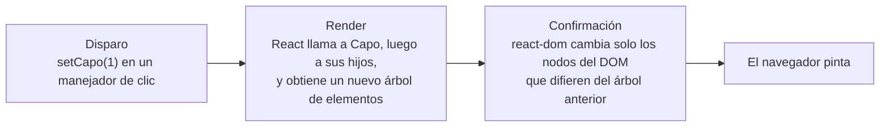

Código: [`src/l03`](https://github.com/spareilleux/learn/tree/3f7a5df/code/react-vite/src/l03), el fragmento de error [`errors/l03_state.tsx`](https://github.com/spareilleux/learn/blob/3f7a5df/code/react-vite/errors/l03_state.tsx), y las soluciones en [`src/solutions`](https://github.com/spareilleux/learn/tree/3f7a5df/code/react-vite/src/solutions).

## ¿Dónde vive el valor?

Un componente Blazor es un objeto: un manejador de clic cambia un campo, y cuando el manejador termina, `ComponentBase` renderiza el componente de nuevo, leyendo el campo. Un view model de WPF lanza `PropertyChanged`, y los bindings actualizan los controles. En ambos casos el valor vive en una instancia que existe mientras existe el componente.

Un componente React es una función que React vuelve a llamar en cada render, y una variable local desaparece cuando la función termina. Un valor que debe sobrevivir de un render al siguiente lo guarda React, y [`useState`](https://react.dev/reference/react/useState) lo solicita:

```tsx
// src/l03/Capo.tsx
import { useState } from 'react';
import { transpose } from './chords.ts';

const chords = ['G', 'C', 'D', 'Em'];

export function Capo() {
  // Estado: un valor que React conserva entre renders, y una función que lo cambia y programa un nuevo render
  const [capo, setCapo] = useState(0);

  // Todo lo demás se calcula a partir del estado durante el render
  const sounding = chords.map((chord) => transpose(chord, capo));

  return (
    <section>
      <p>Capo on fret {capo}</p>
      <button type="button" onClick={() => setCapo(capo - 1)} disabled={capo === 0}>
        Lower
      </button>
      <button type="button" onClick={() => setCapo(capo + 1)} disabled={capo === 11}>
        Raise
      </button>
      <p>Shapes {chords.join(' ')} sound {sounding.join(' ')}</p>
    </section>
  );
}
```

`useState(0)` devuelve un par: el valor actual, y una función que lo reemplaza. En el primer render, el valor es el `0` inicial; en los siguientes, es lo que haya guardado el último `setCapo`. Los acordes que suenan no son estado: se calculan a partir de `capo` en cada render, con la función pura [`transpose`](https://github.com/spareilleux/learn/blob/3f7a5df/code/react-vite/src/l03/chords.ts), que vive en su propio archivo para que Fast Refresh pueda sustituir `Capo.tsx` ([lección 1](../01-vite-project/#hot-module-replacement-y-fast-refresh)). La prueba hace clic en Raise dos veces:

```text
✓ transpose
✓ each click changes the state, and React renders the component again
  [ 'Capo on fret 0', 'Shapes G C D Em sound G C D Em' ]
  [ 'Capo on fret 2', 'Shapes G C D Em sound A D E F#m' ]
```

Las funciones cuyo nombre empieza por `use` son [Hooks](https://react.dev/learn/state-a-components-memory#meet-your-first-hook). React encuentra el estado de un componente por el orden de sus llamadas a Hooks, así que los Hooks se llaman en el nivel superior del componente, nunca dentro de una condición o un bucle; la regla de lint `react/rules-of-hooks` de la plantilla lo impone. El estado es además local a cada lugar donde se renderiza el componente: dos elementos `<Capo />` tienen dos cejillas, como dos instancias de un componente Blazor.

## Renderizar, y luego confirmar

Lo que ocurre después de `setCapo(1)`, tal como [lo describe react.dev](https://react.dev/learn/render-and-commit):



Renderizar significa llamar a las funciones de los componentes; no toca el DOM. [`RenderLog.tsx`](https://github.com/spareilleux/learn/blob/3f7a5df/code/react-vite/src/l03/RenderLog.tsx) registra cada llamada:

```tsx
// src/l03/RenderLog.tsx
// Puro: las mismas props dan la misma salida, y nada fuera del componente cambia
export function ChordName({ chord }: { chord: string }) {
  console.log(`ChordName renders ${chord}`);
  return <p>{chord}</p>;
}

export function ChordPicker() {
  const [chord, setChord] = useState('G');
  console.log(`ChordPicker renders with ${chord}`);
  return (
    <section>
      <button type="button" onClick={() => setChord(chord === 'G' ? 'C' : 'G')}>
        Change chord
      </button>
      <ChordName chord={chord} />
      <ChordName chord="D" />
    </section>
  );
}
```

```text
✓ a state change renders the component and its children again
  ChordPicker renders with G
  ChordName renders G
  ChordName renders D
  --- click
  ChordPicker renders with C
  ChordName renders C
  ChordName renders D
```

Tras el clic, React renderiza de nuevo `ChordPicker`, y **todos** sus hijos, incluido `<ChordName chord="D" />`, cuyas props no cambiaron. El render de un componente incluye por defecto su subárbol. Normalmente es barato, ya que renderizar construye objetos y la confirmación cambia después un solo nodo de texto, la `G` que pasó a ser `C`; la lección 10 muestra cómo saltarse renders cuando no son baratos. Blazor, en comparación, se salta un hijo cuyos parámetros son todos de tipos primitivos y no han cambiado.

## El estado es una instantánea

En un render dado, `capo` es una constante. [`Snapshot.tsx`](https://github.com/spareilleux/learn/blob/3f7a5df/code/react-vite/src/l03/Snapshot.tsx) llama a `setCapo` tres veces en un mismo manejador:

```tsx
// src/l03/Snapshot.tsx
function raiseThreeTimes() {
  setCapo(capo + 1);
  setCapo(capo + 1);
  setCapo(capo + 1);
  console.log('in the handler, capo is still', capo);
}

function raiseThreeTimesWithUpdaters() {
  setCapo((c) => c + 1);
  setCapo((c) => c + 1);
  setCapo((c) => c + 1);
}
```

```text
✓ state is a snapshot: setCapo(capo + 1) three times adds 1
  in the handler, capo is still 0
  Capo on fret 1
  Capo on fret 4
```

El manejador es una closure sobre el render en el que se creó, aquel en el que `capo` vale 0, como explica la [lección 3 de JavaScript](../../javascript-for-csharp-java/03-functions-and-scope/#closures). `setCapo` no cambia esa variable: le pide a React un nuevo render, en el que `capo` tendrá el nuevo valor. Tres llamadas con `capo + 1` piden tres veces `0 + 1`. [React agrupa](https://react.dev/reference/react/useState#setstate-caveats) las tres llamadas y renderiza una sola vez, después del manejador.

Una **función de actualización**, `(c) => c + 1`, recibe el valor pendiente en lugar de la instantánea, así que tres funciones de actualización suman tres. Usa una cuando el siguiente estado dependa del anterior, y por eso el contador de la plantilla en [`App.tsx`](https://github.com/spareilleux/learn/blob/3f7a5df/code/react-vite/src/App.tsx#L10) se escribe `setCount((count) => count + 1)`.

## Lo que tsc verifica

`useState` es genérico: su parámetro de tipo se infiere del valor inicial, o se da explícitamente. [`errors/l03_state.tsx`](https://github.com/spareilleux/learn/blob/3f7a5df/code/react-vite/errors/l03_state.tsx):

```tsx
// errors/l03_state.tsx
import { useState } from 'react';

type Status = 'idle' | 'tuning' | 'in tune';

export function Tuner() {
  const [capo, setCapo] = useState(0);
  const [muted, setMuted] = useState([]);
  const [status, setStatus] = useState<Status>('idle');
  const [note] = useState<string>();

  function reset() {
    setCapo('0');
    setMuted([...muted, 6]);
    setStatus('out of tune');
    capo = 0;
  }

  return (
    <button type="button" onClick={reset}>
      {status}, capo {capo}, {note.toUpperCase()}
    </button>
  );
}
```

```text
errors/l03_state.tsx:13:13 - error TS2345: Argument of type 'string' is not assignable to parameter of type 'SetStateAction<number>'.

13     setCapo('0');
               ~~~

errors/l03_state.tsx:14:15 - error TS2322: Type 'number' is not assignable to type 'never'.

14     setMuted([...muted, 6]);
                 ~~~~~~~~

errors/l03_state.tsx:14:25 - error TS2322: Type 'number' is not assignable to type 'never'.

14     setMuted([...muted, 6]);
                           ~

errors/l03_state.tsx:15:15 - error TS2345: Argument of type '"out of tune"' is not assignable to parameter of type 'SetStateAction<Status>'.

15     setStatus('out of tune');
                 ~~~~~~~~~~~~~

errors/l03_state.tsx:16:5 - error TS2588: Cannot assign to 'capo' because it is a constant.

16     capo = 0;
       ~~~~

errors/l03_state.tsx:21:31 - error TS18048: 'note' is possibly 'undefined'.

21       {status}, capo {capo}, {note.toUpperCase()}
                                 ~~~~


Found 6 errors in the same file, starting at: errors/l03_state.tsx:13

exit 1
```

- `SetStateAction<number>` es `number | ((prev: number) => number)`: un valor o una función de actualización.
- `useState([])` infiere `never[]`, un array que no puede contener nada, así que no se le puede añadir ningún elemento. Da el tipo: `useState<number[]>([])`.
- Una unión de literales de cadena forma una pequeña máquina de estados, como en la [lección 3 de TypeScript](../../typescript-for-csharp-java/03-unions-and-narrowing/#tipos-unión); una errata en un estado es un error.
- `const` hace visible la instantánea: asignar `capo` es un error de compilación, y de todos modos no cambiaría nada en pantalla.
- `useState<string>()` sin valor inicial tiene el tipo `string | undefined`.

## Arrays y objetos: reemplazar, no modificar

React compara el nuevo estado con el anterior usando [`Object.is`](https://developer.mozilla.org/docs/Web/JavaScript/Reference/Global_Objects/Object/is), que para un objeto compara referencias, como `ReferenceEquals` en C#. [La documentación](https://react.dev/reference/react/useState#ive-updated-the-state-but-the-screen-doesnt-update) dice que si el valor es el mismo, React se salta el render. [`Strings.tsx`](https://github.com/spareilleux/learn/blob/3f7a5df/code/react-vite/src/l03/Strings.tsx) silencia una cuerda de dos maneras:

```tsx
// src/l03/Strings.tsx
export function MutatedStrings() {
  const [muted, setMuted] = useState<number[]>([]);
  return (
    <section>
      <button
        type="button"
        onClick={() => {
          muted.push(6); // modifica el array que React ya tiene
          setMuted(muted); // el mismo array: Object.is dice que nada cambió, y React se salta el render
        }}
      >
        Mute string 6
      </button>
      <p>Muted strings: {muted.join(', ') || 'none'}</p>
    </section>
  );
}

export function ReplacedStrings() {
  const [muted, setMuted] = useState<readonly number[]>([]);
  return (
    <section>
      <button type="button" onClick={() => setMuted([...muted, 6])}>
        Mute string 6
      </button>
      <p>Muted strings: {muted.join(', ') || 'none'}</p>
    </section>
  );
}
```

```text
✓ push, then set the same array: nothing on screen
  Muted strings: none
✓ a new array: React renders again
  Muted strings: 6
```

El primer botón modificó el array, y la pantalla sigue diciendo "none". Sin embargo, el 6 está en el array, y aparecerá en el siguiente render que provoque cualquier otra cosa: la pantalla y el estado se han separado. En WPF, una `ObservableCollection` avisa a sus bindings cuando cambia; un array de JavaScript no avisa a nadie, y React solo se entera de un cambio a través de la función set, con un valor nuevo.

El segundo botón construye un array nuevo con la sintaxis spread, `[...muted, 6]`. Declarar el estado como `readonly number[]` hace que `tsc` rechace `muted.push(6)`, como muestra la [lección 2 de TypeScript](../../typescript-for-csharp-java/02-structural-typing/#readonly). Los métodos de array que devuelven un array nuevo son los que hay que usar: `filter`, `map`, `concat`, `toSorted`, `toReversed`, y `with` para un elemento. Un objeto se reemplaza de la misma manera, `{ ...tuning, capo: 2 }`, que es el `tuning with { Capo = 2 }` de C# para un record. [Updating arrays in state](https://react.dev/learn/updating-arrays-in-state) enumera los métodos que hay que evitar y sus sustitutos.

## Mantener el estado mínimo

[El consejo de React](https://react.dev/learn/choosing-the-state-structure#principles-for-structuring-state) para el estado es el que da un diseñador de bases de datos para las tablas: nada de datos redundantes. Si un valor puede calcularse a partir de las props o de otro estado durante el render, no es estado. `Capo` guarda el traste y calcula los acordes; guardar también los acordes añadiría un segundo valor que habría que mantener sincronizado a mano, y un momento en que no coincidan. El mismo razonamiento vale para una lista filtrada, un total o un indicador de "se puede enviar": calcúlalos en el componente. Si el cálculo es costoso, la lección 10 muestra cómo guardarlo en caché.

## Renderizar algo o nada

Un componente puede devolver `null`, y el JSX ofrece `&&` y `? :` para partes de la salida. [`Conditional.tsx`](https://github.com/spareilleux/learn/blob/3f7a5df/code/react-vite/src/l03/Conditional.tsx) usa los tres:

```tsx
// src/l03/Conditional.tsx
// Tres maneras de renderizar algo o nada
export function VoicingCard({ voicing }: { voicing: Voicing }) {
  if (voicing.frets.length !== 6) return null; // nada en absoluto
  const muted = voicing.frets.filter((fret) => fret === null).length;
  return (
    <article>
      <h2>{voicing.chord}</h2>
      {voicing.capo && <p>Capo on fret {voicing.capo}</p>}
      {muted > 0 ? <p>{muted} muted strings</p> : <p>All six strings</p>}
    </article>
  );
}
```

```text
✓ capo 2, and capo 0 with &&
  capo 2
  <div>
    <article>
      <h2>
        D
      </h2>
      <p>
        Capo on fret 
        2
      </p>
      <p>
        2
         muted strings
      </p>
    </article>
  </div>
  capo 0
  <div>
    <article>
      <h2>
        G
      </h2>
      0
      <p>
        All six strings
      </p>
    </article>
  </div>
  three frets
  <div />
```

Con una cejilla en 0, la tarjeta muestra un `0` solitario. `voicing.capo && <p>…</p>` se evalúa como `0` cuando `capo` vale 0, ya que `&&` devuelve su lado izquierdo cuando ese lado es falsy, como explica la [lección 2 de JavaScript](../../javascript-for-csharp-java/02-values-and-types/#conversiones----análisis-de-texto-y-valores-truthy), y `0` es un número, que React renderiza. `false`, `null` y `undefined` no renderizan nada. La [documentación de React](https://react.dev/learn/conditional-rendering#logical-and-operator-) advierte de ello. `tsc` no: un número es un `ReactNode` válido. Escribe `voicing.capo > 0 && …`, o un ternario. `return null` quitó la tarjeta entera, y el contenedor está vacío.

## El renderizado debe ser puro

React llama a un componente cuando lo decide, posiblemente varias veces, y puede descartar un render. El componente debe comportarse como una función pura de sus props y de su estado: [mismas entradas, misma salida, y ningún cambio en nada que existiera antes de la llamada](https://react.dev/learn/keeping-components-pure). Los cambios van en los manejadores de eventos, o en los efectos, que trata la lección 5. `ChordHistory` rompe esa regla a propósito, añadiendo a un array que recibe:

```tsx
// Impuro a propósito: el componente modifica un array que recibió, mientras renderiza
export function ChordHistory({ chord, history }: { chord: string; history: string[] }) {
  history.push(chord);
  return <p>Played so far: {history.join(' ')}</p>;
}
```

El `main.tsx` de la plantilla envuelve la aplicación en [`StrictMode`](https://react.dev/reference/react/StrictMode), que, solo en desarrollo, llama a cada componente dos veces para revelar este tipo de error. La prueba renderiza `ChordHistory` sin él y con él:

```text
✓ without StrictMode, the impure component renders once
  Played so far: G [ 'G' ]
✓ in StrictMode, React renders it twice in development, and the output shows the impurity
  Played so far: G G [ 'G', 'G' ]
```

Sin StrictMode el error es invisible, hasta que React renderiza el componente de nuevo por cualquier motivo. Con StrictMode se ve en el primer render. Un componente puro da el mismo resultado una vez o dos, así que la doble llamada no cuesta más que tiempo en desarrollo; los builds de producción no la hacen.

## En GuitarAlchemist/ga

`ListDetailLayout`, en el [`DynamicPanel.tsx`](https://github.com/GuitarAlchemist/ga/blob/8cc8c5a17c685c779c46cd5e6d0a3f5d5036cc41/ReactComponents/ga-react-components/src/components/PrimeRadiant/DynamicPanel.tsx#L76-L120) de GA, muestra una lista cuyas filas se despliegan al hacer clic. Recuerda las filas desplegadas por su índice:

```tsx
const ListDetailLayout: React.FC<{ data: unknown[]; showFields: string[] }> = ({ data, showFields }) => {
  const [expanded, setExpanded] = useState<Set<number>>(new Set());
  const toggle = useCallback((idx: number) => {
    setExpanded(prev => {
      const next = new Set(prev);
      if (next.has(idx)) next.delete(idx); else next.add(idx);
      return next;
    });
  }, []);
```

La actualización en sí es correcta: una función de actualización, y un `Set` nuevo en lugar de uno modificado. El problema es a qué se refiere el estado. El panel que lo contiene [filtra los datos](https://github.com/GuitarAlchemist/ga/blob/8cc8c5a17c685c779c46cd5e6d0a3f5d5036cc41/ReactComponents/ga-react-components/src/components/PrimeRadiant/DynamicPanel.tsx#L289-L296) con chips o con un cuadro de búsqueda, y [consulta su fuente](https://github.com/GuitarAlchemist/ga/blob/8cc8c5a17c685c779c46cd5e6d0a3f5d5036cc41/ReactComponents/ga-react-components/src/components/PrimeRadiant/DynamicPanel.tsx#L256-L287) cada 60 segundos por defecto, así que la fila del índice 1 puede ser otro elemento un momento después. [`ExpandableList.tsx`](https://github.com/spareilleux/learn/blob/3f7a5df/code/react-vite/src/l03/ExpandableList.tsx) lo reduce a lo esencial, y añade una versión que recuerda ids:

```text
✓ by index: after filtering, another row is expanded
  expanded policy-2: [ 'policy-1', 'policy-2: warning', 'policy-3' ]
  filtered out policy-1: [ 'policy-2', 'policy-3: error' ]
✓ by id: the expanded row stays expanded
  expanded policy-2: [ 'policy-1', 'policy-2: warning', 'policy-3' ]
  filtered out policy-1: [ 'policy-2: warning', 'policy-3' ]
```

Tras quitar policy-1 con el filtro, la versión reducida por índice ha cerrado policy-2, que el usuario abrió, y ha abierto policy-3, que no abrió. Cambiar `key={idx}` no lo arreglaría: el estado lo guarda la lista, no las filas, y es el `Set<number>` el que apunta a posiciones. El arreglo es recordar una identidad. El panel de GA recibe `unknown[]` y solo conoce sus campos por su nombre, así que la identidad tendría que ser un campo que nombre la definición del panel, como el campo del título (*por verificar* en las definiciones de paneles de GA, que no he leído enteras).

## Puntos clave

- `useState` conserva un valor entre renders; su función set reemplaza el valor y programa un render.
- Un render llama al componente y a sus hijos; la confirmación cambia después solo los nodos del DOM que difieren.
- En un render, el estado es una instantánea constante; usa una función de actualización, `(c) => c + 1`, cuando el siguiente valor dependa del anterior.
- React compara el estado con `Object.is`: reemplaza los arrays y los objetos por otros nuevos, y decláralos `readonly`.
- Calcula lo que pueda calcularse durante el render en lugar de guardarlo.
- `&&` con un número puede renderizar `0`; un componente puede devolver `null`.
- El renderizado debe ser puro. StrictMode renderiza dos veces en desarrollo para revelar los componentes impuros.
- El estado que se refiere a elementos de una lista debe guardar su identidad, no su posición.

## Ejercicios

1. Escribe un componente `Progression` que reciba acordes, como Am F C G, y muestre "Bar 1 of 4: Am, then F", con botones Previous y Next que den la vuelta. ¿Qué es estado, y qué se calcula?

<details>
<summary>Solución</summary>

[`src/solutions/l03_ex1/Progression.tsx`](https://github.com/spareilleux/learn/blob/3f7a5df/code/react-vite/src/solutions/l03_ex1/Progression.tsx):

```tsx
// Ejercicio 1: una sola pieza de estado, la posición; el acorde actual y el siguiente se calculan a partir de ella
export function Progression({ chords }: { chords: readonly string[] }) {
  const [position, setPosition] = useState(0);
  const current = chords[position];
  const next = chords[(position + 1) % chords.length];

  return (
    <section>
      <p>
        Bar {position + 1} of {chords.length}: {current}, then {next}
      </p>
      <button type="button" onClick={() => setPosition((p) => (p + chords.length - 1) % chords.length)}>
        Previous
      </button>
      <button type="button" onClick={() => setPosition((p) => (p + 1) % chords.length)}>
        Next
      </button>
    </section>
  );
}
```

La prueba hace clic en Previous una vez, y luego en Next dos veces:

```text
✓ next and previous wrap around
  Bar 1 of 4: Am, then F
  Bar 4 of 4: G, then Am
  Bar 2 of 4: F, then C
```

El único estado es la posición. El acorde actual, el siguiente y el número de compás se calculan. Previous suma `chords.length - 1` antes del módulo, porque en JavaScript, como en C#, `-1 % 4` vale `-1`.

</details>

2. Escribe un componente `MuteStrings`: seis botones de alternancia, String 6 a String 1, y un párrafo que enumere las cuerdas silenciadas desde la más grave, como "Muted strings: 6, 5". Actualiza el estado sin modificar el array existente, y haz saber a las tecnologías de asistencia qué botones están pulsados.

<details>
<summary>Solución</summary>

[`src/solutions/l03_ex2/MuteStrings.tsx`](https://github.com/spareilleux/learn/blob/3f7a5df/code/react-vite/src/solutions/l03_ex2/MuteStrings.tsx):

```tsx
// Ejercicio 2: cada actualización construye un array nuevo, así que React ve un valor nuevo y renderiza de nuevo
export function MuteStrings() {
  const [muted, setMuted] = useState<readonly number[]>([]);

  function toggle(string: number) {
    setMuted((current) =>
      current.includes(string) ? current.filter((s) => s !== string) : [...current, string].sort((a, b) => b - a),
    );
  }

  return (
    <section>
      {[6, 5, 4, 3, 2, 1].map((string) => (
        <button key={string} type="button" aria-pressed={muted.includes(string)} onClick={() => toggle(string)}>
          String {string}
        </button>
      ))}
      <p>Muted strings: {muted.join(', ') || 'none'}</p>
    </section>
  );
}
```

```text
✓ toggle strings 5, 6, then 5 again
  after String 5: Muted strings: 5
  after String 6: Muted strings: 6, 5
  after String 5: Muted strings: 6
```

`filter` devuelve un array nuevo, y el spread también; `sort` modifica un array en su sitio, pero aquí ordena el nuevo, que nadie más tiene. `[...current, string].toSorted((a, b) => b - a)` diría lo mismo sin plantear la duda. Como el estado es `readonly number[]`, `current.sort(…)` o `current.push(…)` no compilarían. [`aria-pressed`](https://developer.mozilla.org/docs/Web/Accessibility/ARIA/Reference/Attributes/aria-pressed) convierte cada botón en un botón de alternancia para los lectores de pantalla, y la prueba lo comprueba.

</details>

3. El [`ScaleSelector.tsx`](https://github.com/GuitarAlchemist/ga/blob/8cc8c5a17c685c779c46cd5e6d0a3f5d5036cc41/ReactComponents/ga-react-components/src/components/ScaleSelector.tsx#L10-L33) de GA guarda las notas seleccionadas y el número de escala calculado a partir de ellas en dos piezas de estado:

```tsx
const [selectedNotes, setSelectedNotes] = useState<string[]>([]);
const [scale, setScale] = useState(0);

const handleNotesChange = (notes: string[]) => {
    setSelectedNotes(notes);
    setScale(calculateScale(notes));
};
```

Escribe un componente `ScaleNotes` con doce botones de nota y un botón Clear, que muestre las notas y el número de escala, un bit por nota desde C = 1 hasta B = 2048, con una sola pieza de estado.

<details>
<summary>Solución</summary>

[`src/solutions/l03_ex3/ScaleNotes.tsx`](https://github.com/spareilleux/learn/blob/3f7a5df/code/react-vite/src/solutions/l03_ex3/ScaleNotes.tsx):

```tsx
const allNotes = ['C', 'C#', 'D', 'D#', 'E', 'F', 'F#', 'G', 'G#', 'A', 'A#', 'B'];

// Ejercicio 3: el ScaleSelector de GA guarda las notas y el número de escala en dos piezas de estado.
// Aquí solo las notas son estado; el número de escala se calcula a partir de ellas en cada render, así que no puede discrepar.
export function ScaleNotes() {
  const [notes, setNotes] = useState<readonly string[]>([]);
  const scale = notes.reduce((bits, note) => bits | (1 << allNotes.indexOf(note)), 0);

  function toggle(note: string) {
    setNotes((current) => (current.includes(note) ? current.filter((n) => n !== note) : [...current, note]));
  }

  return (
    <section>
      {allNotes.map((note) => (
        <button key={note} type="button" aria-pressed={notes.includes(note)} onClick={() => toggle(note)}>
          {note}
        </button>
      ))}
      <button type="button" onClick={() => setNotes([])}>
        Clear
      </button>
      <p>
        Notes {notes.join(' ') || 'none'}, scale {scale}
      </p>
    </section>
  );
}
```

```text
✓ C major pentatonic, then clear
  Notes C D E G A, scale 661
  Notes none, scale 0
```

661 es 1 + 4 + 16 + 128 + 512, los bits de C, D, E, G y A. Con la escala calculada durante el render, Clear no puede olvidarse de reiniciarla, y ningún camino del código puede cambiar uno sin el otro. En GA, todos los caminos pasan por `handleNotesChange`, que cambia los dos, así que hoy los dos valores coinciden; el riesgo es el próximo código que llame a `setSelectedNotes` a secas. `ScaleSelector` tiene un segundo problema, un efecto que avisa a su padre, que reproduce la lección 4.

</details>

## Fuentes

- React: [State: a component's memory](https://react.dev/learn/state-a-components-memory), [Render and commit](https://react.dev/learn/render-and-commit), [State as a snapshot](https://react.dev/learn/state-as-a-snapshot), [Queueing a series of state updates](https://react.dev/learn/queueing-a-series-of-state-updates), [Updating objects in state](https://react.dev/learn/updating-objects-in-state), [Updating arrays in state](https://react.dev/learn/updating-arrays-in-state), [Choosing the state structure](https://react.dev/learn/choosing-the-state-structure), [Conditional rendering](https://react.dev/learn/conditional-rendering), [Keeping components pure](https://react.dev/learn/keeping-components-pure), [`useState`](https://react.dev/reference/react/useState), [`StrictMode`](https://react.dev/reference/react/StrictMode)
- MDN: [`Object.is`](https://developer.mozilla.org/docs/Web/JavaScript/Reference/Global_Objects/Object/is), [`aria-pressed`](https://developer.mozilla.org/docs/Web/Accessibility/ARIA/Reference/Attributes/aria-pressed)
- Microsoft: [Renderizado de componentes Razor de ASP.NET Core](https://learn.microsoft.com/aspnet/core/blazor/components/rendering)
