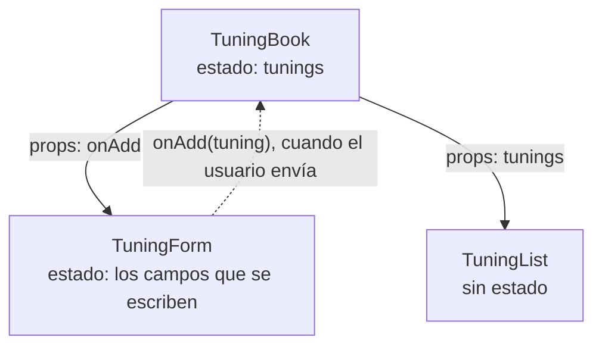
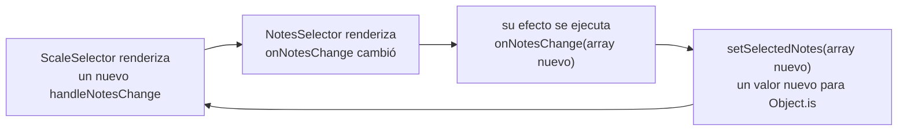

Código: [`src/l04`](https://github.com/spareilleux/learn/tree/3f7a5df/code/react-vite/src/l04), [`src/TuningBook.tsx`](https://github.com/spareilleux/learn/blob/3f7a5df/code/react-vite/src/TuningBook.tsx), el fragmento de error [`errors/l04_events.tsx`](https://github.com/spareilleux/learn/blob/3f7a5df/code/react-vite/errors/l04_events.tsx), y las soluciones en [`src/solutions`](https://github.com/spareilleux/learn/tree/3f7a5df/code/react-vite/src/solutions).

## Los manejadores son props

En Blazor, `@onclick="Raise"` asocia un método, y un componente hijo expone un parámetro `EventCallback<T>` que rellena su padre. En React, las dos cosas son lo mismo: una prop cuyo valor es una función. En un elemento HTML, React conoce los nombres, `onClick`, `onChange`, `onSubmit`, `onKeyDown`; en un componente, el nombre lo eliges tú, y la convención es `on` seguido de lo que ocurrió.

```tsx
// src/l04/Fretboard.tsx
import type { MouseEvent } from 'react';

// Un hijo informa de lo que ocurrió mediante una prop de función; el padre decide qué hacer con ello
interface FretButtonProps {
  string: number;
  fret: number;
  onSelect: (string: number, fret: number) => void;
}

export function FretButton({ string, fret, onSelect }: FretButtonProps) {
  function handleClick(event: MouseEvent<HTMLButtonElement>) {
    event.stopPropagation(); // el manejador de la fila no ve este clic
    onSelect(string, fret);
  }
  return (
    <button type="button" onClick={handleClick}>
      {fret}
    </button>
  );
}

export function StringRow({ string, onSelect }: { string: number; onSelect: FretButtonProps['onSelect'] }) {
  return (
    // Un clic entre los botones llega a la fila; un clic en un botón se detiene ahí
    <div role="group" aria-label={`String ${string}`} onClick={() => console.log(`row ${string} clicked`)}>
      {[0, 1, 2, 3].map((fret) => (
        <FretButton key={fret} string={string} fret={fret} onSelect={onSelect} />
      ))}
    </div>
  );
}
```

Pasa la función, `onClick={handleClick}`, no su resultado: `onClick={handleClick()}` la llamaría durante el render, como advierte [Responding to events](https://react.dev/learn/responding-to-events#adding-event-handlers). Una función flecha, `onClick={() => setCapo(capo + 1)}`, crea un manejador que llama a algo con argumentos.

`FretButton` no sabe qué significa seleccionar un traste: informa de la cuerda y del traste, y el padre decide. `FretButtonProps['onSelect']` reutiliza el tipo de esa prop, un [tipo de acceso indexado](../../typescript-for-csharp-java/04-generics/#keyof-acceso-indexado-y-tipos-mapeados). La prueba usa una [función mock](https://vitest.dev/api/mock) de Vitest como `onSelect`, hace clic en el traste 3, y luego en la propia fila:

```tsx
// src/l04/Fretboard.test.tsx
test('the button calls onSelect, and the click stops at the button', async () => {
  const onSelect = vi.fn((string: number, fret: number) => console.log(`selected string ${string}, fret ${fret}`));
  render(<StringRow string={6} onSelect={onSelect} />);
  const row = screen.getByRole('group', { name: 'String 6' });
  await userEvent.click(within(row).getByRole('button', { name: '3' }));
  await userEvent.click(row);
  expect(onSelect).toHaveBeenCalledExactlyOnceWith(6, 3);
});
```

```text
✓ the button calls onSelect, and the click stops at the button
  selected string 6, fret 3
  row 6 clicked
```

El primer clic llegó al botón y se detuvo ahí; el segundo, en la fila, llegó solo a la fila. Los eventos se [propagan](https://react.dev/learn/responding-to-events#event-propagation) desde el elemento donde ocurren hacia sus ancestros, como en el DOM y como hacen los eventos enrutados con burbujeo de WPF, y `stopPropagation` termina el recorrido. [`user-event`](https://testing-library.com/docs/user-event/intro) simula las acciones de un usuario, pulsar y soltar el puntero para un clic, en lugar de lanzar un solo evento.

## Tipos de eventos

Un manejador recibe un evento de React, un [`SyntheticEvent`](https://react.dev/reference/react-dom/components/common#react-event-object) que envuelve el evento del navegador, disponible como `nativeEvent`, y sigue la interfaz estándar `Event`. `@types/react` da a cada tipo de evento su tipo, con el elemento como parámetro de tipo:

| Evento | Tipo en `@types/react` 19.3 | Blazor |
|---|---|---|
| `onClick` | `MouseEvent<HTMLButtonElement>` | `MouseEventArgs` |
| `onChange` en un input, un select o un textarea | `ChangeEvent<HTMLInputElement>` | `ChangeEventArgs` |
| `onSubmit` | `SubmitEvent<HTMLFormElement>` | `OnValidSubmit` de `EditForm` |
| `onKeyDown` | `KeyboardEvent<HTMLDivElement>` | `KeyboardEventArgs` |

Dos propiedades contienen un elemento. `currentTarget` es el elemento cuyo manejador se está ejecutando, y su tipo es el parámetro de tipo. `target` es el elemento donde empezó el evento, que puede ser cualquier descendiente, así que su tipo es solo `EventTarget`. Lee `currentTarget`. En `@types/react` 19.3, `FormEvent` y `FormEventHandler`, que muchos proyectos usan para `onSubmit` y `onChange`, están marcados como `@deprecated`: su comentario dice que no existe tal evento, y sugiere `ChangeEvent`, `InputEvent` o `SubmitEvent`.

[`errors/l04_events.tsx`](https://github.com/spareilleux/learn/blob/3f7a5df/code/react-vite/errors/l04_events.tsx) comete los errores habituales:

```tsx
// errors/l04_events.tsx
import { useState, type ChangeEvent } from 'react';

export function CapoPicker() {
  const [capo, setCapo] = useState(0);

  function handleInput(event: ChangeEvent<HTMLInputElement>) {
    setCapo(event.currentTarget.valueAsNumber);
  }

  return (
    <form onSubmit={() => setCapo(0)}>
      <input type="number" value={capo} onChange={setCapo} />
      <select value={capo} onChange={handleInput}>
        <option value={0}>No capo</option>
        <option value={2}>Fret 2</option>
      </select>
      <button type="button" onClick={(event) => setCapo(event.currentTarget.value)}>
        Reset
      </button>
      <button type="button" onClick={(event) => console.log(event.target.value)}>
        Log
      </button>
    </form>
  );
}
```

```text
errors/l04_events.tsx:13:41 - error TS2322: Type 'Dispatch<SetStateAction<number>>' is not assignable to type 'ChangeEventHandler<HTMLInputElement, HTMLInputElement>'.
  Types of parameters 'value' and 'event' are incompatible.
    Type 'ChangeEvent<HTMLInputElement, HTMLInputElement>' is not assignable to type 'SetStateAction<number>'.

13       <input type="number" value={capo} onChange={setCapo} />
                                           ~~~~~~~~

  node_modules/@types/react/index.d.ts:3411:9 - The expected type comes from property 'onChange' which is declared here on type 'DetailedHTMLProps<InputHTMLAttributes<HTMLInputElement>, HTMLInputElement>'
    3411         onChange?: ChangeEventHandler<T, HTMLInputElement> | undefined;
                 ~~~~~~~~

errors/l04_events.tsx:14:28 - error TS2322: Type '(event: ChangeEvent<HTMLInputElement, Element>) => void' is not assignable to type 'ChangeEventHandler<HTMLSelectElement, HTMLSelectElement>'.
  Types of parameters 'event' and 'event' are incompatible.
    Type 'ChangeEvent<HTMLSelectElement, HTMLSelectElement>' is not assignable to type 'ChangeEvent<HTMLInputElement, Element>'.
      Type 'HTMLSelectElement' is missing the following properties from type 'HTMLInputElement': accept, align, alt, capture, and 38 more.

14       <select value={capo} onChange={handleInput}>
                              ~~~~~~~~

  node_modules/@types/react/index.d.ts:3578:9 - The expected type comes from property 'onChange' which is declared here on type 'DetailedHTMLProps<SelectHTMLAttributes<HTMLSelectElement>, HTMLSelectElement>'
    3578         onChange?: ChangeEventHandler<T, HTMLSelectElement> | undefined;
                 ~~~~~~~~

errors/l04_events.tsx:18:57 - error TS2345: Argument of type 'string' is not assignable to parameter of type 'SetStateAction<number>'.

18       <button type="button" onClick={(event) => setCapo(event.currentTarget.value)}>
                                                           ~~~~~~~~~~~~~~~~~~~~~~~~~

errors/l04_events.tsx:21:74 - error TS2339: Property 'value' does not exist on type 'EventTarget'.

21       <button type="button" onClick={(event) => console.log(event.target.value)}>
                                                                            ~~~~~


Found 4 errors in the same file, starting at: errors/l04_events.tsx:13

exit 1
```

- Una función set no es un manejador de cambio: `onChange` pasa un evento, y `setCapo` quiere un número. El `@bind` de Blazor hace esa conversión; React no tiene binding, y el manejador lee el valor.
- Un manejador para un input no sirve para un select: el tipo del parámetro dice qué elemento espera, y los parámetros de función se verifican como en la [lección 4 de TypeScript](../../typescript-for-csharp-java/04-generics/#varianza).
- `value` es siempre una cadena en el DOM, incluso en un botón o en un `<input type="number">`. Conviértelo con `Number(…)`, o lee `valueAsNumber` en un input numérico.
- `event.target` es un `EventTarget`, que no tiene `value`; `currentTarget` está tipado.
- `onSubmit={() => setCapo(0)}` compila: un manejador puede ignorar su evento, igual que cualquier callback puede ignorar sus argumentos.

## Inputs controlados

React no tiene `@bind` ni `{Binding Mode=TwoWay}`. Un input es **controlado** cuando su `value` viene del estado y su `onChange` vuelve a escribir el estado: React renderiza el valor, el usuario escribe, `onChange` recibe el nuevo texto, la función set lo guarda, y React lo renderiza de nuevo. El estado es la única fuente de verdad, y el componente puede comprobar, transformar o rechazar cada cambio. [`TuningForm.tsx`](https://github.com/spareilleux/learn/blob/3f7a5df/code/react-vite/src/l04/TuningForm.tsx):

```tsx
// src/l04/TuningForm.tsx
// Un formulario controlado: el valor de cada campo viene del estado, y cada pulsación pasa por onChange
export function TuningForm({ onAdd }: { onAdd: (tuning: NewTuning) => void }) {
  const [name, setName] = useState('');
  const [notesText, setNotesText] = useState('E A D G B E');
  const [capo, setCapo] = useState(0);
  const [submitted, setSubmitted] = useState(false);

  // La validación se calcula a partir del estado durante el render, no se guarda junto a él
  const parsed = parseNotes(notesText);
  const nameError = name.trim() === '' ? 'Give the tuning a name.' : undefined;
  const notesError = parsed.ok ? undefined : parsed.error;

  function handleNotesChange(event: ChangeEvent<HTMLInputElement>) {
    setNotesText(event.currentTarget.value);
  }

  function handleSubmit(event: SubmitEvent<HTMLFormElement>) {
    event.preventDefault(); // sin recarga de la página: React gestiona el envío
    setSubmitted(true);
    if (nameError || !parsed.ok) return;
    onAdd({ name: name.trim(), notes: parsed.notes, capo });
    setName('');
    setSubmitted(false);
  }

  return (
    <form onSubmit={handleSubmit} noValidate>
      <label>
        Name <input value={name} onChange={(event) => setName(event.currentTarget.value)} aria-invalid={submitted && !!nameError} />
      </label>
      {submitted && nameError && <p role="alert">{nameError}</p>}
      <label>
        Notes <input value={notesText} onChange={handleNotesChange} aria-invalid={!!notesError} />
      </label>
      {notesError && <p role="alert">{notesError}</p>}
      <label>
        Capo{' '}
        <select value={capo} onChange={(event) => setCapo(Number(event.currentTarget.value))}>
          {[0, 1, 2, 3, 4, 5].map((fret) => (
            <option key={fret} value={fret}>
              {fret}
            </option>
          ))}
        </select>
      </label>
      <button type="submit">Add tuning</button>
    </form>
  );
}
```

Las piezas, y de dónde viene cada una:

- **Un manejador en línea**, `(event) => setName(event.currentTarget.value)`, no necesita tipo: TypeScript infiere `event` a partir de la prop `onChange`, como infiere el parámetro de una lambda a partir de un delegado en C#. `handleNotesChange` es una función con nombre, así que declara el tipo.
- **`onChange` se dispara con cada pulsación**, como el evento `input` del navegador, y no cuando el campo pierde el foco, como el evento `change` del navegador. [La documentación](https://react.dev/reference/react-dom/components/input#props) lo dice.
- **`preventDefault`** detiene el envío propio del navegador, que mandaría el formulario a la URL actual y recargaría la página. `noValidate` desactiva los mensajes de validación del navegador, ya que el componente muestra los suyos.
- **La validación se calcula**, como recomienda la lección 3 para todo lo derivado: `parsed`, `nameError` y `notesError` salen del estado en cada render. No hay un estado de "errores" que mantener sincronizado. El único estado adicional es `submitted`, un hecho que los campos no guardan: si el usuario ha intentado enviar, para que no se señale un nombre vacío antes de que haya escrito nada.
- **`role="alert"`** hace que los lectores de pantalla anuncien un mensaje cuando aparece, y `aria-invalid` marca el campo.
- **Un `select` se controla** de la misma manera, y su valor es una cadena, de ahí `Number(…)`.

[`parseNotes`](https://github.com/spareilleux/learn/blob/3f7a5df/code/react-vite/src/l04/notes.ts) es una función simple que devuelve una unión discriminada, `{ ok: true; notes } | { ok: false; error }`, como las que construye la [lección 3 de TypeScript](../../typescript-for-csharp-java/03-unions-and-narrowing/#uniones-discriminadas); después de comprobar `parsed.ok`, `parsed.notes` existe. Mantenerla fuera del componente permite probarla sola:

```text
✓ parseNotes
  "E A D G B E"         { ok: true, notes: [ 'E', 'A', 'D', 'G', 'B', 'E' ] }
  "d a d g a d"         { ok: true, notes: [ 'D', 'A', 'D', 'G', 'A', 'D' ] }
  "Eb Ab Db Gb Bb Eb"   { ok: true, notes: [ 'D#', 'G#', 'C#', 'F#', 'A#', 'D#' ] }
  "E A D G B"           { ok: false, error: 'A guitar tuning has 6 notes, not 5.' }
  "E A D G H E"         { ok: false, error: '"H" is not a note.' }
```

La prueba del componente escribe en el formulario como lo haría un usuario:

```text
✓ the form validates as you type, and on submit
  typed "D A D G": [ 'A guitar tuning has 6 notes, not 4.' ]
  typed " A D": []
  submitted without a name: [ 'Give the tuning a name.' ] onAdd calls: 0
  submitted: [] [[{"name":"DADGAD","notes":["D","A","D","G","A","D"],"capo":2}]]
```

El error de las notas aparece mientras se escribe y desaparece con la sexta nota; el error del nombre espera a un envío. Tras un envío válido, `onAdd` ha recibido una afinación, y el campo del nombre vuelve a estar vacío.

El `EditForm` de Blazor hace más de esto por ti, con anotaciones de datos en un modelo y componentes `ValidationMessage`. React en sí se queda en los inputs controlados y los eventos; bibliotecas como React Hook Form añaden esquemas y la gestión de errores, y React 19 añade las Actions de formulario, que trata la lección 12.

### Las dos advertencias de los inputs controlados

[`Warnings.tsx`](https://github.com/spareilleux/learn/blob/3f7a5df/code/react-vite/src/l04/Warnings.tsx) comete los dos errores que React señala en desarrollo:

```tsx
// src/l04/Warnings.tsx
// Un value sin onChange: React deja el campo en solo lectura, y avisa
export function ReadOnlyCapo() {
  return <input aria-label="Capo" type="number" value={2} />;
}

// undefined, luego un número: el campo empieza no controlado, y luego pasa a controlado
export function LateCapo() {
  const [capo, setCapo] = useState<number>();
  return <input aria-label="Capo" type="number" value={capo} onChange={(event) => setCapo(event.currentTarget.valueAsNumber)} />;
}
```

```text
✓ value without onChange: typing changes nothing
  console.error: You provided a `value` prop to a form field without an `onChange` handler. This will render a read-only field. If the field should be mutable use `defaultValue`. Otherwise, set either `onChange` or `readOnly`.
  value after typing 5: 2
✓ undefined, then a number: React warns on the first keystroke
  console.error: A component is changing an uncontrolled input to be controlled. This is likely caused by the value changing from undefined to a defined value, which should not happen. Decide between using a controlled or uncontrolled input element for the lifetime of the component. More info: https://react.dev/link/controlled-components
  value after typing 3: 3
```

Con un `value` y sin `onChange`, el usuario escribe y el campo sigue diciendo 2: React vuelve a poner el valor del estado. `value={undefined}` significa "sin valor", un input no controlado, así que un estado que empieza como `undefined` hace pasar el input de no controlado a controlado en la primera pulsación. `tsc` acepta los dos componentes; empieza el estado con un valor, `useState(0)` o `useState('')`, o usa `defaultValue` para un input que React no controla. El `TuningNotes` del curso en la [lección 2](../02-components-and-jsx/#listas-y-claves) era a propósito un input no controlado de ese tipo.

## El estado que pertenece al padre

`TuningForm` no guarda afinaciones: llama a `onAdd`. La lista de afinaciones pertenece a [`TuningBook`](https://github.com/spareilleux/learn/blob/3f7a5df/code/react-vite/src/TuningBook.tsx), el padre común más cercano del formulario que añade una afinación y de la lista que las muestra. React llama a esto [elevar el estado](https://react.dev/learn/sharing-state-between-components):

```tsx
// src/TuningBook.tsx
// Lecciones 2 a 4 juntas: el libro es dueño de la lista, el formulario informa de una nueva afinación, la lista la renderiza
export function TuningBook() {
  const [tunings, setTunings] = useState<readonly Tuning[]>([standard, dropD]);

  function handleAdd(tuning: NewTuning) {
    const id = `${tuning.name.toLowerCase().replaceAll(/\W+/g, '-')}-${tunings.length + 1}`;
    setTunings([...tunings, { id, name: tuning.capo ? `${tuning.name}, capo ${tuning.capo}` : tuning.name, notes: tuning.notes }]);
  }

  return (
    <>
      <TuningForm onAdd={handleAdd} />
      <TuningList tunings={tunings} />
      <Capo />
    </>
  );
}
```



Los datos bajan como props, y los eventos suben como llamadas a props de función. El id se construye cuando se añade la afinación, una vez, y nunca cambia, como pide la lección 2 a una clave. La prueba añade una afinación mediante el formulario y lee la lista:

```text
✓ a tuning added with the form appears in the list
  [ 'Standard', 'Drop D', 'Open D' ]
```

`TuningBook` es lo que [`App.tsx`](https://github.com/spareilleux/learn/blob/3f7a5df/code/react-vite/src/App.tsx) renderiza bajo el contador, así que `npm run dev` muestra las tres lecciones juntas.

## En GuitarAlchemist/ga

El `ga-react-components` de GA tiene dos componentes que se comunican en el otro sentido, del hijo al padre, mediante un efecto. [`NotesSelector.tsx`](https://github.com/GuitarAlchemist/ga/blob/8cc8c5a17c685c779c46cd5e6d0a3f5d5036cc41/ReactComponents/ga-react-components/src/components/NotesSelector.tsx#L10-L18) informa de sus notas tras cada render en el que ellas, o el callback, cambiaron:

```tsx
const NotesSelector: React.FC<NoteSelectorProps> = ({ onNotesChange }) => {
    const [textNotes, setTextNotes] = useState('');
    const [toggledNotes, setToggledNotes] = useState<string[]>([]);
    const [useTextInput, setUseTextInput] = useState(true);

    useEffect(() => {
        const notes = useTextInput ? textNotes.split(' ').filter(note => allNotes.includes(note)) : toggledNotes;
        onNotesChange(notes);
    }, [textNotes, toggledNotes, useTextInput, onNotesChange]);
```

[`ScaleSelector.tsx`](https://github.com/GuitarAlchemist/ga/blob/8cc8c5a17c685c779c46cd5e6d0a3f5d5036cc41/ReactComponents/ga-react-components/src/components/ScaleSelector.tsx#L10-L42) lo renderiza con un manejador que crea en cada render, y que guarda las notas, como un array nuevo, y la escala:

```tsx
    const handleNotesChange = (notes: string[]) => {
        setSelectedNotes(notes);
        setScale(calculateScale(notes));
    };
    // …
            <NotesSelector onNotesChange={handleNotesChange} />
```

Los efectos son el tema de la lección 5; lo que importa aquí es que React ejecuta un efecto después de un render en el que una de sus dependencias difiere del render anterior, comparada con `Object.is`. Si se juntan las dos cosas:



[`src/l04/NotesSelector.tsx`](https://github.com/spareilleux/learn/blob/3f7a5df/code/react-vite/src/l04/NotesSelector.tsx) reduce los dos componentes a su estado, su efecto y su manejador, sin Material UI, y añade un contador que lanza una excepción tras 60 renders para que la prueba termine:

```text
✓ GA's two selectors render each other in a loop
  console.error: Maximum update depth exceeded. This can happen when a component calls setState inside useEffect, but useEffect either doesn't have a dependency array, or one of the dependencies changes on every render.
```

React detecta el bucle y dice qué lo causa: "one of the dependencies changes on every render". En la reducción, el bucle empieza en cuanto se monta `ScaleSelector`. En GA, `ScaleSelector` se exporta desde [`components/index.ts`](https://github.com/GuitarAlchemist/ga/blob/8cc8c5a17c685c779c46cd5e6d0a3f5d5036cc41/ReactComponents/ga-react-components/src/components/index.ts#L14), pero ninguna aplicación de GA lo renderiza en este commit: `ga-client` tiene su propio `ScaleSelector`. El error está latente, y aparecerá el día en que alguien use el componente exportado. No he montado el propio componente de GA, con Material UI, para confirmarlo (*por verificar*). El arreglo no necesita `useCallback` para estabilizar el manejador; quita el efecto, como muestra el ejercicio 3. La página de React [You might not need an effect](https://react.dev/learn/you-might-not-need-an-effect#notifying-parent-components-about-state-changes) describe exactamente este caso.

## Puntos clave

- Un manejador es una prop de función: en un elemento, React le da el nombre; en un componente, se lo das tú, `onSomething`.
- Pasa la función, no una llamada. Tipa un manejador con nombre con el tipo de evento y su elemento; un manejador en línea se infiere.
- Lee `currentTarget`, no `target`; `value` es siempre una cadena. `FormEvent` está obsoleto en `@types/react` 19.3.
- Los eventos burbujean; `stopPropagation` los detiene, `preventDefault` cancela la acción por defecto del navegador, como el envío de un formulario.
- Un input controlado toma `value` del estado y lo vuelve a escribir en `onChange`; no le des `undefined`, ni un `value` sin `onChange`.
- Calcula la validación durante el render. Guarda el estado en el padre común más cercano, y sube los eventos mediante props de función.
- Un hijo que informa a su padre desde un efecto puede entrar en bucle; informa desde el manejador de eventos.

## Ejercicios

1. Escribe un componente `StringOrder` que reciba seis notas y las muestre, con una casilla etiquetada "High string first" que invierta el orden. ¿Qué propiedad del evento necesita una casilla, y qué método de array deja las notas intactas?

<details>
<summary>Solución</summary>

[`src/solutions/l04_ex1/StringOrder.tsx`](https://github.com/spareilleux/learn/blob/3f7a5df/code/react-vite/src/solutions/l04_ex1/StringOrder.tsx):

```tsx
// Ejercicio 1: una casilla controlada lee event.currentTarget.checked, no value
export function StringOrder({ notes }: { notes: readonly string[] }) {
  const [highFirst, setHighFirst] = useState(false);

  function handleChange(event: ChangeEvent<HTMLInputElement>) {
    setHighFirst(event.currentTarget.checked);
  }

  const shown = highFirst ? notes.toReversed() : notes;
  return (
    <section>
      <label>
        <input type="checkbox" checked={highFirst} onChange={handleChange} /> High string first
      </label>
      <p>{shown.join(' ')}</p>
    </section>
  );
}
```

```text
✓ the checkbox reverses the order
  D A D G A E
  E A G D A D
```

Una casilla se controla con `checked`, no con `value`, y su `onChange` lee `currentTarget.checked`; su `value` es la cadena que se envía con un formulario, `"on"` por defecto. `toReversed` devuelve un array nuevo; `reverse` invertiría las props en su sitio, algo que un componente no debe hacer, y `tsc` lo rechaza en un `readonly string[]`. El orden invertido se calcula, no se guarda.

</details>

2. Escribe un `FretSelector`, que pueda recibir el foco con el teclado, donde las flechas derecha e izquierda muevan el traste seleccionado entre 0 y un máximo, y Home vuelva a 0. Las demás teclas, como Tab, deben seguir funcionando, y las flechas no deben desplazar la página. Exponlo a las tecnologías de asistencia como un slider.

<details>
<summary>Solución</summary>

[`src/solutions/l04_ex2/FretSelector.tsx`](https://github.com/spareilleux/learn/blob/3f7a5df/code/react-vite/src/solutions/l04_ex2/FretSelector.tsx):

```tsx
// Ejercicio 2: las flechas mueven el traste seleccionado, Home vuelve a la cuerda al aire
export function FretSelector({ frets = 12 }: { frets?: number }) {
  const [fret, setFret] = useState(0);

  function handleKeyDown(event: KeyboardEvent<HTMLDivElement>) {
    const moves: Record<string, number> = { ArrowRight: fret + 1, ArrowLeft: fret - 1, Home: 0 };
    if (!(event.key in moves)) return; // las demás teclas conservan su comportamiento habitual
    event.preventDefault(); // las flechas no desplazan la página
    setFret(Math.min(frets, Math.max(0, moves[event.key])));
  }

  return (
    <div role="slider" tabIndex={0} aria-label="Fret" aria-valuemin={0} aria-valuemax={frets} aria-valuenow={fret} onKeyDown={handleKeyDown}>
      Fret {fret}
    </div>
  );
}
```

La prueba usa un máximo de 2, y pulsa Left, luego Right tres veces, y luego Home:

```text
✓ arrows, bounds and Home
  {ArrowLeft}                          Fret 0
  {ArrowRight}{ArrowRight}{ArrowRight} Fret 2
  {Home}                               Fret 0
```

`event.key` nombra la tecla, `"ArrowRight"` o `"Home"`. `preventDefault` solo se llama para las teclas que maneja el componente, así que Tab sigue moviendo el foco. `tabIndex={0}` hace que el `div` pueda recibir el foco, y el [rol slider](https://developer.mozilla.org/docs/Web/Accessibility/ARIA/Reference/Roles/slider_role) con sus atributos `aria-value*` le dice a un lector de pantalla qué es y en qué valor está. Un `<input type="range">` daría todo esto gratis, y es la mejor opción cuando su aspecto encaja; el ejercicio trata de los eventos de teclado.

</details>

3. Reescribe la pareja `NotesSelector` y `ScaleSelector` de GA, solo con entrada de texto, para que las notas lleguen al padre sin un efecto y el número de escala no sea estado. Muestra que escribir "C E G" confirma el árbol una vez por pulsación.

<details>
<summary>Solución</summary>

[`src/solutions/l04_ex3/ScaleSelector.tsx`](https://github.com/spareilleux/learn/blob/3f7a5df/code/react-vite/src/solutions/l04_ex3/ScaleSelector.tsx):

```tsx
// Ejercicio 3: el hijo avisa al padre en el manejador de eventos, cuando el usuario escribe, y no necesita un efecto
export function NotesSelector({ onNotesChange }: { onNotesChange: (notes: string[]) => void }) {
  const [textNotes, setTextNotes] = useState('');

  return (
    <input
      aria-label="Notes"
      value={textNotes}
      onChange={(event) => {
        const text = event.currentTarget.value;
        setTextNotes(text);
        onNotesChange(text.split(' ').filter((note) => allNotes.includes(note)));
      }}
    />
  );
}

// El padre guarda solo las notas, y calcula el número de escala a partir de ellas
export function ScaleSelector() {
  const [selectedNotes, setSelectedNotes] = useState<string[]>([]);
  const scale = selectedNotes.reduce((bits, note) => bits | (1 << allNotes.indexOf(note)), 0);

  return (
    <section>
      <NotesSelector onNotesChange={setSelectedNotes} />
      <p>
        {selectedNotes.join(' ') || 'no notes'}: scale {scale}
      </p>
    </section>
  );
}
```

La prueba cuenta las confirmaciones con el [`Profiler`](https://react.dev/reference/react/Profiler) de React, cuyo `onRender` se ejecuta cada vez que React confirma el árbol que contiene:

```tsx
test('one commit per keystroke, and the scale follows the notes', async () => {
  let commits = 0;
  render(
    // Profiler llama a onRender cada vez que React confirma el árbol que contiene
    <Profiler id="scale" onRender={() => commits++}>
      <ScaleSelector />
    </Profiler>,
  );
  await userEvent.type(screen.getByLabelText('Notes'), 'C E G');
  console.log(screen.getByRole('paragraph').textContent, `after ${commits} commits`);
  expect(commits).toBe(6);
});
```

```text
✓ one commit per keystroke, and the scale follows the notes
  C E G: scale 145 after 6 commits
```

Seis confirmaciones: el montaje, y una por cada uno de los cinco caracteres de "C E G". Cada pulsación llama a dos funciones set, la del hijo y la del padre, en el mismo manejador, y React las agrupa en un solo render, como mostró la lección 3. Nada se ejecuta después del render, así que nada puede entrar en bucle. 145 es 1 + 16 + 128, los bits de C, E y G. El padre pasa `setSelectedNotes` directamente: una función set conserva la misma identidad entre renders, y encaja con el tipo `(notes: string[]) => void`.

</details>

## Fuentes

- React: [Responding to events](https://react.dev/learn/responding-to-events), [Reacting to input with state](https://react.dev/learn/reacting-to-input-with-state), [Sharing state between components](https://react.dev/learn/sharing-state-between-components), [You might not need an effect](https://react.dev/learn/you-might-not-need-an-effect), [`<input>`](https://react.dev/reference/react-dom/components/input), [Common components: the React event object](https://react.dev/reference/react-dom/components/common#react-event-object), [`<Profiler>`](https://react.dev/reference/react/Profiler)
- [`@types/react` en DefinitelyTyped](https://github.com/DefinitelyTyped/DefinitelyTyped/tree/28fd9030495005fd55f5a7eb3523a84046af8a01/types/react)
- Testing Library: [`user-event`](https://testing-library.com/docs/user-event/intro), [consultas por rol](https://testing-library.com/docs/queries/byrole); Vitest: [funciones mock](https://vitest.dev/api/mock)
- MDN: [rol ARIA `slider`](https://developer.mozilla.org/docs/Web/Accessibility/ARIA/Reference/Roles/slider_role), [rol `alert`](https://developer.mozilla.org/docs/Web/Accessibility/ARIA/Reference/Roles/alert_role)
- Microsoft: [Control de eventos de Blazor en ASP.NET Core](https://learn.microsoft.com/aspnet/core/blazor/components/event-handling), [enlace de datos](https://learn.microsoft.com/aspnet/core/blazor/components/data-binding), [formularios](https://learn.microsoft.com/aspnet/core/blazor/forms/)
